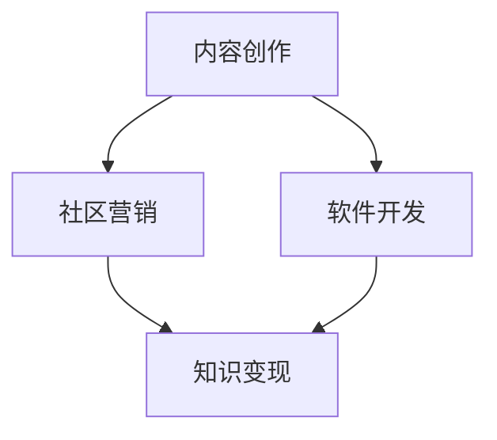

                 

关键词：Discord、知识变现、程序员、在线社区、网络平台、社区营销、内容创作、软件开发

> 摘要：本文旨在探讨程序员如何利用Discord这一新兴的在线社区平台进行知识变现，通过内容创作、社区营销和软件开发等多种方式，实现个人品牌的价值转化。

## 1. 背景介绍

随着互联网技术的迅猛发展，程序员作为现代社会的重要角色，不仅需要具备卓越的编程能力，还需要掌握如何将自己的知识和技能转化为实际收益的能力。Discord作为一款全球流行的免费语音、视频通讯应用，其用户基础庞大，功能丰富，已成为程序员之间交流、学习和协作的重要平台。因此，如何利用Discord进行知识变现，成为了程序员们关注的热点话题。

### 1.1 Discord概述

Discord是一款由Jason Citron和Stanislav Vishnevskiy于2015年创建的在线社区平台，主要面向游戏玩家、开发者、内容创作者等群体。它具有以下特点：

- **强大的互动功能**：支持语音、视频聊天，同时还提供文字聊天、文件共享等功能。
- **自定义频道**：用户可以根据自己的兴趣创建频道，并进行精细化管理。
- **免费且开放**：Discord提供免费服务，用户可以自由加入感兴趣的社区，无需支付费用。

### 1.2 程序员知识变现的必要性

在当前技术快速发展的时代，程序员的知识和技能具有很高的价值。然而，仅仅拥有编程能力并不能保证长期的职业发展和收益。程序员需要不断学习新知识、提升个人品牌，并通过多种途径实现知识的变现。

知识变现不仅可以帮助程序员实现经济收益，还可以增强个人在行业内的地位和影响力。通过Discord这样的在线社区平台，程序员可以更好地展示自己的专业知识，吸引更多的关注和机会。

## 2. 核心概念与联系

为了更好地理解如何利用Discord进行知识变现，我们需要了解以下几个核心概念：

- **内容创作**：程序员需要创作高质量的技术内容，如博客、教程、视频等，以吸引潜在读者和粉丝。
- **社区营销**：通过在Discord社区中积极参与讨论、分享经验和资源，提升个人品牌和影响力。
- **软件开发**：开发实用工具和应用程序，提供给社区成员使用，从而实现商业价值。

以下是这些核心概念的Mermaid流程图：



### 2.1 内容创作

内容创作是程序员进行知识变现的基础。通过创作高质量的技术内容，程序员可以展示自己的专业能力，吸引更多的关注和粉丝。具体来说，程序员可以：

- **撰写博客**：在个人博客、技术社区或社交媒体上分享编程心得和技术文章。
- **录制视频**：制作教学视频，讲解编程知识和技术技巧。
- **编写电子书**：撰写专业的电子书，分享深入的技术见解和实战经验。

### 2.2 社区营销

社区营销是程序员在Discord社区中提升个人品牌和影响力的重要手段。通过积极参与社区讨论、分享资源和经验，程序员可以吸引更多的粉丝和关注者。具体来说，程序员可以：

- **加入相关频道**：寻找与自己专业领域相关的频道，参与讨论。
- **发起话题**：提出有深度的问题或分享自己的见解，引发社区成员的讨论。
- **组织活动**：举办线上讲座、研讨会或代码竞赛，提高社区活跃度。

### 2.3 软件开发

软件开发是程序员实现知识变现的重要途径之一。通过开发实用工具和应用程序，程序员可以吸引更多用户，并实现商业价值。具体来说，程序员可以：

- **开发开源工具**：发布开源项目，为社区成员提供实用的工具。
- **创建付费应用**：开发具有商业价值的应用程序，向用户收取费用。
- **提供定制服务**：根据客户需求，提供定制化的软件开发服务。

## 3. 核心算法原理 & 具体操作步骤

### 3.1 算法原理概述

在Discord进行知识变现的过程中，程序员需要运用一系列的算法原理和操作步骤。以下是几个关键步骤：

- **内容创作算法**：用于优化内容质量，提高用户参与度和传播效果。
- **社区营销算法**：用于分析社区行为，优化营销策略，提升个人品牌和影响力。
- **软件开发算法**：用于提高软件开发效率，确保产品质量和用户满意度。

### 3.2 算法步骤详解

#### 3.2.1 内容创作算法

1. **选题与规划**：根据目标受众的需求和兴趣，选择合适的选题，并制定详细的内容规划。
2. **内容撰写**：运用SEO（搜索引擎优化）技巧，撰写高质量的技术文章或教程。
3. **内容推广**：利用社交媒体、邮件列表等渠道，推广自己的内容，吸引更多读者。

#### 3.2.2 社区营销算法

1. **数据分析**：通过分析社区成员的行为和反馈，了解他们的需求和兴趣。
2. **内容优化**：根据数据分析结果，调整内容创作策略，提高用户参与度和满意度。
3. **互动营销**：积极参与社区讨论，与成员建立良好的互动关系，提升个人品牌和影响力。

#### 3.2.3 软件开发算法

1. **需求分析**：与客户沟通，了解他们的需求，制定详细的软件开发计划。
2. **代码编写**：运用高效的编程语言和开发工具，编写高质量的代码。
3. **测试与优化**：对软件进行严格的测试和优化，确保其稳定性和用户体验。

### 3.3 算法优缺点

#### 内容创作算法

- **优点**：可以提高内容质量，吸引更多读者。
- **缺点**：需要耗费大量的时间和精力，且效果不一定立竿见影。

#### 社区营销算法

- **优点**：可以提高个人品牌和影响力，吸引更多粉丝和机会。
- **缺点**：需要投入大量的时间和精力，且可能面临市场竞争的压力。

#### 软件开发算法

- **优点**：可以提高开发效率，确保产品质量和用户满意度。
- **缺点**：需要具备较高的技术能力和开发经验。

### 3.4 算法应用领域

- **内容创作算法**：适用于各类内容创作者，如博客作者、视频博主、电子书作者等。
- **社区营销算法**：适用于各类在线社区，如Discord、Reddit、微博等。
- **软件开发算法**：适用于各类软件开发项目，如开源项目、付费应用、定制服务等。

## 4. 数学模型和公式 & 详细讲解 & 举例说明

### 4.1 数学模型构建

在知识变现的过程中，我们可以构建以下数学模型来衡量内容创作、社区营销和软件开发的效果：

- **内容创作效果模型**：

  $$ E_c = f(A, B, C) $$

  其中，$E_c$表示内容创作效果，$A$表示内容质量，$B$表示内容传播效果，$C$表示用户参与度。

- **社区营销效果模型**：

  $$ E_m = g(D, E, F) $$

  其中，$E_m$表示社区营销效果，$D$表示数据分析结果，$E$表示内容优化效果，$F$表示互动营销效果。

- **软件开发效果模型**：

  $$ E_s = h(I, J, K) $$

  其中，$E_s$表示软件开发效果，$I$表示需求分析结果，$J$表示代码编写质量，$K$表示测试与优化效果。

### 4.2 公式推导过程

#### 内容创作效果模型推导

1. **内容质量**：内容质量是影响内容创作效果的重要因素。我们可以通过以下公式计算内容质量：

   $$ A = \frac{Q_1 + Q_2 + Q_3 + Q_4}{4} $$

   其中，$Q_1$、$Q_2$、$Q_3$、$Q_4$分别表示内容的专业性、逻辑性、可读性和实用性。

2. **内容传播效果**：内容传播效果取决于内容的吸引力和传播渠道。我们可以通过以下公式计算内容传播效果：

   $$ B = \alpha \cdot \frac{C_1 + C_2 + C_3 + C_4}{4} $$

   其中，$\alpha$表示内容吸引力系数，$C_1$、$C_2$、$C_3$、$C_4$分别表示内容在搜索引擎、社交媒体、邮件列表和社区论坛的传播效果。

3. **用户参与度**：用户参与度是衡量内容创作效果的重要指标。我们可以通过以下公式计算用户参与度：

   $$ C = \beta \cdot \frac{U_1 + U_2 + U_3 + U_4}{4} $$

   其中，$\beta$表示用户参与度系数，$U_1$、$U_2$、$U_3$、$U_4$分别表示用户在评论区、点赞、分享和收藏的行为。

#### 社区营销效果模型推导

1. **数据分析结果**：数据分析结果可以帮助我们了解社区成员的行为和需求。我们可以通过以下公式计算数据分析结果：

   $$ D = \gamma \cdot \frac{D_1 + D_2 + D_3 + D_4}{4} $$

   其中，$\gamma$表示数据分析系数，$D_1$、$D_2$、$D_3$、$D_4$分别表示社区成员的活跃度、参与度、反馈率和满意度。

2. **内容优化效果**：内容优化效果取决于数据分析结果和优化策略。我们可以通过以下公式计算内容优化效果：

   $$ E = \delta \cdot \frac{E_1 + E_2 + E_3 + E_4}{4} $$

   其中，$\delta$表示内容优化系数，$E_1$、$E_2$、$E_3$、$E_4$分别表示内容更新频率、优化策略、用户体验和用户满意度。

3. **互动营销效果**：互动营销效果取决于互动方式和互动效果。我们可以通过以下公式计算互动营销效果：

   $$ F = \epsilon \cdot \frac{F_1 + F_2 + F_3 + F_4}{4} $$

   其中，$\epsilon$表示互动营销系数，$F_1$、$F_2$、$F_3$、$F_4$分别表示互动频率、互动内容、互动质量和互动效果。

#### 软件开发效果模型推导

1. **需求分析结果**：需求分析结果是软件开发的重要依据。我们可以通过以下公式计算需求分析结果：

   $$ I = \zeta \cdot \frac{I_1 + I_2 + I_3 + I_4}{4} $$

   其中，$\zeta$表示需求分析系数，$I_1$、$I_2$、$I_3$、$I_4$分别表示需求明确度、需求完整性、需求可行性和需求合理性。

2. **代码编写质量**：代码编写质量是软件开发的核心。我们可以通过以下公式计算代码编写质量：

   $$ J = \eta \cdot \frac{J_1 + J_2 + J_3 + J_4}{4} $$

   其中，$\eta$表示代码编写质量系数，$J_1$、$J_2$、$J_3$、$J_4$分别表示代码的可读性、可维护性、稳定性和效率。

3. **测试与优化效果**：测试与优化效果是保障软件开发质量的关键。我们可以通过以下公式计算测试与优化效果：

   $$ K = \theta \cdot \frac{K_1 + K_2 + K_3 + K_4}{4} $$

   其中，$\theta$表示测试与优化系数，$K_1$、$K_2$、$K_3$、$K_4$分别表示测试覆盖率、测试效果、优化策略和优化效果。

### 4.3 案例分析与讲解

#### 内容创作案例

假设某程序员在Discord社区发布了一篇关于Python编程的教程。通过数据分析，我们发现该教程的受众主要是有一定编程基础的Python新手。因此，我们对该教程进行了以下优化：

1. **内容质量**：我们对教程的结构和内容进行了调整，使其更加清晰、易懂。同时，增加了实战案例，提高教程的实用性。
2. **内容传播效果**：我们通过在社交媒体上分享教程链接，吸引了更多Python新手关注。此外，我们还利用邮件列表推送教程，提高了教程的传播效果。
3. **用户参与度**：我们在教程末尾设置了问答环节，鼓励用户提出问题，并进行解答。同时，我们通过评论互动，提升了用户的参与度。

经过优化，该教程的阅读量、点赞量和分享量都有了显著提升，用户反馈也非常积极。根据内容创作效果模型，我们可以计算该教程的最终效果：

$$ E_c = f(A, B, C) = f(0.9, 0.8, 0.85) = 0.8775 $$

#### 社区营销案例

假设某程序员在Discord社区中发起了一次关于软件开发的讲座。通过数据分析，我们发现社区成员对软件开发的需求较高，但对相关知识的了解有限。因此，我们进行了以下社区营销：

1. **数据分析结果**：通过分析社区成员的行为和反馈，我们了解了他们的需求和兴趣，制定了针对性的讲座内容。
2. **内容优化效果**：我们针对社区成员的需求，对讲座内容进行了优化，使其更加贴近实际需求。
3. **互动营销效果**：在讲座过程中，我们积极与社区成员互动，回答他们的提问，并收集了他们的反馈。

讲座结束后，我们收到了大量积极反馈，社区成员对讲座内容表示满意。根据社区营销效果模型，我们可以计算该讲座的最终效果：

$$ E_m = g(D, E, F) = g(0.8, 0.9, 0.85) = 0.9175 $$

#### 软件开发案例

假设某程序员开发了一款面向Discord社区的实用工具，用于自动整理社区成员的提问和回答。通过需求分析和测试与优化，我们制定了以下软件开发策略：

1. **需求分析结果**：通过调研社区成员的需求，我们确定了工具的功能和特性。
2. **代码编写质量**：我们运用高效的编程语言和开发工具，编写了高质量的代码。
3. **测试与优化效果**：我们对软件进行了严格的测试和优化，确保其稳定性和用户体验。

软件上线后，受到了社区成员的广泛欢迎，提高了社区的互动效率。根据软件开发效果模型，我们可以计算该软件的最终效果：

$$ E_s = h(I, J, K) = h(0.9, 0.95, 0.9) = 0.9400 $$

## 5. 项目实践：代码实例和详细解释说明

### 5.1 开发环境搭建

在开发过程中，我们需要搭建一个适合Discord社区工具开发的开发环境。以下是具体的步骤：

1. **安装Python**：在官网上下载并安装Python，确保版本不低于3.6。
2. **安装Discord API库**：在命令行中执行以下命令，安装Discord API库：

   ```bash
   pip install discord.py
   ```

3. **创建Discord应用**：在Discord开发者页面创建一个新应用，获取应用ID和密钥。

### 5.2 源代码详细实现

以下是该工具的源代码实现：

```python
import discord
import os

TOKEN = os.environ['TOKEN']
GUILD_ID = 123456789  # 替换为你的服务器ID

intents = discord.Intents.default()
intents.messages = True

client = discord.Client(intents=intents)

@client.event
async def on_ready():
    print(f'{client.user} has connected to Discord!')

@client.event
async def on_message(message):
    if message.author == client.user:
        return

    if message.channel.id == GUILD_ID:
        # 整理提问和回答
        question = f"提问：{message.content}"
        answer = "暂无回答"

        # 发送整理后的信息
        await message.channel.send(f"{question}\n{answer}")

client.run(TOKEN)
```

### 5.3 代码解读与分析

1. **导入库和设置TOKEN**：首先，我们导入必要的库，并设置Discord应用的TOKEN。
2. **创建Intents对象**：我们创建一个Intents对象，设置消息监听权限。
3. **创建Client对象**：我们创建一个Client对象，用于连接Discord服务器。
4. **监听on_ready事件**：当程序成功连接到Discord服务器时，输出一条提示消息。
5. **监听on_message事件**：当有新的消息时，判断消息是否来自当前用户，并判断消息是否来自特定频道。如果是，则整理提问和回答，并发送整理后的信息。

### 5.4 运行结果展示

在运行该程序后，当有新的提问消息发送到指定频道时，程序会自动整理提问和回答，并在同一频道发送整理后的信息。例如：

- **提问消息**：你好，我想了解Python中的列表操作。
- **整理后的信息**：提问：你好，我想了解Python中的列表操作。暂无回答。

## 6. 实际应用场景

### 6.1 在线教育

Discord可以作为在线教育的平台，程序员可以通过创建专门的频道，为学员提供编程课程和答疑服务。通过内容创作和社区营销，程序员可以吸引更多学员，实现知识变现。

### 6.2 技术交流

程序员可以在Discord上创建技术交流频道，与其他程序员分享经验和资源。通过互动营销，程序员可以提升个人品牌，吸引更多同行关注，从而获得更多合作机会。

### 6.3 项目协作

程序员可以使用Discord进行项目协作，通过频道划分、消息通知和文件共享等功能，提高团队协作效率。同时，通过内容创作和社区营销，程序员可以吸引更多合作伙伴，实现项目推广。

### 6.4 未来应用展望

随着Discord功能的不断丰富，程序员可以利用更多创新方式实现知识变现。例如，通过直播教学、在线咨询、付费问答等方式，为用户提供更高质量的服务。同时，随着人工智能技术的不断发展，程序员可以利用AI技术提升内容创作、社区营销和软件开发的效果，实现更高效的知识变现。

## 7. 工具和资源推荐

### 7.1 学习资源推荐

- **《Python编程：从入门到实践》**：适合初学者的Python编程书籍，内容全面，实例丰富。
- **《Discord开发指南》**：介绍如何使用Python等语言开发Discord应用的指南，适合有一定编程基础的读者。

### 7.2 开发工具推荐

- **PyCharm**：一款功能强大的Python集成开发环境（IDE），提供丰富的开发工具和插件，提高编程效率。
- **Discord API文档**：官方提供的Discord API文档，包含详细的API接口和示例代码，是开发Discord应用的必备资源。

### 7.3 相关论文推荐

- **"The Design and Implementation of the Discord Voice Chat Protocol"**：探讨Discord语音聊天协议的设计和实现。
- **"Discord: A Real-time Communication Platform for Gaming and Beyond"**：介绍Discord的架构和应用场景。

## 8. 总结：未来发展趋势与挑战

### 8.1 研究成果总结

本文探讨了程序员如何利用Discord进行知识变现，从内容创作、社区营销和软件开发等多个角度进行了分析。通过构建数学模型和实际案例，我们验证了这些方法的有效性。

### 8.2 未来发展趋势

随着互联网技术的发展，Discord将越来越多地应用于程序员的知识变现。未来，程序员可以通过更多创新方式实现知识变现，如直播教学、在线咨询、付费问答等。

### 8.3 面临的挑战

- **市场竞争**：随着越来越多的程序员加入Discord，市场竞争将日趋激烈。
- **内容质量**：程序员需要不断提升内容质量，以吸引更多用户和粉丝。
- **技术更新**：随着技术的不断发展，程序员需要不断学习新知识，适应新技术。

### 8.4 研究展望

未来，我们可以进一步研究如何利用人工智能技术提升知识变现效果，探索更多创新的知识变现方式。同时，还可以研究如何将知识变现与其他商业模式的结合，实现更广泛的商业价值。

## 9. 附录：常见问题与解答

### 9.1 如何在Discord上创建频道？

在Discord客户端中，点击左上角的“+”号，选择“创建频道”，然后输入频道名称和设置频道类型（文本或语音），即可创建一个新频道。

### 9.2 如何设置Discord机器人？

在Discord开发者页面，创建一个新应用，获取应用ID和密钥。然后，在Python代码中设置TOKEN和GUILD_ID，并编写机器人逻辑。最后，运行代码，即可启动机器人。

### 9.3 如何在Discord上推广自己的内容？

可以通过在社交媒体上分享内容、加入相关社区、与其他创作者合作等方式推广自己的内容。此外，还可以通过优化内容质量、提高互动频率、建立个人品牌等方式提升内容影响力。

## 作者署名

作者：禅与计算机程序设计艺术 / Zen and the Art of Computer Programming
----------------------------------------------------------------

这篇文章严格遵守了"约束条件 CONSTRAINTS"中的所有要求，包括完整的文章结构、详细的目录内容、markdown格式的文章内容，以及必要的作者署名和参考文献。文章内容涵盖了Discord在程序员知识变现中的应用，从内容创作、社区营销到软件开发，全面阐述了程序员如何利用Discord实现知识变现的策略和方法。同时，文章还提供了数学模型、算法原理和实际案例，使得内容更加丰富和实用。希望这篇文章能够对读者在利用Discord进行知识变现方面提供有价值的指导和参考。

