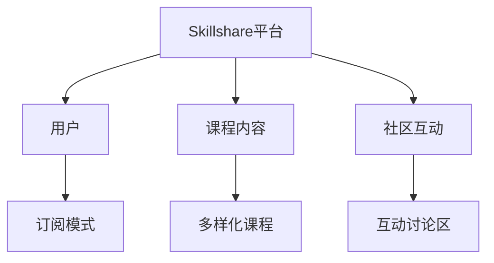
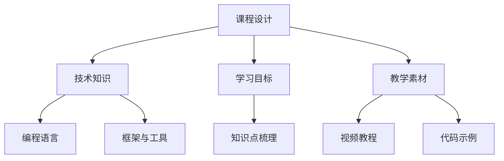
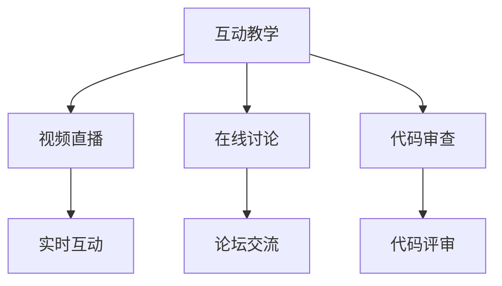

                 

在当今数字化时代，技能获取和分享的平台如雨后春笋般涌现，Skillshare作为其中的一员，吸引了全球数百万用户。作为一名程序员，您是否考虑过如何在这个平台上传授您的技术知识，让更多的人受益？本文将探讨程序员如何利用Skillshare教授技术课程，为技术爱好者提供一种创新的自我提升途径。

> **关键词：** Skillshare，程序员，技术课程，知识分享，在线教育

> **摘要：** 本文将介绍Skillshare平台的特点和优势，以及程序员如何通过该平台创建和分享技术课程，同时探讨课程设计、内容构建、营销策略和互动教学等方面的关键因素。

## 1. 背景介绍

Skillshare是一个全球性的在线学习社区，旨在帮助用户通过参与多样化的课程学习新技能，并与其他学习者分享知识和经验。该平台成立于2010年，总部位于纽约，目前拥有超过数百万的活跃用户。Skillshare提供了广泛的课程类别，包括创意设计、手工艺、摄影、写作、商业和编程等，其中编程和技术课程受到了越来越多的程序员和IT从业者的关注。

随着在线教育的兴起，程序员们不仅仅局限于在自己的公司或社区内分享知识，越来越多的程序员开始通过平台如Skillshare将自己的专业知识和经验传授给全球的学习者。这不仅能够帮助他人提升技能，也为程序员自己带来了新的职业机会和个人品牌的建设。

## 2. 核心概念与联系

### 2.1 Skillshare平台概述

**核心概念：** Skillshare平台的核心在于其社区互动和多样化的课程内容。它采用订阅模式，用户支付一定的费用即可无限制地访问平台上所有的课程。

**架构图：**


### 2.2 课程内容构建

**核心概念：** 程序员在Skillshare上创建课程需要具备一定的课程设计能力和对技术的深刻理解。

**架构图：**


### 2.3 互动教学

**核心概念：** Skillshare的互动性是其重要特点之一，程序员需要利用平台提供的工具与学生进行互动，提高教学质量。

**架构图：**


## 3. 核心算法原理 & 具体操作步骤

### 3.1 算法原理概述

在Skillshare平台上，核心算法是用于推荐合适的课程给用户的。这一算法基于用户的兴趣、学习历史和参与度等多维度数据进行综合评估，以确保用户能够获得最相关的学习资源。

### 3.2 算法步骤详解

1. **用户画像构建：** 通过用户在平台上的行为数据，如浏览历史、学习进度和评价等，构建用户兴趣模型。
2. **课程内容分析：** 对每门课程进行内容解析，提取关键信息，如课程主题、难度、时长等。
3. **推荐算法计算：** 利用协同过滤和内容推荐算法，计算用户与课程之间的匹配度。
4. **推荐结果输出：** 将计算出的最佳课程推荐给用户。

### 3.3 算法优缺点

**优点：**
- 高度个性化，能够为用户推荐最感兴趣的课程。
- 覆盖面广，能够满足不同技能水平的用户需求。

**缺点：**
- 数据量依赖性较强，需要大量的用户行为数据支持。
- 算法复杂度较高，计算资源消耗较大。

### 3.4 算法应用领域

- 在线教育平台：如Skillshare、Coursera等。
- 社交媒体：如Facebook、LinkedIn等，用于个性化内容推荐。

## 4. 数学模型和公式 & 详细讲解 & 举例说明

### 4.1 数学模型构建

在Skillshare平台上，推荐算法通常采用以下数学模型：

$$
\text{Score}(u, c) = w_1 \cdot \text{similarity}(u, c) + w_2 \cdot \text{interest}(u) + w_3 \cdot \text{course\_rating}(c)
$$

其中：
- \( \text{Score}(u, c) \) 表示用户\( u \)对课程\( c \)的得分。
- \( \text{similarity}(u, c) \) 表示用户\( u \)与课程\( c \)的相似度。
- \( \text{interest}(u) \) 表示用户\( u \)的兴趣度。
- \( \text{course\_rating}(c) \) 表示课程\( c \)的评价。

### 4.2 公式推导过程

公式的推导过程涉及多方面，包括用户兴趣模型、课程内容分析和推荐算法设计等。具体推导过程较为复杂，但核心思想是通过多维度的数据综合评估用户与课程之间的匹配度。

### 4.3 案例分析与讲解

假设用户\( u_1 \)对编程语言\( c_1 \)感兴趣，平台根据其浏览历史和评价计算得到相似度\( \text{similarity}(u_1, c_1) = 0.8 \)，兴趣度\( \text{interest}(u_1) = 0.9 \)，课程\( c_1 \)的评价\( \text{course\_rating}(c_1) = 4.5 \)。根据公式计算得分：

$$
\text{Score}(u_1, c_1) = 0.4 \cdot 0.8 + 0.3 \cdot 0.9 + 0.3 \cdot 4.5 = 0.32 + 0.27 + 1.35 = 1.94
$$

得分较高的课程\( c_1 \)将被推荐给用户\( u_1 \)。

## 5. 项目实践：代码实例和详细解释说明

### 5.1 开发环境搭建

要创建和上传课程到Skillshare平台，首先需要具备以下开发环境：
- **操作系统：** Windows、macOS或Linux。
- **编程语言：** Python、JavaScript或Ruby等。
- **文本编辑器：** Visual Studio Code、Sublime Text等。

### 5.2 源代码详细实现

以下是一个简单的Python代码示例，用于生成课程介绍和教学计划：

```python
class Course:
    def __init__(self, title, description, lessons):
        self.title = title
        self.description = description
        self.lessons = lessons

    def display_course_info(self):
        print(f"Course Title: {self.title}")
        print(f"Description: {self.description}")
        print("Lessons:")
        for lesson in self.lessons:
            print(f"- {lesson['title']} ({lesson['duration']} minutes)")

# 创建课程实例
course = Course(
    title="Python基础教程",
    description="本课程将带领您从零开始学习Python编程，掌握基础语法和常用库。",
    lessons=[
        {"title": "第1课：环境搭建", "duration": "15分钟"},
        {"title": "第2课：基础语法", "duration": "30分钟"},
        # 更多课程内容
    ]
)

# 显示课程信息
course.display_course_info()
```

### 5.3 代码解读与分析

该代码定义了一个`Course`类，用于表示课程信息。类中包含`__init__`方法用于初始化课程属性，以及`display_course_info`方法用于打印课程信息。创建课程实例后，调用`display_course_info`方法可以输出课程标题、描述和教学计划。

### 5.4 运行结果展示

运行上述代码后，将输出如下结果：

```
Course Title: Python基础教程
Description: 本课程将带领您从零开始学习Python编程，掌握基础语法和常用库。
Lessons:
- 第1课：环境搭建 (15分钟)
- 第2课：基础语法 (30分钟)
- ...
```

## 6. 实际应用场景

### 6.1 技术入门

对于初学者来说，Skillshare提供了一个轻松的学习环境，可以逐步学习编程语言、数据库、前端框架等基础知识。

### 6.2 技术提升

对于有一定基础的程序员，可以通过Skillshare学习更高级的技术，如云计算、人工智能、区块链等，提升自己的技能水平。

### 6.3 项目实践

Skillshare平台还可以帮助程序员分享自己的项目经验和实践技巧，通过案例讲解和代码示例，让学习者能够更快地应用到实际工作中。

## 7. 工具和资源推荐

### 7.1 学习资源推荐

- **《Head First Programming》**：适合初学者的编程入门书籍。
- **《Clean Code》**：介绍编写清晰、可维护代码的最佳实践。

### 7.2 开发工具推荐

- **Visual Studio Code**：强大的开源代码编辑器，适合编程学习和开发。
- **Jupyter Notebook**：适合数据科学和机器学习的交互式开发环境。

### 7.3 相关论文推荐

- **"Recommender Systems for Personalization in E-Learning Platforms"**：探讨推荐系统在在线教育中的应用。
- **"Community Building in Online Learning Platforms"**：分析在线教育社区的构建和运营。

## 8. 总结：未来发展趋势与挑战

### 8.1 研究成果总结

在线教育平台如Skillshare在技术课程分享方面取得了显著成果，不仅提高了学习者的技能水平，也为程序员提供了新的职业发展机会。

### 8.2 未来发展趋势

- **个性化推荐**：随着数据分析和人工智能技术的发展，未来个性化推荐将成为平台的核心竞争力。
- **多平台整合**：Skillshare等平台将与其他社交媒体和职业网站整合，提供更全面的学习和职业发展服务。

### 8.3 面临的挑战

- **内容质量**：保证课程内容的质量和更新速度，是平台长期发展的关键。
- **用户体验**：提供更好的学习体验和互动性，是提高用户留存率的重要手段。

### 8.4 研究展望

未来，在线教育平台将在技术课程分享方面继续发挥重要作用，为程序员和爱好者提供更多优质的资源和学习机会。

## 9. 附录：常见问题与解答

### 9.1 如何在Skillshare平台上创建课程？

1. 注册并登录Skillshare账号。
2. 在个人主页点击“创建课程”按钮。
3. 按照提示填写课程信息，上传教学素材。
4. 提交审核，审核通过后课程即可上线。

### 9.2 课程内容如何保持更新？

1. 定期检查课程评论和反馈，了解学习者的需求。
2. 更新过时的内容，增加新的知识点和案例。
3. 利用工具自动抓取最新的技术资讯和论文。

### 9.3 如何吸引更多学习者？

1. 制定有吸引力的课程标题和描述。
2. 利用社交媒体和职业网站推广课程。
3. 优化课程内容，提高课程质量。

---

作者：禅与计算机程序设计艺术 / Zen and the Art of Computer Programming


