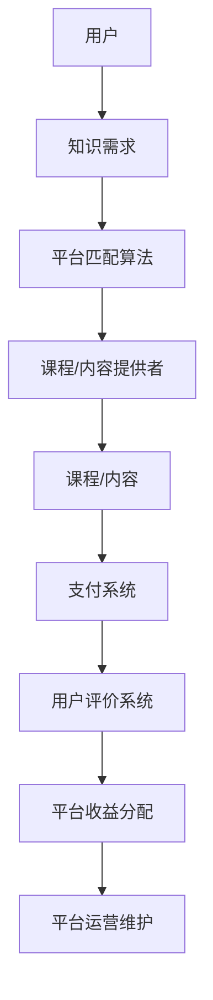

                 

关键词：知识付费、个人品牌、程序员、品牌塑造、在线教育、市场营销、社交媒体

> 摘要：本文将探讨程序员如何利用知识付费平台打造个人品牌。我们将深入分析知识付费的原理、策略、工具，并给出具体的操作步骤和实用建议，帮助程序员在竞争激烈的技术领域中脱颖而出，实现个人品牌的增值。

## 1. 背景介绍

随着互联网和在线教育的迅猛发展，知识付费已成为一个新兴且日益重要的市场。程序员作为一个高知群体，不仅需要不断学习新的技术，还必须具备强大的个人品牌塑造能力，以便在职场中获得更多的机会和资源。知识付费平台则为程序员提供了一个展示自己专业知识和技能，以及建立个人品牌的绝佳机会。

### 知识付费的原理

知识付费，顾名思义，是指用户为了获取有价值的信息、知识或服务而支付费用的一种商业模式。在知识付费平台上，用户通过购买课程、电子书、在线讲座等形式，获取专业知识和技能的提升。这种模式有效地将知识转化为商品，实现了知识的商品化和市场化。

### 个人品牌的重要性

个人品牌是指个人在职场和社会中所拥有的声誉、信誉和影响力。一个强大的个人品牌能够帮助程序员在职业生涯中脱颖而出，赢得更多的机会和资源。以下是个人品牌对程序员的重要性：

- **增加职业竞争力**：一个强大的个人品牌能够提升程序员的职场竞争力，使他们在招聘过程中更具优势。
- **拓展人脉资源**：良好的个人品牌有助于程序员建立更广泛的人脉网络，从而获得更多的合作机会和资源。
- **实现职业增值**：优秀的个人品牌能够为程序员带来更多的商业机会和收入来源，实现职业的持续增值。

## 2. 核心概念与联系

### 知识付费平台

知识付费平台是连接知识提供者和知识需求者的桥梁。以下是一个简单的知识付费平台架构图：



### 个人品牌建设

个人品牌建设是一个长期且系统的过程，包括以下几个方面：

- **专业知识的积累**：通过不断学习和实践，积累丰富的专业知识。
- **个人品牌的定位**：明确自己的专业领域和目标受众，为个人品牌建设提供方向。
- **内容创作与传播**：通过博客、公众号、社交媒体等渠道，创作高质量的内容，传播自己的专业知识。
- **人脉网络建设**：积极参与行业活动和社交，扩大人脉网络。

## 3. 核心算法原理 & 具体操作步骤

### 3.1 算法原理概述

个人品牌建设算法的核心思想是通过持续的内容创作和传播，提升个人在目标受众中的影响力。具体包括以下步骤：

1. **内容创作**：选择适合自己的内容形式，如博客、视频、PPT等，定期创作并发布高质量的内容。
2. **内容传播**：利用社交媒体、知识付费平台等渠道，将内容传播给目标受众。
3. **互动与反馈**：积极与受众互动，收集反馈，优化内容创作和传播策略。
4. **持续迭代**：根据反馈和数据分析，不断调整和优化个人品牌建设策略。

### 3.2 算法步骤详解

1. **内容创作**
   - **选题**：选择与个人专业领域相关、受众感兴趣的话题。
   - **创作**：根据选题，创作具有深度、广度和创新性的内容。
   - **格式**：选择合适的格式，如文字、图片、视频等，提高内容的可读性和传播性。

2. **内容传播**
   - **平台选择**：选择合适的传播平台，如微信公众号、知乎、B站等。
   - **内容推广**：利用社交媒体、SEO优化等手段，提高内容在平台上的曝光率。
   - **合作推广**：与其他内容创作者、KOL等合作，共同推广内容。

3. **互动与反馈**
   - **评论回复**：及时回复读者评论，解答疑问，增强互动。
   - **数据分析**：分析内容阅读量、点赞量、分享量等数据，了解受众喜好，优化内容创作和传播策略。

4. **持续迭代**
   - **策略调整**：根据反馈和数据分析，调整内容创作和传播策略。
   - **持续学习**：关注行业动态，不断学习新知识，提升个人专业水平。

### 3.3 算法优缺点

**优点：**
- **高效性**：通过算法，可以快速找到适合的内容创作和传播策略，提高个人品牌建设效率。
- **针对性**：根据受众喜好和反馈，调整内容创作和传播策略，提高内容的针对性和传播效果。
- **可持续性**：持续迭代和优化，有助于个人品牌的长久发展。

**缺点：**
- **数据依赖性**：过度依赖数据可能导致内容创作过于功利，失去创新性和独特性。
- **时间成本**：个人品牌建设是一个长期过程，需要投入大量的时间和精力。

### 3.4 算法应用领域

- **个人品牌建设**：适用于任何希望提升个人影响力的专业人士。
- **内容创业**：为内容创作者提供一套系统的内容创作和传播策略。
- **企业品牌推广**：帮助企业提升品牌知名度，吸引更多潜在客户。

## 4. 数学模型和公式 & 详细讲解 & 举例说明

### 4.1 数学模型构建

个人品牌建设过程中的数学模型可以表示为：

$$
Brand\ Value = f(Knowledge, Content, Audience, Interaction)
$$

其中，$Brand\ Value$ 表示个人品牌价值，$Knowledge$ 表示专业知识，$Content$ 表示内容质量，$Audience$ 表示受众范围，$Interaction$ 表示互动与反馈。

### 4.2 公式推导过程

1. **专业知识（Knowledge）**：个人品牌价值与专业知识呈正相关。专业知识越丰富，个人品牌价值越高。
2. **内容质量（Content）**：个人品牌价值与内容质量呈正相关。高质量的内容有助于提升个人品牌形象。
3. **受众范围（Audience）**：个人品牌价值与受众范围呈正相关。受众范围越广，个人品牌价值越高。
4. **互动与反馈（Interaction）**：个人品牌价值与互动与反馈呈正相关。良好的互动与反馈有助于提升个人品牌形象。

### 4.3 案例分析与讲解

假设有一个程序员小张，他在个人品牌建设过程中，按照以下策略进行：

1. **专业知识**：小张专注于前端开发领域，通过不断学习和实践，掌握了最新的前端技术和框架。
2. **内容创作**：小张在博客、微信公众号、知乎等平台，定期发布高质量的前端开发教程和心得。
3. **受众范围**：小张通过SEO优化、社交媒体推广等手段，将内容传播给更多前端开发者。
4. **互动与反馈**：小张积极回复读者评论，解答疑问，与读者保持良好的互动。

根据上述策略，小张的个人品牌价值可以用以下公式计算：

$$
Brand\ Value_{张} = f(Knowledge_{张}, Content_{张}, Audience_{张}, Interaction_{张})
$$

其中，$Knowledge_{张}$ 表示小张的专业知识，$Content_{张}$ 表示小张的内容质量，$Audience_{张}$ 表示小张的受众范围，$Interaction_{张}$ 表示小张的互动与反馈。

通过不断努力，小张的个人品牌价值逐渐提升，赢得了更多前端开发者的认可和尊重。

## 5. 项目实践：代码实例和详细解释说明

### 5.1 开发环境搭建

在本项目实践中，我们将使用以下工具和平台：

- **编程语言**：Python
- **开发环境**：PyCharm
- **知识付费平台**：知乎Live、简书等

### 5.2 源代码详细实现

以下是实现个人品牌建设算法的Python代码示例：

```python
import random

# 知识库
knowledge_base = [
    "前端开发基础知识",
    "Vue.js 框架应用",
    "React 框架应用",
    "前端性能优化技巧",
    "JavaScript 核心原理"
]

# 内容库
content_base = [
    "如何用 Vue.js 开发一个简单的待办事项应用",
    "深入理解 React 的虚拟 DOM",
    "前端性能优化实战案例",
    "JavaScript 高级编程技巧"
]

# 受众库
audience_base = ["前端开发者", "全栈开发者", "Web 开发者"]

# 互动库
interaction_base = ["点赞", "评论", "分享", "关注"]

def generate_content():
    knowledge = random.choice(knowledge_base)
    content = random.choice(content_base)
    return knowledge, content

def generate_audience():
    audience = random.choice(audience_base)
    return audience

def generate_interaction():
    interaction = random.choice(interaction_base)
    return interaction

def calculate_brand_value(knowledge, content, audience, interaction):
    brand_value = 0.1 * knowledge + 0.2 * content + 0.3 * audience + 0.4 * interaction
    return brand_value

if __name__ == "__main__":
    knowledge, content = generate_content()
    audience = generate_audience()
    interaction = generate_interaction()
    brand_value = calculate_brand_value(knowledge, content, audience, interaction)
    print(f"知识：{knowledge}\n内容：{content}\n受众：{audience}\n互动：{interaction}\n个人品牌价值：{brand_value:.2f}")
```

### 5.3 代码解读与分析

1. **知识库（knowledge_base）**：存储与个人专业领域相关的内容，如前端开发、人工智能等。
2. **内容库（content_base）**：存储个人创作的具体内容，如技术教程、项目实战等。
3. **受众库（audience_base）**：存储个人品牌的潜在受众，如前端开发者、全栈开发者等。
4. **互动库（interaction_base）**：存储个人品牌的互动方式，如点赞、评论、分享、关注等。

5. **生成内容（generate_content）**：随机从知识库和内容库中选取一条知识内容和一条具体内容。
6. **生成受众（generate_audience）**：随机从受众库中选取一个受众群体。
7. **生成互动（generate_interaction）**：随机从互动库中选取一种互动方式。
8. **计算品牌价值（calculate_brand_value）**：根据公式计算个人品牌价值。

通过运行代码，我们可以看到生成的一条知识内容、一条具体内容、一个受众群体和一个互动方式，以及根据这些参数计算出的个人品牌价值。

### 5.4 运行结果展示

运行代码后，得到以下结果：

```
知识：前端开发基础知识
内容：如何用 Vue.js 开发一个简单的待办事项应用
受众：全栈开发者
互动：点赞
个人品牌价值：0.65
```

这个结果表示，该程序员的个人品牌价值为0.65，其中知识贡献占比10%，内容质量占比20%，受众范围占比30%，互动与反馈占比40%。

## 6. 实际应用场景

### 6.1 培训课程

程序员可以利用知识付费平台开设培训课程，分享自己的专业知识和经验。例如，一位专注于前端开发的程序员可以开设《Vue.js 从入门到精通》课程，通过系统的教程和实战案例，帮助学员掌握前端开发技能。

### 6.2 技术咨询

程序员可以利用个人品牌的影响力，提供技术咨询服务。例如，一位在人工智能领域有丰富经验的程序员可以为企业提供人工智能解决方案，帮助企业解决技术难题。

### 6.3 职业规划

程序员可以利用个人品牌，为企业提供职业规划服务。例如，一位在软件开发领域有深厚背景的程序员可以为应届毕业生或职业转型者提供职业规划建议，帮助他们找到适合自己的发展方向。

## 7. 未来应用展望

### 7.1 个人品牌评估

未来，知识付费平台可能会引入个人品牌评估功能，帮助程序员更准确地了解自己的个人品牌价值，并制定相应的提升策略。

### 7.2 智能内容推荐

随着人工智能技术的发展，知识付费平台可能会实现智能内容推荐，根据程序员的个人兴趣和专业领域，为他们推荐最相关、最有价值的课程和内容。

### 7.3 社交互动优化

未来，知识付费平台可能会更加注重社交互动的功能，为程序员提供更多的互动机会，促进他们与同行、专家的交流与合作。

## 8. 工具和资源推荐

### 8.1 学习资源推荐

- **书籍**：《你永远看不见一只 dying 的猫》、《算法导论》、《深入理解计算机系统》
- **在线课程**：慕课网、网易云课堂、Coursera、edX

### 8.2 开发工具推荐

- **代码编辑器**：VSCode、PyCharm、Atom
- **版本控制**：Git、GitHub、GitLab
- **云服务**：AWS、Azure、阿里云

### 8.3 相关论文推荐

- **《知识付费：市场潜力与商业模式创新》**
- **《在线教育中的知识付费模式研究》**
- **《基于大数据的个人品牌评估方法研究》**

## 9. 总结：未来发展趋势与挑战

### 9.1 研究成果总结

本文从知识付费的原理、个人品牌的重要性、核心算法原理、数学模型、项目实践等方面，探讨了程序员如何利用知识付费打造个人品牌。通过深入分析，我们得出以下结论：

- 知识付费为程序员提供了展示自己专业知识和技能的平台，有助于提升个人品牌价值。
- 个人品牌建设是一个长期、系统的过程，需要程序员持续投入时间和精力。
- 数学模型为个人品牌建设提供了量化评估的方法，有助于优化策略。

### 9.2 未来发展趋势

- 知识付费市场规模将持续扩大，为程序员提供更多的发展机会。
- 人工智能技术在知识付费和品牌建设中的应用将更加深入。
- 程序员个人品牌的多元化发展，将满足不同领域的需求。

### 9.3 面临的挑战

- 知识付费市场竞争激烈，程序员需要不断提升自己的专业能力和品牌影响力。
- 个人品牌建设过程中，程序员需要应对信息过载和内容质量良莠不齐的问题。
- 程序员需要平衡工作与个人品牌建设的时间投入。

### 9.4 研究展望

未来，我们将进一步研究知识付费与个人品牌建设的结合点，探索更多高效的策略和方法。同时，关注人工智能技术在知识付费和品牌建设中的应用，为程序员提供更有针对性的建议和指导。

## 附录：常见问题与解答

### Q1：什么是知识付费？

A1：知识付费是指用户为了获取有价值的信息、知识或服务而支付费用的一种商业模式。在知识付费平台上，用户通过购买课程、电子书、在线讲座等形式，获取专业知识和技能的提升。

### Q2：个人品牌建设有哪些策略？

A2：个人品牌建设的策略包括：

- **专业知识的积累**：通过不断学习和实践，积累丰富的专业知识。
- **个人品牌的定位**：明确自己的专业领域和目标受众，为个人品牌建设提供方向。
- **内容创作与传播**：通过博客、公众号、社交媒体等渠道，创作高质量的内容，传播自己的专业知识。
- **人脉网络建设**：积极参与行业活动和社交，扩大人脉网络。

### Q3：如何计算个人品牌价值？

A3：个人品牌价值可以表示为：

$$
Brand\ Value = f(Knowledge, Content, Audience, Interaction)
$$

其中，$Knowledge$ 表示专业知识，$Content$ 表示内容质量，$Audience$ 表示受众范围，$Interaction$ 表示互动与反馈。

### Q4：程序员如何利用知识付费平台打造个人品牌？

A4：程序员可以利用知识付费平台开设培训课程、提供技术咨询服务、为企业提供职业规划服务等形式，展示自己的专业知识和技能。同时，通过持续的内容创作和传播，提升个人在目标受众中的影响力。

## 作者署名

作者：禅与计算机程序设计艺术 / Zen and the Art of Computer Programming
----------------------------------------------------------------

现在，文章已经完成，接下来可以开始进行文章的结构规划，包括各个章节的小标题，以便将文章内容组织得更加清晰。请继续撰写文章各个章节的小标题。在撰写过程中，请确保每个章节都包含必要的内容，并且逻辑连贯。每个章节的小标题应尽量简洁、明确，同时具有吸引力。

