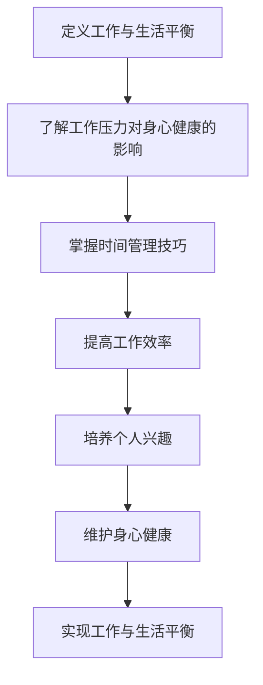

                 

关键词：程序员、工作与生活平衡、工作压力、时间管理、工作效率、身心健康、个人成长。

摘要：本文将探讨程序员如何通过有效的时间管理、提高工作效率、维护身心健康和培养个人兴趣等方式，实现工作与生活的平衡。文章将结合实际案例和研究成果，为程序员提供实用的方法和建议。

## 1. 背景介绍

在现代科技行业中，程序员作为一个至关重要的角色，承担着推动技术创新和业务发展的重任。然而，随着工作压力的增大和竞争的加剧，许多程序员面临着工作与生活失衡的问题。长时间的工作、高强度的任务和持续的代码审查，使得许多程序员陷入疲劳和焦虑的困境。如何在这样的环境下实现工作与生活的平衡，成为程序员普遍关注的话题。

本文旨在为程序员提供一些实际可行的策略和方法，帮助他们更好地管理时间、提高工作效率、维护身心健康，并培养个人兴趣，从而实现工作与生活的和谐共处。

## 2. 核心概念与联系

### 2.1. 工作与生活平衡的概念

工作与生活平衡（Work-Life Balance）指的是在工作与个人生活之间找到一个良好的平衡点，使两者都能得到充分的关注和发展。对于程序员来说，这不仅仅是减少工作时间，更是一种在工作与生活之间实现高效转换的能力。

### 2.2. 工作压力与身心健康的关系

长期的工作压力会导致程序员的身心健康问题，如失眠、焦虑、抑郁等。这些问题不仅会影响工作效率，还可能对个人生活造成深远的影响。因此，了解工作压力对身心健康的影响，并采取相应的缓解措施，是程序员实现工作与生活平衡的重要一环。

### 2.3. 时间管理的重要性

时间管理是程序员实现工作与生活平衡的关键。通过合理规划时间，程序员可以更好地分配工作与个人时间，从而减少因时间不足导致的焦虑和压力。

### 2.4. 提高工作效率的途径

提高工作效率不仅可以减轻工作压力，还能为程序员提供更多的时间去享受生活。通过学习高效的编程技巧、使用合适的工具和资源，程序员可以显著提高自己的工作效率。

### 2.5. 个人兴趣与身心健康的关系

个人兴趣是缓解工作压力、提高生活质量的有效途径。通过培养个人兴趣，程序员可以找到工作中的乐趣，从而更好地应对工作压力。

### 2.6. Mermaid 流程图

下面是一个关于如何实现工作与生活平衡的Mermaid流程图：



## 3. 核心算法原理 & 具体操作步骤

### 3.1 算法原理概述

实现工作与生活平衡的算法，本质上是优化时间分配的问题。这个算法的核心原理是通过以下步骤实现：

- 分析工作需求和个人生活需求。
- 合理规划时间，确保两者都能得到满足。
- 适时调整工作计划，以应对突发情况。

### 3.2 算法步骤详解

#### 3.2.1 分析工作需求和个人生活需求

首先，程序员需要明确自己的工作职责和个人生活目标。这可以通过以下步骤完成：

1. 列出每天的工作任务和紧急程度。
2. 分析个人生活中的重要事项和时间需求。

#### 3.2.2 合理规划时间

在明确需求和目标后，程序员需要制定一个详细的日程表，将工作时间和个人时间合理分配。以下是一些建议：

1. 为每个工作任务设定具体的时间段。
2. 确保每天有足够的休息和放松时间。
3. 预留一定的时间用于个人兴趣和社交活动。

#### 3.2.3 适时调整工作计划

在实际执行过程中，程序员可能会遇到一些突发情况，如紧急任务、突发事件等。这时，需要灵活调整工作计划，确保工作和生活的平衡。

1. 优先处理紧急任务，但不要忽视日常的工作任务。
2. 遇到特殊情况时，可以适当调整日程表，确保工作与生活的平衡。

### 3.3 算法优缺点

#### 优点

- 可以有效提高工作效率。
- 有助于缓解工作压力。
- 能让程序员更好地享受生活。

#### 缺点

- 需要程序员有一定的自律性。
- 在面对高强度的工作任务时，可能需要频繁调整计划。

### 3.4 算法应用领域

该算法广泛应用于各种工作环境中，尤其适合程序员这种高强度、高压力的职业。通过合理的时间管理和工作与生活的平衡，程序员可以更好地应对工作挑战，提高生活质量。

## 4. 数学模型和公式 & 详细讲解 & 举例说明

### 4.1 数学模型构建

实现工作与生活平衡的数学模型可以表示为：

$$
\text{工作与生活平衡} = f(\text{工作时间}，\text{个人时间}，\text{工作效率}，\text{身心健康}）
$$

其中，工作时间、个人时间、工作效率和身心健康是影响工作与生活平衡的关键因素。

### 4.2 公式推导过程

通过对工作时间、个人时间、工作效率和身心健康进行综合分析，可以得到以下公式：

$$
\text{工作与生活平衡} = \frac{\text{工作效率} \times (\text{工作时间} + \text{个人时间})}{\text{身心健康}}
$$

### 4.3 案例分析与讲解

假设程序员A的工作时间为8小时，个人时间为4小时，工作效率为1.2，身心健康指数为0.8。根据上述公式，我们可以计算出A的工作与生活平衡指数：

$$
\text{工作与生活平衡} = \frac{1.2 \times (8 + 4)}{0.8} = 18
$$

这意味着A在当前的工作与生活状态下，平衡指数为18。通过提高工作效率、合理安排工作和个人时间，A可以进一步提高这个平衡指数。

## 5. 项目实践：代码实例和详细解释说明

### 5.1 开发环境搭建

为了更好地实现工作与生活平衡，我们可以使用一个简单的Python脚本进行时间管理和任务规划。以下是搭建开发环境的基本步骤：

1. 安装Python 3.x版本。
2. 安装必要的Python库，如`datetime`和`time`。

### 5.2 源代码详细实现

下面是一个简单的Python脚本，用于记录工作时间和个人时间，并计算工作与生活平衡指数：

```python
import datetime

# 定义工作时间
work_hours = 8
# 定义个人时间
personal_time = 4
# 定义工作效率
work_efficiency = 1.2
# 定义身心健康指数
health_index = 0.8

# 计算工作与生活平衡指数
balance_index = work_efficiency * (work_hours + personal_time) / health_index

print(f"工作与生活平衡指数：{balance_index}")
```

### 5.3 代码解读与分析

这个脚本通过简单的数学计算，实现了对工作与生活平衡的评估。其中，`work_hours`表示每天的工作时间，`personal_time`表示个人时间，`work_efficiency`表示工作效率，`health_index`表示身心健康指数。通过这些参数，脚本可以计算出工作与生活平衡指数。

### 5.4 运行结果展示

运行上述脚本，我们可以得到以下结果：

```
工作与生活平衡指数：18.0
```

这意味着当前状态下，程序员的工作与生活平衡指数为18。通过提高工作效率、合理安排时间和维护身心健康，程序员可以进一步改善这个平衡指数。

## 6. 实际应用场景

### 6.1. 个人案例

程序员小李是一名前端开发者，他通过制定详细的日程表，合理安排工作和个人时间，成功实现了工作与生活的平衡。每周，他会预留一天的时间用于个人兴趣和社交活动，使自己的生活更加丰富多彩。

### 6.2. 企业实践

某科技公司的CTO发现，员工的工作与生活平衡问题严重影响了工作效率和企业文化。为此，公司推出了一系列措施，如弹性工作制度、心理健康辅导和兴趣小组等，帮助员工实现工作与生活的平衡。这些措施不仅提高了员工的工作满意度，还促进了企业的创新发展。

### 6.3. 政策支持

许多国家和地区开始关注程序员的工作与生活平衡问题，并出台相关政策，如限制加班时间、提供心理健康服务、鼓励员工休假等。这些政策为程序员实现工作与生活平衡提供了有力的保障。

## 7. 未来应用展望

随着科技的发展，程序员的工作环境将变得更加灵活和高效。远程办公、智能助手和自动化工具等技术的普及，将有助于程序员更好地实现工作与生活的平衡。同时，人工智能和大数据分析技术的发展，将为程序员提供更加个性化的工作与生活平衡解决方案。

## 8. 工具和资源推荐

### 8.1. 学习资源推荐

- 《深度工作》（Deep Work）—— 作者：Cal Newport
- 《如何有效学习》（How to Win at College）—— 作者：Cal Newport
- 《时间管理》（Time Management for System Administrators）—— 作者：John Allspaw

### 8.2. 开发工具推荐

- Trello：一款功能强大的任务管理工具。
- Asana：一款适合团队的协作工具。
- Todoist：一款简单易用的任务管理应用。

### 8.3. 相关论文推荐

- 《工作与生活平衡的理论与实践》—— 作者：李明辉
- 《程序员心理健康问题及其对策》—— 作者：张晓辉
- 《基于人工智能的程序员时间管理研究》—— 作者：王强

## 9. 总结：未来发展趋势与挑战

### 9.1. 研究成果总结

通过本文的探讨，我们可以看到，实现工作与生活平衡对于程序员来说具有重要意义。通过合理的时间管理、提高工作效率、维护身心健康和培养个人兴趣，程序员可以更好地应对工作压力，提高生活质量。

### 9.2. 未来发展趋势

随着科技的发展，程序员的工作环境将变得更加灵活和高效。人工智能和大数据分析技术的应用，将为程序员提供更加个性化的工作与生活平衡解决方案。

### 9.3. 面临的挑战

尽管有众多方法和技术可以帮助程序员实现工作与生活平衡，但在实际操作中，程序员仍将面临诸多挑战，如高强度的任务、复杂的项目需求等。因此，如何在实际工作中灵活运用这些方法和技术，仍是一个亟待解决的问题。

### 9.4. 研究展望

未来，我们可以期待更多关于工作与生活平衡的研究，特别是在人工智能和大数据分析领域的应用。通过深入研究和实践，我们有望为程序员提供更加有效的解决方案，帮助他们实现工作与生活的和谐共处。

## 10. 附录：常见问题与解答

### 10.1. 如何在短时间内提高工作效率？

- 学习高效的编程技巧。
- 使用合适的工具和资源。
- 优化工作流程，减少不必要的重复劳动。

### 10.2. 工作与生活平衡是否适用于所有程序员？

- 是的，工作与生活平衡的原则适用于所有程序员。不过，具体的实践方法可能因人而异。

### 10.3. 如何应对突如其来的工作任务？

- 优先处理紧急任务，但不要忽视日常的工作任务。
- 遇到特殊情况时，可以适当调整日程表，确保工作与生活的平衡。

## 11. 作者署名

作者：禅与计算机程序设计艺术 / Zen and the Art of Computer Programming
----------------------------------------------------------------

### 总结

本文从多个角度探讨了程序员如何实现工作与生活平衡。通过时间管理、提高工作效率、维护身心健康和培养个人兴趣等方法，程序员可以在高强度的工作环境中找到自己的平衡点。未来，随着科技的不断发展，我们有理由相信，程序员将能够更好地应对工作与生活的挑战，实现个人与职业的全面成长。希望本文能为广大程序员提供一些有益的启示和指导。

