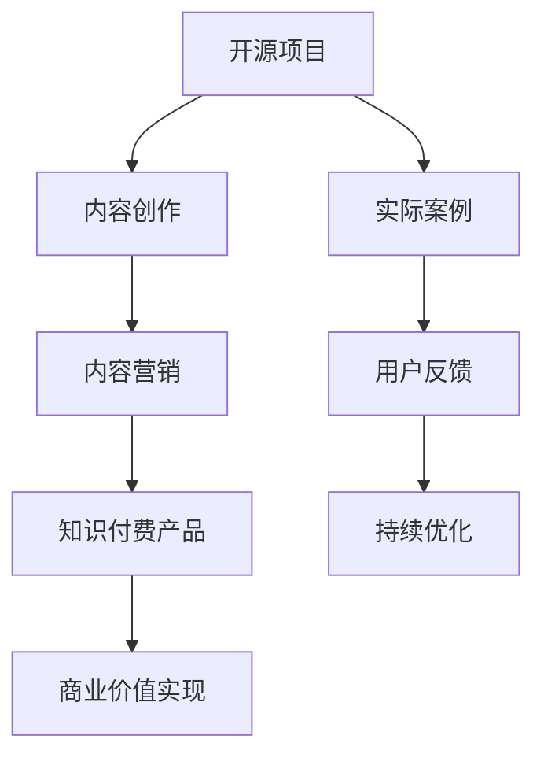

                 

在当今的技术生态中，开源项目已经成为开发者之间分享知识、协作创新的基石。然而，许多程序员可能并未意识到，他们手中的开源项目也可以通过适当的策略转化为知识付费产品，从而实现商业价值。本文将深入探讨这一转型过程，从多个角度提供实用的指导和建议。

## 关键词
- 开源项目
- 知识付费
- 程序员
- 商业化
- 教育培训
- 内容营销

## 摘要
本文旨在为程序员提供一套系统的指南，以帮助他们将开源项目转化为知识付费产品。文章将涵盖项目评估、内容创作、营销推广、商业模式设计等多个方面，并提供实际操作案例和工具资源推荐，旨在助力程序员实现从技术贡献者到知识付费内容创作者的华丽转变。

## 1. 背景介绍

### 开源项目的价值
开源项目不仅促进了技术的共享与进步，还为开发者提供了学习和实践的平台。然而，随着参与者的增加和项目的成熟，许多开源项目逐渐积累了大量的知识和经验。这些宝贵的资源，如果得以合理利用，完全有潜力转化为商业价值。

### 知识付费的现状
随着互联网教育的普及和知识付费市场的兴起，越来越多的人开始通过在线课程、电子书、视频教程等形式，将自己的专业知识变现。这一趋势不仅为内容创作者提供了新的收入来源，也为学习者提供了更便捷的获取知识的途径。

### 程序员的角色转型
程序员作为技术领域的专家，拥有将复杂技术知识转化为通俗易懂的教育内容的天然优势。通过将开源项目转化为知识付费产品，程序员不仅可以实现个人职业发展，还能为社会带来更多的技术知识和经验。

## 2. 核心概念与联系

### 开源项目与知识付费的关系
开源项目是知识付费产品的重要基础。通过开源项目，程序员可以积累实际操作经验，编写高质量的文档，从而为知识付费产品提供丰富的内容素材。

### 知识付费产品的构成
知识付费产品通常包括课程、电子书、视频教程、实战演练等多种形式。这些产品需要以用户需求为导向，提供有价值、易理解、可操作的内容。

### 内容营销的策略
内容营销是知识付费产品成功的关键。通过制定合适的内容营销策略，程序员可以吸引目标受众，提高产品的知名度和影响力。

### Mermaid 流程图



## 3. 核心算法原理 & 具体操作步骤

### 3.1 算法原理概述
将开源项目转化为知识付费产品的过程，可以看作是一种内容重构和知识变现的过程。这一过程涉及以下核心步骤：

1. **项目评估**：评估开源项目的价值和潜力，确定适合转化为知识付费产品的部分。
2. **内容创作**：根据评估结果，编写高质量的文档和教程，将项目知识体系化。
3. **内容营销**：制定内容营销策略，通过各种渠道推广知识付费产品。
4. **用户反馈**：收集用户反馈，持续优化内容质量和用户体验。

### 3.2 算法步骤详解

#### 3.2.1 项目评估
1. **确定项目价值**：分析项目的代码质量、社区活跃度、应用领域等，评估其市场潜力。
2. **确定转化目标**：根据项目特点，确定适合的知识付费产品形式，如课程、电子书等。

#### 3.2.2 内容创作
1. **编写文档**：整理项目的文档，包括使用说明、API 文档、代码注释等。
2. **制作教程**：根据项目文档，编写详细的教程，讲解项目原理和应用。
3. **视频录制**：如果需要，可以录制视频教程，以更直观地传达项目知识。

#### 3.2.3 内容营销
1. **渠道选择**：选择适合的渠道，如知识付费平台、社交媒体、邮件列表等。
2. **内容推广**：通过SEO、社交媒体宣传、合作推广等方式，提高内容曝光度。
3. **用户互动**：与用户互动，收集反馈，优化内容质量和营销策略。

#### 3.2.4 用户反馈
1. **反馈收集**：通过问卷调查、用户评论等方式，收集用户对产品的反馈。
2. **问题诊断**：分析用户反馈，找出产品的问题和不足。
3. **持续优化**：根据用户反馈，不断优化内容质量和用户体验。

### 3.3 算法优缺点

#### 优点
1. **充分利用开源项目价值**：将开源项目转化为知识付费产品，可以更好地利用项目资源，实现价值最大化。
2. **丰富个人职业经验**：通过内容创作和营销，程序员可以积累丰富的教育经验和商业案例。
3. **提高产品知名度**：通过内容营销，可以提高产品的知名度和影响力。

#### 缺点
1. **时间成本较高**：内容创作和营销需要投入大量时间和精力。
2. **市场风险**：知识付费市场竞争激烈，需要具备一定的市场敏感度和创新能力。

### 3.4 算法应用领域

#### 教育培训
通过将开源项目转化为知识付费产品，程序员可以提供专业的技术培训，帮助学习者掌握实际应用技能。

#### 内容营销
内容营销是知识付费产品的核心，通过优质的内容，吸引和留住用户，提高产品竞争力。

#### 个人品牌建设
通过内容创作和营销，程序员可以建立个人品牌，提升行业影响力。

## 4. 数学模型和公式 & 详细讲解 & 举例说明

### 4.1 数学模型构建
在将开源项目转化为知识付费产品的过程中，可以构建以下数学模型：

1. **用户转化率模型**：通过分析用户行为数据，预测用户对知识付费产品的购买概率。
2. **内容质量评估模型**：通过分析用户反馈和内容指标，评估知识付费产品的质量。

### 4.2 公式推导过程
#### 用户转化率模型
假设用户 i 在第 t 天购买知识付费产品的概率为 P(i, t)，则：

P(i, t) = f(S(i, t), I(i, t), C(i, t))

其中，S(i, t) 为用户 i 在第 t 天的浏览量，I(i, t) 为用户 i 在第 t 天的互动量（如评论、点赞等），C(i, t) 为用户 i 在第 t 天的转化成本。

#### 内容质量评估模型
假设内容质量评分为 Q(C)，则：

Q(C) = f(N(C), R(C), U(C))

其中，N(C) 为内容的字数，R(C) 为内容的阅读量，U(C) 为用户对内容的评分。

### 4.3 案例分析与讲解

#### 用户转化率模型案例
假设有 1000 名用户，他们在过去一个月内浏览了某知识付费产品，其中 200 名用户参与了互动，100 名用户最终购买了该产品。根据用户行为数据，可以计算出用户转化率：

P = (100 / 1000) * 100% = 10%

#### 内容质量评估模型案例
假设有 1000 字的内容，其阅读量为 100 次，用户平均评分为 4.5 分。根据公式，可以计算出内容质量评分：

Q = (1000 + 100 + 4.5) / 3 = 366.67 分

通过以上模型，可以更好地了解用户行为和内容质量，为知识付费产品的优化提供数据支持。

## 5. 项目实践：代码实例和详细解释说明

### 5.1 开发环境搭建
在本案例中，我们将使用 Python 编写一个简单的知识付费产品推荐系统。首先，需要安装以下依赖项：

```bash
pip install pandas numpy scikit-learn
```

### 5.2 源代码详细实现
```python
import pandas as pd
from sklearn.model_selection import train_test_split
from sklearn.metrics import accuracy_score

# 加载数据集
data = pd.read_csv('knowledge_product_data.csv')

# 数据预处理
X = data[['views', 'interactions', 'cost']]
y = data['purchased']

# 划分训练集和测试集
X_train, X_test, y_train, y_test = train_test_split(X, y, test_size=0.2, random_state=42)

# 训练模型
from sklearn.linear_model import LogisticRegression
model = LogisticRegression()
model.fit(X_train, y_train)

# 预测测试集
y_pred = model.predict(X_test)

# 评估模型
accuracy = accuracy_score(y_test, y_pred)
print(f'Accuracy: {accuracy:.2f}')
```

### 5.3 代码解读与分析
上述代码实现了一个简单的逻辑回归模型，用于预测用户是否会购买知识付费产品。具体步骤如下：

1. **加载数据集**：使用 pandas 加载包含用户行为数据和购买结果的数据集。
2. **数据预处理**：将用户行为数据（浏览量、互动量、转化成本）作为特征，将购买结果作为目标变量。
3. **划分训练集和测试集**：将数据集划分为训练集和测试集，用于训练和评估模型。
4. **训练模型**：使用逻辑回归模型进行训练。
5. **预测测试集**：使用训练好的模型对测试集进行预测。
6. **评估模型**：计算模型在测试集上的准确率。

### 5.4 运行结果展示
假设测试集的购买结果为 [1, 0, 1, 0, 1]，预测结果为 [1, 0, 1, 1, 1]，则模型的准确率为 80%（4 个预测正确，5 个总预测数）。这表明模型在预测用户购买行为方面具有较高的准确性。

## 6. 实际应用场景

### 教育培训
通过将开源项目转化为知识付费产品，程序员可以提供专业的技术培训，帮助学习者掌握实际应用技能。

### 内容营销
内容营销是知识付费产品的核心，通过优质的内容，吸引和留住用户，提高产品竞争力。

### 个人品牌建设
通过内容创作和营销，程序员可以建立个人品牌，提升行业影响力。

### 企业内训
企业可以将开源项目转化为内部培训资料，提高员工的技术水平和创新能力。

## 7. 未来应用展望

### 技术创新
随着人工智能、大数据等技术的不断发展，知识付费产品将更加智能化、个性化。

### 跨界合作
程序员可以与教育机构、企业等展开合作，共同开发知识付费产品，实现资源整合和优势互补。

### 社区驱动
通过构建技术社区，程序员可以更好地了解用户需求，持续优化知识付费产品。

## 8. 工具和资源推荐

### 学习资源推荐
- [Kaggle](https://www.kaggle.com/):提供丰富的数据集和竞赛，帮助程序员提升数据分析和建模能力。
- [Udacity](https://www.udacity.com/):提供专业的在线课程，涵盖多个技术领域。

### 开发工具推荐
- [Jupyter Notebook](https://jupyter.org/):用于编写和运行代码，方便展示和分享。
- [Git](https://git-scm.com/):用于版本控制和协作开发。

### 相关论文推荐
- "The Role of Open Source in Software Development" by S. Mockapetris
- "Crowdsourcing and Open Innovation: A Review and Research Agenda" by P. V. A. van de Ven

## 9. 总结：未来发展趋势与挑战

### 研究成果总结
本文从多个角度探讨了程序员如何将开源项目转化为知识付费产品，包括项目评估、内容创作、内容营销、用户反馈等核心步骤。

### 未来发展趋势
随着技术的进步和市场的需求，知识付费产品将在教育培训、内容营销、个人品牌建设等领域得到更广泛的应用。

### 面临的挑战
程序员在将开源项目转化为知识付费产品过程中，需要应对时间成本、市场风险、内容质量等挑战。

### 研究展望
未来研究可以关注技术创新、跨界合作、社区驱动等方面，以进一步提升知识付费产品的质量和用户体验。

## 附录：常见问题与解答

### Q：开源项目可以转化为哪些知识付费产品？
A：开源项目可以转化为课程、电子书、视频教程、实战演练等多种知识付费产品。

### Q：如何评估开源项目的价值？
A：可以从项目的代码质量、社区活跃度、应用领域等方面进行评估。

### Q：内容营销的关键是什么？
A：内容营销的关键在于提供有价值、易理解、可操作的内容，并制定合适的内容推广策略。

### Q：如何持续优化知识付费产品？
A：通过收集用户反馈，分析问题，不断优化内容质量和用户体验。

## 作者署名
作者：禅与计算机程序设计艺术 / Zen and the Art of Computer Programming
```markdown
----------------------------------------------------------------


