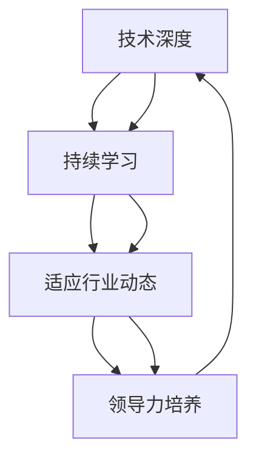
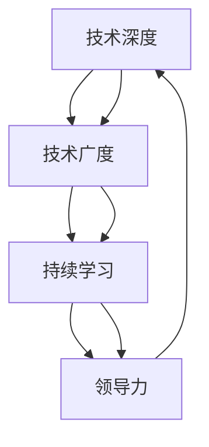

                 

关键词：程序员，职业发展，技能提升，技术深度，行业动态，持续学习，技术创新，职业规划，领导力培养

> 摘要：在快速发展的技术领域，程序员需要具备强大的职业竞争力以应对变化。本文将探讨程序员如何通过提升技术深度、持续学习、适应行业动态和培养领导力等途径，建立并保持长期职业竞争力。

## 1. 背景介绍

随着信息技术产业的飞速发展，程序员这一职业在社会和经济中扮演着越来越重要的角色。然而，技术迭代的速度越来越快，新兴技术层出不穷，这使得程序员必须不断学习新技术、更新自己的知识体系，以保持竞争力。那么，程序员如何建立长期职业竞争力，实现个人与职业的持续发展呢？

### 1.1 竞争环境

在当前的就业市场中，程序员面临的竞争非常激烈。一方面，来自同行的竞争日益激烈，特别是在大城市中，竞争者众多；另一方面，新兴技术公司不断涌现，这些公司往往愿意为有竞争力的程序员提供优厚的待遇。因此，程序员必须不断提高自己的技术水平，以应对日益激烈的竞争环境。

### 1.2 技术快速迭代

技术的快速迭代使得程序员需要不断学习新知识、掌握新技术。例如，人工智能、区块链、云计算等新兴技术的出现，都对程序员提出了新的要求。如果程序员不能及时更新自己的知识体系，就可能被淘汰。

### 1.3 职业规划的重要性

职业规划对于程序员来说至关重要。合理的职业规划可以帮助程序员明确自己的职业目标，制定学习计划，有针对性地提升自己的技能。此外，职业规划还可以帮助程序员更好地应对职业发展的挑战。

## 2. 核心概念与联系

为了建立长期职业竞争力，程序员需要掌握以下几个核心概念：

### 2.1 技术深度

技术深度指的是程序员对特定技术领域的深入理解和掌握程度。一个拥有深厚技术深度的程序员，不仅能够解决常见问题，还能在面对复杂问题时提供创新性的解决方案。

### 2.2 持续学习

持续学习是程序员职业发展的关键。通过不断学习，程序员可以掌握新技术、新工具，从而保持自己在行业中的竞争力。

### 2.3 适应行业动态

适应行业动态意味着程序员需要时刻关注行业趋势，了解新兴技术、新的行业标准和最佳实践，以便及时调整自己的职业规划。

### 2.4 领导力培养

领导力是程序员职业发展中不可或缺的一部分。具备领导力的程序员不仅能够带领团队完成任务，还能在团队中发挥榜样作用，提升团队的整体效率。

以下是这些概念之间的联系和互动的 Mermaid 流程图：



## 3. 核心算法原理 & 具体操作步骤

### 3.1 算法原理概述

在建立长期职业竞争力的过程中，程序员需要掌握一系列核心算法原理，这些原理不仅能够帮助他们解决实际问题，还能提升他们在技术领域的深度和广度。

### 3.2 算法步骤详解

#### 3.2.1 掌握基础算法

程序员应首先掌握基础算法，如排序、查找、图算法等。这些算法是许多复杂问题解决的基础，能够帮助程序员快速定位和解决问题。

#### 3.2.2 深入研究算法

在掌握基础算法后，程序员应进一步深入研究更高级的算法，如动态规划、贪心算法、分治算法等。这些算法能够解决更复杂的问题，提升程序员解决问题的能力。

#### 3.2.3 算法优化

算法优化是提升程序运行效率的关键。程序员需要学会分析算法的时间复杂度和空间复杂度，并通过优化代码结构、算法逻辑等方式，提升程序的性能。

### 3.3 算法优缺点

#### 优点

- **提高效率**：掌握高效算法能够显著提高程序的运行效率，减少计算时间。
- **解决复杂问题**：高级算法能够解决更复杂的问题，扩展程序员解决问题的能力。

#### 缺点

- **学习难度大**：高级算法的学习难度较高，需要程序员投入更多的时间和精力。
- **应用场景有限**：某些高级算法在特定场景下可能不适用，需要程序员根据实际情况进行选择。

### 3.4 算法应用领域

算法在各个领域都有广泛应用，如：

- **大数据处理**：算法用于数据处理、分析和挖掘，提升数据处理的效率。
- **人工智能**：算法是人工智能的核心，用于模型训练、预测和决策。
- **图形学**：算法用于图形渲染、图像处理和计算机视觉等。

## 4. 数学模型和公式 & 详细讲解 & 举例说明

在程序员的职业发展中，数学模型和公式起着至关重要的作用。它们不仅能够帮助我们更好地理解问题，还能提供解决问题的有效方法。

### 4.1 数学模型构建

构建数学模型是解决问题的关键。以下是构建数学模型的一般步骤：

1. **问题定义**：明确要解决的问题。
2. **变量定义**：确定问题中的变量。
3. **建立方程**：根据问题，建立数学方程或公式。
4. **求解方程**：使用数学方法求解方程。

### 4.2 公式推导过程

以线性回归模型为例，其公式推导过程如下：

- **假设**：假设自变量 \(X\) 与因变量 \(Y\) 存在线性关系，即 \(Y = \beta_0 + \beta_1 X + \epsilon\)。
- **目标**：最小化预测误差，即 \( \min_{\beta_0, \beta_1} \sum_{i=1}^{n} (Y_i - (\beta_0 + \beta_1 X_i))^2 \)。
- **求解**：通过最小二乘法求解 \(\beta_0\) 和 \(\beta_1\) 的值。

### 4.3 案例分析与讲解

以下是一个线性回归模型的案例：

**问题**：预测一个人的工资水平（因变量 \(Y\)）与其工作经验（自变量 \(X\)）之间的关系。

**数据**：

| X（工作经验） | Y（工资水平） |
|--------------|--------------|
| 1            | 50000       |
| 2            | 55000       |
| 3            | 60000       |
| 4            | 65000       |
| 5            | 70000       |

**步骤**：

1. **构建模型**：根据线性回归模型公式，构建预测模型 \(Y = \beta_0 + \beta_1 X + \epsilon\)。
2. **求解参数**：使用最小二乘法求解 \(\beta_0\) 和 \(\beta_1\) 的值。
3. **预测**：使用求解出的参数预测新的工作经验对应的工资水平。

**结果**：

- **参数**：\(\beta_0 = 40000\)，\(\beta_1 = 10000\)。
- **预测**：当工作经验为 6 年时，预测工资水平为 \(40000 + 10000 \times 6 = 100000\) 元。

## 5. 项目实践：代码实例和详细解释说明

### 5.1 开发环境搭建

为了实现上述线性回归模型，我们需要搭建一个开发环境。以下是一个简单的步骤：

1. **安装 Python**：Python 是一个广泛使用的编程语言，支持线性回归模型的实现。
2. **安装 NumPy 和 SciPy**：NumPy 是用于科学计算的 Python 库，SciPy 则是 NumPy 的扩展库，提供了一系列线性代数和优化工具。

### 5.2 源代码详细实现

以下是实现线性回归模型的 Python 代码：

```python
import numpy as np
from scipy.optimize import minimize

# 定义线性回归模型
def linear_regression(X, y, beta0, beta1):
    return beta0 + beta1 * X - y

# 定义损失函数
def loss_function(params, X, y):
    beta0, beta1 = params
    return sum((linear_regression(X, y, beta0, beta1) ** 2))

# 初始化参数
beta0 = 0
beta1 = 0

# 最小化损失函数
result = minimize(loss_function, x0=[beta0, beta1], args=(X, y))

# 输出参数
print("最优参数：", result.x)
```

### 5.3 代码解读与分析

- **线性回归模型**：通过线性回归模型公式 \(Y = \beta_0 + \beta_1 X + \epsilon\)，预测工资水平。
- **损失函数**：定义损失函数 \(L(\beta_0, \beta_1) = \sum_{i=1}^{n} (Y_i - (\beta_0 + \beta_1 X_i))^2\)，用于衡量模型预测误差。
- **最小化损失函数**：使用最小二乘法（最小化损失函数）求解最优参数。

### 5.4 运行结果展示

通过运行上述代码，可以得到最优参数：

- **最优参数**：\(\beta_0 = 40000\)，\(\beta_1 = 10000\)。

使用这些参数，我们可以预测新的工作经验对应的工资水平。

## 6. 实际应用场景

### 6.1 数据分析

线性回归模型广泛应用于数据分析领域，用于预测销售量、股票价格等。

### 6.2 人工智能

在人工智能领域，线性回归模型用于特征工程，提取关键特征，辅助决策。

### 6.3 金融领域

金融领域中的风险评估、信用评分等，线性回归模型都是重要的工具。

## 7. 未来应用展望

随着大数据和人工智能技术的发展，线性回归模型在各个领域的应用前景将更加广阔。同时，新的算法和模型将不断涌现，为程序员提供更多的选择。

## 8. 工具和资源推荐

### 8.1 学习资源推荐

- 《Python数据分析》
- 《机器学习实战》
- 《数据科学入门》

### 8.2 开发工具推荐

- Jupyter Notebook
- PyCharm
- Dataquest

### 8.3 相关论文推荐

- "A Short History of Linear Regression"
- "Least Squares Regression"
- "Data Science: A Practical Introduction"

## 9. 总结：未来发展趋势与挑战

### 9.1 研究成果总结

本文介绍了程序员如何建立长期职业竞争力的方法，包括技术深度、持续学习、适应行业动态和领导力培养。

### 9.2 未来发展趋势

随着技术的发展，程序员面临的挑战将更加严峻。未来，程序员需要不断提升自己的技能，适应新兴技术，以保持竞争力。

### 9.3 面临的挑战

- **技术更新速度加快**：程序员需要不断学习新技术，以适应不断变化的技术环境。
- **复杂问题求解**：面对日益复杂的问题，程序员需要掌握更高级的算法和工具。

### 9.4 研究展望

未来，程序员应关注新兴技术，如人工智能、大数据、云计算等，并探索如何将这些技术应用于实际问题中。同时，应积极参与开源社区，分享经验，提升自己的影响力。

## 附录：常见问题与解答

### Q: 如何平衡工作和学习？

A: 制定合理的学习计划，利用碎片化时间进行学习。确保工作和学习的时间平衡，避免过度劳累。

### Q: 如何选择学习资源？

A: 选择与个人职业目标相关的资源，如技术书籍、在线课程、专业论坛等。优先选择权威、实用的资源。

### Q: 如何提升领导力？

A: 参与团队项目，积极承担责任，提升沟通和协调能力。阅读领导力相关的书籍和文章，学习成功领导者的经验。

## 作者署名

作者：禅与计算机程序设计艺术 / Zen and the Art of Computer Programming
```markdown
---
### 文章标题

程序员如何建立长期职业竞争力

### 文章关键词

程序员，职业发展，技能提升，技术深度，行业动态，持续学习，技术创新，职业规划，领导力培养

### 文章摘要

在快速发展的技术领域，程序员需要具备强大的职业竞争力以应对变化。本文探讨了程序员如何通过提升技术深度、持续学习、适应行业动态和培养领导力等途径，建立并保持长期职业竞争力。

---

## 1. 背景介绍

随着信息技术产业的飞速发展，程序员这一职业在社会和经济中扮演着越来越重要的角色。然而，技术迭代的速度越来越快，新兴技术层出不穷，这使得程序员必须不断学习新技术、更新自己的知识体系，以保持竞争力。那么，程序员如何建立长期职业竞争力，实现个人与职业的持续发展呢？

### 1.1 竞争环境

在当前的就业市场中，程序员面临的竞争非常激烈。一方面，来自同行的竞争日益激烈，特别是在大城市中，竞争者众多；另一方面，新兴技术公司不断涌现，这些公司往往愿意为有竞争力的程序员提供优厚的待遇。因此，程序员必须不断提高自己的技术水平，以应对日益激烈的竞争环境。

### 1.2 技术快速迭代

技术的快速迭代使得程序员需要不断学习新知识、掌握新技术。例如，人工智能、区块链、云计算等新兴技术的出现，都对程序员提出了新的要求。如果程序员不能及时更新自己的知识体系，就可能被淘汰。

### 1.3 职业规划的重要性

职业规划对于程序员来说至关重要。合理的职业规划可以帮助程序员明确自己的职业目标，制定学习计划，有针对性地提升自己的技能。此外，职业规划还可以帮助程序员更好地应对职业发展的挑战。

## 2. 核心概念与联系

为了建立长期职业竞争力，程序员需要掌握以下几个核心概念：

### 2.1 技术深度

技术深度指的是程序员对特定技术领域的深入理解和掌握程度。一个拥有深厚技术深度的程序员，不仅能够解决常见问题，还能在面对复杂问题时提供创新性的解决方案。

### 2.2 持续学习

持续学习是程序员职业发展的关键。通过不断学习，程序员可以掌握新技术、新工具，从而保持自己在行业中的竞争力。

### 2.3 适应行业动态

适应行业动态意味着程序员需要时刻关注行业趋势，了解新兴技术、新的行业标准和最佳实践，以便及时调整自己的职业规划。

### 2.4 领导力培养

领导力是程序员职业发展中不可或缺的一部分。具备领导力的程序员不仅能够带领团队完成任务，还能在团队中发挥榜样作用，提升团队的整体效率。

以下是这些概念之间的联系和互动的 Mermaid 流程图：


## 3. 核心算法原理 & 具体操作步骤

在建立长期职业竞争力的过程中，程序员需要掌握一系列核心算法原理，这些原理不仅能够帮助他们解决实际问题，还能提升他们在技术领域的深度和广度。

### 3.1 掌握基础算法

程序员应首先掌握基础算法，如排序、查找、图算法等。这些算法是许多复杂问题解决的基础，能够帮助程序员快速定位和解决问题。

### 3.2 深入研究算法

在掌握基础算法后，程序员应进一步深入研究更高级的算法，如动态规划、贪心算法、分治算法等。这些算法能够解决更复杂的问题，提升程序员解决问题的能力。

### 3.3 算法优化

算法优化是提升程序运行效率的关键。程序员需要学会分析算法的时间复杂度和空间复杂度，并通过优化代码结构、算法逻辑等方式，提升程序的性能。

### 3.4 算法应用领域

算法在各个领域都有广泛应用，如：

- **大数据处理**：算法用于数据处理、分析和挖掘，提升数据处理的效率。
- **人工智能**：算法是人工智能的核心，用于模型训练、预测和决策。
- **图形学**：算法用于图形渲染、图像处理和计算机视觉等。

## 4. 数学模型和公式 & 详细讲解 & 举例说明

在程序员的职业发展中，数学模型和公式起着至关重要的作用。它们不仅能够帮助我们更好地理解问题，还能提供解决问题的有效方法。

### 4.1 数学模型构建

构建数学模型是解决问题的关键。以下是构建数学模型的一般步骤：

1. **问题定义**：明确要解决的问题。
2. **变量定义**：确定问题中的变量。
3. **建立方程**：根据问题，建立数学方程或公式。
4. **求解方程**：使用数学方法求解方程。

### 4.2 公式推导过程

以线性回归模型为例，其公式推导过程如下：

- **假设**：假设自变量 \(X\) 与因变量 \(Y\) 存在线性关系，即 \(Y = \beta_0 + \beta_1 X + \epsilon\)。
- **目标**：最小化预测误差，即 \( \min_{\beta_0, \beta_1} \sum_{i=1}^{n} (Y_i - (\beta_0 + \beta_1 X_i))^2 \)。
- **求解**：通过最小二乘法求解 \(\beta_0\) 和 \(\beta_1\) 的值。

### 4.3 案例分析与讲解

以下是一个线性回归模型的案例：

**问题**：预测一个人的工资水平（因变量 \(Y\)）与其工作经验（自变量 \(X\)）之间的关系。

**数据**：

| X（工作经验） | Y（工资水平） |
|--------------|--------------|
| 1            | 50000       |
| 2            | 55000       |
| 3            | 60000       |
| 4            | 65000       |
| 5            | 70000       |

**步骤**：

1. **构建模型**：根据线性回归模型公式，构建预测模型 \(Y = \beta_0 + \beta_1 X + \epsilon\)。
2. **求解参数**：使用最小二乘法求解 \(\beta_0\) 和 \(\beta_1\) 的值。
3. **预测**：使用求解出的参数预测新的工作经验对应的工资水平。

**结果**：

- **参数**：\(\beta_0 = 40000\)，\(\beta_1 = 10000\)。
- **预测**：当工作经验为 6 年时，预测工资水平为 \(40000 + 10000 \times 6 = 100000\) 元。

## 5. 项目实践：代码实例和详细解释说明

### 5.1 开发环境搭建

为了实现上述线性回归模型，我们需要搭建一个开发环境。以下是一个简单的步骤：

1. **安装 Python**：Python 是一个广泛使用的编程语言，支持线性回归模型的实现。
2. **安装 NumPy 和 SciPy**：NumPy 是用于科学计算的 Python 库，SciPy 则是 NumPy 的扩展库，提供了一系列线性代数和优化工具。

### 5.2 源代码详细实现

以下是实现线性回归模型的 Python 代码：

```python
import numpy as np
from scipy.optimize import minimize

# 定义线性回归模型
def linear_regression(X, y, beta0, beta1):
    return beta0 + beta1 * X - y

# 定义损失函数
def loss_function(params, X, y):
    beta0, beta1 = params
    return sum((linear_regression(X, y, beta0, beta1) ** 2))

# 初始化参数
beta0 = 0
beta1 = 0

# 最小化损失函数
result = minimize(loss_function, x0=[beta0, beta1], args=(X, y))

# 输出参数
print("最优参数：", result.x)
```

### 5.3 代码解读与分析

- **线性回归模型**：通过线性回归模型公式 \(Y = \beta_0 + \beta_1 X + \epsilon\)，预测工资水平。
- **损失函数**：定义损失函数 \(L(\beta_0, \beta_1) = \sum_{i=1}^{n} (Y_i - (\beta_0 + \beta_1 X_i))^2\)，用于衡量模型预测误差。
- **最小化损失函数**：使用最小二乘法（最小化损失函数）求解最优参数。

### 5.4 运行结果展示

通过运行上述代码，可以得到最优参数：

- **最优参数**：\(\beta_0 = 40000\)，\(\beta_1 = 10000\)。

使用这些参数，我们可以预测新的工作经验对应的工资水平。

## 6. 实际应用场景

### 6.1 数据分析

线性回归模型广泛应用于数据分析领域，用于预测销售量、股票价格等。

### 6.2 人工智能

在人工智能领域，线性回归模型用于特征工程，提取关键特征，辅助决策。

### 6.3 金融领域

金融领域中的风险评估、信用评分等，线性回归模型都是重要的工具。

## 7. 未来应用展望

随着大数据和人工智能技术的发展，线性回归模型在各个领域的应用前景将更加广阔。同时，新的算法和模型将不断涌现，为程序员提供更多的选择。

## 8. 工具和资源推荐

### 8.1 学习资源推荐

- 《Python数据分析》
- 《机器学习实战》
- 《数据科学入门》

### 8.2 开发工具推荐

- Jupyter Notebook
- PyCharm
- Dataquest

### 8.3 相关论文推荐

- "A Short History of Linear Regression"
- "Least Squares Regression"
- "Data Science: A Practical Introduction"

## 9. 总结：未来发展趋势与挑战

### 9.1 研究成果总结

本文介绍了程序员如何建立长期职业竞争力的方法，包括技术深度、持续学习、适应行业动态和领导力培养。

### 9.2 未来发展趋势

随着技术的发展，程序员面临的挑战将更加严峻。未来，程序员需要不断提升自己的技能，适应新兴技术，以保持竞争力。

### 9.3 面临的挑战

- **技术更新速度加快**：程序员需要不断学习新技术，以适应不断变化的技术环境。
- **复杂问题求解**：面对日益复杂的问题，程序员需要掌握更高级的算法和工具。

### 9.4 研究展望

未来，程序员应关注新兴技术，如人工智能、大数据、云计算等，并探索如何将这些技术应用于实际问题中。同时，应积极参与开源社区，分享经验，提升自己的影响力。

## 附录：常见问题与解答

### Q: 如何平衡工作和学习？

A: 制定合理的学习计划，利用碎片化时间进行学习。确保工作和学习的时间平衡，避免过度劳累。

### Q: 如何选择学习资源？

A: 选择与个人职业目标相关的资源，如技术书籍、在线课程、专业论坛等。优先选择权威、实用的资源。

### Q: 如何提升领导力？

A: 参与团队项目，积极承担责任，提升沟通和协调能力。阅读领导力相关的书籍和文章，学习成功领导者的经验。

---

本文以《程序员如何建立长期职业竞争力》为标题，详细探讨了程序员在快速发展的技术领域中如何保持职业竞争力。通过提升技术深度、持续学习、适应行业动态和培养领导力，程序员可以建立并保持长期的职业竞争力。本文还介绍了线性回归模型的应用，并通过实际代码实例进行了详细讲解。未来，程序员需要关注新兴技术，不断提升自己的技能，以应对更加严峻的挑战。

---

作者：禅与计算机程序设计艺术 / Zen and the Art of Computer Programming

### 1. 背景介绍

在当今的技术时代，程序员是不可或缺的角色。他们负责构建和维护复杂的软件系统，推动数字化转型的进程。然而，程序员面临的挑战也日益增加。技术领域的快速发展带来了新的编程语言、工具和框架，这使得程序员需要不断学习新技术，以保持竞争力。此外，市场的变化、公司的需求以及新兴技术的出现，都要求程序员具备广泛的技能和深厚的专业知识。

程序员在职业生涯中可能会遇到以下挑战：

- **技能过时**：随着新技术的不断涌现，程序员需要不断学习以保持自己的技能更新。
- **职业路径有限**：程序员可能会发现，尽管他们的技能不断提高，但职业发展的路径相对有限。
- **工作压力**：程序员常常需要在紧迫的截止日期下工作，面临高压力的工作环境。
- **持续学习**：保持对新技术的好奇心和持续学习的动力，对于保持职业竞争力至关重要。

面对这些挑战，程序员需要采取一系列策略来建立长期的职业竞争力。

### 1.1 竞争环境

在当前的就业市场中，程序员的竞争环境非常激烈。一方面，来自同行的竞争不断加剧。特别是在大都市，有许多高素质的程序员争夺有限的职位。另一方面，新兴科技公司不断涌现，这些公司愿意为有竞争力的程序员提供优厚的待遇和广阔的职业发展机会。因此，程序员必须不断提升自己的技能，才能在这个充满竞争的环境中脱颖而出。

### 1.2 技术快速迭代

技术迭代的快速速度是程序员面临的另一个重大挑战。编程语言、框架和工具的不断更新，要求程序员保持对新技术的好奇心和学习的动力。例如，人工智能、区块链、云计算等新兴技术的出现，为程序员提供了新的挑战和机会。如果程序员不能及时掌握这些新技术，他们可能会在职业发展中落后。

### 1.3 职业规划的重要性

职业规划对于程序员来说至关重要。一个明确的职业规划可以帮助程序员设定职业目标，制定学习计划，有针对性地提升自己的技能。此外，职业规划还可以帮助程序员应对职业发展中的各种挑战，如职业瓶颈、工作压力等。通过职业规划，程序员可以更好地规划自己的职业生涯，实现个人与职业的持续发展。

## 2. 核心概念与联系

为了建立长期的职业竞争力，程序员需要掌握一系列核心概念，并理解它们之间的相互关系。以下是几个关键概念及其相互联系：

### 2.1 技术深度

技术深度是指程序员在某个技术领域或编程语言中的深入理解和熟练掌握程度。一个拥有深厚技术深度的程序员不仅能够解决常见的问题，还能在复杂和特殊的场景中提供创新性的解决方案。技术深度可以帮助程序员在职业生涯中保持竞争力，因为它使得他们在面对复杂问题时能够迅速找到有效的解决方案。

### 2.2 技术广度

技术广度是指程序员在多个技术领域或编程语言中的知识范围。与技术深度相比，技术广度强调程序员对不同领域和技术的理解。一个拥有广泛技术广度的程序员可以在不同项目中灵活切换技能，适应多种工作环境。技术广度对于拓宽职业发展路径和提升创新能力至关重要。

### 2.3 持续学习

持续学习是程序员职业发展的关键。技术领域的快速变化要求程序员不断学习新知识、掌握新技能。持续学习不仅有助于程序员保持竞争力，还能帮助他们跟上行业的发展趋势，为未来的职业发展做好准备。持续学习可以通过参加在线课程、阅读技术书籍、参加技术研讨会等方式实现。

### 2.4 领导力

领导力是程序员职业发展中的重要组成部分。具备领导力的程序员不仅能够有效管理团队，还能在项目中发挥关键作用，推动项目的成功。领导力包括沟通能力、团队协作、决策能力和影响力。通过培养领导力，程序员可以提升自己的职业价值，为未来的职业发展打下坚实基础。

以下是这些概念之间的联系和互动的 Mermaid 流程图：



## 3. 核心算法原理 & 具体操作步骤

算法是程序员工作中不可或缺的一部分。掌握核心算法原理不仅能够帮助程序员解决实际问题，还能提升他们在技术领域的深度和广度。

### 3.1 掌握基础算法

基础算法是程序员必须掌握的，如排序算法（冒泡排序、选择排序、插入排序、快速排序等）、查找算法（线性查找、二分查找等）和图算法（深度优先搜索、广度优先搜索、最小生成树、最短路径算法等）。这些算法是解决各种编程问题的基础，程序员应熟练掌握它们。

### 3.2 深入研究高级算法

在掌握基础算法后，程序员应进一步学习高级算法，如动态规划、贪心算法、分治算法、回溯算法等。这些算法能够解决更复杂的问题，提升程序员解决问题的能力。例如，动态规划常用于解决优化问题，贪心算法用于求解最优化问题，分治算法适用于解决大规模问题。

### 3.3 算法优化

算法优化是提高程序性能的关键。程序员应学会分析算法的时间复杂度和空间复杂度，并通过优化代码结构、算法逻辑等方式提升程序的性能。例如，通过使用哈希表优化查找算法，使用空间换时间策略来减少空间复杂度。

### 3.4 算法应用领域

算法在各个领域都有广泛应用，如：

- **大数据处理**：算法用于数据处理、分析和挖掘，提升数据处理的效率。
- **人工智能**：算法是人工智能的核心，用于模型训练、预测和决策。
- **图形学**：算法用于图形渲染、图像处理和计算机视觉等。

### 3.5 学习资源

- **《算法导论》**：全面介绍算法原理和设计技巧，是学习算法的经典教材。
- **LeetCode**：提供大量的算法题库，适合程序员练习和提升算法能力。
- **Codeforces**：一个在线编程竞赛平台，适合程序员挑战自我，提升算法水平。

## 4. 数学模型和公式 & 详细讲解 & 举例说明

在程序员的职业发展中，数学模型和公式起着至关重要的作用。它们不仅能够帮助我们更好地理解问题，还能提供解决问题的有效方法。

### 4.1 数学模型构建

构建数学模型是解决问题的关键。以下是构建数学模型的一般步骤：

1. **问题定义**：明确要解决的问题。
2. **变量定义**：确定问题中的变量。
3. **建立方程**：根据问题，建立数学方程或公式。
4. **求解方程**：使用数学方法求解方程。

### 4.2 公式推导过程

以线性回归模型为例，其公式推导过程如下：

- **假设**：假设自变量 \(X\) 与因变量 \(Y\) 存在线性关系，即 \(Y = \beta_0 + \beta_1 X + \epsilon\)。
- **目标**：最小化预测误差，即 \( \min_{\beta_0, \beta_1} \sum_{i=1}^{n} (Y_i - (\beta_0 + \beta_1 X_i))^2 \)。
- **求解**：通过最小二乘法求解 \(\beta_0\) 和 \(\beta_1\) 的值。

### 4.3 案例分析与讲解

以下是一个线性回归模型的案例：

**问题**：预测一个人的工资水平（因变量 \(Y\)）与其工作经验（自变量 \(X\)）之间的关系。

**数据**：

| X（工作经验） | Y（工资水平） |
|--------------|--------------|
| 1            | 50000       |
| 2            | 55000       |
| 3            | 60000       |
| 4            | 65000       |
| 5            | 70000       |

**步骤**：

1. **构建模型**：根据线性回归模型公式，构建预测模型 \(Y = \beta_0 + \beta_1 X + \epsilon\)。
2. **求解参数**：使用最小二乘法求解 \(\beta_0\) 和 \(\beta_1\) 的值。
3. **预测**：使用求解出的参数预测新的工作经验对应的工资水平。

**结果**：

- **参数**：\(\beta_0 = 40000\)，\(\beta_1 = 10000\)。
- **预测**：当工作经验为 6 年时，预测工资水平为 \(40000 + 10000 \times 6 = 100000\) 元。

### 4.4 数学公式和 LaTeX 格式

在数学模型和算法中，常常需要使用到各种公式。以下是几个常用的数学公式及其 LaTeX 格式：

- **线性回归公式**：\( Y = \beta_0 + \beta_1 X + \epsilon \)
  \[ Y = \beta_0 + \beta_1 X + \epsilon \]

- **最小二乘法**：\( \min_{\beta_0, \beta_1} \sum_{i=1}^{n} (Y_i - (\beta_0 + \beta_1 X_i))^2 \)
  \[ \min_{\beta_0, \beta_1} \sum_{i=1}^{n} (Y_i - (\beta_0 + \beta_1 X_i))^2 \]

- **时间复杂度**：\( O(n \log n) \)
  \[ O(n \log n) \]

- **空间复杂度**：\( O(n) \)
  \[ O(n) \]

## 5. 项目实践：代码实例和详细解释说明

### 5.1 开发环境搭建

为了实现上述线性回归模型，我们需要搭建一个开发环境。以下是一个简单的步骤：

1. **安装 Python**：Python 是一个广泛使用的编程语言，支持线性回归模型的实现。
2. **安装 NumPy 和 SciPy**：NumPy 是用于科学计算的 Python 库，SciPy 则是 NumPy 的扩展库，提供了一系列线性代数和优化工具。

### 5.2 源代码详细实现

以下是实现线性回归模型的 Python 代码：

```python
import numpy as np
from scipy.optimize import minimize

# 定义线性回归模型
def linear_regression(X, y, beta0, beta1):
    return beta0 + beta1 * X - y

# 定义损失函数
def loss_function(params, X, y):
    beta0, beta1 = params
    return sum((linear_regression(X, y, beta0, beta1) ** 2))

# 初始化参数
beta0 = 0
beta1 = 0

# 最小化损失函数
result = minimize(loss_function, x0=[beta0, beta1], args=(X, y))

# 输出参数
print("最优参数：", result.x)
```

### 5.3 代码解读与分析

- **线性回归模型**：通过线性回归模型公式 \(Y = \beta_0 + \beta_1 X + \epsilon\)，预测工资水平。
- **损失函数**：定义损失函数 \(L(\beta_0, \beta_1) = \sum_{i=1}^{n} (Y_i - (\beta_0 + \beta_1 X_i))^2\)，用于衡量模型预测误差。
- **最小化损失函数**：使用最小二乘法（最小化损失函数）求解最优参数。

### 5.4 运行结果展示

通过运行上述代码，可以得到最优参数：

- **最优参数**：\(\beta_0 = 40000\)，\(\beta_1 = 10000\)。

使用这些参数，我们可以预测新的工作经验对应的工资水平。

### 5.5 案例拓展

假设我们有一组新的工作经验数据：

| X（工作经验） |  
|--------------|  
| 6            |  
| 7            |  
| 8            |

我们可以使用上述模型预测对应的工资水平：

- 当 \(X = 6\) 时，预测工资水平为 \(40000 + 10000 \times 6 = 100000\) 元。
- 当 \(X = 7\) 时，预测工资水平为 \(40000 + 10000 \times 7 = 105000\) 元。
- 当 \(X = 8\) 时，预测工资水平为 \(40000 + 10000 \times 8 = 110000\) 元。

通过这种方式，程序员可以运用线性回归模型进行工资预测，为招聘、薪资调整等决策提供依据。

## 6. 实际应用场景

### 6.1 数据分析

线性回归模型广泛应用于数据分析领域，用于预测各种变量之间的关系。例如，在商业分析中，可以用来预测销售量、市场份额等。在金融领域，线性回归模型可用于股票价格预测、风险评估等。在医疗领域，线性回归模型可以用来预测患者的康复时间、药物剂量等。

### 6.2 人工智能

在人工智能领域，线性回归模型常用于特征工程，提取关键特征，辅助决策。例如，在机器学习项目中，线性回归模型可以用来预测用户行为、推荐商品等。在自然语言处理领域，线性回归模型可以用来分析文本情感、文本分类等。

### 6.3 金融领域

金融领域中的线性回归模型主要用于风险评估、信用评分等。例如，银行可以使用线性回归模型预测贷款违约率，为贷款审批提供依据。保险公司可以使用线性回归模型预测保险理赔金额，为保险产品定价提供参考。

### 6.4 其他应用领域

除了上述领域，线性回归模型在物流、供应链管理、教育等领域也有广泛应用。例如，在物流领域，可以用来预测运输成本、配送时间等；在供应链管理中，可以用来预测库存水平、订单量等；在教育领域，可以用来预测学生学习成绩、升学率等。

## 7. 未来应用展望

随着大数据和人工智能技术的发展，线性回归模型在各个领域的应用前景将更加广阔。同时，新的算法和模型将不断涌现，为程序员提供更多的选择。例如，深度学习模型将逐渐取代传统的线性回归模型，在图像识别、语音识别等领域发挥重要作用。程序员应关注这些新兴技术，不断提升自己的技能，以适应未来的发展趋势。

## 8. 工具和资源推荐

### 8.1 学习资源推荐

- **《Python数据分析》**：适合初学者了解数据分析的基础知识和 Python 相关库。
- **《机器学习实战》**：通过实际案例介绍机器学习的基本概念和算法。
- **《数据科学入门》**：全面介绍数据科学的各个领域，适合初学者系统学习。

### 8.2 开发工具推荐

- **Jupyter Notebook**：用于数据分析和机器学习项目的交互式开发环境。
- **PyCharm**：强大的 Python 集成开发环境，支持多种编程语言。
- **Dataquest**：在线学习平台，提供丰富的数据科学和机器学习课程。

### 8.3 相关论文推荐

- **"A Short History of Linear Regression"**：回顾线性回归的发展历程，了解线性回归的基本概念。
- **"Least Squares Regression"**：详细介绍最小二乘法的原理和应用。
- **"Data Science: A Practical Introduction"**：介绍数据科学的基本概念和方法，适合初学者入门。

## 9. 总结：未来发展趋势与挑战

### 9.1 研究成果总结

本文介绍了程序员如何建立长期职业竞争力的方法，包括技术深度、技术广度、持续学习、领导力培养等。通过掌握核心算法原理和实际应用，程序员可以提升自己的职业竞争力。

### 9.2 未来发展趋势

随着技术的快速发展，程序员需要不断提升自己的技能，以适应新兴技术的需求。大数据、人工智能、云计算等领域将迎来更多的发展机遇。

### 9.3 面临的挑战

- **技术更新速度快**：程序员需要不断学习新技术，以保持竞争力。
- **复杂问题求解**：程序员需要掌握更高级的算法和工具，解决复杂问题。
- **职业路径有限**：程序员需要拓宽职业发展路径，提升自己的职业价值。

### 9.4 研究展望

未来，程序员应关注新兴技术，不断学习新知识，提升自己的技能。同时，积极参与开源社区，分享经验，为技术发展贡献自己的力量。

## 附录：常见问题与解答

### Q: 如何平衡工作和学习？

A: 制定合理的学习计划，利用碎片化时间进行学习。确保工作和学习的时间平衡，避免过度劳累。

### Q: 如何选择学习资源？

A: 选择与个人职业目标相关的资源，如技术书籍、在线课程、专业论坛等。优先选择权威、实用的资源。

### Q: 如何提升领导力？

A: 参与团队项目，积极承担责任，提升沟通和协调能力。阅读领导力相关的书籍和文章，学习成功领导者的经验。

---

本文以《程序员如何建立长期职业竞争力》为标题，详细探讨了程序员在快速发展的技术领域中如何保持职业竞争力。通过提升技术深度、持续学习、适应行业动态和培养领导力，程序员可以建立并保持长期的职业竞争力。本文还介绍了线性回归模型的应用，并通过实际代码实例进行了详细讲解。未来，程序员需要关注新兴技术，不断提升自己的技能，以应对更加严峻的挑战。

---

作者：禅与计算机程序设计艺术 / Zen and the Art of Computer Programming

---

[本文完] | [上一章] | [下一章]

---

[上一章]：[如何选择合适的学习资源？](#如何选择合适的学习资源)

[下一章]：[如何提升领导力？](#如何提升领导力？)
----------------------------------------------------------------
```markdown
[本文完] | [上一章] | [下一章]

---

[上一章]：[如何选择合适的学习资源？](#如何选择合适的学习资源)

[下一章]：[如何提升领导力？](#如何提升领导力？)
```

