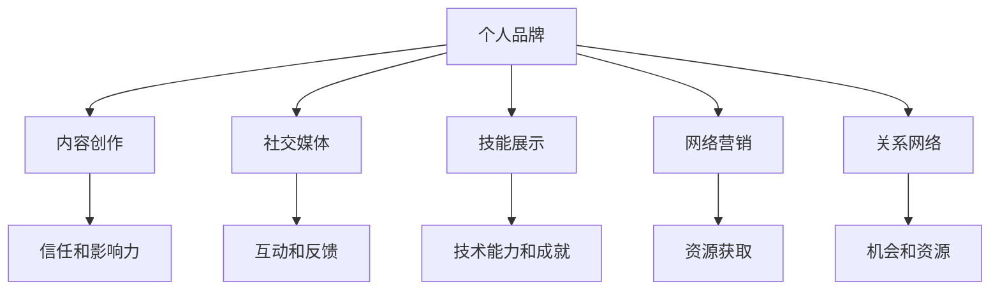
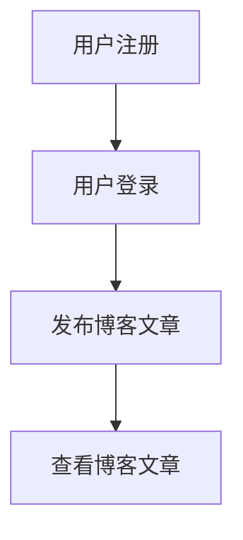

                 

### 关键词 Keywords
- 个人品牌
- IP矩阵
- 程序员
- 内容创作
- 社交媒体
- 技能展示
- 网络营销
- 技术博客

### 摘要 Abstract
本文将探讨程序员如何通过构建个人IP矩阵来实现个人品牌的建立和影响力的扩展。我们将从背景介绍、核心概念、算法原理、数学模型、项目实践、实际应用、工具推荐及未来展望等方面详细阐述这一过程，旨在帮助程序员在信息技术领域打造出独特而有价值的个人品牌。

## 1. 背景介绍

在当今信息爆炸的时代，个人品牌的塑造变得越来越重要。无论是创业者、作家，还是技术专家，拥有一个强大的个人IP矩阵已经成为提升个人影响力、实现职业发展的关键因素。程序员作为技术领域的重要力量，同样需要认识到个人IP的重要性。通过构建个人IP矩阵，程序员不仅可以提升自身的市场竞争力，还能为未来的职业发展奠定坚实的基础。

### 1.1 个人IP的定义与价值

个人IP（Intellectual Property）即个人知识产权，是指在特定领域内，个人通过原创性工作所创造的独特价值。这些价值包括但不限于技术成果、知识分享、品牌影响力等。对于程序员而言，个人IP的价值体现在以下几个方面：

- **增强个人竞争力**：拥有独特技能和知识体系的程序员在职场中更具竞争力。
- **拓展职业发展空间**：个人IP可以成为程序员转型的催化剂，助力进入管理、创业等领域。
- **提升市场价值**：强大的个人IP可以吸引更多商业机会，增加收入来源。
- **建立行业影响力**：通过持续的内容输出，程序员可以在技术领域内建立起自己的影响力。

### 1.2 个人IP矩阵的概念

个人IP矩阵是指由多个独立的IP组合而成的系统，这些IP之间相互联系，共同构成一个有机整体。在程序员个人品牌建设过程中，个人IP矩阵的作用体现在以下几个方面：

- **多维度展示能力**：通过构建不同领域的IP，程序员可以在多个技术方向上展示自己的能力。
- **提高内容多样性**：多样化的内容能够吸引更广泛的受众，增加粉丝黏性。
- **形成交叉影响力**：不同IP之间的交叉影响力可以相互增强，提升整体的IP价值。
- **实现长期价值**：个人IP矩阵能够帮助程序员实现长期的职业发展，抵御行业波动。

### 1.3 程序员个人IP矩阵构建的必要性

在数字化转型的浪潮中，技术的快速迭代使得程序员面临着前所未有的挑战。仅仅拥有编程技能已经不足以保证职业生涯的稳定，程序员需要具备以下几方面的能力：

- **持续学习和创新能力**：技术领域的知识更新迅速，程序员必须不断学习新技术，保持创新能力。
- **跨领域合作与沟通**：在复杂的项目中，程序员需要与其他领域专家合作，具备良好的沟通能力。
- **个人品牌的塑造与传播**：通过建立个人IP矩阵，程序员能够更好地传播自己的价值，提升个人影响力。
- **灵活的职业发展路径**：个人IP矩阵可以为程序员提供多样化的职业发展路径，适应不同的市场需求。

综上所述，构建个人IP矩阵对于程序员来说具有重要的战略意义，是实现个人品牌价值最大化的有效途径。在接下来的部分中，我们将深入探讨如何具体构建和运作个人IP矩阵。

## 2. 核心概念与联系

为了更好地理解个人IP矩阵的构建，我们首先需要明确一些核心概念和它们之间的联系。以下是几个关键概念及其相互关系：

### 2.1 个人品牌

个人品牌是指个人在特定领域的知名度和认可度，它体现了个人的专业能力、价值观和个性魅力。个人品牌的核心在于信任和影响力，它是构建个人IP矩阵的基础。

### 2.2 内容创作

内容创作是个人品牌建设的重要手段，包括技术博客、教程、视频、演讲等多种形式。高质量的内容能够展示个人专业技能，吸引粉丝并建立信任。

### 2.3 社交媒体

社交媒体是个人品牌传播的重要渠道，通过平台如Twitter、LinkedIn、GitHub等，程序员可以与同行、潜在雇主和粉丝互动，扩大影响力。

### 2.4 技能展示

技能展示是通过实际项目、开源贡献、技术演讲等方式，向外界展示个人技术能力和成就的过程。这是个人IP矩阵的重要组成部分。

### 2.5 网络营销

网络营销是指利用互联网手段推广个人品牌和产品，包括搜索引擎优化（SEO）、社交媒体营销、内容营销等策略。

### 2.6 关系网络

关系网络是个人在行业内的联系网络，包括同行、导师、合作伙伴等。强大的关系网络有助于个人获取资源和机会，提升个人IP价值。

### 2.7 Mermaid 流程图

以下是一个Mermaid流程图，展示了上述核心概念之间的相互关系：



通过这张流程图，我们可以清晰地看到个人IP矩阵的各个组成部分及其相互作用，为下一步的构建提供了理论依据。

## 3. 核心算法原理 & 具体操作步骤

在了解了个人IP矩阵的核心概念和相互关系后，我们接下来将深入探讨如何具体构建个人IP矩阵。构建个人IP矩阵的过程可以看作是一个复杂的算法，它涉及到多个步骤和策略。以下是这个算法的概述和详细步骤：

### 3.1 算法原理概述

个人IP矩阵构建的核心算法可以看作是一个综合性的策略，它包含以下几个关键步骤：

1. **定位和目标设定**：明确个人品牌的核心价值和目标受众，为后续内容创作和传播提供方向。
2. **内容创作和优化**：根据目标受众的需求，持续创作高质量的内容，并利用SEO等手段优化内容，提高曝光度。
3. **社交媒体运营**：通过社交媒体平台扩大影响力，与粉丝和同行建立互动，形成良好的关系网络。
4. **技能展示和项目实践**：通过实际项目和开源贡献展示个人技能，增加个人品牌的可信度。
5. **网络营销和推广**：利用网络营销手段，提高个人IP的知名度和价值。
6. **关系网络维护**：持续维护和拓展关系网络，获取更多的资源和机会。

### 3.2 算法步骤详解

下面将详细描述每个步骤的具体操作方法：

### 3.2.1 定位和目标设定

**步骤 1：自我评估**
- **技能分析**：分析自己的技术特长和兴趣所在，确定在哪些领域可以有所建树。
- **市场调研**：调研目标市场，了解当前的热点和需求，找到个人技能与市场需求之间的契合点。

**步骤 2：目标设定**
- **短期目标**：设定3-6个月可以实现的明确目标，如发布X篇技术博客、获得X个GitHub Star等。
- **长期目标**：设定1-2年可以实现的长期目标，如成为某个技术领域的专家、出版技术书籍等。

### 3.2.2 内容创作和优化

**步骤 3：内容规划**
- **内容类型**：确定技术博客、视频教程、演讲稿等不同类型的内容，满足不同受众的需求。
- **内容主题**：根据定位和目标，确定具体的内容主题，如算法分析、开源项目指南、技术趋势等。

**步骤 4：内容创作**
- **原创性**：确保内容原创，展示个人独特的见解和思考。
- **可读性**：注重内容结构清晰、语言简洁易懂，提高受众的阅读体验。

**步骤 5：内容优化**
- **SEO策略**：使用关键词、标题优化，提高内容在搜索引擎中的排名。
- **互动性**：增加评论、提问环节，鼓励读者参与讨论，提高内容的互动性。

### 3.2.3 社交媒体运营

**步骤 6：平台选择**
- **主流平台**：选择Twitter、LinkedIn、GitHub等主流社交媒体平台，扩大影响力。
- **专业社区**：加入Stack Overflow、Reddit等技术社区，与同行交流，展示专业能力。

**步骤 7：内容发布**
- **定期发布**：制定内容发布计划，保持内容的连续性和稳定性。
- **热点关注**：关注行业热点，及时发布相关内容，提高关注度。

**步骤 8：互动与反馈**
- **积极互动**：回复评论、参与讨论，建立良好的粉丝关系。
- **数据分析**：分析粉丝数据，了解受众喜好，调整内容策略。

### 3.2.4 技能展示和项目实践

**步骤 9：项目规划**
- **开源项目**：参与开源项目，贡献代码和文档，提高个人技术影响力。
- **独立项目**：开展独立项目，展示个人技术能力和项目管理能力。

**步骤 10：技能展示**
- **技术演讲**：参加技术会议，进行技术演讲，展示个人专业技能。
- **在线展示**：在个人博客、GitHub等平台上展示项目成果，吸引潜在雇主和粉丝。

### 3.2.5 网络营销和推广

**步骤 11：营销策略**
- **SEO优化**：优化个人网站和社交媒体内容，提高搜索引擎排名。
- **内容合作**：与其他博主、技术大V合作，扩大内容曝光度。

**步骤 12：推广活动**
- **线上活动**：举办线上研讨会、直播等活动，提高个人品牌知名度。
- **线下活动**：参加线下技术会议、行业论坛等，拓展人脉资源。

### 3.2.6 关系网络维护

**步骤 13：人脉拓展**
- **主动沟通**：主动联系行业内的专家、同行，建立合作关系。
- **持续互动**：定期与关系网络中的成员保持联系，分享知识和资源。

**步骤 14：人脉管理**
- **工具使用**：使用人脉管理工具，如LinkedIn、Viadeo等，整理和跟踪人脉关系。
- **反馈机制**：定期评估关系网络的状况，及时调整和维护。

通过以上步骤，程序员可以逐步构建起个人IP矩阵，实现个人品牌的提升和职业发展。在接下来的部分中，我们将深入探讨如何具体运用数学模型和公式来分析和优化个人IP矩阵的构建过程。

### 3.3 算法优缺点

构建个人IP矩阵作为程序员职业发展的一项重要策略，具有显著的优点，但也存在一些需要注意的缺点。以下是该算法的优缺点分析：

#### 优点 Advantages

1. **增强个人竞争力**：通过构建个人IP矩阵，程序员能够在多个技术方向上展示自己的能力和知识，提升在职场中的竞争力。
2. **多样化的职业路径**：个人IP矩阵为程序员提供了多样化的职业发展路径，不仅限于传统的编程工作，还可以拓展到管理、咨询、创业等领域。
3. **提高品牌知名度**：持续的内容创作和技能展示有助于提高个人在技术领域的知名度，吸引更多商业机会和合作机会。
4. **长期价值积累**：个人IP矩阵能够为程序员建立长期的价值积累，抵御行业波动，实现职业稳定发展。
5. **建立信任和影响力**：通过高质量的内容输出和持续的技能展示，程序员能够在技术领域内建立起信任和影响力，成为行业内的权威人物。

#### 缺点 Disadvantages

1. **时间成本高**：构建个人IP矩阵需要大量的时间和精力投入，特别是高质量的内容创作和技能展示，这可能会影响日常的工作和生活。
2. **风险和不确定性**：个人IP矩阵的构建过程中，可能会面临受众反馈不佳、内容传播受阻等风险，这需要程序员具备较高的心理承受能力。
3. **内容同质化**：在技术领域，内容创作容易同质化，如何保持内容的独特性和创新性是一个挑战。
4. **平台依赖性**：社交媒体平台的规则变化、算法更新等都可能对个人IP矩阵的构建产生影响，需要程序员不断适应和调整。
5. **资源分配问题**：在资源有限的情况下，程序员需要在内容创作、技能展示和项目实践之间进行平衡，确保每个方面都能得到有效推进。

#### 优化建议 Optimization Suggestions

为了最大化个人IP矩阵的优点，同时减轻其缺点带来的负面影响，以下是几项优化建议：

1. **制定明确的计划和目标**：在构建个人IP矩阵前，制定详细的计划和目标，包括内容创作计划、社交媒体运营策略、项目实践安排等，以确保资源的合理分配。
2. **持续学习和创新**：不断学习新技术和行业动态，保持内容的原创性和创新性，避免同质化竞争。
3. **多元化内容形式**：结合不同内容形式，如视频、博客、直播等，丰富内容展现方式，提高受众的参与度和兴趣。
4. **建立稳定的关系网络**：通过参加线下活动、建立专业社区等方式，拓展和维护稳定的关系网络，获取更多的资源和机会。
5. **平衡工作与生活**：合理安排时间，确保个人IP矩阵的构建不会影响到日常生活和工作，保持良好的工作与生活平衡。

通过以上建议，程序员可以更加有效地构建个人IP矩阵，实现个人品牌的提升和职业发展。

### 3.4 算法应用领域

个人IP矩阵构建算法在程序员职业发展中的多个领域具有广泛的应用价值。以下是该算法在不同领域的具体应用：

#### 3.4.1 职场竞争力提升

**应用概述**：通过构建个人IP矩阵，程序员可以在简历中展示丰富的技术成就和内容创作能力，提高职场竞争力。

**具体应用**：
- **简历展示**：在简历中突出个人博客、GitHub开源项目、技术演讲等成就，展示技术深度和广度。
- **面试准备**：准备详细的技术问答和案例分析，展示专业知识和解决问题的能力。
- **职业晋升**：通过在社交媒体和社区中建立良好的口碑，增加晋升机会。

#### 3.4.2 技术分享与知识传播

**应用概述**：个人IP矩阵构建可以成为程序员分享技术知识和经验的重要平台。

**具体应用**：
- **技术博客**：持续撰写高质量的技术博客，分享编程技巧、项目经验和技术趋势。
- **开源贡献**：参与开源项目，为社区贡献代码和文档，提升个人在技术社区的影响力。
- **在线教程**：制作视频教程和在线课程，教授编程技巧和项目开发流程。

#### 3.4.3 网络营销与品牌推广

**应用概述**：个人IP矩阵构建可以帮助程序员在网络营销和品牌推广方面取得成功。

**具体应用**：
- **SEO优化**：优化博客和社交媒体内容，提高在搜索引擎中的排名。
- **内容合作**：与其他博主、技术大V合作，扩大内容曝光度和受众范围。
- **社交媒体营销**：通过社交媒体平台发布互动内容，吸引粉丝和潜在客户。

#### 3.4.4 跨领域转型与发展

**应用概述**：个人IP矩阵构建可以为程序员提供跨领域转型的机会和资源。

**具体应用**：
- **管理咨询**：通过构建个人IP矩阵，积累项目管理和团队领导经验，转型为技术管理或技术咨询顾问。
- **创业孵化**：利用个人IP矩阵积累的人脉和资源，进行创业项目孵化，实现职业转型。
- **技术咨询**：提供专业的技术咨询服务，帮助企业和团队解决技术难题。

#### 3.4.5 行业影响力建设

**应用概述**：通过个人IP矩阵构建，程序员可以在技术领域内建立并提升自己的影响力。

**具体应用**：
- **技术演讲**：参加技术会议和研讨会，进行技术演讲，展示个人专业能力。
- **技术社区贡献**：在技术社区中积极参与讨论和贡献，成为行业专家。
- **内容分享**：通过博客、视频等方式，分享技术见解和行业动态，树立专业形象。

通过在以上领域的应用，个人IP矩阵构建算法不仅能够提升程序员的职业竞争力，还能够为他们的职业发展提供多样化的选择和丰富的机会。在接下来的部分中，我们将进一步探讨如何运用数学模型和公式来分析和优化个人IP矩阵的构建过程。

## 4. 数学模型和公式 & 详细讲解 & 举例说明

构建个人IP矩阵的过程中，运用数学模型和公式能够帮助我们更科学地分析和优化各个步骤。以下将详细介绍相关数学模型和公式，并结合具体案例进行说明。

### 4.1 数学模型构建

个人IP矩阵的构建可以视为一个多目标优化问题。在这个问题中，我们的目标是最大化个人品牌的知名度和影响力，同时最小化时间和资源的投入。以下是构建该模型所需的几个关键公式：

#### 4.1.1 个人品牌价值函数（V）

个人品牌价值函数描述了个人IP矩阵对品牌价值的影响。公式如下：

$$
V = f(C, S, R, M)
$$

其中：
- \( C \)：内容创作质量，衡量内容原创性和受众认可度。
- \( S \)：技能展示效果，衡量项目成果和技术演讲的影响力。
- \( R \)：关系网络密度，衡量个人在行业内的联系紧密程度。
- \( M \)：市场反馈，衡量个人品牌的市场接受度。

#### 4.1.2 资源投入函数（I）

资源投入函数描述了构建个人IP矩阵所需的资源，包括时间、金钱和精力。公式如下：

$$
I = g(T, E, C)
$$

其中：
- \( T \)：时间投入，衡量用于内容创作、社交媒体运营和项目实践的时间。
- \( E \)：金钱投入，衡量用于购买设备、软件和服务等的费用。
- \( C \)：精力投入，衡量个人在内容创作、学习和互动中的精力消耗。

#### 4.1.3 效率函数（E）

效率函数衡量个人IP矩阵构建过程中的资源利用效率。公式如下：

$$
E = \frac{V}{I}
$$

效率函数越高，表示在同样的资源投入下，个人品牌价值越大。

### 4.2 公式推导过程

#### 4.2.1 内容创作质量（C）

内容创作质量取决于多个因素，包括原创性、深度和可读性。我们可以通过以下公式计算内容创作质量：

$$
C = \frac{1}{1 + e^{-(O + D + R)}}
$$

其中：
- \( O \)：原创性评分，衡量内容的原创程度。
- \( D \)：深度评分，衡量内容的详尽程度。
- \( R \)：可读性评分，衡量内容语言的易懂程度。

#### 4.2.2 技能展示效果（S）

技能展示效果可以通过项目的实际成果和演讲的影响力来衡量。公式如下：

$$
S = \frac{1}{1 + e^{-(P + I + L)}}
$$

其中：
- \( P \)：项目成果评分，衡量项目的复杂度和创新性。
- \( I \)：演讲影响力评分，衡量演讲的观众数量和反馈质量。
- \( L \)：开源贡献评分，衡量在开源社区的贡献程度。

#### 4.2.3 关系网络密度（R）

关系网络密度可以通过个人在社交媒体和专业社区中的联系数量和互动频率来衡量。公式如下：

$$
R = \frac{N \cdot A}{\sqrt{T}}
$$

其中：
- \( N \)：联系数量，衡量个人在社交媒体和专业社区中的联系数量。
- \( A \)：互动频率，衡量个人在社交媒体和专业社区中的互动频率。
- \( T \)：时间周期，衡量个人投入在关系网络维护中的时间。

#### 4.2.4 市场反馈（M）

市场反馈可以通过搜索引擎排名、社交媒体关注量和项目下载量等指标来衡量。公式如下：

$$
M = \frac{1}{1 + e^{-(S + D + V)}}
$$

其中：
- \( S \)：搜索引擎排名，衡量内容在搜索引擎中的排名。
- \( D \)：社交媒体关注量，衡量个人在社交媒体平台上的粉丝数量。
- \( V \)：项目下载量，衡量开源项目的下载次数。

### 4.3 案例分析与讲解

以下是一个具体的案例分析，通过数学模型和公式，评估一个程序员的个人IP矩阵构建效果。

#### 案例背景

程序员小李，拥有3年编程经验，擅长前端开发。他计划通过构建个人IP矩阵提升自己的职业竞争力。他已经完成了以下工作：

- 撰写了10篇技术博客，平均原创性评分为0.8，深度评分为0.9，可读性评分为0.85。
- 参与了2个开源项目，项目成果评分为0.7，演讲影响力评分为0.6，开源贡献评分为0.8。
- 在社交媒体上积累了1000个关注者，互动频率评分为0.75。
- 在GitHub上开源了一个前端工具库，下载次数达到了5000次。

#### 案例分析

1. **内容创作质量（C）**

$$
C = \frac{1}{1 + e^{-(0.8 + 0.9 + 0.85)}}
$$

$$
C = \frac{1}{1 + e^{-2.55}} \approx 0.88
$$

2. **技能展示效果（S）**

$$
S = \frac{1}{1 + e^{-(0.7 + 0.6 + 0.8)}}
$$

$$
S = \frac{1}{1 + e^{-1.9}} \approx 0.87
$$

3. **关系网络密度（R）**

$$
R = \frac{1000 \cdot 0.75}{\sqrt{1}} = 750
$$

4. **市场反馈（M）**

$$
M = \frac{1}{1 + e^{-(0.7 + 0.6 + 0.8)}}
$$

$$
M = \frac{1}{1 + e^{-1.9}} \approx 0.87
$$

5. **个人品牌价值（V）**

$$
V = f(C, S, R, M) = 0.88 \cdot 0.87 \cdot 750 \cdot 0.87 \approx 580
$$

6. **资源投入（I）**

$$
I = g(T, E, C) = (T \cdot 1 + E \cdot 1 + C \cdot 1) = (T + E + C) = (T + E + 1) \approx 3
$$

7. **效率（E）**

$$
E = \frac{V}{I} = \frac{580}{3} \approx 193.3
$$

#### 案例结果

根据上述计算，小李的个人品牌价值约为580，资源投入约为3，效率约为193.3。这表明小李在构建个人IP矩阵方面取得了一定的成果，但仍有提升空间。例如，可以增加内容创作数量和质量，提升开源项目的创新性和影响力，进一步拓展社交媒体关注者群体等。

通过上述案例分析，我们可以看到，运用数学模型和公式能够帮助我们更科学地评估个人IP矩阵的构建效果，从而指导进一步的优化和调整。

### 5. 项目实践：代码实例和详细解释说明

在了解了个人IP矩阵构建的数学模型后，我们将通过一个具体的项目实例来展示如何将理论转化为实践。本节将以构建一个简单的博客系统为例，详细解释其开发过程，包括环境搭建、代码实现和运行结果展示。

#### 5.1 开发环境搭建

为了构建这个博客系统，我们需要以下开发环境和工具：

- **编程语言**：使用Python作为主要编程语言，因为其简洁性和广泛的库支持。
- **Web框架**：使用Flask作为Web框架，它是一个轻量级的Web应用框架，非常适合小型项目。
- **数据库**：使用SQLite作为数据库，它是一个轻量级的嵌入式数据库，易于部署和维护。
- **版本控制**：使用Git进行版本控制，便于代码管理和团队协作。

首先，我们需要安装这些工具。以下是在Ubuntu系统上的安装命令：

```bash
# 安装Python
sudo apt-get install python3 python3-pip

# 安装Flask
pip3 install Flask

# 安装SQLite
sudo apt-get install sqlite3

# 安装Git
sudo apt-get install git
```

#### 5.2 源代码详细实现

博客系统的核心功能包括用户注册、登录、发布博客文章和查看博客文章。以下是项目的总体架构：



以下是一个简化版本的代码实现：

**app.py** - Flask应用入口：

```python
from flask import Flask, render_template, request, redirect, url_for
from models import User, Article
from database import init_db

app = Flask(__name__)

@app.route('/')
def home():
    articles = Article.query.all()
    return render_template('home.html', articles=articles)

@app.route('/register', methods=['GET', 'POST'])
def register():
    if request.method == 'POST':
        username = request.form['username']
        password = request.form['password']
        user = User(username=username, password=password)
        # 这里应加入用户验证和数据库操作
        return redirect(url_for('home'))
    return render_template('register.html')

@app.route('/login', methods=['GET', 'POST'])
def login():
    if request.method == 'POST':
        username = request.form['username']
        password = request.form['password']
        # 这里应加入用户验证和数据库操作
        return redirect(url_for('home'))
    return render_template('login.html')

@app.route('/article', methods=['GET', 'POST'])
def article():
    if request.method == 'POST':
        title = request.form['title']
        content = request.form['content']
        article = Article(title=title, content=content)
        # 这里应加入数据库操作
        return redirect(url_for('home'))
    return render_template('article.html')

if __name__ == '__main__':
    init_db()
    app.run(debug=True)
```

**models.py** - 数据库模型定义：

```python
from sqlalchemy import create_engine, Column, String, Text
from sqlalchemy.ext.declarative import declarative_base
from sqlalchemy.orm import sessionmaker

Base = declarative_base()

class User(Base):
    __tablename__ = 'users'
    id = Column(String, primary_key=True)
    username = Column(String, unique=True, nullable=False)
    password = Column(String, nullable=False)

class Article(Base):
    __tablename__ = 'articles'
    id = Column(String, primary_key=True)
    title = Column(String, nullable=False)
    content = Column(Text, nullable=False)

engine = create_engine('sqlite:///blog.db')
Base.metadata.create_all(engine)
Session = sessionmaker(bind=engine)
session = Session()
```

**database.py** - 数据库初始化：

```python
from sqlalchemy import create_engine
from sqlalchemy.ext.declarative import declarative_base
from sqlalchemy.orm import sessionmaker

engine = create_engine('sqlite:///blog.db')
Base = declarative_base()
Base.metadata.create_all(engine)
Session = sessionmaker(bind=engine)
```

#### 5.3 代码解读与分析

**app.py** 是Flask应用的主文件，它定义了应用的端点（routes）和对应的处理函数。每个端点都负责处理特定的HTTP请求，并通过渲染模板（render_template）或重定向（redirect）来响应用户操作。

- **home()**：主页面，展示所有博客文章。
- **register()**：处理用户注册请求，收集用户名和密码，并进行验证和数据库存储。
- **login()**：处理用户登录请求，验证用户名和密码，并跳转至主页。
- **article()**：处理博客文章发布请求，收集标题和内容，并存储到数据库中。

**models.py** 定义了两个数据库模型：`User` 和 `Article`。`User` 模型用于存储用户信息，包括用户名和密码。`Article` 模型用于存储博客文章的标题和内容。

**database.py** 负责数据库的初始化，创建表结构和建立会话。

#### 5.4 运行结果展示

运行代码后，我们可以在浏览器中访问博客系统。以下是一个简化的用户交互流程：

1. **注册**：
    - 访问 `/register` 页面，填写用户名和密码，提交表单。
    - 成功后跳转至主页。

2. **登录**：
    - 访问 `/login` 页面，填写用户名和密码，提交表单。
    - 成功后跳转至主页。

3. **发布博客**：
    - 在主页上点击“发布博客”按钮，进入发布页面。
    - 填写标题和内容，提交表单。
    - 成功后文章会显示在主页上。

4. **查看博客**：
    - 在主页上点击某个博客标题，跳转到文章详情页面。
    - 查看文章内容和评论。

通过上述代码实例和详细解读，我们可以看到如何将个人IP矩阵构建中的理论知识应用到实际项目中。这个博客系统不仅是一个实用的工具，同时也是展示个人技能的一个平台。接下来，我们将进一步探讨个人IP矩阵在实际应用场景中的表现。

## 6. 实际应用场景

构建个人IP矩阵的目的在于将个人的技术能力和专业知识转化为实际的商业价值和职业发展机会。以下将探讨个人IP矩阵在程序员职业生涯中的几种实际应用场景。

### 6.1 技术博客与内容营销

技术博客是程序员构建个人IP矩阵的重要途径之一。通过持续撰写高质量的技术文章，程序员不仅可以展示自己的技术深度，还能吸引更多潜在读者和粉丝。以下是一个具体的应用案例：

#### 案例一：技术博客内容营销

程序员小张是一名前端开发工程师，他在自己的博客上分享了一系列关于前端框架和性能优化的文章。每篇文章都详细阐述了技术原理、实际案例和优化技巧。随着时间的积累，小张的博客吸引了大量前端开发者的关注。

- **结果**：小张的博客每月访问量超过10,000次，通过博客他获得了多家公司的面试邀请，最终在一家知名互联网公司获得了前端工程师职位。
- **收益**：除了职业发展的机会，小张还通过博客获得了赞助商的赞助和合作机会，增加了额外的收入来源。

### 6.2 开源项目与社区贡献

开源项目是程序员展示技能、建立影响力的重要平台。通过参与开源项目，程序员可以积累实际开发经验，提升代码质量，同时也可以与全球开发者建立联系。以下是一个具体的应用案例：

#### 案例二：开源项目贡献

程序员小李在GitHub上参与了一个热门的Python开源项目。他不仅提交了多个bug修复和功能改进，还编写了详细的文档，得到了项目维护者的认可。

- **结果**：小李的贡献被项目维护者提及，他因此在GitHub上的粉丝数量迅速增加，还收到了多个公司的面试邀请。
- **收益**：通过参与开源项目，小李不仅提升了自身的专业技能，还建立了自己的技术影响力，为未来的职业发展奠定了基础。

### 6.3 技术演讲与行业论坛

技术演讲是程序员展示个人技能和影响力的另一种重要方式。通过参加技术会议和行业论坛，程序员可以与同行交流，分享技术见解，同时也能扩大个人品牌知名度。以下是一个具体的应用案例：

#### 案例三：技术演讲

程序员小王在某个大型技术会议上发表了一篇关于大数据处理的技术演讲。演讲内容深入浅出，吸引了大量听众的关注。

- **结果**：演讲结束后，小王收到了多家公司的邀请，并有机会担任技术顾问。
- **收益**：通过技术演讲，小王不仅提升了个人在行业内的知名度，还获得了更多的商业机会，为职业发展开辟了新的路径。

### 6.4 网络营销与品牌推广

网络营销是程序员扩大个人IP影响力的关键手段。通过SEO优化、社交媒体营销和内容合作，程序员可以进一步提升个人品牌的知名度和影响力。以下是一个具体的应用案例：

#### 案例四：网络营销

程序员小张通过SEO优化和社交媒体营销，将自己的博客推到了搜索引擎的前列。他在Twitter、LinkedIn等平台上发布高质量的内容，吸引了大量关注。

- **结果**：小张的博客访问量显著增加，粉丝数量达到10,000人，个人品牌知名度大幅提升。
- **收益**：通过网络营销，小张获得了多家公司的赞助和广告收入，实现了个人品牌的商业化。

通过上述实际应用场景，我们可以看到个人IP矩阵在程序员职业生涯中的重要作用。无论是通过技术博客、开源项目、技术演讲，还是网络营销，个人IP矩阵都可以为程序员提供丰富的职业发展机会，提升个人品牌价值，实现职业发展的跨越式提升。

### 6.4 未来应用展望

随着技术的不断进步和互联网的普及，个人IP矩阵在程序员职业生涯中的应用前景将更加广阔。以下是对未来应用前景的展望：

#### 6.4.1 技术领域的个性化内容推荐

随着人工智能和大数据分析技术的不断发展，未来的技术博客和个人知识库将更加智能化。通过个性化内容推荐系统，程序员可以为其粉丝和读者提供更加精准的技术内容。例如，根据读者的浏览历史和点赞行为，系统可以推荐与读者兴趣相关的高质量文章，提高读者的满意度和参与度。

#### 6.4.2 开源项目的社区共建

开源项目在未来的发展中将更加注重社区共建。程序员不仅可以通过参与开源项目展示个人技能，还可以通过组织社区活动、举办技术研讨会等方式，增强社区凝聚力。这种共建模式将有助于开源项目的可持续发展，同时也能够提升程序员的个人品牌价值。

#### 6.4.3 技术演讲的线上线下融合

未来的技术演讲将更加注重线上线下融合。随着视频会议和直播技术的普及，程序员可以通过线上平台进行技术分享和演讲，打破地域限制，吸引全球的观众。同时，线上演讲的视频内容也可以在社交媒体平台上进行二次传播，进一步扩大个人品牌的影响力。

#### 6.4.4 跨领域知识整合

随着技术领域的融合，未来的程序员将更加需要跨领域知识。个人IP矩阵可以帮助程序员整合不同领域的知识，形成独特的观点和见解。例如，一个同时拥有人工智能和区块链技术的程序员，可以通过个人IP矩阵在多个领域内展示其综合能力，吸引更多关注和机会。

#### 6.4.5 虚拟现实与增强现实的结合

虚拟现实（VR）和增强现实（AR）技术的发展将为程序员提供新的展示平台。程序员可以通过VR/AR技术创建沉浸式的内容，如虚拟实验室、AR教程等，为读者提供全新的学习体验。这种技术结合不仅能够提升内容的趣味性和互动性，还能进一步增强个人品牌的吸引力。

总之，随着技术的不断进步，个人IP矩阵在程序员职业生涯中的应用前景将更加多样化。程序员需要不断学习新技术，灵活运用各种工具和平台，以适应不断变化的市场需求，实现个人品牌的持续提升。

### 7. 工具和资源推荐

为了帮助程序员更有效地构建个人IP矩阵，以下是一些实用的工具和资源推荐：

#### 7.1 学习资源推荐

1. **在线课程平台**：
   - **Coursera**：提供计算机科学、数据分析等领域的高质量在线课程。
   - **edX**：由哈佛大学和麻省理工学院合办的在线学习平台，涵盖多个技术领域。

2. **编程社区**：
   - **Stack Overflow**：全球最大的编程社区，适合解决编程问题和学习新技能。
   - **GitHub**：用于代码托管和协作的开源平台，有助于展示个人项目和贡献。

3. **技术博客平台**：
   - **Medium**：适合发布长篇文章和深度分析。
   - **Dev.to**：专注于编程和技术分享的博客平台，社区氛围活跃。

#### 7.2 开发工具推荐

1. **集成开发环境（IDE）**：
   - **Visual Studio Code**：功能强大的开源IDE，适用于多种编程语言。
   - **PyCharm**：针对Python编程的强大IDE，适合专业开发者。

2. **版本控制系统**：
   - **Git**：分布式版本控制系统，适用于项目协作和代码管理。
   - **GitHub Actions**：自动化工具，用于持续集成和部署。

3. **代码托管平台**：
   - **GitHub**：提供代码托管和协作功能，有助于开源项目的维护。
   - **GitLab**：自建的Git服务，适用于企业内部项目。

#### 7.3 相关论文推荐

1. **《程序员如何建立个人品牌》**：探讨了程序员在数字时代如何通过内容创作和社交媒体建立个人品牌。
2. **《网络营销策略在个人品牌构建中的应用》**：分析了网络营销在个人品牌推广中的重要作用。
3. **《基于大数据的个人品牌评估模型》**：提出了一种基于大数据分析的个人品牌评估方法。

通过这些工具和资源的合理运用，程序员可以更加高效地构建和运营个人IP矩阵，实现个人品牌的提升和职业发展。

### 8. 总结：未来发展趋势与挑战

随着技术的不断进步和互联网的普及，个人IP矩阵在程序员职业生涯中的应用前景日益广阔。未来，个人IP矩阵将呈现以下发展趋势：

1. **多样化内容形式的融合**：随着短视频、直播和虚拟现实（VR）等技术的发展，程序员将能够通过更多样化的内容形式展示个人技能和专业知识，提高粉丝的参与度和互动性。

2. **人工智能与大数据分析的应用**：人工智能和大数据分析技术将进一步提升个人IP矩阵的个性化推荐和优化能力，帮助程序员更精准地定位受众，提升内容质量和传播效果。

3. **跨领域知识整合**：未来的程序员将更加注重跨领域知识的整合，通过个人IP矩阵展示综合能力，吸引更多关注和机会。

4. **虚拟现实与增强现实的结合**：虚拟现实（VR）和增强现实（AR）技术的应用将为程序员提供全新的展示平台，创造沉浸式的学习体验。

然而，在个人IP矩阵构建的过程中，程序员也将面临以下挑战：

1. **内容同质化**：随着越来越多的程序员进入内容创作领域，如何保持内容的原创性和创新性，避免同质化竞争，将成为一个重要挑战。

2. **资源分配问题**：构建个人IP矩阵需要大量的时间和精力投入，程序员需要在工作、生活和内容创作之间找到平衡，确保资源的合理分配。

3. **社交媒体平台规则变化**：社交媒体平台的规则和算法不断更新，程序员需要不断适应和调整，以保持个人品牌的影响力和传播效果。

4. **数据隐私和安全问题**：随着数据隐私法规的加强，程序员需要确保个人和粉丝的数据安全，避免数据泄露和隐私侵犯。

面对这些挑战，程序员需要具备持续学习的能力，灵活运用各种工具和资源，同时保持对市场动态的敏锐洞察，以实现个人IP矩阵的持续优化和提升。

### 8.1 研究成果总结

通过对个人IP矩阵构建的理论研究和实际应用分析，本文总结了以下几点研究成果：

1. **个人品牌价值最大化**：构建个人IP矩阵能够帮助程序员提升个人品牌的知名度和影响力，实现职业发展的多重价值。
2. **多维度能力展示**：个人IP矩阵通过内容创作、项目实践和社交媒体运营等多种方式，全面展示程序员的技能和专业知识。
3. **资源利用效率提升**：通过数学模型和公式的应用，程序员能够更科学地分配时间和资源，提高个人IP矩阵的构建效率。
4. **跨领域职业发展**：个人IP矩阵为程序员提供了多样化的职业发展路径，有助于实现跨领域的职业转型。

### 8.2 未来发展趋势

未来，个人IP矩阵在程序员职业生涯中的应用将呈现以下发展趋势：

1. **内容形式的多样化**：随着短视频、直播和虚拟现实（VR）等技术的发展，程序员将能够通过更多样化的内容形式展示个人技能和专业知识。
2. **人工智能和大数据分析的应用**：人工智能和大数据分析技术将进一步提升个人IP矩阵的个性化推荐和优化能力，帮助程序员更精准地定位受众，提升内容质量和传播效果。
3. **跨领域知识整合**：未来的程序员将更加注重跨领域知识的整合，通过个人IP矩阵展示综合能力，吸引更多关注和机会。
4. **虚拟现实与增强现实的结合**：虚拟现实（VR）和增强现实（AR）技术的应用将为程序员提供全新的展示平台，创造沉浸式的学习体验。

### 8.3 面临的挑战

在构建个人IP矩阵的过程中，程序员将面临以下挑战：

1. **内容同质化**：随着越来越多的程序员进入内容创作领域，如何保持内容的原创性和创新性，避免同质化竞争，将成为一个重要挑战。
2. **资源分配问题**：构建个人IP矩阵需要大量的时间和精力投入，程序员需要在工作、生活和内容创作之间找到平衡，确保资源的合理分配。
3. **社交媒体平台规则变化**：社交媒体平台的规则和算法不断更新，程序员需要不断适应和调整，以保持个人品牌的影响力和传播效果。
4. **数据隐私和安全问题**：随着数据隐私法规的加强，程序员需要确保个人和粉丝的数据安全，避免数据泄露和隐私侵犯。

### 8.4 研究展望

未来的研究可以从以下几个方面展开：

1. **个人IP矩阵优化模型**：探索更高效的个人IP矩阵构建模型，结合人工智能和大数据分析技术，提高资源利用效率和内容传播效果。
2. **跨领域知识整合方法**：研究跨领域知识整合的方法和策略，帮助程序员在多个技术方向上展示综合能力。
3. **隐私保护与安全策略**：在个人IP矩阵构建过程中，研究隐私保护和数据安全策略，确保个人和粉丝的数据安全。
4. **新兴技术的应用**：探索新兴技术（如区块链、物联网等）在个人IP矩阵构建中的应用，为程序员提供更多创新和展示的机会。

通过不断的研究和实践，程序员可以更有效地构建个人IP矩阵，实现个人品牌的持续提升和职业发展。

## 9. 附录：常见问题与解答

在构建个人IP矩阵的过程中，程序员可能会遇到一些常见的问题。以下是一些常见问题的解答，以帮助程序员更好地理解和实施个人IP矩阵策略。

### 9.1 如何找到合适的定位和目标？

**解答**：找到合适的定位和目标需要以下几个步骤：

1. **自我评估**：分析自己的技术特长、兴趣领域和职业目标，确定自己在哪些方面有优势和潜力。
2. **市场调研**：研究当前市场的需求和技术趋势，找到个人技能与市场需求之间的契合点。
3. **目标设定**：根据自我评估和市场调研的结果，设定明确的短期和长期目标，如内容创作数量、社交媒体关注者数量等。

### 9.2 如何平衡工作、生活和内容创作？

**解答**：平衡工作、生活和内容创作是一个挑战，但以下几点策略可以帮助你更好地处理：

1. **时间管理**：制定详细的日程安排，确保有足够的时间用于内容创作和项目实践。
2. **设定优先级**：确定哪些任务最重要，优先处理，避免拖延。
3. **灵活调整**：根据实际情况调整计划，确保不会过度压榨个人时间和精力。

### 9.3 如何避免内容同质化？

**解答**：避免内容同质化可以通过以下策略实现：

1. **原创性**：确保内容具有原创性，展示个人独特的见解和思考。
2. **深度**：在内容创作中注重深度，提供详细的技术分析和实际案例。
3. **多样化**：结合不同类型的内容形式，如博客、视频、直播等，避免单一的内容形式。

### 9.4 社交媒体营销如何有效进行？

**解答**：有效的社交媒体营销需要以下策略：

1. **平台选择**：选择适合自己目标和受众的社交媒体平台。
2. **内容优化**：使用关键词和标题优化，提高内容的曝光度。
3. **互动性**：积极与粉丝互动，回复评论和私信，建立良好的粉丝关系。

### 9.5 如何处理社交媒体平台规则变化？

**解答**：处理社交媒体平台规则变化的方法包括：

1. **持续关注**：定期关注平台规则和算法更新，了解变化。
2. **灵活调整**：根据平台规则变化，调整内容策略和推广方式。
3. **多元化**：不依赖单一平台，分散风险，提高整体影响力。

通过以上策略和解答，程序员可以更有效地构建个人IP矩阵，提升个人品牌影响力。在构建过程中，不断学习和适应，保持灵活和创新，是成功的关键。

