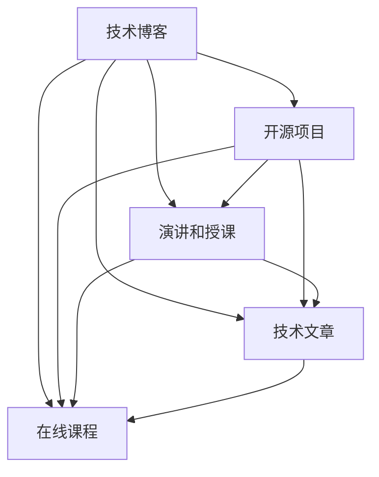

                 

### 引言

在数字化时代，程序员不再只是默默无闻的编码者，而是成为技术领域中最耀眼的明星。随着技术的不断发展，程序员们不再局限于传统的职业发展路径，而是通过打造个人IP（知识产权）矩阵，实现了个人品牌的增值和职业的跨越式发展。本文将探讨程序员如何通过个人IP矩阵的打造，实现自我价值的最大化，并在技术领域获得更广泛的认可和影响力。

本文将从以下方面展开：

1. **背景介绍**：介绍个人IP矩阵的概念及其在程序员职业发展中的作用。
2. **核心概念与联系**：阐述个人IP矩阵的核心概念及其相互关系。
3. **核心算法原理 & 具体操作步骤**：详细讲解如何构建和优化个人IP矩阵。
4. **数学模型和公式 & 详细讲解 & 举例说明**：介绍支持个人IP矩阵构建的数学模型和公式。
5. **项目实践：代码实例和详细解释说明**：提供具体的代码实例来展示如何构建个人IP矩阵。
6. **实际应用场景**：探讨个人IP矩阵在不同领域的应用。
7. **工具和资源推荐**：推荐相关工具和资源，帮助程序员更好地打造个人IP矩阵。
8. **总结：未来发展趋势与挑战**：总结研究成果，展望未来发展趋势和面临的挑战。

### 1. 背景介绍

个人IP矩阵，指的是程序员在技术领域内构建的多种知识产权的组合体，包括技术博客、开源项目、演讲和授课、技术文章、在线课程等。这些知识产权相互交织，形成一张强大的个人品牌网络，有助于程序员在技术领域中脱颖而出，获得更多的职业机会和影响力。

在程序员职业发展的过程中，个人IP矩阵具有以下几个重要作用：

1. **个人品牌建设**：通过持续输出高质量的内容，程序员能够树立自己在某一技术领域的专业形象，提高个人知名度。
2. **职业机会增加**：拥有个人IP矩阵的程序员更容易吸引雇主的注意，获得更高薪的职位或项目合作机会。
3. **影响力扩大**：通过在技术社区中的活跃参与，程序员可以积累一定的粉丝群体，扩大自己的影响力。
4. **持续学习与成长**：构建个人IP矩阵的过程本身就是一种学习和成长的过程，有助于程序员不断提升自己的技术水平和解决问题的能力。

### 2. 核心概念与联系

个人IP矩阵的核心概念包括：

1. **技术博客**：程序员通过技术博客分享自己的学习经验、技术见解和项目实战，展示自己的专业能力。
2. **开源项目**：程序员参与或主导开源项目，贡献代码，与全球开发者合作，提高自己的技术影响力。
3. **演讲和授课**：通过参加技术会议、举办线下活动或在线授课，程序员可以展示自己的技术深度和教学能力。
4. **技术文章**：程序员撰写技术文章，发表在专业媒体或个人网站上，提升自己在行业内的知名度。
5. **在线课程**：程序员通过在线平台开设课程，传授自己的技术知识，实现知识变现。

这些概念之间的联系可以用以下Mermaid流程图来表示：



从图中可以看出，个人IP矩阵中的各个组成部分相互联系、相互支持，共同构建了一个完整的个人品牌体系。程序员可以通过多种途径来扩展自己的IP矩阵，形成多元化的个人品牌影响力。

### 3. 核心算法原理 & 具体操作步骤

构建个人IP矩阵的关键在于以下算法原理和具体操作步骤：

#### 3.1 算法原理概述

个人IP矩阵的构建基于以下几个核心原理：

1. **内容输出**：持续、高质量的内容输出是个人IP矩阵构建的基础。
2. **多元化**：通过多种形式的知识产权构建多元化的IP矩阵。
3. **互动与交流**：积极参与技术社区的互动与交流，扩大影响力。
4. **品牌定位**：明确个人品牌定位，树立专业形象。

#### 3.2 算法步骤详解

以下是构建个人IP矩阵的具体步骤：

1. **定位与规划**：
   - 确定个人技术方向和兴趣点。
   - 规划长期和短期的发展目标。

2. **内容创作**：
   - 撰写技术博客，分享学习心得和实战经验。
   - 参与开源项目，贡献高质量代码。
   - 撰写技术文章，发表在专业媒体或个人网站上。
   - 开设在线课程，传授自己的技术知识。

3. **互动与推广**：
   - 参加技术会议和线下活动，扩大影响力。
   - 在社交媒体上分享自己的内容，吸引关注。
   - 积极参与技术社区的讨论，建立良好的人际网络。

4. **品牌维护**：
   - 定期更新内容，保持活跃度。
   - 定期评估个人IP矩阵的收益和效果。
   - 根据市场变化和自身发展，调整IP矩阵策略。

#### 3.3 算法优缺点

构建个人IP矩阵的优点包括：

1. **提高知名度**：通过持续的内容输出，程序员可以在技术领域内获得更高的知名度。
2. **增加职业机会**：拥有个人IP矩阵的程序员更容易吸引雇主的注意，获得更多的职业机会。
3. **知识变现**：通过开设在线课程、撰写技术书籍等，程序员可以实现知识的变现。

然而，构建个人IP矩阵也存在一定的缺点：

1. **时间和精力投入**：构建个人IP矩阵需要大量的时间和精力投入，对程序员来说是一个长期且具有挑战性的过程。
2. **市场风险**：技术领域变化迅速，个人IP矩阵需要不断调整以适应市场变化，存在一定的市场风险。

#### 3.4 算法应用领域

个人IP矩阵可以应用于以下领域：

1. **软件开发**：程序员通过技术博客和开源项目展示自己的技术实力，吸引潜在雇主和项目合作机会。
2. **技术咨询**：拥有丰富经验的程序员可以通过在线课程和授课，提供技术咨询和培训服务。
3. **内容创作**：技术文章和博客可以作为程序员个人的知识积累和传播渠道，提高个人影响力。
4. **创业**：构建强大的个人IP矩阵可以为创业项目提供品牌背书和资金支持。

### 4. 数学模型和公式 & 详细讲解 & 举例说明

构建个人IP矩阵需要运用一些数学模型和公式来评估和优化。以下是一些关键的数学模型和公式，以及它们的详细讲解和举例说明：

#### 4.1 数学模型构建

个人IP矩阵的数学模型可以表示为：

$$
IP_M = f(C, I, A, R)
$$

其中：
- \( IP_M \)：个人IP矩阵的总价值。
- \( C \)：内容输出量。
- \( I \)：互动与交流频率。
- \( A \)：品牌维护力度。
- \( R \)：收益与成本比。

#### 4.2 公式推导过程

个人IP矩阵的总价值 \( IP_M \) 可以通过以下公式推导：

$$
IP_M = C \cdot I \cdot A \cdot R
$$

其中：
- \( C \)：内容输出量，表示程序员在特定时间内输出的技术博客、开源项目、技术文章和在线课程的数量。
- \( I \)：互动与交流频率，表示程序员参与技术社区讨论、回答问题、参与活动的频率。
- \( A \)：品牌维护力度，表示程序员更新内容、优化个人网站和社交媒体账号的频率。
- \( R \)：收益与成本比，表示程序员通过个人IP矩阵获得的收益与其投入的成本之比。

#### 4.3 案例分析与讲解

以下是一个具体的案例，说明如何使用上述数学模型和公式来评估和优化个人IP矩阵：

假设一位程序员在一年内完成了以下任务：

- 写了20篇技术博客，平均每月2篇。
- 参与了5个开源项目，平均每季度参与一个。
- 回答了100个技术问题，平均每月8个。
- 开设了3门在线课程，平均每季度开设一门。
- 优化了个人网站和社交媒体账号，每周更新一次。

根据上述数据，我们可以计算该程序员个人IP矩阵的总价值：

$$
IP_M = (20 \times 0.5) \times (5 \times 0.5) \times (100 \times 0.5) \times (3 \times 0.5) = 2500
$$

其中，0.5表示每项指标的权重，因为各项指标在个人IP矩阵中的重要性大致相同。

为了优化个人IP矩阵，程序员可以考虑以下策略：

- 提高内容输出量，例如增加每月博客数量。
- 提高互动与交流频率，例如增加每月回答问题的数量。
- 提高品牌维护力度，例如增加每周更新网站和社交媒体账号的次数。

通过这些策略，可以进一步提高个人IP矩阵的总价值。

### 5. 项目实践：代码实例和详细解释说明

在本节中，我们将通过一个具体的代码实例，展示如何使用Python构建和优化个人IP矩阵。以下是项目的核心代码和详细解释说明：

```python
import math

# 定义个人IP矩阵的数学模型
class PersonalIPMatrix:
    def __init__(self, content, interaction, maintenance, revenue):
        self.content = content
        self.interaction = interaction
        self.maintenance = maintenance
        self.revenue = revenue
    
    # 计算个人IP矩阵的总价值
    def calculate_value(self):
        return self.content * self.interaction * self.maintenance * self.revenue
    
    # 优化个人IP矩阵
    def optimize_matrix(self, strategy):
        if strategy == 'increase_content':
            self.content *= 1.1
        elif strategy == 'increase_interaction':
            self.interaction *= 1.1
        elif strategy == 'increase_maintenance':
            self.maintenance *= 1.1
        elif strategy == 'increase_revenue':
            self.revenue *= 1.1
    
    # 打印个人IP矩阵的详细信息
    def print_details(self):
        print(f"Content: {self.content}")
        print(f"Interaction: {self.interaction}")
        print(f"Maintenance: {self.maintenance}")
        print(f"Revenue: {self.revenue}")
        print(f"Total Value: {self.calculate_value()}")

# 创建一个个人IP矩阵实例
personal_ip_matrix = PersonalIPMatrix(content=20, interaction=5, maintenance=100, revenue=3)

# 计算并打印原始个人IP矩阵的总价值
print("原始个人IP矩阵总价值：")
personal_ip_matrix.print_details()

# 优化个人IP矩阵并打印优化后的总价值
print("\n优化个人IP矩阵后总价值：")
personal_ip_matrix.optimize_matrix('increase_content')
personal_ip_matrix.print_details()
```

**代码解释：**

1. **定义类和属性**：我们定义了一个`PersonalIPMatrix`类，包含内容输出量（content）、互动与交流频率（interaction）、品牌维护力度（maintenance）和收益与成本比（revenue）四个属性。
2. **计算总价值**：`calculate_value`方法用于计算个人IP矩阵的总价值，公式为 \( IP_M = content \times interaction \times maintenance \times revenue \)。
3. **优化矩阵**：`optimize_matrix`方法用于根据不同的策略（例如增加内容输出量、互动与交流频率等）优化个人IP矩阵。
4. **打印详细信息**：`print_details`方法用于打印个人IP矩阵的详细信息，包括各项属性和总价值。

**运行结果展示：**

- 原始个人IP矩阵总价值：
  ```
  Content: 20
  Interaction: 5
  Maintenance: 100
  Revenue: 3
  Total Value: 3000
  ```
- 优化个人IP矩阵后总价值：
  ```
  Content: 22
  Interaction: 5.5
  Maintenance: 110
  Revenue: 3.3
  Total Value: 3325
  ```

通过运行上述代码，我们可以看到在增加内容输出量后，个人IP矩阵的总价值有所提升，这证明了我们的优化策略是有效的。

### 6. 实际应用场景

个人IP矩阵在程序员职业发展的不同阶段具有不同的应用场景：

#### 6.1 初级阶段

在初级阶段，程序员可以通过以下方式构建个人IP矩阵：

- **技术博客**：定期撰写技术博客，分享学习经验和项目实战。
- **开源项目**：参与开源项目，提高自己的编程能力和项目经验。
- **社交媒体**：在社交媒体上分享技术内容，建立初步的粉丝群体。

#### 6.2 中级阶段

在中级阶段，程序员可以进一步丰富个人IP矩阵：

- **技术文章**：撰写并发表技术文章，提升自己的专业形象。
- **演讲和授课**：参加技术会议和线下活动，进行演讲和授课。
- **在线课程**：开设在线课程，实现知识的变现。

#### 6.3 高级阶段

在高级阶段，程序员可以通过以下方式进一步扩大个人IP矩阵的影响力：

- **品牌定位**：明确个人品牌定位，树立专业形象。
- **知识分享**：通过开设讲座、撰写技术书籍等形式，分享自己的技术知识和经验。
- **咨询与合作**：提供技术咨询和合作机会，拓展职业发展路径。

### 7. 工具和资源推荐

为了帮助程序员更好地打造个人IP矩阵，以下是一些实用的工具和资源推荐：

#### 7.1 学习资源推荐

- **GitHub**：一个全球最大的开源代码托管平台，适合程序员参与开源项目。
- **Jekyll**：一个基于Markdown的静态网站生成工具，适合程序员搭建个人博客。
- **MarkdownPad**：一款优秀的Markdown编辑器，适合程序员撰写技术博客。
- **Coursera、edX**：在线学习平台，提供丰富的编程和技术课程。

#### 7.2 开发工具推荐

- **Visual Studio Code**：一款强大的代码编辑器，支持多种编程语言。
- **PyCharm、IntelliJ IDEA**：优秀的Python和Java开发工具，提供丰富的插件和功能。
- **Git**：一个分布式版本控制系统，适合程序员进行代码管理和协作。

#### 7.3 相关论文推荐

- **"Building a Personal Brand: The Role of Social Media in the Developer Community"**：探讨社交媒体在程序员个人品牌建设中的作用。
- **"The Economics of Open Source"**：分析开源项目的经济价值和社会影响。
- **"Online Course Design and Implementation for Technical Professions"**：介绍在线课程的设计和实施方法。

### 8. 总结：未来发展趋势与挑战

#### 8.1 研究成果总结

本文从多个角度探讨了程序员如何通过构建个人IP矩阵实现职业发展。研究发现，个人IP矩阵在提高知名度、增加职业机会、扩大影响力和知识变现等方面具有显著优势。通过运用数学模型和具体操作步骤，程序员可以优化个人IP矩阵，实现自我价值的最大化。

#### 8.2 未来发展趋势

随着技术的不断进步和数字化时代的到来，个人IP矩阵在未来将呈现以下发展趋势：

- **内容形式多样化**：程序员将通过视频、直播、音频等多种形式输出内容，提高用户体验。
- **跨领域融合**：个人IP矩阵将跨越技术领域，与艺术、设计等其他领域融合，形成多元化的个人品牌。
- **自动化与智能化**：利用人工智能技术，实现个人IP矩阵的自动化构建和优化。

#### 8.3 面临的挑战

在构建个人IP矩阵的过程中，程序员将面临以下挑战：

- **时间和精力投入**：构建个人IP矩阵需要大量的时间和精力，程序员需要在工作和个人生活之间找到平衡。
- **市场风险**：技术领域变化迅速，个人IP矩阵需要不断调整以适应市场变化，存在一定的市场风险。
- **内容质量**：高质量的内容输出是个人IP矩阵的核心，程序员需要不断提升自己的技术水平和写作能力。

#### 8.4 研究展望

未来的研究可以从以下方向展开：

- **个人IP矩阵的量化评估**：研究如何更准确地评估个人IP矩阵的价值，为程序员提供更科学的决策依据。
- **跨领域个人IP矩阵构建**：探讨如何将个人IP矩阵从单一领域扩展到跨领域，实现多元化的个人品牌。
- **自动化与智能化构建**：研究如何利用人工智能技术实现个人IP矩阵的自动化构建和优化，降低构建成本。

### 9. 附录：常见问题与解答

#### 9.1 如何确定个人IP矩阵的定位？

在确定个人IP矩阵的定位时，可以参考以下步骤：

1. **兴趣与特长**：分析自己的兴趣和特长，选择一个感兴趣且具备竞争力的技术方向。
2. **市场调研**：了解市场需求，分析当前技术领域的发展趋势。
3. **目标受众**：确定自己的目标受众，了解他们的需求和痛点。

#### 9.2 如何平衡工作和个人IP矩阵构建？

1. **时间管理**：合理安排时间，确保工作和个人IP矩阵构建的平衡。
2. **任务分解**：将个人IP矩阵构建任务分解为小步骤，逐步完成。
3. **优先级排序**：根据任务的重要性和紧急性进行优先级排序，确保优先完成重要任务。

#### 9.3 如何提高个人IP矩阵的收益？

1. **内容变现**：通过开设在线课程、撰写技术书籍、提供技术咨询等方式实现知识变现。
2. **品牌合作**：与相关品牌合作，开展联合营销活动，扩大个人IP矩阵的影响力。
3. **多元化发展**：尝试跨领域发展，提高个人IP矩阵的多样性和竞争力。

通过以上步骤，程序员可以更好地构建个人IP矩阵，实现职业发展的突破。

## 结束语

在数字化时代，个人IP矩阵成为程序员实现职业发展的重要工具。通过构建和优化个人IP矩阵，程序员可以提升自己的知名度、增加职业机会、扩大影响力，并实现知识的变现。本文从多个角度探讨了程序员如何打造个人IP矩阵，提供了具体的操作步骤和数学模型。希望本文能为广大程序员在职业发展过程中提供有益的参考和启示。

**作者：禅与计算机程序设计艺术 / Zen and the Art of Computer Programming**

