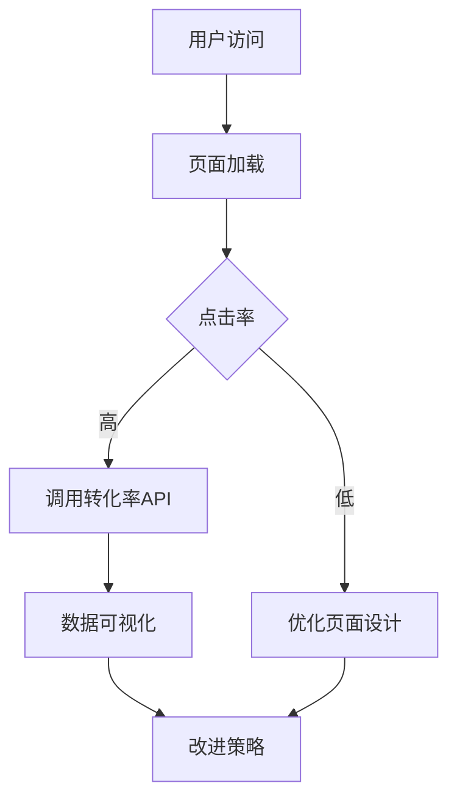
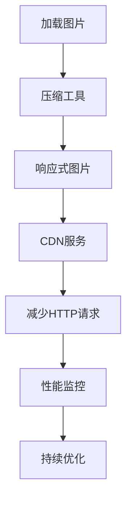
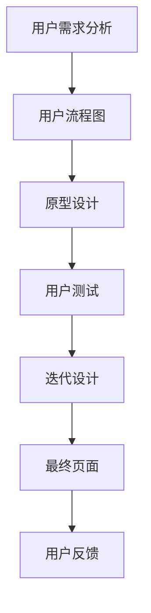

                 

关键词：程序员、销售页面、转化率、用户体验、技术实现、设计原则

> 摘要：本文将深入探讨程序员如何利用技术手段和设计原则，打造出高转化率的销售页面。通过分析用户行为、优化页面性能和用户体验，本文将提供一系列实际可操作的策略，帮助程序员提升销售页面的转化率，实现业务目标。

## 1. 背景介绍

在当今数字化营销的时代，销售页面的设计不再仅仅是美学问题，更关乎商业成果。一个优秀的销售页面可以引导潜在客户完成购买行为，从而实现企业价值最大化。然而，如何打造这样的页面呢？程序员作为技术实现的主力军，他们需要理解用户体验、市场趋势和业务目标，并将这些因素融入到页面设计之中。

程序员在销售页面设计中的角色至关重要，他们不仅要负责页面的技术实现，还要与设计师、产品经理和市场团队紧密合作，确保页面不仅美观，而且功能强大、易于操作，从而提高转化率。

## 2. 核心概念与联系

### 2.1 用户行为分析

用户行为分析是优化销售页面的第一步。通过分析用户在页面上的行为，程序员可以了解到用户的偏好、访问模式和决策过程。这种分析通常使用数据分析工具和热图技术进行。以下是用户行为分析的一个Mermaid流程图：



### 2.2 页面性能优化

页面性能直接影响用户体验。程序员可以通过以下步骤进行页面性能优化：

- **减少HTTP请求**：合并CSS和JavaScript文件，减少服务器请求次数。
- **使用CDN**：内容分发网络可以加快页面内容的加载速度。
- **优化图片**：使用压缩工具减少图片大小，使用响应式图片技术。

以下是页面性能优化的Mermaid流程图：



### 2.3 用户体验设计

用户体验设计是销售页面的核心。程序员需要与设计师合作，确保页面设计直观、易用。以下是一个用户体验设计的Mermaid流程图：



## 3. 核心算法原理 & 具体操作步骤

### 3.1 算法原理概述

为了打造高转化率的销售页面，程序员可以采用A/B测试算法。A/B测试是一种比较页面版本的方法，通过分析用户对两种不同版本的响应，确定哪种版本能够带来更高的转化率。

### 3.2 算法步骤详解

1. **设计测试版本**：根据用户行为分析，设计两个或多个测试版本。
2. **分配流量**：将访问者随机分配到不同的测试版本。
3. **收集数据**：收集用户行为数据，如点击率、转化率等。
4. **分析数据**：使用统计分析方法，比较不同版本的表现。
5. **决策**：根据数据结果，选择表现更好的版本进行推广。

### 3.3 算法优缺点

**优点**：
- **数据驱动**：通过实际数据做出决策，避免主观臆断。
- **优化持续**：通过持续测试，不断优化页面设计。

**缺点**：
- **耗时较长**：需要足够的时间收集数据，才能做出准确的决策。
- **资源消耗**：A/B测试需要分配流量和资源，可能影响其他业务。

### 3.4 算法应用领域

A/B测试算法广泛应用于电子商务、在线广告和数字营销等领域。它可以帮助企业优化广告投放、产品设计和用户体验，从而提高转化率和销售额。

## 4. 数学模型和公式 & 详细讲解 & 举例说明

### 4.1 数学模型构建

为了评估销售页面的转化率，可以使用以下数学模型：

$$
\text{转化率} = \frac{\text{完成转化的用户数}}{\text{总访问用户数}} \times 100\%
$$

### 4.2 公式推导过程

转化率的计算基于两个参数：完成转化的用户数和总访问用户数。完成转化的用户数可以通过页面事件跟踪获得，而总访问用户数可以通过网站分析工具获取。

### 4.3 案例分析与讲解

假设一个电商网站在一个月内，有1000个访问用户，其中50个用户完成了购买。那么，该网站的转化率为：

$$
\text{转化率} = \frac{50}{1000} \times 100\% = 5\%
$$

通过A/B测试，将页面A的转化率提高到6%，页面B的转化率提高到5.5%。假设流量均匀分配，那么总体转化率会略有提高。然而，这种提高是否显著，需要通过统计分析进行验证。

## 5. 项目实践：代码实例和详细解释说明

### 5.1 开发环境搭建

在开始项目之前，需要搭建一个合适的技术环境。以下是开发环境搭建的步骤：

1. 安装Node.js和npm。
2. 安装Web开发框架，如React或Vue。
3. 配置静态资源服务器，如Nginx或Apache。

### 5.2 源代码详细实现

以下是一个简单的React组件，用于展示销售页面：

```jsx
import React from 'react';

const SalesPage = () => {
  return (
    <div className="sales-page">
      <h1>Welcome to Our Product</h1>
      <p>
        Discover the features that make our product stand out from the competition.
      </p>
      <button className="buy-now">Buy Now</button>
    </div>
  );
};

export default SalesPage;
```

### 5.3 代码解读与分析

这个React组件负责渲染销售页面的主要结构。它包含一个标题和一个描述段落，以及一个“Buy Now”按钮。这个按钮可以通过事件处理函数与后端API进行交互，处理用户的购买请求。

### 5.4 运行结果展示

通过浏览器访问销售页面，用户可以看到一个简洁明了的销售页面。点击“Buy Now”按钮后，用户会被引导至支付页面，完成购买流程。

## 6. 实际应用场景

销售页面的设计和应用场景多种多样，以下是一些常见的实际应用场景：

1. **电子商务网站**：用于展示产品信息、促进销售。
2. **在线教育平台**：用于宣传课程、吸引学员报名。
3. **企业网站**：用于展示企业产品和服务，提升品牌形象。

### 6.4 未来应用展望

随着技术的不断发展，销售页面的设计和实现也将更加智能化和个性化。例如，利用人工智能技术进行用户行为预测和个性化推荐，将进一步提升转化率。

## 7. 工具和资源推荐

### 7.1 学习资源推荐

- 《Web Performance Tuning: A Web Developer's Guide to Optimization》
- 《The Art of A/B Testing: Changing the Game Through Data-Driven Optimization》
- 《Responsive Web Design with HTML5 and CSS3》

### 7.2 开发工具推荐

- Chrome DevTools
- React Developer Tools
- A/B Testing Tools (如 Google Optimize)

### 7.3 相关论文推荐

- "Web Performance Best Practices" by Google
- "The Importance of User Experience in E-Commerce" by UX Magazine
- "A/B Testing in Practice" by MarketingProfs

## 8. 总结：未来发展趋势与挑战

随着互联网技术的不断发展，销售页面的设计也将朝着更加智能化和个性化的方向前进。然而，这也带来了新的挑战，如数据隐私保护和用户行为分析的可解释性。程序员需要不断学习和适应这些变化，以提升销售页面的转化率，实现业务目标。

### 8.1 研究成果总结

本文总结了程序员打造高转化率销售页面的核心技术和策略。通过用户行为分析、页面性能优化和用户体验设计，程序员可以显著提高销售页面的转化率。

### 8.2 未来发展趋势

未来，销售页面的设计将更加智能化和个性化。人工智能和大数据分析将发挥关键作用，为用户提供更加精准和个性化的体验。

### 8.3 面临的挑战

数据隐私保护和用户行为分析的可解释性是当前面临的两个主要挑战。程序员需要在设计和实现销售页面的过程中，充分考虑这些问题。

### 8.4 研究展望

随着技术的进步，程序员将有更多的工具和方法来打造高转化率的销售页面。未来的研究将集中在如何更好地利用人工智能和大数据技术，提升用户体验和业务效果。

## 9. 附录：常见问题与解答

### 9.1 销售页面转化率低怎么办？

1. **用户行为分析**：通过分析用户行为，找出页面的问题。
2. **A/B测试**：进行A/B测试，尝试不同的设计方案。
3. **优化性能**：优化页面性能，提高用户体验。

### 9.2 如何快速提高销售页面转化率？

1. **突出产品优势**：明确展示产品的独特卖点。
2. **优化导航结构**：确保用户能够轻松找到所需信息。
3. **简化购买流程**：减少用户操作的步骤，降低购买门槛。

---

作者：禅与计算机程序设计艺术 / Zen and the Art of Computer Programming
----------------------------------------------------------------

[**END**]

