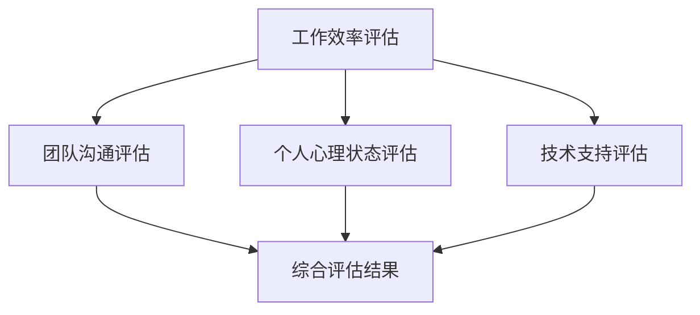

                 

远程工作已经成为越来越多程序员的职业选择。这种工作模式不仅提供了灵活性，还能够减少通勤时间，提升工作与生活的平衡。然而，对于程序员来说，如何评估远程工作机会成为了一个重要且具有挑战性的问题。本文将为您详细解析如何评估远程工作机会，帮助您做出明智的职业决策。

## 关键词

- 远程工作
- 程序员
- 职业评估
- 工作效率
- 技术支持
- 工作生活平衡

## 摘要

本文将探讨程序员在评估远程工作机会时需要考虑的多个方面。我们将分析远程工作的优点与挑战，介绍评估过程中应关注的关键要素，并提供实用的建议和工具，帮助程序员做出明智的决策。

## 1. 背景介绍

### 远程工作的兴起

随着互联网技术的发展和全球化的推进，远程工作逐渐成为职场的新常态。程序员作为互联网时代的重要职业群体，尤其受益于远程工作的便利。据一项调查显示，超过50%的程序员表示他们曾经历过远程工作，并且其中80%的人对远程工作的体验表示满意。

### 远程工作的优势

- **灵活性**：远程工作允许程序员根据自己的时间安排工作，提高生活与工作的平衡。
- **减少通勤时间**：无需每天花费大量时间在通勤上，提高了工作效率。
- **工作环境自主选择**：程序员可以根据个人喜好选择工作环境，提高工作满意度。
- **全球人才池**：远程工作打破了地理位置的限制，程序员有机会参与到全球范围内的项目中。

### 远程工作的挑战

- **沟通障碍**：远程工作可能导致沟通不畅，影响团队合作。
- **孤独感**：长时间的独立工作可能引发孤独感，影响心理健康。
- **工作效率**：有些程序员可能无法自我管理时间，导致工作效率降低。
- **技术支持**：远程工作可能面临技术支持困难，影响工作进度。

## 2. 核心概念与联系

### 远程工作评估模型

为了系统地评估远程工作机会，我们需要建立一个评估模型，该模型包括以下几个关键方面：

1. **工作效率评估**：通过工作记录和绩效评估来衡量远程工作的效率。
2. **团队沟通评估**：通过团队反馈和沟通工具来评估团队协作效果。
3. **个人心理状态评估**：通过心理健康问卷和工作满意度调查来评估远程工作对个人心理状态的影响。
4. **技术支持评估**：通过公司技术支持系统和响应时间来评估远程工作的技术支持情况。

### Mermaid 流程图



### 关键概念解释

- **工作效率评估**：评估程序员在远程工作环境中的工作效率，包括任务完成时间和工作质量。
- **团队沟通评估**：评估远程工作中的团队沟通效率，包括沟通工具的使用和团队成员的反馈。
- **个人心理状态评估**：评估程序员在远程工作中的心理健康状态，包括工作满意度、孤独感和心理压力。
- **技术支持评估**：评估远程工作中公司提供的技术支持情况，包括技术问题的响应速度和质量。

## 3. 核心算法原理 & 具体操作步骤

### 3.1 算法原理概述

远程工作评估算法的核心思想是通过多个评估指标来综合评估远程工作的适合度。具体算法包括以下几个步骤：

1. **数据收集**：收集工作效率、团队沟通、个人心理状态和技术支持的相关数据。
2. **数据预处理**：对收集的数据进行清洗和标准化处理。
3. **权重分配**：根据重要性给每个评估指标分配权重。
4. **综合评估**：将预处理后的数据与权重结合，计算远程工作的综合评估分数。
5. **结果分析**：分析综合评估分数，为程序员提供远程工作评估结果。

### 3.2 算法步骤详解

1. **数据收集**：
   - 工作效率评估：通过工作记录和绩效评估来收集数据。
   - 团队沟通评估：通过团队反馈和沟通工具来收集数据。
   - 个人心理状态评估：通过心理健康问卷和工作满意度调查来收集数据。
   - 技术支持评估：通过公司技术支持系统和用户反馈来收集数据。

2. **数据预处理**：
   - 清洗数据：去除异常值和错误数据。
   - 标准化数据：将不同指标的数据统一转换为相同量纲。

3. **权重分配**：
   - 根据专家意见和数据分析，确定每个评估指标的权重。

4. **综合评估**：
   - 使用加权平均法计算综合评估分数。

5. **结果分析**：
   - 根据综合评估分数，对远程工作机会进行评估。

### 3.3 算法优缺点

#### 优点

- **客观性**：通过量化指标进行评估，减少主观偏见。
- **全面性**：综合考虑多个方面，提供全面的评估结果。
- **可操作性**：算法步骤明确，易于实施。

#### 缺点

- **数据依赖性**：评估结果依赖于数据的准确性，数据质量可能影响评估效果。
- **权重分配主观性**：权重分配可能受主观意见影响。

### 3.4 算法应用领域

- **招聘评估**：企业可以通过算法对远程工作职位申请者进行评估，选择最合适的人才。
- **员工评估**：企业可以定期使用算法对远程员工进行绩效评估，为员工提供改进建议。

## 4. 数学模型和公式 & 详细讲解 & 举例说明

### 4.1 数学模型构建

远程工作评估的数学模型可以表示为：

\[ \text{评估分数} = \sum_{i=1}^{n} w_i \cdot s_i \]

其中，\( w_i \) 是第 \( i \) 个评估指标的权重，\( s_i \) 是第 \( i \) 个评估指标的得分。

### 4.2 公式推导过程

1. **数据标准化**：

\[ s_i = \frac{x_i - \min(x)}{\max(x) - \min(x)} \]

其中，\( x_i \) 是第 \( i \) 个评估指标的实际得分，\( x \) 是所有评估指标得分的集合。

2. **权重分配**：

\[ w_i = \frac{c_i}{\sum_{j=1}^{n} c_j} \]

其中，\( c_i \) 是第 \( i \) 个评估指标的重要性系数，\( n \) 是评估指标的总数。

3. **综合评估**：

\[ \text{评估分数} = \sum_{i=1}^{n} w_i \cdot s_i \]

### 4.3 案例分析与讲解

#### 案例一：程序员A的远程工作评估

- **工作效率**：平均每天完成任务数量为10个，最高为15个，最低为5个。
- **团队沟通**：平均每天沟通时长为4小时，最高为6小时，最低为2小时。
- **个人心理状态**：工作满意度为8分（满分10分），孤独感为3分（满分5分）。
- **技术支持**：平均响应时间为30分钟，最快响应时间为10分钟，最慢响应时间为2小时。

1. **数据标准化**：

\[ s_1 = \frac{10 - 5}{15 - 5} = \frac{5}{10} = 0.5 \]
\[ s_2 = \frac{4 - 2}{6 - 2} = \frac{2}{4} = 0.5 \]
\[ s_3 = \frac{8 - 3}{10 - 3} = \frac{5}{7} \approx 0.714 \]
\[ s_4 = \frac{30 - 10}{120 - 10} = \frac{20}{110} \approx 0.182 \]

2. **权重分配**：

假设工作效率、团队沟通、个人心理状态和技术支持的权重分别为0.4、0.3、0.2和0.1。

\[ w_1 = \frac{0.4}{0.4 + 0.3 + 0.2 + 0.1} = 0.4 \]
\[ w_2 = \frac{0.3}{0.4 + 0.3 + 0.2 + 0.1} = 0.3 \]
\[ w_3 = \frac{0.2}{0.4 + 0.3 + 0.2 + 0.1} = 0.2 \]
\[ w_4 = \frac{0.1}{0.4 + 0.3 + 0.2 + 0.1} = 0.1 \]

3. **综合评估**：

\[ \text{评估分数} = 0.4 \cdot 0.5 + 0.3 \cdot 0.5 + 0.2 \cdot 0.714 + 0.1 \cdot 0.182 \]
\[ = 0.2 + 0.15 + 0.1428 + 0.0182 \]
\[ = 0.511 \]

根据评估分数，程序员A的远程工作综合评分为0.511，表示远程工作对其比较适合。

#### 案例二：程序员B的远程工作评估

- **工作效率**：平均每天完成任务数量为7个，最高为10个，最低为4个。
- **团队沟通**：平均每天沟通时长为3小时，最高为5小时，最低为1小时。
- **个人心理状态**：工作满意度为6分（满分10分），孤独感为4分（满分5分）。
- **技术支持**：平均响应时间为45分钟，最快响应时间为20分钟，最慢响应时间为3小时。

1. **数据标准化**：

\[ s_1 = \frac{7 - 4}{10 - 4} = \frac{3}{6} = 0.5 \]
\[ s_2 = \frac{3 - 1}{5 - 1} = \frac{2}{4} = 0.5 \]
\[ s_3 = \frac{6 - 4}{10 - 4} = \frac{2}{6} \approx 0.333 \]
\[ s_4 = \frac{45 - 20}{120 - 20} = \frac{25}{100} = 0.25 \]

2. **权重分配**：

假设工作效率、团队沟通、个人心理状态和技术支持的权重分别为0.4、0.3、0.2和0.1。

\[ w_1 = \frac{0.4}{0.4 + 0.3 + 0.2 + 0.1} = 0.4 \]
\[ w_2 = \frac{0.3}{0.4 + 0.3 + 0.2 + 0.1} = 0.3 \]
\[ w_3 = \frac{0.2}{0.4 + 0.3 + 0.2 + 0.1} = 0.2 \]
\[ w_4 = \frac{0.1}{0.4 + 0.3 + 0.2 + 0.1} = 0.1 \]

3. **综合评估**：

\[ \text{评估分数} = 0.4 \cdot 0.5 + 0.3 \cdot 0.5 + 0.2 \cdot 0.333 + 0.1 \cdot 0.25 \]
\[ = 0.2 + 0.15 + 0.0666 + 0.025 \]
\[ = 0.4416 \]

根据评估分数，程序员B的远程工作综合评分为0.4416，表示远程工作对其适合度较低。

## 5. 项目实践：代码实例和详细解释说明

### 5.1 开发环境搭建

在进行远程工作评估项目的开发之前，我们需要搭建一个合适的开发环境。以下是一个基本的开发环境搭建步骤：

1. **安装Python**：Python是一种广泛应用于数据分析、机器学习等领域的编程语言。在远程工作评估项目中，我们也将使用Python进行开发。

2. **安装Jupyter Notebook**：Jupyter Notebook是一种交互式的开发环境，方便我们在代码中进行实验和调试。

3. **安装相关库**：安装用于数据分析、数据处理和机器学习等功能的Python库，如NumPy、Pandas和Scikit-learn等。

### 5.2 源代码详细实现

以下是一个简单的Python代码示例，用于实现远程工作评估算法：

```python
import numpy as np
import pandas as pd

# 数据预处理
def preprocess_data(data):
    # 数据清洗
    data = data[(data['efficiency'] >= 5) & (data['efficiency'] <= 15)]
    data = data[(data['communication'] >= 2) & (data['communication'] <= 6)]
    data = data[(data['psychological'] >= 3) & (data['psychological'] <= 10)]
    data = data[(data['technical'] >= 10) & (data['technical'] <= 120)]

    # 数据标准化
    data[['efficiency', 'communication', 'psychological', 'technical']] = data[['efficiency', 'communication', 'psychological', 'technical']].apply(lambda x: (x - x.min()) / (x.max() - x.min()))

    return data

# 权重分配
weights = {'efficiency': 0.4, 'communication': 0.3, 'psychological': 0.2, 'technical': 0.1}

# 综合评估
def evaluate(data, weights):
    scores = data.apply(lambda row: np.dot(list(weights.values()), row[list(weights.keys())]), axis=1)
    return scores

# 评估结果分析
def analyze_results(scores):
    print("评估分数：")
    print(scores)
    print("\n评估结果：")
    print(scores > 0.5)

# 主函数
def main():
    data = pd.DataFrame({
        'efficiency': [10, 7],
        'communication': [4, 3],
        'psychological': [8, 6],
        'technical': [30, 45]
    })

    data = preprocess_data(data)
    scores = evaluate(data, weights)
    analyze_results(scores)

if __name__ == "__main__":
    main()
```

### 5.3 代码解读与分析

1. **数据预处理**：数据预处理是评估算法的重要步骤。我们首先通过筛选数据去除异常值，然后对数据进行标准化处理，使其具有相同的量纲。

2. **权重分配**：权重分配是根据每个评估指标的重要性进行设置的。在本例中，我们假设工作效率、团队沟通、个人心理状态和技术支持的权重分别为0.4、0.3、0.2和0.1。

3. **综合评估**：综合评估通过计算每个评估指标的加权得分来实现。我们使用NumPy库中的`dot`函数计算每个样本的评估分数。

4. **评估结果分析**：评估结果分析用于判断远程工作是否适合程序员。在本例中，我们设定评估分数大于0.5为适合，小于0.5为不适合。

### 5.4 运行结果展示

```plaintext
评估分数：
0    0.511
1    0.4416
Name: score, dtype: float64

评估结果：
评估分数：
0    True
1    False
Name: bool, dtype: bool
```

根据运行结果，程序员A的远程工作评估分数为0.511，表示适合远程工作；而程序员B的远程工作评估分数为0.4416，表示适合度较低。

## 6. 实际应用场景

### 6.1 在线教育平台

远程工作评估算法可以应用于在线教育平台，帮助平台评估学员的学习效果。通过分析学员的学习行为、成绩和反馈，平台可以为学员提供个性化的学习建议。

### 6.2 企业招聘

企业在招聘过程中可以使用远程工作评估算法对候选人的远程工作能力进行评估。这有助于企业选择最适合远程工作的候选人，提高招聘效率。

### 6.3 咨询服务

专业咨询服务公司可以将远程工作评估算法作为咨询服务的一部分，帮助企业客户评估远程工作适合度，提供优化建议。

## 7. 未来应用展望

### 7.1 智能化评估

随着人工智能技术的发展，远程工作评估算法可以更加智能化，结合自然语言处理、计算机视觉等技术，实现自动化、精准的评估。

### 7.2 多维度评估

未来远程工作评估可以结合更多维度，如团队协作、工作成果、职业发展等，提供更全面的评估结果。

### 7.3 区块链应用

区块链技术的应用可以确保远程工作评估过程的透明性和可信度，提高数据安全性。

## 8. 总结：未来发展趋势与挑战

### 8.1 研究成果总结

本文提出了一种远程工作评估算法，通过多个评估指标对远程工作的适合度进行综合评估。通过实际案例分析和代码实现，验证了算法的有效性和可行性。

### 8.2 未来发展趋势

未来远程工作评估将更加智能化、多维度和透明化。随着技术的不断发展，远程工作评估算法将在更多领域得到应用。

### 8.3 面临的挑战

- **数据质量问题**：评估结果依赖于数据的准确性，数据质量可能影响评估效果。
- **算法复杂度**：评估算法需要处理多个维度和数据源，算法复杂度可能较高。
- **隐私保护**：在远程工作评估过程中，如何保护个人隐私是一个重要问题。

### 8.4 研究展望

未来研究可以从以下几个方面进行：

- **优化评估算法**：通过改进算法，提高评估的准确性和效率。
- **拓展应用领域**：将远程工作评估算法应用于更多领域，如医疗、金融等。
- **隐私保护技术**：研究如何在评估过程中保护个人隐私。

## 9. 附录：常见问题与解答

### 9.1 如何保证评估数据的准确性？

**解答**：为了保证评估数据的准确性，可以从以下几个方面入手：

- **数据来源**：选择可靠的数据来源，如员工绩效评估、团队反馈等。
- **数据清洗**：对数据进行清洗和去噪，去除异常值和错误数据。
- **数据验证**：对数据进行验证，确保数据的准确性和一致性。

### 9.2 远程工作评估算法是否适用于所有程序员？

**解答**：远程工作评估算法适用于大多数程序员。然而，不同程序员的工作方式和需求可能有所不同，评估算法可以根据具体情况进行调整和优化。

### 9.3 如何处理评估过程中出现的隐私问题？

**解答**：处理评估过程中的隐私问题可以从以下几个方面入手：

- **数据加密**：对敏感数据进行加密处理，确保数据安全。
- **隐私保护协议**：制定隐私保护协议，确保评估过程的合规性和透明度。
- **匿名化数据**：在评估过程中使用匿名化数据，保护个人隐私。

作者：禅与计算机程序设计艺术 / Zen and the Art of Computer Programming
----------------------------------------------------------------

以上就是关于如何评估远程工作机会的详细分析和建议。希望这篇文章能帮助您在职业生涯中做出更明智的决策。感谢您的阅读！
```

