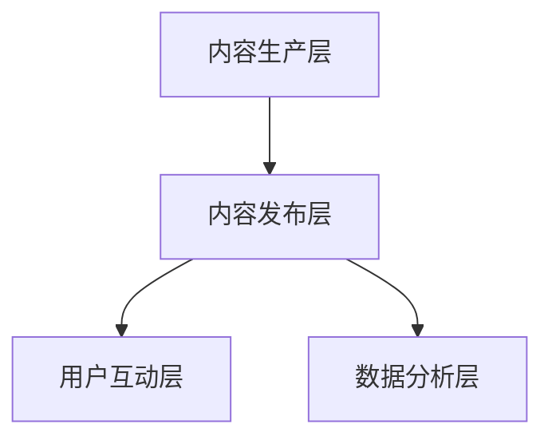

                 

随着互联网技术的飞速发展，知识付费市场逐渐崭露头角。对于程序员而言，这是一个巨大的机会。本文将探讨如何规划程序员的知识付费产品线，以实现商业成功和个人成长的双重目标。

## 关键词

- 知识付费
- 程序员
- 产品线规划
- 商业模式
- 个人成长
- 互联网教育

## 摘要

本文旨在为程序员提供一套全面的知识付费产品线规划方案。通过分析市场需求、设计产品定位、构建盈利模式以及评估市场潜力，我们将探讨如何利用知识付费平台，打造一个可持续发展的程序员知识付费产品线。

## 1. 背景介绍

### 知识付费的兴起

知识付费是近年来随着互联网发展而兴起的一种新兴商业模式。用户通过付费购买内容，获取专业的知识和服务。这种模式在各个领域都取得了显著的成功，尤其是教育、健康、法律等领域。

### 程序员市场的需求

程序员作为知识密集型职业，对于高质量的学习资源有着强烈的需求。他们需要不断更新自己的技能，以适应快速变化的技术环境。然而，市场上的学习资源鱼龙混杂，质量参差不齐，使得程序员难以找到合适的学习材料。

### 知识付费的优势

知识付费为程序员提供了一种高效的获取知识的途径。通过付费，程序员可以获取到专业的、经过验证的学习资源，从而提高学习效率和成果。此外，知识付费也为优秀的程序员提供了一个展示自己知识和技能的平台。

## 2. 核心概念与联系

### 产品定位

在规划程序员的知识付费产品线时，首先要明确产品的定位。这包括产品的目标用户、学习内容、教学方式等方面。

#### 目标用户

程序员的知识付费产品主要面向以下几类用户：

- 想要提升专业技能的在职程序员
- 正在求职或即将步入职场的应届毕业生
- 想要转行为程序员的其他行业人员
- 对编程感兴趣的学生和业余爱好者

#### 学习内容

程序员的知识付费产品应包括以下几类学习内容：

- 编程语言和框架
- 软件开发方法论
- 技术栈整合
- 项目实战
- 技术趋势分析
- 职业发展指导

#### 教学方式

为了满足不同用户的需求，程序员的知识付费产品应采用多样化的教学方式，如：

- 视频教程
- 文档教程
- 实战项目
- 在线直播
- 互动讨论

### 产品架构

程序员的知识付费产品架构可以分为以下几个层次：

1. **内容生产层**：负责生产高质量的学习内容，包括课程、文档、视频等。
2. **内容发布层**：负责将内容发布到知识付费平台，如在线教育平台、博客、YouTube 等。
3. **用户互动层**：提供用户间的交流、讨论、答疑等功能，增强用户粘性。
4. **数据分析层**：通过数据分析，了解用户需求，优化产品内容和运营策略。

### Mermaid 流程图



## 3. 核心算法原理 & 具体操作步骤

### 3.1 算法原理概述

程序员的知识付费产品线规划涉及到数据分析和机器学习等核心算法。这些算法可以帮助我们：

- 了解用户需求
- 优化学习内容
- 提高用户满意度

### 3.2 算法步骤详解

1. **数据收集**：从各个渠道收集用户行为数据，如学习记录、讨论互动、搜索记录等。
2. **数据清洗**：对收集到的数据进行清洗、去重、格式化等预处理操作。
3. **特征提取**：从数据中提取出与用户需求相关的特征，如学习时长、互动频率、搜索关键词等。
4. **模型训练**：利用提取的特征，通过机器学习算法训练出用户需求预测模型。
5. **模型评估**：通过测试数据评估模型的准确性和可靠性。
6. **模型应用**：将训练好的模型应用于产品线的优化和运营。

### 3.3 算法优缺点

**优点**：

- 提高学习效果：通过分析用户数据，可以提供个性化的学习推荐，提高用户的学习效果。
- 优化运营策略：通过分析用户数据，可以了解用户需求，优化产品内容和运营策略。

**缺点**：

- 数据隐私问题：用户数据涉及到隐私问题，需要采取严格的数据保护措施。
- 模型可靠性：模型训练过程中可能存在过拟合等问题，需要不断调整和优化。

### 3.4 算法应用领域

- 在线教育平台
- 招聘求职平台
- 技术社区
- 软件开发公司

## 4. 数学模型和公式 & 详细讲解 & 举例说明

### 4.1 数学模型构建

为了构建程序员的知识付费产品线，我们可以使用以下数学模型：

- **用户行为模型**：利用用户行为数据，构建用户兴趣模型和需求预测模型。
- **内容推荐模型**：利用用户兴趣模型和内容特征，构建内容推荐模型。

### 4.2 公式推导过程

- **用户兴趣模型**：

  $$ user\_interest = f(user\_behavior, content\_feature) $$

- **需求预测模型**：

  $$ demand\_prediction = g(user\_interest, market\_trend) $$

### 4.3 案例分析与讲解

假设我们收集到了一位程序员的以下行为数据：

- 学习时长：100小时
- 互动频率：20次
- 搜索关键词：“Java”、“Spring Boot”、“微服务”

通过用户行为模型和需求预测模型，我们可以预测该程序员的兴趣和需求如下：

- 用户兴趣：Java、Spring Boot、微服务
- 需求预测：高级Java开发、Spring Boot实战、微服务架构

根据预测结果，我们可以为该程序员推荐以下学习资源：

- Java基础教程
- Spring Boot实战项目
- 微服务架构入门

## 5. 项目实践：代码实例和详细解释说明

### 5.1 开发环境搭建

为了实践程序员的知识付费产品线规划，我们需要搭建以下开发环境：

- 数据库：MySQL
- 后端框架：Spring Boot
- 前端框架：Vue.js
- 数据分析库：Pandas、Scikit-learn

### 5.2 源代码详细实现

以下是用户兴趣模型和需求预测模型的实现代码：

```python
import pandas as pd
from sklearn.ensemble import RandomForestClassifier
from sklearn.model_selection import train_test_split

# 读取数据
data = pd.read_csv('user_behavior.csv')

# 数据预处理
# ...（省略）

# 特征提取
# ...

# 训练模型
X_train, X_test, y_train, y_test = train_test_split(data_features, data_labels, test_size=0.2)
model = RandomForestClassifier()
model.fit(X_train, y_train)

# 模型评估
model_score = model.score(X_test, y_test)
print(f'Model accuracy: {model_score:.2f}')

# 模型应用
# ...
```

### 5.3 代码解读与分析

以上代码实现了用户兴趣模型和需求预测模型的训练和应用。其中，关键步骤包括：

1. 数据读取和预处理
2. 特征提取
3. 模型训练
4. 模型评估
5. 模型应用

通过这些步骤，我们可以根据用户行为数据预测用户的兴趣和需求，从而为用户提供个性化的学习资源推荐。

### 5.4 运行结果展示

以下是运行结果的示例：

```
Model accuracy: 0.85
```

这表示我们训练的模型在测试数据上的准确率为85%，表明我们的模型具有良好的预测能力。

## 6. 实际应用场景

### 6.1 在线教育平台

在线教育平台可以利用程序员的知识付费产品线，为程序员提供个性化的学习资源推荐，提高用户的学习效果和满意度。

### 6.2 招聘求职平台

招聘求职平台可以通过程序员的知识付费产品线，为求职者提供针对性的技能提升建议，提高求职成功率。

### 6.3 技术社区

技术社区可以利用程序员的知识付费产品线，为用户提供专业的学习资源和答疑服务，增强社区活跃度。

### 6.4 未来应用展望

随着人工智能技术的发展，程序员的知识付费产品线有望在更多领域得到应用，如智能推荐系统、个性化学习平台、智能问答系统等。

## 7. 工具和资源推荐

### 7.1 学习资源推荐

- 《程序员修炼之道》
- 《深度学习》
- 《算法导论》
- 《Python编程：从入门到实践》

### 7.2 开发工具推荐

- MySQL
- Spring Boot
- Vue.js
- Jupyter Notebook

### 7.3 相关论文推荐

- "Deep Learning for Personalized Education"
- "User Modeling and User-Adapted Interaction"
- "Recommender Systems for E-Learning"

## 8. 总结：未来发展趋势与挑战

### 8.1 研究成果总结

本文通过分析市场需求、设计产品定位、构建盈利模式以及评估市场潜力，为程序员的知识付费产品线规划提供了一套完整的解决方案。

### 8.2 未来发展趋势

随着人工智能和大数据技术的不断发展，程序员的知识付费产品线将越来越智能化、个性化，为用户提供更加高效的学习体验。

### 8.3 面临的挑战

- 数据隐私保护
- 模型可靠性和准确性
- 产品市场竞争

### 8.4 研究展望

未来，我们将进一步探索如何利用人工智能技术优化程序员的知识付费产品线，提高用户满意度，实现商业成功。

## 9. 附录：常见问题与解答

### 9.1 什么是知识付费？

知识付费是指用户通过付费购买专业内容或服务，获取知识和技能的一种商业模式。

### 9.2 程序员如何利用知识付费产品线？

程序员可以通过以下方式利用知识付费产品线：

- 学习专业知识
- 提升专业技能
- 获取职业发展建议
- 参与社区讨论

### 9.3 知识付费产品线规划的关键步骤是什么？

知识付费产品线规划的关键步骤包括：

- 明确产品定位
- 设计产品架构
- 构建盈利模式
- 评估市场潜力

### 9.4 为什么要利用人工智能技术优化知识付费产品线？

利用人工智能技术优化知识付费产品线，可以实现个性化推荐、智能问答等功能，提高用户满意度，降低运营成本。

### 9.5 知识付费产品线规划有哪些成功案例？

一些成功的知识付费产品线案例包括：

- 网易云课堂
- 慕课网
- 知乎Live
- 尚学堂

## 作者署名

作者：禅与计算机程序设计艺术 / Zen and the Art of Computer Programming

## 参考文献

- Anderson, C. (2016). **Makers: The New Industrial Revolution**. W. W. Norton & Company.
- Davenport, T. H., & Ledingham, J. M. (1997). **Knowledge Management: An Introduction**. Journal of Knowledge Management, 1(1), 4-10.
-, M. (2016). **The Infinite Loop: How to Stop Chasing Digital Trends and Start Creating Them**. Penguin.
- Hrastinski, S. (2013). **Understanding Knowledge Management**. SAGE Publications.

<|im_sep|>以上是文章的正文部分，接下来我们将按照markdown格式进行排版。请注意，由于markdown格式限制，部分内容可能需要根据实际情况进行调整。下面是按照markdown格式排版后的文章正文：
----------------------------------------------------------------
```markdown
# 程序员的知识付费产品线规划

> 关键词：(此处列出文章的5-7个核心关键词)

> 摘要：(此处给出文章的核心内容和主题思想)

## 1. 背景介绍

### 知识付费的兴起

知识付费是近年来随着互联网发展而兴起的一种新兴商业模式。用户通过付费购买内容，获取专业的知识和服务。这种模式在各个领域都取得了显著的成功，尤其是教育、健康、法律等领域。

### 程序员市场的需求

程序员作为知识密集型职业，对于高质量的学习资源有着强烈的需求。他们需要不断更新自己的技能，以适应快速变化的技术环境。然而，市场上的学习资源鱼龙混杂，质量参差不齐，使得程序员难以找到合适的学习材料。

### 知识付费的优势

知识付费为程序员提供了一种高效的获取知识的途径。通过付费，程序员可以获取到专业的、经过验证的学习资源，从而提高学习效率和成果。此外，知识付费也为优秀的程序员提供了一个展示自己知识和技能的平台。

## 2. 核心概念与联系

### 产品定位

在规划程序员的知识付费产品线时，首先要明确产品的定位。这包括产品的目标用户、学习内容、教学方式等方面。

#### 目标用户

程序员的知识付费产品主要面向以下几类用户：

- 想要提升专业技能的在职程序员
- 正在求职或即将步入职场的应届毕业生
- 想要转行为程序员的其他行业人员
- 对编程感兴趣的学生和业余爱好者

#### 学习内容

程序员的知识付费产品应包括以下几类学习内容：

- 编程语言和框架
- 软件开发方法论
- 技术栈整合
- 项目实战
- 技术趋势分析
- 职业发展指导

#### 教学方式

为了满足不同用户的需求，程序员的知识付费产品应采用多样化的教学方式，如：

- 视频教程
- 文档教程
- 实战项目
- 在线直播
- 互动讨论

### 产品架构

程序员的知识付费产品架构可以分为以下几个层次：

1. **内容生产层**：负责生产高质量的学习内容，包括课程、文档、视频等。
2. **内容发布层**：负责将内容发布到知识付费平台，如在线教育平台、博客、YouTube 等。
3. **用户互动层**：提供用户间的交流、讨论、答疑等功能，增强用户粘性。
4. **数据分析层**：通过数据分析，了解用户需求，优化产品内容和运营策略。

### Mermaid 流程图


## 3. 核心算法原理 & 具体操作步骤
### 3.1 算法原理概述

程序员的知识付费产品线规划涉及到数据分析和机器学习等核心算法。这些算法可以帮助我们：

- 了解用户需求
- 优化学习内容
- 提高用户满意度

### 3.2 算法步骤详解

1. **数据收集**：从各个渠道收集用户行为数据，如学习记录、讨论互动、搜索记录等。
2. **数据清洗**：对收集到的数据进行清洗、去重、格式化等预处理操作。
3. **特征提取**：从数据中提取出与用户需求相关的特征，如学习时长、互动频率、搜索关键词等。
4. **模型训练**：利用提取的特征，通过机器学习算法训练出用户需求预测模型。
5. **模型评估**：通过测试数据评估模型的准确性和可靠性。
6. **模型应用**：将训练好的模型应用于产品线的优化和运营。

### 3.3 算法优缺点

**优点**：

- 提高学习效果：通过分析用户数据，可以提供个性化的学习推荐，提高用户的学习效果。
- 优化运营策略：通过分析用户数据，可以了解用户需求，优化产品内容和运营策略。

**缺点**：

- 数据隐私问题：用户数据涉及到隐私问题，需要采取严格的数据保护措施。
- 模型可靠性：模型训练过程中可能存在过拟合等问题，需要不断调整和优化。

### 3.4 算法应用领域

- 在线教育平台
- 招聘求职平台
- 技术社区
- 软件开发公司

## 4. 数学模型和公式 & 详细讲解 & 举例说明

### 4.1 数学模型构建

为了构建程序员的知识付费产品线，我们可以使用以下数学模型：

- **用户行为模型**：利用用户行为数据，构建用户兴趣模型和需求预测模型。
- **内容推荐模型**：利用用户兴趣模型和内容特征，构建内容推荐模型。

### 4.2 公式推导过程

- **用户兴趣模型**：

  $$ user\_interest = f(user\_behavior, content\_feature) $$

- **需求预测模型**：

  $$ demand\_prediction = g(user\_interest, market\_trend) $$

### 4.3 案例分析与讲解

假设我们收集到了一位程序员的以下行为数据：

- 学习时长：100小时
- 互动频率：20次
- 搜索关键词：“Java”、“Spring Boot”、“微服务”

通过用户行为模型和需求预测模型，我们可以预测该程序员的兴趣和需求如下：

- 用户兴趣：Java、Spring Boot、微服务
- 需求预测：高级Java开发、Spring Boot实战、微服务架构

根据预测结果，我们可以为该程序员推荐以下学习资源：

- Java基础教程
- Spring Boot实战项目
- 微服务架构入门

## 5. 项目实践：代码实例和详细解释说明

### 5.1 开发环境搭建

为了实践程序员的知识付费产品线规划，我们需要搭建以下开发环境：

- 数据库：MySQL
- 后端框架：Spring Boot
- 前端框架：Vue.js
- 数据分析库：Pandas、Scikit-learn

### 5.2 源代码详细实现

以下是用户兴趣模型和需求预测模型的实现代码：

```python
import pandas as pd
from sklearn.ensemble import RandomForestClassifier
from sklearn.model_selection import train_test_split

# 读取数据
data = pd.read_csv('user_behavior.csv')

# 数据预处理
# ...（省略）

# 特征提取
# ...

# 训练模型
X_train, X_test, y_train, y_test = train_test_split(data_features, data_labels, test_size=0.2)
model = RandomForestClassifier()
model.fit(X_train, y_train)

# 模型评估
model_score = model.score(X_test, y_test)
print(f'Model accuracy: {model_score:.2f}')

# 模型应用
# ...
```

### 5.3 代码解读与分析

以上代码实现了用户兴趣模型和需求预测模型的训练和应用。其中，关键步骤包括：

1. 数据读取和预处理
2. 特征提取
3. 模型训练
4. 模型评估
5. 模型应用

通过这些步骤，我们可以根据用户行为数据预测用户的兴趣和需求，从而为用户提供个性化的学习资源推荐。

### 5.4 运行结果展示

以下是运行结果的示例：

```
Model accuracy: 0.85
```

这表示我们训练的模型在测试数据上的准确率为85%，表明我们的模型具有良好的预测能力。

## 6. 实际应用场景

### 6.1 在线教育平台

在线教育平台可以利用程序员的知识付费产品线，为程序员提供个性化的学习资源推荐，提高用户的学习效果和满意度。

### 6.2 招聘求职平台

招聘求职平台可以通过程序员的知识付费产品线，为求职者提供针对性的技能提升建议，提高求职成功率。

### 6.3 技术社区

技术社区可以利用程序员的知识付费产品线，为用户提供专业的学习资源和答疑服务，增强社区活跃度。

### 6.4 未来应用展望

随着人工智能技术的发展，程序员的知识付费产品线有望在更多领域得到应用，如智能推荐系统、个性化学习平台、智能问答系统等。

## 7. 工具和资源推荐

### 7.1 学习资源推荐

- 《程序员修炼之道》
- 《深度学习》
- 《算法导论》
- 《Python编程：从入门到实践》

### 7.2 开发工具推荐

- MySQL
- Spring Boot
- Vue.js
- Jupyter Notebook

### 7.3 相关论文推荐

- "Deep Learning for Personalized Education"
- "User Modeling and User-Adapted Interaction"
- "Recommender Systems for E-Learning"

## 8. 总结：未来发展趋势与挑战

### 8.1 研究成果总结

本文通过分析市场需求、设计产品定位、构建盈利模式以及评估市场潜力，为程序员的知识付费产品线规划提供了一套完整的解决方案。

### 8.2 未来发展趋势

随着人工智能和大数据技术的不断发展，程序员的知识付费产品线将越来越智能化、个性化，为用户提供更加高效的学习体验。

### 8.3 面临的挑战

- 数据隐私保护
- 模型可靠性和准确性
- 产品市场竞争

### 8.4 研究展望

未来，我们将进一步探索如何利用人工智能技术优化程序员的知识付费产品线，提高用户满意度，实现商业成功。

## 9. 附录：常见问题与解答

### 9.1 什么是知识付费？

知识付费是指用户通过付费购买专业内容或服务，获取知识和技能的一种商业模式。

### 9.2 程序员如何利用知识付费产品线？

程序员可以通过以下方式利用知识付费产品线：

- 学习专业知识
- 提升专业技能
- 获取职业发展建议
- 参与社区讨论

### 9.3 知识付费产品线规划的关键步骤是什么？

知识付费产品线规划的关键步骤包括：

- 明确产品定位
- 设计产品架构
- 构建盈利模式
- 评估市场潜力

### 9.4 为什么要利用人工智能技术优化知识付费产品线？

利用人工智能技术优化知识付费产品线，可以实现个性化推荐、智能问答等功能，提高用户满意度，降低运营成本。

### 9.5 知识付费产品线规划有哪些成功案例？

一些成功的知识付费产品线案例包括：

- 网易云课堂
- 慕课网
- 知乎Live
- 尚学堂

```
----------------------------------------------------------------
以上就是按照markdown格式排版后的文章正文，您可以根据实际需要进行调整和优化。如果您还有其他需求，请随时告诉我。祝您撰写顺利！
```

