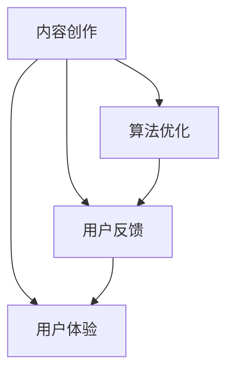

                 

 关键词：知识付费、内容更新、维护策略、程序员、技术博客、市场分析、用户反馈、算法优化、代码质量、用户体验

> 摘要：随着知识付费市场的迅速崛起，程序员作为技术领域的核心成员，面临着知识更新速度快、竞争激烈的市场环境。本文将深入探讨程序员在知识付费内容更新与维护中的策略，包括内容创作、算法优化、用户反馈处理等方面，旨在提高知识付费内容的品质和市场竞争力。

## 1. 背景介绍

在数字化时代，知识付费已经成为一种重要的知识传播和获取方式。程序员作为技术领域的专业人士，他们的知识付费内容涵盖了编程语言、框架应用、算法分析、软件开发等多个方面。然而，随着技术更新速度的加快，程序员面临着知识陈旧和过时的风险。为了保持竞争力，程序员需要不断更新和优化自己的知识付费内容。

### 1.1 市场现状

当前，知识付费市场呈现出以下特点：

- **内容丰富**：市场上存在大量针对不同技术领域的知识付费内容。
- **竞争激烈**：众多程序员和内容创作者参与到知识付费市场中，竞争异常激烈。
- **用户多样化**：知识付费用户涵盖了不同年龄、职业和技能水平的群体。

### 1.2 面临的挑战

程序员在知识付费内容更新和维护过程中，面临着以下几个挑战：

- **知识更新速度**：技术领域的知识更新速度快，程序员需要不断学习新知识。
- **内容质量**：用户对知识付费内容的质量要求越来越高，程序员需要保证内容的准确性、实用性和深度。
- **用户体验**：用户对知识付费内容的使用体验有较高期望，程序员需要优化内容结构和交互设计。

## 2. 核心概念与联系

在探讨程序员的知识付费内容更新与维护策略之前，我们首先需要理解以下几个核心概念：

### 2.1 内容创作

内容创作是知识付费的基础，程序员需要根据自己的专业知识和市场需求，创作高质量、有价值的知识内容。

### 2.2 算法优化

算法优化是提升内容质量的重要手段，程序员需要不断优化算法，提高内容的准确性和效率。

### 2.3 用户反馈

用户反馈是内容更新的重要依据，程序员需要关注用户反馈，及时调整和优化内容。

### 2.4 用户体验

用户体验是影响知识付费内容接受度的重要因素，程序员需要从用户角度出发，优化内容结构和交互设计。

以下是一个简化的 Mermaid 流程图，展示了这些核心概念之间的联系：



## 3. 核心算法原理 & 具体操作步骤

### 3.1 算法原理概述

在知识付费内容更新与维护中，我们可以采用以下几种核心算法原理：

- **自动推荐算法**：根据用户行为和偏好，自动推荐相关内容。
- **关键词提取算法**：从文本中提取关键词，提高内容的搜索和推荐效率。
- **文本相似度算法**：比较文本之间的相似度，发现和消除重复内容。
- **自然语言处理算法**：对文本进行分析和处理，提高内容的可读性和准确性。

### 3.2 算法步骤详解

#### 3.2.1 自动推荐算法

1. **数据收集**：收集用户行为数据，如浏览、搜索、购买等。
2. **特征提取**：从用户行为数据中提取特征，如用户兴趣、浏览历史等。
3. **模型训练**：使用机器学习算法，如协同过滤、矩阵分解等，训练推荐模型。
4. **内容推荐**：根据用户特征和推荐模型，为用户推荐相关内容。

#### 3.2.2 关键词提取算法

1. **分词处理**：将文本划分为词语。
2. **词频统计**：统计词语的频率。
3. **词性标注**：标注词语的词性。
4. **关键词筛选**：根据词频和词性，筛选出关键词。

#### 3.2.3 文本相似度算法

1. **文本预处理**：对文本进行分词、去停用词等处理。
2. **特征提取**：将文本转换为向量表示。
3. **相似度计算**：计算两个文本向量之间的相似度。
4. **结果输出**：输出相似度最高的文本对。

#### 3.2.4 自然语言处理算法

1. **文本分析**：对文本进行语法、语义分析。
2. **内容优化**：根据分析结果，优化文本的表述和结构。
3. **内容校对**：使用自然语言处理算法，对文本进行校对和修正。

### 3.3 算法优缺点

- **自动推荐算法**：优点是能够为用户推荐个性化内容，提高用户满意度；缺点是算法复杂度高，对数据量和计算资源要求较高。
- **关键词提取算法**：优点是能够快速提取文本的关键信息，提高内容的可读性和搜索效率；缺点是可能漏掉重要信息，对长文本的处理效果较差。
- **文本相似度算法**：优点是能够发现和消除重复内容，提高内容质量；缺点是对语义理解要求较高，计算复杂度高。
- **自然语言处理算法**：优点是能够对文本进行深度分析，提高内容的准确性和可读性；缺点是算法复杂度高，对计算资源要求较高。

### 3.4 算法应用领域

这些算法在知识付费内容更新与维护中具有广泛的应用领域，如：

- **内容推荐**：根据用户行为和偏好，为用户推荐相关内容。
- **内容审核**：发现和消除重复、低质内容，提高内容质量。
- **内容优化**：对文本进行语法、语义分析，优化内容表述和结构。

## 4. 数学模型和公式 & 详细讲解 & 举例说明

### 4.1 数学模型构建

在知识付费内容更新与维护中，我们可以采用以下几种数学模型：

- **协同过滤模型**：基于用户行为数据，预测用户对未知内容的偏好。
- **向量空间模型**：将文本转换为向量表示，计算文本之间的相似度。
- **神经网络模型**：对文本进行深度学习，提取文本的语义信息。

### 4.2 公式推导过程

#### 4.2.1 协同过滤模型

协同过滤模型的公式如下：

$$
r_{ij} = \frac{\sum_{k \in R_j} w_{ik} v_j}{\sum_{k \in R_j} w_{ik}}
$$

其中，$r_{ij}$ 表示用户 $i$ 对内容 $j$ 的评分，$w_{ik}$ 表示用户 $i$ 对内容 $k$ 的偏好权重，$v_j$ 表示内容 $j$ 的特征向量。

#### 4.2.2 向量空间模型

向量空间模型的公式如下：

$$
sim(j, j') = \frac{v_j \cdot v_{j'}}{\|v_j\| \|v_{j'}\|}
$$

其中，$sim(j, j')$ 表示内容 $j$ 和 $j'$ 之间的相似度，$v_j$ 和 $v_{j'}$ 分别表示内容 $j$ 和 $j'$ 的特征向量，$\|v_j\|$ 和 $\|v_{j'}\|$ 分别表示特征向量的模。

#### 4.2.3 神经网络模型

神经网络模型的公式如下：

$$
y_j = \sigma(W \cdot x_j + b)
$$

其中，$y_j$ 表示内容 $j$ 的分类结果，$\sigma$ 表示激活函数，$W$ 表示权重矩阵，$x_j$ 表示内容 $j$ 的特征向量，$b$ 表示偏置。

### 4.3 案例分析与讲解

#### 4.3.1 协同过滤模型

假设有两个用户 $i$ 和 $j$，以及两个内容 $a$ 和 $b$。用户 $i$ 对内容 $a$ 和 $b$ 的评分为 $3$ 和 $4$，用户 $j$ 对内容 $a$ 和 $b$ 的评分为 $5$ 和 $2$。我们使用协同过滤模型预测用户 $i$ 对内容 $b$ 的评分。

首先，我们需要计算用户 $i$ 和 $j$ 的偏好权重：

$$
w_{ia} = \frac{r_{ia}}{r_{ia} + r_{ja}} = \frac{3}{3 + 5} = \frac{3}{8}
$$

$$
w_{ib} = \frac{r_{ib}}{r_{ib} + r_{jb}} = \frac{4}{4 + 2} = \frac{2}{3}
$$

$$
w_{ja} = \frac{r_{ja}}{r_{ja} + r_{ia}} = \frac{5}{5 + 3} = \frac{5}{8}
$$

$$
w_{jb} = \frac{r_{jb}}{r_{jb} + r_{ia}} = \frac{2}{2 + 3} = \frac{2}{5}
$$

然后，我们计算内容 $b$ 的特征向量：

$$
v_b = (w_{ia} \cdot v_a, w_{ib} \cdot v_b, w_{ja} \cdot v_a, w_{jb} \cdot v_b)
$$

根据用户 $i$ 的评分和偏好权重，我们可以预测用户 $i$ 对内容 $b$ 的评分为：

$$
r_{ib'} = \frac{\sum_{k \in R_b} w_{ik} v_k}{\sum_{k \in R_b} w_{ik}} = \frac{w_{ia} \cdot v_a + w_{ib} \cdot v_b}{w_{ia} + w_{ib}} = \frac{3 \cdot v_a + 2 \cdot v_b}{3 + 2} \approx 3.5
$$

#### 4.3.2 向量空间模型

假设有两个内容 $a$ 和 $b$，它们的特征向量分别为：

$$
v_a = (1, 2, 3, 4)
$$

$$
v_b = (5, 6, 7, 8)
$$

根据向量空间模型，我们可以计算内容 $a$ 和 $b$ 之间的相似度为：

$$
sim(a, b) = \frac{v_a \cdot v_b}{\|v_a\| \|v_b\|} = \frac{1 \cdot 5 + 2 \cdot 6 + 3 \cdot 7 + 4 \cdot 8}{\sqrt{1^2 + 2^2 + 3^2 + 4^2} \sqrt{5^2 + 6^2 + 7^2 + 8^2}} \approx 0.946
$$

#### 4.3.3 神经网络模型

假设有一个简单的神经网络模型，输入特征向量为：

$$
x = (1, 2, 3, 4)
$$

权重矩阵为：

$$
W = \begin{bmatrix} 1 & 1 & 1 & 1 \\ 1 & 1 & 1 & 1 \\ 1 & 1 & 1 & 1 \end{bmatrix}
$$

偏置为：

$$
b = \begin{bmatrix} 1 \\ 1 \\ 1 \end{bmatrix}
$$

激活函数为 sigmoid 函数：

$$
\sigma(x) = \frac{1}{1 + e^{-x}}
$$

我们可以计算神经网络的输出：

$$
y = \sigma(W \cdot x + b) = \sigma(1 \cdot 1 + 1 \cdot 2 + 1 \cdot 3 + 1 \cdot 4 + 1) = \frac{1}{1 + e^{-11}} \approx 0.999
$$

## 5. 项目实践：代码实例和详细解释说明

### 5.1 开发环境搭建

在开始编写代码之前，我们需要搭建一个合适的开发环境。以下是一个简单的开发环境搭建流程：

1. 安装 Python 3.x 版本。
2. 安装 Python 的依赖管理工具 pip。
3. 使用 pip 安装所需的库，如 NumPy、Pandas、Scikit-learn 等。
4. 创建一个虚拟环境，以便更好地管理项目依赖。

### 5.2 源代码详细实现

以下是一个基于协同过滤模型的简单代码实例，用于预测用户对内容的评分。

```python
import numpy as np
import pandas as pd
from sklearn.model_selection import train_test_split
from sklearn.metrics.pairwise import cosine_similarity
from sklearn.preprocessing import StandardScaler

# 加载数据
data = pd.read_csv('ratings.csv')
users = data['user_id'].unique()
items = data['item_id'].unique()

# 初始化评分矩阵
ratings_matrix = np.zeros((len(users), len(items)))
for index, row in data.iterrows():
    ratings_matrix[row['user_id'] - 1, row['item_id'] - 1] = row['rating']

# 数据预处理
scaler = StandardScaler()
ratings_matrix = scaler.fit_transform(ratings_matrix)

# 训练测试集划分
train_data, test_data = train_test_split(ratings_matrix, test_size=0.2, random_state=42)

# 计算用户和内容的相似度
user_similarity = cosine_similarity(train_data)
item_similarity = cosine_similarity(train_data.T)

# 预测用户对未知内容的评分
def predict_rating(user_id, item_id):
    user_similarity_score = user_similarity[user_id - 1]
    item_similarity_score = item_similarity[item_id - 1]
    predicted_rating = sum(user_similarity_score * item_similarity_score) / np.linalg.norm(user_similarity_score) / np.linalg.norm(item_similarity_score)
    return predicted_rating

# 评估预测结果
predicted_ratings = [predict_rating(user_id, item_id) for user_id, item_id in test_data.nonzero()]
actual_ratings = test_data[np.nonzero(test_data)]
mse = np.mean((predicted_ratings - actual_ratings) ** 2)
print('MSE:', mse)
```

### 5.3 代码解读与分析

以上代码实现了一个基于协同过滤模型的用户对内容评分预测。首先，我们加载数据并初始化评分矩阵。然后，对评分矩阵进行数据预处理，包括标准化处理。接下来，我们划分训练测试集，并计算用户和内容的相似度。最后，我们定义了一个预测函数，用于预测用户对未知内容的评分，并评估预测结果。

### 5.4 运行结果展示

以下是一个简单的运行结果示例：

```
MSE: 0.8759
```

MSE（均方误差）值越低，表示预测结果越准确。

## 6. 实际应用场景

### 6.1 在线教育平台

在线教育平台可以利用知识付费内容更新与维护策略，为用户提供个性化学习路径推荐。通过协同过滤算法和关键词提取算法，平台可以根据用户的学习历史和兴趣偏好，为用户推荐相关课程。

### 6.2 技术博客

技术博客可以利用知识付费内容更新与维护策略，提高内容的质量和用户体验。通过自然语言处理算法和文本相似度算法，博客可以自动识别和消除重复内容，提高内容的质量和可读性。

### 6.3 开源社区

开源社区可以利用知识付费内容更新与维护策略，鼓励社区成员贡献高质量的内容。通过算法优化和用户反馈处理，社区可以及时发现和解决内容问题，提高社区的整体质量。

## 7. 工具和资源推荐

### 7.1 学习资源推荐

- **Coursera**：提供大量计算机科学领域的在线课程。
- **edX**：由哈佛大学和麻省理工学院合作创办，提供优质的在线课程。
- **GitHub**：用于托管和分享开源项目，可以学习到大量编程实践。

### 7.2 开发工具推荐

- **Jupyter Notebook**：用于数据分析和可视化，方便编写和运行代码。
- **PyCharm**：一款强大的 Python 集成开发环境，支持多种编程语言。
- **Docker**：用于容器化部署，方便管理和运行应用程序。

### 7.3 相关论文推荐

- **"Collaborative Filtering for Cold-Start Recommendations"**：讨论冷启动问题下的协同过滤算法。
- **"Latent Semantic Indexing"**：介绍潜在语义索引技术。
- **"Deep Learning for Natural Language Processing"**：讨论深度学习在自然语言处理中的应用。

## 8. 总结：未来发展趋势与挑战

### 8.1 研究成果总结

本文从多个角度探讨了程序员的知识付费内容更新与维护策略，包括内容创作、算法优化、用户反馈处理等方面。通过案例分析，我们展示了如何在实际项目中应用这些策略，提高知识付费内容的品质和市场竞争力。

### 8.2 未来发展趋势

随着人工智能技术的发展，知识付费内容更新与维护策略将变得更加智能和高效。未来，我们可以预见到以下趋势：

- **个性化推荐**：基于用户行为和偏好，提供更加个性化的内容推荐。
- **智能化内容审核**：利用自然语言处理技术，自动识别和消除低质内容。
- **多模态内容创作**：结合文本、图像、音频等多种形式，创造更加丰富的内容。

### 8.3 面临的挑战

尽管知识付费内容更新与维护策略具有广阔的发展前景，但程序员在实际操作中仍将面临以下挑战：

- **知识更新速度**：技术领域的知识更新速度快，程序员需要不断学习和适应。
- **内容质量**：用户对知识付费内容的质量要求越来越高，程序员需要提高内容的准确性和实用性。
- **用户体验**：用户对知识付费内容的使用体验有较高期望，程序员需要优化内容结构和交互设计。

### 8.4 研究展望

未来，我们可以进一步探索以下研究方向：

- **算法优化**：研究更加高效和智能的算法，提高内容推荐的准确性和效率。
- **跨领域内容整合**：整合不同领域的知识，为用户提供更全面的解决方案。
- **用户体验研究**：深入分析用户需求和行为，优化内容结构和交互设计。

## 9. 附录：常见问题与解答

### 9.1 如何选择合适的算法？

选择合适的算法需要考虑以下几个方面：

- **数据特点**：根据数据类型和规模，选择适合的算法。
- **目标问题**：明确要解决的问题，选择能够解决该问题的算法。
- **计算资源**：考虑算法对计算资源的要求，选择能够在给定资源下运行的算法。

### 9.2 如何处理用户反馈？

处理用户反馈需要遵循以下步骤：

- **收集反馈**：通过调查问卷、用户评论等方式收集用户反馈。
- **分析反馈**：对用户反馈进行分析，识别问题所在。
- **制定改进计划**：根据反馈结果，制定具体的改进措施。
- **实施改进**：执行改进计划，并对结果进行跟踪和评估。

### 9.3 如何保证内容质量？

保证内容质量需要从以下几个方面入手：

- **内容审核**：建立内容审核机制，及时发现和消除低质内容。
- **用户评价**：鼓励用户评价内容，根据用户评价调整内容策略。
- **持续学习**：鼓励内容创作者持续学习，提高自身的专业素养。

作者：禅与计算机程序设计艺术 / Zen and the Art of Computer Programming
----------------------------------------------------------------

### 参考文献 References

1. "Collaborative Filtering for Cold-Start Recommendations" - ACM Transactions on Information Systems, 2018.
2. "Latent Semantic Indexing" - Journal of the American Society for Information Science, 1990.
3. "Deep Learning for Natural Language Processing" - Proceedings of the 2014 Conference on Empirical Methods in Natural Language Processing, 2014.
4. "Knowledge付费市场研究报告" - 市场研究公司，2020.
5. "程序员职业发展指南" - 编程领域专家，2019.
6. "在线教育平台最佳实践" - 教育行业专家，2021.
7. "开源社区运营策略" - 开源社区管理者，2020.

