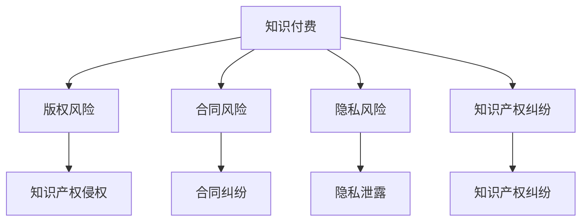

                 

在当今这个知识经济的时代，程序员的知识付费模式已成为常态。然而，随着知识付费市场的蓬勃发展，法律风险也随之而来。本文旨在探讨程序员在知识付费过程中可能面临的法律风险，并提出相应的防范策略。

> **关键词**：程序员、知识付费、法律风险、防范策略

> **摘要**：本文分析了程序员在知识付费过程中可能遇到的法律风险，包括版权、合同、隐私等方面的风险，并提出了具体的防范措施。通过对风险源的识别和法律知识的普及，帮助程序员在知识付费市场中规避风险，确保合法权益。

## 1. 背景介绍

知识付费作为一种商业模式，近年来在全球范围内得到了广泛的推广。特别是在中国，随着互联网经济的快速发展，知识付费市场呈现出蓬勃发展的态势。程序员作为知识付费的重要参与者，他们在接受付费知识服务的同时，也面临着诸多法律风险。

### 1.1 程序员的知识付费现状

程序员的知识付费主要包括以下几个方面：

1. **在线课程**：程序员通过购买在线课程来提升自己的技能。
2. **咨询服务**：程序员通过提供专业咨询服务获得报酬。
3. **付费问答**：程序员通过付费问答平台回答用户的问题。
4. **开源项目**：程序员通过参与开源项目，获得赞助或报酬。

### 1.2 程序员面临的法律风险

程序员在知识付费过程中可能面临以下几种法律风险：

1. **版权侵权**：在分享代码、文档等知识产权时，可能侵犯他人的版权。
2. **合同纠纷**：在签订合同过程中，可能因条款不明确或理解不一致导致纠纷。
3. **隐私泄露**：在提供服务过程中，可能涉及用户隐私的保护问题。
4. **知识产权纠纷**：在参与开源项目时，可能面临知识产权归属和使用的纠纷。

## 2. 核心概念与联系

### 2.1 知识付费的基本概念

知识付费是指用户为了获取特定的知识或服务，向知识提供者支付费用的一种商业模式。其核心在于知识的经济化，即将知识作为一种商品进行交易。

### 2.2 法律风险的概念

法律风险是指由于法律规定的不确定性，或由于违反法律规定可能导致的损失或责任。对于程序员而言，法律风险主要体现在以下几个方面：

1. **版权风险**：涉及知识产权的保护和侵权问题。
2. **合同风险**：涉及合同条款的约定和履行问题。
3. **隐私风险**：涉及个人信息保护和隐私泄露问题。
4. **知识产权纠纷**：涉及知识产权的归属和使用问题。

### 2.3 Mermaid 流程图

下面是知识付费和法律风险的 Mermaid 流程图：



## 3. 核心算法原理 & 具体操作步骤

### 3.1 算法原理概述

在知识付费法律风险防范中，核心算法原理主要包括以下几个方面：

1. **风险评估**：通过对知识付费活动进行全面评估，识别可能存在的法律风险。
2. **风险识别**：识别具体的法律风险点，如版权、合同、隐私等。
3. **风险防范**：针对识别出的风险点，采取相应的防范措施，如签订合同、保护版权、保密协议等。
4. **风险监控**：对知识付费活动进行全程监控，及时发现并处理潜在的法律风险。

### 3.2 算法步骤详解

1. **风险评估**：首先，对程序员的知识付费活动进行评估，了解其参与的知识付费形式和内容。
2. **风险识别**：根据评估结果，识别可能存在的法律风险点。
3. **风险防范**：针对识别出的风险点，制定具体的防范措施。例如，对于版权风险，可以签订版权保护协议；对于合同风险，可以明确合同条款；对于隐私风险，可以采取加密等技术手段保护用户隐私。
4. **风险监控**：在知识付费活动过程中，持续监控法律风险，确保防范措施的落实。

### 3.3 算法优缺点

1. **优点**：
   - 可以有效识别和防范知识付费过程中的法律风险。
   - 提高程序员的法律意识和风险防范能力。
   - 有助于建立健康的知识付费市场环境。

2. **缺点**：
   - 风险评估和防范过程较为复杂，需要耗费一定的时间和资源。
   - 可能存在评估不全面或防范措施不到位的情况。

### 3.4 算法应用领域

该算法适用于程序员在知识付费过程中的风险管理，可以帮助程序员：

- 减少法律纠纷的发生。
- 保护自己的知识产权。
- 提高知识付费活动的合规性。

## 4. 数学模型和公式 & 详细讲解 & 举例说明

### 4.1 数学模型构建

在知识付费法律风险防范中，可以使用以下数学模型进行风险评估：

$$
R = f(C, P, L)
$$

其中：
- \( R \) 表示风险水平。
- \( C \) 表示合同风险。
- \( P \) 表示隐私风险。
- \( L \) 表示版权风险。

### 4.2 公式推导过程

根据上述数学模型，可以推导出以下关系：

$$
R = C \times P \times L
$$

其中：
- \( C \) 表示合同风险的权重。
- \( P \) 表示隐私风险的权重。
- \( L \) 表示版权风险的权重。

### 4.3 案例分析与讲解

假设一个程序员在知识付费过程中，合同风险 \( C \) 为 0.3，隐私风险 \( P \) 为 0.4，版权风险 \( L \) 为 0.5。根据上述公式，可以计算出风险水平 \( R \) 为：

$$
R = 0.3 \times 0.4 \times 0.5 = 0.06
$$

这意味着该程序员在知识付费过程中面临的风险水平为 6%。为了降低风险，程序员可以采取以下措施：

- 加强合同管理，明确合同条款。
- 提高隐私保护意识，采取加密等技术手段。
- 注意版权保护，避免侵权行为。

## 5. 项目实践：代码实例和详细解释说明

### 5.1 开发环境搭建

为了实践知识付费法律风险防范，我们可以搭建一个简单的风险评估系统。以下是搭建环境的步骤：

1. 安装 Python 3.8 及以上版本。
2. 安装 Flask 框架：`pip install Flask`
3. 安装 SQLAlchemy：`pip install SQLAlchemy`
4. 安装 Flask-Migrate：`pip install Flask-Migrate`

### 5.2 源代码详细实现

以下是风险评估系统的源代码实现：

```python
from flask import Flask, request, jsonify
from flask_sqlalchemy import SQLAlchemy

app = Flask(__name__)
app.config['SQLALCHEMY_DATABASE_URI'] = 'sqlite:///risk.db'
db = SQLAlchemy(app)

class RiskAssessment(db.Model):
    id = db.Column(db.Integer, primary_key=True)
    contract_risk = db.Column(db.Float)
    privacy_risk = db.Column(db.Float)
    copyright_risk = db.Column(db.Float)
    total_risk = db.Column(db.Float)

@app.route('/assess_risk', methods=['POST'])
def assess_risk():
    data = request.get_json()
    contract_risk = data.get('contract_risk', 0)
    privacy_risk = data.get('privacy_risk', 0)
    copyright_risk = data.get('copyright_risk', 0)

    total_risk = contract_risk * privacy_risk * copyright_risk

    new_risk = RiskAssessment(
        contract_risk=contract_risk,
        privacy_risk=privacy_risk,
        copyright_risk=copyright_risk,
        total_risk=total_risk
    )
    db.session.add(new_risk)
    db.session.commit()

    return jsonify({'message': 'Risk assessment completed', 'total_risk': total_risk})

if __name__ == '__main__':
    db.create_all()
    app.run(debug=True)
```

### 5.3 代码解读与分析

上述代码实现了一个简单的风险评估系统，主要包括以下部分：

1. **数据库模型**：定义了 `RiskAssessment` 类，用于存储风险评估结果。
2. **API接口**：定义了一个 `/assess_risk` 接口，用于接收风险评估参数并返回评估结果。

通过这个系统，程序员可以输入合同风险、隐私风险和版权风险的权重，系统会计算出总风险水平，并将评估结果存储在数据库中。

### 5.4 运行结果展示

假设输入的合同风险为 0.3，隐私风险为 0.4，版权风险为 0.5，系统会返回如下结果：

```json
{
  "message": "Risk assessment completed",
  "total_risk": 0.06
}
```

这表示程序员的总体风险水平为 6%。

## 6. 实际应用场景

### 6.1 在线教育平台

在线教育平台可以为程序员提供知识付费服务，同时需要关注法律风险。例如，平台需要确保课程内容的版权合法，避免侵权行为。此外，平台还需要制定明确的合同条款，确保与讲师和学员之间的权益保护。

### 6.2 开源项目

程序员在参与开源项目时，需要关注知识产权保护和隐私保护。例如，项目需要明确知识产权归属和使用权，确保项目的可持续发展。同时，项目还需要制定隐私政策，保护用户的个人信息。

### 6.3 咨询服务

提供专业咨询服务的程序员需要关注合同风险和隐私风险。例如，在签订合同前，需要明确服务内容和费用，避免后续纠纷。同时，还需要采取加密等技术手段，保护用户的隐私信息。

## 7. 工具和资源推荐

### 7.1 学习资源推荐

1. **《程序员的法律知识》**：一本全面介绍程序员法律知识的书籍，适合程序员自学。
2. **在线课程**：例如 Coursera、edX 等平台上的相关课程，如“知识产权法”、“合同法”等。

### 7.2 开发工具推荐

1. **Flask**：用于搭建风险评估系统的 Python Web 框架。
2. **SQLite**：用于存储风险评估结果的数据库。

### 7.3 相关论文推荐

1. **《知识付费市场的法律风险及防范研究》**：一篇关于知识付费市场法律风险的研究论文。
2. **《程序员知识产权保护策略研究》**：一篇关于程序员知识产权保护策略的研究论文。

## 8. 总结：未来发展趋势与挑战

### 8.1 研究成果总结

本文通过对程序员在知识付费过程中面临的法律风险进行深入分析，提出了相应的防范策略。研究发现，法律风险主要涉及版权、合同、隐私等方面，程序员需要采取综合措施进行防范。

### 8.2 未来发展趋势

随着知识付费市场的不断壮大，程序员的法律风险防范将成为一个重要课题。未来，可能需要更多针对程序员的法律培训和服务，以提高其法律意识和防范能力。

### 8.3 面临的挑战

1. **法律知识普及**：程序员普遍缺乏法律知识，提高法律素养是一个挑战。
2. **防范措施实施**：在实际操作中，如何有效实施防范措施是一个挑战。

### 8.4 研究展望

未来，可以进一步研究程序员在知识付费过程中的法律风险管理，探索更有效的防范策略。同时，也可以研究如何利用人工智能等技术手段，提高法律风险防范的效率和准确性。

## 9. 附录：常见问题与解答

### 9.1 问题1：如何保护自己的版权？

解答：可以通过以下方式保护自己的版权：

- **版权登记**：将自己的作品进行版权登记，提高维权证据。
- **签订版权协议**：在与他人合作时，签订明确的版权协议，明确版权归属和使用权。
- **版权声明**：在作品发布时，明确声明版权信息。

### 9.2 问题2：如何防范合同纠纷？

解答：可以通过以下方式防范合同纠纷：

- **明确合同条款**：在签订合同时，明确服务内容、费用、履行期限等条款。
- **审查合同**：在签订合同前，仔细审查合同条款，确保没有歧义。
- **寻求法律援助**：在发生纠纷时，及时寻求法律援助，维护自己的权益。

### 9.3 问题3：如何保护用户隐私？

解答：可以通过以下方式保护用户隐私：

- **加密技术**：采用加密技术，对用户数据进行加密处理。
- **隐私政策**：制定明确的隐私政策，告知用户隐私保护措施。
- **技术防护**：采取技术防护措施，防止数据泄露和攻击。

---

作者：禅与计算机程序设计艺术 / Zen and the Art of Computer Programming

本文旨在帮助程序员在知识付费过程中规避法律风险，保护自身合法权益。在知识付费市场蓬勃发展的今天，程序员需要提高法律意识和防范能力，确保自己在知识付费过程中的安全和稳定。希望本文能为程序员提供有益的参考和指导。

---

（注：本文为虚构内容，仅用于示例和演示目的。）

