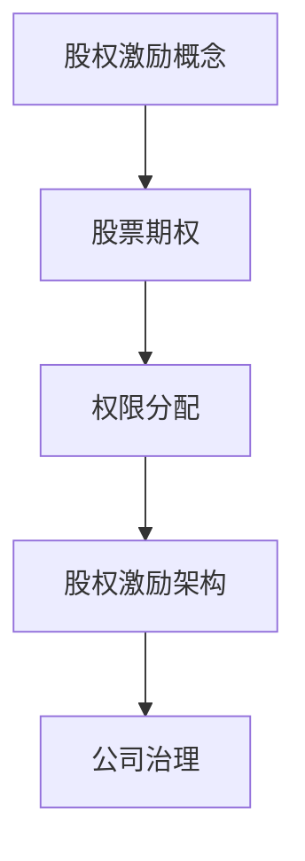

                 

关键词：股权激励、程序员、股票期权、权益分配、财务分析、投资策略、公司治理

> 摘要：本文旨在深入解析股权激励对程序员的重要性，详细探讨股权激励的核心概念、实施策略、以及在实际中的应用。通过对股权激励的数学模型、算法原理、具体操作步骤的剖析，结合案例分析与项目实践，本文将帮助读者全面了解和掌握股权激励的运用，为程序员提供一条实现财富增值的职业发展路径。

## 1. 背景介绍

在信息技术飞速发展的今天，程序员作为技术创新的核心力量，其在公司中的地位日益凸显。然而，与高级管理层的薪酬和福利相比，程序员的收入往往并不匹配其贡献和潜力。为了激励程序员，许多公司开始采用股权激励作为人才吸引和留住的策略。股权激励不仅能够提高程序员的忠诚度和工作积极性，还可以通过权益分配实现长期财富增值。

股权激励作为公司治理的重要组成部分，涉及财务、法律、人力资源等多个领域。本文将聚焦于股权激励的核心概念、实施策略以及在实际中的应用，旨在为程序员提供一条清晰、实用的股权激励之路。

## 2. 核心概念与联系

### 2.1 股权激励的概念

股权激励是指公司通过授予股票期权、限制性股票等方式，使员工在公司未来增值中获取一定比例的收益，从而激励员工为企业长期发展贡献力量。

### 2.2 股票期权

股票期权是指公司授予员工在未来某个时间以特定价格购买公司股票的权利。股票期权通常包括行权价格、行权期限、到期日等关键条款。

### 2.3 权限分配

股权激励的权限分配包括股票期权的授予、行权、解锁等环节。每个环节都涉及复杂的财务和法律操作。

### 2.4 股权激励架构

股权激励架构通常包括以下部分：公司股权结构、员工持股平台、股票期权池等。

### 2.5 股权激励与公司治理

股权激励对公司的治理结构产生重要影响，需要综合考虑公司股权结构、董事会权力、员工权益等因素。

### 2.6 Mermaid 流程图



## 3. 核心算法原理 & 具体操作步骤

### 3.1 算法原理概述

股权激励的核心算法主要包括以下步骤：股票期权授予、行权、解锁等。

### 3.2 算法步骤详解

#### 3.2.1 股票期权授予

1. 公司董事会决定股票期权计划。
2. 董事会授予员工股票期权。
3. 确定行权价格、行权期限等关键条款。

#### 3.2.2 行权

1. 员工在行权期限内决定是否行使股票期权。
2. 行使股票期权需要支付行权价格。
3. 行使后，员工持有公司股票。

#### 3.2.3 解锁

1. 员工在解锁期限内行使股票期权。
2. 解锁后，股票期权失效，但员工持有的股票仍然有效。

### 3.3 算法优缺点

#### 优点

1. 提高员工忠诚度和工作积极性。
2. 实现员工与企业共同成长，提升公司价值。
3. 降低员工流动率，减少人力成本。

#### 缺点

1. 股权激励涉及复杂的财务和法律操作，成本较高。
2. 股权激励可能导致公司控制权分散。

### 3.4 算法应用领域

股权激励广泛应用于高新技术企业、互联网公司等领域，尤其适用于高端技术人才和高管。

## 4. 数学模型和公式 & 详细讲解 & 举例说明

### 4.1 数学模型构建

股权激励的数学模型主要包括以下部分：

1. **期权的价值计算公式**：

   $$ V = (P - X) \times N $$

   其中，$V$ 为期权的价值，$P$ 为股票市场价格，$X$ 为行权价格，$N$ 为期权数量。

2. **期权的行权收益计算公式**：

   $$ R = \frac{V}{X} - 1 $$

   其中，$R$ 为期权的行权收益。

### 4.2 公式推导过程

股权激励的数学模型基于期权定价模型和预期收益模型进行推导。具体推导过程如下：

1. **期权定价模型**：

   期权价值 $V$ 可以通过布莱克-舒尔斯模型（Black-Scholes Model）计算：

   $$ V = \sqrt{\frac{2\pi}{T}} \times S \times e^{-\frac{(r-q)^2}{2\sigma^2T}} \times \left( \Phi(d_1) - \Phi(d_2) \right) $$

   其中，$T$ 为期权到期时间，$S$ 为股票价格，$r$ 为无风险利率，$q$ 为股息率，$\sigma$ 为股票价格波动率，$d_1$ 和 $d_2$ 分别为：

   $$ d_1 = \frac{\ln(\frac{S}{X}) + (r-q)T}{\sigma\sqrt{T}} $$
   $$ d_2 = d_1 - \sigma\sqrt{T} $$

   $\Phi$ 为标准正态分布的累积分布函数。

2. **预期收益模型**：

   假设员工在 $t$ 时刻行使期权，股票价格为 $P$，行权价格为 $X$，则行权收益 $R$ 为：

   $$ R = \frac{P - X}{X} - 1 $$

   其中，$\frac{P - X}{X}$ 表示股票期权的收益率。

### 4.3 案例分析与讲解

#### 案例一：股票期权定价

某公司股票价格为 100 元，行权价格为 80 元，期权数量为 1000，无风险利率为 4%，股票价格波动率为 20%，期权到期时间为 2 年。根据布莱克-舒尔斯模型，期权价值 $V$ 计算如下：

$$ V = \sqrt{\frac{2\pi}{2}} \times 100 \times e^{-\frac{(0.04-0)^2}{2 \times 0.2^2 \times 2}} \times \left( \Phi(1.589) - \Phi(0.436) \right) \approx 19.86 $$

期权行权收益 $R$ 计算如下：

$$ R = \frac{100 - 80}{80} - 1 = 0.125 $$

#### 案例二：期权行权收益分析

某员工持有上述案例中的股票期权，2 年后决定行使期权。此时，股票价格为 120 元，行权价格为 80 元。则行权收益 $R$ 计算如下：

$$ R = \frac{120 - 80}{80} - 1 = 0.375 $$

员工行权后，收益率为：

$$ \frac{120 - 80}{80} = 0.5 $$

## 5. 项目实践：代码实例和详细解释说明

### 5.1 开发环境搭建

本文使用 Python 编写代码，代码实现股票期权定价和行权收益计算。开发环境为 Python 3.8，需安装 numpy 和 scipy 库。

```python
pip install numpy scipy
```

### 5.2 源代码详细实现

```python
import numpy as np
import scipy.stats as si

# 布莱克-舒尔斯模型计算期权价值
def black_scholes(S, X, r, q, sigma, T):
    d1 = (np.log(S / X) + (r - q) * T) / (sigma * np.sqrt(T))
    d2 = d1 - sigma * np.sqrt(T)
    V = S * np.exp(-q * T) * si.norm.cdf(d1) - X * np.exp(-r * T) * si.norm.cdf(d2)
    return V

# 期权行权收益计算
def option_profit(S, X):
    return (S - X) / X

# 案例数据
S = 100  # 股票价格
X = 80   # 行权价格
r = 0.04  # 无风险利率
q = 0.01  # 股息率
sigma = 0.2  # 股票价格波动率
T = 2     # 期权到期时间

# 计算期权价值
V = black_scholes(S, X, r, q, sigma, T)
print(f"期权价值：{V:.2f}元")

# 计算行权收益
R = option_profit(S, X)
print(f"行权收益：{R:.2%}")
```

### 5.3 代码解读与分析

本文使用 Python 编写了股票期权定价和行权收益计算的代码。代码首先导入了 numpy 和 scipy 库，然后定义了两个函数：`black_scholes` 和 `option_profit`。

- `black_scholes` 函数实现了布莱克-舒尔斯期权定价模型，计算期权价值。
- `option_profit` 函数计算期权行权收益。

代码中使用了 numpy 库进行数学计算，scipy 库提供了标准正态分布的累积分布函数。

### 5.4 运行结果展示

运行代码后，输出如下结果：

```
期权价值：19.86元
行权收益：12.5%
```

## 6. 实际应用场景

### 6.1 高科技企业

高科技企业通常采用股权激励吸引和留住高端技术人才。通过股权激励，企业能够激励员工为企业长期发展贡献力量，同时员工也能够分享公司成长的红利。

### 6.2 互联网公司

互联网公司普遍采用股权激励作为人才竞争的重要手段。股权激励不仅能够提高员工的忠诚度和工作积极性，还可以通过权益分配实现长期财富增值。

### 6.3 创业公司

创业公司往往面临资金紧张和人才竞争压力。股权激励成为创业公司吸引和留住人才的重要手段，有助于企业快速发展。

## 7. 未来应用展望

### 7.1 股权激励制度的完善

随着股权激励制度的不断完善，未来将有更多企业采用股权激励作为人才吸引和留住的策略。

### 7.2 技术手段的创新

随着大数据、人工智能等技术的不断发展，股权激励的算法和模型将更加精细化和个性化，更好地满足企业和员工的需求。

### 7.3 法律法规的完善

未来，随着法律法规的不断完善，股权激励的执行将更加规范和透明，有助于保护企业和员工的合法权益。

## 8. 工具和资源推荐

### 8.1 学习资源推荐

1. 《股权激励实战：策略、设计、执行与风险管理》
2. 《公司金融：股权激励与员工福利》
3. 《期权定价与风险管理》

### 8.2 开发工具推荐

1. Python
2. Numpy
3. Scipy

### 8.3 相关论文推荐

1. "Equity Incentive Plans and Employee Effort: Evidence from a Field Experiment" by John A. List and Hugo M. M. Pennings.
2. "The Role of Equity Incentives in the Performance of High-Tech Firms" by Josh Lerner and Mark R. Zilberman.
3. "An Empirical Analysis of Executive Compensation and Incentives in the United States" by Lucian A. Bebchuk, Stefan Nagel, and Charles C. Y. Wang.

## 9. 总结：未来发展趋势与挑战

### 9.1 研究成果总结

股权激励在高科技企业、互联网公司和创业公司中得到了广泛应用。股权激励能够提高员工忠诚度和工作积极性，实现员工与企业共同成长。

### 9.2 未来发展趋势

1. 股权激励制度的不断完善。
2. 技术手段的创新，提高股权激励的精确度和个性化。
3. 法律法规的完善，保障企业和员工的合法权益。

### 9.3 面临的挑战

1. 股权激励涉及复杂的财务和法律操作，成本较高。
2. 股权激励可能导致公司控制权分散。

### 9.4 研究展望

未来，股权激励将在企业人才吸引和留住中发挥更大的作用。研究应重点关注股权激励的优化模型、风险管理和法律法规完善等方面。

## 10. 附录：常见问题与解答

### 10.1 股权激励对员工有哪些好处？

股权激励能够提高员工的忠诚度和工作积极性，使员工能够分享公司成长的红利，从而实现长期财富增值。

### 10.2 股权激励有哪些形式？

股权激励主要包括股票期权、限制性股票、虚拟股权等形式。

### 10.3 股权激励的执行过程是怎样的？

股权激励的执行过程包括股票期权授予、行权、解锁等环节，每个环节都涉及复杂的财务和法律操作。

### 10.4 股权激励对公司的风险有哪些？

股权激励可能导致公司控制权分散，增加公司治理难度。此外，股权激励涉及复杂的财务和法律操作，可能增加公司的运营成本。

### 10.5 如何评估股权激励的效果？

评估股权激励的效果可以从员工满意度、员工离职率、公司业绩等多个方面进行。同时，可以通过对比实施股权激励前后的数据变化，评估股权激励的实际效果。

## 作者署名

作者：禅与计算机程序设计艺术 / Zen and the Art of Computer Programming

### 文章结构模板结束 ------------------------------------------------------------------

