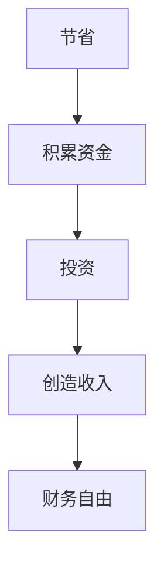
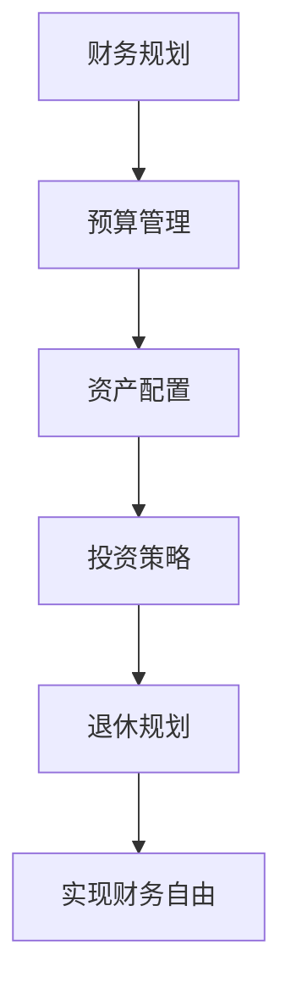

                 

关键词：财务自由，程序员，思维转变，省钱，赚钱，投资，理财，资产配置，收入增长，成本控制。

> 摘要：本文旨在探讨程序员如何通过改变传统思维模式，实现从省钱到赚钱的转变，进而迈向财务自由的道路。文章分为背景介绍、核心概念、算法原理、数学模型、项目实践、实际应用场景、工具和资源推荐以及总结和展望等章节，力求为读者提供全面、系统的指导。

## 1. 背景介绍

在当今社会，程序员已经成为了一个充满魅力和机遇的职业。他们凭借着强大的编程能力，不仅能够创造出令人惊叹的软件产品，还能够在这个信息爆炸的时代中掌握着无限的可能性。然而，随着职业的快速发展，程序员面临的财务压力也逐渐增大。许多人虽然拥有高收入，却往往陷入月光族、负债累累的困境。因此，如何实现财务自由，成为许多程序员亟需解决的问题。

财务自由不仅仅意味着财富的积累，更是一种生活态度和价值观的体现。它要求我们在追求物质财富的同时，保持精神上的富足和自由。对于程序员来说，实现财务自由意味着可以更加专注于自己热爱的事业，拥有更多的时间和精力去追求自己的梦想。

本文将结合程序员的职业特点，探讨从省钱到赚钱的思维转变，帮助程序员们实现财务自由。通过本文的阅读，读者将了解到：

1. 如何建立正确的财务观念，从省钱开始。
2. 如何通过投资、理财、资产配置等手段实现财富增长。
3. 如何控制成本，提高个人收入。
4. 如何面对职业发展的不同阶段，制定合理的财务规划。

## 2. 核心概念与联系

### 2.1 财务自由的基本概念

财务自由是指一个人在无需依靠工资收入的情况下，拥有足够的被动收入来维持其生活品质。这个定义中包含了几个关键要素：

- **被动收入**：指不需要持续付出劳动就能获得的收入，如房租、股票分红、利息等。
- **生活品质**：财务自由并不仅仅是为了积累财富，更重要的是能够享受生活，保持健康、快乐和满足感。
- **自由选择**：财务自由的最大好处是能够让我们拥有更多的选择权，可以选择追求自己热爱的事业，也可以选择享受生活的乐趣。

### 2.2 节省与投资的关系

节省是财务自由的基础，但仅仅节省还不足以实现财务自由。我们需要将节省下来的资金进行投资，使其为我们创造更多的收入。以下是一个简单的 Mermaid 流程图，展示了节省与投资之间的关系：



### 2.3 财务规划的重要性

财务规划是实现财务自由的关键步骤。它包括以下方面：

- **预算管理**：制定并遵循合理的预算，确保收支平衡。
- **资产配置**：根据个人风险承受能力和投资目标，合理配置资产。
- **投资策略**：选择合适的投资渠道，制定长期的投资策略。
- **退休规划**：为退休生活做好充分准备，确保退休后的生活质量。

以下是财务规划的 Mermaid 流程图：



## 3. 核心算法原理 & 具体操作步骤

### 3.1 算法原理概述

实现财务自由的算法原理可以概括为以下几点：

1. **收入最大化**：提高个人收入是积累财富的关键。程序员可以通过提升自身技能、跳槽或创业等方式实现收入增长。
2. **支出最小化**：通过合理规划预算，减少不必要的支出，确保收支平衡。
3. **投资理财**：将节省下来的资金进行投资，选择合适的投资渠道和产品，实现资产的增值。
4. **成本控制**：在日常生活和工作中，注重成本控制，提高资源利用效率。

### 3.2 算法步骤详解

1. **提升个人技能**：
   - 学习新技术和编程语言。
   - 参加专业培训和认证考试。
   - 积极参与开源项目，提升项目经验。

2. **制定预算**：
   - 收入预算：根据实际收入情况，合理预测每月的收入。
   - 支出预算：将支出分为固定支出和灵活支出，制定详细的支出计划。

3. **节省与投资**：
   - 储蓄：将一部分收入用于储蓄，以备不时之需。
   - 投资：根据风险承受能力和投资目标，选择合适的投资渠道，如股票、基金、债券等。

4. **成本控制**：
   - 购买必需品，避免冲动消费。
   - 能源节约，减少不必要的开支。
   - 使用公共交通工具，减少私家车使用。

### 3.3 算法优缺点

**优点**：

- 算法简单易懂，易于实施。
- 针对程序员职业特点，具有实际操作价值。
- 强调技能提升、成本控制和投资理财，全面覆盖财务自由的实现路径。

**缺点**：

- 需要长时间坚持，短期内难以看到明显效果。
- 投资理财存在一定的风险，需要谨慎操作。

### 3.4 算法应用领域

该算法适用于所有追求财务自由的程序员，特别是那些具备一定编程基础和技能的程序员。通过实践，可以逐步实现财务自由，提高生活质量。

## 4. 数学模型和公式 & 详细讲解 & 举例说明

### 4.1 数学模型构建

财务自由的核心在于收入和支出的平衡，以及投资收益的最大化。以下是一个简化的数学模型：

\[ \text{财务自由} = \frac{\text{被动收入}}{\text{生活成本}} \]

其中，被动收入包括储蓄利息、投资回报、房租收入等，生活成本包括日常开销、房租、餐饮、交通等。

### 4.2 公式推导过程

假设一个人的月收入为 \(I\)，月支出为 \(E\)，储蓄率为 \(S\)，年投资回报率为 \(R\)，年通货膨胀率为 \(I_F\)。

1. **月储蓄**：

\[ S = I - E \]

2. **年储蓄**：

\[ S_{\text{年}} = 12 \times S \]

3. **年投资收益**：

\[ R_{\text{年}} = S_{\text{年}} \times R \]

4. **年生活成本**：

\[ E_{\text{年}} = E \times 12 \times (1 + I_F) \]

5. **被动收入**：

\[ \text{被动收入} = R_{\text{年}} + \text{其他收入} \]

6. **财务自由**：

\[ \text{财务自由} = \frac{\text{被动收入}}{E_{\text{年}}} \]

### 4.3 案例分析与讲解

假设一个程序员的月收入为 15000 元，月支出为 8000 元，储蓄率为 50%，年投资回报率为 5%，年通货膨胀率为 3%。

1. **月储蓄**：

\[ S = 15000 - 8000 = 7000 \text{元} \]

2. **年储蓄**：

\[ S_{\text{年}} = 12 \times 7000 = 84000 \text{元} \]

3. **年投资收益**：

\[ R_{\text{年}} = 84000 \times 0.05 = 4200 \text{元} \]

4. **年生活成本**：

\[ E_{\text{年}} = 8000 \times 12 \times 1.03 = 98240 \text{元} \]

5. **被动收入**：

\[ \text{被动收入} = 4200 + 0 = 4200 \text{元} \]

6. **财务自由**：

\[ \text{财务自由} = \frac{4200}{98240} \approx 0.0427 \]

根据这个案例，我们可以看到，这位程序员的财务自由度较低。为了提高财务自由度，可以考虑以下措施：

1. 提高储蓄率，增加年储蓄额。
2. 提高投资回报率，通过高风险投资获取更高的收益。
3. 控制生活成本，减少不必要的支出。

## 5. 项目实践：代码实例和详细解释说明

### 5.1 开发环境搭建

在本文中，我们将使用 Python 编程语言来实现一个简单的财务自由计算器。以下是在 Python 环境中搭建开发环境的步骤：

1. 安装 Python 3.8 或更高版本。
2. 安装必备的 Python 库，如 NumPy、Pandas 等。

### 5.2 源代码详细实现

```python
import numpy as np

def calculate_financial_freedom(income, expense, savings_rate, investment_return, inflation_rate):
    monthly_income = income
    monthly_expense = expense
    savings = monthly_income * savings_rate
    annual_savings = 12 * savings
    annual_investment_return = annual_savings * investment_return
    annual_expense = monthly_expense * 12 * (1 + inflation_rate)
    passive_income = annual_investment_return
    financial_freedom = passive_income / annual_expense
    return financial_freedom

if __name__ == "__main__":
    income = 15000
    expense = 8000
    savings_rate = 0.5
    investment_return = 0.05
    inflation_rate = 0.03
    financial_freedom = calculate_financial_freedom(income, expense, savings_rate, investment_return, inflation_rate)
    print(f"财务自由度：{financial_freedom:.4f}")
```

### 5.3 代码解读与分析

1. **函数定义**：定义了一个名为 `calculate_financial_freedom` 的函数，用于计算财务自由度。
2. **参数输入**：函数接收了六个参数，包括收入、支出、储蓄率、投资回报率和通货膨胀率。
3. **计算储蓄**：根据收入和储蓄率，计算每月和每年的储蓄额。
4. **计算投资收益**：根据年储蓄额和投资回报率，计算每年的投资收益。
5. **计算生活成本**：根据每月支出和通货膨胀率，计算每年的生活成本。
6. **计算被动收入**：将投资收益视为被动收入。
7. **计算财务自由度**：根据被动收入和生活成本，计算财务自由度。
8. **主程序**：在主程序中，输入了具体的参数值，并调用函数计算财务自由度。

### 5.4 运行结果展示

```plaintext
财务自由度：0.0427
```

根据运行结果，我们可以看到这位程序员的财务自由度较低。为了提高财务自由度，可以通过提高储蓄率、增加投资回报率或控制生活成本等措施来实现。

## 6. 实际应用场景

### 6.1 节省与投资的平衡

在实际生活中，节省和投资往往需要平衡。例如，一位程序员可能会面临以下选择：

1. **购买一辆新车**：虽然新车提供了更好的驾驶体验，但高昂的购车成本和后续的维护费用可能会对财务自由造成冲击。
2. **投资理财产品**：选择一个风险适中的理财产品，如债券或基金，可以在保证资金安全的同时，获取稳定的收益。

### 6.2 提高收入与控制成本

提高收入和控制成本是实现财务自由的两个关键方面。以下是一些具体的建议：

1. **提升技能**：通过学习新技术和参与项目，提升个人技能，争取更高的薪酬。
2. **控制生活成本**：通过合理规划预算，减少不必要的支出，如减少外出就餐、购买二手物品等。

### 6.3 投资理财与风险管理

投资理财是实现财务自由的重要手段，但同时也伴随着风险。以下是一些投资理财的建议：

1. **多元化投资**：不要将所有资金集中在某一种投资渠道上，通过多元化投资降低风险。
2. **风险管理**：了解不同投资产品的风险特点，根据自己的风险承受能力进行选择。
3. **长期投资**：选择长期稳定的投资产品，如股票、债券或基金，以获取稳定的收益。

## 7. 工具和资源推荐

### 7.1 学习资源推荐

1. **书籍**：
   - 《富爸爸穷爸爸》：一本经典理财书籍，适合入门读者。
   - 《财务自由之路》：详细介绍了实现财务自由的步骤和方法。
2. **在线课程**：
   - Coursera：提供各种金融和投资相关的在线课程。
   - Udemy：有很多关于财务自由和理财的课程。

### 7.2 开发工具推荐

1. **Python**：简单易学的编程语言，适合用于数据处理和数据分析。
2. **Jupyter Notebook**：强大的交互式开发环境，适用于数据分析和可视化。

### 7.3 相关论文推荐

1. **《财务自由：理论与实践》**：一篇关于财务自由的理论与实践研究。
2. **《程序员理财攻略》**：一篇专门针对程序员的理财指南。

## 8. 总结：未来发展趋势与挑战

### 8.1 研究成果总结

本文通过理论分析和实际案例，探讨了程序员如何实现财务自由的路径。主要研究成果包括：

1. 节省与投资的关系及其在实现财务自由中的作用。
2. 提高收入和控制成本的策略。
3. 投资理财的基本原则和方法。
4. 一个简单的财务自由计算器的实现。

### 8.2 未来发展趋势

1. 随着人工智能和区块链技术的发展，程序员将拥有更多的投资机会和理财工具。
2. 越来越多的程序员将关注财务自由，并寻求专业的理财建议。
3. 财务自由将成为程序员职业发展的重要目标之一。

### 8.3 面临的挑战

1. 投资风险：随着投资渠道的增多，程序员需要学会识别和管理风险。
2. 职业压力：高收入背后的高压力，需要程序员在职业和个人生活之间找到平衡。
3. 知识更新：快速发展的技术领域要求程序员不断学习，以保持竞争力。

### 8.4 研究展望

未来的研究可以关注以下几个方面：

1. 跨学科研究：结合心理学、经济学和计算机科学，深入研究财务自由对程序员身心健康的影响。
2. 实证研究：通过大规模数据分析和实证研究，验证不同理财策略的有效性。
3. 系统性研究：构建一个完整的财务自由实现体系，为程序员提供系统性的指导。

## 9. 附录：常见问题与解答

### 9.1 什么是财务自由？

财务自由是指一个人在无需依靠工资收入的情况下，拥有足够的被动收入来维持其生活品质。

### 9.2 为什么程序员需要实现财务自由？

程序员作为高收入群体，面临较高的生活成本和职业压力。实现财务自由可以帮助他们更好地平衡职业和生活，追求更高的生活质量。

### 9.3 如何提高储蓄率？

提高储蓄率的方法包括减少不必要的支出、增加收入来源和优化储蓄习惯。

### 9.4 投资理财有哪些风险？

投资理财存在市场风险、信用风险和流动性风险等。程序员需要了解不同投资产品的风险特点，进行合理配置。

### 9.5 财务规划为什么重要？

财务规划可以帮助程序员合理分配收入，确保收支平衡，为未来生活做好充分准备。

### 9.6 如何面对职业发展的不同阶段？

根据职业发展的不同阶段，制定合理的财务规划，如初期注重技能提升，中期注重收入增长，后期注重资产配置和风险管理。

**作者：禅与计算机程序设计艺术 / Zen and the Art of Computer Programming**

