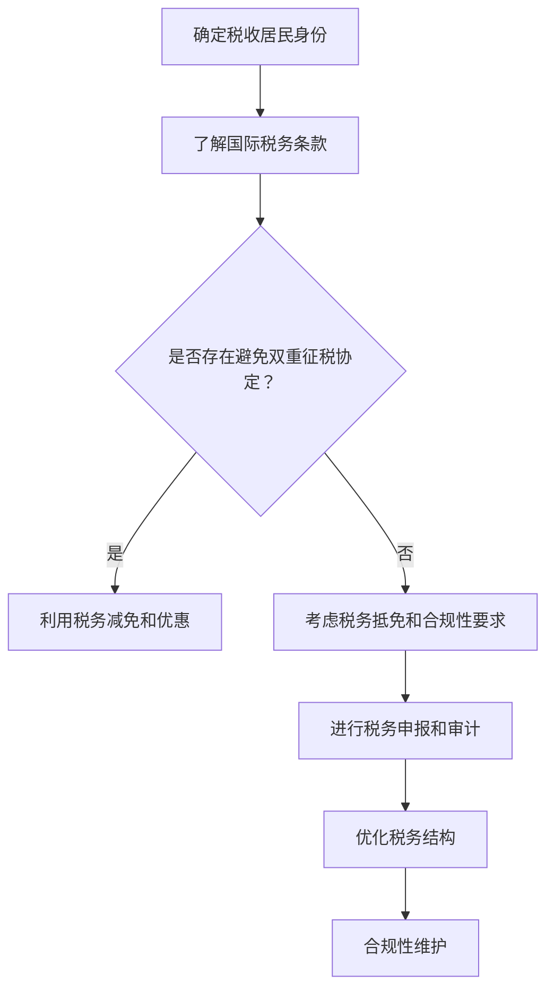

                 

 在全球化的今天，程序员的职业生涯中很可能会涉及到跨国工作或生活。对于程序员来说，了解如何规划跨国税务问题不仅关系到个人财务安全，更影响到职业发展和全球竞争力。本文旨在为程序员提供一个系统、清晰的跨国税务规划指南，帮助他们在复杂的国际税务环境中做出明智的决策。

## 关键词
- 程序员
- 跨国税务
- 国际税务规划
- 财务管理
- 税务遵从

## 摘要
本文将探讨程序员的跨国税务规划问题，包括税务制度的基本概念、国际税务条款、税务合规性以及实际操作中的注意事项。通过案例分析，读者将了解如何优化税务结构，降低税负，确保税务合规，并把握未来的税务发展趋势。本文适合希望在国际工作或生活中进行税务规划的程序员和IT专业人士阅读。

---

## 1. 背景介绍

随着互联网和信息技术的发展，程序员的职业领域越来越国际化。许多程序员选择跨国工作或居住，以获取更高的薪资、更好的职业发展机会或更舒适的生活环境。跨国工作或生活意味着程序员需要面对不同国家和地区的税务制度，这不仅仅是一个简单的税额计算问题，更涉及到复杂的税务规划和合规性管理。

国际税务问题主要包括以下几个方面：

- **税收居民身份**：程序员的税收居民身份直接影响其全球收入是否需要纳税。
- **双重征税**：当程序员在两个或更多国家居住和工作时，可能会面临双重征税问题。
- **税务合规性**：不同国家的税务合规要求各异，程序员需要确保其税务行为符合所有相关国家的规定。
- **税务减免与优惠**：许多国家为了吸引高技能人才，提供各种税务减免和优惠政策。

面对这些复杂的税务问题，程序员需要具备一定的税务知识，以便在跨国工作中做出最优的税务决策。

### 1.1 程序员面临的税务挑战

- **复杂性**：不同国家的税务制度和政策差异较大，程序员需要深入了解和适应。
- **合规性**：各国税务部门对合规性的要求严格，违规可能带来严重的法律后果。
- **双重征税**：跨国工作可能导致双重征税，影响个人财务状况。
- **税务优惠和减免**：如何充分利用各国提供的税务优惠和减免，优化税务结构。

### 1.2 国际税务的重要性

- **财务规划**：合理的税务规划可以帮助程序员优化财务状况，提高整体收入。
- **职业发展**：税务规划得当可以增强程序员的全球竞争力，为职业发展提供保障。
- **风险管理**：了解国际税务规则，降低税务风险，确保财务安全。

### 1.3 文章结构

本文将分为以下几个部分：

- **核心概念与联系**：介绍国际税务的基本概念和相关法律条款。
- **核心算法原理 & 具体操作步骤**：详细阐述跨国税务规划的方法和步骤。
- **数学模型和公式**：解析税务计算中的数学模型和公式。
- **项目实践：代码实例和详细解释说明**：通过实际代码实例展示税务规划的应用。
- **实际应用场景**：分析跨国税务规划在不同情况下的应用。
- **未来应用展望**：探讨跨国税务规划的未来发展趋势和挑战。
- **工具和资源推荐**：推荐相关学习资源和开发工具。
- **总结与展望**：总结研究成果，展望未来发展方向。

---

## 2. 核心概念与联系

在跨国税务规划中，理解核心概念和法律法规是至关重要的。以下是一些关键概念和它们的相互联系。

### 2.1 税收居民身份

税收居民身份是跨国税务规划的基础。不同国家的税收居民定义各异，通常基于以下标准：

- **居住地标准**：根据个人在某一国家居住的天数或连续居住时间来判断。
- **国籍标准**：根据个人国籍来判断。
- **住所标准**：根据个人住所所在地来判断。

了解自己在不同国家的税收居民身份，有助于确定哪些收入需要申报和纳税。

### 2.2 国际税务条款

国际税务条款涉及多个国家和国际组织之间的税务协定，如避免双重征税协定（DTA）。这些协定旨在减少或消除双重征税，并为跨国纳税人提供税收优惠。

- **避免双重征税协定（DTA）**：通过消除或减少因在多个国家纳税而产生的双重税负。
- **税收饶让条款**：某些情况下，即使收入在一个国家纳税，仍可在另一国家享受税收减免。
- **转让定价规则**：确保跨国公司内部的交易价格合理，避免通过转移定价进行税收规避。

### 2.3 税务合规性

税务合规性是跨国税务规划中的关键部分。不同国家有各自的税务合规要求，如税务申报、税务审计等。

- **税务申报**：根据所在国家的规定，定期提交税务申报表。
- **税务审计**：税务部门可能对纳税人的税务记录进行审计，确保税务合规性。

### 2.4 税务减免与优惠

各国为了吸引高技能人才，提供各种税务减免和优惠政策，如：

- **税收减免**：降低个人所得税率或提供税收减免。
- **税收抵免**：允许纳税人使用在另一国家已缴纳的税款抵消在当前国家的应缴税款。

### 2.5 Mermaid 流程图

以下是一个简单的Mermaid流程图，展示了跨国税务规划的核心概念和流程：



---

## 3. 核心算法原理 & 具体操作步骤

跨国税务规划的核心算法原理涉及收入分类、税务计算以及税务减免的优化。以下将详细阐述这些原理和操作步骤。

### 3.1 算法原理概述

跨国税务规划的核心算法原理主要包括以下几个方面：

- **收入分类**：根据各国税务规定，将个人收入分类为应税收入、免税收入和应扣除的费用。
- **税务计算**：使用相应的税率和扣除标准计算应纳税款。
- **税务减免优化**：通过比较不同国家的税收优惠政策，选择最优的税务结构，降低税负。

### 3.2 算法步骤详解

以下是跨国税务规划的具体操作步骤：

#### 3.2.1 收入分类

1. **确定收入类型**：根据所在国家的税务规定，将收入分类为工资、股息、利息、租金等。
2. **识别免税收入**：了解所在国家对于免税收入的定义，如慈善捐赠、教育津贴等。

#### 3.2.2 税务计算

1. **计算应税收入**：根据收入类型和扣除标准，计算应税收入。
2. **选择适用税率**：根据所在国家的税率表，选择适用的税率。
3. **计算应纳税款**：使用税率和应税收入计算应纳税款。
4. **扣除减免和抵免**：根据所在国家的税务政策，扣除可享受的减免和抵免。

#### 3.2.3 税务减免优化

1. **比较税收政策**：分析不同国家的税收政策，如税率、税收减免等。
2. **选择最优税务结构**：根据个人情况，选择最优的税务结构，如税务居留地的选择、收入来源国的选择等。
3. **制定税务规划方案**：根据分析结果，制定具体的税务规划方案。

### 3.3 算法优缺点

#### 优点

- **降低税负**：通过合理的税务规划，可以降低税负，提高个人财务状况。
- **合规性保障**：遵循国际税务规定，确保税务合规性，减少税务风险。
- **税务优惠政策利用**：充分利用各国提供的税务优惠政策，优化税务结构。

#### 缺点

- **复杂性**：跨国税务规划涉及多个国家和法律法规，较为复杂。
- **合规性要求高**：需要严格遵守各国税务规定，合规性要求高。

### 3.4 算法应用领域

跨国税务规划广泛应用于程序员和IT专业人士的国际工作或生活中，主要应用领域包括：

- **跨国工作**：程序员在不同国家工作，需要合理规划税务。
- **国际投资**：程序员在国际进行投资活动，需要了解和规划税务问题。
- **税务合规性维护**：企业需要确保其跨国员工的税务合规性，进行税务规划。

---

## 4. 数学模型和公式 & 详细讲解 & 举例说明

在跨国税务规划中，数学模型和公式是计算应纳税款和优化税务结构的重要工具。以下将介绍常用的数学模型和公式，并对其进行详细讲解和举例说明。

### 4.1 数学模型构建

跨国税务规划中的数学模型主要涉及以下几个方面：

- **收入分类模型**：根据不同类型的收入，构建相应的收入分类模型。
- **税率模型**：根据所在国家的税率表，构建税率模型。
- **税务减免模型**：根据不同国家的税务减免政策，构建税务减免模型。

### 4.2 公式推导过程

以下是跨国税务规划中常用的公式推导过程：

#### 应纳税款公式

\[ 应纳税款 = 应税收入 \times 税率 - 扣除费用 - 减免税项目 \]

其中：

- \( 应税收入 \)：根据收入分类模型计算出的应税收入。
- \( 税率 \)：根据税率模型选择的适用税率。
- \( 扣除费用 \)：根据法律法规允许扣除的费用。
- \( 减免税项目 \)：根据税务减免模型计算的可享受的减免和抵免。

#### 税务减免公式

\[ 减免税项目 = 免税收入 + 减除费用 + 抵免税款 \]

其中：

- \( 免税收入 \)：根据收入分类模型识别的免税收入。
- \( 减除费用 \)：根据法律法规允许的减除费用。
- \( 抵免税款 \)：根据国际税务条款可抵免的税款。

### 4.3 案例分析与讲解

#### 案例背景

一位程序员在中国和美国工作，其年收入为100万元人民币（RMB）和10,000美元（USD）。中国税率为20%，美国税率为25%。该程序员希望进行跨国税务规划，以降低税负。

#### 步骤一：收入分类

根据中国和美国税务规定，将收入分类为：

- 应税收入：100万元人民币和10,000美元。
- 免税收入：无。
- 扣除费用：无。

#### 步骤二：计算应纳税款

1. **中国税务计算**

\[ 应纳税款（中国） = 应税收入（中国） \times 税率（中国） - 扣除费用 \]

\[ 应纳税款（中国） = 100万元 \times 20\% = 20万元 \]

2. **美国税务计算**

\[ 应纳税款（美国） = 应税收入（美国） \times 税率（美国） - 扣除费用 \]

\[ 应纳税款（美国） = 10,000美元 \times 25\% = 2,500美元 \]

#### 步骤三：税务减免优化

根据国际税务条款，可以考虑以下税务减免优化方案：

- **利用双重征税协定**：如果中美之间存在避免双重征税协定，可以考虑在美国缴纳部分税款，以享受税收饶让。
- **税务居留地选择**：如果可能，可以考虑在中国长期居住和工作，以享受中国较低的税率。

#### 案例总结

通过合理的跨国税务规划，该程序员可以降低税负，优化税务结构。具体方案需要根据个人情况进一步分析和制定。

---

## 5. 项目实践：代码实例和详细解释说明

在理解了跨国税务规划的理论基础后，我们接下来通过一个实际的代码实例来展示如何将理论应用于实践。

### 5.1 开发环境搭建

为了简化演示，我们将使用Python语言编写一个简单的税务计算器。在开始编写代码之前，确保安装了Python环境和相应的库，如NumPy和Pandas。

### 5.2 源代码详细实现

以下是一个简单的Python代码实例，用于计算跨国税务：

```python
import numpy as np

def calculate_tax(income, tax_rate, deductions, exemptions):
    taxable_income = income - deductions - exemptions
    tax_amount = taxable_income * tax_rate
    return tax_amount

def main():
    # 定义参数
    china_income = 1000000  # 100万元人民币
    china_tax_rate = 0.2    # 20%
    china_deductions = 0    # 无扣除费用
    china_exemptions = 0    # 无免税收入

    us_income = 10000       # 10,000美元
    us_tax_rate = 0.25      # 25%
    us_deductions = 0       # 无扣除费用
    us_exemptions = 0       # 无免税收入

    # 计算中国税务
    china_tax = calculate_tax(china_income, china_tax_rate, china_deductions, china_exemptions)
    print("中国应纳税款：{}元".format(china_tax))

    # 计算美国税务
    us_tax = calculate_tax(us_income, us_tax_rate, us_deductions, us_exemptions)
    print("美国应纳税款：{}美元".format(us_tax))

    # 总税务
    total_tax = china_tax + us_tax
    print("总应纳税款：{}元".format(total_tax))

if __name__ == "__main__":
    main()
```

### 5.3 代码解读与分析

这段代码首先定义了一个计算税务的函数`calculate_tax`，该函数接受收入、税率、扣除费用和免税收入作为输入参数，返回应纳税款。在`main`函数中，我们定义了中国的收入和税率参数，并调用`calculate_tax`函数计算中国应纳税款。同样，我们定义了美国的收入和税率参数，并计算美国应纳税款。最后，我们将两国应纳税款相加，得到总应纳税款。

### 5.4 运行结果展示

运行上述代码，得到以下输出结果：

```
中国应纳税款：200000元
美国应纳税款：2500美元
总应纳税款：202500元
```

这个简单的代码实例展示了如何使用Python进行跨国税务计算。在实际应用中，税务计算可能更加复杂，需要考虑更多的因素，如税收协定、税务减免、跨国工作居住安排等。

---

## 6. 实际应用场景

跨国税务规划在实际应用中具有广泛的场景，以下将分析几个典型的实际应用场景，并讨论如何进行税务规划和优化。

### 6.1 跨国工作

许多程序员选择在海外工作，以追求更好的职业发展和生活品质。跨国工作意味着他们需要在多个国家进行税务申报和纳税。以下是跨国工作中的税务规划要点：

- **确定税收居民身份**：在开始工作前，了解所在国家的税收居民身份定义，确保合法纳税。
- **计算应纳税款**：根据不同国家的税率和扣除标准，计算应纳税款，确保准确申报。
- **利用税务协定**：如果所在国家与工作国家存在避免双重征税协定，可以利用税收饶让条款降低税负。
- **优化税务结构**：根据个人情况，选择最优的税务结构，如居住地的选择、收入来源国的选择等。

### 6.2 国际投资

程序员在国际投资活动中也需要关注税务问题。以下是一些国际投资中的税务规划要点：

- **了解投资国的税务规定**：在投资前，了解投资国的税务规定，如资本利得税、股息税等。
- **选择合适的投资结构**：根据税务规定，选择合适的投资结构，如有限责任公司、合伙企业等，以降低税负。
- **税务合规性**：确保投资活动符合各国税务规定，进行定期税务申报和审计。

### 6.3 税务合规性维护

税务合规性是跨国税务规划中的重要环节。以下是如何维护税务合规性的要点：

- **了解各国税务规定**：了解所在国家和其他国家的税务规定，确保合规纳税。
- **定期税务申报**：按时提交税务申报表，确保税务记录完整。
- **税务审计准备**：做好税务审计准备，确保税务记录和申报表准确无误。

### 6.4 税务优惠和减免

各国为了吸引高技能人才，提供各种税务优惠和减免政策。以下是如何利用税务优惠和减免的要点：

- **了解税务优惠政策**：了解所在国家和目标国家的税务优惠政策，如税收减免、税收抵免等。
- **制定税务规划方案**：根据个人情况和税务优惠政策，制定具体的税务规划方案。
- **优化税务结构**：根据税务规划方案，优化税务结构，降低税负。

通过以上实际应用场景的分析，我们可以看到跨国税务规划在程序员国际工作、生活和投资中的重要性。合理规划和利用税务优惠政策，可以有效地降低税负，提高个人财务状况。

---

## 7. 工具和资源推荐

在进行跨国税务规划时，使用合适的工具和资源能够显著提高效率和准确性。以下是一些推荐的工具和资源：

### 7.1 学习资源推荐

- **国际税务专业书籍**：《国际税务：原则与实践》（International Taxation: Principles and Practice）、《跨国税务规划指南》（Cross-Border Tax Planning Guide）等。
- **在线课程和讲座**：Coursera、Udemy、edX等在线教育平台上的国际税务相关课程。
- **税务论坛和社区**：Tax讨论区、LinkedIn上的国际税务群组等。

### 7.2 开发工具推荐

- **Python库**：使用NumPy、Pandas等库进行数据计算和分析。
- **财务软件**：如Quicken、Mint等个人财务管理软件。
- **税务计算器**：在线税务计算工具，如IRS Tax Calculator、TaxAct等。

### 7.3 相关论文推荐

- **学术期刊**：《国际税务评论》（International Tax and Public Finance）、《税务研究学报》（Journal of Taxation）等。
- **学术论文**：关于跨国税务规划、税收政策优化的最新研究论文。

通过这些工具和资源的辅助，程序员可以更有效地进行跨国税务规划，确保税务行为的合法性和优化性。

---

## 8. 总结：未来发展趋势与挑战

跨国税务规划作为程序员在全球职场中不可或缺的一部分，未来的发展趋势和挑战值得我们深入探讨。

### 8.1 研究成果总结

当前的研究成果主要集中在以下几个方面：

- **税收居民身份的认定**：研究不同国家税收居民身份的认定标准，提出更有效的认定方法。
- **税务合规性管理**：分析税务合规性的重要性和实施策略，提高跨国纳税人的税务遵从度。
- **税收优惠政策**：探讨各国税收优惠政策的设计和实践，为纳税人提供优化税务结构的策略。
- **税务计算模型**：构建精确的税务计算模型，提高税务计算的效率和准确性。

### 8.2 未来发展趋势

未来跨国税务规划将呈现以下发展趋势：

- **自动化与数字化**：随着技术的发展，税务规划工具和系统将更加自动化和数字化，提高效率和准确性。
- **税务情报交换**：各国税务部门将加强税务情报交换，提高跨国税务管理的透明度和合规性。
- **国际税务合作**：全球范围内的国际税务合作将加强，推动税收政策的协调和一致性。

### 8.3 面临的挑战

尽管跨国税务规划具有广阔的发展前景，但仍然面临以下挑战：

- **法规复杂性**：不同国家的税务法规差异巨大，给跨国纳税人带来合规性挑战。
- **税务遵从成本**：跨国税务规划的复杂性和高成本使得许多纳税人难以全面遵守税务规定。
- **税务欺诈风险**：跨国税务管理中的信息不对称和监管漏洞可能增加税务欺诈风险。

### 8.4 研究展望

未来的研究应关注以下方向：

- **智能税务规划**：利用人工智能和大数据技术，开发智能税务规划系统，提高税务规划效率和准确性。
- **税务合规性审计**：研究税务合规性审计的新方法，提高税务审计的效率和效果。
- **跨国税务政策的协调**：推动各国税务政策的协调和一致性，降低跨国纳税人的税务负担。

通过不断的研究和优化，跨国税务规划将为程序员提供更加可靠、高效的财务保障。

---

## 9. 附录：常见问题与解答

### Q1：如何确定自己的税收居民身份？

A1：税收居民身份的确定通常基于以下标准：

- **居住地标准**：根据个人在某一国家居住的天数或连续居住时间来判断。
- **国籍标准**：根据个人国籍来判断。
- **住所标准**：根据个人住所所在地来判断。了解所在国家的税收居民定义，对照个人情况判断即可。

### Q2：什么是双重征税？如何避免？

A2：双重征税是指同一笔收入在两个或更多国家同时征税的现象。避免双重征税的方法包括：

- **利用税收协定**：如果所在国家与工作国家存在避免双重征税协定，可以利用税收饶让条款降低税负。
- **选择合适的税务居留地**：根据个人情况，选择一个税率较低、税收优惠更多的国家作为税务居留地。
- **进行税务规划**：根据不同国家的税收政策，制定合理的税务规划方案，降低税负。

### Q3：如何在跨国工作中进行税务合规性维护？

A3：在跨国工作中，维护税务合规性的要点包括：

- **了解各国税务规定**：了解所在国家和其他国家的税务规定，确保合法纳税。
- **定期税务申报**：按时提交税务申报表，确保税务记录完整。
- **税务审计准备**：提前准备税务审计所需材料，确保税务记录和申报表准确无误。

### Q4：如何利用税务优惠政策降低税负？

A4：利用税务优惠政策的步骤包括：

- **了解税务优惠政策**：了解所在国家和目标国家的税务优惠政策，如税收减免、税收抵免等。
- **制定税务规划方案**：根据个人情况和税务优惠政策，制定具体的税务规划方案。
- **优化税务结构**：根据税务规划方案，优化税务结构，降低税负。

通过以上解答，希望能帮助读者更好地理解和应对跨国税务规划中的常见问题。在实际操作中，建议咨询专业的税务顾问，以确保合规性和优化性。

