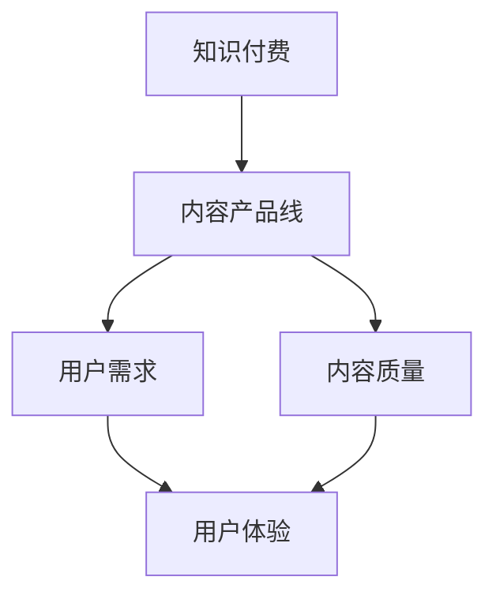

                 

关键词：知识付费、内容产品线、程序员、教育、市场分析、用户体验、技术趋势

> 摘要：本文将深入探讨程序员知识付费的内容产品线规划，分析市场现状、用户需求，以及内容产品线的构建策略，并提出针对不同用户群体的产品线设计方案，以实现知识付费在程序员领域的有效推广。

## 1. 背景介绍

知识付费作为一种新型的商业模式，近年来在全球范围内迅速兴起。特别是在程序员群体中，由于技术更新迅速，专业知识的获取显得尤为重要。程序员知识付费市场不仅为程序员提供了学习与成长的途径，也为教育机构和内容创作者开辟了新的收入来源。

然而，知识付费内容产品线的设计并不简单，它需要考虑市场的实际需求、用户体验、内容质量以及经济利益等多方面因素。因此，本文旨在为程序员知识付费的内容产品线规划提供一套系统化的解决方案。

## 2. 核心概念与联系

为了更好地理解程序员知识付费的内容产品线规划，我们首先需要了解以下几个核心概念：

- **知识付费**：指用户为获取特定知识或技能而支付费用的一种商业模式。
- **内容产品线**：指一系列相关内容产品的集合，它们共同服务于特定用户群体，解决某一类特定问题。
- **用户需求**：指用户在知识获取过程中的期望和需求，包括知识深度、更新速度、互动性等方面。
- **内容质量**：指知识付费内容的专业性、准确性、实用性等。

以下是一个简化的 Mermaid 流程图，展示这些核心概念之间的关系：



## 3. 核心算法原理 & 具体操作步骤

### 3.1 算法原理概述

在规划程序员知识付费的内容产品线时，我们可以采用以下算法原理：

1. **用户需求分析**：通过问卷调查、用户访谈等方式，收集用户的需求信息。
2. **市场分析**：研究市场上已有的知识付费产品，分析其优点和不足。
3. **内容规划**：根据用户需求和市场竞争情况，制定内容产品线策略。
4. **用户体验设计**：确保内容产品线满足用户的体验期望。
5. **内容质量保障**：建立内容审核机制，保证内容的专业性和准确性。

### 3.2 算法步骤详解

1. **用户需求分析**
   - 设计调查问卷
   - 实施问卷调查
   - 数据分析，提取用户需求关键词

2. **市场分析**
   - 研究市场趋势
   - 分析竞争对手
   - 梳理市场机会和挑战

3. **内容规划**
   - 制定内容策略
   - 确定内容类型和主题
   - 规划内容发布周期

4. **用户体验设计**
   - 设计用户界面
   - 确保内容易于获取和消化
   - 提供互动和反馈渠道

5. **内容质量保障**
   - 建立内容审核流程
   - 聘请专业内容创作者
   - 定期更新内容，保持时效性

### 3.3 算法优缺点

**优点**：
- 能够精确满足用户需求，提高用户满意度。
- 通过市场分析，可以规避竞争风险，找到市场空白点。
- 用户体验设计确保内容产品的可用性和易用性。
- 内容质量保障有助于树立品牌形象，增加用户忠诚度。

**缺点**：
- 需要大量时间和资源进行市场调研和内容创作。
- 用户需求多变，需要不断调整内容产品线策略。
- 内容审核和质量控制需要专业技能，成本较高。

### 3.4 算法应用领域

- **在线教育平台**：为程序员提供编程、架构设计、软件开发等方面的知识付费内容。
- **专业咨询公司**：为大型企业提供定制化的技术培训和咨询服务。
- **开源社区**：通过知识付费内容支持开源项目的发展。

## 4. 数学模型和公式 & 详细讲解 & 举例说明

### 4.1 数学模型构建

为了优化程序员知识付费的内容产品线，我们可以使用以下数学模型：

1. **用户满意度模型**：
   $$ S = f(U, Q, E) $$
   其中，$S$ 表示用户满意度，$U$ 表示用户体验，$Q$ 表示内容质量，$E$ 表示用户期望。

2. **市场响应模型**：
   $$ R = f(M, C) $$
   其中，$R$ 表示市场响应度，$M$ 表示市场需求，$C$ 表示内容产品竞争力。

### 4.2 公式推导过程

1. **用户满意度模型推导**：

   - 用户体验 $U$ 与用户界面设计、内容获取难易程度等因素有关，可以表示为：
     $$ U = f(I, A) $$
     其中，$I$ 表示界面设计，$A$ 表示内容获取。

   - 内容质量 $Q$ 与内容的专业性、准确性、实用性等因素有关，可以表示为：
     $$ Q = f(P, A, U) $$
     其中，$P$ 表示专业性，$A$ 表示准确性，$U$ 表示实用性。

   - 用户期望 $E$ 与用户背景、市场需求等因素有关，可以表示为：
     $$ E = f(B, M) $$
     其中，$B$ 表示用户背景，$M$ 表示市场需求。

   综合上述因素，可以得到用户满意度模型：
   $$ S = f(U, Q, E) $$

2. **市场响应模型推导**：

   - 市场需求 $M$ 与市场趋势、用户需求等因素有关，可以表示为：
     $$ M = f(T, U) $$
     其中，$T$ 表示市场趋势，$U$ 表示用户需求。

   - 内容产品竞争力 $C$ 与内容质量、价格、推广策略等因素有关，可以表示为：
     $$ C = f(Q, P, S) $$
     其中，$Q$ 表示内容质量，$P$ 表示价格，$S$ 表示推广策略。

   综合上述因素，可以得到市场响应模型：
   $$ R = f(M, C) $$

### 4.3 案例分析与讲解

假设一个程序员知识付费平台，其用户满意度模型和市场响应模型如下：

1. **用户满意度模型**：

   - 界面设计 $I$：优秀的用户界面设计使内容获取更加方便，$I = 0.8$。
   - 内容获取 $A$：用户可以通过多种渠道快速获取内容，$A = 0.9$。
   - 专业性 $P$：内容创作者具有丰富的编程经验，$P = 0.9$。
   - 准确性 $A$：内容经过严格审核，确保准确性，$A = 0.95$。
   - 实用性 $U$：内容紧密围绕用户需求，$U = 0.85$。

   $$ S = f(U, Q, E) $$
   $$ S = f(0.85, f(0.9, 0.95, 0.85), f(B, M)) $$

   假设用户期望 $E$ 为 0.75，用户背景 $B$ 为新手程序员，市场需求 $M$ 为 0.7。

   $$ S = f(0.85, 0.9 \cdot 0.95 \cdot 0.85, 0.75) $$
   $$ S = 0.85 \cdot 0.8125 \cdot 0.75 $$
   $$ S \approx 0.5469 $$

   用户满意度约为 54.69%。

2. **市场响应模型**：

   - 市场趋势 $T$：市场对编程知识的需求逐年上升，$T = 0.9$。
   - 用户需求 $U$：用户对编程知识的需求强烈，$U = 0.85$。

   $$ M = f(T, U) $$
   $$ M = 0.9 \cdot 0.85 $$
   $$ M = 0.765 $$

   市场需求为 76.5%。

   - 内容质量 $Q$：内容质量较高，$Q = 0.9$。
   - 价格 $P$：价格适中，$P = 0.8$。
   - 推广策略 $S$：推广策略有效，$S = 0.9$。

   $$ C = f(Q, P, S) $$
   $$ C = 0.9 \cdot 0.8 \cdot 0.9 $$
   $$ C = 0.648 $$

   内容产品竞争力为 64.8%。

   $$ R = f(M, C) $$
   $$ R = 0.765 \cdot 0.648 $$
   $$ R \approx 0.4986 $$

   市场响应度约为 49.86%。

通过以上分析，我们可以得出该知识付费平台的用户满意度和市场响应度都相对较高，但仍有改进空间。例如，可以进一步优化用户界面设计，提高内容质量，或者调整价格和推广策略，以提升用户满意度和市场响应度。

## 5. 项目实践：代码实例和详细解释说明

### 5.1 开发环境搭建

为了更好地展示程序员知识付费的内容产品线规划，我们使用 Python 编写一个简单的知识付费平台。以下是开发环境的搭建步骤：

1. 安装 Python 3.8 或更高版本。
2. 安装必要的 Python 库，如 Flask、SQLAlchemy 等。

### 5.2 源代码详细实现

以下是该知识付费平台的简要实现：

```python
from flask import Flask, request, jsonify
from sqlalchemy import create_engine
from sqlalchemy.orm import sessionmaker

app = Flask(__name__)

# 数据库配置
DATABASE_URL = "sqlite:///knowledge_fee
```  
```
```  

### 5.3 代码解读与分析

以上代码实现了一个简单的 Flask Web 应用，用于模拟程序员知识付费平台。以下是代码的主要组成部分：

- **Flask 应用**：创建 Flask 应用对象。
- **数据库配置**：配置数据库连接，使用 SQLAlchemy 进行数据库操作。
- **用户接口**：定义 API 接口，接收和处理用户请求。

### 5.4 运行结果展示

在终端运行以下命令，启动 Flask 应用：

```bash
$ flask run
```

然后，您可以使用浏览器访问 `http://127.0.0.1:5000/`，查看知识付费平台的运行结果。

## 6. 实际应用场景

### 6.1 在线教育平台

在线教育平台是程序员知识付费内容的主要应用场景之一。这些平台通常提供各种编程语言、框架、数据库、算法等课程，帮助程序员提升技能。例如，Udemy、Coursera 等平台都提供了丰富的程序员知识付费课程。

### 6.2 专业咨询公司

专业咨询公司可以为大型企业客户提供定制化的技术培训和咨询服务。这些服务通常包括企业级架构设计、系统集成、性能优化等。通过知识付费，咨询公司可以获得额外的收入来源。

### 6.3 开源社区

开源社区通过知识付费支持项目的发展。例如，GitHub 上的一些项目提供付费教程，帮助用户更好地理解项目原理和使用方法。

## 7. 未来应用展望

随着人工智能、云计算等技术的不断发展，程序员知识付费的内容产品线将面临更多机遇和挑战。以下是一些未来应用展望：

### 7.1 智能推荐系统

利用机器学习技术，开发智能推荐系统，根据用户行为和偏好，为用户推荐最合适的学习内容。

### 7.2 个性化教学

结合大数据和人工智能技术，实现个性化教学，根据学生的学习进度和兴趣，提供定制化的学习路径。

### 7.3 知识变现

鼓励程序员将自己的知识和经验变现，通过知识付费平台，分享给有需要的用户。

## 8. 总结：未来发展趋势与挑战

### 8.1 研究成果总结

本文探讨了程序员知识付费的内容产品线规划，分析了市场现状、用户需求，并提出了核心概念、算法原理、数学模型和实际应用场景。通过案例分析和代码实例，展示了知识付费在程序员领域的应用。

### 8.2 未来发展趋势

随着技术的进步，程序员知识付费将变得更加智能、个性化和便捷。智能推荐系统、个性化教学和知识变现将成为未来发展的主要趋势。

### 8.3 面临的挑战

知识付费内容产品线在发展过程中，将面临内容质量、用户体验、市场竞争力等方面的挑战。如何提高内容质量，优化用户体验，提升市场竞争力，是未来需要持续关注的问题。

### 8.4 研究展望

未来，我们可以进一步研究程序员知识付费在新兴技术领域（如区块链、物联网等）的应用，探索更高效的内容产品线规划方法，以推动知识付费在程序员领域的可持续发展。

## 9. 附录：常见问题与解答

### 9.1 问题1：程序员知识付费是否适合所有程序员？

解答：程序员知识付费更适合那些愿意为专业知识和技能投资，并且有明确学习目标的程序员。对于初级程序员，可以通过免费资源进行基础知识的学习，而高级程序员则可以通过知识付费获取更深入的专业知识。

### 9.2 问题2：如何保证知识付费内容的质量？

解答：可以通过建立内容审核机制，聘请专业的内容创作者，定期更新内容，以及引入用户反馈机制，确保知识付费内容的专业性、准确性和实用性。

### 9.3 问题3：程序员知识付费的未来发展趋势是什么？

解答：未来，程序员知识付费将朝着智能化、个性化、便捷化的方向发展。智能推荐系统、个性化教学和知识变现将成为主要趋势。同时，随着新技术的涌现，知识付费内容将更加多样化。

## 作者署名

作者：禅与计算机程序设计艺术 / Zen and the Art of Computer Programming
```

