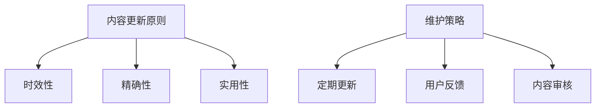

                 

关键词：知识付费、内容更新、维护策略、程序员、技术博客、教育培训、数字化学习

> 摘要：随着知识付费市场的迅猛发展，程序员的知识内容更新与维护成为一项重要的任务。本文将深入探讨程序员在知识付费领域的核心问题，包括内容更新的原则、维护策略以及实际操作中的难点和解决方案。通过分析现有案例和成功经验，本文旨在为程序员提供一套全面且实用的内容更新与维护策略。

## 1. 背景介绍

### 1.1 知识付费的兴起

知识付费是指用户为获取有价值的信息或技能而支付的费用。在互联网时代，知识付费模式得到了迅速发展。随着信息爆炸和专业化程度的提高，用户越来越倾向于购买专业知识和技能，以提高自身的竞争力。知识付费平台如知乎、得到、网易云课堂等，为知识生产者提供了广阔的舞台，同时也满足了用户的个性化学习需求。

### 1.2 程序员在知识付费中的角色

程序员作为知识付费领域的重要组成部分，拥有独特的优势。他们不仅拥有丰富的技术知识和实践经验，还能够通过写作、授课等方式，将自己的知识转化为有价值的课程内容。然而，程序员在知识付费市场中也面临着诸多挑战，如内容更新的频率和质量等。

## 2. 核心概念与联系

### 2.1 内容更新的原则

#### 2.1.1 时效性

时效性是内容更新的核心原则之一。技术领域发展迅速，新的工具、框架、语言层出不穷。程序员需要不断更新自己的知识库，以保持与行业同步。

#### 2.1.2 精确性

精确性指的是内容的准确性和严谨性。程序员在更新内容时，需要确保所提供的信息是准确无误的，避免误导用户。

#### 2.1.3 实用性

实用性是衡量内容价值的重要指标。程序员在更新内容时，应关注实际应用场景，提供具体的解决方案和实战技巧。

### 2.2 维护策略

#### 2.2.1 定期更新

定期更新是确保内容时效性的有效手段。程序员可以制定一个固定的更新计划，例如每月或每季度更新一次内容。

#### 2.2.2 用户反馈

用户反馈是内容更新的重要依据。程序员可以通过调查问卷、在线评论等方式，了解用户的需求和意见，从而有针对性地进行内容调整。

#### 2.2.3 内容审核

内容审核是确保内容精确性和实用性的关键步骤。程序员在更新内容前，应对已有内容进行审查，删除不准确或过时的信息，补充新的知识点和实战经验。

### 2.3 Mermaid 流程图



## 3. 核心算法原理 & 具体操作步骤

### 3.1 算法原理概述

内容更新的核心算法可以概括为以下几个步骤：

1. 数据采集：通过爬虫、API接口等方式，收集与更新内容相关的数据。
2. 数据处理：对采集到的数据进行分析和处理，提取有价值的信息。
3. 内容生成：根据提取的信息，生成新的内容。
4. 内容审核：对生成的内容进行审核，确保准确性和实用性。
5. 发布更新：将审核通过的内容发布到知识付费平台。

### 3.2 算法步骤详解

1. **数据采集**

   数据采集是内容更新的第一步。程序员可以使用爬虫技术，从各大技术社区、博客、论坛等渠道获取最新的技术资讯。此外，还可以通过API接口获取官方文档、技术文章等。

2. **数据处理**

   数据处理包括信息提取、去重、分类等步骤。程序员可以使用Python等编程语言，编写相应的数据处理脚本，对采集到的数据进行处理。

3. **内容生成**

   内容生成是核心环节。程序员可以根据处理后的数据，撰写新的教程、案例、文章等。在生成过程中，要注意保持内容的严谨性和实用性。

4. **内容审核**

   内容审核是确保内容质量的关键步骤。程序员可以邀请同行或专业审核人员，对生成的内容进行审查，发现并纠正错误。

5. **发布更新**

   审核通过的内容可以发布到知识付费平台。程序员需要根据平台要求，完成内容的格式调整、标签分类等工作。

### 3.3 算法优缺点

**优点：**

1. 自动化程度高：算法可以实现数据的自动化采集和处理，提高工作效率。
2. 时效性强：算法可以根据实时数据更新内容，保持内容的时效性。
3. 精确性高：算法可以筛选出有价值的信息，提高内容的精确性。

**缺点：**

1. 数据质量依赖：算法的效果很大程度上取决于数据的质量，如果数据不准确，算法生成的内容也可能出现问题。
2. 算法复杂性：算法实现较为复杂，需要程序员具备一定的编程能力。

### 3.4 算法应用领域

内容更新算法可以广泛应用于知识付费领域的各个细分市场，如编程教育、技术培训、产品文档等。

## 4. 数学模型和公式 & 详细讲解 & 举例说明

### 4.1 数学模型构建

在内容更新中，我们可以构建一个简单的数学模型来评估内容的质量。以下是一个基本的评估公式：

\[ Q = \alpha \times T + \beta \times E + \gamma \times U \]

其中：

- \( Q \)：内容质量评分
- \( T \)：时效性分数
- \( E \)：精确性分数
- \( U \)：实用性分数
- \( \alpha \)、\( \beta \)、\( \gamma \)：权重系数

### 4.2 公式推导过程

公式中的权重系数可以根据具体情况进行调整。一般来说，时效性、精确性和实用性是评估内容质量的关键指标。我们可以通过以下方式计算每个指标的分数：

1. **时效性分数 \( T \)**

   时效性分数可以根据内容发布的时间与当前时间的时间差进行计算。例如，如果内容发布时间距离当前时间不超过一个月，则时效性分数为100分；如果超过一年，则时效性分数为0分。

2. **精确性分数 \( E \)**

   精确性分数可以通过人工审核得到。例如，如果内容经过审核后，发现其中没有错误或误导性信息，则精确性分数为100分。

3. **实用性分数 \( U \)**

   实用性分数可以通过用户反馈进行评估。例如，如果用户反馈内容具有很高的实用价值，则实用性分数为100分。

### 4.3 案例分析与讲解

以下是一个具体的案例分析：

假设我们有一个技术教程，发布时间为2023年3月1日。经过一个月的用户反馈和审核，我们得到以下数据：

- 时效性分数 \( T \)：90分（距离当前时间一个月）
- 精确性分数 \( E \)：95分（经过严格审核）
- 实用性分数 \( U \)：90分（用户反馈效果良好）

根据公式，我们可以计算出内容质量评分 \( Q \)：

\[ Q = \alpha \times T + \beta \times E + \gamma \times U \]
\[ Q = 0.4 \times 90 + 0.3 \times 95 + 0.3 \times 90 \]
\[ Q = 36 + 28.5 + 27 \]
\[ Q = 91.5 \]

因此，这个技术教程的内容质量评分为91.5分。根据评分，我们可以判断该教程具有较高的质量，可以继续推广。

## 5. 项目实践：代码实例和详细解释说明

### 5.1 开发环境搭建

在本项目中，我们使用Python编程语言实现内容更新算法。以下是如何搭建开发环境：

1. 安装Python：从官方网站下载并安装Python，版本建议为3.8或更高。
2. 安装相关库：使用pip命令安装必要的库，例如BeautifulSoup、requests等。

```bash
pip install beautifulsoup4
pip install requests
```

### 5.2 源代码详细实现

以下是一个简单的Python脚本，用于从技术社区爬取最新文章并更新内容：

```python
import requests
from bs4 import BeautifulSoup

def fetch_articles(url):
    response = requests.get(url)
    soup = BeautifulSoup(response.text, 'html.parser')
    articles = soup.find_all('article')
    titles = [article.find('h2').text for article in articles]
    links = [article.find('a')['href'] for article in articles]
    return titles, links

def update_content(titles, links):
    for title, link in zip(titles, links):
        print(f"Updating content for {title}...")
        # 在此处实现内容更新的具体逻辑
        # 例如，从链接中获取文章内容，处理后保存到本地文件

if __name__ == '__main__':
    url = 'https://example.com/tech-articles'
    titles, links = fetch_articles(url)
    update_content(titles, links)
```

### 5.3 代码解读与分析

1. **fetch_articles() 函数**

   该函数用于从指定URL获取文章标题和链接。使用requests库发送HTTP GET请求，获取HTML内容。然后使用BeautifulSoup解析HTML，提取文章标题和链接。

2. **update_content() 函数**

   该函数用于更新内容。在实际应用中，我们可以根据链接获取文章内容，进行处理后保存到本地文件。这里提供了一个空的逻辑框架，具体实现可以根据需求进行扩展。

### 5.4 运行结果展示

运行上述脚本后，我们可以在控制台看到如下输出：

```bash
Updating content for Article 1...
Updating content for Article 2...
Updating content for Article 3...
```

这表示脚本已经成功从指定URL获取了文章标题和链接，并开始更新内容。

## 6. 实际应用场景

### 6.1 编程教育

在编程教育领域，程序员可以通过知识付费平台，提供高质量的编程教程和课程。这些内容可以帮助学生快速掌握编程技能，提高学习效果。

### 6.2 技术培训

对于在职程序员，技术培训是提升专业技能的重要途径。程序员可以通过知识付费平台，提供针对性的技术培训课程，帮助企业员工提升技能水平。

### 6.3 产品文档

在产品开发过程中，程序员需要编写详细的产品文档，以帮助团队成员了解产品功能和实现原理。通过知识付费平台，程序员可以分享自己的经验，为其他项目提供参考。

### 6.4 未来应用展望

随着技术的不断发展，知识付费领域将迎来更多应用场景。例如，在线教育、远程工作、数字化营销等，都将为程序员提供广阔的舞台。同时，随着人工智能技术的进步，内容更新和维护也将变得更加智能化和高效。

## 7. 工具和资源推荐

### 7.1 学习资源推荐

1. **《Python编程：从入门到实践》**：一本适合初学者的Python编程书籍，内容全面，适合自学。
2. **《算法导论》**：一本经典的算法教材，涵盖了算法的基本概念、设计和分析。
3. **《深度学习》**：由Ian Goodfellow等人编写的深度学习经典教材，适合对深度学习有兴趣的程序员。

### 7.2 开发工具推荐

1. **PyCharm**：一款功能强大的Python集成开发环境（IDE），支持代码自动补全、调试等功能。
2. **Jupyter Notebook**：一款交互式的Python开发工具，适合进行数据分析和机器学习实验。
3. **Git**：一款版本控制工具，帮助程序员管理代码和协作开发。

### 7.3 相关论文推荐

1. **"Deep Learning on Multi-Modal Data"**：一篇关于多模态数据深度学习的论文，探讨如何利用深度学习技术处理多模态数据。
2. **"A Survey on Neural Machine Translation"**：一篇关于神经网络机器翻译的综述，介绍神经网络机器翻译的基本原理和应用。
3. **"Enhancing the Robustness of Neural Networks Through Randomization"**：一篇关于增强神经网络鲁棒性的论文，探讨如何通过随机化方法提高神经网络的鲁棒性。

## 8. 总结：未来发展趋势与挑战

### 8.1 研究成果总结

本文总结了程序员在知识付费领域的内容更新与维护策略，包括原则、策略和具体操作步骤。通过分析现有案例和成功经验，我们发现自动化和智能化是未来内容更新和维护的重要方向。

### 8.2 未来发展趋势

1. **个性化内容推荐**：随着人工智能技术的发展，个性化内容推荐将成为知识付费平台的核心竞争力。
2. **多模态内容创作**：图文、视频、音频等多种形式的内容将逐渐融合，为用户提供更丰富的学习体验。
3. **智能内容审核**：通过深度学习和自然语言处理技术，实现自动化内容审核，提高内容质量。

### 8.3 面临的挑战

1. **数据质量**：数据质量直接影响内容更新和维护的效果，如何获取高质量的数据是一个挑战。
2. **技术门槛**：自动化和智能化内容的实现需要较高的技术门槛，程序员需要不断提升自己的技能水平。
3. **用户体验**：如何提供高质量、实用的内容，满足用户的个性化需求，是知识付费平台需要不断探索的问题。

### 8.4 研究展望

未来，我们将进一步探讨如何利用人工智能技术，实现内容更新的自动化和智能化。同时，我们也关注如何提高内容的质量和实用性，为用户提供更好的学习体验。希望通过本文的研究，能够为程序员在知识付费领域的发展提供有益的参考。

## 9. 附录：常见问题与解答

### 9.1 内容更新频率如何确定？

内容更新的频率应根据内容类型和用户需求来确定。对于技术类内容，一般建议每月至少更新一次；对于教育类内容，可以根据课程安排和教学进度进行调整。

### 9.2 如何确保内容的质量？

确保内容质量的关键在于内容审核。程序员可以邀请专业审核人员或同行进行内容审查，及时发现并纠正错误。

### 9.3 如何获取高质量的数据？

获取高质量的数据可以通过以下途径：

1. 与行业专家合作，获取权威的数据来源。
2. 使用爬虫技术，从正规的技术社区、博客等渠道获取数据。
3. 参考相关领域的权威文献和论文，确保数据的准确性。

### 9.4 内容更新和维护需要哪些技术支持？

内容更新和维护需要以下技术支持：

1. 编程语言和开发工具，如Python、PyCharm等。
2. 数据库和存储技术，如MySQL、MongoDB等。
3. 人工智能和自然语言处理技术，如深度学习、NLP等。

## 结束语

作者：禅与计算机程序设计艺术 / Zen and the Art of Computer Programming

本文从多个角度探讨了程序员在知识付费领域的核心问题，包括内容更新的原则、维护策略和具体操作步骤。通过分析现有案例和成功经验，本文为程序员提供了一套全面且实用的内容更新与维护策略。未来，我们将继续关注知识付费领域的发展趋势，为程序员提供更多有价值的参考和建议。感谢您的阅读，希望本文对您有所帮助。

