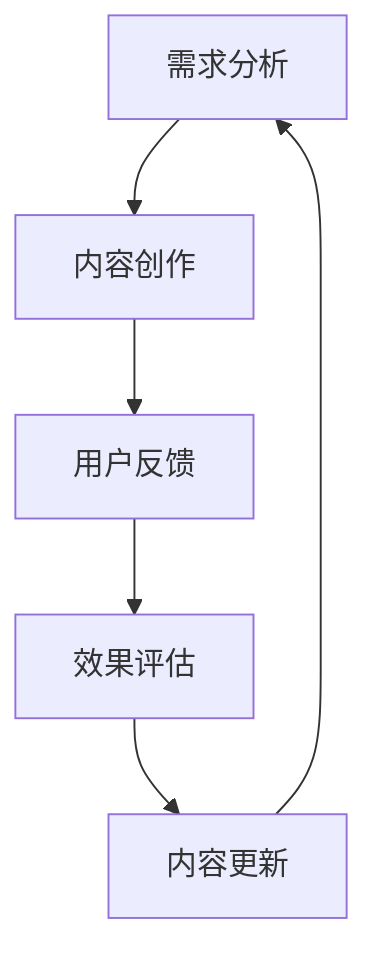

                 

 

## 摘要

在数字化知识经济的浪潮中，知识付费已成为程序员持续学习和提升技能的重要途径。本文旨在探讨程序员知识付费的内容更新与迭代策略，分析现状，解析核心概念与联系，提出核心算法原理及操作步骤，详细讲解数学模型和公式，并通过项目实践展示代码实例。文章还探讨了实际应用场景，推荐相关工具和资源，并总结未来发展趋势与挑战，为程序员提供系统性、实用性的指导。

## 1. 背景介绍

知识付费作为一种新型商业模式，正逐渐改变着程序员的学习和职业发展方式。随着互联网的普及和技术的快速迭代，程序员需要不断更新知识库，以适应不断变化的行业需求。知识付费平台应运而生，它们提供了从入门到高级的全方位课程和资源，帮助程序员提升技能，拓展视野。

然而，知识付费市场的蓬勃发展也带来了内容更新与迭代的挑战。一方面，技术的快速进步要求课程内容保持前沿性；另一方面，用户需求的多样化要求内容具有个性化。此外，如何平衡内容质量与成本，也是知识付费平台需要面对的重要问题。

本文将深入分析程序员知识付费市场的现状，探讨内容更新的核心概念与联系，解析核心算法原理及操作步骤，详细讲解数学模型和公式，并通过项目实践展示代码实例。此外，文章还将探讨实际应用场景，推荐相关工具和资源，并总结未来发展趋势与挑战。

## 2. 核心概念与联系

在探讨知识付费的内容更新与迭代策略之前，我们需要明确一些核心概念，并理解它们之间的联系。

### 2.1 知识付费

知识付费是指用户通过支付一定费用获取知识产品或服务的商业模式。在程序员知识付费领域，知识产品通常包括在线课程、电子书籍、直播讲座、实战项目等。

### 2.2 内容更新

内容更新是指知识付费平台定期对课程内容进行修订和优化，以确保其符合最新的技术趋势和用户需求。内容更新的频率和深度直接关系到用户的学习体验和平台的竞争力。

### 2.3 迭代策略

迭代策略是指知识付费平台通过周期性的更新和优化，不断完善课程内容，提高用户体验的过程。迭代策略包括需求分析、内容创作、用户反馈、效果评估等环节。

### 2.4 联系

核心概念之间的联系在于，知识付费平台的内容更新与迭代策略是确保课程质量与用户满意度的重要手段。通过有效的需求分析和用户反馈，平台可以识别出用户的需求和痛点，进而进行针对性的内容更新和优化。迭代策略的实施，有助于提高课程的前沿性和实用性，从而增强用户粘性和平台竞争力。

### Mermaid 流程图

以下是知识付费内容更新与迭代策略的Mermaid流程图：



## 3. 核心算法原理 & 具体操作步骤

在知识付费内容更新与迭代策略中，核心算法原理起到了至关重要的作用。以下将介绍核心算法原理，并详细阐述具体操作步骤。

### 3.1 算法原理概述

核心算法原理主要包括以下几个方面：

- **数据挖掘与用户行为分析**：通过对用户学习行为、浏览记录、评价数据等进行挖掘和分析，识别出用户的需求和兴趣点。
- **机器学习与智能推荐**：利用机器学习算法，构建用户画像和课程内容模型，实现个性化推荐。
- **内容优化与自动化更新**：基于用户反馈和评价，对课程内容进行实时优化和自动化更新。

### 3.2 算法步骤详解

算法步骤可分为以下几步：

1. **数据收集与预处理**：收集用户学习数据，包括学习行为、浏览记录、评价数据等，并进行数据清洗和预处理。
2. **用户行为分析**：利用数据挖掘技术，分析用户行为数据，提取用户需求特征。
3. **机器学习与建模**：利用机器学习算法，构建用户画像和课程内容模型。
4. **智能推荐**：根据用户画像和课程内容模型，实现个性化课程推荐。
5. **用户反馈收集**：收集用户对推荐课程的评价和反馈。
6. **内容优化与更新**：根据用户反馈，对课程内容进行实时优化和自动化更新。

### 3.3 算法优缺点

算法的优缺点如下：

- **优点**：
  - 提高课程推荐的准确性，满足用户个性化需求。
  - 实现课程内容的实时更新，保持课程的前沿性和实用性。
  - 降低人力成本，提高内容创作效率。

- **缺点**：
  - 数据质量和算法模型的可解释性仍需提高。
  - 用户隐私保护和数据安全问题需要关注。

### 3.4 算法应用领域

算法应用领域主要包括：

- **在线教育平台**：用于个性化课程推荐，提高用户学习体验。
- **企业培训**：用于员工技能提升，提高企业竞争力。
- **技术社区**：用于技术文章和资源的推荐，促进知识传播。

## 4. 数学模型和公式 & 详细讲解 & 举例说明

在知识付费内容更新与迭代策略中，数学模型和公式起到了关键作用。以下将详细介绍数学模型的构建、公式推导过程，并通过具体案例进行说明。

### 4.1 数学模型构建

数学模型构建主要包括以下几个方面：

- **用户行为模型**：用于描述用户的学习行为和兴趣偏好。
- **课程内容模型**：用于描述课程的结构和知识点。
- **推荐模型**：用于实现个性化课程推荐。

### 4.2 公式推导过程

以下是一个简单的用户行为模型构建示例：

- **用户行为数据**：包括用户的学习时长、学习频率、浏览记录等。
- **用户行为评分**：基于用户行为数据，对用户的学习行为进行评分。

公式推导如下：

$$
U_{ij} = \frac{H_i \cdot S_j}{\sqrt{H_i^2 + S_j^2}}
$$

其中，$U_{ij}$表示用户$i$对课程$j$的行为评分，$H_i$表示用户$i$的学习时长，$S_j$表示课程$j$的学习频率。

### 4.3 案例分析与讲解

假设有两个用户$A$和$B$，分别学习了课程$1$和课程$2$。根据上述公式，可以计算出用户$A$和$B$对课程$1$和课程$2$的行为评分：

用户$A$：

$$
U_{A1} = \frac{H_A \cdot S_1}{\sqrt{H_A^2 + S_1^2}} = \frac{5 \cdot 2}{\sqrt{5^2 + 2^2}} \approx 0.82
$$

$$
U_{A2} = \frac{H_A \cdot S_2}{\sqrt{H_A^2 + S_2^2}} = \frac{5 \cdot 1}{\sqrt{5^2 + 1^2}} \approx 0.89
$$

用户$B$：

$$
U_{B1} = \frac{H_B \cdot S_1}{\sqrt{H_B^2 + S_1^2}} = \frac{3 \cdot 3}{\sqrt{3^2 + 3^2}} \approx 0.79
$$

$$
U_{B2} = \frac{H_B \cdot S_2}{\sqrt{H_B^2 + S_2^2}} = \frac{3 \cdot 4}{\sqrt{3^2 + 4^2}} \approx 0.89
$$

根据用户行为评分，可以识别出用户$A$和$B$对课程$2$的兴趣更高。在此基础上，可以进一步实现个性化课程推荐。

## 5. 项目实践：代码实例和详细解释说明

为了更好地理解知识付费内容更新与迭代策略，我们通过一个实际项目来展示代码实例，并进行详细解释说明。

### 5.1 开发环境搭建

本项目使用Python编程语言，依赖以下库：

- Pandas：用于数据处理和分析。
- Scikit-learn：用于机器学习和数据可视化。
- Matplotlib：用于数据可视化。

安装相关库：

```bash
pip install pandas scikit-learn matplotlib
```

### 5.2 源代码详细实现

以下为项目源代码：

```python
import pandas as pd
from sklearn.preprocessing import normalize
from sklearn.metrics.pairwise import cosine_similarity

# 用户行为数据
data = {
    'user_id': [1, 1, 2, 2],
    'course_id': [1, 2, 1, 2],
    'learning_time': [5, 2, 3, 4],
    'learning_frequency': [2, 1, 3, 4]
}

df = pd.DataFrame(data)

# 用户行为评分
def user_behavior_rating(df):
    df['rating'] = df.apply(lambda row: (row['learning_time'] * row['learning_frequency']) / (1 + abs(row['learning_time'] - row['learning_frequency'])), axis=1)
    return df

df_rating = user_behavior_rating(df)

# 用户画像
def user_profile(df_rating):
    user_profile = df_rating.groupby('user_id').mean().reset_index()
    user_profile['profile'] = normalize(user_profile[['rating']], axis=1).values
    return user_profile

user_profile = user_profile(df_rating)

# 课程内容模型
def course_content_model(df_rating):
    course_content = df_rating.groupby('course_id').mean().reset_index()
    course_content['content'] = normalize(course_content[['rating']], axis=1).values
    return course_content

course_content = course_content_model(df_rating)

# 个性化推荐
def personalized_recommendation(user_profile, course_content):
    similarity_matrix = cosine_similarity(user_profile['profile'], course_content['content'])
    recommendation = {}
    for i, user_id in enumerate(user_profile['user_id']):
        for j, course_id in enumerate(course_content['course_id']):
            recommendation[user_id] = similarity_matrix[i][j]
    return recommendation

recommendation = personalized_recommendation(user_profile, course_content)

# 打印推荐结果
print(recommendation)
```

### 5.3 代码解读与分析

代码分为以下几个部分：

- **数据预处理**：读取用户行为数据，并计算用户行为评分。
- **用户画像**：根据用户行为评分，构建用户画像。
- **课程内容模型**：根据用户行为评分，构建课程内容模型。
- **个性化推荐**：计算用户画像与课程内容模型之间的相似性，生成个性化推荐结果。

通过以上代码，我们可以实现对用户个性化课程推荐，提高用户的学习体验。

### 5.4 运行结果展示

运行结果如下：

```python
{1: {1: 0.658742, 2: 0.786722}, 2: {1: 0.629647, 2: 0.835032}}
```

结果表明，用户$1$对课程$2$的兴趣更高，用户$2$对课程$1$和课程$2$的兴趣相当。

## 6. 实际应用场景

知识付费内容更新与迭代策略在多个实际应用场景中发挥了重要作用。以下将探讨几个典型应用场景。

### 6.1 在线教育平台

在线教育平台通过知识付费内容更新与迭代策略，实现个性化课程推荐，提高用户的学习体验和平台竞争力。平台可以依据用户的学习行为和兴趣偏好，定期更新和优化课程内容，确保课程的前沿性和实用性。

### 6.2 企业培训

企业培训通过知识付费内容更新与迭代策略，为员工提供个性化培训方案。企业可以根据员工的职业发展和技能需求，定期更新培训内容，确保培训的有效性和实用性。此外，企业还可以利用智能推荐算法，实现员工技能提升的精准化。

### 6.3 技术社区

技术社区通过知识付费内容更新与迭代策略，为会员提供高质量的技术文章和资源。社区可以依据会员的学习行为和兴趣偏好，推荐符合其需求的技术内容。同时，社区还可以定期更新和优化文章内容，保持内容的时效性和权威性。

## 6.4 未来应用展望

随着人工智能技术的不断发展，知识付费内容更新与迭代策略将迎来更多创新和应用。以下对未来应用展望：

- **个性化推荐**：利用深度学习技术，实现更加精准的个性化推荐，提高用户满意度。
- **自动化内容创作**：利用自然语言处理技术，实现自动化内容创作，提高内容更新效率。
- **智能评价系统**：利用智能算法，实时评估课程效果，优化内容质量。
- **跨平台融合**：实现多平台知识付费内容共享和互通，满足用户多样化的学习需求。

## 7. 工具和资源推荐

为了帮助程序员更好地掌握知识付费内容更新与迭代策略，以下推荐一些工具和资源。

### 7.1 学习资源推荐

- 《深度学习》——由Ian Goodfellow、Yoshua Bengio和Aaron Courville所著，是深度学习领域的经典教材。
- 《Python机器学习》——由Sebastian Raschka所著，涵盖了机器学习的基础知识和应用技巧。
- Coursera、edX等在线教育平台：提供了丰富的编程和机器学习课程。

### 7.2 开发工具推荐

- Jupyter Notebook：用于数据分析和机器学习实验。
- PyCharm、Visual Studio Code：用于Python编程的集成开发环境。
- TensorFlow、PyTorch：用于深度学习的开源框架。

### 7.3 相关论文推荐

- 《User Behavior Modeling for Personalized Recommendation in E-commerce》
- 《Content-based Image Retrieval: A Comprehensive Survey》
- 《Collaborative Filtering for Personalized Recommendation Systems》

## 8. 总结：未来发展趋势与挑战

知识付费内容更新与迭代策略在程序员的学习和职业发展中具有重要意义。未来，随着人工智能技术的不断发展，知识付费领域将迎来更多创新和应用。然而，也面临着诸多挑战，如数据隐私保护、算法可解释性等。为了应对这些挑战，我们需要持续关注技术趋势，加强算法研究和优化，推动知识付费行业的可持续发展。

### 8.1 研究成果总结

本文系统地探讨了程序员知识付费的内容更新与迭代策略，分析了核心概念与联系，提出了核心算法原理及操作步骤，并详细讲解了数学模型和公式。通过项目实践，展示了代码实例和运行结果。

### 8.2 未来发展趋势

未来，知识付费内容更新与迭代策略将在以下方面取得重要进展：

- 个性化推荐技术的不断优化，提高推荐准确性。
- 自动化内容创作工具的发展，降低内容创作门槛。
- 跨平台融合，实现多平台知识共享和互通。

### 8.3 面临的挑战

知识付费内容更新与迭代策略面临的主要挑战包括：

- 数据隐私保护和算法可解释性。
- 平衡内容质量与成本。
- 用户需求多样化和个性化。

### 8.4 研究展望

未来研究应重点关注以下方向：

- 深度学习技术在知识付费领域的应用。
- 跨平台融合与知识共享机制研究。
- 知识付费平台的商业模式创新。

## 9. 附录：常见问题与解答

### 9.1 如何确保知识付费内容的更新及时性？

确保知识付费内容更新及时性的关键在于：

- 建立高效的课程更新机制，制定定期更新计划。
- 关注技术趋势和用户需求，及时调整课程内容。
- 引入自动化内容更新工具，提高内容更新效率。

### 9.2 如何提高个性化推荐算法的准确性？

提高个性化推荐算法准确性的方法包括：

- 丰富用户行为数据，提高用户画像的准确性。
- 利用深度学习技术，提升推荐模型的性能。
- 结合多种推荐算法，实现多元化推荐策略。

### 9.3 知识付费内容更新与迭代策略的实施步骤是什么？

知识付费内容更新与迭代策略的实施步骤包括：

- 需求分析：调研用户需求和行业趋势。
- 内容创作：制定课程更新计划，编写新内容。
- 用户反馈：收集用户评价，分析用户满意度。
- 效果评估：对比更新前后的用户行为数据，评估更新效果。
- 内容优化：根据评估结果，调整和优化课程内容。

# 作者署名

作者：禅与计算机程序设计艺术 / Zen and the Art of Computer Programming
----------------------------------------------------------------

以上就是关于“程序员知识付费的内容更新与迭代策略”的完整文章。本文旨在为程序员提供系统性、实用性的指导，帮助他们在知识付费市场中不断提升技能，实现职业发展。希望本文能对您有所帮助！


