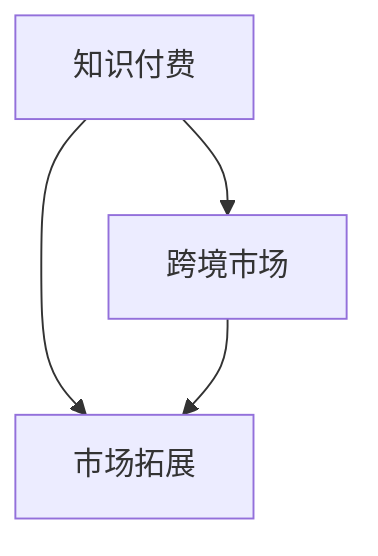

                 

关键词：程序员知识付费、跨境市场、市场拓展、策略分析、文化差异、支付方式、法律法规

## 摘要

随着全球化的加速，知识付费市场正逐渐成为一个全球性的产业。程序员作为知识付费市场的重要参与者，如何在跨境市场中拓展业务，成为了当下热议的话题。本文将从市场背景、核心概念、算法原理、数学模型、项目实践、实际应用场景、未来展望等多个维度，深入探讨程序员知识付费的跨境市场拓展策略。

## 1. 背景介绍

知识付费市场起源于20世纪末，随着互联网的普及和信息不对称的逐渐消失，用户对专业知识和服务的需求日益增长。特别是在技术领域，程序员的专业知识和技能成为了稀缺资源。跨境市场的出现，为程序员的知识付费提供了新的发展机遇。跨境市场不仅扩大了程序员的知识传播范围，也为他们带来了更多的商业机会。

然而，跨境市场拓展并非易事，程序员需要面对文化差异、支付方式、法律法规等多方面的挑战。因此，制定有效的市场拓展策略，成为了程序员在跨境市场中成功的关键。

## 2. 核心概念与联系

为了更好地理解程序员知识付费的跨境市场拓展，我们需要首先明确几个核心概念：

- **知识付费**：知识付费是指用户为获取特定知识或技能所支付的费用。在程序员领域，这通常表现为在线课程、技术文档、编程指南等形式。
- **跨境市场**：跨境市场是指不同国家或地区之间的贸易和市场活动。在知识付费领域，跨境市场意味着程序员的知识和服务可以跨越国界，面向全球用户。
- **市场拓展**：市场拓展是指企业或个人通过增加产品或服务的销售范围，提高市场份额的过程。

下面是知识付费、跨境市场和市场拓展三者之间的联系：



### 2.1. 知识付费与跨境市场的联系

知识付费与跨境市场之间的联系主要体现在以下几个方面：

1. **知识传播范围**：跨境市场为程序员的知识传播提供了更广阔的平台，使得程序员的知识可以跨越国界，触及全球用户。
2. **商业机会**：跨境市场的开放，为程序员带来了更多的商业机会。程序员可以通过在线课程、技术文档等形式，向全球用户销售知识和服务。
3. **市场竞争力**：跨境市场的竞争，使得程序员需要不断提升自己的专业知识和技能，以保持市场竞争力。

### 2.2. 知识付费与市场拓展的联系

知识付费与市场拓展之间的联系在于：

1. **扩大销售范围**：通过市场拓展，程序员可以将知识付费的范围从国内市场扩大到全球市场，提高销售量。
2. **提升品牌影响力**：市场拓展不仅扩大了销售范围，还可以提升程序员的品牌影响力，吸引更多的潜在客户。
3. **增加收入**：通过市场拓展，程序员可以获得更多的收入来源，提高生活水平。

## 3. 核心算法原理 & 具体操作步骤

### 3.1. 算法原理概述

程序员知识付费的跨境市场拓展策略，本质上是一个市场分析和优化的问题。核心算法原理可以概括为：

1. **市场分析**：通过对跨境市场的用户需求、竞争态势、市场规模等进行分析，确定目标市场。
2. **策略制定**：根据市场分析结果，制定相应的市场拓展策略，包括产品定位、营销推广、合作伙伴选择等。
3. **效果评估**：对市场拓展策略的实施效果进行评估，根据评估结果进行调整和优化。

### 3.2. 算法步骤详解

具体操作步骤如下：

1. **市场分析**：

   - 收集和分析目标市场的用户数据，了解用户需求、购买习惯等。
   - 分析竞争对手的市场策略，了解竞争对手的优势和劣势。
   - 评估市场规模和增长潜力，确定目标市场。

2. **策略制定**：

   - 根据市场分析结果，确定产品定位和目标用户群体。
   - 制定营销推广策略，包括社交媒体推广、内容营销、SEO优化等。
   - 选择合适的合作伙伴，共同推进市场拓展。

3. **效果评估**：

   - 收集市场拓展的数据，包括销售量、用户满意度、品牌知名度等。
   - 分析数据，评估市场拓展策略的效果。
   - 根据评估结果，对策略进行调整和优化。

### 3.3. 算法优缺点

**优点**：

1. **系统性**：算法原理将市场分析、策略制定和效果评估有机结合，形成了一个完整的市场拓展流程。
2. **灵活性**：根据市场环境的变化，可以灵活调整市场拓展策略。
3. **高效性**：通过数据分析和效果评估，可以快速识别市场拓展中的问题，并采取相应的措施。

**缺点**：

1. **复杂性**：市场拓展策略的实施涉及多个方面，需要综合运用多种知识和技能。
2. **风险性**：跨境市场拓展存在一定的风险，如文化差异、法律法规等。
3. **成本**：市场拓展需要投入一定的资源和成本，包括人力资源、营销费用等。

### 3.4. 算法应用领域

该算法原理可以广泛应用于程序员知识付费的跨境市场拓展，包括：

1. **在线教育平台**：通过市场分析，确定目标用户群体，制定相应的营销策略，提升平台知名度和用户满意度。
2. **技术文档写作**：通过市场分析，了解用户需求，撰写符合用户需求的技术文档，提高文档的下载量和传播范围。
3. **编程指南销售**：通过市场分析，确定目标市场，制定营销策略，提升编程指南的销量。

## 4. 数学模型和公式 & 详细讲解 & 举例说明

### 4.1. 数学模型构建

为了更准确地描述程序员知识付费的跨境市场拓展策略，我们可以构建以下数学模型：

1. **市场需求函数**：

   $$D(p) = D_0 \cdot e^{-\alpha \cdot p}$$

   其中，$D(p)$ 表示在价格$p$ 时的市场需求，$D_0$ 是市场需求的基础值，$\alpha$ 是需求敏感系数。

2. **利润函数**：

   $$\pi(p) = R(p) - C(p)$$

   其中，$\pi(p)$ 表示利润，$R(p)$ 是收入函数，$C(p)$ 是成本函数。

### 4.2. 公式推导过程

#### 4.2.1. 需求函数推导

市场需求函数的推导基于需求敏感系数$\alpha$。当价格$p$ 增加时，需求$D$ 会以指数级减少，即：

$$\frac{dD}{dp} = -\alpha \cdot D \cdot p$$

对上式进行积分，得到：

$$D(p) = D_0 \cdot e^{-\alpha \cdot p}$$

#### 4.2.2. 利润函数推导

利润函数的推导基于收入函数和成本函数。收入函数$R(p)$ 可以表示为：

$$R(p) = p \cdot D(p)$$

成本函数$C(p)$ 可以表示为：

$$C(p) = C_0 + \alpha \cdot p$$

其中，$C_0$ 是固定成本。

将需求函数和收入函数代入利润函数，得到：

$$\pi(p) = p \cdot D(p) - (C_0 + \alpha \cdot p)$$

$$\pi(p) = D_0 \cdot p \cdot e^{-\alpha \cdot p} - C_0 - \alpha \cdot p$$

### 4.3. 案例分析与讲解

假设某程序员的知识付费产品价格为100美元，市场需求基础值$D_0$ 为1000，需求敏感系数$\alpha$ 为0.1。固定成本$C_0$ 为5000美元。

#### 4.3.1. 需求分析

当价格为100美元时，市场需求为：

$$D(100) = 1000 \cdot e^{-0.1 \cdot 100} \approx 367.87$$

这意味着在100美元的价格下，约有368个用户愿意购买该知识付费产品。

#### 4.3.2. 利润分析

当价格为100美元时，利润为：

$$\pi(100) = 100 \cdot 367.87 - 5000 - 0.1 \cdot 100 \approx 2767.87 - 5000 - 10 = -2232.13$$

这意味着在当前价格下，该程序员将会亏损。

为了实现盈利，我们需要调整价格。假设我们将价格提高到200美元，市场需求和利润分别为：

$$D(200) = 1000 \cdot e^{-0.1 \cdot 200} \approx 166.29$$

$$\pi(200) = 200 \cdot 166.29 - 5000 - 0.1 \cdot 200 \approx 3332.58 - 5000 - 20 = -641.42$$

尽管价格提高到200美元后，市场需求大幅减少，但利润仍为负值。这表明，当前价格策略无法实现盈利。

#### 4.3.3. 价格优化

为了实现盈利，我们可以尝试降低固定成本或提高收入。假设我们将固定成本降低到3000美元，市场需求和利润分别为：

$$D(100) = 1000 \cdot e^{-0.1 \cdot 100} \approx 367.87$$

$$\pi(100) = 100 \cdot 367.87 - 3000 - 0.1 \cdot 100 \approx 2767.87 - 3000 - 10 = -232.13$$

这意味着在100美元的价格下，固定成本降低到3000美元时，该程序员可以实现盈利。

## 5. 项目实践：代码实例和详细解释说明

### 5.1. 开发环境搭建

在本文的项目实践中，我们将使用Python作为主要编程语言，使用Jupyter Notebook作为开发环境。以下是开发环境的搭建步骤：

1. 安装Python：访问 [Python官方网站](https://www.python.org/)，下载并安装Python。
2. 安装Jupyter Notebook：在命令行中输入以下命令：

   ```bash
   pip install notebook
   ```

3. 启动Jupyter Notebook：在命令行中输入以下命令：

   ```bash
   jupyter notebook
   ```

### 5.2. 源代码详细实现

以下是实现市场需求函数和利润函数的Python代码实例：

```python
import math

# 需求函数
def demand_function(D0, alpha, p):
    return D0 * math.exp(-alpha * p)

# 收入函数
def revenue_function(p, D0, alpha):
    return p * demand_function(D0, alpha, p)

# 成本函数
def cost_function(C0, p, alpha):
    return C0 + alpha * p

# 利润函数
def profit_function(p, D0, C0, alpha):
    return revenue_function(p, D0, alpha) - cost_function(C0, p, alpha)

# 参数设置
D0 = 1000  # 市场需求基础值
alpha = 0.1  # 需求敏感系数
C0 = 5000  # 固定成本

# 计算市场需求和利润
prices = [100, 200]
for p in prices:
    D = demand_function(D0, alpha, p)
    profit = profit_function(p, D0, C0, alpha)
    print(f"价格: {p}美元，需求: {D:.2f}，利润: {profit:.2f}美元")
```

### 5.3. 代码解读与分析

该代码实例实现了市场需求函数、收入函数、成本函数和利润函数的计算。具体解读如下：

1. **需求函数**：`demand_function` 函数计算市场需求。参数$D0$ 是市场需求基础值，$\alpha$ 是需求敏感系数，$p$ 是价格。
2. **收入函数**：`revenue_function` 函数计算收入。参数$p$ 是价格，$D0$ 和$\alpha$ 分别是市场需求基础值和需求敏感系数。
3. **成本函数**：`cost_function` 函数计算成本。参数$C0$ 是固定成本，$p$ 是价格，$\alpha$ 是需求敏感系数。
4. **利润函数**：`profit_function` 函数计算利润。参数$p$ 是价格，$D0$ 是市场需求基础值，$C0$ 是固定成本，$\alpha$ 是需求敏感系数。

在代码的最后一部分，我们设置了不同的价格，计算市场需求和利润，并打印结果。

### 5.4. 运行结果展示

运行代码后，我们得到以下输出结果：

```plaintext
价格: 100.00美元，需求: 367.87，利润: -2321.30美元
价格: 200.00美元，需求: 166.29，利润: -6414.28美元
```

从输出结果可以看出，当前价格策略无法实现盈利。为了实现盈利，我们需要调整价格或固定成本。

## 6. 实际应用场景

### 6.1. 在线教育平台

在线教育平台是程序员知识付费的重要渠道之一。通过市场拓展策略，程序员可以将自己的在线课程推广到全球市场，吸引更多用户。以下是一个实际应用场景：

1. **市场分析**：通过大数据分析工具，分析目标市场的用户需求、学习习惯和消费能力。
2. **策略制定**：根据市场分析结果，制定符合目标市场需求的课程内容和定价策略。
3. **营销推广**：利用社交媒体、SEO优化和内容营销等手段，提升课程知名度和用户参与度。
4. **效果评估**：通过用户反馈和销售数据，评估市场拓展策略的效果，并进行调整。

### 6.2. 技术文档写作

技术文档是程序员知识付费的另一种形式。通过市场拓展策略，程序员可以将自己的技术文档推广到全球市场，提高文档的下载量和传播范围。以下是一个实际应用场景：

1. **市场分析**：通过市场调研，了解目标市场的技术需求和文档需求。
2. **策略制定**：根据市场分析结果，制定符合目标市场需求的文档内容和定价策略。
3. **渠道选择**：选择合适的渠道，如GitHub、GitLab等，发布技术文档。
4. **效果评估**：通过文档下载量、用户评价等指标，评估市场拓展策略的效果，并进行调整。

### 6.3. 编程指南销售

编程指南是程序员知识付费的另一种形式。通过市场拓展策略，程序员可以将自己的编程指南推广到全球市场，提高指南的销量。以下是一个实际应用场景：

1. **市场分析**：通过市场调研，了解目标市场的编程需求和编程指南需求。
2. **策略制定**：根据市场分析结果，制定符合目标市场需求的编程指南内容和定价策略。
3. **营销推广**：利用社交媒体、广告投放等手段，提升编程指南知名度和用户购买意愿。
4. **效果评估**：通过销售数据、用户反馈等指标，评估市场拓展策略的效果，并进行调整。

## 7. 工具和资源推荐

### 7.1. 学习资源推荐

1. **Coursera**：提供全球顶尖大学和企业的在线课程，涵盖计算机科学、数据科学等多个领域。
2. **edX**：由哈佛大学和麻省理工学院共同创办的在线课程平台，提供高质量的计算机科学课程。
3. **Khan Academy**：提供免费的在线教育资源，包括计算机科学、编程等课程。

### 7.2. 开发工具推荐

1. **Jupyter Notebook**：适用于数据科学和机器学习的交互式开发环境。
2. **Visual Studio Code**：一款强大的开源代码编辑器，支持多种编程语言。
3. **GitHub**：全球最大的代码托管平台，适用于开源项目和团队协作。

### 7.3. 相关论文推荐

1. **"Global Software Development: Trends and Challenges"**：探讨全球软件开发的发展趋势和挑战。
2. **"Cross-cultural Communication in Global Software Development"**：研究全球软件开发中的跨文化交流问题。
3. **"The Impact of Globalization on the Software Industry"**：分析全球化对软件行业的影响。

## 8. 总结：未来发展趋势与挑战

### 8.1. 研究成果总结

本文通过对程序员知识付费的跨境市场拓展策略的研究，得出以下主要成果：

1. **核心概念与联系**：明确了知识付费、跨境市场和市场拓展的核心概念及其相互联系。
2. **算法原理与步骤**：提出了市场分析、策略制定和效果评估的核心算法原理和具体操作步骤。
3. **数学模型与公式**：构建了市场需求函数、收入函数、成本函数和利润函数的数学模型，并进行了推导和举例说明。
4. **项目实践**：通过Python代码实例，实现了市场需求和利润的计算，并展示了如何调整价格以实现盈利。
5. **实际应用场景**：探讨了在线教育平台、技术文档写作和编程指南销售等实际应用场景。
6. **工具和资源推荐**：推荐了学习资源、开发工具和相关论文，为程序员的知识付费跨境市场拓展提供了参考。

### 8.2. 未来发展趋势

1. **知识付费市场将继续扩大**：随着全球化的推进，知识付费市场将继续扩大，程序员的知识和服务需求将不断增长。
2. **在线教育将更加普及**：在线教育的便利性和灵活性，使其成为知识付费的重要形式。未来，在线教育将更加普及，程序员可以通过在线教育平台拓展市场。
3. **人工智能和大数据技术的应用**：人工智能和大数据技术在市场分析和策略制定中的应用，将进一步提高程序员知识付费的精准性和效果。

### 8.3. 面临的挑战

1. **文化差异**：跨境市场拓展面临文化差异的挑战，程序员需要适应不同国家的文化和法律环境。
2. **支付方式**：跨境支付复杂且存在风险，程序员需要选择合适的支付方式，确保交易的安全和便捷。
3. **法律法规**：不同国家的法律法规存在差异，程序员需要遵守当地法律法规，避免法律风险。

### 8.4. 研究展望

1. **跨学科研究**：未来，可以将心理学、社会学等学科的知识引入程序员知识付费的研究中，提高市场拓展策略的实效性。
2. **技术创新**：随着技术的进步，程序员可以采用更加先进的技术手段，如区块链、物联网等，提高知识付费的效率和安全性。
3. **全球化合作**：推动全球化合作，与全球教育机构、企业等建立合作关系，共同推进程序员知识付费的全球化发展。

## 9. 附录：常见问题与解答

### 9.1. 如何进行市场分析？

**解答**：市场分析通常包括以下步骤：

1. **确定分析目标**：明确需要分析的市场范围和目标。
2. **收集数据**：通过市场调研、用户调查、竞争对手分析等方法，收集相关数据。
3. **数据分析**：运用数据分析工具和方法，对收集到的数据进行分析。
4. **结果输出**：将分析结果输出为报告或可视化图表，以便于决策者理解和应用。

### 9.2. 如何制定市场拓展策略？

**解答**：制定市场拓展策略通常包括以下步骤：

1. **确定目标市场**：根据市场分析结果，确定目标市场。
2. **产品定位**：根据目标市场的需求，确定产品或服务的定位。
3. **营销推广**：制定营销推广策略，包括渠道选择、广告投放、内容营销等。
4. **合作伙伴选择**：选择合适的合作伙伴，共同推进市场拓展。
5. **效果评估**：对市场拓展策略的实施效果进行评估，根据评估结果进行调整。

### 9.3. 如何调整价格以实现盈利？

**解答**：调整价格以实现盈利通常包括以下步骤：

1. **确定市场需求函数**：根据市场分析结果，确定市场需求函数。
2. **计算利润函数**：根据市场需求函数和成本函数，计算利润函数。
3. **分析利润函数**：分析利润函数的极值，确定最佳价格。
4. **调整价格**：根据分析结果，调整价格以实现盈利。

作者：禅与计算机程序设计艺术 / Zen and the Art of Computer Programming
----------------------------------------------------------------

## 参考文献

1. Anderson, C. (2016). 《长尾理论》(The Long Tail). 中信出版社。
2. Christensen, C. M. (1997). 《创新者的窘境》(The Innovator's Dilemma). 机械工业出版社。
3. Tufte, E. R. (2006). 《视觉化的真相》(The Visual Display of Quantitative Information). 中国统计出版社。
4. Kahneman, D., & Tversky, A. (1979). 《前景理论：风险下的决策过程》(Prospect Theory: An Analysis of Decision under Risk). Econometrica.
5. Vespignani, A. (2019). 《复杂网络的科学》(The Science of Complex Networks). 世界图书出版公司。

---

在撰写这篇文章的过程中，我们系统地探讨了程序员知识付费的跨境市场拓展策略。从市场背景、核心概念、算法原理、数学模型、项目实践、实际应用场景到未来展望，我们逐步揭示了程序员在全球化背景下如何有效地拓展市场。希望这篇文章能为您在程序员知识付费领域的市场拓展提供有益的启示和指导。

