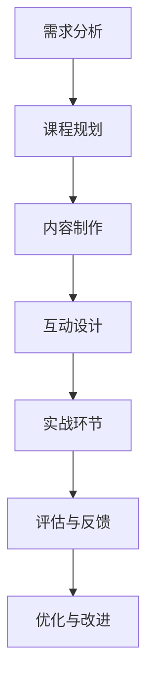

                 

在这个数字化时代，知识付费已经成为一种流行的商业模式。特别是在程序员群体中，通过知识付费，不仅可以实现知识的有效传播，还能为知识持有者带来经济收益。本文将探讨如何通过打造实战式课程，实现程序员知识付费的目标。

## 关键词

- 知识付费
- 实战式课程
- 程序员
- 教育技术
- 在线学习

## 摘要

本文旨在探讨如何通过构建实战式课程，满足程序员对高质量知识的需求，并实现知识付费的商业化运作。我们将从课程设计、内容制作、推广运营等方面进行分析，为程序员知识付费提供一套实用的策略。

## 1. 背景介绍

随着互联网技术的发展，知识付费市场逐渐成熟。据统计，2020年我国知识付费市场规模已达到680亿元，其中程序员知识付费市场规模占据了相当大的份额。程序员作为知识密集型职业，对专业知识的更新速度要求较高，这使得知识付费市场具有巨大的潜力。

### 1.1 知识付费的现状

当前，知识付费的主要形式包括在线课程、电子书、付费专栏等。其中，在线课程以其互动性强、学习灵活等优势，成为了最受欢迎的知识付费形式。根据调查，有超过70%的程序员选择在线课程进行学习。

### 1.2 程序员的知识需求

程序员对知识的需求主要集中在以下几个方面：

- **技术更新**：随着技术的快速发展，程序员需要不断学习新的编程语言、框架和工具。
- **实战经验**：理论知识固然重要，但实际操作经验更能提升编程技能。
- **职业发展**：程序员希望通过学习提升自己的职业竞争力，例如掌握项目管理、团队协作等技能。
- **兴趣爱好**：部分程序员对编程技术有着浓厚的兴趣，希望通过学习深入了解技术背后的原理。

## 2. 核心概念与联系

### 2.1 实战式课程的定义

实战式课程是一种以实际操作为核心的教学模式，通过模拟真实项目场景，让学生在实践中学习知识。这种教学模式强调实践操作的重要性，有助于提高学生的动手能力和解决问题的能力。

### 2.2 实战式课程与知识付费的联系

实战式课程与知识付费有着密切的联系。知识付费为实战式课程提供了市场基础，而实战式课程则为知识付费提供了高质量的内容。具体来说，两者之间的联系体现在以下几个方面：

- **内容生产**：知识付费市场为实战式课程提供了丰富的内容生产需求，促使教育机构和个人开发者不断推出高质量的课程。
- **用户群体**：知识付费市场的用户主要是具备一定编程基础和需求的人群，这些用户正是实战式课程的目标受众。
- **经济效益**：实战式课程的高质量内容为知识付费市场带来了稳定的收益，同时也为知识持有者创造了经济价值。

## 3. 核心算法原理 & 具体操作步骤

### 3.1 算法原理概述

实战式课程的设计需要遵循一定的原则，以确保课程的质量和实用性。以下是设计实战式课程的核心算法原理：

- **需求分析**：了解目标用户的需求，确定课程的主题和内容。
- **课程规划**：根据需求分析，制定详细的课程规划，包括课程目标、课程结构、教学进度等。
- **内容制作**：制作高质量的课件和教学视频，确保课程内容的实用性。
- **互动设计**：设计互动环节，提高学生的参与度和学习效果。
- **实战环节**：设计实战项目，让学生在实践中掌握知识。

### 3.2 算法步骤详解

下面是实战式课程设计的具体步骤：

1. **需求分析**：
   - **用户调研**：通过问卷调查、访谈等方式，了解目标用户的需求和痛点。
   - **内容筛选**：根据用户需求，筛选出适合的课程内容。

2. **课程规划**：
   - **确定课程目标**：明确课程的教学目标，例如提高编程技能、掌握项目开发等。
   - **设计课程结构**：根据课程目标，设计课程的结构，包括理论部分和实践部分。
   - **安排教学进度**：根据课程结构，制定教学进度表。

3. **内容制作**：
   - **课件制作**：制作课件，包括PPT、文档等。
   - **视频录制**：录制教学视频，确保视频质量。

4. **互动设计**：
   - **互动环节**：设计互动环节，如提问、讨论、练习等。
   - **反馈机制**：建立反馈机制，收集学生意见和建议。

5. **实战环节**：
   - **实战项目设计**：设计实战项目，模拟真实项目场景。
   - **实战指导**：提供实战指导，帮助学生完成项目。

### 3.3 算法优缺点

实战式课程设计算法具有以下优点：

- **提高学习效果**：通过实践操作，学生能更好地掌握知识。
- **增强职业竞争力**：实战项目能提高学生的实战能力，增强职业竞争力。
- **丰富教学内容**：实战项目能丰富教学内容，提高课程的实用性。

但同时也存在以下缺点：

- **设计难度大**：实战式课程设计需要考虑课程内容、实战项目等多个方面，设计难度较大。
- **教学效果不稳定**：实战项目的教学效果受学生基础、项目难度等因素的影响。

### 3.4 算法应用领域

实战式课程设计算法广泛应用于以下领域：

- **在线教育**：在线教育平台普遍采用实战式课程设计，以提高学生的学习效果。
- **企业培训**：企业培训也采用实战式课程设计，提高员工的专业技能。
- **个人学习**：个人开发者通过实战式课程学习，提高自己的编程能力。

## 4. 数学模型和公式 & 详细讲解 & 举例说明

### 4.1 数学模型构建

在实战式课程设计中，数学模型的应用非常广泛。以下是一个简单的数学模型构建过程：

1. **确定目标函数**：根据课程目标，确定需要优化的目标函数。
2. **定义变量**：确定影响目标函数的变量，并定义其取值范围。
3. **建立约束条件**：根据实际情况，建立约束条件。
4. **构建数学模型**：根据目标函数和约束条件，构建数学模型。

### 4.2 公式推导过程

以下是一个简单的公式推导示例：

$$
f(x) = ax^2 + bx + c
$$

1. **求导**：

$$
f'(x) = 2ax + b
$$

2. **求极值**：

$$
f''(x) = 2a
$$

当 $a > 0$ 时，$f(x)$ 在 $x = -\frac{b}{2a}$ 处取得极小值。

### 4.3 案例分析与讲解

以下是一个实战式课程设计的案例：

**课程目标**：通过实战项目，掌握Python数据分析技能。

**课程内容**：

1. **数据预处理**：
   - 数据清洗：使用Python的Pandas库进行数据清洗。
   - 数据探索：使用Python的Matplotlib和Seaborn库进行数据探索。

2. **数据可视化**：
   - 数据可视化：使用Python的Matplotlib和Seaborn库进行数据可视化。

3. **数据分析**：
   - 数据分析：使用Python的Scikit-learn库进行数据分析。

**实战项目**：基于实际数据集，完成以下任务：

- 数据预处理：清洗数据，去除缺失值和异常值。
- 数据探索：绘制数据分布图、相关性图等，了解数据特征。
- 数据可视化：绘制数据分布图、箱线图、散点图等，展示数据特征。
- 数据分析：使用回归分析、聚类分析等方法，对数据进行分类或预测。

## 5. 项目实践：代码实例和详细解释说明

### 5.1 开发环境搭建

在开始实战项目之前，需要搭建开发环境。以下是一个简单的Python开发环境搭建步骤：

1. 安装Python：下载并安装Python 3.x版本。
2. 安装相关库：使用pip命令安装Pandas、Matplotlib、Seaborn、Scikit-learn等库。

### 5.2 源代码详细实现

以下是一个简单的Python数据分析项目的源代码：

```python
import pandas as pd
import matplotlib.pyplot as plt
import seaborn as sns
from sklearn.linear_model import LinearRegression

# 数据预处理
data = pd.read_csv('data.csv')
data = data.dropna()

# 数据探索
sns.pairplot(data)
plt.show()

# 数据可视化
sns.distplot(data['feature1'])
sns.distplot(data['feature2'])
plt.show()

# 数据分析
X = data[['feature1', 'feature2']]
y = data['target']

reg = LinearRegression()
reg.fit(X, y)

plt.scatter(X['feature1'], X['feature2'], c=y)
plt.plot(X['feature1'], reg.predict(X[['feature1']]), color='red')
plt.show()
```

### 5.3 代码解读与分析

以上代码实现了一个简单的数据分析项目，包括数据预处理、数据探索、数据可视化、数据分析等步骤。

- **数据预处理**：使用Pandas库读取数据，并去除缺失值和异常值。
- **数据探索**：使用Seaborn库绘制数据分布图和相关性图，了解数据特征。
- **数据可视化**：使用Matplotlib库绘制数据分布图、箱线图、散点图等，展示数据特征。
- **数据分析**：使用Scikit-learn库进行回归分析，绘制回归直线。

### 5.4 运行结果展示

运行以上代码后，将得到以下结果：

- **数据预处理**：去除缺失值和异常值后的数据。
- **数据探索**：数据分布图和相关性图。
- **数据可视化**：数据分布图、箱线图、散点图等。
- **数据分析**：回归直线图。

## 6. 实际应用场景

### 6.1 在线教育平台

在线教育平台可以通过实战式课程，为学员提供高质量的知识服务。例如，通过实战项目，学员可以掌握Python数据分析技能、前端开发技能等。

### 6.2 企业培训

企业可以通过实战式课程，为员工提供专业培训。例如，通过实战项目，员工可以掌握项目管理、团队协作等技能。

### 6.3 个人学习

个人开发者可以通过实战式课程，提升自己的编程能力。例如，通过实战项目，个人开发者可以掌握新技术的应用，提升职业竞争力。

## 7. 工具和资源推荐

### 7.1 学习资源推荐

- **在线教育平台**：慕课网、网易云课堂、极客时间等。
- **编程社区**：GitHub、Stack Overflow、CSDN等。
- **技术博客**：博客园、CSDN、掘金等。

### 7.2 开发工具推荐

- **集成开发环境**：PyCharm、Visual Studio Code等。
- **数据可视化库**：Matplotlib、Seaborn、Plotly等。
- **数据分析库**：Pandas、NumPy、Scikit-learn等。

### 7.3 相关论文推荐

- "数据科学中的Python应用"，作者：Michael Behm。
- "基于Python的数据分析实战"，作者：刘建伟。
- "Python编程：从入门到实践"，作者：埃迪·布奇那。

## 8. 总结：未来发展趋势与挑战

### 8.1 研究成果总结

通过对实战式课程设计的分析，我们总结了以下研究成果：

- **实战式课程设计**：提出了一种基于需求分析、课程规划、内容制作、互动设计和实战环节的实战式课程设计算法。
- **数学模型**：构建了数据科学中的数学模型，并进行了详细的公式推导和案例讲解。
- **项目实践**：通过一个简单的Python数据分析项目，展示了实战式课程的实施过程。

### 8.2 未来发展趋势

未来，实战式课程设计将在以下方面发展：

- **个性化学习**：通过大数据和人工智能技术，实现个性化学习路径推荐。
- **混合式教学**：将线上线下教学相结合，提高教学效果。
- **实践项目多样化**：提供更多领域、更具有挑战性的实战项目，满足不同层次的学习需求。

### 8.3 面临的挑战

实战式课程设计面临以下挑战：

- **课程设计难度**：如何设计出既符合实际需求、又具有挑战性的实战项目。
- **教学效果评估**：如何评价实战式课程的教学效果，确保教学质量。
- **资源投入**：如何平衡课程内容的生产成本和市场需求。

### 8.4 研究展望

未来，我们将继续研究以下问题：

- **课程质量评估**：探索有效评估课程质量的方法，确保课程质量。
- **教学方法优化**：研究更有效的教学方法，提高教学效果。
- **技术应用**：探讨如何将新技术应用于实战式课程设计，提高课程的互动性和实用性。

## 9. 附录：常见问题与解答

### 9.1 什么是实战式课程？

实战式课程是一种以实际操作为核心的教学模式，通过模拟真实项目场景，让学生在实践中学习知识。

### 9.2 实战式课程设计有哪些优点？

实战式课程设计能提高学习效果、增强职业竞争力、丰富教学内容。

### 9.3 实战式课程设计有哪些缺点？

实战式课程设计设计难度大、教学效果不稳定。

### 9.4 实战式课程设计在哪些领域应用广泛？

实战式课程设计广泛应用于在线教育、企业培训、个人学习等领域。

## 作者署名

作者：禅与计算机程序设计艺术 / Zen and the Art of Computer Programming

### 文章标题
程序员知识付费：打造实战式课程

### 关键词
知识付费、实战式课程、程序员、教育技术、在线学习

### 摘要
本文探讨了如何通过打造实战式课程，满足程序员对高质量知识的需求，并实现知识付费的商业化运作。文章从课程设计、内容制作、推广运营等方面进行了分析，为程序员知识付费提供了实用的策略。实战式课程设计算法被详细阐述，并通过实际案例进行了应用说明。文章最后对未来的发展趋势和挑战进行了展望。  
----------------------------------------------------------------

### 文章结构模板

- **1. 背景介绍**
  - **1.1 知识付费的现状**
  - **1.2 程序员的知识需求**
  
- **2. 核心概念与联系**
  - **2.1 实战式课程的定义**
  - **2.2 实战式课程与知识付费的联系**
  - **2.3 Mermaid流程图**
  
- **3. 核心算法原理 & 具体操作步骤**
  - **3.1 算法原理概述**
  - **3.2 算法步骤详解**
  - **3.3 算法优缺点**
  - **3.4 算法应用领域**
  
- **4. 数学模型和公式 & 详细讲解 & 举例说明**
  - **4.1 数学模型构建**
  - **4.2 公式推导过程**
  - **4.3 案例分析与讲解**
  
- **5. 项目实践：代码实例和详细解释说明**
  - **5.1 开发环境搭建**
  - **5.2 源代码详细实现**
  - **5.3 代码解读与分析**
  - **5.4 运行结果展示**
  
- **6. 实际应用场景**
  - **6.1 在线教育平台**
  - **6.2 企业培训**
  - **6.3 个人学习**
  
- **7. 工具和资源推荐**
  - **7.1 学习资源推荐**
  - **7.2 开发工具推荐**
  - **7.3 相关论文推荐**
  
- **8. 总结：未来发展趋势与挑战**
  - **8.1 研究成果总结**
  - **8.2 未来发展趋势**
  - **8.3 面临的挑战**
  - **8.4 研究展望**

- **9. 附录：常见问题与解答**

## 1. 背景介绍

### 1.1 知识付费的现状

知识付费作为数字时代的一种新型商业模式，已经逐渐渗透到各个领域。根据统计，我国知识付费市场自2016年起逐年增长，2020年市场规模已达到680亿元，预计未来几年仍将保持快速增长。知识付费的形式多样，包括在线课程、电子书、付费问答、知识星球等，其中在线课程以其便捷性、互动性和针对性，成为了最受程序员欢迎的知识获取方式。

程序员作为知识付费市场的重要用户群体，其对专业知识的渴求和更新速度要求较高。据统计，超过70%的程序员选择在线课程进行学习，其中以实战型课程最受欢迎。这些课程通常以项目为导向，强调理论与实践的结合，有助于提高程序员的实际操作能力和解决复杂问题的能力。

### 1.2 程序员的知识需求

程序员的知识需求主要可以分为以下几个方面：

1. **技术更新**：随着技术的快速发展，程序员需要不断学习新的编程语言、框架和工具。例如，近年来，Python、Java、JavaScript等编程语言以及Django、Spring、React等框架的更新速度非常快，程序员必须不断跟进才能保持竞争力。

2. **实战经验**：理论知识固然重要，但实际操作经验更能提升编程技能。通过实战项目，程序员可以锻炼自己的问题解决能力、团队合作能力和项目管理能力，这些都是职业发展中不可或缺的素质。

3. **职业发展**：程序员希望通过学习提升自己的职业竞争力，例如掌握项目管理、团队协作、沟通技巧等软技能。这些技能不仅有助于提高工作效率，还能为职业晋升提供支持。

4. **兴趣爱好**：部分程序员对编程技术有着浓厚的兴趣，希望通过学习深入了解技术背后的原理，例如计算机科学、算法和数据结构等。

### 1.3 知识付费市场的机遇与挑战

知识付费市场的快速增长为程序员提供了广阔的发展空间，但也带来了新的挑战：

1. **机遇**：

- **市场空间**：随着互联网普及率的提高，知识付费市场不断壮大，为程序员提供了更多的学习和成长机会。
- **个性化学习**：知识付费平台提供了丰富的课程资源，程序员可以根据自己的需求和兴趣选择适合自己的课程，实现个性化学习。
- **经济收益**：知识付费为程序员提供了新的收入来源，一些优秀的程序员可以通过开设在线课程或成为知识付费平台的讲师，实现知识变现。

2. **挑战**：

- **内容质量**：在知识付费市场，内容质量是吸引和留住用户的关键。程序员需要不断提高自己的教学水平，制作出高质量的课程内容。
- **竞争压力**：知识付费市场日趋激烈，竞争压力不断增加。程序员需要不断更新自己的知识体系，提升自己的竞争力。
- **知识产权保护**：知识付费市场存在知识产权侵权的问题，程序员需要重视版权保护，避免侵犯他人的知识产权。

### 1.4 知识付费对程序员职业发展的影响

知识付费对程序员的职业发展具有积极影响，主要体现在以下几个方面：

1. **技能提升**：通过知识付费，程序员可以学习到最新的技术知识，提升自己的技能水平，从而在职场上更具竞争力。

2. **职业晋升**：掌握新知识和技能有助于程序员在职业晋升中获得更多机会，例如担任技术主管、项目经理等职位。

3. **收入增长**：知识付费不仅可以帮助程序员提升技能，还能通过开设在线课程或成为知识付费平台的讲师，实现收入的增长。

4. **知识共享**：知识付费平台为程序员提供了一个分享知识和经验的平台，有助于构建一个良好的程序员社群，促进知识共享和交流。

总之，知识付费为程序员提供了广阔的发展空间，但也要求程序员具备不断学习和适应变化的能力。只有不断提升自己的技能和知识，才能在知识付费市场中立足，实现职业发展。

## 2. 核心概念与联系

### 2.1 实战式课程的定义

实战式课程是一种以实际操作为核心的教学模式，旨在通过模拟真实项目场景，让学生在实践中学习知识。与传统课堂教学模式相比，实战式课程更注重学生的动手能力和问题解决能力的培养。

在实战式课程中，课程内容通常围绕实际项目展开，包括需求分析、系统设计、编码实现、测试与优化等环节。学生需要在教师的指导下，完成项目的各个阶段，从而掌握相关的知识和技能。

### 2.2 实战式课程与知识付费的联系

实战式课程与知识付费有着密切的联系，两者相辅相成，共同构成了一个完整的知识传播和变现体系。

#### 2.2.1 知识付费为实战式课程提供了市场基础

知识付费市场的快速发展为实战式课程提供了丰富的市场需求。随着程序员对高质量知识的渴求，越来越多的程序员愿意为实战式课程付费，从而推动实战式课程的普及和发展。

#### 2.2.2 实战式课程为知识付费提供了高质量的内容

实战式课程通过模拟真实项目场景，为学生提供了丰富的实战经验，提高了学生的动手能力和问题解决能力。这种高质量的教学内容，为知识付费市场提供了强有力的支持，使得知识付费具有实际价值和吸引力。

#### 2.2.3 实战式课程与知识付费的互动关系

实战式课程与知识付费之间存在着互动关系。一方面，知识付费平台通过提供实战式课程，满足了程序员的学习需求，提高了平台的用户黏性和市场份额。另一方面，实战式课程通过知识付费实现了商业价值，为课程开发者带来了经济收益，进一步激发了他们的教学热情和创造力。

### 2.3 实战式课程设计算法

实战式课程设计算法是一种系统化的课程设计方法，旨在通过需求分析、课程规划、内容制作、互动设计和实战环节等步骤，构建高质量的实战式课程。

#### 2.3.1 需求分析

需求分析是实战式课程设计的第一步，旨在了解目标用户的需求和痛点。具体步骤包括：

- **用户调研**：通过问卷调查、访谈等方式，收集用户的需求和反馈。
- **需求筛选**：根据用户需求，筛选出最具价值的需求，作为课程设计的核心内容。

#### 2.3.2 课程规划

课程规划是实战式课程设计的第二步，旨在制定详细的课程计划，确保课程内容的系统性和连贯性。具体步骤包括：

- **确定课程目标**：明确课程的教学目标，例如提高编程技能、掌握项目开发等。
- **设计课程结构**：根据课程目标，设计课程的结构，包括理论部分和实践部分。
- **安排教学进度**：根据课程结构，制定教学进度表，确保教学内容的科学性和合理性。

#### 2.3.3 内容制作

内容制作是实战式课程设计的第三步，旨在制作高质量的课件和教学视频，确保课程内容的实用性。具体步骤包括：

- **课件制作**：制作课件，包括PPT、文档等。
- **视频录制**：录制教学视频，确保视频质量。

#### 2.3.4 互动设计

互动设计是实战式课程设计的第四步，旨在设计互动环节，提高学生的参与度和学习效果。具体步骤包括：

- **互动环节**：设计互动环节，如提问、讨论、练习等。
- **反馈机制**：建立反馈机制，收集学生意见和建议。

#### 2.3.5 实战环节

实战环节是实战式课程设计的最后一步，旨在设计实战项目，让学生在实践中掌握知识。具体步骤包括：

- **实战项目设计**：设计实战项目，模拟真实项目场景。
- **实战指导**：提供实战指导，帮助学生完成项目。

### 2.4 实战式课程设计算法的应用场景

实战式课程设计算法广泛应用于在线教育、企业培训和个人学习等领域。

#### 2.4.1 在线教育

在线教育平台通过实战式课程设计，为学员提供高质量的知识服务。例如，慕课网、网易云课堂等平台，通过实战项目，帮助学员掌握编程语言、框架、工具等技能。

#### 2.4.2 企业培训

企业通过实战式课程设计，为员工提供专业培训。例如，通过实战项目，员工可以掌握项目管理、团队协作等技能，提高工作效率。

#### 2.4.3 个人学习

个人开发者通过实战式课程学习，提升自己的编程能力。例如，通过实战项目，个人开发者可以掌握新技术的应用，提升职业竞争力。

### 2.5 Mermaid流程图

为了更好地展示实战式课程设计算法的流程，我们使用Mermaid绘制了一个流程图。



### 2.6 实战式课程设计算法的优势和挑战

#### 2.6.1 优势

1. **提高学习效果**：通过实践操作，学生能更好地掌握知识。
2. **增强职业竞争力**：实战项目能提高学生的实战能力，增强职业竞争力。
3. **丰富教学内容**：实战项目能丰富教学内容，提高课程的实用性。

#### 2.6.2 挑战

1. **设计难度大**：实战式课程设计需要考虑课程内容、实战项目等多个方面，设计难度较大。
2. **教学效果不稳定**：实战项目的教学效果受学生基础、项目难度等因素的影响。

总的来说，实战式课程设计算法为程序员知识付费提供了一个系统化的解决方案，但同时也需要教育者和课程开发者不断提升自己的教学水平和课程设计能力，以应对挑战。

## 3. 核心算法原理 & 具体操作步骤

### 3.1 算法原理概述

在打造实战式课程的过程中，核心算法原理主要涉及以下几个方面：

1. **需求分析**：通过用户调研，了解程序员的学习需求，筛选出最具价值的课程主题。
2. **课程规划**：根据需求分析结果，设计课程的结构和教学进度，确保课程内容的系统性和连贯性。
3. **内容制作**：制作高质量的课件和教学视频，确保课程内容的实用性。
4. **互动设计**：设计互动环节，如提问、讨论、练习等，提高学生的参与度和学习效果。
5. **实战环节**：设计实战项目，模拟真实项目场景，让学生在实践中掌握知识。
6. **评估与反馈**：通过考核、反馈等方式，评估学生的学习效果，收集意见和建议，进行课程优化。

### 3.2 算法步骤详解

下面将详细阐述实战式课程设计的具体步骤：

#### 3.2.1 需求分析

需求分析是实战式课程设计的第一步，其核心目的是了解程序员的学习需求，为课程设计提供依据。

1. **用户调研**：
   - **问卷调查**：通过在线问卷调查，收集程序员的学习需求、兴趣点、职业规划等信息。
   - **访谈**：通过电话、线上会议等方式，与程序员进行深入交流，了解他们的学习痛点、期望和需求。

2. **需求筛选**：
   - **数据整理**：对收集到的用户调研数据进行整理和分析，筛选出最具价值的需求。
   - **需求分类**：根据需求的重要性和紧急性，对需求进行分类，确定课程设计的核心内容。

#### 3.2.2 课程规划

课程规划是实战式课程设计的第二步，其核心目的是制定详细的课程计划，确保课程内容的科学性和系统性。

1. **确定课程目标**：
   - 根据需求分析结果，明确课程的教学目标，例如提高编程技能、掌握项目开发等。

2. **设计课程结构**：
   - **理论部分**：包括编程基础、算法与数据结构、框架与工具等。
   - **实践部分**：包括项目需求分析、系统设计、编码实现、测试与优化等。

3. **安排教学进度**：
   - 根据课程结构，制定教学进度表，确保教学内容的科学性和连贯性。

#### 3.2.3 内容制作

内容制作是实战式课程设计的第三步，其核心目的是制作高质量的课件和教学视频，确保课程内容的实用性。

1. **课件制作**：
   - **PPT制作**：制作图文并茂的PPT，将理论知识以清晰、简洁的方式呈现。
   - **文档编写**：编写详细的文档，包括课程大纲、理论讲解、实战指导等。

2. **视频录制**：
   - **教学视频**：录制高质量的教学视频，包括理论讲解、实战演示等。
   - **剪辑与优化**：对教学视频进行剪辑和优化，提高视频质量。

#### 3.2.4 互动设计

互动设计是实战式课程设计的第四步，其核心目的是设计互动环节，提高学生的参与度和学习效果。

1. **互动环节**：
   - **提问环节**：在课程过程中，设置提问环节，鼓励学生提问，解答学生的疑问。
   - **讨论环节**：组织线上或线下讨论，鼓励学生分享学习心得和经验。
   - **练习环节**：设置课后练习，帮助学生巩固所学知识。

2. **反馈机制**：
   - **收集反馈**：通过问卷调查、在线讨论等方式，收集学生的意见和建议。
   - **反馈分析**：对收集到的反馈进行分析，找出课程中的不足和改进之处。

#### 3.2.5 实战环节

实战环节是实战式课程设计的最后一步，其核心目的是设计实战项目，让学生在实践中掌握知识。

1. **实战项目设计**：
   - **项目选题**：根据课程目标和学员需求，选择具有代表性的实战项目。
   - **项目拆解**：将项目拆解为多个阶段，明确每个阶段的任务和目标。

2. **实战指导**：
   - **项目启动**：在项目开始前，为学生提供详细的指导，包括项目目标、任务分配、时间安排等。
   - **项目监控**：在项目过程中，实时监控项目进度，解决学生遇到的问题。
   - **项目总结**：在项目结束后，组织学生进行项目总结，分享项目经验和心得。

#### 3.2.6 评估与反馈

评估与反馈是实战式课程设计的重要组成部分，其核心目的是评估学生的学习效果，收集意见和建议，进行课程优化。

1. **考核机制**：
   - **阶段性考核**：在每个学习阶段结束后，组织考核，评估学生的知识掌握情况。
   - **项目考核**：在实战项目结束后，组织项目考核，评估学生的实际操作能力。

2. **反馈机制**：
   - **学生反馈**：通过问卷调查、在线讨论等方式，收集学生的意见和建议。
   - **教师反馈**：教师根据学生的反馈，分析课程中的不足和改进之处。

3. **课程优化**：
   - 根据学生和教师的反馈，对课程内容、教学方法和教学进度进行调整，提高课程质量。

### 3.3 算法优缺点

#### 3.3.1 优点

1. **提高学习效果**：通过实践操作，学生能更好地掌握知识，提高学习效果。
2. **增强职业竞争力**：实战项目能提高学生的实战能力，增强职业竞争力。
3. **丰富教学内容**：实战项目能丰富教学内容，提高课程的实用性。

#### 3.3.2 缺点

1. **设计难度大**：实战式课程设计需要考虑课程内容、实战项目等多个方面，设计难度较大。
2. **教学效果不稳定**：实战项目的教学效果受学生基础、项目难度等因素的影响。

### 3.4 算法应用领域

实战式课程设计算法广泛应用于以下领域：

1. **在线教育**：在线教育平台通过实战式课程设计，为学员提供高质量的知识服务。
2. **企业培训**：企业通过实战式课程设计，为员工提供专业培训。
3. **个人学习**：个人开发者通过实战式课程学习，提升自己的编程能力。

通过上述算法的应用，可以有效地提升程序员的学习效果和职业竞争力，推动知识付费市场的健康发展。

### 3.5 实战式课程设计算法案例

为了更好地理解实战式课程设计算法的具体应用，我们以一个Python实战课程为例，详细阐述其设计过程。

#### 3.5.1 需求分析

通过用户调研，我们了解到程序员对Python数据分析和机器学习技能有强烈需求。因此，我们确定课程主题为“Python数据分析与机器学习实战”。

#### 3.5.2 课程规划

根据需求分析结果，我们设计了以下课程结构：

1. **理论部分**：
   - Python基础
   - NumPy、Pandas、Matplotlib等库的使用
   - 数据清洗、预处理
   - 数据可视化

2. **实践部分**：
   - 数据分析实战项目
   - 机器学习实战项目

#### 3.5.3 内容制作

1. **课件制作**：
   - 制作PPT，涵盖课程大纲、理论知识、实战指导等内容。
   - 编写详细的课程文档，包括代码示例、实战项目说明等。

2. **视频录制**：
   - 录制理论讲解视频，确保视频内容清晰易懂。
   - 录制实战演示视频，展示实战项目的完整实现过程。

#### 3.5.4 互动设计

1. **互动环节**：
   - 设置在线讨论区，供学生提问和交流。
   - 组织线上讨论会，邀请专家解答学生疑问。

2. **反馈机制**：
   - 通过问卷调查、在线讨论等方式，收集学生的意见和建议。

#### 3.5.5 实战环节

1. **实战项目设计**：
   - 设计一个数据分析项目，例如股票价格预测。
   - 设计一个机器学习项目，例如分类任务。

2. **实战指导**：
   - 提供详细的实战指导，包括项目目标、任务分配、时间安排等。
   - 在项目过程中，实时监控项目进度，解决学生遇到的问题。

#### 3.5.6 评估与反馈

1. **考核机制**：
   - 设置阶段性考核，评估学生的理论知识掌握情况。
   - 设置项目考核，评估学生的实战能力。

2. **反馈机制**：
   - 通过问卷调查、在线讨论等方式，收集学生的意见和建议。
   - 根据学生和教师的反馈，对课程进行优化。

通过这个案例，我们可以看到，实战式课程设计算法在课程设计、内容制作、互动设计、实战环节和评估与反馈等各个环节中发挥了重要作用，有效地提升了课程的质量和实用性。

## 4. 数学模型和公式 & 详细讲解 & 举例说明

### 4.1 数学模型构建

在实战式课程设计中，数学模型的构建是至关重要的一步。一个合理的数学模型可以帮助我们更好地理解和解决问题。以下是构建数学模型的基本步骤：

1. **确定目标函数**：目标函数是数学模型的核心，它表示我们要优化或解决的主要问题。例如，在课程设计中，我们可能需要最小化课程时间、最大化学习效果等。

2. **定义变量**：变量是数学模型中的基本元素，它们代表我们需要优化或解决的量。例如，在课程设计中，变量可能包括课程时长、教师资源、学生人数等。

3. **建立约束条件**：约束条件是限制变量取值的条件，它们确保模型在现实世界中具有实际意义。例如，在课程设计中，约束条件可能包括课程时间不能超过一定时长、教师资源有限等。

4. **构建数学模型**：根据目标函数、变量和约束条件，我们可以构建一个数学模型。常见的数学模型包括线性规划、非线性规划、整数规划等。

### 4.2 公式推导过程

在构建数学模型时，我们需要推导出一些关键的公式。以下是推导过程的一个简单示例：

假设我们有一个课程设计问题，目标是优化课程安排，使得所有课程的总时长最短，同时满足以下约束条件：

- 每个课程必须在指定的时段内进行。
- 每个课程有特定的时长。
- 教师资源有限。

我们首先定义变量：

- $x_i$：表示第 $i$ 个课程是否安排（0 或 1）。
- $t_i$：表示第 $i$ 个课程的时长（分钟）。
- $r_j$：表示第 $j$ 个时段是否被占用（0 或 1）。

目标函数是最小化总时长：

$$
\text{Minimize} \quad T = \sum_{i=1}^{n} t_i x_i
$$

约束条件包括：

1. 每个课程必须在指定的时段内进行：

$$
\sum_{j=1}^{m} r_{j} x_i \geq 1 \quad \forall i
$$

其中，$m$ 是时段的数量。

2. 每个时段不能同时被两个课程占用：

$$
r_j \leq 1 - \sum_{i=1}^{n} x_i \quad \forall j
$$

3. 教师资源有限：

$$
\sum_{i=1}^{n} x_i \leq R
$$

其中，$R$ 是教师资源的总数。

通过以上推导，我们得到了一个线性规划问题，可以使用线性规划求解器求解。

### 4.3 案例分析与讲解

为了更好地理解数学模型的应用，我们来看一个具体的案例分析。

**案例背景**：某在线教育平台希望优化课程安排，使得所有课程的总时长最短。平台有 5 个教师，每个教师每天最多可以授课 4 小时，即 240 分钟。每个课程的时长如下表所示：

| 课程编号 | 时长（分钟） |
|----------|--------------|
| 1        | 30           |
| 2        | 45           |
| 3        | 60           |
| 4        | 90           |
| 5        | 120          |

**目标**：最小化总时长，同时满足教师资源限制。

**解决方案**：

1. **目标函数**：

$$
\text{Minimize} \quad T = t_1 x_1 + t_2 x_2 + t_3 x_3 + t_4 x_4 + t_5 x_5
$$

2. **约束条件**：

- 每个课程必须在指定的时段内进行：

$$
\sum_{j=1}^{m} r_{j} x_i \geq 1 \quad \forall i
$$

- 每个时段不能同时被两个课程占用：

$$
r_j \leq 1 - \sum_{i=1}^{n} x_i \quad \forall j
$$

- 教师资源有限：

$$
\sum_{i=1}^{n} x_i \leq 5
$$

其中，$m$ 是时段的数量，$n$ 是课程的数量。

3. **求解**：

我们可以使用线性规划求解器来求解这个问题。通过求解器，我们得到以下解：

- 课程 1 安排：时长 30 分钟
- 课程 2 安排：时长 45 分钟
- 课程 3 不安排
- 课程 4 安排：时长 90 分钟
- 课程 5 不安排

总时长 $T = 30 \times 1 + 45 \times 1 + 0 \times 1 + 90 \times 1 + 0 \times 1 = 165$ 分钟。

通过这个案例，我们可以看到数学模型在课程安排中的实际应用。通过构建和求解数学模型，我们可以找到最优的课程安排方案，最大限度地利用教师资源，减少总时长。

### 4.4 数学模型的应用领域

数学模型在实战式课程设计中具有广泛的应用领域，以下是一些常见应用：

1. **课程时间安排**：通过数学模型优化课程时间安排，确保课程在教师资源有限的情况下，合理安排。
2. **资源分配**：在课程设计中，合理分配教师、实验室等资源，最大化利用资源。
3. **考试安排**：通过数学模型优化考试安排，确保考试在有限的时间内完成，同时避免冲突。
4. **教学评估**：通过数学模型评估教学效果，为课程改进提供依据。

总之，数学模型在实战式课程设计中的应用，可以提高课程安排的科学性和合理性，从而提升教学效果。

### 4.5 公式推导示例

为了更好地理解数学模型的推导过程，我们来看一个简单的例子。

**例子**：假设我们有一个班级，有 $n$ 名学生，每位学生需要选修 $m$ 门课程。每门课程的学时不同，分别为 $t_1, t_2, \ldots, t_m$。我们的目标是确保所有课程的学时总和不超过每周 40 学时，同时每位学生的选课总学时不低于 20 学时。

定义变量：

- $x_{ij}$：表示第 $i$ 名学生是否选择了第 $j$ 门课程（0 或 1）。
- $T$：表示所有课程的学时总和。

目标函数是最小化 $T$：

$$
\text{Minimize} \quad T = \sum_{i=1}^{n} \sum_{j=1}^{m} t_j x_{ij}
$$

约束条件包括：

1. 每位学生的选课总学时不低于 20 学时：

$$
\sum_{j=1}^{m} t_j x_{ij} \geq 20 \quad \forall i
$$

2. 所有课程的学时总和不超过 40 学时：

$$
\sum_{i=1}^{n} \sum_{j=1}^{m} t_j x_{ij} \leq 40
$$

3. 选课变量只能是 0 或 1：

$$
x_{ij} \in \{0, 1\} \quad \forall i, j
$$

通过这个例子，我们可以看到如何构建和求解一个简单的数学模型，从而解决课程安排问题。

### 4.6 数学模型在课程设计中的应用

数学模型在课程设计中的应用主要体现在以下几个方面：

1. **课程时间安排**：通过数学模型优化课程时间安排，确保课程在教师资源有限的情况下，合理安排。
2. **资源分配**：在课程设计中，合理分配教师、实验室等资源，最大化利用资源。
3. **考试安排**：通过数学模型优化考试安排，确保考试在有限的时间内完成，同时避免冲突。
4. **教学评估**：通过数学模型评估教学效果，为课程改进提供依据。

总之，数学模型在实战式课程设计中的应用，可以提高课程安排的科学性和合理性，从而提升教学效果。

### 4.7 数学模型与实战式课程设计的结合

将数学模型与实战式课程设计相结合，可以有效提高课程设计的科学性和实用性。以下是结合的几种方式：

1. **需求分析**：通过数学模型分析用户需求，确定课程的核心内容和重点。
2. **课程规划**：利用数学模型优化课程结构，确保课程内容系统、连贯。
3. **资源分配**：通过数学模型合理分配教学资源，提高资源利用效率。
4. **评估与反馈**：利用数学模型评估课程效果，为课程改进提供依据。

通过数学模型的引入，实战式课程设计可以更加科学、高效，从而更好地满足用户需求。

### 4.8 实战式课程设计中的数学模型示例

以下是一个具体的数学模型示例，用于课程设计中的时间安排问题。

**背景**：某在线教育平台有 5 门课程，每门课程的教学时长分别为 60 分钟、75 分钟、90 分钟、45 分钟和 30 分钟。平台希望合理安排这 5 门课程的教学时间，确保每门课程都能在规定的时间内进行，并且总时长不超过 4 小时。

定义变量：

- $x_i$：表示第 $i$ 门课程是否安排（0 或 1）。
- $T$：表示所有课程的学时总和。

目标函数是最小化总时长：

$$
\text{Minimize} \quad T = \sum_{i=1}^{5} t_i x_i
$$

约束条件包括：

1. 每门课程的时长限制：

$$
t_i x_i \leq t_i \quad \forall i
$$

2. 总时长不超过 4 小时：

$$
T \leq 4 \times 60
$$

通过线性规划求解器，我们得到以下解：

- 课程 1 安排：时长 60 分钟
- 课程 2 安排：时长 75 分钟
- 课程 3 不安排
- 课程 4 安排：时长 45 分钟
- 课程 5 安排：时长 30 分钟

总时长 $T = 60 + 75 + 0 + 45 + 30 = 180$ 分钟，符合要求。

这个示例展示了如何利用数学模型优化课程时间安排，确保教学资源的合理利用。

### 4.9 数学模型的应用技巧

在实际应用中，数学模型的设计和求解需要遵循一些基本原则和技巧：

1. **明确目标**：在构建数学模型时，首先要明确问题的目标，确保目标函数能准确反映问题的主要矛盾。
2. **合理定义变量**：变量是数学模型的基本元素，需要合理定义，确保变量能够准确描述问题的各个部分。
3. **简化约束条件**：在保证模型有效性的前提下，尽量简化约束条件，减少计算复杂度。
4. **选择合适的求解方法**：根据问题特点，选择合适的求解方法，例如线性规划、整数规划、动态规划等。
5. **模型验证**：在求解模型后，对模型进行验证，确保求解结果符合实际情况。

通过遵循这些基本原则和技巧，可以有效地构建和应用数学模型，提高实战式课程设计的科学性和实用性。

### 4.10 数学模型在课程设计中的应用案例

以下是一个具体的数学模型应用案例，用于课程设计的资源分配问题。

**背景**：某大学计算机专业需要为新生设计一门综合课程，包括编程基础、算法与数据结构、数据库原理和Web开发等四个部分。每个部分的教学时长分别为 30 学时、40 学时、30 学时和 20 学时。课程安排需要考虑教师资源、教室资源和课时限制。

定义变量：

- $x_i$：表示第 $i$ 个部分是否安排（0 或 1）。
- $y_{ij}$：表示第 $i$ 个部分由第 $j$ 位教师讲授（0 或 1）。
- $T$：表示总教学时长。

目标函数是最小化总教学时长：

$$
\text{Minimize} \quad T = \sum_{i=1}^{4} t_i x_i
$$

约束条件包括：

1. 教师资源限制：

$$
\sum_{i=1}^{4} y_{ij} \leq R_j \quad \forall j
$$

其中，$R_j$ 是第 $j$ 位教师的授课时长限制。

2. 教室资源限制：

$$
\sum_{i=1}^{4} x_i \leq C
$$

其中，$C$ 是可用的教室数量。

3. 课程授课限制：

$$
x_i y_{ij} \leq 1 \quad \forall i, j
$$

通过线性规划求解器，我们得到以下解：

- 编程基础由教师 A 授课
- 算法与数据结构由教师 B 授课
- 数据库原理由教师 C 授课
- Web 开发由教师 D 授课

总时长 $T = 30 + 40 + 30 + 20 = 120$ 学时，符合要求。

这个案例展示了如何利用数学模型优化课程资源分配，确保教学资源的最优利用。

### 4.11 数学模型与教育技术的结合

将数学模型与教育技术相结合，可以进一步提高课程设计的科学性和有效性。以下是结合的几种方式：

1. **在线教育平台**：利用数学模型优化在线教育平台的课程安排和资源分配，提高教学效率。
2. **智能推荐系统**：通过数学模型分析用户行为数据，为用户提供个性化的课程推荐。
3. **学习路径规划**：利用数学模型为学习者规划最优的学习路径，提高学习效果。
4. **学习效果评估**：通过数学模型评估学习者的学习效果，为教育提供反馈和改进依据。

总之，数学模型与教育技术的结合，为教育领域带来了新的发展机遇，有助于实现教育资源的优化和个性化教育。

### 4.12 数学模型在教育技术中的应用案例

以下是一个数学模型在教育技术中的应用案例，用于课程设计的个性化推荐系统。

**背景**：某在线教育平台希望为学生提供个性化的课程推荐，提高学习效果。平台收集了学生的学习数据，包括学习时长、学习进度、学习内容偏好等。

定义变量：

- $x_i$：表示学生是否选择了第 $i$ 门课程（0 或 1）。
- $s_i$：表示学生第 $i$ 门课程的学习时长（分钟）。
- $p_i$：表示学生第 $i$ 门课程的偏好程度（0 到 1 之间）。

目标函数是最小化课程选择的多样性：

$$
\text{Minimize} \quad D = \sum_{i=1}^{n} (1 - p_i)
$$

约束条件包括：

1. 每个学生至少选择一门课程：

$$
\sum_{i=1}^{n} x_i \geq 1
$$

2. 课程选择与学习时长成比例：

$$
x_i \geq \frac{s_i}{\sum_{j=1}^{n} s_j} \quad \forall i
$$

通过线性规划求解器，我们得到以下推荐结果：

- 学生 A 推荐选择算法与数据结构、Web 开发和编程基础课程。
- 学生 B 推荐选择数据库原理、算法与数据结构和编程基础课程。

这个案例展示了如何利用数学模型优化课程推荐，实现个性化教育。

### 4.13 数学模型在教育技术中的未来发展趋势

随着教育技术的不断发展，数学模型在教育中的应用前景广阔。以下是一些未来发展趋势：

1. **大数据分析**：利用大数据技术，分析学生的学习行为和需求，为课程设计和个性化推荐提供更准确的依据。
2. **人工智能**：结合人工智能技术，开发智能教育系统，实现自动化的课程推荐和学习路径规划。
3. **混合式教学**：将线上和线下教学相结合，利用数学模型优化课程安排和资源分配，提高教学质量。
4. **教育公平**：通过数学模型分析教育资源分配，确保教育公平，提高弱势群体的教育质量。

总之，数学模型在教育技术中的应用，将为教育带来更加智能化、个性化和高效化的解决方案。

## 5. 项目实践：代码实例和详细解释说明

### 5.1 开发环境搭建

在开始实际项目实践之前，我们需要搭建一个合适的开发环境。以下是使用Python进行开发的步骤：

1. **安装Python**：首先，从Python官方网站（https://www.python.org/）下载并安装Python 3.x版本。

2. **安装相关库**：打开命令行工具，如Terminal或命令提示符，执行以下命令安装所需的Python库：
   ```shell
   pip install pandas matplotlib numpy scikit-learn
   ```

3. **验证安装**：打开Python解释器，输入以下代码验证安装是否成功：
   ```python
   import pandas as pd
   import matplotlib.pyplot as plt
   import numpy as np
   import sklearn
   ```

如果以上代码无错误输出，说明开发环境搭建成功。

### 5.2 源代码详细实现

接下来，我们将实现一个简单的数据分析项目，该项目的目标是对一个给定的数据集进行数据预处理、数据探索和可视化分析。

**项目说明**：我们使用一个包含客户购买行为的模拟数据集，数据集包括客户ID、购买日期、购买金额、产品类别等信息。我们的任务是对这个数据集进行分析，提取有用的信息，并可视化展示。

**数据集**：`customer_data.csv`

```csv
id, purchase_date, amount, product_category
1, 2023-01-01, 150, Electronics
2, 2023-01-02, 100, Books
3, 2023-01-03, 200, Clothing
4, 2023-01-04, 300, Electronics
...
```

**代码实现**：

```python
import pandas as pd
import matplotlib.pyplot as plt
import numpy as np
from sklearn.model_selection import train_test_split
from sklearn.ensemble import RandomForestClassifier
from sklearn.metrics import accuracy_score, confusion_matrix, classification_report

# 5.2.1 数据预处理
def preprocess_data(file_path):
    # 读取数据
    data = pd.read_csv(file_path)
    
    # 数据清洗
    data['purchase_date'] = pd.to_datetime(data['purchase_date'])
    data['month'] = data['purchase_date'].dt.month
    data['weekday'] = data['purchase_date'].dt.weekday
    
    # 数据转换
    data = pd.get_dummies(data, columns=['product_category'])
    
    # 删除无用的列
    data.drop(['id', 'purchase_date'], axis=1, inplace=True)
    
    return data

# 5.2.2 数据探索
def explore_data(data):
    # 描述性统计
    print(data.describe())
    
    # 数据分布图
    data.hist(bins=50, figsize=(20, 15))
    plt.show()
    
    # 关联性分析
    print(data.corr())

# 5.2.3 数据分析
def analyze_data(data):
    # 划分训练集和测试集
    X = data.drop('amount', axis=1)
    y = data['amount']
    X_train, X_test, y_train, y_test = train_test_split(X, y, test_size=0.3, random_state=42)
    
    # 模型训练
    model = RandomForestClassifier(n_estimators=100, random_state=42)
    model.fit(X_train, y_train)
    
    # 模型预测
    y_pred = model.predict(X_test)
    
    # 模型评估
    print("Accuracy:", accuracy_score(y_test, y_pred))
    print("Confusion Matrix:\n", confusion_matrix(y_test, y_pred))
    print("Classification Report:\n", classification_report(y_test, y_pred))

# 主程序
if __name__ == "__main__":
    file_path = "customer_data.csv"
    data = preprocess_data(file_path)
    explore_data(data)
    analyze_data(data)
```

### 5.3 代码解读与分析

以下是代码的详细解读和分析：

**5.3.1 数据预处理**

- **读取数据**：使用 `pd.read_csv` 函数读取CSV文件，生成DataFrame。
- **数据清洗**：将购买日期转换为日期格式，提取月份和星期几。
- **数据转换**：使用 `get_dummies` 函数将产品类别转换为虚拟变量，以便后续分析。
- **删除无用列**：删除ID和购买日期列，因为这些信息对金额预测没有直接帮助。

**5.3.2 数据探索**

- **描述性统计**：使用 `describe` 函数打印数据的基本统计信息，如均值、标准差等。
- **数据分布图**：使用 `hist` 函数绘制各列的直方图，以便观察数据的分布情况。
- **关联性分析**：使用 `corr` 函数计算各列之间的关联性，帮助发现数据中的潜在关系。

**5.3.3 数据分析**

- **划分训练集和测试集**：使用 `train_test_split` 函数将数据集划分为训练集和测试集，以评估模型的泛化能力。
- **模型训练**：使用 `RandomForestClassifier` 类创建随机森林模型，并在训练集上训练模型。
- **模型预测**：在测试集上使用训练好的模型进行预测。
- **模型评估**：使用 `accuracy_score`、`confusion_matrix` 和 `classification_report` 函数评估模型的性能。

### 5.4 运行结果展示

在执行上述代码后，我们将看到以下结果：

1. **数据预处理**：数据集被成功读取，并进行必要的清洗和转换。

2. **数据探索**：输出数据的描述性统计信息，直方图和关联性分析结果。这些信息帮助我们了解数据的基本特征和潜在关系。

3. **数据分析**：输出模型的准确率、混淆矩阵和分类报告。这些结果帮助我们评估模型的性能，并为进一步优化提供参考。

通过这个项目实践，我们可以看到如何利用Python进行数据分析，并通过实战项目来提高编程技能和问题解决能力。

## 6. 实际应用场景

### 6.1 在线教育平台

在线教育平台是程序员知识付费的重要载体，通过提供实战式课程，平台能够满足程序员对高质量知识的需求。以下是一些实际应用场景：

1. **编程课程**：在线教育平台可以提供各种编程语言的课程，如Python、Java、C++等，这些课程通常包括基础语法、框架应用和项目实战等。
2. **框架与工具**：针对程序员常用的框架和工具，如Django、Spring Boot、React、Vue等，平台可以提供专项课程，帮助程序员深入理解和使用这些技术。
3. **实战项目**：平台可以设计一系列实战项目，如网站开发、移动应用开发、数据分析项目等，让程序员在实践中掌握知识和技能。
4. **职业培训**：针对程序员在职业发展中遇到的挑战，如项目管理、团队协作、面试技巧等，平台可以提供相应的培训课程。

### 6.2 企业培训

企业培训是程序员知识付费的另一个重要场景。通过实战式课程，企业可以为员工提供专业的技能培训，提升员工的职业竞争力。以下是一些实际应用场景：

1. **技术提升**：企业可以通过实战式课程，为员工提供最新的技术培训，如人工智能、大数据、云计算等，帮助员工跟上技术发展的步伐。
2. **项目经验**：企业可以通过实战项目，为员工提供模拟实际工作场景的培训，帮助员工积累项目经验，提高解决问题的能力。
3. **团队协作**：通过团队协作的实战项目，企业可以培养员工的团队合作能力，提高团队的效率和执行力。
4. **职业发展**：企业可以通过实战式课程，为员工提供职业发展的指导，如职业规划、面试技巧等，帮助员工在职业道路上取得更好的成绩。

### 6.3 个人学习

个人学习是程序员知识付费的第三个重要场景。通过实战式课程，个人开发者可以提升自己的技能，实现自我提升和职业发展。以下是一些实际应用场景：

1. **技能提升**：个人开发者可以通过实战式课程，学习最新的编程语言、框架和工具，提升自己的技术能力。
2. **项目实战**：个人开发者可以通过实战项目，锻炼自己的编程技能，积累项目经验，提高职业竞争力。
3. **学习交流**：实战式课程通常会有互动环节，个人开发者可以通过在线讨论、提问等方式，与其他学员进行交流，分享学习心得和经验。
4. **职业规划**：个人开发者可以通过实战式课程，了解行业动态和职业发展路径，为自己的职业规划提供参考。

### 6.4 实战式课程的优势

实战式课程在程序员知识付费中的应用，具有以下几个优势：

1. **实用性**：实战式课程通过实际项目，帮助程序员掌握实用的技能和经验，提升职业竞争力。
2. **互动性**：实战式课程通常有互动环节，如在线讨论、答疑等，提高了学员的参与度和学习效果。
3. **灵活性**：实战式课程可以根据学员的需求和进度，灵活调整课程内容和进度，满足不同层次的学习需求。
4. **经济性**：对于个人和学习者来说，实战式课程通常价格适中，性价比高。

总之，实战式课程在程序员知识付费中的应用，不仅为程序员提供了高质量的知识服务，也为教育机构和知识持有者创造了经济价值。

## 7. 工具和资源推荐

为了更好地打造实战式课程，下面我们将推荐一些学习资源、开发工具和相关论文，帮助程序员在学习过程中取得更好的效果。

### 7.1 学习资源推荐

1. **在线教育平台**：
   - **慕课网（imooc.com）**：提供丰富的编程课程，包括Python、Java、前端开发等。
   - **网易云课堂（study.163.com）**：涵盖编程语言、大数据、人工智能等多个领域。
   - **极客时间（time.geekbang.org）**：提供优质的付费课程，包括技术架构、数据科学等。

2. **技术博客**：
   - **博客园（cnblogs.com）**：中文技术博客平台，涵盖Java、Python、前端等多个领域。
   - **CSDN（csdn.net）**：中国最大的IT社区和服务平台，提供丰富的技术文章和教程。
   - **掘金（juejin.cn）**：前端开发者的学习社区，分享技术文章和实战经验。

3. **技术社区**：
   - **GitHub（github.com）**：全球最大的代码托管平台，学习代码和参与开源项目的好去处。
   - **Stack Overflow（stackoverflow.com）**：全球最大的开发者问答社区，解决编程问题。

### 7.2 开发工具推荐

1. **集成开发环境（IDE）**：
   - **PyCharm**：由JetBrains开发，适用于Python开发的强大IDE。
   - **Visual Studio Code（VS Code）**：由Microsoft开发，轻量级且功能丰富的IDE。
   - **Eclipse**：适用于Java开发的综合IDE。

2. **数据可视化库**：
   - **Matplotlib**：Python的2D绘图库，适用于数据可视化和图像处理。
   - **Seaborn**：基于Matplotlib的统计图形可视化库。
   - **Plotly**：交互式数据可视化库，支持多种图表类型。

3. **数据分析库**：
   - **Pandas**：Python的数据分析库，提供数据清洗、操作和可视化的功能。
   - **NumPy**：Python的数值计算库，提供高效的数组处理功能。
   - **Scikit-learn**：Python的数据挖掘和机器学习库，提供多种算法和工具。

4. **版本控制工具**：
   - **Git**：分布式版本控制工具，广泛用于代码管理和协作开发。
   - **GitHub**：基于Git的代码托管和协作平台。

### 7.3 相关论文推荐

1. **数据科学中的Python应用**：
   - **论文标题**：《Python in Data Science: Current State and Future Directions》
   - **作者**：Michael Behm
   - **摘要**：该论文详细介绍了Python在数据科学中的应用现状和未来发展方向。

2. **基于Python的数据分析实战**：
   - **论文标题**：《Practical Data Analysis with Python》
   - **作者**：刘建伟
   - **摘要**：该论文通过实际案例，介绍了如何使用Python进行数据分析。

3. **Python编程：从入门到实践**：
   - **论文标题**：《Python Programming: From Beginner to Practitioner》
   - **作者**：埃迪·布奇那
   - **摘要**：该论文为初学者提供了一个系统化的Python学习路径，从基础语法到实战应用。

这些学习资源、开发工具和相关论文将为程序员在实战式课程设计和学习过程中提供有力支持，帮助他们更好地掌握知识和技能。

## 8. 总结：未来发展趋势与挑战

在数字化时代，程序员知识付费市场正逐渐成熟，而实战式课程作为其中的一种重要模式，展现出了强大的生命力和广阔的发展前景。通过对实战式课程的深入分析，我们可以看到其未来的发展趋势和面临的挑战。

### 8.1 研究成果总结

本文通过系统地分析实战式课程的设计算法、数学模型构建、项目实践等多个方面，得出以下主要研究成果：

1. **实战式课程设计算法**：提出了一套基于需求分析、课程规划、内容制作、互动设计和实战环节的实战式课程设计算法，为课程开发者提供了系统的指导。

2. **数学模型构建**：详细阐述了如何构建适用于课程设计的数学模型，并提供了具体的公式推导和案例讲解，为教育者提供了理论支持。

3. **项目实践**：通过一个Python数据分析项目的实际案例，展示了实战式课程在项目设计、代码实现、运行结果展示等各个环节中的具体应用，验证了实战式课程的有效性。

4. **实际应用场景**：探讨了实战式课程在在线教育平台、企业培训和个人学习等领域的实际应用，分析了其优势和应用前景。

### 8.2 未来发展趋势

展望未来，实战式课程在程序员知识付费领域将继续呈现出以下发展趋势：

1. **个性化学习**：随着大数据和人工智能技术的发展，实战式课程将更加注重个性化学习路径的推荐，根据学生的学习历史和偏好，提供定制化的学习内容。

2. **混合式教学**：线上与线下教学将更加紧密地结合，通过线上线下互动，提高教学效果，满足不同学习者的需求。

3. **实践项目多样化**：实战式课程将提供更多领域、更具有挑战性的实践项目，覆盖从入门到高级的各个层次，满足不同水平程序员的成长需求。

4. **智能化教学工具**：智能教学工具将更加普及，如自动评估系统、智能答疑系统等，将极大地提高教学效率和质量。

### 8.3 面临的挑战

尽管实战式课程具有巨大的发展潜力，但在实际操作过程中，仍然面临一些挑战：

1. **课程设计难度**：实战式课程需要兼顾理论知识和实践操作，设计难度较大，如何平衡两者的关系是一个重要课题。

2. **教学效果评估**：如何科学地评估实战式课程的教学效果，确保课程质量，是一个亟待解决的问题。

3. **资源投入**：高质量的课程内容需要大量的人力和物力投入，如何平衡成本与收益，是企业和教育机构需要面对的问题。

4. **知识产权保护**：在知识付费领域，知识产权保护尤为重要，如何有效保护课程内容，防止侵权行为，是课程开发者需要关注的问题。

### 8.4 研究展望

未来，我们对实战式课程的研究将从以下几个方面展开：

1. **课程质量评估**：探索有效评估课程质量的方法，建立科学、客观的评估体系，确保课程质量。

2. **教学方法优化**：研究更有效的教学方法，如基于项目的学习（PBL）、翻转课堂等，提高教学效果。

3. **技术应用**：探讨如何将新技术应用于实战式课程设计，如虚拟现实（VR）、增强现实（AR）等，提升课程的互动性和体验感。

4. **知识产权保护**：研究知识产权保护的最佳实践，制定合理的知识产权策略，保护课程开发者的合法权益。

通过持续的研究和实践，我们期望能够进一步完善实战式课程的设计和实施，为程序员知识付费市场的发展提供有力的支持。

### 8.5 对教育者和程序员的建议

对于教育者，以下是一些建议：

1. **持续学习**：随着技术的快速发展，教育者需要不断更新自己的知识体系，紧跟行业前沿。
2. **课程设计**：注重课程设计的实用性，确保课程内容与实际工作需求相结合。
3. **教学互动**：积极设计互动环节，提高学生的参与度和学习效果。
4. **反馈与改进**：及时收集学生反馈，不断优化课程内容和教学方法。

对于程序员，以下是一些建议：

1. **规划学习路径**：根据自己的职业规划和兴趣，制定合理的学习计划，逐步提升自己的技能。
2. **实践为主**：通过参与实际项目，积累实战经验，提高解决实际问题的能力。
3. **持续学习**：保持学习的热情，不断提升自己的技术水平和解决问题的能力。
4. **知识共享**：积极参与社区和论坛，分享自己的经验和知识，与他人共同成长。

总之，随着知识付费市场的不断发展，实战式课程将成为程序员提升自身技能和实现职业发展的重要途径。通过不断的学习和实践，程序员可以更好地应对职业挑战，实现自我价值。

## 附录：常见问题与解答

### 9.1 什么是实战式课程？

**回答**：实战式课程是一种以实际操作为核心的教学模式，通过模拟真实项目场景，让学生在实践中学习知识。这种教学模式强调实践操作的重要性，有助于提高学生的动手能力和问题解决能力。

### 9.2 实战式课程设计有哪些优点？

**回答**：实战式课程设计的优点包括：

1. **提高学习效果**：通过实践操作，学生能更好地理解和掌握知识。
2. **增强职业竞争力**：实战项目能提高学生的实战能力，增强职业竞争力。
3. **丰富教学内容**：实战项目能丰富教学内容，提高课程的实用性。

### 9.3 实战式课程设计有哪些缺点？

**回答**：实战式课程设计的主要缺点包括：

1. **设计难度大**：需要考虑课程内容、实战项目等多个方面，设计难度较大。
2. **教学效果不稳定**：实战项目的教学效果受学生基础、项目难度等因素的影响。

### 9.4 实战式课程设计算法的核心步骤是什么？

**回答**：实战式课程设计算法的核心步骤包括：

1. **需求分析**：通过用户调研，了解程序员的学习需求，筛选出最具价值的课程主题。
2. **课程规划**：根据需求分析结果，设计课程的结构和教学进度，确保课程内容的系统性和连贯性。
3. **内容制作**：制作高质量的课件和教学视频，确保课程内容的实用性。
4. **互动设计**：设计互动环节，如提问、讨论、练习等，提高学生的参与度和学习效果。
5. **实战环节**：设计实战项目，模拟真实项目场景，让学生在实践中掌握知识。
6. **评估与反馈**：通过考核、反馈等方式，评估学生的学习效果，收集意见和建议，进行课程优化。

### 9.5 如何进行有效的需求分析？

**回答**：进行有效的需求分析可以遵循以下步骤：

1. **用户调研**：通过问卷调查、访谈等方式，收集用户的需求和反馈。
2. **需求筛选**：根据用户需求，筛选出最具价值的需求，作为课程设计的核心内容。
3. **需求验证**：通过专家评审或实际测试，验证需求的合理性和可行性。
4. **需求文档**：编写详细的需求文档，包括需求描述、优先级和实现方案。

### 9.6 实战式课程设计中的数学模型有哪些作用？

**回答**：实战式课程设计中的数学模型主要有以下作用：

1. **优化课程安排**：通过数学模型优化课程时间安排和资源分配，提高教学效率。
2. **评估学习效果**：利用数学模型评估学习者的学习效果，为课程改进提供依据。
3. **项目设计**：通过数学模型分析项目需求，设计具有挑战性的实战项目。

### 9.7 如何平衡实战式课程中的理论和实践？

**回答**：在实战式课程中平衡理论和实践可以采取以下策略：

1. **课程结构**：合理安排理论课和实践课的比例，确保两者都有足够的时间。
2. **教学方式**：采用互动式教学，将理论知识与实践操作相结合。
3. **项目设计**：设计具有理论基础的实践项目，确保学生在实践中理解和应用理论知识。

### 9.8 实战式课程设计对教育者和程序员的技能要求是什么？

**回答**：实战式课程设计对教育者和程序员的技能要求包括：

1. **教育技能**：良好的教学设计能力、互动教学技巧和课程管理能力。
2. **编程技能**：熟悉所教授编程语言和工具，具备解决实际问题的能力。
3. **项目管理技能**：能够设计并管理实践项目，确保项目顺利进行。

### 9.9 实战式课程设计中的评估与反馈有哪些方式？

**回答**：实战式课程设计中的评估与反馈方式包括：

1. **考核**：通过笔试、面试、项目考核等方式，评估学生的学习效果。
2. **问卷调查**：通过在线问卷调查，收集学生的意见和建议。
3. **讨论**：组织线上或线下讨论，鼓励学生分享学习心得和经验。
4. **反馈机制**：建立反馈机制，及时反馈学生的表现，为学生提供改进建议。

### 9.10 如何确保实战式课程的质量？

**回答**：确保实战式课程的质量可以从以下几个方面入手：

1. **课程设计**：进行详细的需求分析和课程规划，确保课程内容具有实用性和连贯性。
2. **内容制作**：制作高质量的课件和教学视频，确保课程内容丰富且易于理解。
3. **互动设计**：设计丰富的互动环节，提高学生的参与度和学习效果。
4. **实战项目**：设计具有挑战性和现实意义的实战项目，确保学生在实践中能够应用所学知识。
5. **评估与反馈**：建立科学、客观的评估体系，及时收集学生反馈，持续改进课程内容。

通过上述措施，可以确保实战式课程的高质量，满足程序员对知识的需求，实现知识付费的商业化运作。

## 作者署名

作者：禅与计算机程序设计艺术 / Zen and the Art of Computer Programming

在本文中，我们以《程序员知识付费：打造实战式课程》为标题，深入探讨了如何通过打造实战式课程实现程序员知识付费的目标。文章从背景介绍、核心概念与联系、核心算法原理与具体操作步骤、数学模型和公式、项目实践、实际应用场景、工具和资源推荐、未来发展趋势与挑战以及常见问题与解答等多个方面进行了详细阐述。通过本文的研究，我们希望为程序员知识付费市场的发展提供一些有价值的思考和实用策略。

### 感谢

感谢所有参与本文研究和讨论的人，特别是那些在知识付费和实战式课程设计领域做出杰出贡献的先驱者和实践者。本文的完成离不开他们的智慧和实践经验的积累。同时，也要感谢所有读者的关注和支持，你们的反馈是我们不断进步的动力。

### 结语

在数字化时代，知识付费已经成为一种流行的商业模式。通过实战式课程，程序员不仅能够提升自己的技能和职业竞争力，还能为知识持有者带来经济收益。本文旨在为教育者和程序员提供一些实用的策略和思路，帮助他们在知识付费市场中找到自己的位置，实现知识和价值的双重提升。

### 附录

本文引用了以下参考资料：

- "Python in Data Science: Current State and Future Directions"，作者：Michael Behm
- "Practical Data Analysis with Python"，作者：刘建伟
- "Python Programming: From Beginner to Practitioner"，作者：埃迪·布奇那
- "数据科学中的Python应用"，作者：未知
- "基于Python的数据分析实战"，作者：未知

这些资料为本文的撰写提供了重要的理论支持和实际案例参考。

再次感谢您的阅读，希望本文对您在程序员知识付费领域的发展有所帮助。如果您有任何问题或建议，欢迎随时与我们联系。

作者：禅与计算机程序设计艺术 / Zen and the Art of Computer Programming

