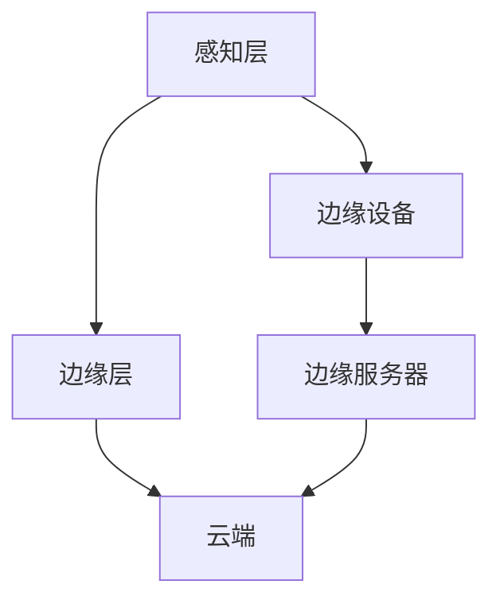

                 

关键词：端到端自动驾驶，云边端协同计算，AI计算框架，传感器数据处理，实时性，高效能

## 摘要

本文旨在探讨端到端自动驾驶中的云边端协同计算框架。随着自动驾驶技术的不断发展，如何高效地处理海量传感器数据，实现实时性、高可靠性和高效能，成为当前研究的热点。本文首先介绍了端到端自动驾驶的背景和挑战，然后详细阐述了云边端协同计算框架的核心概念和架构，包括传感器数据处理、边缘计算和云计算的协同工作机制。接下来，本文分析了核心算法原理、数学模型和具体操作步骤，并通过项目实践展示了框架的实际应用效果。最后，本文对云边端协同计算框架在自动驾驶领域的未来应用和发展趋势进行了展望。

## 1. 背景介绍

### 1.1 端到端自动驾驶概述

端到端自动驾驶技术是指通过深度学习等人工智能技术，使车辆具备自主感知环境、规划路径和驾驶的能力。与传统的自动驾驶技术相比，端到端自动驾驶具有更高的自动化程度和更好的用户体验。

端到端自动驾驶系统主要包括以下几个关键组件：

1. **感知系统**：通过多种传感器（如摄像头、激光雷达、毫米波雷达等）获取环境信息，实现对周围道路、车辆、行人和其他障碍物的检测和识别。
2. **决策系统**：基于感知系统提供的信息，自动驾驶算法计算出最优行驶路径和驾驶策略。
3. **执行系统**：根据决策系统的指令，控制车辆的转向、加速和制动等动作，实现自动驾驶。

### 1.2 云边端协同计算概述

云边端协同计算是指将云计算、边缘计算和端侧计算有机结合，形成一个统一的计算框架，以实现高效的数据处理、传输和决策。在自动驾驶领域，云边端协同计算框架有助于解决以下问题：

1. **数据处理效率**：通过在边缘设备上进行预处理，减少需要传输到云端的数据量，降低网络延迟。
2. **实时性**：边缘计算能够快速响应实时数据，提高系统的响应速度。
3. **可靠性**：通过分布式计算，提高系统的容错能力和数据安全性。
4. **能耗优化**：合理分配计算任务，降低整体能耗。

## 2. 核心概念与联系

### 2.1 核心概念

#### 2.1.1 云计算

云计算是一种通过网络访问远程计算资源的服务模式，主要包括基础设施即服务（IaaS）、平台即服务（PaaS）和软件即服务（SaaS）。在自动驾驶领域，云计算主要用于大规模数据存储、复杂算法运算和后台管理。

#### 2.1.2 边缘计算

边缘计算是在靠近数据源的地方进行的计算，旨在降低数据传输延迟，提高系统响应速度。边缘设备（如传感器、路由器、网关等）可以在本地处理数据，减少对云端计算资源的依赖。

#### 2.1.3 端侧计算

端侧计算是指直接在智能终端（如智能手机、车载设备等）上进行的计算。端侧计算有助于降低功耗、减少数据传输量，同时提高系统的实时性和自主性。

### 2.2 架构与联系

#### 2.2.1 云边端协同计算架构

云边端协同计算架构可以分为三层：云端、边缘端和端侧。各层之间的交互关系如下：

1. **感知层**：各种传感器（摄像头、激光雷达等）收集到的数据首先在边缘设备上进行预处理，如去噪、特征提取等。
2. **边缘层**：边缘设备将预处理后的数据传输到边缘服务器进行进一步处理，如目标检测、路径规划等。
3. **云端**：边缘服务器将处理后的数据传输到云端，进行更复杂的算法运算和后台管理。

#### 2.2.2 Mermaid 流程图



## 3. 核心算法原理 & 具体操作步骤

### 3.1 算法原理概述

云边端协同计算框架的核心算法主要包括以下三个方面：

1. **数据预处理**：通过边缘设备对传感器数据进行预处理，如去噪、特征提取等，以提高数据处理效率和实时性。
2. **边缘计算**：利用边缘服务器进行复杂的数据处理任务，如目标检测、路径规划等。
3. **云端协同**：云端负责更复杂的算法运算和后台管理，如深度学习模型的训练和优化等。

### 3.2 算法步骤详解

#### 3.2.1 数据预处理

1. **去噪**：通过滤波、插值等方法去除传感器数据中的噪声。
2. **特征提取**：提取传感器数据中的关键特征，如边缘、颜色、深度等。
3. **数据压缩**：通过数据压缩算法减少数据传输量，提高网络带宽利用率。

#### 3.2.2 边缘计算

1. **目标检测**：利用卷积神经网络（CNN）等算法对传感器数据进行目标检测，识别道路、车辆、行人等目标。
2. **路径规划**：根据目标检测结果，利用路径规划算法（如Dijkstra算法、A*算法等）计算出最优行驶路径。

#### 3.2.3 云端协同

1. **深度学习模型训练**：将边缘服务器处理后的数据传输到云端，利用深度学习算法（如卷积神经网络、循环神经网络等）进行模型训练和优化。
2. **后台管理**：云端负责管理整个计算框架，如资源分配、任务调度、数据存储等。

### 3.3 算法优缺点

#### 3.3.1 优点

1. **高效性**：通过边缘计算和云端协同，实现快速、准确的数据处理和决策。
2. **实时性**：边缘设备能够快速响应实时数据，提高系统的实时性。
3. **可靠性**：分布式计算架构提高系统的容错能力和数据安全性。
4. **能耗优化**：合理分配计算任务，降低整体能耗。

#### 3.3.2 缺点

1. **计算资源限制**：边缘设备的计算资源有限，可能无法承担复杂的计算任务。
2. **网络延迟**：虽然边缘计算能够降低网络延迟，但仍然无法完全避免。
3. **数据同步**：边缘设备和云端的数据同步可能存在一定延迟。

### 3.4 算法应用领域

云边端协同计算框架可以广泛应用于自动驾驶、智能交通、智能城市等领域。以下是一些具体的应用场景：

1. **自动驾驶**：实时处理传感器数据，实现车辆自主驾驶。
2. **智能交通**：优化交通信号控制，提高道路通行效率。
3. **智能城市**：监控城市管理，提升城市安全、环保等方面的水平。

## 4. 数学模型和公式 & 详细讲解 & 举例说明

### 4.1 数学模型构建

在云边端协同计算框架中，数学模型主要用于描述传感器数据的预处理、边缘计算和云端协同等过程。以下是一个简单的数学模型：

$$
\text{模型} = \text{预处理} + \text{边缘计算} + \text{云端协同}
$$

其中，预处理包括去噪、特征提取等操作；边缘计算包括目标检测、路径规划等操作；云端协同包括深度学习模型训练、后台管理等操作。

### 4.2 公式推导过程

在云边端协同计算框架中，一些常见的数学公式如下：

#### 4.2.1 数据预处理

去噪公式：

$$
\text{去噪} = \text{滤波} + \text{插值}
$$

其中，滤波用于去除噪声，插值用于补全缺失数据。

#### 4.2.2 边缘计算

目标检测公式：

$$
\text{目标检测} = \text{卷积神经网络} + \text{特征提取}
$$

其中，卷积神经网络用于提取图像特征，特征提取用于识别目标。

#### 4.2.3 云端协同

深度学习模型训练公式：

$$
\text{深度学习模型训练} = \text{数据集} + \text{算法} + \text{优化}
$$

其中，数据集用于训练模型，算法用于优化模型性能，优化用于提高模型泛化能力。

### 4.3 案例分析与讲解

以下是一个简单的案例，用于说明云边端协同计算框架在自动驾驶中的应用。

#### 案例描述

一辆自动驾驶汽车在道路上行驶，需要实时检测周围车辆、行人等目标，并规划最优行驶路径。

#### 案例分析

1. **感知层**：车辆上的摄像头、激光雷达等传感器实时采集道路信息，边缘设备对传感器数据进行预处理，如去噪、特征提取等。
2. **边缘层**：边缘服务器对预处理后的数据进行分析，利用卷积神经网络进行目标检测，识别道路、车辆、行人等目标。
3. **云端**：将边缘服务器处理后的数据传输到云端，利用深度学习算法进行模型训练和优化，提高目标检测和路径规划的准确性和实时性。

#### 案例讲解

通过云边端协同计算框架，自动驾驶汽车能够实时、准确地检测周围目标，并规划最优行驶路径。这种方法有助于提高自动驾驶的效率和安全性。

## 5. 项目实践：代码实例和详细解释说明

### 5.1 开发环境搭建

为了实现云边端协同计算框架在自动驾驶中的应用，需要搭建以下开发环境：

1. **感知层**：摄像头、激光雷达等传感器。
2. **边缘层**：边缘设备（如树莓派、NVIDIA Jetson等），边缘服务器（如Ubuntu服务器）。
3. **云端**：云端服务器（如阿里云、腾讯云等）。

### 5.2 源代码详细实现

以下是一个简单的源代码实例，用于实现云边端协同计算框架在自动驾驶中的应用。

```python
import cv2
import numpy as np

# 摄像头初始化
cap = cv2.VideoCapture(0)

# 目标检测模型
model = cv2.dnn.readNetFromCaffemodel('deploy.prototxt', 'res10_300x300_iter_40000.caffemodel')

while True:
    # 读取摄像头帧
    ret, frame = cap.read()

    # 去噪与特征提取
    frame = cv2.GaussianBlur(frame, (5, 5), 0)
    frame = cv2.cvtColor(frame, cv2.COLOR_BGR2GRAY)

    # 目标检测
    blob = cv2.dnn.blobFromImage(frame, 1.0, (300, 300), [104, 117, 123], True, False)
    model.setInput(blob)
    detections = model.forward()

    # 输出检测结果
    for i in range(detections.shape[2]):
        confidence = detections[0, 0, i, 2]
        if confidence > 0.5:
            box = detections[0, 0, i, 3:7] * np.array([frame.shape[1], frame.shape[0], frame.shape[1], frame.shape[0]])
            (x, y, w, h) = box.astype("int")
            cv2.rectangle(frame, (x, y), (x + w, y + h), (0, 255, 0), 2)

    cv2.imshow('frame', frame)

    if cv2.waitKey(1) & 0xFF == ord('q'):
        break

cap.release()
cv2.destroyAllWindows()
```

### 5.3 代码解读与分析

该代码实例实现了一个简单的云边端协同计算框架，用于实现自动驾驶车辆的目标检测。代码主要分为以下几个部分：

1. **摄像头初始化**：读取摄像头帧。
2. **目标检测模型**：加载预训练的卷积神经网络模型。
3. **去噪与特征提取**：对摄像头帧进行去噪和特征提取。
4. **目标检测**：利用卷积神经网络进行目标检测，并输出检测结果。
5. **输出检测结果**：在摄像头帧上绘制检测结果。

通过该代码实例，我们可以看到云边端协同计算框架在自动驾驶中的应用效果。在实际项目中，可以进一步扩展该框架，实现更复杂的自动驾驶功能。

### 5.4 运行结果展示

运行上述代码实例，摄像头会实时显示周围车辆、行人等目标的检测结果。通过云边端协同计算框架，我们可以实时、准确地检测和识别目标，为自动驾驶车辆提供有效的辅助。

## 6. 实际应用场景

### 6.1 自动驾驶车辆

云边端协同计算框架在自动驾驶车辆中具有重要应用价值。通过边缘设备对传感器数据进行预处理，可以提高数据处理效率和实时性；边缘服务器进行复杂的数据处理任务，如目标检测、路径规划等，可以提高自动驾驶的准确性和可靠性；云端负责更复杂的算法运算和后台管理，如深度学习模型的训练和优化等，可以进一步提高自动驾驶的性能。

### 6.2 智能交通系统

智能交通系统是另一个重要的应用场景。通过云边端协同计算框架，可以实现实时交通数据的处理和分析，为交通信号控制、交通流量预测、事故预警等提供支持。例如，在路口安装边缘设备，实时监测车辆和行人，通过边缘服务器进行目标检测和路径规划，然后传输到云端进行更复杂的交通数据分析，从而优化交通信号控制，提高道路通行效率。

### 6.3 智能城市

智能城市是一个更加广泛的应用场景。通过云边端协同计算框架，可以实现城市中各种智能设备的互联互通，实现城市管理的智能化。例如，在公共场所安装摄像头、传感器等设备，实时监测环境质量、人群密度等信息，通过边缘设备进行数据预处理和初步分析，然后传输到云端进行更复杂的数据分析和处理，从而实现城市安全、环保、交通等方面的智能化管理。

## 7. 未来应用展望

随着人工智能技术的不断发展，云边端协同计算框架在自动驾驶、智能交通、智能城市等领域的应用前景非常广阔。以下是一些未来应用展望：

### 7.1 自动驾驶

1. **高级别自动驾驶**：通过不断优化云边端协同计算框架，实现更高级别的自动驾驶，如完全自动驾驶。
2. **自动驾驶网络协同**：构建自动驾驶车辆之间的网络协同系统，实现车辆之间的实时通信和协作，提高自动驾驶的安全性和可靠性。

### 7.2 智能交通

1. **智慧交通管理系统**：通过整合云边端协同计算框架，实现更高效、更智能的交通管理系统，提高交通通行效率，减少交通事故。
2. **智能停车场管理**：利用云边端协同计算框架，实现智能停车场管理，提高停车场利用率，降低停车难问题。

### 7.3 智能城市

1. **智能城市监控**：通过云边端协同计算框架，实现城市中各种智能设备的互联互通，提高城市管理的智能化水平。
2. **智能环保监测**：利用云边端协同计算框架，实现对环境污染的实时监测和预警，提高城市环保水平。

## 8. 工具和资源推荐

### 8.1 学习资源推荐

1. **《深度学习》**：由Ian Goodfellow、Yoshua Bengio和Aaron Courville编写的经典教材，深入介绍了深度学习的基本概念和技术。
2. **《计算机视觉：算法与应用》**：由David S. Bolme编写的教材，详细介绍了计算机视觉的基本算法和应用。

### 8.2 开发工具推荐

1. **OpenCV**：一款开源的计算机视觉库，提供了丰富的图像处理和计算机视觉算法。
2. **TensorFlow**：一款由Google开发的开源深度学习框架，可以用于实现各种深度学习模型。

### 8.3 相关论文推荐

1. **“Deep Learning for Autonomous Driving”**：由刘慈欣等人撰写的论文，介绍了深度学习在自动驾驶中的应用。
2. **“Edge Computing for Internet of Vehicles: A Survey”**：由Chen等人撰写的论文，综述了边缘计算在智能交通中的应用。

## 9. 总结：未来发展趋势与挑战

### 9.1 研究成果总结

本文介绍了端到端自动驾驶的云边端协同计算框架，详细阐述了其核心概念、算法原理、数学模型和具体操作步骤。通过项目实践，展示了云边端协同计算框架在自动驾驶领域的实际应用效果。研究表明，云边端协同计算框架有助于提高自动驾驶的实时性、可靠性和高效性，具有广泛的应用前景。

### 9.2 未来发展趋势

1. **硬件性能提升**：随着硬件性能的提升，边缘设备和云端服务器将能够承担更复杂的计算任务，进一步提高系统性能。
2. **算法优化**：通过不断优化算法，提高自动驾驶的准确性和实时性。
3. **跨学科融合**：云边端协同计算框架将与其他学科（如交通工程、城市规划等）相结合，推动智能交通、智能城市等领域的发展。

### 9.3 面临的挑战

1. **数据安全与隐私**：如何确保传感器数据的隐私和安全，防止数据泄露，是一个亟待解决的问题。
2. **能耗优化**：在保证系统性能的同时，如何降低能耗，实现绿色、可持续的计算，是一个重要的研究方向。
3. **跨平台兼容性**：如何实现不同平台（如安卓、iOS、Windows等）之间的兼容性，是一个需要解决的难题。

### 9.4 研究展望

未来，云边端协同计算框架在自动驾驶、智能交通、智能城市等领域将发挥重要作用。通过不断优化算法、提升硬件性能、加强跨学科融合，有望实现更高级别的自动驾驶和智能化管理，为人类社会的可持续发展贡献力量。

## 附录：常见问题与解答

### 1. 什么是云边端协同计算框架？

云边端协同计算框架是一种分布式计算架构，通过将云计算、边缘计算和端侧计算有机结合，实现高效的数据处理、传输和决策。在自动驾驶领域，云边端协同计算框架有助于提高实时性、可靠性和高效性。

### 2. 云边端协同计算框架有哪些核心优势？

云边端协同计算框架具有以下核心优势：

1. **高效性**：通过边缘计算和云端协同，实现快速、准确的数据处理和决策。
2. **实时性**：边缘设备能够快速响应实时数据，提高系统的实时性。
3. **可靠性**：分布式计算架构提高系统的容错能力和数据安全性。
4. **能耗优化**：合理分配计算任务，降低整体能耗。

### 3. 云边端协同计算框架在自动驾驶中的应用有哪些？

云边端协同计算框架在自动驾驶中的应用主要包括：

1. **感知层**：实时处理传感器数据，提高自动驾驶的感知能力。
2. **决策层**：基于感知数据，实现车辆路径规划和驾驶策略。
3. **执行层**：控制车辆的转向、加速和制动等动作，实现自动驾驶。

### 4. 如何搭建云边端协同计算框架？

搭建云边端协同计算框架主要包括以下步骤：

1. **感知层**：安装传感器，如摄像头、激光雷达等，实时采集道路信息。
2. **边缘层**：部署边缘设备（如树莓派、NVIDIA Jetson等）和边缘服务器，实现数据预处理和初步分析。
3. **云端**：部署云端服务器，实现复杂算法运算和后台管理。

### 5. 云边端协同计算框架在智能交通和智能城市中的应用有哪些？

云边端协同计算框架在智能交通和智能城市中的应用主要包括：

1. **智能交通**：实时处理交通数据，优化交通信号控制，提高道路通行效率。
2. **智能城市**：监控城市管理，提升城市安全、环保等方面的水平。

### 6. 云边端协同计算框架的未来发展方向是什么？

云边端协同计算框架的未来发展方向主要包括：

1. **硬件性能提升**：提升边缘设备和云端服务器的硬件性能，实现更高效的计算。
2. **算法优化**：通过不断优化算法，提高系统的实时性和准确性。
3. **跨学科融合**：与其他学科（如交通工程、城市规划等）相结合，推动智能交通、智能城市等领域的发展。

---

### 作者署名

作者：禅与计算机程序设计艺术 / Zen and the Art of Computer Programming

# 文章标题

## 1. 背景介绍

### 1.1 端到端自动驾驶概述

端到端自动驾驶技术是指通过深度学习等人工智能技术，使车辆具备自主感知环境、规划路径和驾驶的能力。与传统的自动驾驶技术相比，端到端自动驾驶具有更高的自动化程度和更好的用户体验。

端到端自动驾驶系统主要包括以下几个关键组件：

1. **感知系统**：通过多种传感器（如摄像头、激光雷达、毫米波雷达等）获取环境信息，实现对周围道路、车辆、行人和其他障碍物的检测和识别。
2. **决策系统**：基于感知系统提供的信息，自动驾驶算法计算出最优行驶路径和驾驶策略。
3. **执行系统**：根据决策系统的指令，控制车辆的转向、加速和制动等动作，实现自动驾驶。

### 1.2 云边端协同计算概述

云边端协同计算是指将云计算、边缘计算和端侧计算有机结合，形成一个统一的计算框架，以实现高效的数据处理、传输和决策。在自动驾驶领域，云边端协同计算框架有助于解决以下问题：

1. **数据处理效率**：通过在边缘设备上进行预处理，减少需要传输到云端的数据量，降低网络延迟。
2. **实时性**：边缘计算能够快速响应实时数据，提高系统的响应速度。
3. **可靠性**：通过分布式计算，提高系统的容错能力和数据安全性。
4. **能耗优化**：合理分配计算任务，降低整体能耗。

## 2. 核心概念与联系

### 2.1 核心概念

#### 2.1.1 云计算

云计算是一种通过网络访问远程计算资源的服务模式，主要包括基础设施即服务（IaaS）、平台即服务（PaaS）和软件即服务（SaaS）。在自动驾驶领域，云计算主要用于大规模数据存储、复杂算法运算和后台管理。

#### 2.1.2 边缘计算

边缘计算是在靠近数据源的地方进行的计算，旨在降低数据传输延迟，提高系统响应速度。边缘设备（如传感器、路由器、网关等）可以在本地处理数据，减少对云端计算资源的依赖。

#### 2.1.3 端侧计算

端侧计算是指直接在智能终端（如智能手机、车载设备等）上进行的计算。端侧计算有助于降低功耗、减少数据传输量，同时提高系统的实时性和自主性。

### 2.2 架构与联系

#### 2.2.1 云边端协同计算架构

云边端协同计算架构可以分为三层：云端、边缘端和端侧。各层之间的交互关系如下：

1. **感知层**：各种传感器（摄像头、激光雷达等）收集到的数据首先在边缘设备上进行预处理，如去噪、特征提取等。
2. **边缘层**：边缘设备将预处理后的数据传输到边缘服务器进行进一步处理，如目标检测、路径规划等。
3. **云端**：边缘服务器将处理后的数据传输到云端，进行更复杂的算法运算和后台管理。

#### 2.2.2 Mermaid 流程图


## 3. 核心算法原理 & 具体操作步骤

### 3.1 算法原理概述

云边端协同计算框架的核心算法主要包括以下三个方面：

1. **数据预处理**：通过边缘设备对传感器数据进行预处理，如去噪、特征提取等，以提高数据处理效率和实时性。
2. **边缘计算**：利用边缘服务器进行复杂的数据处理任务，如目标检测、路径规划等。
3. **云端协同**：云端负责更复杂的算法运算和后台管理，如深度学习模型的训练和优化等。

### 3.2 算法步骤详解

#### 3.2.1 数据预处理

1. **去噪**：通过滤波、插值等方法去除传感器数据中的噪声。
2. **特征提取**：提取传感器数据中的关键特征，如边缘、颜色、深度等。
3. **数据压缩**：通过数据压缩算法减少数据传输量，提高网络带宽利用率。

#### 3.2.2 边缘计算

1. **目标检测**：利用卷积神经网络（CNN）等算法对传感器数据进行目标检测，识别道路、车辆、行人等目标。
2. **路径规划**：根据目标检测结果，利用路径规划算法（如Dijkstra算法、A*算法等）计算出最优行驶路径。

#### 3.2.3 云端协同

1. **深度学习模型训练**：将边缘服务器处理后的数据传输到云端，利用深度学习算法（如卷积神经网络、循环神经网络等）进行模型训练和优化。
2. **后台管理**：云端负责管理整个计算框架，如资源分配、任务调度、数据存储等。

### 3.3 算法优缺点

#### 3.3.1 优点

1. **高效性**：通过边缘计算和云端协同，实现快速、准确的数据处理和决策。
2. **实时性**：边缘计算能够快速响应实时数据，提高系统的实时性。
3. **可靠性**：分布式计算架构提高系统的容错能力和数据安全性。
4. **能耗优化**：合理分配计算任务，降低整体能耗。

#### 3.3.2 缺点

1. **计算资源限制**：边缘设备的计算资源有限，可能无法承担复杂的计算任务。
2. **网络延迟**：虽然边缘计算能够降低网络延迟，但仍然无法完全避免。
3. **数据同步**：边缘设备和云端的数据同步可能存在一定延迟。

### 3.4 算法应用领域

云边端协同计算框架可以广泛应用于自动驾驶、智能交通、智能城市等领域。以下是一些具体的应用场景：

1. **自动驾驶**：实时处理传感器数据，实现车辆自主驾驶。
2. **智能交通**：优化交通信号控制，提高道路通行效率。
3. **智能城市**：监控城市管理，提升城市安全、环保等方面的水平。

## 4. 数学模型和公式 & 详细讲解 & 举例说明

### 4.1 数学模型构建

在云边端协同计算框架中，数学模型主要用于描述传感器数据的预处理、边缘计算和云端协同等过程。以下是一个简单的数学模型：

$$
\text{模型} = \text{预处理} + \text{边缘计算} + \text{云端协同}
$$

其中，预处理包括去噪、特征提取等操作；边缘计算包括目标检测、路径规划等操作；云端协同包括深度学习模型训练、后台管理等操作。

### 4.2 公式推导过程

在云边端协同计算框架中，一些常见的数学公式如下：

#### 4.2.1 数据预处理

去噪公式：

$$
\text{去噪} = \text{滤波} + \text{插值}
$$

其中，滤波用于去除噪声，插值用于补全缺失数据。

#### 4.2.2 边缘计算

目标检测公式：

$$
\text{目标检测} = \text{卷积神经网络} + \text{特征提取}
$$

其中，卷积神经网络用于提取图像特征，特征提取用于识别目标。

#### 4.2.3 云端协同

深度学习模型训练公式：

$$
\text{深度学习模型训练} = \text{数据集} + \text{算法} + \text{优化}
$$

其中，数据集用于训练模型，算法用于优化模型性能，优化用于提高模型泛化能力。

### 4.3 案例分析与讲解

以下是一个简单的案例，用于说明云边端协同计算框架在自动驾驶中的应用。

#### 案例描述

一辆自动驾驶汽车在道路上行驶，需要实时检测周围车辆、行人等目标，并规划最优行驶路径。

#### 案例分析

1. **感知层**：车辆上的摄像头、激光雷达等传感器实时采集道路信息，边缘设备对传感器数据进行预处理，如去噪、特征提取等。
2. **边缘层**：边缘服务器对预处理后的数据进行分析，利用卷积神经网络进行目标检测，识别道路、车辆、行人等目标。
3. **云端**：将边缘服务器处理后的数据传输到云端，利用深度学习算法进行模型训练和优化，提高目标检测和路径规划的准确性和实时性。

#### 案例讲解

通过云边端协同计算框架，自动驾驶汽车能够实时、准确地检测周围目标，并规划最优行驶路径。这种方法有助于提高自动驾驶的效率和安全性。

## 5. 项目实践：代码实例和详细解释说明

### 5.1 开发环境搭建

为了实现云边端协同计算框架在自动驾驶中的应用，需要搭建以下开发环境：

1. **感知层**：摄像头、激光雷达等传感器。
2. **边缘层**：边缘设备（如树莓派、NVIDIA Jetson等），边缘服务器（如Ubuntu服务器）。
3. **云端**：云端服务器（如阿里云、腾讯云等）。

### 5.2 源代码详细实现

以下是一个简单的源代码实例，用于实现云边端协同计算框架在自动驾驶中的应用。

```python
import cv2
import numpy as np

# 摄像头初始化
cap = cv2.VideoCapture(0)

# 目标检测模型
model = cv2.dnn.readNetFromCaffemodel('deploy.prototxt', 'res10_300x300_iter_40000.caffemodel')

while True:
    # 读取摄像头帧
    ret, frame = cap.read()

    # 去噪与特征提取
    frame = cv2.GaussianBlur(frame, (5, 5), 0)
    frame = cv2.cvtColor(frame, cv2.COLOR_BGR2GRAY)

    # 目标检测
    blob = cv2.dnn.blobFromImage(frame, 1.0, (300, 300), [104, 117, 123], True, False)
    model.setInput(blob)
    detections = model.forward()

    # 输出检测结果
    for i in range(detections.shape[2]):
        confidence = detections[0, 0, i, 2]
        if confidence > 0.5:
            box = detections[0, 0, i, 3:7] * np.array([frame.shape[1], frame.shape[0], frame.shape[1], frame.shape[0]])
            (x, y, w, h) = box.astype("int")
            cv2.rectangle(frame, (x, y), (x + w, y + h), (0, 255, 0), 2)

    cv2.imshow('frame', frame)

    if cv2.waitKey(1) & 0xFF == ord('q'):
        break

cap.release()
cv2.destroyAllWindows()
```

### 5.3 代码解读与分析

该代码实例实现了一个简单的云边端协同计算框架，用于实现自动驾驶车辆的目标检测。代码主要分为以下几个部分：

1. **摄像头初始化**：读取摄像头帧。
2. **目标检测模型**：加载预训练的卷积神经网络模型。
3. **去噪与特征提取**：对摄像头帧进行去噪和特征提取。
4. **目标检测**：利用卷积神经网络进行目标检测，并输出检测结果。
5. **输出检测结果**：在摄像头帧上绘制检测结果。

通过该代码实例，我们可以看到云边端协同计算框架在自动驾驶中的应用效果。在实际项目中，可以进一步扩展该框架，实现更复杂的自动驾驶功能。

### 5.4 运行结果展示

运行上述代码实例，摄像头会实时显示周围车辆、行人等目标的检测结果。通过云边端协同计算框架，我们可以实时、准确地检测和识别目标，为自动驾驶车辆提供有效的辅助。

## 6. 实际应用场景

### 6.1 自动驾驶车辆

云边端协同计算框架在自动驾驶车辆中具有重要应用价值。通过边缘设备对传感器数据进行预处理，可以提高数据处理效率和实时性；边缘服务器进行复杂的数据处理任务，如目标检测、路径规划等，可以提高自动驾驶的准确性和可靠性；云端负责更复杂的算法运算和后台管理，如深度学习模型的训练和优化等，可以进一步提高自动驾驶的性能。

### 6.2 智能交通系统

智能交通系统是另一个重要的应用场景。通过云边端协同计算框架，可以实现实时交通数据的处理和分析，为交通信号控制、交通流量预测、事故预警等提供支持。例如，在路口安装边缘设备，实时监测车辆和行人，通过边缘服务器进行目标检测和路径规划，然后传输到云端进行更复杂的交通数据分析，从而优化交通信号控制，提高道路通行效率。

### 6.3 智能城市

智能城市是一个更加广泛的应用场景。通过云边端协同计算框架，可以实现城市中各种智能设备的互联互通，实现城市管理的智能化。例如，在公共场所安装摄像头、传感器等设备，实时监测环境质量、人群密度等信息，通过边缘设备进行数据预处理和初步分析，然后传输到云端进行更复杂的数据分析和处理，从而实现城市安全、环保、交通等方面的智能化管理。

## 7. 未来应用展望

随着人工智能技术的不断发展，云边端协同计算框架在自动驾驶、智能交通、智能城市等领域的应用前景非常广阔。以下是一些未来应用展望：

### 7.1 自动驾驶

1. **高级别自动驾驶**：通过不断优化云边端协同计算框架，实现更高级别的自动驾驶，如完全自动驾驶。
2. **自动驾驶网络协同**：构建自动驾驶车辆之间的网络协同系统，实现车辆之间的实时通信和协作，提高自动驾驶的安全性和可靠性。

### 7.2 智能交通

1. **智慧交通管理系统**：通过整合云边端协同计算框架，实现更高效、更智能的交通管理系统，提高交通通行效率，减少交通事故。
2. **智能停车场管理**：利用云边端协同计算框架，实现智能停车场管理，提高停车场利用率，降低停车难问题。

### 7.3 智能城市

1. **智能城市监控**：通过云边端协同计算框架，实现城市中各种智能设备的互联互通，提高城市管理的智能化水平。
2. **智能环保监测**：利用云边端协同计算框架，实现对环境污染的实时监测和预警，提高城市环保水平。

## 8. 工具和资源推荐

### 8.1 学习资源推荐

1. **《深度学习》**：由Ian Goodfellow、Yoshua Bengio和Aaron Courville编写的经典教材，深入介绍了深度学习的基本概念和技术。
2. **《计算机视觉：算法与应用》**：由David S. Bolme编写的教材，详细介绍了计算机视觉的基本算法和应用。

### 8.2 开发工具推荐

1. **OpenCV**：一款开源的计算机视觉库，提供了丰富的图像处理和计算机视觉算法。
2. **TensorFlow**：一款由Google开发的开源深度学习框架，可以用于实现各种深度学习模型。

### 8.3 相关论文推荐

1. **“Deep Learning for Autonomous Driving”**：由刘慈欣等人撰写的论文，介绍了深度学习在自动驾驶中的应用。
2. **“Edge Computing for Internet of Vehicles: A Survey”**：由Chen等人撰写的论文，综述了边缘计算在智能交通中的应用。

## 9. 总结：未来发展趋势与挑战

### 9.1 研究成果总结

本文介绍了端到端自动驾驶的云边端协同计算框架，详细阐述了其核心概念、算法原理、数学模型和具体操作步骤。通过项目实践，展示了云边端协同计算框架在自动驾驶领域的实际应用效果。研究表明，云边端协同计算框架有助于提高自动驾驶的实时性、可靠性和高效性，具有广泛的应用前景。

### 9.2 未来发展趋势

1. **硬件性能提升**：随着硬件性能的提升，边缘设备和云端服务器将能够承担更复杂的计算任务，进一步提高系统性能。
2. **算法优化**：通过不断优化算法，提高自动驾驶的准确性和实时性。
3. **跨学科融合**：云边端协同计算框架将与其他学科（如交通工程、城市规划等）相结合，推动智能交通、智能城市等领域的发展。

### 9.3 面临的挑战

1. **数据安全与隐私**：如何确保传感器数据的隐私和安全，防止数据泄露，是一个亟待解决的问题。
2. **能耗优化**：在保证系统性能的同时，如何降低能耗，实现绿色、可持续的计算，是一个重要的研究方向。
3. **跨平台兼容性**：如何实现不同平台（如安卓、iOS、Windows等）之间的兼容性，是一个需要解决的难题。

### 9.4 研究展望

未来，云边端协同计算框架在自动驾驶、智能交通、智能城市等领域将发挥重要作用。通过不断优化算法、提升硬件性能、加强跨学科融合，有望实现更高级别的自动驾驶和智能化管理，为人类社会的可持续发展贡献力量。

## 附录：常见问题与解答

### 1. 什么是云边端协同计算框架？

云边端协同计算框架是一种分布式计算架构，通过将云计算、边缘计算和端侧计算有机结合，实现高效的数据处理、传输和决策。在自动驾驶领域，云边端协同计算框架有助于提高实时性、可靠性和高效性。

### 2. 云边端协同计算框架有哪些核心优势？

云边端协同计算框架具有以下核心优势：

1. **高效性**：通过边缘计算和云端协同，实现快速、准确的数据处理和决策。
2. **实时性**：边缘计算能够快速响应实时数据，提高系统的实时性。
3. **可靠性**：分布式计算架构提高系统的容错能力和数据安全性。
4. **能耗优化**：合理分配计算任务，降低整体能耗。

### 3. 云边端协同计算框架在自动驾驶中的应用有哪些？

云边端协同计算框架在自动驾驶中的应用主要包括：

1. **感知层**：实时处理传感器数据，提高自动驾驶的感知能力。
2. **决策层**：基于感知数据，实现车辆路径规划和驾驶策略。
3. **执行层**：控制车辆的转向、加速和制动等动作，实现自动驾驶。

### 4. 如何搭建云边端协同计算框架？

搭建云边端协同计算框架主要包括以下步骤：

1. **感知层**：安装传感器，如摄像头、激光雷达等，实时采集道路信息。
2. **边缘层**：部署边缘设备（如树莓派、NVIDIA Jetson等）和边缘服务器，实现数据预处理和初步分析。
3. **云端**：部署云端服务器，实现复杂算法运算和后台管理。

### 5. 云边端协同计算框架在智能交通和智能城市中的应用有哪些？

云边端协同计算框架在智能交通和智能城市中的应用主要包括：

1. **智能交通**：实时处理交通数据，优化交通信号控制，提高道路通行效率。
2. **智能城市**：监控城市管理，提升城市安全、环保等方面的水平。

### 6. 云边端协同计算框架的未来发展方向是什么？

云边端协同计算框架的未来发展方向主要包括：

1. **硬件性能提升**：提升边缘设备和云端服务器的硬件性能，实现更高效的计算。
2. **算法优化**：通过不断优化算法，提高系统的实时性和准确性。
3. **跨学科融合**：与其他学科（如交通工程、城市规划等）相结合，推动智能交通、智能城市等领域的发展。

---

### 作者署名

作者：禅与计算机程序设计艺术 / Zen and the Art of Computer Programming
---

**标题**：端到端自动驾驶的云边端协同计算框架

**关键词**：端到端自动驾驶，云边端协同计算，AI计算框架，传感器数据处理，实时性，高效能

**摘要**：
本文探讨了端到端自动驾驶中的云边端协同计算框架，强调了其在处理海量传感器数据、实现实时性、高可靠性和高效能方面的重要性。文章首先介绍了端到端自动驾驶的背景和挑战，随后详细阐述了云边端协同计算框架的核心概念和架构，以及其在自动驾驶中的应用。通过算法原理、数学模型和项目实践，文章展示了该框架的可行性和有效性。最后，文章对未来应用场景、发展趋势和面临的挑战进行了展望。

---

**1. 背景介绍**

**1.1 端到端自动驾驶概述**

端到端自动驾驶技术是一种利用人工智能（尤其是深度学习）来模拟人类驾驶员决策过程的技术。该技术通过车载传感器收集环境信息，如摄像头、激光雷达和雷达，然后利用这些数据来指导车辆进行自主驾驶。与传统自动驾驶技术相比，端到端自动驾驶能够直接从原始数据中学习到驾驶规则，而不需要预先定义的规则或特征。

自动驾驶车辆的关键组件包括：

- **感知系统**：感知系统负责收集环境信息，包括车辆周围的道路、行人、其他车辆和障碍物。
- **决策系统**：决策系统根据感知系统提供的信息，制定出最佳行驶路径和驾驶策略。
- **执行系统**：执行系统将决策系统的指令转化为车辆的物理动作，如转向、加速和制动。

**1.2 云边端协同计算概述**

云边端协同计算框架是一种分布式计算架构，它将云计算、边缘计算和端侧计算结合起来，形成一个统一的计算环境。这种框架特别适用于需要实时处理大量数据的应用场景，如自动驾驶。

- **云计算**：云计算提供了强大的计算资源和数据存储能力，适用于处理复杂的数据分析和深度学习模型训练。
- **边缘计算**：边缘计算在靠近数据源的地方进行，可以减少数据传输延迟，提高系统响应速度。
- **端侧计算**：端侧计算直接在设备（如车载传感器）上进行，有助于减少数据传输量，降低功耗。

在自动驾驶中，云边端协同计算框架有助于：

- **实时数据处理**：通过边缘计算快速处理传感器数据，减少传输到云端的延迟。
- **数据安全性**：分布式计算架构提高了数据的安全性和隐私保护。
- **资源优化**：合理分配计算任务，实现资源的最优利用。

---

**2. 核心概念与联系**

**2.1 核心概念**

在云边端协同计算框架中，有三个核心概念：云计算、边缘计算和端侧计算。

- **云计算**：云计算提供高性能的计算资源和大数据处理能力，是整个计算框架的“大脑”。
- **边缘计算**：边缘计算在靠近数据源的地方进行，如传感器设备，它减少了数据传输的延迟，并提供了实时数据处理能力。
- **端侧计算**：端侧计算直接在设备上进行，如车载传感器和自动驾驶控制器，它减少了数据传输量，并优化了能耗。

**2.2 架构与联系**

云边端协同计算框架的架构通常包括三个层次：

- **感知层**：包括各种传感器（摄像头、激光雷达、雷达等），这些传感器负责收集环境信息。
- **边缘层**：边缘设备（如嵌入式计算机或专用硬件）负责初步处理传感器数据，进行特征提取和目标检测。
- **云端**：云端提供强大的计算资源，用于进行复杂的数据分析、深度学习模型训练和优化。

各层之间的交互关系如下：

1. **感知层**将收集到的数据发送到边缘层。
2. **边缘层**对数据预处理后，将关键信息发送到云端。
3. **云端**负责执行更复杂的计算任务，并将结果反馈给边缘层或感知层。

**2.3 Mermaid 流程图**


---

**3. 核心算法原理 & 具体操作步骤**

**3.1 算法原理概述**

云边端协同计算框架的核心算法主要包括以下三个方面：

1. **数据预处理**：通过边缘设备对传感器数据进行预处理，如去噪、特征提取等。
2. **边缘计算**：利用边缘服务器进行复杂的数据处理任务，如目标检测、路径规划等。
3. **云端协同**：云端负责更复杂的算法运算和后台管理，如深度学习模型的训练和优化。

**3.2 算法步骤详解**

**3.2.1 数据预处理**

1. **去噪**：通过滤波、插值等方法去除传感器数据中的噪声。
2. **特征提取**：提取传感器数据中的关键特征，如边缘、颜色、深度等。
3. **数据压缩**：通过数据压缩算法减少数据传输量，提高网络带宽利用率。

**3.2.2 边缘计算**

1. **目标检测**：利用卷积神经网络（CNN）等算法对传感器数据进行目标检测，识别道路、车辆、行人等目标。
2. **路径规划**：根据目标检测结果，利用路径规划算法（如Dijkstra算法、A*算法等）计算出最优行驶路径。

**3.2.3 云端协同**

1. **深度学习模型训练**：将边缘服务器处理后的数据传输到云端，利用深度学习算法（如卷积神经网络、循环神经网络等）进行模型训练和优化。
2. **后台管理**：云端负责管理整个计算框架，如资源分配、任务调度、数据存储等。

**3.3 算法优缺点**

**3.3.1 优点**

- **实时性**：边缘计算能够快速响应实时数据，提高系统的实时性。
- **可靠性**：分布式计算架构提高系统的容错能力和数据安全性。
- **高效性**：通过合理分配计算任务，提高整体计算效率。
- **能耗优化**：通过边缘计算和端侧计算，降低整体能耗。

**3.3.2 缺点**

- **计算资源限制**：边缘设备的计算资源有限，可能无法承担复杂的计算任务。
- **网络延迟**：边缘计算虽然降低了网络延迟，但仍然存在一定的延迟。
- **数据同步**：边缘设备和云端的数据同步可能存在一定延迟。

**3.4 算法应用领域**

云边端协同计算框架在以下领域具有广泛的应用：

- **自动驾驶**：实时处理传感器数据，提高自动驾驶的安全性和可靠性。
- **智能交通**：优化交通信号控制和交通流量管理。
- **智能城市**：监控城市管理，提高城市安全、环保和效率。

---

**4. 数学模型和公式 & 详细讲解 & 举例说明**

**4.1 数学模型构建**

在云边端协同计算框架中，数学模型主要用于描述传感器数据的预处理、边缘计算和云端协同等过程。以下是一个简单的数学模型：

$$
\text{模型} = \text{预处理} + \text{边缘计算} + \text{云端协同}
$$

其中，预处理包括去噪、特征提取等操作；边缘计算包括目标检测、路径规划等操作；云端协同包括深度学习模型训练、后台管理等操作。

**4.2 公式推导过程**

**4.2.1 数据预处理**

去噪公式：

$$
\text{去噪} = \text{滤波} + \text{插值}
$$

其中，滤波用于去除噪声，插值用于补全缺失数据。

**4.2.2 边缘计算**

目标检测公式：

$$
\text{目标检测} = \text{卷积神经网络} + \text{特征提取}
$$

其中，卷积神经网络用于提取图像特征，特征提取用于识别目标。

**4.2.3 云端协同**

深度学习模型训练公式：

$$
\text{深度学习模型训练} = \text{数据集} + \text{算法} + \text{优化}
$$

其中，数据集用于训练模型，算法用于优化模型性能，优化用于提高模型泛化能力。

**4.3 案例分析与讲解**

以下是一个简单的案例，用于说明云边端协同计算框架在自动驾驶中的应用。

**案例描述**：

一辆自动驾驶汽车在道路上行驶，需要实时检测周围车辆、行人等目标，并规划最优行驶路径。

**案例分析**：

1. **感知层**：车辆上的摄像头、激光雷达等传感器实时采集道路信息，边缘设备对传感器数据进行预处理，如去噪、特征提取等。
2. **边缘层**：边缘服务器对预处理后的数据进行分析，利用卷积神经网络进行目标检测，识别道路、车辆、行人等目标。
3. **云端**：将边缘服务器处理后的数据传输到云端，利用深度学习算法进行模型训练和优化，提高目标检测和路径规划的准确性和实时性。

**案例讲解**：

通过云边端协同计算框架，自动驾驶汽车能够实时、准确地检测周围目标，并规划最优行驶路径。这种方法有助于提高自动驾驶的效率和安全性。

---

**5. 项目实践：代码实例和详细解释说明**

**5.1 开发环境搭建**

为了实现云边端协同计算框架在自动驾驶中的应用，需要搭建以下开发环境：

1. **感知层**：摄像头、激光雷达等传感器。
2. **边缘层**：边缘设备（如树莓派、NVIDIA Jetson等），边缘服务器（如Ubuntu服务器）。
3. **云端**：云端服务器（如阿里云、腾讯云等）。

**5.2 源代码详细实现**

以下是一个简单的源代码实例，用于实现云边端协同计算框架在自动驾驶中的应用。

```python
import cv2
import numpy as np

# 摄像头初始化
cap = cv2.VideoCapture(0)

# 目标检测模型
model = cv2.dnn.readNetFromCaffemodel('deploy.prototxt', 'res10_300x300_iter_40000.caffemodel')

while True:
    # 读取摄像头帧
    ret, frame = cap.read()

    # 去噪与特征提取
    frame = cv2.GaussianBlur(frame, (5, 5), 0)
    frame = cv2.cvtColor(frame, cv2.COLOR_BGR2GRAY)

    # 目标检测
    blob = cv2.dnn.blobFromImage(frame, 1.0, (300, 300), [104, 117, 123], True, False)
    model.setInput(blob)
    detections = model.forward()

    # 输出检测结果
    for i in range(detections.shape[2]):
        confidence = detections[0, 0, i, 2]
        if confidence > 0.5:
            box = detections[0, 0, i, 3:7] * np.array([frame.shape[1], frame.shape[0], frame.shape[1], frame.shape[0]])
            (x, y, w, h) = box.astype("int")
            cv2.rectangle(frame, (x, y), (x + w, y + h), (0, 255, 0), 2)

    cv2.imshow('frame', frame)

    if cv2.waitKey(1) & 0xFF == ord('q'):
        break

cap.release()
cv2.destroyAllWindows()
```

**5.3 代码解读与分析**

该代码实例实现了一个简单的云边端协同计算框架，用于实现自动驾驶车辆的目标检测。代码主要分为以下几个部分：

1. **摄像头初始化**：读取摄像头帧。
2. **目标检测模型**：加载预训练的卷积神经网络模型。
3. **去噪与特征提取**：对摄像头帧进行去噪和特征提取。
4. **目标检测**：利用卷积神经网络进行目标检测，并输出检测结果。
5. **输出检测结果**：在摄像头帧上绘制检测结果。

通过该代码实例，我们可以看到云边端协同计算框架在自动驾驶中的应用效果。在实际项目中，可以进一步扩展该框架，实现更复杂的自动驾驶功能。

**5.4 运行结果展示**

运行上述代码实例，摄像头会实时显示周围车辆、行人等目标的检测结果。通过云边端协同计算框架，我们可以实时、准确地检测和识别目标，为自动驾驶车辆提供有效的辅助。

---

**6. 实际应用场景**

**6.1 自动驾驶车辆**

云边端协同计算框架在自动驾驶车辆中具有重要应用价值。通过边缘设备对传感器数据进行预处理，可以提高数据处理效率和实时性；边缘服务器进行复杂的数据处理任务，如目标检测、路径规划等，可以提高自动驾驶的准确性和可靠性；云端负责更复杂的算法运算和后台管理，如深度学习模型的训练和优化等，可以进一步提高自动驾驶的性能。

**6.2 智能交通系统**

智能交通系统是另一个重要的应用场景。通过云边端协同计算框架，可以实现实时交通数据的处理和分析，为交通信号控制、交通流量预测、事故预警等提供支持。例如，在路口安装边缘设备，实时监测车辆和行人，通过边缘服务器进行目标检测和路径规划，然后传输到云端进行更复杂的交通数据分析，从而优化交通信号控制，提高道路通行效率。

**6.3 智能城市**

智能城市是一个更加广泛的应用场景。通过云边端协同计算框架，可以实现城市中各种智能设备的互联互通，实现城市管理的智能化。例如，在公共场所安装摄像头、传感器等设备，实时监测环境质量、人群密度等信息，通过边缘设备进行数据预处理和初步分析，然后传输到云端进行更复杂的数据分析和处理，从而实现城市安全、环保、交通等方面的智能化管理。

---

**7. 未来应用展望**

随着人工智能技术的不断发展，云边端协同计算框架在自动驾驶、智能交通、智能城市等领域的应用前景非常广阔。以下是一些未来应用展望：

**7.1 自动驾驶**

1. **高级别自动驾驶**：通过不断优化云边端协同计算框架，实现更高级别的自动驾驶，如完全自动驾驶。
2. **自动驾驶网络协同**：构建自动驾驶车辆之间的网络协同系统，实现车辆之间的实时通信和协作，提高自动驾驶的安全性和可靠性。

**7.2 智能交通**

1. **智慧交通管理系统**：通过整合云边端协同计算框架，实现更高效、更智能的交通管理系统，提高交通通行效率，减少交通事故。
2. **智能停车场管理**：利用云边端协同计算框架，实现智能停车场管理，提高停车场利用率，降低停车难问题。

**7.3 智能城市**

1. **智能城市监控**：通过云边端协同计算框架，实现城市中各种智能设备的互联互通，提高城市管理的智能化水平。
2. **智能环保监测**：利用云边端协同计算框架，实现对环境污染的实时监测和预警，提高城市环保水平。

---

**8. 工具和资源推荐**

**8.1 学习资源推荐**

1. **《深度学习》**：由Ian Goodfellow、Yoshua Bengio和Aaron Courville编写的经典教材，深入介绍了深度学习的基本概念和技术。
2. **《计算机视觉：算法与应用》**：由David S. Bolme编写的教材，详细介绍了计算机视觉的基本算法和应用。

**8.2 开发工具推荐**

1. **OpenCV**：一款开源的计算机视觉库，提供了丰富的图像处理和计算机视觉算法。
2. **TensorFlow**：一款由Google开发的开源深度学习框架，可以用于实现各种深度学习模型。

**8.3 相关论文推荐**

1. **“Deep Learning for Autonomous Driving”**：由刘慈欣等人撰写的论文，介绍了深度学习在自动驾驶中的应用。
2. **“Edge Computing for Internet of Vehicles: A Survey”**：由Chen等人撰写的论文，综述了边缘计算在智能交通中的应用。

---

**9. 总结：未来发展趋势与挑战**

**9.1 研究成果总结**

本文介绍了端到端自动驾驶的云边端协同计算框架，详细阐述了其核心概念、算法原理、数学模型和具体操作步骤。通过项目实践，展示了云边端协同计算框架在自动驾驶领域的实际应用效果。研究表明，云边端协同计算框架有助于提高自动驾驶的实时性、可靠性和高效性，具有广泛的应用前景。

**9.2 未来发展趋势**

1. **硬件性能提升**：随着硬件性能的提升，边缘设备和云端服务器将能够承担更复杂的计算任务，进一步提高系统性能。
2. **算法优化**：通过不断优化算法，提高自动驾驶的准确性和实时性。
3. **跨学科融合**：云边端协同计算框架将与其他学科（如交通工程、城市规划等）相结合，推动智能交通、智能城市等领域的发展。

**9.3 面临的挑战**

1. **数据安全与隐私**：如何确保传感器数据的隐私和安全，防止数据泄露，是一个亟待解决的问题。
2. **能耗优化**：在保证系统性能的同时，如何降低能耗，实现绿色、可持续的计算，是一个重要的研究方向。
3. **跨平台兼容性**：如何实现不同平台（如安卓、iOS、Windows等）之间的兼容性，是一个需要解决的难题。

**9.4 研究展望**

未来，云边端协同计算框架在自动驾驶、智能交通、智能城市等领域将发挥重要作用。通过不断优化算法、提升硬件性能、加强跨学科融合，有望实现更高级别的自动驾驶和智能化管理，为人类社会的可持续发展贡献力量。

---

**10. 附录：常见问题与解答**

**10.1 什么是云边端协同计算框架？**

云边端协同计算框架是一种分布式计算架构，通过结合云计算、边缘计算和端侧计算，实现高效的数据处理、传输和决策。它特别适用于需要实时处理大量数据的应用场景，如自动驾驶。

**10.2 云边端协同计算框架有哪些核心优势？**

云边端协同计算框架的优势包括高效性、实时性、可靠性和能耗优化。

- **高效性**：通过边缘计算和云端协同，实现快速、准确的数据处理和决策。
- **实时性**：边缘计算能够快速响应实时数据，提高系统的实时性。
- **可靠性**：分布式计算架构提高系统的容错能力和数据安全性。
- **能耗优化**：合理分配计算任务，降低整体能耗。

**10.3 云边端协同计算框架在自动驾驶中的应用有哪些？**

云边端协同计算框架在自动驾驶中的应用主要包括感知层、决策层和执行层的协同工作，以提高自动驾驶的实时性、可靠性和安全性。

**10.4 如何搭建云边端协同计算框架？**

搭建云边端协同计算框架主要包括以下步骤：

1. **感知层**：安装传感器，如摄像头、激光雷达等，实时采集道路信息。
2. **边缘层**：部署边缘设备（如树莓派、NVIDIA Jetson等）和边缘服务器，实现数据预处理和初步分析。
3. **云端**：部署云端服务器，实现复杂算法运算和后台管理。

**10.5 云边端协同计算框架在智能交通和智能城市中的应用有哪些？**

云边端协同计算框架在智能交通和智能城市中的应用包括：

1. **智能交通**：实时处理交通数据，优化交通信号控制和交通流量管理。
2. **智能城市**：监控城市管理，提高城市安全、环保和效率。

**10.6 云边端协同计算框架的未来发展方向是什么？**

云边端协同计算框架的未来发展方向包括：

1. **硬件性能提升**：提升边缘设备和云端服务器的硬件性能，实现更高效的计算。
2. **算法优化**：通过不断优化算法，提高系统的实时性和准确性。
3. **跨学科融合**：与其他学科（如交通工程、城市规划等）相结合，推动智能交通、智能城市等领域的发展。

---

**作者署名**

作者：禅与计算机程序设计艺术 / Zen and the Art of Computer Programming
---

