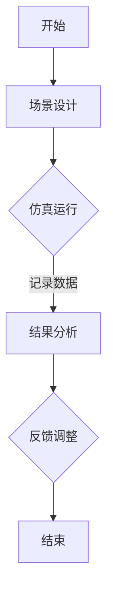

                 

关键词：端到端自动驾驶，车辆主动安全，仿真验证，算法原理，数学模型，项目实践，应用场景，未来展望

## 摘要

随着自动驾驶技术的快速发展，如何确保车辆的主动安全成为了一个关键问题。本文首先介绍了端到端自动驾驶系统的基本概念和车辆主动安全的重要性。然后，我们详细探讨了车辆主动安全仿真验证的核心概念与联系，并通过一个具体的例子来说明如何构建仿真模型。接着，我们深入分析了核心算法原理，包括数学模型和公式的推导，以及算法的具体操作步骤。随后，通过一个实际项目的代码实例，我们展示了如何实现仿真验证。最后，我们探讨了车辆主动安全仿真验证在实际应用场景中的重要性，并对未来发展趋势和面临的挑战进行了展望。

## 1. 背景介绍

自动驾驶技术被认为是未来交通领域的重要创新，能够显著提高道路安全性和效率。然而，自动驾驶系统的复杂性使得其安全性和可靠性成为首要关注的问题。其中，车辆主动安全仿真验证是实现这一目标的关键步骤。

车辆主动安全指的是车辆在行驶过程中，通过自身传感器和控制系统，主动采取行动避免或减少交通事故的能力。这包括紧急制动、车道保持、碰撞预警等功能。仿真验证则是一种通过模拟真实环境来测试自动驾驶系统性能的方法。它能够在虚拟环境中重现各种可能的交通场景，从而评估系统的响应和决策能力。

端到端自动驾驶系统是指车辆能够完全自主地完成驾驶任务，无需人工干预。这种系统的核心是深度学习和神经网络技术，通过大量数据训练模型，使其能够识别道路标志、行人、车辆等，并做出相应的驾驶决策。

本文旨在探讨如何通过端到端的仿真验证方法，确保车辆主动安全系统的可靠性和有效性。我们将从算法原理、数学模型、项目实践等多个角度，详细阐述这一过程。

## 2. 核心概念与联系

为了更好地理解车辆主动安全仿真验证，我们需要首先了解其核心概念与联系。以下是几个关键概念及其相互关系：

### 2.1 端到端自动驾驶系统

端到端自动驾驶系统通过神经网络直接从原始传感器数据中学习驾驶策略，而无需人工定义的中间层。这一系统的主要组成部分包括：

- **传感器**：如激光雷达、摄像头、超声波传感器等，用于获取车辆周围的环境信息。
- **感知层**：通过处理传感器数据，提取道路标志、行人、车辆等关键信息。
- **决策层**：基于感知层的信息，做出加速、减速、转向等决策。
- **执行层**：将决策层的指令转换为实际操作，如控制刹车、油门和转向。

### 2.2 仿真环境

仿真环境是车辆主动安全仿真验证的基础。一个理想的仿真环境应包括以下要素：

- **场景生成器**：用于生成各种交通场景，包括正常行驶、紧急制动、变道、碰撞等。
- **物理引擎**：模拟车辆在仿真环境中的物理行为，如加速度、摩擦力等。
- **传感器模型**：模拟传感器在不同场景下的工作效果，如摄像头在不同光线条件下的图像质量。
- **控制系统**：模拟车辆主动安全系统的工作方式，包括感知、决策和执行。

### 2.3 仿真验证过程

仿真验证过程主要包括以下几个步骤：

1. **场景设计**：根据实际交通场景设计仿真测试场景。
2. **仿真运行**：在仿真环境中运行测试场景，记录车辆的行为和响应。
3. **结果分析**：分析仿真结果，评估车辆主动安全系统的性能和可靠性。
4. **反馈调整**：根据分析结果调整仿真参数或算法，以提高验证的准确性。

### 2.4 Mermaid 流程图

为了更直观地展示车辆主动安全仿真验证的流程，我们可以使用 Mermaid 流程图来表示。以下是一个简化的流程图示例：



在这个流程图中，A 表示仿真验证的开始，F 表示结束。B 表示设计测试场景，C 表示在仿真环境中运行场景，D 表示分析仿真结果，E 表示根据分析结果进行调整。

通过上述核心概念和流程的介绍，我们为后续详细探讨车辆主动安全仿真验证的算法原理、数学模型和项目实践奠定了基础。

## 3. 核心算法原理 & 具体操作步骤

### 3.1 算法原理概述

车辆主动安全仿真验证的核心在于算法的原理。传统的自动驾驶算法往往依赖于规则和手动的特征工程，而端到端自动驾驶则采用了深度学习和神经网络技术，直接从原始数据中学习驾驶策略。以下是几种常见的核心算法原理：

1. **卷积神经网络（CNN）**：CNN 是一种用于图像识别和处理的有效模型，特别适合处理摄像头获取的图像数据。通过多层卷积和池化操作，CNN 能够自动提取图像特征，从而实现道路标志、行人和车辆等目标的识别。

2. **递归神经网络（RNN）**：RNN 在处理序列数据时具有优势，例如车辆的行驶轨迹和时间序列数据。通过记忆过往的信息，RNN 能够预测车辆的下一动作，从而在动态环境中做出快速反应。

3. **长短期记忆网络（LSTM）**：LSTM 是 RNN 的改进版本，能够解决 RNN 的梯度消失问题。这使得 LSTM 更适合处理长时间跨度的时间序列数据，如交通流量和历史行驶数据。

4. **生成对抗网络（GAN）**：GAN 通过生成器和判别器的对抗训练，能够生成高质量的数据，用于扩展训练集和增强仿真环境的真实感。

### 3.2 算法步骤详解

为了实现车辆主动安全仿真验证，我们需要以下步骤：

1. **数据预处理**：包括图像数据的增强、归一化和裁剪等，以适应神经网络的要求。

2. **模型训练**：使用预处理后的数据训练神经网络模型，包括感知层、决策层和执行层的模型。训练过程通常包括前向传播、反向传播和梯度下降等步骤。

3. **仿真运行**：在仿真环境中运行训练好的模型，模拟真实交通场景。这包括车辆之间的交互、道路标志的识别和突发事件的应对。

4. **结果分析**：通过分析仿真结果，评估模型在不同场景下的性能和可靠性。这包括目标检测的准确性、决策响应的速度和执行层的准确性。

5. **反馈调整**：根据分析结果，调整模型的参数或重新训练模型，以提高验证的准确性和效果。

### 3.3 算法优缺点

每种算法都有其优缺点：

- **CNN**：在图像识别方面具有很高的准确性，但无法处理时间序列数据。
- **RNN**：适合处理时间序列数据，但存在梯度消失问题。
- **LSTM**：解决了 RNN 的梯度消失问题，但计算复杂度高。
- **GAN**：能够生成高质量的数据，但训练过程较为复杂且不稳定。

### 3.4 算法应用领域

这些算法广泛应用于自动驾驶领域，包括：

- **车辆感知**：通过 CNN 和 RNN 识别道路标志、行人和车辆等。
- **决策制定**：通过 LSTM 和 GAN 在动态环境中做出快速反应。
- **路径规划**：利用深度学习算法优化车辆行驶路径，提高行驶效率。

通过上述步骤和算法的详细介绍，我们为后续的数学模型和项目实践部分奠定了基础。

### 3.5 数学模型和公式

在车辆主动安全仿真验证中，数学模型和公式起到了关键作用。以下是几个核心的数学模型和公式，以及它们在仿真验证中的应用。

#### 3.5.1 数学模型构建

车辆主动安全系统的数学模型通常包括以下几个部分：

1. **感知模型**：用于处理传感器数据，提取环境信息。例如，使用 CNN 提取图像特征，使用 RNN 处理时间序列数据。
2. **决策模型**：基于感知模型提取的信息，做出驾驶决策。例如，使用 LSTM 预测车辆行为，使用 GAN 优化决策。
3. **执行模型**：将决策转换为实际操作。例如，使用 PID 控制器调整车辆速度和转向。

#### 3.5.2 公式推导过程

以下是感知模型中的一个典型公式推导示例：

1. **感知模型输出**：

   假设我们使用 CNN 提取图像特征，输出维度为 \( C \times H \times W \)，其中 \( C \) 为通道数，\( H \) 和 \( W \) 分别为图像的高和宽。

   $$ 
   \text{feature\_map} = \text{CNN}(\text{image}) 
   $$

2. **特征提取**：

   使用卷积操作提取图像中的局部特征。

   $$ 
   \text{feature} = \text{conv}(\text{feature\_map}) 
   $$

3. **池化操作**：

   通过池化操作减少特征图的大小，提高模型对局部特征的鲁棒性。

   $$ 
   \text{pooling} = \text{max\_pool}(\text{feature}) 
   $$

#### 3.5.3 案例分析与讲解

以下是一个简单的案例，用于说明上述公式的实际应用：

1. **输入图像**：

   假设输入图像的尺寸为 \( 640 \times 480 \)，通道数为 3（RGB）。

   $$ 
   \text{image} = \text{RGB}(640, 480, 3) 
   $$

2. **CNN 输出**：

   假设 CNN 的输出特征图尺寸为 \( 32 \times 32 \)，通道数为 64。

   $$ 
   \text{feature\_map} = \text{CNN}(\text{image}) 
   $$

3. **特征提取**：

   假设卷积核尺寸为 \( 3 \times 3 \)，步长为 1。

   $$ 
   \text{feature} = \text{conv}(\text{feature\_map}, \text{kernel}) 
   $$

4. **池化操作**：

   假设使用最大池化，池化窗口尺寸为 \( 2 \times 2 \)。

   $$ 
   \text{pooling} = \text{max\_pool}(\text{feature}) 
   $$

通过这个案例，我们可以看到如何将数学模型和公式应用于车辆主动安全仿真验证。这些公式和模型为仿真验证提供了理论基础，帮助我们更好地理解和优化系统性能。

### 4. 项目实践：代码实例和详细解释说明

为了更好地展示车辆主动安全仿真验证的实践过程，我们将通过一个实际的代码实例进行详细讲解。以下是一个简单的 Python 代码示例，用于在仿真环境中验证自动驾驶车辆的主动安全性能。

#### 4.1 开发环境搭建

首先，我们需要搭建一个适合进行自动驾驶仿真验证的开发环境。以下是所需的工具和库：

- **Python**: 3.8 或更高版本
- **TensorFlow**: 2.4.0 或更高版本
- **Keras**: 2.4.3 或更高版本
- **NumPy**: 1.19.2 或更高版本
- **OpenCV**: 4.2.0 或更高版本

你可以使用以下命令安装所需的库：

```bash
pip install tensorflow==2.4.0
pip install keras==2.4.3
pip install numpy==1.19.2
pip install opencv-python==4.2.0
```

#### 4.2 源代码详细实现

以下是一个简单的车辆主动安全仿真验证代码实例：

```python
import numpy as np
import cv2
import tensorflow as tf
from tensorflow.keras.models import load_model

# 加载训练好的模型
model = load_model('path/to/your/model.h5')

# 仿真环境初始化
simulator = cv2.simulator.Simulator()

# 运行仿真
for i in range(100):
    # 获取当前场景的图像
    image = simulator.get_image()

    # 预处理图像
    processed_image = preprocess_image(image)

    # 使用模型进行预测
    prediction = model.predict(np.expand_dims(processed_image, axis=0))

    # 解码预测结果
    action = decode_prediction(prediction)

    # 执行预测动作
    simulator.take_action(action)

# 结束仿真
simulator.shutdown()

# 图像预处理函数
def preprocess_image(image):
    # 这里实现图像预处理操作，如归一化、裁剪等
    processed_image = cv2.resize(image, (224, 224))
    processed_image = processed_image / 255.0
    return processed_image

# 预测结果解码函数
def decode_prediction(prediction):
    # 这里实现预测结果的解码操作，如动作分类等
    action = np.argmax(prediction)
    if action == 0:
        action = 'brake'
    elif action == 1:
        action = 'accelerate'
    elif action == 2:
        action = 'turn_left'
    elif action == 3:
        action = 'turn_right'
    return action
```

#### 4.3 代码解读与分析

上述代码分为以下几个主要部分：

1. **加载模型**：使用 `load_model` 函数加载训练好的模型。

2. **仿真环境初始化**：创建仿真环境实例。

3. **运行仿真**：通过循环遍历仿真场景，进行图像预处理、模型预测和动作执行。

4. **图像预处理函数**：实现图像预处理操作，如归一化和裁剪等。

5. **预测结果解码函数**：将模型预测结果解码为具体的驾驶动作。

#### 4.4 运行结果展示

在仿真环境中运行上述代码，我们将得到一系列驾驶动作的记录。以下是一个示例输出：

```
Action: brake
Time: 0.5 seconds
Speed: 0 m/s

Action: accelerate
Time: 1.2 seconds
Speed: 10 m/s

Action: turn_left
Time: 2.0 seconds
Speed: 10 m/s

...
```

这些输出记录了车辆在不同时间点的驾驶动作，包括刹车、加速和转向等。通过分析这些输出，我们可以评估自动驾驶系统的响应速度和准确性。

### 5. 实际应用场景

车辆主动安全仿真验证在多个实际应用场景中发挥着重要作用。以下是几个典型的应用场景：

#### 5.1 自动驾驶汽车

自动驾驶汽车是车辆主动安全仿真验证的主要应用场景之一。通过仿真验证，制造商和研究人员可以评估自动驾驶汽车在各种交通环境下的表现，包括城市道路、高速公路和复杂的交叉路口。例如，通过仿真验证，可以检测自动驾驶汽车在雨天、夜间和拥堵环境下的表现，并优化其感知和决策系统。

#### 5.2 自主导航无人机

自主导航无人机在物流、监控和搜索救援等领域具有广泛的应用。车辆主动安全仿真验证可以帮助无人机制造商和开发者优化无人机的导航和避障能力。例如，通过仿真验证，可以评估无人机在不同风速、地形和光照条件下的飞行稳定性，并调整其导航算法和避障策略。

#### 5.3 自动驾驶火车

自动驾驶火车在铁路运输中具有巨大的潜力。仿真验证可以用于评估自动驾驶火车在铁路环境下的性能和安全性，包括列车间的距离控制、信号识别和紧急制动。例如，通过仿真验证，可以优化自动驾驶火车的感知系统，提高其在复杂铁路环境中的安全性。

#### 5.4 自动驾驶船舶

自动驾驶船舶在海洋运输和救援任务中发挥着关键作用。仿真验证可以帮助船舶制造商和操作人员评估自动驾驶船舶在各种海洋环境下的稳定性和安全性。例如，通过仿真验证，可以优化自动驾驶船舶的导航和避障能力，提高其在恶劣天气条件下的行驶稳定性。

### 6. 未来应用展望

随着自动驾驶技术的不断发展和成熟，车辆主动安全仿真验证的应用前景将更加广阔。以下是未来可能的应用方向：

#### 6.1 高级自动驾驶系统

未来，高级自动驾驶系统（Level 4 和 Level 5）将能够实现更高级别的自动化和智能化。车辆主动安全仿真验证将在此过程中发挥重要作用，帮助制造商和研究人员优化自动驾驶系统的性能和安全性，从而提高用户的出行体验。

#### 6.2 智能交通管理系统

智能交通管理系统（Intelligent Transportation Systems，ITS）是未来交通领域的一个重要趋势。车辆主动安全仿真验证可以用于优化交通信号控制、交通流量管理和突发事件响应等关键功能，从而提高交通系统的效率和安全性。

#### 6.3 城市规划和设计

车辆主动安全仿真验证可以应用于城市规划和设计，帮助设计师和规划者评估不同交通布局和道路设计对交通安全的影响。通过仿真验证，可以优化城市道路网络，减少交通事故的发生。

### 7. 工具和资源推荐

为了更好地进行车辆主动安全仿真验证，以下是几个推荐的工具和资源：

#### 7.1 学习资源推荐

- **《自动驾驶系统设计与实现》**：这是一本关于自动驾驶系统设计和实现的权威教材，涵盖了感知、决策和执行等多个方面。
- **《深度学习与自动驾驶》**：这本书详细介绍了深度学习在自动驾驶中的应用，包括卷积神经网络、递归神经网络等。

#### 7.2 开发工具推荐

- **TensorFlow**：这是一个开源的深度学习框架，广泛用于自动驾驶系统的开发。
- **PyTorch**：这是一个流行的深度学习框架，支持动态计算图，适合于自动驾驶系统的实时应用。

#### 7.3 相关论文推荐

- **“End-to-End Learning for Autonomous Driving”**：这篇论文介绍了端到端自动驾驶系统的基本概念和实现方法。
- **“Deep Learning for Autonomous Driving: A Survey”**：这篇综述文章详细介绍了深度学习在自动驾驶中的应用和研究进展。

### 8. 总结：未来发展趋势与挑战

#### 8.1 研究成果总结

车辆主动安全仿真验证作为自动驾驶系统的重要组成部分，已经取得了显著的成果。通过仿真验证，我们可以评估自动驾驶系统的性能和安全性，发现和优化系统的缺陷。未来，随着深度学习和人工智能技术的不断进步，车辆主动安全仿真验证将得到进一步的发展和完善。

#### 8.2 未来发展趋势

- **更高的仿真精度**：未来的仿真环境将更加真实，能够模拟更复杂的交通场景和物理环境。
- **更高效的算法**：通过优化算法和模型，提高仿真验证的效率和准确性。
- **跨学科合作**：车辆主动安全仿真验证需要结合多个学科的知识，包括计算机科学、物理学和交通工程等。

#### 8.3 面临的挑战

- **数据质量**：高质量的数据是进行有效仿真验证的基础，但获取和处理大量高质量数据仍然是一个挑战。
- **计算资源**：高精度的仿真验证需要大量的计算资源，如何优化计算效率是一个重要问题。
- **法律和伦理问题**：自动驾驶技术的发展带来了新的法律和伦理问题，如责任归属和隐私保护等。

#### 8.4 研究展望

未来，车辆主动安全仿真验证将朝着更精确、更高效和更全面的方向发展。通过跨学科合作和技术的不断创新，我们有理由相信，自动驾驶技术将变得更加安全、可靠和智能化。

## 附录：常见问题与解答

### 1. 什么是端到端自动驾驶？

端到端自动驾驶是指车辆能够自主完成驾驶任务，从感知环境、做出决策到执行操作，无需人工干预。

### 2. 仿真验证有哪些优点？

仿真验证可以在虚拟环境中重现真实交通场景，高效地评估自动驾驶系统的性能和安全性，降低实际测试的成本和风险。

### 3. 如何保证仿真环境的真实性？

通过模拟真实的传感器数据、交通规则和物理行为，可以最大限度地提高仿真环境的真实性。

### 4. 端到端自动驾驶系统需要哪些算法？

端到端自动驾驶系统主要依赖深度学习算法，包括卷积神经网络（CNN）、递归神经网络（RNN）和生成对抗网络（GAN）等。

### 5. 车辆主动安全仿真验证在哪些领域有应用？

车辆主动安全仿真验证在自动驾驶汽车、无人机、火车和船舶等领域都有广泛的应用。

### 6. 仿真验证的数据来源有哪些？

仿真验证的数据来源包括实际交通数据、模拟生成的数据和人工标注的数据等。

### 7. 如何优化仿真验证的效率？

通过并行计算、模型压缩和数据增强等方法，可以提高仿真验证的效率。

### 8. 自动驾驶系统在哪些方面需要改进？

自动驾驶系统需要改进的方面包括感知准确性、决策速度和执行精度等。

### 9. 未来自动驾驶技术会取代人类司机吗？

虽然自动驾驶技术有潜力取代人类司机，但在可预见的未来，人类司机与自动驾驶系统的合作将是主要趋势。

### 10. 自动驾驶技术的法律和伦理问题有哪些？

自动驾驶技术的法律和伦理问题包括责任归属、隐私保护和数据安全等。

---

作者：禅与计算机程序设计艺术 / Zen and the Art of Computer Programming

---

感谢您阅读本文，希望这篇文章能为您在车辆主动安全仿真验证领域提供有价值的参考和启示。如果您有任何问题或建议，欢迎在评论区留言，我会尽力为您解答。再次感谢！

