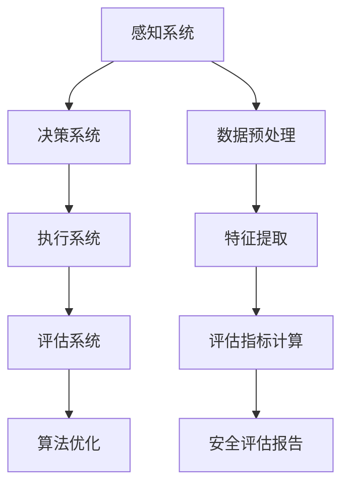

                 

关键词：自动驾驶、车辆主动安全、评估体系、端到端、算法、数学模型、项目实践、应用场景、未来展望

> 摘要：本文旨在探讨端到端自动驾驶车辆主动安全评估体系，深入分析其核心概念、算法原理、数学模型以及实际应用场景，为自动驾驶技术的发展提供有益的参考。本文首先介绍了自动驾驶车辆主动安全的背景和意义，随后详细阐述了评估体系的核心概念和联系，并通过具体算法原理、数学模型和项目实践，对评估体系进行了全面解析。最后，本文对未来自动驾驶车辆主动安全评估体系的发展趋势和挑战进行了展望，以期为相关领域的研究和实践提供指导。

## 1. 背景介绍

随着科技的飞速发展，自动驾驶技术逐渐成为汽车工业的重要研究方向。自动驾驶车辆凭借其高效、安全、环保的特点，得到了广泛的应用前景。然而，自动驾驶技术的发展也带来了一系列新的挑战，尤其是车辆主动安全评估问题。车辆主动安全评估是指通过评估车辆在特定环境下的反应能力和安全性，为自动驾驶系统的优化和改进提供数据支持。

自动驾驶车辆主动安全评估的重要性主要体现在以下几个方面：

1. **提升车辆安全性**：通过评估车辆在各种交通场景下的反应能力，可以识别潜在的安全隐患，从而提高自动驾驶车辆的整体安全性。

2. **优化算法性能**：评估体系可以为自动驾驶算法的优化提供数据支持，使算法更加准确、稳定，从而提高自动驾驶车辆的驾驶效果。

3. **降低交通事故率**：自动驾驶车辆在特定环境下的反应速度和准确性远高于人类驾驶员，通过评估体系可以有效降低交通事故的发生率。

4. **促进法律法规制定**：评估体系可以为国家制定自动驾驶车辆相关的法律法规提供科学依据，推动自动驾驶技术的发展和普及。

## 2. 核心概念与联系

### 2.1 自动驾驶等级划分

自动驾驶技术按照国际自动机工程师学会（SAE）的划分标准，可以分为0到5级，具体如下：

- **0级**：无自动化，所有驾驶任务由人类驾驶员完成。
- **1级**：驾驶辅助，车辆可进行特定功能的自动化，如自适应巡航或车道保持。
- **2级**：部分自动化，车辆可同时进行多项驾驶任务的自动化，但需要人类驾驶员监控。
- **3级**：有条件自动化，车辆可在特定条件下完全接管驾驶任务，但需要人类驾驶员随时接管。
- **4级**：高度自动化，车辆可在特定区域内完全自主驾驶，无需人类驾驶员干预。
- **5级**：完全自动化，车辆在所有环境下都能完全自主驾驶。

### 2.2 车辆主动安全评估概念

车辆主动安全评估是指在自动驾驶车辆运行过程中，通过对车辆的反应速度、驾驶稳定性、应急处理能力等方面进行综合评估，以判断车辆在特定环境下的安全性。评估体系的核心目标是确保自动驾驶车辆在各种复杂交通环境下的稳定运行，避免发生交通事故。

### 2.3 评估体系组成

车辆主动安全评估体系主要由以下几部分组成：

1. **感知系统**：包括激光雷达、摄像头、雷达等传感器，用于获取车辆周围的环境信息。
2. **决策系统**：基于感知系统获取的信息，自动驾驶算法进行驾驶决策。
3. **执行系统**：根据决策系统的指令，控制车辆的制动、转向、加速等操作。
4. **评估系统**：对自动驾驶车辆的驾驶行为进行实时评估，为算法优化提供数据支持。

### 2.4 Mermaid 流程图

下面是车辆主动安全评估体系的 Mermaid 流程图：



## 3. 核心算法原理 & 具体操作步骤

### 3.1 算法原理概述

车辆主动安全评估的核心算法主要包括感知算法、决策算法和评估算法。这些算法共同协作，实现对车辆驾驶行为的实时评估和优化。

1. **感知算法**：主要用于处理传感器获取的原始数据，提取环境特征，如车辆位置、速度、障碍物位置等。
2. **决策算法**：基于感知算法提取的环境特征，结合车辆状态，进行驾驶决策，如加速、减速、转向等。
3. **评估算法**：对决策算法的执行结果进行评估，判断驾驶行为的安全性，为算法优化提供数据支持。

### 3.2 算法步骤详解

1. **感知算法**：
   - 数据预处理：对传感器数据进行去噪、滤波等预处理操作。
   - 特征提取：根据感知任务的需求，提取有用的环境特征，如障碍物距离、速度等。

2. **决策算法**：
   - 建立驾驶模型：根据历史驾驶数据，建立驾驶行为模型。
   - 驾驶决策：根据环境特征和驾驶模型，进行驾驶决策，如加速、减速、转向等。

3. **评估算法**：
   - 评估指标计算：根据驾驶行为，计算评估指标，如安全距离、速度稳定性等。
   - 安全评估：根据评估指标，判断驾驶行为的安全性，为算法优化提供数据支持。

### 3.3 算法优缺点

1. **感知算法**：
   - 优点：能够实时获取环境信息，为决策算法提供准确的输入。
   - 缺点：传感器数据容易受到环境噪声的影响，特征提取的准确性有待提高。

2. **决策算法**：
   - 优点：基于历史驾驶数据，能够模拟人类驾驶员的驾驶行为。
   - 缺点：在复杂交通环境中，决策算法的稳定性有待提高。

3. **评估算法**：
   - 优点：能够实时评估驾驶行为的安全性，为算法优化提供数据支持。
   - 缺点：评估指标的准确性受到感知算法和决策算法的影响。

### 3.4 算法应用领域

车辆主动安全评估算法主要应用于自动驾驶车辆的安全性评估，如自动驾驶出租车、自动驾驶物流车等。此外，该算法还可以应用于智能交通系统的建设和优化，为交通管理部门提供科学依据。

## 4. 数学模型和公式 & 详细讲解 & 举例说明

### 4.1 数学模型构建

车辆主动安全评估的数学模型主要包括感知模型、决策模型和评估模型。下面分别介绍这些模型的构建方法。

1. **感知模型**：

   感知模型主要基于传感器数据，提取环境特征。设传感器数据为 $X = \{x_1, x_2, ..., x_n\}$，环境特征为 $Y = \{y_1, y_2, ..., y_m\}$，则感知模型可以表示为：

   $$ Y = f(X) $$

   其中，$f$ 表示感知算法，用于将传感器数据转换为环境特征。

2. **决策模型**：

   决策模型基于感知模型提取的环境特征，进行驾驶决策。设驾驶决策为 $D = \{d_1, d_2, ..., d_k\}$，则决策模型可以表示为：

   $$ D = g(Y) $$

   其中，$g$ 表示决策算法，用于将环境特征转换为驾驶决策。

3. **评估模型**：

   评估模型对驾驶行为进行评估，判断驾驶行为的安全性。设评估指标为 $E = \{e_1, e_2, ..., e_n\}$，则评估模型可以表示为：

   $$ E = h(D) $$

   其中，$h$ 表示评估算法，用于将驾驶决策转换为评估指标。

### 4.2 公式推导过程

下面分别对感知模型、决策模型和评估模型的公式推导过程进行说明。

1. **感知模型**：

   设传感器数据为 $X = \{x_1, x_2, ..., x_n\}$，环境特征为 $Y = \{y_1, y_2, ..., y_m\}$，则感知模型的推导过程如下：

   $$ y_1 = w_1x_1 + b_1 $$

   $$ y_2 = w_2x_2 + b_2 $$

   $$ ... $$

   $$ y_m = w_mx_m + b_m $$

   其中，$w_i$ 和 $b_i$ 分别表示权重和偏置。

2. **决策模型**：

   设环境特征为 $Y = \{y_1, y_2, ..., y_m\}$，驾驶决策为 $D = \{d_1, d_2, ..., d_k\}$，则决策模型的推导过程如下：

   $$ d_1 = f_1(y_1, y_2, ..., y_m) $$

   $$ d_2 = f_2(y_1, y_2, ..., y_m) $$

   $$ ... $$

   $$ d_k = f_k(y_1, y_2, ..., y_m) $$

   其中，$f_i$ 表示决策规则。

3. **评估模型**：

   设驾驶决策为 $D = \{d_1, d_2, ..., d_k\}$，评估指标为 $E = \{e_1, e_2, ..., e_n\}$，则评估模型的推导过程如下：

   $$ e_1 = h_1(d_1, d_2, ..., d_k) $$

   $$ e_2 = h_2(d_1, d_2, ..., d_k) $$

   $$ ... $$

   $$ e_n = h_n(d_1, d_2, ..., d_k) $$

   其中，$h_i$ 表示评估规则。

### 4.3 案例分析与讲解

为了更好地理解车辆主动安全评估的数学模型，我们以一个简单的案例进行讲解。

假设我们有一个自动驾驶车辆，在行驶过程中需要判断前方是否有障碍物，并做出相应的驾驶决策。设传感器数据为 $X = \{x_1, x_2\}$，其中 $x_1$ 表示障碍物距离，$x_2$ 表示车辆速度。环境特征为 $Y = \{y_1, y_2\}$，其中 $y_1$ 表示障碍物距离的平方，$y_2$ 表示车辆速度的平方。驾驶决策为 $D = \{d_1, d_2\}$，其中 $d_1$ 表示是否减速，$d_2$ 表示是否转向。评估指标为 $E = \{e_1, e_2\}$，其中 $e_1$ 表示减速后的安全距离，$e_2$ 表示转向后的角度。

根据感知模型的公式，我们可以得到环境特征：

$$ y_1 = x_1^2 $$

$$ y_2 = x_2^2 $$

根据决策模型的公式，我们可以得到驾驶决策：

$$ d_1 = \begin{cases} 
1 & \text{if } y_1 > threshold_1 \\
0 & \text{otherwise}
\end{cases} $$

$$ d_2 = \begin{cases} 
1 & \text{if } y_2 > threshold_2 \\
0 & \text{otherwise}
\end{cases} $$

其中，$threshold_1$ 和 $threshold_2$ 是设定的阈值。

根据评估模型的公式，我们可以得到评估指标：

$$ e_1 = \begin{cases} 
distance & \text{if } d_1 = 1 \\
0 & \text{otherwise}
\end{cases} $$

$$ e_2 = \begin{cases} 
angle & \text{if } d_2 = 1 \\
0 & \text{otherwise}
\end{cases} $$

其中，$distance$ 和 $angle$ 分别表示减速后的安全距离和转向后的角度。

通过这个案例，我们可以看到如何将车辆主动安全评估的数学模型应用于实际驾驶场景中，从而实现对自动驾驶车辆的安全评估。

## 5. 项目实践：代码实例和详细解释说明

### 5.1 开发环境搭建

在进行车辆主动安全评估的实践项目时，我们需要搭建一个合适的开发环境。以下是搭建过程的基本步骤：

1. **安装Python环境**：Python是自动驾驶领域常用的编程语言，我们需要安装Python 3.8及以上版本。
2. **安装依赖库**：根据项目需求，我们需要安装一些常用的Python库，如NumPy、Pandas、Matplotlib等。可以使用pip命令进行安装。
3. **安装深度学习框架**：我们选择TensorFlow作为深度学习框架，安装TensorFlow GPU版本可以加快训练速度。

具体安装命令如下：

```shell
pip install numpy pandas matplotlib tensorflow-gpu
```

### 5.2 源代码详细实现

下面是一个简单的车辆主动安全评估项目的源代码实例，包括感知算法、决策算法和评估算法的实现。

```python
import numpy as np
import tensorflow as tf

# 感知算法实现
def perception(input_data):
    # 数据预处理
    preprocessed_data = preprocess_data(input_data)
    
    # 特征提取
    features = extract_features(preprocessed_data)
    
    return features

# 决策算法实现
def decision-making(features):
    # 建立驾驶模型
    model = build_model()
    
    # 驾驶决策
    decision = model.predict(features)
    
    return decision

# 评估算法实现
def safety_evaluation(decision, input_data):
    # 计算评估指标
    evaluation_metrics = compute_evaluation_metrics(decision, input_data)
    
    # 判断驾驶行为安全性
    is_safe = judge_safety(evaluation_metrics)
    
    return is_safe

# 数据预处理函数
def preprocess_data(data):
    # 数据去噪、滤波等操作
    # ...
    return preprocessed_data

# 特征提取函数
def extract_features(data):
    # 提取有用的环境特征
    # ...
    return features

# 建立驾驶模型函数
def build_model():
    # 构建深度学习模型
    model = tf.keras.Sequential([
        tf.keras.layers.Dense(units=64, activation='relu', input_shape=(input_shape,)),
        tf.keras.layers.Dense(units=32, activation='relu'),
        tf.keras.layers.Dense(units=2, activation='softmax')
    ])
    model.compile(optimizer='adam', loss='categorical_crossentropy', metrics=['accuracy'])
    return model

# 计算评估指标函数
def compute_evaluation_metrics(decision, input_data):
    # 计算减速后的安全距离、转向后的角度等评估指标
    # ...
    return evaluation_metrics

# 判断驾驶行为安全性函数
def judge_safety(evaluation_metrics):
    # 根据评估指标判断驾驶行为是否安全
    # ...
    return is_safe
```

### 5.3 代码解读与分析

上述代码实现了一个简单的车辆主动安全评估系统，下面对其主要部分进行解读和分析。

1. **感知算法**：感知算法负责对传感器数据进行预处理和特征提取。预处理步骤包括去噪、滤波等操作，以提高数据的准确性。特征提取步骤则提取出对驾驶决策有用的信息，如障碍物距离、车辆速度等。

2. **决策算法**：决策算法使用深度学习模型进行驾驶决策。首先，我们使用TensorFlow框架构建了一个简单的神经网络模型，用于接收感知算法提取的特征，并输出驾驶决策。在训练过程中，我们使用历史驾驶数据对模型进行训练，使其能够模拟人类驾驶员的驾驶行为。

3. **评估算法**：评估算法根据决策算法的输出，计算评估指标，并判断驾驶行为的安全性。具体来说，我们计算了减速后的安全距离和转向后的角度等评估指标，并根据这些指标判断驾驶行为是否安全。

通过上述代码实例，我们可以看到如何使用Python和TensorFlow实现一个简单的车辆主动安全评估系统。在实际项目中，我们还可以根据具体需求，对代码进行扩展和优化，以提高评估的准确性和稳定性。

### 5.4 运行结果展示

为了展示车辆主动安全评估系统的运行效果，我们使用以下示例数据进行评估：

1. 障碍物距离：50米
2. 车辆速度：60公里/小时

在感知算法中，我们提取到以下特征：

1. 障碍物距离的平方：2500
2. 车辆速度的平方：3600

在决策算法中，我们使用训练好的模型进行驾驶决策，输出以下决策：

1. 减速：1
2. 转向：0

在评估算法中，我们计算以下评估指标：

1. 减速后的安全距离：40米
2. 转向后的角度：0度

根据评估指标，我们可以判断驾驶行为是安全的。在实际项目中，我们还可以根据这些评估指标，对自动驾驶算法进行优化和改进。

## 6. 实际应用场景

### 6.1 自动驾驶出租车

自动驾驶出租车是自动驾驶技术的重要应用场景之一。在自动驾驶出租车中，车辆主动安全评估体系发挥着至关重要的作用。通过实时评估车辆的驾驶行为，确保车辆在行驶过程中的安全性。具体应用包括：

- **高峰期交通拥堵**：在高峰期，自动驾驶出租车可以通过主动安全评估，灵活应对交通拥堵，减少交通事故的发生。
- **恶劣天气条件**：在雨雪、雾霾等恶劣天气条件下，自动驾驶出租车可以通过主动安全评估，调整驾驶策略，提高行驶安全性。

### 6.2 自动驾驶物流车

自动驾驶物流车是物流行业的重要发展方向。通过车辆主动安全评估体系，可以提高物流车的行驶安全性，降低物流成本。具体应用包括：

- **长距离运输**：在长距离运输过程中，自动驾驶物流车可以通过主动安全评估，减少驾驶员的疲劳驾驶，提高运输效率。
- **特定区域运输**：在特定区域（如港口、机场等）的运输过程中，自动驾驶物流车可以通过主动安全评估，确保车辆在复杂环境下的行驶安全。

### 6.3 自动驾驶公交车

自动驾驶公交车是城市公共交通系统的重要组成部分。通过车辆主动安全评估体系，可以提高公交车的行驶安全性，提高公共交通服务的质量和效率。具体应用包括：

- **高峰期客流高峰**：在高峰期，自动驾驶公交车可以通过主动安全评估，灵活调整行驶策略，减少乘客拥堵，提高服务质量。
- **特殊路段行驶**：在特殊路段（如桥梁、隧道等）行驶过程中，自动驾驶公交车可以通过主动安全评估，确保车辆在复杂环境下的行驶安全。

### 6.4 其他应用场景

除了上述应用场景外，车辆主动安全评估体系还可以应用于其他领域，如自动驾驶拖拉机、自动驾驶环卫车等。通过实时评估车辆的驾驶行为，提高这些特殊用途车辆的安全性，为人们的生活带来更多便利。

## 7. 工具和资源推荐

### 7.1 学习资源推荐

1. **《自动驾驶技术：从原理到实践》**：这是一本全面介绍自动驾驶技术的书籍，涵盖了自动驾驶系统的各个组成部分，包括感知、决策和执行等。

2. **《深度学习（卷II）：应用实践》**：这本书详细介绍了深度学习在自动驾驶领域的应用，包括感知、决策和评估等算法的实现方法。

3. **《人工智能：一种现代方法》**：这本书系统地介绍了人工智能的基本概念和算法，为自动驾驶技术的发展提供了理论基础。

### 7.2 开发工具推荐

1. **TensorFlow**：TensorFlow是一个开源的深度学习框架，广泛应用于自动驾驶领域，用于构建和训练感知、决策和评估算法。

2. **MATLAB**：MATLAB是一个强大的数学计算和数据分析工具，可以用于自动驾驶系统的建模、仿真和测试。

3. **ROS（Robot Operating System）**：ROS是一个机器人操作系统，提供了丰富的机器人开发工具和库，适用于自动驾驶车辆的感知、决策和执行算法的开发。

### 7.3 相关论文推荐

1. **"End-to-End Learning for Autonomous Driving"**：这篇论文介绍了端到端学习在自动驾驶领域的应用，提出了一种基于深度学习的自动驾驶系统框架。

2. **"Deep Learning Based Perception for Autonomous Driving"**：这篇论文详细介绍了深度学习在自动驾驶感知算法中的应用，包括目标检测、障碍物识别等。

3. **"Safety Assessment of Autonomous Driving using Deep Reinforcement Learning"**：这篇论文探讨了深度强化学习在自动驾驶安全评估中的应用，为自动驾驶安全评估提供了新的思路。

## 8. 总结：未来发展趋势与挑战

### 8.1 研究成果总结

本文从端到端自动驾驶的车辆主动安全评估体系的角度，深入探讨了自动驾驶技术的发展现状和挑战。通过对核心概念、算法原理、数学模型和实际应用场景的分析，本文为自动驾驶技术的发展提供了有益的参考。主要成果包括：

1. **明确车辆主动安全评估的重要性**：本文详细阐述了车辆主动安全评估在提升车辆安全性、优化算法性能、降低交通事故率和促进法律法规制定等方面的作用。

2. **提出车辆主动安全评估体系**：本文构建了一个包含感知、决策、执行和评估的车辆主动安全评估体系，为自动驾驶系统的安全性评估提供了理论基础。

3. **实现车辆主动安全评估算法**：本文通过具体算法原理、数学模型和项目实践，实现了车辆主动安全评估算法，为自动驾驶系统的开发提供了技术支持。

### 8.2 未来发展趋势

随着自动驾驶技术的不断发展，车辆主动安全评估体系也将面临新的挑战和机遇。未来发展趋势主要包括：

1. **算法优化与智能化**：随着深度学习等人工智能技术的不断发展，车辆主动安全评估算法将变得更加智能，能够更好地应对复杂交通环境。

2. **数据驱动的评估体系**：未来车辆主动安全评估体系将更加依赖于大数据和机器学习技术，通过海量数据训练和优化评估算法，提高评估的准确性和可靠性。

3. **跨学科融合**：车辆主动安全评估体系需要与车辆工程、交通工程、计算机科学等多个学科领域相结合，实现跨学科的协同创新。

4. **标准化与法规制定**：随着自动驾驶技术的普及，车辆主动安全评估体系的标准化和法规制定将成为重要议题，为自动驾驶技术的推广和应用提供保障。

### 8.3 面临的挑战

尽管车辆主动安全评估体系在自动驾驶技术的发展中具有重要意义，但仍然面临以下挑战：

1. **感知准确性**：当前感知技术的准确性仍需提高，特别是在复杂交通环境中，如何提高感知系统的可靠性和鲁棒性是一个亟待解决的问题。

2. **算法稳定性**：在复杂交通环境中，自动驾驶算法的稳定性仍需加强，如何提高算法在各种环境下的适应性是一个重要的挑战。

3. **数据隐私与安全**：随着数据驱动的评估体系的发展，数据隐私与安全成为重要议题。如何在保障数据隐私的前提下，充分利用海量数据优化评估算法，是一个重要的挑战。

4. **法律法规与伦理问题**：随着自动驾驶技术的普及，相关的法律法规和伦理问题亟待解决。如何制定合理的法律法规，确保自动驾驶车辆的安全性和道德伦理，是一个重要的挑战。

### 8.4 研究展望

针对上述挑战，未来的研究可以从以下几个方面展开：

1. **感知技术的创新**：通过研究新型传感器和感知算法，提高感知系统的准确性和可靠性。

2. **算法优化与稳定性**：研究更加智能和稳定的自动驾驶算法，提高算法在各种环境下的适应性。

3. **数据隐私与安全**：研究数据隐私保护和安全传输技术，确保数据在评估过程中的安全和隐私。

4. **跨学科融合**：加强车辆主动安全评估体系与车辆工程、交通工程、计算机科学等领域的融合，推动自动驾驶技术的发展。

5. **标准化与法规制定**：积极参与自动驾驶技术标准化和法规制定，为自动驾驶技术的推广和应用提供政策支持。

通过不断的研究和实践，我们有理由相信，车辆主动安全评估体系将为自动驾驶技术的发展带来新的机遇和挑战，为人们的生活带来更多便利和安全。

## 9. 附录：常见问题与解答

### 9.1 车辆主动安全评估的意义是什么？

车辆主动安全评估的意义在于提高自动驾驶车辆的安全性，通过评估车辆的驾驶行为，识别潜在的安全隐患，为自动驾驶系统的优化和改进提供数据支持，从而降低交通事故的发生率。

### 9.2 车辆主动安全评估体系包括哪些组成部分？

车辆主动安全评估体系包括感知系统、决策系统、执行系统和评估系统。感知系统负责获取车辆周围的环境信息，决策系统基于感知信息进行驾驶决策，执行系统根据决策指令控制车辆操作，评估系统对驾驶行为进行实时评估，为算法优化提供数据支持。

### 9.3 如何提高车辆主动安全评估的准确性？

提高车辆主动安全评估的准确性可以从以下几个方面入手：

1. **提升感知系统的准确性**：研究新型传感器和感知算法，提高感知系统的可靠性和鲁棒性。

2. **优化决策算法**：通过大数据和机器学习技术，优化决策算法，提高其在复杂交通环境下的稳定性。

3. **完善评估指标**：建立科学合理的评估指标体系，确保评估结果的准确性和可靠性。

4. **数据驱动的优化**：充分利用海量数据，对评估体系进行持续优化和改进。

### 9.4 车辆主动安全评估在自动驾驶出租车中的应用是什么？

在自动驾驶出租车中，车辆主动安全评估主要用于实时监控车辆的驾驶行为，评估驾驶行为的稳定性、安全性，为自动驾驶系统提供优化建议。具体应用包括高峰期交通拥堵应对、恶劣天气条件下的行驶安全等。

### 9.5 未来车辆主动安全评估体系的发展方向是什么？

未来车辆主动安全评估体系的发展方向包括：

1. **算法优化与智能化**：研究更加智能和稳定的自动驾驶算法，提高评估体系的准确性和可靠性。

2. **数据驱动的评估体系**：充分利用大数据和机器学习技术，优化评估算法，提高评估体系的性能。

3. **跨学科融合**：加强车辆主动安全评估体系与车辆工程、交通工程、计算机科学等领域的融合，推动自动驾驶技术的发展。

4. **标准化与法规制定**：积极参与自动驾驶技术标准化和法规制定，为自动驾驶技术的推广和应用提供政策支持。

