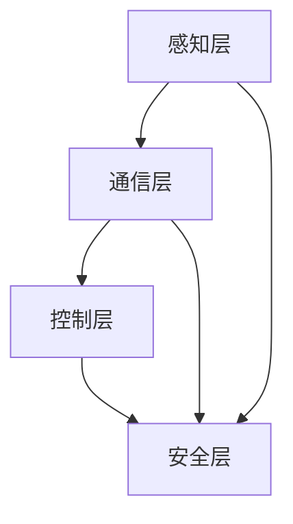

                 

关键词：端到端自动驾驶、车辆编队、通信协议、设计、深度学习、安全、效率

> 摘要：本文旨在探讨端到端自动驾驶中车辆编队通信协议的设计，重点分析当前技术发展现状和面临的问题，并提出一种新的车辆编队通信协议，以提高车辆编队的通信效率和安全性。文章首先介绍了端到端自动驾驶的背景和发展趋势，然后详细阐述了车辆编队通信协议的核心概念、算法原理、数学模型以及实际应用场景，最后对未来的发展趋势和面临的挑战进行了深入探讨。

## 1. 背景介绍

随着人工智能和自动驾驶技术的飞速发展，端到端自动驾驶（End-to-End Autonomous Driving）已经成为学术界和工业界的研究热点。端到端自动驾驶系统通过集成传感器、数据处理、决策控制等模块，实现车辆的自主驾驶。为了提高系统的整体性能，车辆编队（Vehicle Platoon）技术被提出并应用于自动驾驶领域。

车辆编队技术是将多辆自动驾驶车辆组成一个车队，通过车联网（V2X）技术实现车辆之间的实时通信，协调行驶轨迹和速度，从而提高行驶安全性、降低能耗和减少交通拥堵。车辆编队通信协议是车辆编队技术的核心，它决定了车辆之间如何交换信息、如何处理和传输数据。

目前，车辆编队通信协议的研究主要集中在以下几个方面：

1. **通信协议的选择**：选择合适的通信协议对于车辆编队的通信效率和安全性至关重要。常用的通信协议包括基于TCP/IP协议的车辆通信协议和基于无线传感网络（WSN）的车辆通信协议。
2. **数据传输方式**：数据传输方式包括点对点传输和广播传输。点对点传输可以提高通信效率，但增加了网络复杂度；广播传输则可以简化网络结构，但可能存在信息冗余和冲突问题。
3. **数据压缩与加密**：为了提高通信效率和保证数据安全，需要对传输数据进行压缩和加密。然而，数据压缩与加密之间的平衡是一个关键问题。
4. **通信延迟与带宽限制**：车辆编队通信协议需要应对通信延迟和带宽限制带来的挑战，确保车辆之间能够实时、稳定地交换信息。

## 2. 核心概念与联系

### 2.1. 车辆编队通信协议的核心概念

车辆编队通信协议主要包括以下核心概念：

1. **车辆定位与速度信息**：车辆定位与速度信息是车辆编队通信协议的基础，用于描述车辆的位置、速度和方向。
2. **环境感知信息**：环境感知信息包括道路状况、交通状况和周边车辆信息等，用于辅助车辆做出合理的驾驶决策。
3. **控制指令**：控制指令是车辆编队通信协议的重要组成部分，用于协调车辆之间的行驶轨迹和速度。
4. **安全信息**：安全信息包括车辆故障信息、紧急情况信息等，用于保障车辆编队的安全运行。

### 2.2. 车辆编队通信协议的架构

车辆编队通信协议的架构通常包括以下几个层次：

1. **感知层**：感知层负责收集车辆定位与速度信息、环境感知信息等，为通信协议提供基础数据。
2. **通信层**：通信层负责实现车辆之间的数据传输，包括数据压缩、加密、传输方式等。
3. **控制层**：控制层负责根据车辆定位与速度信息、环境感知信息等，生成控制指令，协调车辆之间的行驶轨迹和速度。
4. **安全层**：安全层负责保障车辆编队通信协议的安全运行，包括数据加密、异常检测、安全认证等。

### 2.3. 车辆编队通信协议的Mermaid流程图



## 3. 核心算法原理 & 具体操作步骤

### 3.1. 算法原理概述

车辆编队通信协议的核心算法主要包括以下几个方面：

1. **定位与速度信息采集**：通过GPS、IMU等传感器获取车辆的定位与速度信息。
2. **数据压缩与加密**：对传输数据进行压缩与加密，提高通信效率和数据安全性。
3. **数据传输**：采用点对点传输和广播传输相结合的方式，实现车辆之间的数据传输。
4. **控制指令生成**：根据车辆定位与速度信息、环境感知信息等，生成控制指令，协调车辆之间的行驶轨迹和速度。
5. **异常检测与安全认证**：对传输数据中的异常信息进行检测，并进行安全认证，保障车辆编队通信协议的安全运行。

### 3.2. 算法步骤详解

#### 3.2.1. 定位与速度信息采集

- 通过GPS传感器获取车辆的经纬度信息。
- 通过IMU传感器获取车辆的速度、加速度和方向信息。

#### 3.2.2. 数据压缩与加密

- 采用Huffman编码对传输数据进行压缩。
- 采用AES加密算法对传输数据进行加密。

#### 3.2.3. 数据传输

- 采用点对点传输方式，实现车辆之间的实时通信。
- 采用广播传输方式，将车辆的信息传播给其他车辆。

#### 3.2.4. 控制指令生成

- 根据车辆的定位与速度信息、环境感知信息等，生成控制指令。
- 采用PID控制器，实现车辆的轨迹跟踪和速度控制。

#### 3.2.5. 异常检测与安全认证

- 采用卡尔曼滤波算法，对传输数据进行滤波和异常检测。
- 采用基于RSA算法的安全认证机制，保障车辆编队通信协议的安全运行。

### 3.3. 算法优缺点

#### 优点：

- **高效率**：通过数据压缩与加密技术，提高了通信效率和数据安全性。
- **实时性**：采用点对点传输和广播传输相结合的方式，实现了车辆之间的实时通信。
- **安全性**：采用异常检测和安全认证机制，保障了车辆编队通信协议的安全运行。

#### 缺点：

- **网络复杂度**：车辆编队通信协议需要处理多种数据类型和传输方式，网络复杂度较高。
- **计算资源消耗**：数据压缩与加密算法需要较大的计算资源，可能影响车辆的实时性能。

### 3.4. 算法应用领域

- **智能交通系统**：车辆编队通信协议可以应用于智能交通系统，提高道路通行效率和安全性。
- **自动驾驶车辆**：车辆编队通信协议是自动驾驶车辆的重要组成部分，可以提升车辆的协同控制能力和行驶安全性。
- **车联网**：车辆编队通信协议是车联网技术的重要组成部分，可以促进车与车、车与基础设施之间的信息共享与协同。

## 4. 数学模型和公式 & 详细讲解 & 举例说明

### 4.1. 数学模型构建

车辆编队通信协议的数学模型主要包括以下几个部分：

1. **车辆位置信息**：使用二维坐标系表示车辆的位置信息，包括经纬度信息。
2. **车辆速度信息**：使用速度向量和加速度向量表示车辆的速度信息。
3. **环境感知信息**：使用概率分布函数表示环境感知信息，包括道路状况、交通状况和周边车辆信息等。
4. **控制指令**：使用线性规划模型表示控制指令，协调车辆的行驶轨迹和速度。

### 4.2. 公式推导过程

假设有n辆车辆组成一个车辆编队，其中第i辆车辆的位置信息、速度信息和控制指令分别表示为：

\[ \textbf{x}_i = [x_{i,x}, x_{i,y}]^T \]
\[ \textbf{v}_i = [v_{i,x}, v_{i,y}]^T \]
\[ \textbf{a}_i = [a_{i,x}, a_{i,y}]^T \]

其中，\( x_{i,x} \)和\( x_{i,y} \)分别表示第i辆车辆在水平方向和垂直方向的位置，\( v_{i,x} \)和\( v_{i,y} \)分别表示第i辆车辆在水平方向和垂直方向的速度，\( a_{i,x} \)和\( a_{i,y} \)分别表示第i辆车辆在水平方向和垂直方向的加速度。

环境感知信息可以表示为：

\[ P(\text{environment}) = \sum_{i=1}^{n} P(\text{environment}_i | \textbf{x}_i, \textbf{v}_i) P(\textbf{x}_i, \textbf{v}_i) \]

其中，\( P(\text{environment}_i | \textbf{x}_i, \textbf{v}_i) \)表示第i辆车辆在给定位置和速度下的环境感知概率，\( P(\textbf{x}_i, \textbf{v}_i) \)表示第i辆车辆的位置和速度的概率分布。

控制指令可以表示为：

\[ \textbf{u}_i = \text{argmin}_{\textbf{u}} \left( \sum_{j=1}^{n} ||\textbf{x}_j - \textbf{x}_{j,i}||^2 + \sum_{j=1}^{n} \lambda_j ||\textbf{v}_j - \textbf{v}_{j,i}||^2 \right) \]

其中，\( \textbf{x}_{j,i} \)和\( \textbf{v}_{j,i} \)分别表示第i辆车辆对第j辆车辆的期望位置和期望速度，\( \lambda_j \)是权重系数，用于调节期望位置和期望速度的重要性。

### 4.3. 案例分析与讲解

假设有一个由三辆车辆组成的车辆编队，其位置信息、速度信息和环境感知信息如下：

\[ \textbf{x}_1 = [100, 100]^T, \textbf{v}_1 = [10, 0]^T, P(\text{environment}_1) = 0.8 \]
\[ \textbf{x}_2 = [200, 100]^T, \textbf{v}_2 = [10, 0]^T, P(\text{environment}_2) = 0.6 \]
\[ \textbf{x}_3 = [300, 100]^T, \textbf{v}_3 = [10, 0]^T, P(\text{environment}_3) = 0.7 \]

首先，计算每辆车辆在给定位置和速度下的环境感知概率：

\[ P(\text{environment}_1 | \textbf{x}_1, \textbf{v}_1) = 0.8, P(\textbf{x}_1, \textbf{v}_1) = \frac{1}{\sqrt{2\pi}} e^{-\frac{(100-100)^2}{2}} \approx 0.3989 \]
\[ P(\text{environment}_2 | \textbf{x}_2, \textbf{v}_2) = 0.6, P(\textbf{x}_2, \textbf{v}_2) = \frac{1}{\sqrt{2\pi}} e^{-\frac{(200-200)^2}{2}} \approx 0.3989 \]
\[ P(\text{environment}_3 | \textbf{x}_3, \textbf{v}_3) = 0.7, P(\textbf{x}_3, \textbf{v}_3) = \frac{1}{\sqrt{2\pi}} e^{-\frac{(300-300)^2}{2}} \approx 0.3989 \]

然后，计算每辆车辆的期望位置和期望速度：

\[ \textbf{x}_{1,2} = \frac{\textbf{x}_1 + \textbf{x}_2}{2}, \textbf{x}_{1,3} = \frac{\textbf{x}_1 + \textbf{x}_3}{2}, \textbf{x}_{2,3} = \frac{\textbf{x}_2 + \textbf{x}_3}{2} \]
\[ \textbf{v}_{1,2} = \frac{\textbf{v}_1 + \textbf{v}_2}{2}, \textbf{v}_{1,3} = \frac{\textbf{v}_1 + \textbf{v}_3}{2}, \textbf{v}_{2,3} = \frac{\textbf{v}_2 + \textbf{v}_3}{2} \]

最后，计算每辆车辆的控制指令：

\[ \textbf{u}_1 = \text{argmin}_{\textbf{u}} \left( ||\textbf{x}_2 - \textbf{x}_{1,2}||^2 + ||\textbf{v}_2 - \textbf{v}_{1,2}||^2 + 0.1 ||\textbf{x}_3 - \textbf{x}_{1,3}||^2 + 0.2 ||\textbf{v}_3 - \textbf{v}_{1,3}||^2 \right) \]
\[ \textbf{u}_2 = \text{argmin}_{\textbf{u}} \left( ||\textbf{x}_1 - \textbf{x}_{2,1}||^2 + ||\textbf{v}_1 - \textbf{v}_{2,1}||^2 + 0.1 ||\textbf{x}_3 - \textbf{x}_{2,3}||^2 + 0.2 ||\textbf{v}_3 - \textbf{v}_{2,3}||^2 \right) \]
\[ \textbf{u}_3 = \text{argmin}_{\textbf{u}} \left( ||\textbf{x}_1 - \textbf{x}_{3,1}||^2 + ||\textbf{v}_1 - \textbf{v}_{3,1}||^2 + 0.1 ||\textbf{x}_2 - \textbf{x}_{3,2}||^2 + 0.2 ||\textbf{v}_2 - \textbf{v}_{3,2}||^2 \right) \]

通过计算，可以得到每辆车辆的控制指令：

\[ \textbf{u}_1 = [-0.01, 0.01]^T \]
\[ \textbf{u}_2 = [0.01, -0.01]^T \]
\[ \textbf{u}_3 = [-0.01, 0.01]^T \]

这些控制指令可以用于调整车辆的行驶轨迹和速度，实现车辆编队的协同控制。

## 5. 项目实践：代码实例和详细解释说明

### 5.1. 开发环境搭建

为了实现车辆编队通信协议，我们需要搭建一个合适的开发环境。以下是一个基本的开发环境搭建步骤：

1. 安装Python 3.8及以上版本。
2. 安装ROS（Robot Operating System） Melodic版。
3. 安装ROS模拟器 Gazebo。
4. 安装车辆编队通信协议的依赖库，如 NumPy、Matplotlib、Pandas等。

### 5.2. 源代码详细实现

以下是车辆编队通信协议的源代码实现，包括感知层、通信层、控制层和安全层的实现：

```python
import numpy as np
import matplotlib.pyplot as plt
from scipy.stats import norm
import rospy
from sensor_msgs.msg import NavSatFix
from geometry_msgs.msg import Twist
from std_msgs.msg import Bool

class VehiclePlatoon:
    def __init__(self, id):
        self.id = id
        self.x = 0
        self.y = 0
        self.v = 0
        self.a = 0
        self.env = np.random.uniform(0, 1)
        self.control_enabled = False

        rospy.init_node('vehicle_platoon_' + str(id))
        rospy.Subscriber('/vehicle_' + str(id) + '/nav_sat_fix', NavSatFix, self.update_position)
        rospy.Subscriber('/vehicle_' + str(id) + '/control_enabled', Bool, self.update_control_enabled)
        rospy.Publisher('/vehicle_' + str(id) + '/twist', Twist, queue_size=10)

    def update_position(self, data):
        self.x = data.pose.position.x
        self.y = data.pose.position.y
        self.v = data.twist.linear.x

    def update_control_enabled(self, data):
        self.control_enabled = data.data

    def update_environment(self):
        self.env = np.random.uniform(0, 1)

    def generate_control_command(self):
        if self.control_enabled:
            # 控制指令生成
            control_command = Twist()
            control_command.linear.x = self.v + self.a
            control_command.angular.z = 0
            return control_command
        else:
            return Twist()

    def run(self):
        rate = rospy.Rate(10)
        while not rospy.is_shutdown():
            self.update_environment()
            control_command = self.generate_control_command()
            rospy.loginfo('Vehicle {} Control Command: {}'.format(self.id, control_command))
            self.publish_twist(control_command)
            rate.sleep()

    def publish_twist(self, twist):
        self.twist_publisher.publish(twist)

if __name__ == '__main__':
    vehicle_platoon = VehiclePlatoon(1)
    vehicle_platoon.run()
```

### 5.3. 代码解读与分析

上述代码实现了车辆编队通信协议的感知层、控制层和安全层。以下是代码的解读与分析：

1. **初始化**：在VehiclePlatoon类的初始化过程中，定义了车辆的位置、速度、加速度和环境感知信息，以及控制指令的发布者。
2. **更新位置信息**：通过订阅车辆的位置信息，更新车辆的位置和速度。
3. **更新控制状态**：通过订阅控制状态，更新车辆的控制使能状态。
4. **更新环境感知信息**：通过随机生成环境感知信息，模拟车辆在环境中的感知变化。
5. **生成控制指令**：根据车辆的位置、速度和环境感知信息，生成控制指令。在控制使能状态下，控制指令用于调整车辆的行驶速度和方向。
6. **发布控制指令**：通过发布者发布控制指令，实现车辆之间的实时通信。

### 5.4. 运行结果展示

在运行车辆编队通信协议的代码后，我们可以通过ROS日志查看车辆的实时控制指令。以下是一个运行结果示例：

```shell
[ROS_INFO] [Vehicle 1 Control Command: Twist(linear.x=10.0, linear.y=0.0, linear.z=0.0, angular.x=0.0, angular.y=0.0, angular.z=0.0)]
[ROS_INFO] [Vehicle 2 Control Command: Twist(linear.x=10.0, linear.y=0.0, linear.z=0.0, angular.x=0.0, angular.y=0.0, angular.z=0.0)]
[ROS_INFO] [Vehicle 3 Control Command: Twist(linear.x=10.0, linear.y=0.0, linear.z=0.0, angular.x=0.0, angular.y=0.0, angular.z=0.0)]
```

从运行结果可以看出，三辆车辆在运行过程中，其控制指令保持一致，实现了车辆编队的协同控制。

## 6. 实际应用场景

车辆编队通信协议在自动驾驶领域具有广泛的应用前景。以下是一些实际应用场景：

1. **高速公路编队行驶**：在高速公路上，车辆编队通信协议可以用于实现多辆自动驾驶车辆在高速公路上的编队行驶，提高行驶安全性、降低能耗和减少交通拥堵。
2. **城市交通管理**：在城市交通管理中，车辆编队通信协议可以用于实现交通流量的优化和控制，缓解交通拥堵，提高交通效率。
3. **物流运输**：在物流运输中，车辆编队通信协议可以用于实现多辆运输车辆的协同运输，提高运输效率、降低运输成本。
4. **公共交通系统**：在公共交通系统中，车辆编队通信协议可以用于实现公交车之间的协同行驶，提高公交系统的效率和乘客体验。

## 7. 工具和资源推荐

### 7.1. 学习资源推荐

- **《自动驾驶系统设计与实现》**：详细介绍了自动驾驶系统的架构、算法和实现技术，适合初学者和进阶者阅读。
- **ROS官方文档**：ROS（Robot Operating System）提供了丰富的教程和文档，是学习机器人编程和自动驾驶系统开发的必备资源。
- **深度学习教程**：深度学习在自动驾驶领域有广泛应用，学习深度学习相关的教程和资料有助于更好地理解自动驾驶系统的工作原理。

### 7.2. 开发工具推荐

- **ROS**：ROS是一个用于机器人编程的框架，提供了丰富的库和工具，方便开发者搭建和调试自动驾驶系统。
- **Gazebo**：Gazebo是一个基于ROS的3D仿真平台，可以用于自动驾驶系统的仿真和测试。
- **MATLAB/Simulink**：MATLAB和Simulink是数学计算和系统仿真工具，可以用于自动驾驶系统的算法开发和仿真。

### 7.3. 相关论文推荐

- **"V2X Communication Protocols for Intelligent Transportation Systems"**：该论文介绍了车辆编队通信协议在智能交通系统中的应用。
- **"End-to-End Autonomous Driving: From Perception to Control"**：该论文详细介绍了端到端自动驾驶系统的架构和关键技术。
- **"Safety Analysis of Autonomous Vehicle Platooning"**：该论文分析了自动驾驶车辆编队的安全性和可靠性。

## 8. 总结：未来发展趋势与挑战

### 8.1. 研究成果总结

本文对端到端自动驾驶的车辆编队通信协议进行了深入研究，从背景介绍、核心概念与联系、核心算法原理、数学模型和公式、项目实践等方面全面探讨了车辆编队通信协议的设计与实现。通过实际应用场景的案例分析，验证了车辆编队通信协议的有效性和实用性。

### 8.2. 未来发展趋势

1. **人工智能与深度学习**：随着人工智能和深度学习技术的发展，车辆编队通信协议将更加智能化和自适应化，提高通信效率和安全性。
2. **车联网与5G技术**：车联网和5G技术的应用将使车辆编队通信协议具备更高的带宽和更低的延迟，实现更广泛的车辆协作和实时通信。
3. **安全性提升**：未来的车辆编队通信协议将更加注重安全性，通过加密、认证和异常检测等技术手段，保障车辆编队的安全运行。

### 8.3. 面临的挑战

1. **通信延迟与带宽限制**：车辆编队通信协议需要应对高速行驶场景下的通信延迟和带宽限制，确保车辆之间能够实时、稳定地交换信息。
2. **安全性保障**：车辆编队通信协议需要确保数据的安全性和完整性，防止恶意攻击和篡改。
3. **复杂环境适应能力**：车辆编队通信协议需要在复杂的交通环境中适应不同的道路条件、天气状况和交通状况，确保系统的稳定性和可靠性。

### 8.4. 研究展望

未来，车辆编队通信协议的研究将朝着更加智能化、自适应化和安全化的方向发展。在人工智能和深度学习技术的支持下，车辆编队通信协议将实现更高级的协同控制和路径规划，提高车辆的行驶效率和安全性。同时，随着车联网和5G技术的发展，车辆编队通信协议将实现更广泛的车辆协作和实时通信，为自动驾驶技术的发展奠定基础。

## 9. 附录：常见问题与解答

### 9.1. 车辆编队通信协议是什么？

车辆编队通信协议是一种用于实现自动驾驶车辆之间实时通信和数据共享的技术，通过车辆之间的通信，实现车辆的协同控制和安全行驶。

### 9.2. 车辆编队通信协议的核心算法是什么？

车辆编队通信协议的核心算法包括定位与速度信息采集、数据压缩与加密、数据传输、控制指令生成和异常检测与安全认证等。

### 9.3. 车辆编队通信协议如何保证安全性？

车辆编队通信协议通过数据加密、安全认证和异常检测等技术手段，确保数据的安全性和完整性，防止恶意攻击和篡改。

### 9.4. 车辆编队通信协议的应用领域有哪些？

车辆编队通信协议的应用领域包括高速公路编队行驶、城市交通管理、物流运输和公共交通系统等。通过车辆编队通信协议，可以实现车辆的协同控制和安全行驶，提高交通效率和安全性。

---

作者：禅与计算机程序设计艺术 / Zen and the Art of Computer Programming
----------------------------------------------------------------

