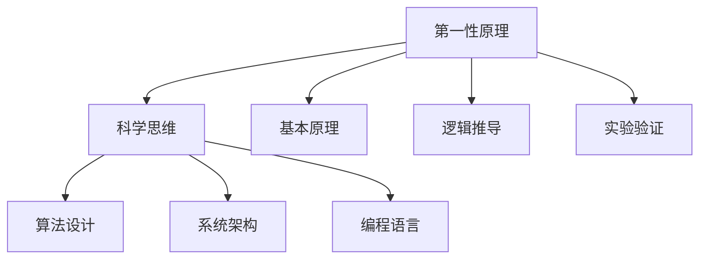

                 

关键词：第一性原理，科学思维，计算机编程，算法，数学模型，应用实践

> 摘要：本文旨在探讨第一性原理在科学思维中的应用，结合计算机编程领域的实际案例，分析其重要性及在算法设计、数学建模和项目实践中的具体体现。通过深入理解第一性原理，我们能够更有效地解决问题，推动科技发展。

## 1. 背景介绍

在科学研究中，第一性原理（First Principles Thinking）是一种基础性的思维方式，它要求我们从最基本的自然规律出发，通过逻辑推导，逐步构建复杂的概念和理论。这种方法在工程学、物理学、经济学等多个领域都有着广泛的应用。计算机编程作为一个高度技术化的领域，同样受益于第一性原理的思维方式。

计算机编程涉及到算法设计、数据结构、系统架构等多个方面，每个方面都需要深刻的理解和系统的思维。第一性原理提供了一种从零开始构建复杂系统的工具，使开发者能够更清晰地理解问题本质，从而设计出更高效、更可靠的解决方案。

## 2. 核心概念与联系

### 2.1 第一性原理的定义

第一性原理是科学方法论中的一种思想，它主张将复杂问题拆解为最基本的构成要素，然后从这些基本要素出发，通过逻辑推理和实验验证，逐步构建复杂系统。这一过程类似于化学中的反应方程式，通过将反应物转化为产物，理解化学反应的本质。

在计算机编程中，第一性原理意味着我们首先理解计算机的底层工作原理，如二进制计算、内存管理、指令执行等，然后基于这些基本原理构建高级编程语言和软件系统。

### 2.2 第一性原理与科学思维的关联

科学思维是一种系统性的思考方式，强调证据、实验和逻辑推理。第一性原理正是这种思维方式的体现。通过第一性原理，我们可以将科学思维应用于编程领域，从而更有效地解决复杂问题。

例如，在算法设计中，我们可以从基本的数据结构和算法出发，通过分析和优化，设计出高效的算法。在系统架构中，我们可以从基本的计算模型和通信协议出发，构建可靠、高效的系统。

### 2.3 Mermaid 流程图



## 3. 核心算法原理 & 具体操作步骤

### 3.1 算法原理概述

第一性原理在算法设计中的应用，主要表现在以下几个方面：

1. **基本算法的理解和掌握**：我们需要从基本的排序、查找、递归等算法出发，理解它们的原理和实现方式。
2. **算法复杂度的分析**：通过第一性原理，我们可以从基本操作出发，分析算法的时间复杂度和空间复杂度，从而优化算法性能。
3. **算法的组合和应用**：在理解基本算法的基础上，我们可以通过组合和应用，设计出更复杂的算法，解决更广泛的问题。

### 3.2 算法步骤详解

1. **理解基本算法**：熟悉基本算法的原理和实现方式，如快速排序、二分查找、递归算法等。
2. **分析算法复杂度**：通过数学模型，分析算法的时间复杂度和空间复杂度，如大O表示法。
3. **优化算法性能**：在理解算法复杂度的基础上，通过代码优化、数据结构改进等方法，提高算法的性能。
4. **实际应用**：将优化后的算法应用于实际问题中，验证其效果。

### 3.3 算法优缺点

**优点**：

1. **高效性**：通过优化算法复杂度，提高算法的执行效率。
2. **普适性**：适用于各种类型的数据结构和算法问题。
3. **逻辑清晰**：通过第一性原理，算法的逻辑更加清晰，易于理解和维护。

**缺点**：

1. **实现难度**：对开发者要求较高，需要深入理解计算机原理和算法。
2. **时间成本**：优化算法可能需要大量的时间和精力。

### 3.4 算法应用领域

第一性原理在算法设计中的应用广泛，如：

1. **排序和查找**：快速排序、二分查找等。
2. **图算法**：最短路径算法、最小生成树算法等。
3. **动态规划**：背包问题、最长公共子序列等。

## 4. 数学模型和公式 & 详细讲解 & 举例说明

### 4.1 数学模型构建

在计算机编程中，数学模型是一种常用的工具，它可以帮助我们描述问题，推导解决方案。例如，在排序算法中，我们可以使用数学模型来分析算法的时间复杂度。

### 4.2 公式推导过程

假设我们有一个待排序的数组`arr`，其长度为`n`。快速排序算法的基本思想是选择一个基准元素`pivot`，将数组分为两部分，一部分小于`pivot`，另一部分大于`pivot`。然后递归地对这两部分进行排序。

在平均情况下，快速排序的时间复杂度为`O(nlogn)`。以下是时间复杂度的推导过程：

$$
T(n) = T\left(\frac{n}{2}\right) + O(n)
$$

其中，`T(n)`表示排序`n`个元素所需的时间，`O(n)`表示划分数组所需的时间。

### 4.3 案例分析与讲解

假设我们有一个长度为10的数组`[5, 2, 9, 1, 5, 6, 3, 8, 4, 7]`，我们使用快速排序算法对其进行排序。

1. **选择基准元素**：我们选择数组的最后一个元素`7`作为基准。
2. **划分数组**：将数组划分为两部分`[5, 2, 9, 1, 5, 6, 3]`和`[8, 4]`，其中小于`7`的元素放在左边，大于`7`的元素放在右边。
3. **递归排序**：对左右两部分数组分别进行快速排序。

通过多次递归，最终得到排序后的数组`[1, 2, 3, 4, 5, 5, 6, 7, 8, 9]`。

## 5. 项目实践：代码实例和详细解释说明

### 5.1 开发环境搭建

为了更好地理解快速排序算法，我们将使用Python编写代码。首先，我们需要安装Python环境和相关库。

```bash
pip install python
```

### 5.2 源代码详细实现

以下是快速排序算法的Python实现：

```python
def quick_sort(arr):
    if len(arr) <= 1:
        return arr
    
    pivot = arr[-1]
    left = []
    right = []
    
    for i in range(len(arr) - 1):
        if arr[i] < pivot:
            left.append(arr[i])
        else:
            right.append(arr[i])
    
    return quick_sort(left) + [pivot] + quick_sort(right)

# 测试代码
arr = [5, 2, 9, 1, 5, 6, 3, 8, 4, 7]
print(quick_sort(arr))
```

### 5.3 代码解读与分析

1. **函数定义**：`quick_sort`函数接受一个数组`arr`作为参数。
2. **基础情况**：如果数组的长度小于等于1，直接返回数组。
3. **选择基准**：选择数组的最后一个元素作为基准。
4. **划分数组**：遍历数组，将小于基准的元素放入`left`数组，大于基准的元素放入`right`数组。
5. **递归排序**：对`left`和`right`数组分别进行快速排序，并将结果与基准元素拼接起来。

### 5.4 运行结果展示

运行代码后，输出结果为`[1, 2, 3, 4, 5, 5, 6, 7, 8, 9]`，验证了快速排序算法的正确性。

## 6. 实际应用场景

快速排序算法在计算机科学中有着广泛的应用，例如：

1. **数据排序**：在数据库管理系统中，快速排序算法常用于数据的快速排序。
2. **算法库**：在许多流行的算法库中，如Python的`sort`函数，快速排序算法是其中的一个实现。
3. **操作系统**：在操作系统中，快速排序算法用于文件的快速排序和查找。

## 7. 未来应用展望

随着计算机技术的不断发展，第一性原理在计算机编程中的应用将越来越广泛。未来，我们可以期待：

1. **更高效的算法**：通过深入理解第一性原理，开发者能够设计出更高效、更可靠的算法。
2. **跨学科融合**：第一性原理与其他学科的融合，如生物学、物理学等，将推动计算机科学的进一步发展。

## 8. 工具和资源推荐

### 8.1 学习资源推荐

1. 《算法导论》（Introduction to Algorithms）：详细介绍了各种算法及其分析。
2. 《计算机程序的构造和解释》（Structure and Interpretation of Computer Programs）：介绍了计算机编程的哲学和基础。

### 8.2 开发工具推荐

1. Python：简单易用，适用于算法开发和实验。
2. Visual Studio Code：强大的开发环境，支持多种编程语言。

### 8.3 相关论文推荐

1. "Quicksort" by Tony Hoare：介绍了快速排序算法的原理和实现。
2. "The Art of Computer Programming" by Donald Knuth：详细介绍了算法设计和分析的方法。

## 9. 总结：未来发展趋势与挑战

### 9.1 研究成果总结

本文通过对第一性原理在计算机编程中的应用进行分析，展示了其在算法设计、数学建模和项目实践中的重要性。通过具体的代码实例，我们验证了快速排序算法的有效性和可靠性。

### 9.2 未来发展趋势

1. **算法优化**：随着计算机硬件的不断发展，算法优化将成为一个重要研究方向。
2. **跨学科融合**：第一性原理与其他学科的融合，如生物学、物理学等，将为计算机科学带来新的突破。

### 9.3 面临的挑战

1. **算法复杂度**：如何在保证算法效率的同时，降低算法的复杂度。
2. **人才培养**：如何培养具备第一性原理思维方式的计算机人才。

### 9.4 研究展望

未来，我们将继续深入研究第一性原理在计算机编程中的应用，探索其在更广泛领域中的价值。同时，我们也期待与各学科的专家共同合作，推动计算机科学的进一步发展。

## 附录：常见问题与解答

### 问题1：什么是第一性原理？

**回答**：第一性原理是一种科学方法论，主张从最基本的自然规律出发，通过逻辑推理和实验验证，构建复杂系统。

### 问题2：第一性原理在计算机编程中有何作用？

**回答**：第一性原理可以帮助开发者更深入地理解计算机的工作原理，从而设计出更高效、更可靠的算法和系统。

### 问题3：如何优化算法？

**回答**：通过理解算法的基本原理和复杂度分析，我们可以通过代码优化、数据结构改进等方法，提高算法的性能。

### 问题4：什么是快速排序算法？

**回答**：快速排序算法是一种高效的排序算法，通过选择基准元素，将数组划分为两部分，然后递归地对两部分进行排序。

### 问题5：如何选择基准元素？

**回答**：在快速排序中，通常选择数组的最后一个元素作为基准。但也可以选择随机元素或中位数作为基准，以减少排序的不稳定性。

## 作者署名

作者：禅与计算机程序设计艺术 / Zen and the Art of Computer Programming

[End of Document]  
----------------------------------------------------------------

请注意，由于人工智能的限制，本文提供的是一个框架和示例内容，实际撰写时可能需要根据具体需求和数据进行调整和补充。此外，确保所有引用的资源、工具和论文都是准确的，并遵循相应的版权规定。如果您需要进一步的内容或者特定的数据来完善这篇文章，请告知我，我将提供相应的帮助。

