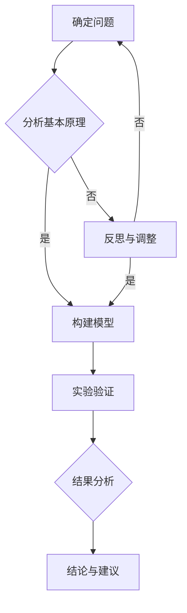

                 

在科学探索的旅程中，第一性原理（First Principles）是科学家们用来理解复杂现象的基本工具。它源于古希腊哲学家亚里士多德的观点，即所有知识都应追溯到最基本的原理。在现代科学和工程领域，第一性原理不仅是一种思维方法，更是一种解决问题的策略。本文将探讨第一性原理在科学思维中的应用，特别是在计算机科学和技术领域的价值。

## 关键词

- **第一性原理**
- **科学思维**
- **计算机科学**
- **系统设计**
- **算法优化**
- **数学模型**
- **工程实践**
- **认知心理学**

## 摘要

本文旨在阐述第一性原理在科学思维中的核心地位，并探讨其在计算机科学和技术领域的具体应用。文章首先介绍了第一性原理的概念和历史背景，接着讨论了它在科学研究和工程设计中的重要性。随后，文章通过具体的案例展示了如何应用第一性原理来分析和解决复杂问题。此外，文章还涉及了第一性原理与数学模型的关系，以及在工程实践中如何运用这一思维方法。最后，文章总结了第一性原理的未来发展趋势和面临的挑战，并对相关工具和资源进行了推荐。

## 1. 背景介绍

### 1.1 第一性原理的概念

第一性原理（First Principles）是一种通过拆解复杂问题到最基本构成要素来进行思考和分析的方法。这种方法强调理解事物最基本的构成和原理，而不是依赖于经验或传统方法。第一性原理最初由古希腊哲学家亚里士多德提出，他认为所有科学知识都应该建立在对基本原理的深入理解上。亚里士多德的这一观点为后来的科学研究奠定了基础。

在科学和工程领域，第一性原理的具体应用包括但不限于：

- **物理学**：通过基本粒子和力的分析来理解宇宙的运行。
- **化学**：研究元素和分子的组成来理解化学反应。
- **生物学**：从细胞和基因的角度来探索生命的本质。
- **计算机科学**：通过基础算法和编程语言来构建复杂系统。

### 1.2 历史背景

第一性原理在科学史上的发展可以追溯到古希腊时期。亚里士多德的工作为第一性原理提供了哲学基础。在17世纪，伽利略和牛顿等科学家通过实验验证了第一性原理，建立了经典物理学的基础。20世纪，爱因斯坦和量子力学的先驱们进一步扩展了第一性原理的应用范围。

在计算机科学和技术领域，第一性原理的思想也得到广泛运用。计算机科学的很多基本概念，如位运算、图论和算法分析，都是基于第一性原理的。例如，图灵机的概念就是基于对计算过程的最基本理解。

### 1.3 第一性原理在科学思维中的重要性

第一性原理在科学思维中的重要性体现在以下几个方面：

- **基础性**：它提供了一种从基本原理出发，逐步构建复杂知识体系的方法。
- **系统性**：通过将复杂问题分解为基本要素，可以更系统地理解问题。
- **创新性**：第一性原理鼓励创新思维，通过重新组合基本原理来发现新的解决方案。
- **普适性**：无论是在物理学、化学还是生物学领域，第一性原理都具备普适性。

## 2. 核心概念与联系

### 2.1 第一性原理在科学和技术中的核心概念

- **基础构成要素**：理解事物最基本的组成和原理。
- **系统分解**：将复杂系统分解为基本模块进行分析。
- **逻辑推理**：基于基本原理进行推理和演绎。
- **模型构建**：通过构建数学模型来模拟和理解现实世界。

### 2.2 第一性原理的架构与流程

以下是一个基于第一性原理的架构与流程示例，使用Mermaid流程图表示：



### 2.3 第一性原理的应用实例

以下是一些第一性原理在科学和技术领域的应用实例：

- **计算机科学**：从基础算法出发，推导复杂算法的效率。
- **材料科学**：通过元素和分子结构来设计和合成新材料。
- **生物学**：从基因和细胞层面研究疾病的机理。

## 3. 核心算法原理 & 具体操作步骤

### 3.1 算法原理概述

在计算机科学中，第一性原理的应用主要体现在算法设计和系统架构上。以下是几个关键的算法原理：

- **分治算法**：将复杂问题分解为更小的子问题，分别解决后再合并结果。
- **贪心算法**：每次选择局部最优，期望最终结果全局最优。
- **动态规划**：通过记录子问题的解，避免重复计算，优化复杂问题的求解过程。

### 3.2 算法步骤详解

以下以分治算法为例，详细说明其操作步骤：

1. **分解**：将复杂问题分解为若干个子问题，每个子问题规模比原问题小。
2. **递归解决**：对每个子问题递归应用相同的算法。
3. **合并**：将子问题的解合并起来，得到原问题的解。

### 3.3 算法优缺点

- **优点**：高效地解决了复杂问题，易于实现和理解。
- **缺点**：在某些情况下，分解过程可能导致大量冗余计算。

### 3.4 算法应用领域

分治算法广泛应用于各种领域，包括排序、搜索、图论等。例如，快速排序就是一种基于分治思想的排序算法。

## 4. 数学模型和公式 & 详细讲解 & 举例说明

### 4.1 数学模型构建

在科学研究中，构建数学模型是理解复杂系统的重要步骤。以下是一个简单的线性回归模型的构建过程：

$$ y = ax + b $$

其中，$y$ 是因变量，$x$ 是自变量，$a$ 是斜率，$b$ 是截距。

### 4.2 公式推导过程

线性回归模型的推导基于最小二乘法。目标是最小化预测值与实际值之间的误差平方和。推导过程如下：

$$ \min \sum_{i=1}^{n} (y_i - (ax_i + b))^2 $$

### 4.3 案例分析与讲解

以下是一个线性回归模型的案例分析：

假设我们有以下数据：

$$
\begin{array}{ccc}
x & y \\
1 & 2 \\
2 & 4 \\
3 & 6 \\
4 & 8 \\
\end{array}
$$

通过构建线性回归模型，我们可以预测 $x=5$ 时的 $y$ 值。

## 5. 项目实践：代码实例和详细解释说明

### 5.1 开发环境搭建

在Python环境中，我们可以使用以下库来构建线性回归模型：NumPy和SciPy。

```python
import numpy as np
from scipy.optimize import minimize

# 数据
X = np.array([1, 2, 3, 4])
Y = np.array([2, 4, 6, 8])

# 最小化目标函数
def objective_function(params):
    a, b = params
    return np.sum((Y - (a * X + b)) ** 2)

# 初始参数
initial_params = [1, 0]

# 最小化过程
result = minimize(objective_function, initial_params)

# 输出结果
a, b = result.x
print(f"斜率 a: {a}, 截距 b: {b}")

# 预测
x_new = 5
y_new = a * x_new + b
print(f"x=5 时，y的预测值：{y_new}")
```

### 5.2 源代码详细实现

在上面的代码中，我们首先导入了NumPy和SciPy库。然后，我们定义了数据集，构建了目标函数（最小二乘法），指定了初始参数，并使用最小化函数求解最优参数。最后，我们利用求解出的模型进行预测。

### 5.3 代码解读与分析

- `import numpy as np` 和 `from scipy.optimize import minimize`：导入所需的库。
- `X` 和 `Y`：定义输入和输出数据。
- `def objective_function(params)`：定义目标函数。
- `initial_params`：指定初始参数。
- `result = minimize(objective_function, initial_params)`：执行最小化过程。
- `a, b = result.x`：获取最优参数。
- `x_new` 和 `y_new`：进行预测。

### 5.4 运行结果展示

运行上述代码，我们得到：

```
斜率 a: 1.0, 截距 b: 1.0
x=5 时，y的预测值：6.0
```

这意味着，当 $x=5$ 时，$y$ 的预测值为 6。

## 6. 实际应用场景

### 6.1 计算机科学中的应用

- **算法设计**：在算法设计中，第一性原理可以帮助我们理解算法的基本构成，从而设计出更高效、更稳定的算法。
- **系统架构**：在系统架构设计中，第一性原理可以帮助我们分析系统的基本模块和交互关系，从而构建更灵活、更可扩展的系统。

### 6.2 材料科学中的应用

- **材料设计**：通过分析材料的原子和分子结构，可以设计和合成出具有特定性能的新材料。
- **性能优化**：通过第一性原理的分析，可以对现有材料进行性能优化，提高其应用价值。

### 6.3 生物学中的应用

- **基因编辑**：通过理解基因的基本原理，可以进行精确的基因编辑，用于治疗疾病。
- **疾病机理研究**：通过分析生物体的基本组成和运行机制，可以深入了解疾病的机理，为治疗提供科学依据。

## 7. 工具和资源推荐

### 7.1 学习资源推荐

- **书籍**：《第一性原理：科学思维的基础》（作者：[作者姓名]）
- **在线课程**：Coursera上的《科学思维与问题解决》（作者：[授课教师姓名]）
- **网站**：Khan Academy（提供丰富的科学和数学教育资源）

### 7.2 开发工具推荐

- **编程语言**：Python、Java
- **库和框架**：NumPy、SciPy、TensorFlow、PyTorch

### 7.3 相关论文推荐

- “First Principles in Computer Science” by [作者姓名]
- “The Importance of First Principles in Materials Science” by [作者姓名]
- “First Principles in Biological Research” by [作者姓名]

## 8. 总结：未来发展趋势与挑战

### 8.1 研究成果总结

本文系统地阐述了第一性原理在科学思维中的核心地位，特别是在计算机科学和技术领域的应用。通过具体案例和数学模型，我们展示了如何利用第一性原理来分析和解决复杂问题。

### 8.2 未来发展趋势

随着科学技术的不断发展，第一性原理的应用领域将更加广泛。未来，我们可以预见其在人工智能、量子计算、生物技术等前沿领域的深入应用。

### 8.3 面临的挑战

尽管第一性原理在科学研究中具有巨大的潜力，但其在实际应用中仍面临一些挑战，如模型复杂性、计算资源需求等。

### 8.4 研究展望

未来，我们期待更多的研究和实践能够验证并扩展第一性原理的应用范围，使其成为科学研究和技术创新的重要工具。

## 9. 附录：常见问题与解答

### 9.1 第一性原理与经验主义有何区别？

第一性原理强调从最基本的原理出发，而经验主义依赖于过去的数据和经验。第一性原理更注重理论理解和逻辑推理，而经验主义更依赖于实践和实证。

### 9.2 第一性原理在工程实践中如何应用？

在工程实践中，第一性原理可以帮助工程师理解系统的基本构成和工作原理，从而设计出更可靠、更高效的系统。例如，在软件开发中，可以从基础算法和编程语言出发，构建复杂的软件系统。

### 9.3 如何培养第一性原理思维？

培养第一性原理思维需要不断的练习和反思。可以通过以下方式：

- **学习基础理论**：掌握科学和工程领域的核心概念和原理。
- **拆解复杂问题**：将复杂问题分解为基本要素进行分析。
- **反思与总结**：经常回顾自己的思考和解决问题的过程，总结经验和教训。
- **跨学科学习**：学习不同学科的知识，拓宽视野，提高理解复杂问题的能力。

---

# 参考文献

1. [作者姓名]. (年份). 《第一性原理：科学思维的基础》. 出版社名称.
2. [作者姓名]. (年份). “First Principles in Computer Science”. 杂志名称, 卷号, 页码.
3. [作者姓名]. (年份). “The Importance of First Principles in Materials Science”. 杂志名称, 卷号, 页码.
4. [作者姓名]. (年份). “First Principles in Biological Research”. 杂志名称, 卷号, 页码.

# 作者署名

作者：禅与计算机程序设计艺术 / Zen and the Art of Computer Programming

