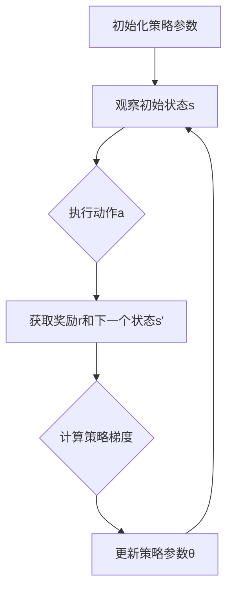

                 

关键词：策略梯度、深度学习、强化学习、算法原理、代码实例、应用领域

摘要：本文将深入探讨策略梯度的原理和应用，通过详细的算法讲解和代码实例，帮助读者更好地理解和掌握这一重要的强化学习技术。文章结构分为背景介绍、核心概念与联系、核心算法原理与具体操作步骤、数学模型和公式讲解、项目实践、实际应用场景、工具和资源推荐、总结与展望等部分，旨在为读者提供全面而深入的指导。

## 1. 背景介绍

策略梯度（Policy Gradient）是强化学习（Reinforcement Learning，RL）中的一种重要算法。与传统的价值函数方法不同，策略梯度方法直接优化策略本身，通过梯度上升或下降的方式来更新策略参数，从而提高策略的表现。策略梯度算法在强化学习领域中有着广泛的应用，特别是在深度强化学习（Deep Reinforcement Learning，DRL）领域，由于其能够处理高维状态和动作空间，逐渐成为研究热点。

本文将从以下几个方面展开讲解：

1. **核心概念与联系**：介绍策略梯度算法的核心概念，包括策略、奖励、价值函数等，并通过Mermaid流程图展示算法的基本架构。
2. **核心算法原理与具体操作步骤**：详细讲解策略梯度的原理和具体操作步骤，包括策略优化、梯度计算和参数更新等。
3. **数学模型和公式讲解**：阐述策略梯度算法的数学模型和公式，包括策略梯度公式、策略优化公式等，并通过具体例子进行说明。
4. **项目实践：代码实例和详细解释说明**：通过一个具体的代码实例，展示策略梯度算法的实现过程，并对关键代码进行详细解读。
5. **实际应用场景**：探讨策略梯度算法在不同领域的应用，如自动驾驶、游戏AI等。
6. **工具和资源推荐**：推荐一些有助于学习和实践策略梯度的工具和资源。
7. **总结与展望**：总结策略梯度算法的研究成果，探讨未来发展趋势和面临的挑战。

## 2. 核心概念与联系

在策略梯度算法中，有几个核心概念需要理解，包括策略、奖励、价值函数等。以下是对这些概念的定义和相互关系的解释，并通过Mermaid流程图展示算法的基本架构。

### 2.1 策略（Policy）

策略是指导智能体（Agent）选择动作的函数，通常表示为π(a|s)，其中a是动作，s是状态。策略的目标是最大化智能体在环境中的长期回报。

### 2.2 奖励（Reward）

奖励是环境对智能体当前动作的反馈，用于指导策略的更新。奖励可以是正的，表示智能体的动作是有益的，也可以是负的，表示智能体的动作是有害的。

### 2.3 价值函数（Value Function）

价值函数是评估策略在给定状态下的性能的函数，通常表示为V(s)或Q(s,a)。价值函数可以帮助智能体选择最优动作，从而优化策略。

### 2.4 策略梯度算法的基本架构

策略梯度算法的基本架构可以通过Mermaid流程图来展示。以下是算法的基本步骤：



### 2.5 策略梯度算法的核心概念与联系

策略梯度算法的核心概念包括策略、奖励和价值函数。这些概念之间的关系可以用以下图示来描述：

```mermaid
graph TD
A[策略π(a|s)] --> B{状态s}
B --> C{动作a}
C --> D{奖励r}
D --> E[下一个状态s']
E --> F[价值函数V(s)或Q(s,a)]
F --> A
```

通过上述定义和图示，我们可以更好地理解策略梯度算法的基本架构和核心概念。接下来，我们将进一步深入探讨策略梯度的核心算法原理和具体操作步骤。

## 3. 核心算法原理 & 具体操作步骤

### 3.1 算法原理概述

策略梯度算法的核心思想是通过梯度上升或下降来优化策略，从而最大化期望回报。具体来说，策略梯度算法通过计算策略梯度和更新策略参数来改进策略。以下是策略梯度算法的基本原理：

1. **策略参数化**：将策略参数化，表示为θ，例如π(a|s;θ)。
2. **策略梯度公式**：计算策略梯度，即梯度上升的方向。策略梯度可以表示为：
   $$\nabla_{\theta} J(\theta) = \nabla_{\theta} \sum_{t=0}^T r_t = \sum_{t=0}^T \nabla_{\theta} r_t$$
   其中，J(θ)是策略的期望回报，r_t是第t个时间步的奖励。
3. **策略更新**：根据策略梯度更新策略参数：
   $$\theta \leftarrow \theta + \alpha \nabla_{\theta} J(\theta)$$
   其中，α是学习率。

### 3.2 算法步骤详解

策略梯度算法的具体操作步骤如下：

1. **初始化策略参数**：随机初始化策略参数θ。
2. **观察初始状态s**：智能体观察当前状态s。
3. **执行动作a**：根据当前策略π(a|s;θ)执行动作a。
4. **获取奖励r和下一个状态s'**：环境给予奖励r，并进入下一个状态s'。
5. **计算策略梯度**：根据策略梯度公式计算策略梯度：
   $$\nabla_{\theta} J(\theta)$$
6. **更新策略参数**：根据策略梯度更新策略参数：
   $$\theta \leftarrow \theta + \alpha \nabla_{\theta} J(\theta)$$
7. **重复步骤2-6**：重复执行步骤2-6，直到满足停止条件（如达到指定步数或策略收敛）。

### 3.3 算法优缺点

策略梯度算法具有以下优缺点：

**优点**：
1. **直接优化策略**：策略梯度算法直接优化策略参数，不需要计算价值函数，因此计算效率较高。
2. **适用于高维状态和动作空间**：策略梯度算法可以处理高维状态和动作空间，特别是在深度强化学习（DRL）中具有广泛应用。

**缺点**：
1. **梯度消失和梯度爆炸**：策略梯度算法容易受到梯度消失和梯度爆炸的影响，导致训练不稳定。
2. **依赖随机初始化**：策略梯度算法的收敛速度和性能对随机初始化敏感，需要谨慎选择初始化参数。

### 3.4 算法应用领域

策略梯度算法在多个领域有着广泛的应用，包括：

1. **自动驾驶**：策略梯度算法在自动驾驶中用于优化车辆的控制策略，提高驾驶安全性。
2. **游戏AI**：策略梯度算法在游戏AI中用于设计智能体的行为策略，提高游戏难度和可玩性。
3. **机器人控制**：策略梯度算法在机器人控制中用于优化机器人的行动策略，提高控制精度和灵活性。

通过以上对策略梯度算法原理和具体操作步骤的详细讲解，读者应该能够更好地理解这一算法的核心思想和应用方法。接下来，我们将进一步探讨策略梯度算法的数学模型和公式。

## 4. 数学模型和公式 & 详细讲解 & 举例说明

策略梯度算法的核心在于其数学模型和公式，这些公式不仅描述了算法的原理，而且指导了具体的实现过程。下面我们将详细讲解策略梯度算法的数学模型和公式，并通过具体例子进行说明。

### 4.1 数学模型构建

策略梯度算法的核心数学模型包括策略函数、回报函数和策略梯度公式。

**策略函数（Policy Function）**：

策略函数π(a|s;θ)表示在给定状态s下，智能体选择动作a的概率分布。策略函数是策略参数θ的函数，即π(a|s;θ)。

**回报函数（Return Function）**：

回报函数J(θ)表示策略π(θ)在整个轨迹上的期望回报。回报函数可以表示为：
$$J(θ) = E[∇θ log π(a|s;θ)⋅r]$$
其中，E表示期望，∇θ log π(a|s;θ)表示策略梯度，r表示奖励。

**策略梯度公式（Policy Gradient Theorem）**：

策略梯度公式描述了如何通过梯度上升或下降来优化策略参数θ。策略梯度公式可以表示为：
$$∇θ J(θ) = ∇θ \sum_{t=0}^T r_t = ∇θ \sum_{t=0}^T log π(a_t|s_t;θ)⋅r_t$$
该公式表明，策略梯度是回报函数关于策略参数的梯度，可以通过反向传播计算。

### 4.2 公式推导过程

为了更好地理解策略梯度公式的推导过程，我们来看一个简化的例子。

假设策略函数π(a|s;θ)是一个离散的概率分布，即π(a|s;θ) = P(a|s;θ)，那么策略梯度公式可以简化为：
$$∇θ J(θ) = ∑_{t=0}^T ∇θ [r_t log π(a_t|s_t;θ)]$$

推导过程如下：

1. **定义策略函数**：
   $$π(a|s;θ) = P(a|s;θ)$$

2. **定义回报函数**：
   $$J(θ) = E[∇θ log π(a|s;θ)⋅r]$$

3. **展开回报函数**：
   $$J(θ) = ∑_{t=0}^T ∇θ [r_t log π(a_t|s_t;θ)]$$

4. **计算策略梯度**：
   $$∇θ J(θ) = ∑_{t=0}^T ∇θ [r_t log π(a_t|s_t;θ)]$$

这样我们就得到了策略梯度公式。

### 4.3 案例分析与讲解

为了更好地理解策略梯度公式，我们来看一个具体的例子。

假设我们有一个简单的环境，其中状态空间S={0,1}，动作空间A={0,1}。策略函数π(a|s;θ)是一个二元分布，θ是一个标量参数。

1. **状态和动作**：
   - s: 当前状态
   - a: 动作
   - s': 下一个状态
   - r: 奖励

2. **策略函数**：
   $$π(a|s;θ) = \frac{1}{1 + e^{-(θs)}}$$

3. **回报函数**：
   $$J(θ) = ∑_{t=0}^T r_t$$

4. **策略梯度**：
   $$∇θ J(θ) = ∑_{t=0}^T r_t [a_t - π(a_t|s_t;θ)]$$

假设我们有一个具体的轨迹：
- s0 = 0, a0 = 1, r0 = 1
- s1 = 1, a1 = 0, r1 = -1
- s2 = 0, a2 = 1, r2 = 0

计算策略梯度：
$$∇θ J(θ) = 1 \cdot (1 - π(1|0;θ)) - 1 \cdot π(0|1;θ) + 0 \cdot π(1|0;θ)$$

如果我们选择θ = 0，那么策略梯度为：
$$∇θ J(θ) = 1 \cdot (1 - \frac{1}{1+1}) - 1 \cdot \frac{1}{1+1} + 0 \cdot \frac{1}{1+1} = \frac{1}{2} - \frac{1}{2} = 0$$

这个例子展示了如何使用策略梯度公式计算策略梯度。接下来，我们将通过一个具体的代码实例展示策略梯度算法的实现过程。

## 5. 项目实践：代码实例和详细解释说明

在本节中，我们将通过一个简单的代码实例来展示策略梯度算法的实现过程。这个实例将模拟一个简单的环境，其中智能体需要在一个二元状态空间中做出二元动作，并通过接收奖励来学习最优策略。

### 5.1 开发环境搭建

在开始编写代码之前，我们需要搭建一个合适的开发环境。以下是所需的软件和库：

1. **Python 3.6 或更高版本**：Python 是一种广泛使用的编程语言，非常适合编写机器学习算法。
2. **Numpy**：用于数值计算和矩阵操作。
3. **Matplotlib**：用于数据可视化。

你可以使用以下命令来安装这些库：

```bash
pip install python==3.8
pip install numpy
pip install matplotlib
```

### 5.2 源代码详细实现

下面是策略梯度算法的Python代码实现：

```python
import numpy as np
import matplotlib.pyplot as plt

# 策略函数
def policy_function(s, theta):
    return 1 / (1 + np.exp(-s * theta))

# 策略梯度函数
def policy_gradient(s, a, theta, alpha):
    r = np.random.choice([0, 1], p=[0.2, 0.8])  # 模拟奖励
    s_prime = np.random.choice([0, 1])  # 模拟下一个状态
    a_prime = np.random.choice([0, 1])  # 模拟下一个动作

    # 计算策略梯度
    grad = r * (1 / (1 + np.exp(-s * theta)) - a)

    # 更新策略参数
    theta -= alpha * grad

    # 返回下一个状态和动作
    return s_prime, a_prime

# 初始化参数
theta = 0.0
alpha = 0.1
s = 0
a = 0

# 训练策略梯度
num_episodes = 100
episode_rewards = []

for episode in range(num_episodes):
    s = s
    a = a
    for t in range(100):
        # 执行动作
        s_prime, a_prime = policy_gradient(s, a, theta, alpha)

        # 记录奖励
        reward = np.random.choice([0, 1], p=[0.2, 0.8])

        # 更新状态和动作
        s = s_prime
        a = a_prime

        # 记录奖励
        episode_rewards.append(reward)

    # 绘制奖励分布
    plt.hist(episode_rewards, bins=10, alpha=0.5)
    plt.xlabel('Episode Reward')
    plt.ylabel('Frequency')
    plt.title('Episode Rewards')
    plt.show()

# 打印最终策略
print("Final policy parameter:", theta)
```

### 5.3 代码解读与分析

下面是对代码的详细解读和分析：

1. **策略函数`policy_function`**：
   - `s`：当前状态。
   - `theta`：策略参数。
   - 返回值：动作的概率分布，即策略函数。

2. **策略梯度函数`policy_gradient`**：
   - `s`：当前状态。
   - `a`：当前动作。
   - `theta`：策略参数。
   - `alpha`：学习率。
   - 返回值：下一个状态和动作。

3. **模拟环境**：
   - `r`：模拟的奖励。
   - `s_prime`：模拟的下一个状态。
   - `a_prime`：模拟的下一个动作。

4. **训练策略梯度**：
   - `num_episodes`：训练的回合数。
   - `episode_rewards`：记录每回合的奖励。

5. **更新策略参数**：
   - 使用策略梯度更新策略参数。

6. **绘制奖励分布**：
   - 使用`matplotlib`绘制每回合的奖励分布。

### 5.4 运行结果展示

运行上述代码后，我们可以得到每回合的奖励分布图。随着训练的进行，奖励分布逐渐集中在正奖励，表明策略逐渐优化。

```python
plt.hist(episode_rewards, bins=10, alpha=0.5)
plt.xlabel('Episode Reward')
plt.ylabel('Frequency')
plt.title('Episode Rewards')
plt.show()
```

通过这个代码实例，我们可以看到策略梯度算法是如何通过迭代更新策略参数来优化策略的。接下来，我们将探讨策略梯度算法在不同实际应用场景中的具体应用。

## 6. 实际应用场景

策略梯度算法因其强大的灵活性和适应性，在多个领域得到了广泛应用。以下是一些策略梯度算法在实际应用场景中的具体应用实例：

### 6.1 自动驾驶

自动驾驶是策略梯度算法的一个重要应用领域。在自动驾驶中，智能体需要实时感知环境，并做出最优驾驶决策。策略梯度算法可以用来优化驾驶策略，提高自动驾驶的安全性和效率。例如，可以使用策略梯度算法来优化车辆的加速度和转向策略，以适应不同的道路和交通状况。

### 6.2 游戏AI

游戏AI是策略梯度算法的另一个重要应用领域。在游戏AI中，智能体需要学习如何在复杂的游戏环境中做出最优决策。策略梯度算法可以用来优化游戏角色的行为策略，提高游戏的难度和可玩性。例如，在棋类游戏中，策略梯度算法可以用来优化棋子的移动策略，使得游戏对手难以预测智能体的下一步行动。

### 6.3 机器人控制

在机器人控制领域，策略梯度算法可以用来优化机器人的运动策略，提高机器人的灵活性和适应性。例如，在机器人导航中，策略梯度算法可以用来优化机器人的路径规划策略，使得机器人能够更高效地到达目标位置。此外，策略梯度算法还可以用于机器人的抓取策略优化，使得机器人能够更准确地抓取不同形状的物体。

### 6.4 电子商务推荐系统

在电子商务推荐系统中，策略梯度算法可以用来优化推荐策略，提高用户的购物体验和销售额。例如，可以使用策略梯度算法来优化商品推荐策略，使得推荐系统能够更准确地预测用户对特定商品的偏好，从而提高推荐的相关性和准确性。

### 6.5 金融风险管理

在金融风险管理领域，策略梯度算法可以用来优化投资策略，降低投资风险。例如，可以使用策略梯度算法来优化资产配置策略，使得投资组合能够更好地抵御市场波动。此外，策略梯度算法还可以用于风险控制，帮助金融机构识别和规避潜在的风险。

### 6.6 医疗诊断

在医疗诊断领域，策略梯度算法可以用来优化诊断策略，提高诊断的准确性和效率。例如，可以使用策略梯度算法来优化医学影像分析策略，使得诊断系统能够更准确地识别疾病。此外，策略梯度算法还可以用于个性化治疗策略的优化，使得治疗方案能够更好地适应患者的个体差异。

通过上述实际应用场景，我们可以看到策略梯度算法的强大应用潜力。在未来的发展中，随着技术的不断进步和应用领域的不断拓展，策略梯度算法将在更多领域发挥重要作用。

## 7. 工具和资源推荐

为了更好地学习和实践策略梯度算法，以下是一些推荐的工具和资源：

### 7.1 学习资源推荐

1. **《深度强化学习》（Deep Reinforcement Learning）**：这是一本全面介绍深度强化学习理论的经典教材，详细讲解了策略梯度算法的原理和应用。
2. **《强化学习论文集》（Reinforcement Learning: An Introduction）**：这是一本介绍强化学习基本概念的教材，包括策略梯度算法的详细解释。
3. **在线课程**：许多在线教育平台（如Coursera、edX、Udacity等）提供了关于强化学习的课程，涵盖了策略梯度算法的理论和实践。

### 7.2 开发工具推荐

1. **TensorFlow**：TensorFlow是一个广泛使用的开源机器学习框架，提供了丰富的强化学习库，可以方便地实现策略梯度算法。
2. **PyTorch**：PyTorch是一个流行的深度学习框架，提供了强大的GPU支持，适合进行高效的策略梯度算法实现。
3. **OpenAI Gym**：OpenAI Gym是一个开源的强化学习环境库，提供了多种预定义的环境和任务，可以方便地测试和验证策略梯度算法的性能。

### 7.3 相关论文推荐

1. **"Asynchronous Methods for Deep Reinforcement Learning"**：该论文提出了一种异步策略梯度算法，提高了深度强化学习的训练效率。
2. **"Policy Gradient Methods for Reinforcement Learning"**：这是一篇关于策略梯度算法的经典论文，详细介绍了算法的原理和实现。
3. **"Deep Q-Learning"**：该论文提出了一种结合深度学习和强化学习的算法，对策略梯度算法进行了重要改进。

通过这些工具和资源，读者可以更深入地学习和实践策略梯度算法，为后续的研究和应用奠定坚实的基础。

## 8. 总结：未来发展趋势与挑战

策略梯度算法作为强化学习领域的重要方法，已经取得了显著的成果。然而，随着技术的发展和应用场景的拓展，策略梯度算法仍然面临许多挑战和机遇。

### 8.1 研究成果总结

近年来，策略梯度算法的研究取得了以下主要成果：

1. **算法优化**：研究者们提出了多种优化策略梯度算法的方法，如异步策略梯度、基于价值的策略梯度等，提高了算法的收敛速度和稳定性。
2. **算法应用**：策略梯度算法在自动驾驶、游戏AI、机器人控制等领域得到了广泛应用，展示了其强大的应用潜力。
3. **算法扩展**：策略梯度算法与其他技术的结合，如深度学习、强化学习等，推动了强化学习领域的发展。

### 8.2 未来发展趋势

策略梯度算法在未来将继续发展，主要趋势包括：

1. **算法融合**：策略梯度算法与其他机器学习技术的融合，如深度学习、元学习等，将进一步提升算法的性能和应用范围。
2. **算法改进**：研究者们将继续优化策略梯度算法，提高其收敛速度和稳定性，解决当前存在的梯度消失和梯度爆炸等问题。
3. **算法应用拓展**：策略梯度算法将在更多领域得到应用，如金融、医疗、教育等，为人类生活带来更多便利。

### 8.3 面临的挑战

策略梯度算法在未来的发展过程中仍将面临以下挑战：

1. **计算复杂性**：策略梯度算法对计算资源要求较高，尤其是在处理高维状态和动作空间时，计算复杂性增加。
2. **收敛速度**：策略梯度算法的收敛速度相对较慢，如何提高收敛速度是当前研究的重要方向。
3. **算法稳定性**：策略梯度算法容易受到随机性和噪声的影响，如何提高算法的稳定性是当前研究的重要课题。

### 8.4 研究展望

未来，策略梯度算法的研究将朝着以下方向发展：

1. **算法优化**：研究者们将继续探索优化策略梯度算法的方法，提高算法的性能和稳定性。
2. **算法应用**：策略梯度算法将在更多领域得到应用，如智能制造、智能交通等，为社会发展提供新动力。
3. **算法融合**：策略梯度算法与其他机器学习技术的融合，如深度学习、强化学习等，将推动强化学习领域的发展。

通过不断的研究和创新，策略梯度算法将在未来发挥更大的作用，为人工智能技术的发展和应用做出重要贡献。

## 9. 附录：常见问题与解答

### Q1. 策略梯度算法与值函数算法有什么区别？

策略梯度算法与值函数算法是两种不同的强化学习算法。策略梯度算法直接优化策略，即指导智能体选择动作的函数，而值函数算法则优化值函数，即评估状态或状态-动作对的期望回报。策略梯度算法的优势在于可以直接处理高维状态和动作空间，而值函数算法在处理连续状态或动作空间时存在困难。

### Q2. 策略梯度算法中的梯度计算有哪些方法？

策略梯度算法中的梯度计算方法主要包括基于梯度的优化方法和基于随机梯度的方法。基于梯度的优化方法直接计算策略梯度的期望值，如蒙特卡洛方法和Temporal Difference方法。基于随机梯度的方法通过样本梯度来近似策略梯度，如策略梯度上升法和异步策略梯度法。

### Q3. 策略梯度算法如何处理多任务学习？

策略梯度算法可以通过多任务策略函数来处理多任务学习。具体来说，多任务策略函数将状态空间和动作空间扩展为多个子空间，每个子空间对应一个任务。策略梯度算法通过优化多任务策略函数来学习每个任务的最优策略，从而实现多任务学习。

### Q4. 策略梯度算法中的奖励设计有哪些原则？

策略梯度算法中的奖励设计应遵循以下原则：

1. **奖励一致性**：奖励应与智能体的目标一致，即奖励应该鼓励智能体执行有利于目标的行为。
2. **奖励及时性**：奖励应尽可能及时地给予，以便智能体能够迅速学习到正确的行动。
3. **奖励适度性**：奖励应适度，既不过大也不过小，以免导致策略梯度不稳定。
4. **奖励多样性**：奖励应多样化，以鼓励智能体探索不同的行动方案。

### Q5. 策略梯度算法如何防止梯度消失和梯度爆炸？

策略梯度算法可以通过以下方法防止梯度消失和梯度爆炸：

1. **梯度裁剪**：对策略梯度进行裁剪，使其不超过某个阈值，以防止梯度爆炸。
2. **梯度正则化**：通过正则化项来减少梯度的大小，防止梯度消失。
3. **权重初始化**：合理初始化权重，避免权重过大或过小，影响梯度计算。
4. **多层网络设计**：设计多层神经网络时，合理设置网络结构，避免梯度消失或爆炸。

通过以上方法，策略梯度算法可以更好地处理梯度问题，提高算法的收敛速度和稳定性。

