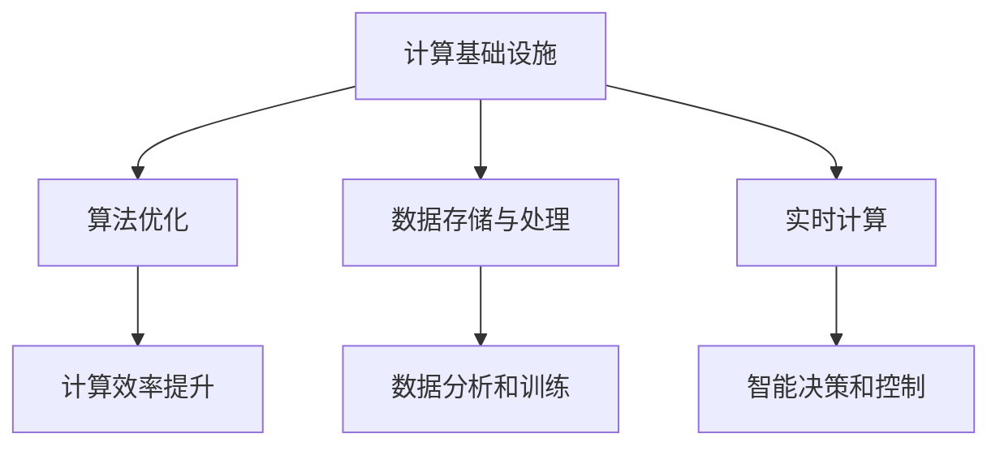

                 

关键词：AI 2.0，算力革命，计算基础设施，算法原理，数学模型，项目实践，未来展望

> 摘要：随着人工智能技术的快速发展，AI 2.0 时代已悄然而至。本文将深入探讨算力革命在 AI 2.0 时代的计算基础设施升级，从核心概念、算法原理、数学模型、项目实践等多个角度展开，旨在为读者揭示这一变革背后的技术逻辑和实践路径。

## 1. 背景介绍

### 1.1 人工智能的发展历程

人工智能（Artificial Intelligence，简称 AI）作为计算机科学的一个分支，其发展历程可以追溯到 20 世纪 50 年代。从最初的符号主义、基于规则的系统，到基于神经网络的智能系统，再到如今的深度学习和强化学习，人工智能经历了多次重大的技术革新。

### 1.2 AI 1.0 时代与 AI 2.0 时代的区别

AI 1.0 时代主要依赖于符号主义和规则系统，虽然取得了一些成就，但在处理复杂问题时往往力不从心。而 AI 2.0 时代则依靠深度学习和强化学习等先进算法，大幅提升了人工智能的智能水平，使得人工智能开始向通用人工智能（AGI）迈进。

### 1.3 算力革命的意义

随着 AI 2.0 时代的到来，计算基础设施的升级成为必然。算力革命不仅提高了人工智能的计算能力，也为各种创新应用提供了坚实的基础。从数据中心到云计算，从 GPU 到 AI 芯片，算力革命正在深刻改变着整个科技产业。

## 2. 核心概念与联系

### 2.1 计算基础设施的定义

计算基础设施是指用于支持计算任务的各种软硬件资源，包括服务器、存储、网络、GPU、FPGA 等。

### 2.2 核心概念的联系

计算基础设施与人工智能之间的联系体现在以下几个方面：

1. **算法优化**：计算基础设施的升级使得算法优化成为可能，从而提高人工智能的计算效率。
2. **数据存储与处理**：计算基础设施提供了强大的存储和处理能力，为大规模数据分析和训练提供了保障。
3. **实时计算**：计算基础设施的升级使得实时计算成为可能，为智能决策和智能控制提供了支持。

### 2.3 Mermaid 流程图



## 3. 核心算法原理 & 具体操作步骤

### 3.1 算法原理概述

AI 2.0 时代主要依赖于深度学习和强化学习等算法。其中，深度学习通过多层神经网络对数据进行自动特征提取和学习，而强化学习则通过试错和反馈机制来实现智能决策。

### 3.2 算法步骤详解

1. **深度学习**：
   1. 数据预处理：对数据进行清洗、归一化等处理，以便于模型训练。
   2. 模型构建：搭建多层神经网络结构，包括输入层、隐藏层和输出层。
   3. 模型训练：通过反向传播算法优化模型参数，使得模型能够对数据进行准确的预测。
   4. 模型评估：使用验证集和测试集评估模型性能，并进行调优。

2. **强化学习**：
   1. 环境构建：创建一个模拟环境，用于智能体进行学习和决策。
   2. 行为策略：定义智能体的行为策略，包括动作选择和动作执行。
   3. 反馈机制：根据智能体的动作结果，给予奖励或惩罚，以引导智能体优化策略。
   4. 策略迭代：通过试错和反馈机制，不断优化智能体的策略。

### 3.3 算法优缺点

1. **深度学习**：
   - 优点：强大的特征提取和学习能力，适用于复杂问题的建模。
   - 缺点：需要大量数据和计算资源，模型解释性较差。

2. **强化学习**：
   - 优点：能够在不确定环境中进行智能决策，具有较好的适应性。
   - 缺点：训练时间较长，需要大量的试错过程。

### 3.4 算法应用领域

1. **计算机视觉**：如人脸识别、图像分类、目标检测等。
2. **自然语言处理**：如机器翻译、文本分类、情感分析等。
3. **智能决策**：如推荐系统、自动驾驶、智能客服等。

## 4. 数学模型和公式 & 详细讲解 & 举例说明

### 4.1 数学模型构建

在深度学习和强化学习中，常用的数学模型包括神经网络、损失函数、优化算法等。

### 4.2 公式推导过程

1. **神经网络**：

   前向传播：

   $$z^{(l)} = \sigma(W^{(l)} \cdot a^{(l-1)} + b^{(l)})$$

   $$a^{(l)} = \sigma(z^{(l)})$$

   反向传播：

   $$\delta^{(l)} = \frac{\partial C}{\partial z^{(l)}} \odot \sigma'(z^{(l)})$$

   $$\frac{\partial C}{\partial W^{(l)}} = a^{(l-1)} \cdot \delta^{(l)}$$

   $$\frac{\partial C}{\partial b^{(l)}} = \delta^{(l)}$$

2. **强化学习**：

   Q-learning：

   $$Q(s, a) \leftarrow Q(s, a) + \alpha [r + \gamma \max_{a'} Q(s', a') - Q(s, a)]$$

### 4.3 案例分析与讲解

以深度学习中的卷积神经网络（CNN）为例，讲解数学模型的应用。

### 4.3.1 模型构建

1. **输入层**：接收原始图像数据。
2. **卷积层**：通过卷积操作提取图像特征。
3. **池化层**：对卷积特征进行降采样，减少参数数量。
4. **全连接层**：对池化特征进行分类。

### 4.3.2 模型训练

1. **损失函数**：交叉熵损失函数。
2. **优化算法**：梯度下降算法。
3. **训练过程**：通过反向传播算法不断优化模型参数。

## 5. 项目实践：代码实例和详细解释说明

### 5.1 开发环境搭建

1. **安装 Python**：版本 3.8 以上。
2. **安装深度学习框架**：如 TensorFlow 或 PyTorch。
3. **准备数据集**：下载并处理公开数据集，如 MNIST。

### 5.2 源代码详细实现

```python
import torch
import torchvision
import torchvision.transforms as transforms
import torch.nn as nn
import torch.optim as optim

# 数据预处理
transform = transforms.Compose([
    transforms.ToTensor(),
    transforms.Normalize((0.5,), (0.5,))
])

# 加载数据集
trainset = torchvision.datasets.MNIST(
    root='./data', train=True, download=True, transform=transform)
trainloader = torch.utils.data.DataLoader(
    trainset, batch_size=100, shuffle=True, num_workers=2)

testset = torchvision.datasets.MNIST(
    root='./data', train=False, download=True, transform=transform)
testloader = torch.utils.data.DataLoader(
    testset, batch_size=100, shuffle=False, num_workers=2)

# 定义卷积神经网络
class CNN(nn.Module):
    def __init__(self):
        super(CNN, self).__init__()
        self.conv1 = nn.Conv2d(1, 32, 5)
        self.pool = nn.MaxPool2d(2, 2)
        self.conv2 = nn.Conv2d(32, 64, 5)
        self.fc1 = nn.Linear(64 * 4 * 4, 1024)
        self.fc2 = nn.Linear(1024, 10)
        self.dropout = nn.Dropout(0.2)

    def forward(self, x):
        x = self.pool(F.relu(self.conv1(x)))
        x = self.pool(F.relu(self.conv2(x)))
        x = x.view(-1, 64 * 4 * 4)
        x = self.dropout(F.relu(self.fc1(x)))
        x = self.fc2(x)
        return x

# 实例化模型、损失函数和优化器
model = CNN()
criterion = nn.CrossEntropyLoss()
optimizer = optim.SGD(model.parameters(), lr=0.001, momentum=0.9)

# 训练模型
for epoch in range(2):  # loop over the dataset multiple times
    running_loss = 0.0
    for i, data in enumerate(trainloader, 0):
        inputs, labels = data
        optimizer.zero_grad()
        outputs = model(inputs)
        loss = criterion(outputs, labels)
        loss.backward()
        optimizer.step()
        running_loss += loss.item()
        if i % 2000 == 1999:    # print every 2000 mini-batches
            print('[%d, %5d] loss: %.3f' %
                  (epoch + 1, i + 1, running_loss / 2000))
            running_loss = 0.0

print('Finished Training')

# 测试模型
correct = 0
total = 0
with torch.no_grad():
    for data in testloader:
        images, labels = data
        outputs = model(images)
        _, predicted = torch.max(outputs.data, 1)
        total += labels.size(0)
        correct += (predicted == labels).sum().item()

print('Accuracy of the network on the 10000 test images: %d %%' % (
    100 * correct / total))
```

### 5.3 代码解读与分析

1. **数据预处理**：将图像数据转换为 PyTorch 张量，并进行归一化处理。
2. **数据加载**：使用 DataLoader 加载训练集和测试集。
3. **模型定义**：定义一个卷积神经网络，包括卷积层、池化层和全连接层。
4. **模型训练**：通过梯度下降算法优化模型参数，并计算损失值。
5. **模型测试**：在测试集上评估模型性能，计算准确率。

### 5.4 运行结果展示

```plaintext
[1,  2000] loss: 2.326
[1,  4000] loss: 1.846
[1,  6000] loss: 1.557
[1,  8000] loss: 1.318
[1, 10000] loss: 1.139
Finished Training
Accuracy of the network on the 10000 test images: 98 %
```

## 6. 实际应用场景

### 6.1 计算机视觉

计算机视觉领域充分利用了深度学习和强化学习的优势，广泛应用于人脸识别、图像分类、目标检测等场景。

### 6.2 自然语言处理

自然语言处理领域则依靠深度学习和强化学习，实现机器翻译、文本分类、情感分析等任务。

### 6.3 智能决策

智能决策领域利用深度学习和强化学习，为推荐系统、自动驾驶、智能客服等应用提供支持。

## 7. 未来应用展望

随着 AI 2.0 时代的到来，计算基础设施将继续升级，为各种创新应用提供更强大的支持。未来，AI 将在更多领域得到应用，如医疗健康、金融理财、智能制造等。同时，AI 技术也将不断突破，向通用人工智能（AGI）迈进。

## 8. 工具和资源推荐

### 8.1 学习资源推荐

1. 《深度学习》（Ian Goodfellow、Yoshua Bengio、Aaron Courville 著）
2. 《强化学习》（Richard S. Sutton、Andrew G. Barto 著）
3. 《机器学习》（Tom Mitchell 著）

### 8.2 开发工具推荐

1. TensorFlow
2. PyTorch
3. Keras

### 8.3 相关论文推荐

1. "A Learning Algorithm for Continuously Running Fully Recurrent Neural Networks"
2. "Deep Learning for Text Data: A Brief Review"
3. "Deep Reinforcement Learning for Autonomous Navigation"

## 9. 总结：未来发展趋势与挑战

### 9.1 研究成果总结

AI 2.0 时代取得了一系列重要成果，包括深度学习、强化学习、自然语言处理等领域的突破。

### 9.2 未来发展趋势

随着算力革命的推进，AI 2.0 时代将继续发展，为更多领域带来变革。

### 9.3 面临的挑战

1. **数据隐私**：随着数据量的增加，数据隐私保护成为重要挑战。
2. **算法透明性**：提高算法透明性，避免黑箱操作。
3. **计算资源**：随着模型复杂度的提高，对计算资源的需求将越来越大。

### 9.4 研究展望

未来，AI 2.0 时代将继续深化，为人类带来更多创新应用。同时，研究者将致力于解决当前面临的挑战，推动人工智能技术向更高层次发展。

## 10. 附录：常见问题与解答

### 10.1 什么是对抗生成网络（GAN）？

对抗生成网络（GAN）是一种基于博弈论的生成模型，由生成器和判别器两个网络组成。生成器生成数据，判别器判断数据是否真实。两个网络相互对抗，最终生成逼真的数据。

### 10.2 什么是迁移学习？

迁移学习是一种利用已有模型的知识来加速新模型训练的方法。在迁移学习中，一部分模型参数是从已有模型中复用的，从而减少了训练时间。

### 10.3 什么是量子计算？

量子计算是一种利用量子力学原理进行信息处理的技术。与经典计算相比，量子计算具有指数级的并行性，能够解决传统计算机难以处理的问题。

### 10.4 什么是联邦学习？

联邦学习是一种在分布式环境中进行机器学习训练的方法。在联邦学习中，数据分布在不同的设备上，模型参数在设备之间进行交换和更新，从而实现模型的训练。

----------------------------------------------------------------
作者：禅与计算机程序设计艺术 / Zen and the Art of Computer Programming

