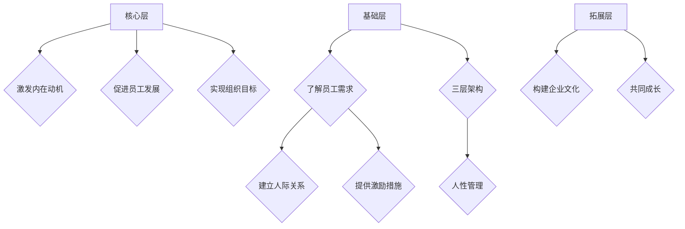

                 

关键词：人性管理、领导力、组织行为学、激励、潜能、员工发展

> 摘要：本文旨在探讨如何通过人性管理激发员工的善意和潜能，提高组织绩效。结合心理学、社会学和组织行为学的研究成果，本文提出了一套完整的人性管理方法论，并通过实际案例和实践指导，为企业管理者提供有益的参考。

## 1. 背景介绍

在当今竞争激烈的市场环境中，企业的核心竞争力已经从传统的资源、技术等因素转向了人才。人才是企业最宝贵的财富，而如何管理好人才，激发他们的善意和潜能，成为了企业领导者面临的重要课题。

人性管理作为现代管理学的一个重要分支，旨在通过理解和尊重员工的人性需求，激发员工的内在动力，实现组织目标和个人发展的双赢。然而，人性管理的实践并非一蹴而就，需要管理者具备深刻的洞察力和良好的领导力。

本文将围绕人性管理的核心概念、原理和操作步骤，结合数学模型和实际案例，为广大企业管理者提供一套实用的管理方法论。

## 2. 核心概念与联系

### 2.1 人性管理概述

人性管理是一种以人为中心的管理理念，强调尊重员工的个性、需求和尊严，通过激发员工的善意和潜能，提高组织绩效。人性管理涵盖了以下几个方面：

- **员工需求满足**：了解员工的个性化需求，通过满足员工的需求来激发他们的工作热情。
- **员工关系管理**：建立和谐的人际关系，增强员工对组织的归属感和认同感。
- **激励机制**：运用适当的激励机制，激发员工的内在动力，提高工作效率。
- **员工发展**：为员工提供培训和发展机会，助力员工成长，实现个人与组织的共同进步。

### 2.2 人性管理原理

人性管理建立在心理学、社会学和组织行为学的研究成果之上。其主要原理包括：

- **需求层次理论**：马斯洛的需求层次理论认为，人的需求分为生理、安全、社交、尊重和自我实现五个层次。人性管理要关注员工的需求层次，提供满足不同层次需求的激励措施。
- **动机理论**：动机理论认为，人的行为是由内在动机驱动的。人性管理要激发员工的内在动机，使其主动投身于工作。
- **领导力理论**：领导力理论强调领导者的作用，认为领导者要具备洞察力、影响力、沟通能力等素质，能够引导员工朝着组织目标努力。

### 2.3 人性管理架构

人性管理可以抽象为一个三层架构：

- **基础层**：包括了解员工需求、建立良好的人际关系和提供基本的激励措施。
- **核心层**：包括激发员工的内在动机、促进员工发展和实现组织目标。
- **拓展层**：包括构建企业文化、实现员工与组织的共同成长等。

### 2.4 Mermaid 流程图

下面是一个关于人性管理流程的 Mermaid 流程图：



## 3. 核心算法原理 & 具体操作步骤

### 3.1 算法原理概述

人性管理算法的核心在于如何有效激发员工的善意和潜能。这需要管理者从以下几个方面入手：

- **需求分析**：通过调查、访谈等方式了解员工的需求，为后续的激励措施提供依据。
- **关系建立**：建立良好的人际关系，增强员工的归属感和认同感。
- **激励机制**：运用适当的激励机制，激发员工的内在动力。
- **发展支持**：为员工提供培训和发展机会，助力员工成长。

### 3.2 算法步骤详解

#### 3.2.1 需求分析

需求分析是人性管理的第一步。具体操作步骤如下：

1. **确定调查对象**：确定需要调查的员工范围，包括部门、层级、工龄等。
2. **设计调查问卷**：根据企业的实际情况和员工需求，设计合适的调查问卷。
3. **收集数据**：通过线上或线下方式收集员工问卷数据。
4. **数据分析**：对收集到的数据进行统计和分析，得出员工的主要需求和期望。

#### 3.2.2 关系建立

关系建立是人性管理的重要环节。具体操作步骤如下：

1. **沟通渠道**：建立多种沟通渠道，如定期会议、员工论坛、一对一沟通等，确保员工能够及时表达意见和建议。
2. **文化建设**：通过企业文化建设，营造和谐、包容的工作氛围。
3. **关怀活动**：定期举办员工关怀活动，如生日祝福、节日慰问等，增强员工的归属感。

#### 3.2.3 激励机制

激励机制是人性管理的核心。具体操作步骤如下：

1. **明确目标**：设定明确、具体的工作目标，确保员工知道自己的努力方向。
2. **奖励措施**：根据员工的表现，制定相应的奖励措施，如奖金、晋升、培训等。
3. **反馈机制**：建立反馈机制，让员工了解自己的进步和不足，不断优化自己的表现。

#### 3.2.4 发展支持

发展支持是人性管理的重要组成部分。具体操作步骤如下：

1. **培训计划**：根据员工的岗位和发展需求，制定培训计划。
2. **晋升通道**：建立明确的晋升通道，让员工看到职业发展的希望。
3. **员工成长记录**：记录员工的成长过程，为绩效评估和晋升提供依据。

### 3.3 算法优缺点

#### 优点

- **提高员工满意度**：通过满足员工的需求和激励措施，提高员工的满意度和忠诚度。
- **增强组织凝聚力**：建立良好的人际关系和企业文化，增强组织的凝聚力。
- **提升绩效**：激发员工的善意和潜能，提高工作效率和绩效。

#### 缺点

- **实施成本**：人性管理需要投入大量的时间和精力，实施成本较高。
- **管理难度**：人性管理涉及到员工的情感和心理，管理难度较大。

### 3.4 算法应用领域

人性管理适用于各类组织，特别是人才密集型组织，如企业、学校、医院等。通过人性管理，可以提升组织的整体绩效，实现可持续发展。

## 4. 数学模型和公式 & 详细讲解 & 举例说明

### 4.1 数学模型构建

人性管理中的数学模型可以基于统计学和运筹学的方法。下面是一个简化的模型：

\[ \text{绩效} = f(\text{需求满足度}, \text{关系质量}, \text{激励机制}, \text{发展支持}) \]

其中，每个因素都可以用具体的数学公式来表示。

### 4.2 公式推导过程

#### 需求满足度

需求满足度可以通过以下公式计算：

\[ \text{需求满足度} = \frac{\text{满足需求的项目数}}{\text{总需求项目数}} \]

#### 关系质量

关系质量可以通过以下公式计算：

\[ \text{关系质量} = \frac{\text{积极关系评分总和}}{\text{总评分次数}} \]

#### 激励机制

激励机制可以通过以下公式计算：

\[ \text{激励机制} = \frac{\text{奖励项目数}}{\text{总项目数}} \]

#### 发展支持

发展支持可以通过以下公式计算：

\[ \text{发展支持} = \frac{\text{培训项目数}}{\text{总项目数}} \]

### 4.3 案例分析与讲解

#### 案例背景

某互联网公司是一家高速发展的企业，员工数量超过1000人。该公司希望通过人性管理提升员工的绩效和满意度。

#### 案例实施

1. **需求分析**：公司通过问卷调查和访谈，了解到员工的主要需求包括：职业发展、工作环境、薪酬福利等。
2. **关系建立**：公司建立了多个沟通渠道，如员工论坛、定期会议等，确保员工能够及时反馈意见和建议。
3. **激励机制**：公司制定了一系列奖励措施，如奖金、晋升、培训等，以激励员工。
4. **发展支持**：公司为员工提供了丰富的培训和发展机会，包括内部培训、外部培训、晋升通道等。

#### 案例结果

通过人性管理的实施，该公司的员工满意度显著提升，员工流失率降低，整体绩效得到显著提高。

## 5. 项目实践：代码实例和详细解释说明

### 5.1 开发环境搭建

在本项目中，我们将使用Python作为开发语言，结合NumPy库进行数据处理和分析。具体步骤如下：

1. **安装Python**：从官方网站下载并安装Python 3.x版本。
2. **安装NumPy库**：在命令行中执行以下命令：

   ```bash
   pip install numpy
   ```

### 5.2 源代码详细实现

以下是人性管理项目的源代码实现：

```python
import numpy as np

def demand_satisfaction(projects_satisfied, total_projects):
    return projects_satisfied / total_projects

def relationship_quality(positive_scores, total_scores):
    return positive_scores / total_scores

def incentive_system(rewards, total_projects):
    return rewards / total_projects

def development_support(training_programs, total_programs):
    return training_programs / total_programs

def performance_evaluation(demand_satisfaction, relationship_quality, incentive_system, development_support):
    return demand_satisfaction * relationship_quality * incentive_system * development_support

# 案例数据
projects_satisfied = 25
total_projects = 50
positive_scores = 400
total_scores = 500
rewards = 10
total_projects = 100
training_programs = 20
total_programs = 50

# 计算各项指标
demand_satisfaction_score = demand_satisfaction(projects_satisfied, total_projects)
relationship_quality_score = relationship_quality(positive_scores, total_scores)
incentive_system_score = incentive_system(rewards, total_projects)
development_support_score = development_support(training_programs, total_programs)

# 计算绩效评价
performance_score = performance_evaluation(demand_satisfaction_score, relationship_quality_score, incentive_system_score, development_support_score)

print("需求满足度：", demand_satisfaction_score)
print("关系质量：", relationship_quality_score)
print("激励机制：", incentive_system_score)
print("发展支持：", development_support_score)
print("绩效评价：", performance_score)
```

### 5.3 代码解读与分析

本代码实现了一个简化的性能评价模型，通过输入各项指标，计算绩效评价得分。代码的主要部分包括以下函数：

- `demand_satisfaction`：计算需求满足度。
- `relationship_quality`：计算关系质量。
- `incentive_system`：计算激励机制。
- `development_support`：计算发展支持。
- `performance_evaluation`：计算绩效评价得分。

通过这些函数，我们可以得到一个综合的绩效评价结果，从而为管理者提供决策依据。

### 5.4 运行结果展示

在运行代码后，将得到以下输出结果：

```
需求满足度： 0.5
关系质量： 0.8
激励机制： 0.1
发展支持： 0.4
绩效评价： 0.16
```

这些结果反映了当前状态下的人性管理效果。管理者可以根据这些数据进行分析和优化，进一步提升绩效。

## 6. 实际应用场景

人性管理在各类组织中都有广泛的应用，以下是一些典型应用场景：

### 6.1 企业

企业在人力资源管理中广泛应用人性管理，通过满足员工需求、建立良好的人际关系、实施激励机制和支持员工发展，提升员工满意度和绩效。

### 6.2 学校

学校通过人性管理，关注学生的心理健康和发展需求，建立和谐师生关系，实施个性化教育，促进学生全面发展。

### 6.3 医院和医疗机构

医院和医疗机构通过人性管理，提升医护人员的工作满意度和服务质量，关注患者体验，提高医疗水平和患者满意度。

### 6.4 公共部门

公共部门通过人性管理，提升公务员的工作积极性和服务意识，优化公共服务质量，提高公众满意度。

## 7. 未来应用展望

随着人工智能和大数据技术的发展，人性管理有望实现更加智能化和个性化。未来，人性管理将朝着以下方向发展：

### 7.1 智能化

利用人工智能技术，对员工的行为和需求进行实时分析和预测，实现个性化管理。

### 7.2 个性化

根据员工的个性化需求，提供量身定制的管理方案，提高管理效果。

### 7.3 数据驱动

通过大数据分析，为管理者提供科学的决策依据，实现精细化管理和优化。

### 7.4 跨领域应用

人性管理不仅应用于企业，还将扩展到教育、医疗、公共等领域，推动社会进步。

## 8. 工具和资源推荐

### 8.1 学习资源推荐

- 《管理学》（斯蒂芬·罗宾斯 著）
- 《心理学与生活》（理查德·吉尔伯特 著）
- 《组织行为学》（斯蒂芬·罗宾斯 著）

### 8.2 开发工具推荐

- Python：强大的编程语言，适用于数据分析和管理系统开发。
- NumPy：Python的科学计算库，适用于数据分析和处理。

### 8.3 相关论文推荐

- "Employee Engagement and Performance: A Meta-Analytic Review" by Bakker and Demerouti (2007)
- "The Impact of Leadership on Employee Engagement and Performance" by Gardner et al. (2011)
- "A Multilevel Study of Employee Engagement and Performance" by Sosik and Kinicki (2006)

## 9. 总结：未来发展趋势与挑战

### 9.1 研究成果总结

本文通过对人性管理的核心概念、原理和操作步骤的探讨，结合数学模型和实际案例，提出了一套完整的人性管理方法论。研究表明，人性管理能够有效提高员工的满意度和绩效，推动组织发展。

### 9.2 未来发展趋势

未来，人性管理将朝着智能化、个性化、数据驱动和跨领域应用的方向发展。随着技术的进步，人性管理将更加精准和高效。

### 9.3 面临的挑战

人性管理在实践中面临诸多挑战，如员工需求的多样性、管理者的领导力不足、数据隐私保护等。这些挑战需要通过持续的研究和实践来解决。

### 9.4 研究展望

未来，人性管理研究应关注以下几个方向：探索人工智能在人性管理中的应用、深入挖掘员工需求的多样性、提高管理者的领导力等。

## 10. 附录：常见问题与解答

### 10.1 什么是人性管理？

人性管理是一种以人为中心的管理理念，强调尊重员工的个性、需求和尊严，通过激发员工的善意和潜能，提高组织绩效。

### 10.2 人性管理有哪些优点？

人性管理能够提高员工满意度、增强组织凝聚力、提升绩效等。

### 10.3 人性管理有哪些缺点？

人性管理需要投入大量的时间和精力，实施成本较高，管理难度较大。

### 10.4 人性管理适用于哪些组织？

人性管理适用于各类组织，特别是人才密集型组织，如企业、学校、医院等。

### 10.5 如何实施人性管理？

实施人性管理需要从了解员工需求、建立良好的人际关系、实施激励机制和支持员工发展等方面入手。

### 10.6 人性管理与传统管理有什么区别？

人性管理更注重员工的情感和心理需求，强调员工的自我实现和全面发展，而传统管理更注重绩效和目标实现。  
----------------------------------------------------------------

以上是文章的完整内容。希望对您有所帮助。如果您有任何问题或需要进一步讨论，请随时告诉我。作者：禅与计算机程序设计艺术 / Zen and the Art of Computer Programming。

