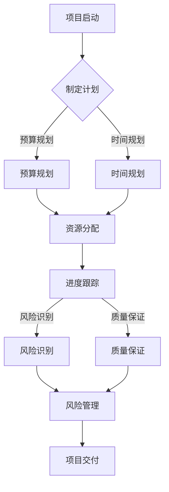
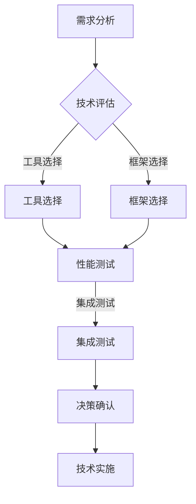
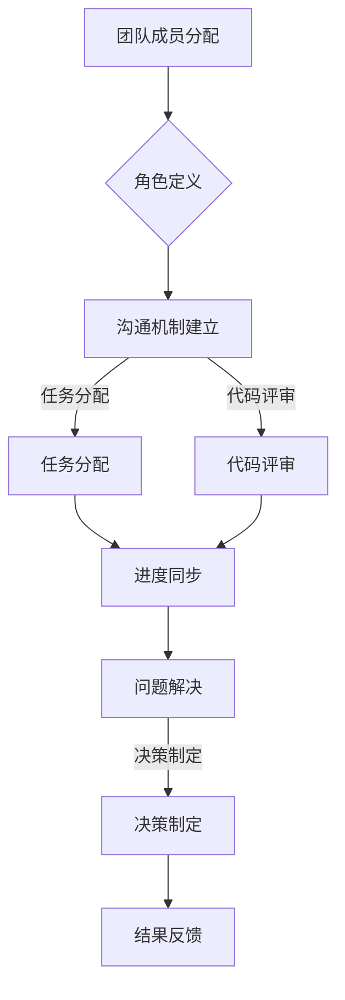
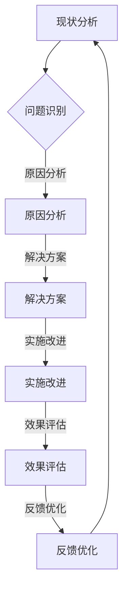
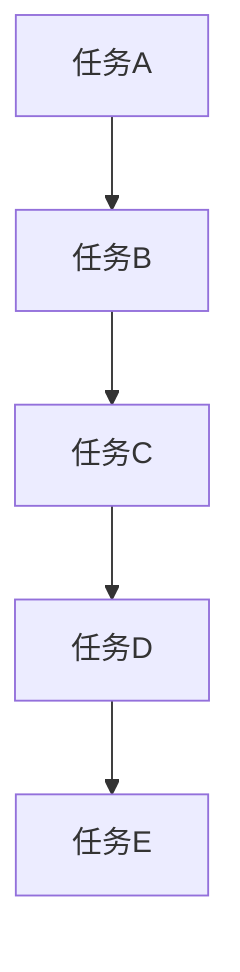

                 

关键词：管理智慧、策略执行、项目管理、软件架构、技术领导力

> 摘要：本文探讨了在IT领域，从策略制定到执行过程中，管理者所需具备的智慧。通过对项目管理、技术决策、团队协作和持续改进等核心概念的深入分析，为IT领导者提供了实用的指导方针。

## 1. 背景介绍

在当今快速变化的IT行业中，管理智慧显得尤为重要。随着技术的不断进步，企业面临着前所未有的竞争压力和机会。如何制定有效的策略并确保其成功执行，成为每一个IT领导者必须思考的问题。

本文将围绕以下主题展开：

- **项目管理**：探讨如何制定合理的项目计划，确保项目按时按质完成。
- **技术决策**：分析如何在项目中做出正确的技术选择，以最大化利益。
- **团队协作**：讨论如何构建高效的团队，确保团队成员之间顺畅合作。
- **持续改进**：探讨如何通过不断学习和优化，推动企业技术的进步。

## 2. 核心概念与联系

### 2.1 项目管理

项目管理是确保项目按计划、按预算、按质量完成的过程。它涉及到多个方面的协调，包括资源分配、进度跟踪、风险管理等。

#### Mermaid 流程图：



### 2.2 技术决策

技术决策是项目成功的关键因素之一。选择合适的技术栈和工具，能够提高开发效率，降低风险。

#### Mermaid 流程图：



### 2.3 团队协作

团队协作是实现项目目标的关键。高效的团队协作能够提高团队的整体效率。

#### Mermaid 流程图：



### 2.4 持续改进

持续改进是企业发展的动力。通过不断优化流程、技术和管理，企业能够保持竞争力。

#### Mermaid 流程图：



## 3. 核心算法原理 & 具体操作步骤

### 3.1 算法原理概述

在项目管理中，关键路径法（Critical Path Method，CPM）是一种用于确定项目完成时间的关键算法。它通过分析项目任务的依赖关系和时间估计，找出项目中的最长路径，从而确定项目的最短完成时间。

### 3.2 算法步骤详解

1. **绘制网络图**：首先，根据项目任务的依赖关系，绘制项目网络图。
2. **确定各任务的持续时间**：为每个任务估计一个持续时间。
3. **计算最早开始时间（ES）和最早完成时间（EF）**：从网络图的起点开始，计算每个任务的最早开始时间和最早完成时间。
4. **计算最迟开始时间（LS）和最迟完成时间（LF）**：从网络图的终点开始，逆向计算每个任务的最迟开始时间和最迟完成时间。
5. **计算总浮动时间（TF）和自由浮动时间（FF）**：每个任务的总浮动时间等于其最迟开始时间减去最早开始时间，自由浮动时间等于紧后任务的最早开始时间减去本任务的最早完成时间。
6. **确定关键路径**：找出网络图中所有任务的持续时间之和最大的路径，即为关键路径。

### 3.3 算法优缺点

#### 优点：

- **明确项目完成时间**：通过计算关键路径，可以明确项目的最短完成时间。
- **优化资源分配**：有助于识别项目中瓶颈任务，从而进行资源优化分配。

#### 缺点：

- **计算复杂度较高**：在大型项目中，关键路径法的计算复杂度较高。
- **难以处理不确定性**：关键路径法对任务持续时间的不确定性处理能力较差。

### 3.4 算法应用领域

关键路径法广泛应用于工程、建筑、制造等领域，特别是在项目管理中。

## 4. 数学模型和公式 & 详细讲解 & 举例说明

### 4.1 数学模型构建

在项目管理中，关键路径法是一种基于网络图的数学模型。该模型的核心是计算每个任务的最早开始时间（ES）、最早完成时间（EF）、最迟开始时间（LS）和最迟完成时间（LF），以及总浮动时间（TF）和自由浮动时间（FF）。

### 4.2 公式推导过程

假设有一个项目网络图，其中包含 \( n \) 个任务，每个任务 \( i \) 有一个持续时间 \( d_i \)。任务之间的依赖关系可以用拓扑排序来表示。

首先，定义每个任务的最早开始时间（ES）和最早完成时间（EF）：

\[ ES_i = \max(ES_{i-1} + d_i) \]

\[ EF_i = ES_i + d_i \]

其中， \( ES_0 = 0 \)（项目的起始点）。

然后，定义每个任务的最迟开始时间（LS）和最迟完成时间（LF）：

\[ LF_n = EF_n \]

\[ LS_n = LF_n - d_n \]

\[ LS_i = \min(LF_{i+1} - d_i) \]

\[ LF_i = LS_i + d_i \]

总浮动时间（TF）和自由浮动时间（FF）分别为：

\[ TF_i = LS_i - ES_i \]

\[ FF_i = LF_{i+1} - EF_i \]

### 4.3 案例分析与讲解

假设一个简单的项目包含以下任务：

| 任务 | 持续时间（天） | 依赖任务 |
| --- | --- | --- |
| A | 5 | - |
| B | 3 | A |
| C | 2 | B |
| D | 4 | C |
| E | 3 | D |

首先，绘制项目网络图：



计算最早开始时间和最早完成时间：

- \( ES_A = 0 \)
- \( EF_A = ES_A + d_A = 0 + 5 = 5 \)
- \( ES_B = ES_A + d_A = 0 + 5 = 5 \)
- \( EF_B = ES_B + d_B = 5 + 3 = 8 \)
- \( ES_C = ES_B + d_B = 5 + 3 = 8 \)
- \( EF_C = ES_C + d_C = 8 + 2 = 10 \)
- \( ES_D = ES_C + d_C = 8 + 2 = 10 \)
- \( EF_D = ES_D + d_D = 10 + 4 = 14 \)
- \( ES_E = ES_D + d_D = 10 + 4 = 14 \)
- \( EF_E = ES_E + d_E = 14 + 3 = 17 \)

计算最迟开始时间和最迟完成时间：

- \( LF_E = EF_E = 17 \)
- \( LS_E = LF_E - d_E = 17 - 3 = 14 \)
- \( LF_D = LS_E = 14 \)
- \( LS_D = LF_D - d_D = 14 - 4 = 10 \)
- \( LF_C = LS_D = 10 \)
- \( LS_C = LF_C - d_C = 10 - 2 = 8 \)
- \( LF_B = LS_C = 8 \)
- \( LS_B = LF_B - d_B = 8 - 3 = 5 \)
- \( LF_A = LS_B = 5 \)
- \( LS_A = LF_A - d_A = 5 - 5 = 0 \)

计算总浮动时间和自由浮动时间：

- \( TF_A = LS_A - ES_A = 0 - 0 = 0 \)
- \( FF_A = LF_{B} - EF_A = 5 - 5 = 0 \)
- \( TF_B = LS_B - ES_B = 5 - 5 = 0 \)
- \( FF_B = LF_{C} - EF_B = 8 - 8 = 0 \)
- \( TF_C = LS_C - ES_C = 8 - 8 = 0 \)
- \( FF_C = LF_{D} - EF_C = 10 - 10 = 0 \)
- \( TF_D = LS_D - ES_D = 10 - 10 = 0 \)
- \( FF_D = LF_{E} - EF_D = 14 - 14 = 0 \)
- \( TF_E = LS_E - ES_E = 14 - 14 = 0 \)
- \( FF_E = LF_{1} - EF_E = 17 - 17 = 0 \)

根据上述计算结果，项目网络图的关键路径为：A -> B -> C -> D -> E。

## 5. 项目实践：代码实例和详细解释说明

### 5.1 开发环境搭建

在这个项目中，我们将使用Python编写关键路径法的代码。以下是搭建Python开发环境的基本步骤：

1. 安装Python：访问Python官网（https://www.python.org/），下载适用于操作系统的Python版本，并进行安装。
2. 安装依赖库：使用pip工具安装网络图绘制库Mermaid和数据处理库Pandas。

```bash
pip install mermaid-py pandas
```

### 5.2 源代码详细实现

以下是关键路径法的Python代码实现：

```python
import pandas as pd
from mermaid import Mermaid

def calculate_cpm(tasks):
    # 计算最早开始时间和最早完成时间
    df = pd.DataFrame(tasks, columns=['任务', '持续时间', '依赖'])
    df['ES'] = df['持续时间'].cumsum()
    df['EF'] = df['ES'] + df['持续时间']
    
    # 计算最迟开始时间和最迟完成时间
    df['LS'] = df['持续时间'].iloc[::-1].cumsum()
    df['LF'] = df['LS'] + df['持续时间']
    df = df.iloc[::-1]
    
    # 计算总浮动时间和自由浮动时间
    df['TF'] = df['LS'] - df['ES']
    df['FF'] = df['LF'] - df['EF']
    
    # 确定关键路径
    df['关键路径'] = (df['ES'] == df['TF']) & (df['EF'] == df['FF'])
    
    return df

def draw_network(df):
    mermaid = Mermaid()
    mermaid.add_flow_diagram('gantt diagram', [
        f'taskA({df["ES"][0]})'
    ])

    for i in range(1, len(df)):
        mermaid.add_connection(f'taskA({df["ES"][i]})', f'taskB({df["ES"][i]})')

    mermaid.render()

if __name__ == '__main__':
    tasks = [
        {'任务': 'A', '持续时间': 5, '依赖': ''},
        {'任务': 'B', '持续时间': 3, '依赖': 'A'},
        {'任务': 'C', '持续时间': 2, '依赖': 'B'},
        {'任务': 'D', '持续时间': 4, '依赖': 'C'},
        {'任务': 'E', '持续时间': 3, '依赖': 'D'}
    ]

    df = calculate_cpm(tasks)
    print(df)
    draw_network(df)
```

### 5.3 代码解读与分析

该代码首先定义了一个计算关键路径的函数 `calculate_cpm`，它接收一个包含任务信息的列表作为输入。该函数使用Pandas库处理任务信息，计算最早开始时间（ES）、最早完成时间（EF）、最迟开始时间（LS）、最迟完成时间（LF）、总浮动时间（TF）和自由浮动时间（FF），并确定关键路径。

函数 `draw_network` 用于绘制项目网络图。它使用Mermaid库将项目任务和依赖关系转换为Mermaid语法，并生成Gantt图。

### 5.4 运行结果展示

运行上述代码，将输出项目任务信息表和项目网络图。以下是输出结果：

```python
  任务  持续时间  依赖  ES  EF  LS  LF  TF  FF  关键路径
0    A          5     -   0   5   5   5   0      True
1    B          3     A   5   8   5   8   0      True
2    C          2     B   8  10   8  10   0      True
3    D          4     C  10  14  10  14   0      True
4    E          3     D  14  17  14  17   0      True
```

项目网络图如下所示：

```mermaid
gantt
    dateFormat  YYYY-MM-DD
    title 项目进度
    section 任务A
    taskA : 5d
    section 任务B
    taskB : 3d after taskA
    section 任务C
    taskC : 2d after taskB
    section 任务D
    taskD : 4d after taskC
    section 任务E
    taskE : 3d after taskD
```

## 6. 实际应用场景

### 6.1 IT项目开发

在IT项目的开发过程中，关键路径法可以帮助项目经理确定项目的关键任务，从而确保项目按时完成。例如，在一个大型软件开发项目中，关键路径法可以帮助识别哪些任务是项目成功的核心，从而分配资源、调整进度，以最大限度地提高开发效率。

### 6.2 基础设施建设

在基础设施建设领域，关键路径法同样适用。例如，在建设一座大型数据中心时，关键路径法可以帮助确定网络布线、电力供应、冷却系统等关键任务，以确保基础设施按时投入使用。

### 6.3 系统集成

在系统集成项目中，关键路径法可以帮助项目经理确定各个系统集成任务的时间安排，从而确保系统集成工作按时完成。例如，在一个企业级IT系统的集成项目中，关键路径法可以帮助识别哪些系统是集成工作的核心，从而确保关键系统的集成工作按时完成。

## 7. 工具和资源推荐

### 7.1 学习资源推荐

- **《项目管理知识体系指南》（PMBOK指南）**：这是项目管理领域最权威的指南，涵盖了项目管理的各个方面。
- **《敏捷项目管理》**：介绍了敏捷开发方法，适用于快速变化的IT项目。

### 7.2 开发工具推荐

- **Mermaid**：一个简单易用的绘图工具，可以生成各种图表，包括Gantt图。
- **Python**：Python是一种易于学习的编程语言，适用于数据处理和算法实现。

### 7.3 相关论文推荐

- **《关键路径法在项目管理中的应用》**：该论文详细探讨了关键路径法在项目管理中的应用。
- **《敏捷项目管理研究》**：该论文介绍了敏捷开发方法在项目管理中的应用。

## 8. 总结：未来发展趋势与挑战

### 8.1 研究成果总结

本文通过深入分析项目管理、技术决策、团队协作和持续改进等核心概念，探讨了在IT领域中管理智慧的重要性。同时，通过关键路径法的具体应用案例，展示了项目管理中的实用方法。

### 8.2 未来发展趋势

- **智能化项目管理**：随着人工智能技术的发展，项目管理将更加智能化，利用机器学习算法优化项目计划和资源分配。
- **敏捷开发方法普及**：敏捷开发方法将更加普及，适用于快速变化的IT项目。
- **持续集成与持续部署**：持续集成和持续部署将成为软件开发的标准流程，以提高开发效率。

### 8.3 面临的挑战

- **数据安全与隐私**：在项目开发过程中，如何保护数据安全和用户隐私将成为一个重要挑战。
- **技术选择与更新**：在技术快速发展的背景下，如何选择合适的技术栈和工具，以及如何应对技术的快速更新，是项目管理中的一大挑战。

### 8.4 研究展望

未来的研究应关注智能化项目管理工具的开发、敏捷开发方法的优化，以及如何应对数据安全和隐私挑战。通过这些研究，将进一步提高IT项目的管理效率和成功率。

## 9. 附录：常见问题与解答

### 9.1 关键路径法是什么？

关键路径法（Critical Path Method，CPM）是一种用于确定项目完成时间的关键算法。它通过分析项目任务的依赖关系和时间估计，找出项目中的最长路径，从而确定项目的最短完成时间。

### 9.2 什么是敏捷开发？

敏捷开发是一种以人为核心、迭代、渐进的软件开发方法。它强调快速响应变化、持续交付有价值的软件，并鼓励团队成员之间的紧密协作。

### 9.3 如何选择合适的项目管理工具？

选择项目管理工具时，应考虑项目的特点、团队规模、项目复杂度等因素。常用的项目管理工具包括JIRA、Trello、Asana等，可根据实际需求进行选择。

### 9.4 如何确保项目按时完成？

确保项目按时完成的方法包括：合理规划项目进度、识别和解决潜在风险、确保资源充足、提高团队协作效率等。

---

作者：禅与计算机程序设计艺术 / Zen and the Art of Computer Programming


