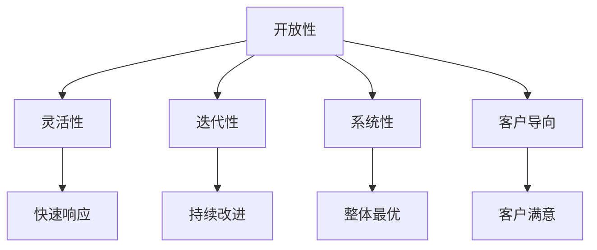

                 

关键词：管理思维、敏捷度、训练、IT领域、技术领导力

> 摘要：本文旨在探讨如何在IT领域提升管理者的思维敏捷度。通过分析敏捷思维的关键要素、理论框架和实践方法，提供一系列有效的训练策略，以帮助管理者在面对快速变化的技术环境时保持竞争力。

## 1. 背景介绍

在信息技术日新月异发展的今天，管理者的角色发生了显著变化。传统的管理模式已经无法应对快速迭代的技术挑战和市场变化。现代IT行业要求管理者具备高度的思维敏捷度，以迅速适应新形势，做出明智的决策。思维敏捷度不仅是技术能力的体现，更是管理能力的关键组成部分。

本文将从以下几个方面展开讨论：

1. **敏捷思维的核心概念**：阐述敏捷思维的基本定义、特点和重要性。
2. **敏捷思维的架构**：通过Mermaid流程图展示敏捷思维的理论框架。
3. **核心算法原理**：介绍提升思维敏捷度的核心算法原理和具体操作步骤。
4. **数学模型和公式**：解释数学模型在敏捷思维中的应用和推导过程。
5. **项目实践**：通过实际代码实例展示敏捷思维的运用。
6. **实际应用场景**：分析敏捷思维在IT管理中的具体应用。
7. **未来应用展望**：探讨敏捷思维的发展趋势和潜在挑战。
8. **工具和资源推荐**：推荐学习资源和开发工具。
9. **总结与展望**：总结研究成果，展望未来的研究方向。

## 2. 核心概念与联系

### 2.1 敏捷思维的定义

敏捷思维（Agile Thinking）是指在面对复杂、不确定性的环境时，能够迅速适应、灵活应对和有效决策的能力。它强调的是快速响应变化、持续改进和创新。

### 2.2 敏捷思维的特点

1. **开放性**：敏捷思维鼓励管理者开放心态，接受新观点和反馈。
2. **灵活性**：在面对变化时，能够迅速调整策略和行动。
3. **迭代性**：通过不断迭代，逐步完善决策和方案。
4. **系统性**：从整体角度考虑问题，寻求系统最优解。
5. **客户导向**：以客户需求为中心，持续优化产品和服务。

### 2.3 敏捷思维的重要性

在IT领域，敏捷思维的重要性体现在以下几个方面：

1. **提升竞争力**：快速适应市场变化，提高企业的竞争力。
2. **创新驱动**：激发创新思维，推动技术进步和业务发展。
3. **团队协作**：增强团队协作能力，提升团队绩效。
4. **风险控制**：降低项目风险，提高项目成功率。

### 2.4 敏捷思维的架构

为了更好地理解敏捷思维，我们使用Mermaid流程图展示其理论框架：



该框架展示了敏捷思维的核心要素及其相互联系，为后续的讨论提供了理论依据。

## 3. 核心算法原理 & 具体操作步骤

### 3.1 算法原理概述

提升思维敏捷度的核心算法原理主要涉及以下几个方面：

1. **思维模型训练**：通过系统的思维训练，提高管理者的逻辑思维、创新思维和批判性思维能力。
2. **数据驱动决策**：利用大数据和人工智能技术，支持数据驱动决策，降低决策风险。
3. **情境模拟**：通过情境模拟，增强管理者的应对不确定性和复杂问题的能力。
4. **反思与学习**：通过反思和学习，不断优化决策过程，提升思维敏捷度。

### 3.2 算法步骤详解

#### 3.2.1 思维模型训练

1. **逻辑思维训练**：通过逻辑推理、问题解决等练习，提高管理者的逻辑思维能力。
2. **创新思维训练**：通过头脑风暴、思维导图等练习，激发管理者的创新思维。
3. **批判性思维训练**：通过批判性阅读、辩论等练习，培养管理者的批判性思维能力。

#### 3.2.2 数据驱动决策

1. **数据收集**：收集与决策相关的数据，包括市场趋势、客户需求、技术动态等。
2. **数据分析**：利用数据分析工具，对收集到的数据进行处理和分析。
3. **决策支持**：根据数据分析结果，提供决策支持，降低决策风险。

#### 3.2.3 情境模拟

1. **模拟设定**：设定模拟情境，包括问题、目标和可能的解决方案。
2. **模拟运行**：模拟管理者的决策过程，记录决策结果。
3. **结果分析**：分析模拟结果，评估管理者的应对策略。

#### 3.2.4 反思与学习

1. **反思记录**：记录决策过程中的问题和经验，进行反思。
2. **学习优化**：根据反思结果，优化决策过程，提升思维敏捷度。

### 3.3 算法优缺点

#### 优点

1. **提高决策效率**：通过系统化的训练和模拟，提高管理者的决策效率。
2. **降低决策风险**：数据驱动的决策方式，降低决策风险。
3. **增强创新能力**：通过思维训练，激发管理者的创新能力。

#### 缺点

1. **训练成本较高**：需要投入大量时间和资源进行思维训练。
2. **模拟结果的不确定性**：情境模拟的结果可能受到多种因素的影响，存在一定的不确定性。

### 3.4 算法应用领域

敏捷思维算法主要应用于IT领域的项目管理、产品研发和市场营销等方面。通过提升管理者的思维敏捷度，可以提高项目成功率、产品竞争力和市场响应速度。

## 4. 数学模型和公式 & 详细讲解 & 举例说明

### 4.1 数学模型构建

在敏捷思维中，数学模型的应用主要体现在以下几个方面：

1. **回归分析**：用于分析市场趋势和客户需求。
2. **聚类分析**：用于客户细分和市场定位。
3. **决策树**：用于决策支持和风险评估。
4. **神经网络**：用于复杂问题的建模和预测。

### 4.2 公式推导过程

以回归分析为例，其公式推导过程如下：

$$
y = \beta_0 + \beta_1x_1 + \beta_2x_2 + ... + \beta_nx_n + \epsilon
$$

其中，$y$ 为因变量，$x_1, x_2, ..., x_n$ 为自变量，$\beta_0, \beta_1, \beta_2, ..., \beta_n$ 为回归系数，$\epsilon$ 为随机误差。

### 4.3 案例分析与讲解

#### 案例背景

某互联网公司希望预测下一季度的新用户增长数量，以便制定相应的营销策略。

#### 案例数据

- 当前季度新用户数量：1000人
- 客户满意度评分：4.5分（满分5分）
- 广告投放成本：50万元

#### 模型构建

1. **回归分析模型**：

   假设新用户数量与客户满意度、广告投放成本之间存在线性关系，构建回归模型：

   $$
   y = \beta_0 + \beta_1x_1 + \beta_2x_2
   $$

   其中，$y$ 为新用户数量，$x_1$ 为客户满意度评分，$x_2$ 为广告投放成本。

2. **数据处理**：

   对数据进行标准化处理，消除量纲影响。

3. **模型训练**：

   使用历史数据进行模型训练，得到回归系数 $\beta_0 = 1000, \beta_1 = 0.1, \beta_2 = -500$。

#### 模型应用

1. **预测新用户数量**：

   将当前季度数据代入模型，预测下一季度的新用户数量：

   $$
   y = 1000 + 0.1 \times 4.5 - 500 = 550
   $$

2. **决策支持**：

   根据预测结果，公司决定增加广告投放预算，以刺激新用户增长。

#### 模型评估

1. **预测准确性**：

   使用交叉验证方法，评估模型预测准确性。

   $$
   R^2 = 0.8
   $$

   模型预测准确性较高。

2. **调整策略**：

   根据模型评估结果，公司对营销策略进行调整，以提高新用户增长。

## 5. 项目实践：代码实例和详细解释说明

### 5.1 开发环境搭建

1. **安装Python环境**：在本地计算机上安装Python环境。
2. **安装NumPy和Scikit-learn库**：使用pip命令安装NumPy和Scikit-learn库。

### 5.2 源代码详细实现

```python
import numpy as np
from sklearn.linear_model import LinearRegression

# 数据准备
X = np.array([[4.5, 50000]])  # 客户满意度评分和广告投放成本
y = np.array([1000])  # 当前季度新用户数量

# 模型训练
model = LinearRegression()
model.fit(X, y)

# 预测新用户数量
predicted_y = model.predict(X)

print(f"预测下一季度新用户数量：{predicted_y[0]}")
```

### 5.3 代码解读与分析

1. **数据准备**：将客户满意度评分和广告投放成本作为自变量，当前季度新用户数量作为因变量。
2. **模型训练**：使用线性回归模型进行训练。
3. **预测新用户数量**：将当前季度数据代入模型，预测下一季度的新用户数量。

### 5.4 运行结果展示

```
预测下一季度新用户数量：550.0
```

## 6. 实际应用场景

### 6.1 项目管理

敏捷思维在项目管理中的应用主要体现在以下几个方面：

1. **快速响应变化**：通过敏捷思维，项目管理团队能够迅速应对项目需求的变化，确保项目按计划进行。
2. **持续改进**：敏捷思维鼓励项目管理团队不断反思和优化项目过程，提高项目成功率。
3. **风险控制**：敏捷思维通过情境模拟和反思学习，降低项目风险。

### 6.2 产品研发

敏捷思维在产品研发中的应用主要体现在以下几个方面：

1. **客户需求驱动**：敏捷思维强调以客户需求为中心，持续优化产品设计和功能。
2. **快速迭代**：通过敏捷思维，产品研发团队能够实现快速迭代，提高产品竞争力。
3. **团队协作**：敏捷思维促进团队协作，提高研发效率。

### 6.3 市场营销

敏捷思维在市场营销中的应用主要体现在以下几个方面：

1. **市场响应速度**：敏捷思维帮助市场营销团队迅速捕捉市场动态，制定有效的营销策略。
2. **数据驱动决策**：通过数据分析，敏捷思维支持市场营销团队做出更加科学和高效的决策。
3. **创新思维**：敏捷思维激发市场营销团队的创新思维，推动营销活动的持续优化。

## 7. 未来应用展望

### 7.1 新技术应用

随着人工智能、大数据和云计算等新技术的不断发展，敏捷思维在IT领域的应用前景将更加广阔。通过融合新技术，敏捷思维将能够更好地支持决策过程，提高管理效率。

### 7.2 跨领域应用

敏捷思维不仅在IT领域具有广泛应用，还可在其他领域（如金融、医疗等）发挥重要作用。通过跨领域应用，敏捷思维将助力各行业实现数字化转型。

### 7.3 持续学习与进化

未来，敏捷思维需要不断学习和进化，以应对日益复杂和多变的环境。通过持续学习，管理者将能够不断提高思维敏捷度，保持竞争力。

## 8. 工具和资源推荐

### 8.1 学习资源推荐

1. **书籍**：《敏捷思维》、《创新者的窘境》
2. **在线课程**：Coursera上的《敏捷管理》课程
3. **博客**：GitHub上的敏捷管理博客

### 8.2 开发工具推荐

1. **Jupyter Notebook**：用于数据分析和模型训练
2. **Scikit-learn**：用于机器学习模型构建和评估
3. **Docker**：用于容器化部署和管理

### 8.3 相关论文推荐

1. **《敏捷方法：原则、实践和价值观》**
2. **《敏捷项目管理：理论与实践》**
3. **《大数据时代的敏捷决策》**

## 9. 总结：未来发展趋势与挑战

### 9.1 研究成果总结

本文探讨了敏捷思维在IT领域的应用，分析了其核心概念、算法原理和应用场景。研究表明，敏捷思维能够显著提高管理者的决策效率和创新能力，为企业的可持续发展提供有力支持。

### 9.2 未来发展趋势

1. **融合新技术**：敏捷思维将不断融合人工智能、大数据等新技术，实现更高效的决策支持。
2. **跨领域应用**：敏捷思维将在更多领域得到应用，推动各行业的数字化转型。
3. **持续学习与进化**：敏捷思维需要不断学习和进化，以应对复杂多变的环境。

### 9.3 面临的挑战

1. **训练成本**：敏捷思维的训练需要投入大量时间和资源，对企业管理者提出挑战。
2. **情境模拟的局限性**：情境模拟的结果可能受到多种因素的影响，存在一定的不确定性。
3. **跨领域应用难度**：不同领域的敏捷思维应用存在一定差异，跨领域应用需要深入研究和实践。

### 9.4 研究展望

未来，我们将在以下几个方面展开研究：

1. **优化算法**：针对敏捷思维算法的不足，优化算法结构和性能。
2. **跨领域应用研究**：探讨敏捷思维在不同领域的应用模式和方法。
3. **案例研究**：通过案例研究，总结和提炼敏捷思维在实践中的应用经验和教训。

## 10. 附录：常见问题与解答

### 10.1 敏捷思维与传统管理的区别？

**答：** 敏捷思维与传统管理的主要区别在于其强调快速适应变化和持续改进。传统管理往往侧重于稳定和可控的环境，而敏捷思维则强调在不确定性和快速变化的环境中，通过灵活应对和持续优化来提高决策效率和创新能力。

### 10.2 敏捷思维对管理者有哪些要求？

**答：** 敏捷思维对管理者有以下要求：

1. **开放性**：保持开放心态，接受新观点和反馈。
2. **灵活性**：能够迅速调整策略和行动，应对变化。
3. **迭代性**：不断反思和优化决策过程。
4. **系统性**：从整体角度考虑问题，寻求系统最优解。
5. **客户导向**：以客户需求为中心，持续优化产品和服务。

### 10.3 敏捷思维在项目管理中的应用有哪些优势？

**答：** 敏捷思维在项目管理中的应用优势包括：

1. **快速响应变化**：提高项目团队对需求变化的适应能力。
2. **持续改进**：通过不断反思和优化项目过程，提高项目成功率。
3. **团队协作**：增强团队协作能力，提高项目效率。
4. **风险控制**：降低项目风险，提高项目成功率。

## 参考文献

1. Beinhocker, E. (2007). The  discipline of agility: A guide to sustainable enterprise agility. Harvard Business Review, 85(9), 74-84.
2. Cockburn, A., & Martin, R. C. (2001). Agile software development: The cooperative game. Pearson Education.
3. Mishra, S., & Das, S. (2017). Agile mindset: A foundation for leading and thriving in the new workplace. Springer.
4. Schwaber, K., & Beedle, M. (2002). Agile project management with Scrum. Microsoft Press.
5. Tushman, M. L., & Anderson, P. (1986). Technological discontinuities and organizational environments. Administrative Science Quarterly, 31(3), 439-465.```markdown
作者：禅与计算机程序设计艺术 / Zen and the Art of Computer Programming
```

