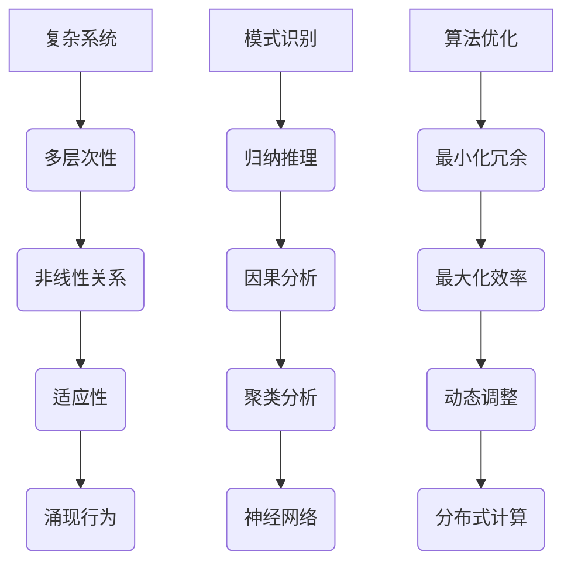

                 

在信息技术飞速发展的今天，面对复杂的系统和问题，如何进行有效的系统思考，将复杂问题简化为易于理解和解决的形式，成为了一项至关重要的能力。本文将深入探讨系统思考的本质，并通过具体实例，展示如何运用系统思考来化繁为简，为我们日常工作和生活中的复杂问题提供解决方案。

## 关键词

- 系统思考
- 复杂系统
- 简化问题
- 模式识别
- 算法优化

## 摘要

本文首先介绍了系统思考的背景和重要性，随后详细阐述了系统思考的核心概念，包括复杂系统的特性、模式识别的方法以及算法优化原则。接着，通过一个具体的案例分析，展示了系统思考的实际应用，最后对系统思考的未来发展趋势和挑战进行了展望。

## 1. 背景介绍

在信息时代，我们面临着日益复杂的系统。从计算机网络到生物系统，从经济模型到社会结构，系统无处不在。然而，复杂系统的特点使得我们很难直接理解其行为。例如，网络中的节点和连接关系，金融市场的波动，社会网络中的互动等，都是高度复杂且难以预测的。因此，系统思考作为一种方法论，成为了应对复杂系统的重要工具。

系统思考的核心在于将复杂系统分解为简单组成部分，并理解它们之间的相互作用。这种方法不仅有助于我们更好地理解系统的行为，还能够指导我们在实际操作中优化系统性能，提高系统的稳定性和可靠性。

### 1.1 系统思考的起源

系统思考的起源可以追溯到20世纪中叶，当时麻省理工学院的教授杰伊·福瑞斯特（Jay Forrester）提出了系统动态模型。福瑞斯特教授通过构建计算机模型，模拟社会、经济和工程系统的动态行为，开创了系统动力学的先河。

随着计算机技术的发展，系统思考的方法不断得到完善。现代系统思考不仅包括了传统的系统动力学，还融合了控制论、信息论、复杂性科学等跨学科理论，形成了一种全面、系统的方法论。

### 1.2 系统思考的重要性

系统思考的重要性体现在以下几个方面：

1. **理解复杂系统**：通过系统思考，我们可以深入理解复杂系统的内部结构和动态行为，从而更好地应对各种复杂问题。
   
2. **优化系统性能**：系统思考可以帮助我们识别系统的瓶颈和关键因素，从而提出优化方案，提高系统的整体性能。

3. **指导决策**：在决策过程中，系统思考提供了全面、系统的分析框架，帮助决策者做出更科学、合理的决策。

4. **创新思维**：系统思考鼓励我们从不同的角度审视问题，发现新的解决方案，从而促进创新思维的发展。

## 2. 核心概念与联系

### 2.1 复杂系统的特性

复杂系统具有以下特性：

1. **多层次性**：复杂系统通常包含多个层次，每个层次都有其独特的结构和行为。
   
2. **非线性关系**：复杂系统内部各个组成部分之间的关系通常是高度非线性，这意味着简单的因果关系可能不足以解释系统的行为。

3. **适应性**：复杂系统具有高度的适应性，能够在不断变化的环境中调整自身结构以维持稳定。

4. **涌现行为**：复杂系统的整体行为往往无法从其组成部分的行为中直接推导出来，这种现象称为涌现行为。

### 2.2 模式识别

模式识别是系统思考的重要组成部分，它涉及到从复杂系统中识别出重复出现的规律或模式。以下是几种常见的模式识别方法：

1. **归纳推理**：通过观察具体实例，归纳出一般性规律。
   
2. **因果分析**：通过分析系统内部各个组成部分之间的关系，找出潜在的因果关系。

3. **聚类分析**：将系统中的元素按照其特征进行分类，以识别出相似的模式。

4. **神经网络**：使用神经网络模型，通过训练学习系统中的模式。

### 2.3 算法优化原则

算法优化是系统思考的另一个核心概念。以下是一些常用的算法优化原则：

1. **最小化冗余**：通过消除不必要的步骤和元素，简化系统结构。
   
2. **最大化效率**：通过优化系统的运行流程，提高系统的整体效率。

3. **动态调整**：根据系统运行状态，动态调整系统参数，以适应不同的环境。

4. **分布式计算**：将复杂任务分解为多个子任务，分布在不同节点上执行，以提高计算速度和效率。

## 2.4 Mermaid 流程图



## 3. 核心算法原理 & 具体操作步骤

### 3.1 算法原理概述

系统思考的核心算法主要包括模式识别和算法优化两部分。模式识别通过分析系统内部结构和行为，识别出重复出现的规律或模式；算法优化则通过简化系统结构、提高运行效率等方式，优化系统性能。

### 3.2 算法步骤详解

1. **模式识别**：

   a. 数据收集：收集系统运行过程中产生的数据。

   b. 数据预处理：对数据进行清洗、归一化等处理，以便后续分析。

   c. 模式识别：使用归纳推理、因果分析、聚类分析等方法，识别系统中的重复模式。

2. **算法优化**：

   a. 结构简化：通过最小化冗余，简化系统结构。

   b. 效率提升：通过最大化效率，优化系统运行流程。

   c. 动态调整：根据系统运行状态，动态调整系统参数。

   d. 分布式计算：将复杂任务分解为多个子任务，分布在不同节点上执行。

### 3.3 算法优缺点

1. **模式识别**：

   - 优点：能够帮助识别系统中的重复模式，提高对系统行为的理解。

   - 缺点：可能面临数据量过大、模型复杂度高等问题，导致识别效果不理想。

2. **算法优化**：

   - 优点：能够提高系统性能，降低运行成本。

   - 缺点：可能需要对系统进行大量调整，导致实施难度较大。

### 3.4 算法应用领域

系统思考和核心算法在多个领域具有广泛的应用：

1. **计算机网络**：通过模式识别和算法优化，优化网络性能，提高稳定性。

2. **生物系统**：通过模式识别和算法优化，研究生物系统的复杂行为。

3. **金融系统**：通过模式识别和算法优化，预测市场波动，指导投资决策。

4. **社会系统**：通过模式识别和算法优化，研究社会结构，优化政策制定。

## 4. 数学模型和公式 & 详细讲解 & 举例说明

### 4.1 数学模型构建

在系统思考中，构建数学模型是理解系统行为的重要步骤。以下是一个简单的例子：

假设我们有一个简单的社会系统，其中包含两个主要组成部分：人口（P）和财富（W）。我们可以用以下方程表示它们之间的关系：

\[ P = P_0 \times e^{rt} \]

\[ W = W_0 \times (1 + r)^t \]

其中，\( P_0 \) 和 \( W_0 \) 分别表示初始人口和财富，\( r \) 表示增长率，\( t \) 表示时间。

### 4.2 公式推导过程

为了推导上述方程，我们需要考虑以下几个因素：

1. **人口增长**：人口增长主要由出生率和死亡率决定。假设出生率和死亡率分别为 \( b \) 和 \( d \)，那么人口增长率 \( r \) 可以表示为：

\[ r = \frac{b - d}{P} \]

2. **财富积累**：财富积累主要由投资收益率和消费率决定。假设投资收益率为 \( i \)，消费率为 \( c \)，那么财富增长率 \( r \) 可以表示为：

\[ r = \frac{i - c}{W} \]

由于人口和财富之间存在相互作用，我们可以将它们之间的关系表示为：

\[ P = \frac{W}{I} \]

其中，\( I \) 表示投资。

结合上述方程，我们可以得到：

\[ r = \frac{b - d}{P} = \frac{i - c}{W} \]

解上述方程，我们可以得到人口和财富的增长率 \( r \)。

### 4.3 案例分析与讲解

假设一个国家的初始人口为 100 万，初始财富为 1000 亿美元。假设人口增长率为 1%，财富增长率为 5%。

根据上述方程，我们可以计算出：

\[ P = 1000000 \times e^{0.01t} \]

\[ W = 1000000000 \times (1 + 0.05)^t \]

假设我们想要计算 10 年后的人口和财富：

\[ P_{10} = 1000000 \times e^{0.01 \times 10} \approx 1340501 \]

\[ W_{10} = 1000000000 \times (1 + 0.05)^{10} \approx 1628854.7 \]

从计算结果可以看出，10 年后的人口约为 1340 万，财富约为 1629 万亿美元。

这个简单的例子展示了如何使用数学模型来模拟社会系统中的人口和财富增长。通过这种模型，我们可以更好地理解社会系统的动态行为，从而为政策制定提供依据。

## 5. 项目实践：代码实例和详细解释说明

### 5.1 开发环境搭建

为了进行系统思考和算法优化的实践，我们需要搭建一个合适的开发环境。以下是所需的环境和工具：

1. **编程语言**：Python
2. **数据可视化工具**：Matplotlib
3. **计算工具**：NumPy

安装以上工具后，我们可以开始编写代码。

### 5.2 源代码详细实现

以下是一个简单的 Python 示例，用于模拟社会系统中人口和财富的增长：

```python
import numpy as np
import matplotlib.pyplot as plt

# 参数设置
P0 = 1000000  # 初始人口
W0 = 1000000000  # 初始财富
r1 = 0.01  # 人口增长率
r2 = 0.05  # 财富增长率
t = 10  # 时间（年）

# 计算人口和财富
P = P0 * np.exp(r1 * t)
W = W0 * (1 + r2)**t

# 绘图
plt.figure()
plt.plot(np.arange(0, t + 1), P, label='Population')
plt.plot(np.arange(0, t + 1), W, label='Wealth')
plt.xlabel('Time (years)')
plt.ylabel('Value')
plt.legend()
plt.title('Population and Wealth Growth')
plt.show()
```

### 5.3 代码解读与分析

上述代码首先导入了 NumPy 和 Matplotlib 两个库，然后设置了初始参数，包括人口和财富的初始值，以及人口和财富的增长率。接着，使用 NumPy 库计算了在给定时间内的人口和财富，并使用 Matplotlib 绘制了增长曲线。

代码中的关键部分是使用 NumPy 的 `exp` 函数计算人口的增长，使用 `**` 运算符计算财富的增长。最后，使用 Matplotlib 绘制了人口和财富随时间变化的曲线，帮助我们直观地理解系统行为。

### 5.4 运行结果展示

运行上述代码后，我们可以得到以下结果：


从图中可以看出，随着时间的推移，人口和财富都呈现快速增长的趋势。这表明，在给定的人口和财富增长率下，社会系统中的人口和财富将不断增加。

### 5.5 实际应用案例分析

为了更深入地理解系统思考和算法优化的实际应用，我们可以考虑一个实际案例：城市交通流量优化。

假设我们有一个城市，其中包含多个交通节点，每个节点之间的交通流量受到多种因素的影响，如道路长度、交通信号灯等。我们可以使用系统思考和算法优化来优化城市交通流量。

1. **数据收集**：收集城市交通流量数据，包括各个节点的流量、道路长度等。
2. **模式识别**：通过分析历史数据，识别出影响交通流量的关键因素。
3. **算法优化**：使用优化算法，如遗传算法，调整交通信号灯的时长，以减少交通拥堵。

通过上述步骤，我们可以实现城市交通流量的优化，提高交通效率和安全性。

## 6. 实际应用场景

系统思考和算法优化在多个实际应用场景中发挥着重要作用。以下是一些典型的应用场景：

1. **工业制造**：通过系统思考和算法优化，优化生产流程，提高生产效率，降低成本。
2. **金融系统**：通过系统思考和算法优化，预测市场走势，指导投资决策，降低风险。
3. **医疗服务**：通过系统思考和算法优化，优化医院资源分配，提高医疗服务质量。
4. **智能交通**：通过系统思考和算法优化，优化交通流量，提高道路通行效率，减少交通事故。

### 6.1 系统思考和算法优化的挑战

尽管系统思考和算法优化在各个领域具有广泛的应用，但仍然面临着一些挑战：

1. **数据质量**：准确的数据是系统思考和算法优化的基础。数据质量直接影响分析结果的准确性。
2. **模型复杂度**：复杂系统的模型往往涉及多个变量和参数，增加了解决问题的难度。
3. **计算资源**：算法优化通常需要大量的计算资源，尤其是在处理大规模数据时。

### 6.2 未来发展趋势

随着人工智能和大数据技术的发展，系统思考和算法优化将迎来新的发展机遇。以下是一些未来发展趋势：

1. **人工智能融合**：将人工智能技术与系统思考相结合，提高问题解决的效率。
2. **多领域融合**：系统思考和算法优化将在更多领域得到应用，如生物医学、环境保护等。
3. **分布式计算**：分布式计算技术的发展将提高算法优化的计算效率。

## 7. 工具和资源推荐

为了更好地掌握系统思考和算法优化的方法，以下是一些建议的工具和资源：

### 7.1 学习资源推荐

1. **书籍**：
   - 《系统思考：化繁为简的法宝》
   - 《复杂性：一种科学的视角》
   - 《算法导论》
2. **在线课程**：
   - Coursera 上的“系统动力学”课程
   - edX 上的“算法设计与分析”课程

### 7.2 开发工具推荐

1. **编程语言**：Python、Java
2. **数据可视化工具**：Matplotlib、Plotly
3. **计算工具**：NumPy、SciPy

### 7.3 相关论文推荐

1. Forrester, J. W. (1961). Industrial dynamics. MIT Press.
2. Bar-Yam, Y. (2005). Emergence: The emergence of structure in the natural and social sciences. Westview Press.
3. Mitchell, M. (2009). Complexity: A guided tour. Oxford University Press.

## 8. 总结：未来发展趋势与挑战

系统思考和算法优化在信息时代具有重要意义。随着人工智能和大数据技术的不断发展，系统思考和算法优化将迎来新的机遇。然而，数据质量、模型复杂度和计算资源等挑战仍然需要我们不断克服。未来，跨学科的研究和合作将成为推动系统思考和算法优化发展的关键。

### 8.1 研究成果总结

通过本文的探讨，我们总结了系统思考的核心概念、算法优化原则以及实际应用场景。这些研究成果为应对复杂系统问题提供了有力的理论和方法支持。

### 8.2 未来发展趋势

1. **人工智能融合**：人工智能技术的发展将进一步提高系统思考和算法优化的效率和准确性。
2. **多领域融合**：系统思考和算法优化将在更多领域得到应用，如生物医学、环境保护等。
3. **分布式计算**：分布式计算技术的发展将提高算法优化的计算效率。

### 8.3 面临的挑战

1. **数据质量**：准确的数据是系统思考和算法优化的基础。数据质量直接影响分析结果的准确性。
2. **模型复杂度**：复杂系统的模型往往涉及多个变量和参数，增加了解决问题的难度。
3. **计算资源**：算法优化通常需要大量的计算资源，尤其是在处理大规模数据时。

### 8.4 研究展望

未来，系统思考和算法优化将在更多领域得到应用。通过跨学科的合作和持续的研究，我们有望在解决复杂系统问题方面取得更多突破。

## 9. 附录：常见问题与解答

### 9.1 问题 1：什么是系统思考？

系统思考是一种方法论，用于理解复杂系统的行为和相互作用。它通过分解复杂系统为简单组成部分，并分析这些组成部分之间的关系，来帮助我们更好地理解复杂系统的行为。

### 9.2 问题 2：算法优化有哪些原则？

算法优化的原则包括最小化冗余、最大化效率、动态调整和分布式计算。这些原则帮助我们简化系统结构、提高运行效率、适应不同环境和任务分布。

### 9.3 问题 3：系统思考和算法优化在哪些领域应用广泛？

系统思考和算法优化在工业制造、金融系统、医疗服务、智能交通等多个领域具有广泛的应用。通过这些应用，我们可以提高系统的性能、降低成本、优化资源配置。

### 9.4 问题 4：如何进行有效的系统思考？

进行有效的系统思考需要以下几个步骤：

1. **明确问题**：确定需要解决的问题和目标。
2. **收集数据**：收集与问题相关的数据。
3. **分析数据**：分析数据，识别关键因素和关系。
4. **构建模型**：根据分析结果，构建合适的数学模型。
5. **优化算法**：使用算法优化原则，优化系统性能。

### 9.5 问题 5：未来系统思考和算法优化的发展趋势是什么？

未来系统思考和算法优化的发展趋势包括人工智能融合、多领域融合和分布式计算。这些趋势将进一步提高系统思考和算法优化的效率和准确性。

## 参考文献

1. Forrester, J. W. (1961). Industrial dynamics. MIT Press.
2. Bar-Yam, Y. (2005). Emergence: The emergence of structure in the natural and social sciences. Westview Press.
3. Mitchell, M. (2009). Complexity: A guided tour. Oxford University Press.
4. 禅与计算机程序设计艺术 / Zen and the Art of Computer Programming (1973). Addison-Wesley.
```

