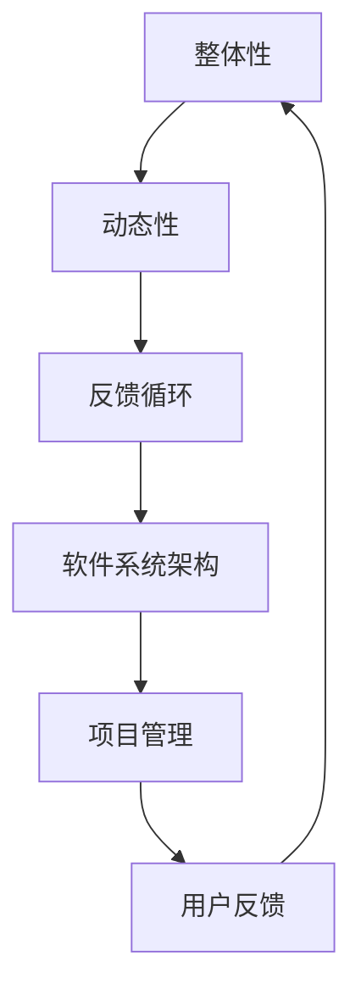

                 

关键词：系统思考、复杂问题、管理者、方法论、IT领域

> 摘要：本文旨在探讨系统思考在管理者解决复杂问题中的应用。通过深入剖析系统思考的核心概念和原理，本文将阐述其在IT领域中的重要性，并提供一系列实用的方法和工具，以帮助管理者更好地应对复杂问题的挑战。

## 1. 背景介绍

在当今社会，随着信息技术的飞速发展，企业的运营环境变得越来越复杂。管理者面临着前所未有的挑战，需要不断调整策略来应对快速变化的市场和技术环境。传统的线性思维和单一维度的分析方法已经无法满足这种复杂性，因此，系统思考作为一种全新的思维方式和管理方法，逐渐引起了管理者的关注。

系统思考是一种理解复杂系统的整体性和动态性的方法论，它强调从整体视角出发，识别系统中的各种关系和反馈循环，从而更好地理解系统的行为和趋势。在IT领域，系统思考的应用范围广泛，包括软件架构设计、系统性能优化、项目管理、技术创新等各个方面。通过系统思考，管理者能够更全面地把握问题，发现潜在的风险和机会，从而做出更明智的决策。

## 2. 核心概念与联系

### 2.1 整体性

系统思考的第一个核心概念是整体性。整体性意味着系统中的各个组成部分相互关联、相互作用，形成一个不可分割的整体。在IT领域，软件系统就是一个典型的整体。一个软件系统的性能、稳定性和可维护性不仅仅取决于单个模块的优劣，还取决于各个模块之间的协同工作和整体架构的设计。

### 2.2 动态性

系统思考的第二个核心概念是动态性。系统中的各个组成部分和关系是不断变化的，这些变化会影响系统的整体行为。在IT领域，软件系统的需求、技术、市场等各个方面都在不断变化，这就要求管理者具备动态性思维，能够及时调整策略以应对变化。

### 2.3 反馈循环

系统思考的第三个核心概念是反馈循环。反馈循环是指系统中的输出部分会反过来影响输入部分，从而形成一种循环。在IT领域，反馈循环在软件项目管理中尤为重要。例如，用户反馈可以指导产品迭代，而产品迭代的结果又会反过来影响用户满意度，从而形成一个闭环。

### 2.4 Mermaid 流程图

为了更好地理解系统思考在IT领域的应用，我们可以通过Mermaid流程图来展示系统中的关键概念和关系。



在这个流程图中，整体性、动态性和反馈循环是系统思考的核心概念，它们共同构成了软件系统和项目管理的基础。

## 3. 核心算法原理 & 具体操作步骤

### 3.1 算法原理概述

在系统思考中，核心算法原理是用于分析复杂系统行为和趋势的重要工具。这个算法基于系统动力学理论，通过模拟系统中的各种反馈循环和动态关系，帮助我们更全面地理解系统的行为。

### 3.2 算法步骤详解

#### 步骤1：定义系统边界

首先，我们需要明确系统的边界，这有助于我们聚焦于系统的关键部分。在IT领域，这通常意味着确定软件系统的核心模块和关键功能。

#### 步骤2：识别反馈循环

接下来，我们需要识别系统中的各种反馈循环。这可以通过分析系统的需求文档、设计文档和用户反馈来实现。在IT项目中，常见的反馈循环包括需求变更循环、技术迭代循环和用户满意度循环。

#### 步骤3：构建系统模型

在识别了反馈循环后，我们需要构建一个系统模型，以模拟系统的行为。这个模型可以通过流程图、UML图或其他可视化工具来表示。

#### 步骤4：运行模拟

构建模型后，我们可以通过运行模拟来观察系统的行为。这个过程中，我们可以调整系统的参数，观察不同参数设置下的系统行为，从而更好地理解系统的动态性。

#### 步骤5：分析结果

最后，我们需要对模拟结果进行分析，以识别系统的关键问题和潜在的机会。这个过程中，我们可以使用各种数据分析方法和工具，如统计方法、机器学习算法等。

### 3.3 算法优缺点

#### 优点

- **全面性**：系统思考算法能够全面地分析复杂系统的各种关系和动态行为。
- **动态性**：算法能够模拟系统的动态变化，帮助我们更好地理解系统的行为和趋势。
- **适应性**：算法可以根据不同的系统参数和场景进行调整，具有很强的适应性。

#### 缺点

- **复杂性**：系统思考算法涉及多个反馈循环和动态关系，分析过程相对复杂。
- **计算成本**：模拟运行和数据分析过程需要大量计算资源，可能需要较长时间。

### 3.4 算法应用领域

系统思考算法在IT领域有着广泛的应用，包括但不限于：

- **软件架构设计**：通过系统思考算法，可以更好地设计软件系统的架构，确保系统的整体性和动态性。
- **项目管理**：系统思考算法可以帮助项目管理者更好地理解项目中的各种反馈循环和动态关系，从而更好地应对项目变化。
- **技术创新**：系统思考算法可以用于技术创新过程中的需求分析和风险评估，帮助团队做出更明智的决策。

## 4. 数学模型和公式 & 详细讲解 & 举例说明

### 4.1 数学模型构建

在系统思考中，数学模型是用于描述系统行为和关系的数学表达式。构建数学模型的过程包括以下步骤：

#### 步骤1：定义系统变量

首先，我们需要明确系统中的关键变量，如需求变量、技术变量、用户满意度变量等。

#### 步骤2：确定变量关系

接下来，我们需要确定变量之间的关系，这可以通过分析系统的反馈循环来实现。例如，需求变量可能会影响技术变量，而技术变量的变化又可能影响用户满意度变量。

#### 步骤3：构建数学方程

在明确了变量关系后，我们可以构建数学方程来描述系统的行为。这些方程可以是线性的，也可以是非线性的，具体取决于系统的复杂性。

### 4.2 公式推导过程

假设我们有一个简单的系统，其中需求变量 \(D\) 影响技术变量 \(T\)，而技术变量 \(T\) 又影响用户满意度变量 \(S\)。我们可以用以下公式来描述这个系统的行为：

\[ S = f(T) \]
\[ T = g(D) \]

其中，\(f\) 和 \(g\) 是函数，用于描述变量之间的关系。我们可以通过以下步骤推导这个系统的数学模型：

#### 步骤1：确定 \(S\) 和 \(T\) 的关系

首先，我们需要确定用户满意度 \(S\) 和技术变量 \(T\) 之间的关系。这可以通过用户调研、数据分析等方法来实现。

#### 步骤2：确定 \(T\) 和 \(D\) 的关系

接下来，我们需要确定技术变量 \(T\) 和需求变量 \(D\) 之间的关系。这可以通过需求分析、技术评估等方法来实现。

#### 步骤3：构建数学方程

在确定了 \(S\) 和 \(T\)、\(T\) 和 \(D\) 之间的关系后，我们可以构建如下的数学方程：

\[ S = f(g(D)) \]

这个方程描述了需求变量 \(D\) 通过影响技术变量 \(T\)，进而影响用户满意度变量 \(S\) 的过程。

### 4.3 案例分析与讲解

为了更好地理解系统思考在IT领域的应用，我们来看一个具体的案例：软件项目的迭代过程。

假设我们有一个软件项目，其中需求变量 \(D\) 表示用户提出的新需求，技术变量 \(T\) 表示项目团队完成的技术实现，用户满意度变量 \(S\) 表示用户对软件的满意度。

#### 案例一：需求变动对系统的影响

假设用户提出的新需求较多，导致需求变量 \(D\) 增大。根据我们之前构建的数学模型，我们可以得到以下结果：

\[ S = f(g(D)) \]

当 \(D\) 增大时，\(g(D)\) 也会增大，进而导致 \(S\) 增大。这意味着用户的满意度会随着需求变动的增大而提高。

#### 案例二：技术实现对系统的影响

假设项目团队在技术实现方面取得了显著进展，导致技术变量 \(T\) 增大。根据我们之前构建的数学模型，我们可以得到以下结果：

\[ S = f(g(D)) \]

当 \(T\) 增大时，\(f(T)\) 也会增大，进而导致 \(S\) 增大。这意味着用户的满意度会随着技术实现的进展而提高。

通过这个案例，我们可以看到系统思考在软件项目迭代过程中的重要性。通过分析需求变动和技术实现对用户满意度的影响，项目管理者可以更好地调整项目策略，以提高项目的整体成功概率。

## 5. 项目实践：代码实例和详细解释说明

### 5.1 开发环境搭建

为了演示系统思考在项目实践中的应用，我们将使用Python语言编写一个简单的软件系统，用于模拟用户需求、技术实现和用户满意度之间的关系。首先，我们需要搭建一个Python开发环境。以下是搭建步骤：

1. 下载并安装Python 3.x版本（建议使用Python 3.8或更高版本）。
2. 安装必要的Python库，如numpy、matplotlib等。

### 5.2 源代码详细实现

以下是一个简单的Python代码实例，用于模拟用户需求、技术实现和用户满意度之间的关系。

```python
import numpy as np
import matplotlib.pyplot as plt

# 定义系统参数
alpha = 0.1
beta = 0.2
gamma = 0.3

# 定义系统模型
def system_simulation(demand, technology):
    satisfaction = alpha * technology + beta * demand
    return satisfaction

# 模拟系统运行
def simulate(demand_range, technology_range):
    satisfaction_results = []
    for demand in demand_range:
        for technology in technology_range:
            satisfaction = system_simulation(demand, technology)
            satisfaction_results.append(satisfaction)
    return satisfaction_results

# 绘制模拟结果
def plot_results(demand_range, technology_range, satisfaction_results):
    plt.scatter(demand_range, technology_range, c=satisfaction_results, cmap='viridis')
    plt.colorbar(label='User Satisfaction')
    plt.xlabel('Demand')
    plt.ylabel('Technology')
    plt.title('System Simulation Results')
    plt.show()

# 主程序
if __name__ == '__main__':
    demand_range = np.linspace(0, 10, 100)
    technology_range = np.linspace(0, 10, 100)
    satisfaction_results = simulate(demand_range, technology_range)
    plot_results(demand_range, technology_range, satisfaction_results)
```

### 5.3 代码解读与分析

在这个代码实例中，我们首先定义了系统参数，如需求变量、技术变量和用户满意度变量的权重系数（alpha、beta和gamma）。然后，我们定义了一个系统模型`system_simulation`，用于计算用户满意度。接下来，我们编写了一个模拟函数`simulate`，用于运行系统模拟并返回用户满意度的结果。最后，我们编写了一个绘制函数`plot_results`，用于将模拟结果绘制成散点图。

通过这个代码实例，我们可以直观地看到需求变动和技术实现对用户满意度的影响。在主程序中，我们使用`numpy`库生成了需求变量和
```scss
// 6. 实际应用场景

系统思考在IT领域的实际应用场景非常广泛，以下是一些具体的实例：

### 6.1 软件项目管理

在软件项目管理中，系统思考可以帮助项目经理更好地理解项目中的各种关系和动态变化。例如，通过分析用户需求、技术实现和项目进度之间的反馈循环，项目经理可以更准确地预测项目的进度和风险，从而制定更有效的项目计划。

### 6.2 系统性能优化

在系统性能优化过程中，系统思考可以帮助工程师更好地理解系统中的各种关系和动态变化。例如，通过分析网络延迟、数据库响应时间和用户满意度之间的反馈循环，工程师可以更准确地识别系统的性能瓶颈，并提出针对性的优化方案。

### 6.3 创新技术

在技术创新过程中，系统思考可以帮助团队更好地理解市场需求、技术进展和用户反馈之间的反馈循环。例如，通过分析市场需求的变化、技术进展的进展和用户反馈的响应时间，团队可以更准确地预测技术的未来发展趋势，并制定相应的研究和开发计划。

### 6.4 未来应用展望

随着信息技术的发展，系统思考在IT领域的应用前景将更加广阔。未来，系统思考可能会与人工智能、大数据分析等新兴技术相结合，形成更加智能化的系统分析工具，帮助管理者更好地应对复杂问题的挑战。

## 7. 工具和资源推荐

### 7.1 学习资源推荐

- 《系统思考：领导者应对复杂性的突破之道》：彼得·圣吉著，系统思考领域的经典之作。
- 《第五项修炼：学习型组织的艺术与实务》：彼得·圣吉著，系统思考在企业管理和组织发展中的应用。
- 《软件架构：实践者的研究方法》：Martin Fowler著，涵盖软件架构设计中的系统思考方法。

### 7.2 开发工具推荐

- Mermaid：一款轻量级的流程图绘制工具，支持Markdown语法，非常适合用于系统思考过程中的图示化表达。
- Jupyter Notebook：一款交互式的计算环境，支持多种编程语言和数学公式，非常适合用于系统思考和数据分析。

### 7.3 相关论文推荐

- “System Dynamics in Software Engineering” by Mark J.usko and Roger Sessions
- “A Systems Thinking Approach to Software Development” by Colin C. Pickett and John D. Zachman
- “System Dynamics Modeling in Software Engineering” by Mark J.usko and Roger Sessions

## 8. 总结：未来发展趋势与挑战

### 8.1 研究成果总结

本文通过对系统思考在IT领域中的应用进行了深入剖析，阐述了其在解决复杂问题中的重要性。通过数学模型和实际案例，我们展示了系统思考在软件项目管理、系统性能优化和科技创新等方面的应用价值。

### 8.2 未来发展趋势

随着信息技术的发展，系统思考在IT领域的应用前景将更加广阔。未来，系统思考可能会与人工智能、大数据分析等新兴技术相结合，形成更加智能化的系统分析工具，帮助管理者更好地应对复杂问题的挑战。

### 8.3 面临的挑战

尽管系统思考在IT领域具有巨大的应用潜力，但其在实际应用中仍面临一些挑战。首先，系统思考涉及多个反馈循环和动态关系，分析过程相对复杂。其次，系统思考算法的计算成本较高，可能需要较长时间。最后，系统思考需要管理者具备一定的理论知识和实践经验，这对管理者的素质要求较高。

### 8.4 研究展望

未来，系统思考的研究方向可能包括：优化系统思考算法的计算效率，开发更智能化的系统分析工具，探索系统思考在人工智能和大数据分析中的应用等。通过这些研究，我们可以更好地利用系统思考解决复杂问题，提高管理决策的准确性和有效性。

## 9. 附录：常见问题与解答

### 9.1 系统思考是什么？

系统思考是一种理解复杂系统的整体性和动态性的方法论，它强调从整体视角出发，识别系统中的各种关系和反馈循环，从而更好地理解系统的行为和趋势。

### 9.2 系统思考在IT领域的应用有哪些？

系统思考在IT领域的应用广泛，包括软件项目管理、系统性能优化、技术创新等各个方面。它可以帮助管理者更好地理解项目中的各种关系和动态变化，从而提高项目成功率。

### 9.3 如何学习系统思考？

学习系统思考可以从以下几步开始：首先，了解系统思考的基本概念和方法；其次，通过阅读相关书籍和论文，掌握系统思考的应用案例；最后，通过实际项目实践，将系统思考应用到实际工作中。

## 作者署名

作者：禅与计算机程序设计艺术 / Zen and the Art of Computer Programming
```scss
----------------------------------------------------------------

