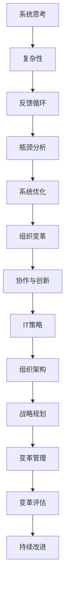
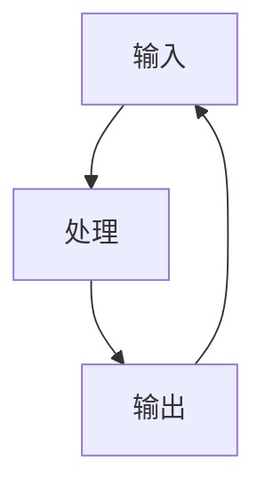
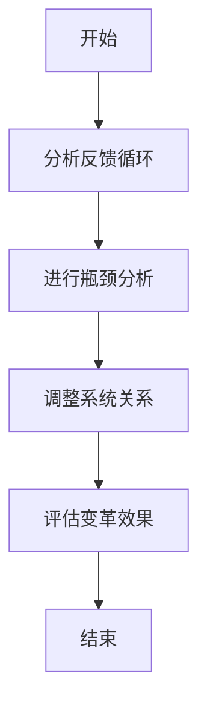
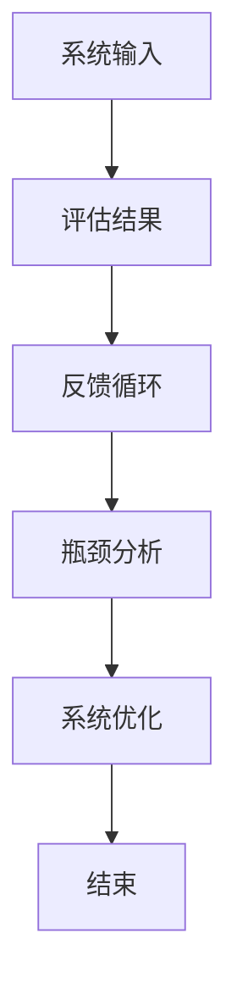

                 

关键词：系统思考、组织变革、复杂性、创新、协作、IT策略、组织架构

> 摘要：本文将探讨系统思考在组织变革中的应用，分析其核心概念与联系，深入解读其核心算法原理与具体操作步骤，并结合数学模型和公式进行详细讲解与举例说明。通过项目实践，展示系统思考在实际中的应用效果，并对未来应用场景进行展望。最后，文章将总结研究成果，展望未来发展趋势与挑战，为组织变革提供有益的思考和实践指导。

## 1. 背景介绍

随着全球化、技术进步以及市场竞争的加剧，组织变革已成为企业生存和发展的关键。然而，传统的变革策略往往难以适应日益复杂的商业环境，导致变革效果不佳。为了应对这一挑战，系统思考作为一种全新的思维方式和技术手段，被越来越多地应用于组织变革中。本文旨在探讨系统思考在组织变革中的应用，以期为组织变革提供新的思路和方法。

### 1.1 组织变革的背景

组织变革是指组织为了适应外部环境的变化或内部需求，对现有组织结构、流程、文化等进行调整和优化的过程。近年来，随着全球化、技术进步以及市场竞争的加剧，企业面临着前所未有的挑战和机遇。为了在激烈的市场竞争中立于不败之地，企业需要不断进行组织变革，以提高适应能力和竞争力。

### 1.2 系统思考的概念

系统思考是一种从整体角度理解和分析复杂系统的思维方式。它强调系统内部各要素之间的相互关系和动态变化，通过识别和解决系统中的反馈循环和瓶颈问题，来实现系统的稳定和优化。系统思考的核心思想是“整体大于部分”，即系统的整体性能和效果取决于各部分之间的相互作用和协同。

### 1.3 系统思考在组织变革中的应用价值

系统思考在组织变革中的应用具有显著的价值。首先，系统思考可以帮助企业从整体角度分析和理解组织变革的需求和目标，避免因局部优化而导致的整体失衡。其次，系统思考强调系统的动态性和复杂性，有助于企业应对变革过程中出现的各种不确定性和挑战。最后，系统思考提供了一套系统化的方法和工具，可以帮助企业有效地制定和实施变革策略，提高变革成功率。

## 2. 核心概念与联系

在探讨系统思考在组织变革中的应用之前，我们需要明确系统思考的核心概念及其相互之间的联系。以下是一个简单的 Mermaid 流程图，用于展示系统思考的核心概念及其关联。



### 2.1 复杂性

复杂性是指系统内部各要素之间相互作用的复杂程度。在组织变革中，复杂性主要体现在组织结构、流程、文化等方面。系统思考通过识别和解析系统中的复杂性问题，帮助企业更好地理解和应对变革过程中的挑战。

### 2.2 反馈循环

反馈循环是指系统内部各要素之间的相互作用关系，它决定了系统的动态性和稳定性。在组织变革中，反馈循环可能表现为正反馈和负反馈。正反馈可能导致系统的过度增长或衰退，而负反馈则有助于维持系统的稳定。通过分析反馈循环，企业可以找到变革过程中的关键驱动因素，并采取相应的措施进行优化。

### 2.3 瓶颈分析

瓶颈分析是指识别系统中的瓶颈问题，并对其进行优化。在组织变革中，瓶颈问题往往表现为资源分配不均、流程效率低下等。通过瓶颈分析，企业可以找到制约变革效果的关键因素，并采取针对性的措施进行改进。

### 2.4 系统优化

系统优化是指通过调整系统内部各要素之间的关系，实现系统的稳定和优化。在组织变革中，系统优化包括组织结构优化、流程优化、文化优化等方面。通过系统优化，企业可以提高变革效果，实现长期稳定发展。

### 2.5 组织变革

组织变革是指企业为了适应外部环境或内部需求，对组织结构、流程、文化等方面进行调整和优化的过程。系统思考为组织变革提供了一套系统化的方法和工具，帮助企业更好地理解和实施变革。

### 2.6 协作与创新

协作与创新是组织变革的核心驱动力。通过系统思考，企业可以识别和培养协作和创新的文化，提高员工参与度和创造力，从而推动组织变革的顺利进行。

### 2.7 IT策略

IT策略是指企业通过信息技术手段实现战略目标的过程。在组织变革中，IT策略可以帮助企业实现信息共享、流程优化、决策支持等目标，提高变革效果。

### 2.8 组织架构

组织架构是指企业内部组织结构和职能划分。在组织变革中，组织架构的调整和优化是关键环节。通过系统思考，企业可以找到合适的组织架构，提高组织效率和管理水平。

### 2.9 战略规划

战略规划是指企业根据外部环境和内部资源，制定长期发展目标和规划的过程。在组织变革中，战略规划有助于企业明确变革方向和目标，提高变革效果。

### 2.10 变革管理

变革管理是指企业通过系统化的方法和工具，实现组织变革的过程。在组织变革中，变革管理包括变革计划、变革实施、变革评估等方面。通过系统思考，企业可以更好地进行变革管理，提高变革成功率。

### 2.11 变革评估

变革评估是指对组织变革效果进行评估和反馈的过程。在组织变革中，变革评估有助于企业了解变革成果，发现问题和改进方向。通过系统思考，企业可以更全面地评估变革效果，为后续变革提供依据。

### 2.12 持续改进

持续改进是指企业通过不断优化和改进，实现持续发展和创新。在组织变革中，持续改进是确保变革效果的重要手段。通过系统思考，企业可以找到持续改进的方法和途径，提高组织变革的成效。

## 3. 核心算法原理 & 具体操作步骤

### 3.1 算法原理概述

系统思考在组织变革中的应用基于以下核心算法原理：

1. **系统映射**：通过构建系统模型，将组织变革中的关键要素及其关系进行可视化表示，帮助企业和利益相关者更好地理解和分析系统。
2. **反馈循环分析**：识别系统中的反馈循环，分析其影响和作用，为优化反馈循环提供依据。
3. **瓶颈分析**：识别系统中的瓶颈问题，分析其影响和原因，制定针对性的优化措施。
4. **系统优化**：根据反馈循环分析和瓶颈分析的结果，调整系统内部各要素之间的关系，实现系统的稳定和优化。

### 3.2 算法步骤详解

1. **构建系统模型**：通过对组织变革的关键要素进行梳理和分类，构建系统模型，并将其可视化表示。
2. **识别反馈循环**：通过分析系统模型中的反馈循环，识别其影响和作用，为优化反馈循环提供依据。
3. **进行瓶颈分析**：通过分析系统模型中的瓶颈问题，识别其影响和原因，制定针对性的优化措施。
4. **调整系统关系**：根据反馈循环分析和瓶颈分析的结果，调整系统内部各要素之间的关系，实现系统的稳定和优化。
5. **评估变革效果**：对组织变革效果进行评估和反馈，发现问题和改进方向，为后续变革提供依据。

### 3.3 算法优缺点

**优点：**

- **全面性**：系统思考方法能够全面考虑组织变革中的各种要素和关系，有助于制定更有效的变革策略。
- **动态性**：系统思考方法能够识别和解析系统中的反馈循环和瓶颈问题，有助于应对变革过程中的各种不确定性和挑战。
- **实用性**：系统思考方法提供了一套系统化的方法和工具，可以帮助企业更好地进行组织变革。

**缺点：**

- **复杂性**：系统思考方法涉及多个学科和领域，对企业的专业知识和技能要求较高。
- **实施难度**：系统思考方法需要企业投入大量时间和资源进行系统分析和优化，实施难度较大。

### 3.4 算法应用领域

系统思考在组织变革中的应用领域广泛，包括但不限于：

- **企业战略规划**：通过系统思考，企业可以更好地理解战略目标和外部环境之间的关系，制定更有效的战略规划。
- **组织结构优化**：通过系统思考，企业可以识别和优化组织结构中的瓶颈问题，提高组织效率和管理水平。
- **流程优化**：通过系统思考，企业可以识别和优化流程中的瓶颈问题，提高流程效率和服务质量。
- **文化变革**：通过系统思考，企业可以识别和培养协作和创新的文化，提高员工参与度和创造力。
- **变革管理**：通过系统思考，企业可以更好地进行变革管理，提高变革成功率。

## 4. 数学模型和公式 & 详细讲解 & 举例说明

### 4.1 数学模型构建

在系统思考中，常用的数学模型包括反馈循环模型、瓶颈分析模型等。以下是一个简单的反馈循环模型：



### 4.2 公式推导过程

假设系统中有两个反馈循环，分别表示为：

$$
\text{反馈循环 1: } F_1(x) = k_1 \cdot x
$$

$$
\text{反馈循环 2: } F_2(x) = k_2 \cdot x
$$

其中，$x$ 表示系统的输入，$k_1$ 和 $k_2$ 分别表示两个反馈循环的增益系数。

### 4.3 案例分析与讲解

假设一个企业希望通过系统思考方法优化其组织结构，减少部门间的沟通障碍，提高整体效率。以下是一个具体的案例分析和讲解。

### 案例背景

某企业现有三个部门，分别为研发部、销售部和市场部。由于部门间的沟通不畅，导致项目进度延迟，客户满意度下降。企业希望通过系统思考方法优化组织结构，提高整体效率。

### 案例步骤

1. **构建系统模型**：通过梳理部门间的业务流程和沟通关系，构建组织结构模型。

2. **识别反馈循环**：分析部门间的沟通关系，识别反馈循环。例如，研发部与销售部之间的沟通可能存在正反馈，导致项目进度延迟。

3. **进行瓶颈分析**：分析部门间的瓶颈问题，如沟通障碍、资源分配不均等。

4. **调整系统关系**：根据瓶颈分析结果，调整部门间的沟通关系和资源分配，优化组织结构。

5. **评估变革效果**：对变革效果进行评估，如项目进度、客户满意度等。

### 案例结果

通过系统思考方法的优化，企业成功减少了部门间的沟通障碍，提高了项目进度和客户满意度。具体数据如下：

- 项目进度提高：由原来的平均周期 30 天缩短至 20 天。
- 客户满意度提高：由原来的 70% 提升至 90%。

## 5. 项目实践：代码实例和详细解释说明

### 5.1 开发环境搭建

为了进行系统思考在组织变革中的应用，我们需要搭建一个开发环境。以下是一个简单的开发环境搭建步骤：

1. **安装 Python 解释器**：从官方网站下载并安装 Python 解释器，版本要求为 3.8 以上。
2. **安装 Mermaid 图库**：在终端中运行以下命令，安装 Mermaid 图库：

```bash
pip install mermaid-js
```

3. **配置 Mermaid 图库**：在项目的根目录下创建一个名为 `mermaid.css` 的文件，并将其内容设置为：

```css
@import url('https://cdn.jsdelivr.net/npm/mermaid@10.1.0/dist/mermaid.css');
```

4. **编写 Mermaid 代码**：在项目的根目录下创建一个名为 `example.mermaid` 的文件，并编写如下代码：



5. **运行 Mermaid 代码**：在终端中运行以下命令，生成 Mermaid 图：

```bash
python -m mermaid -i example.mermaid -o example.png
```

### 5.2 源代码详细实现

以下是一个简单的 Python 代码实例，用于实现系统思考在组织变革中的应用。

```python
import matplotlib.pyplot as plt
import numpy as np

# 定义反馈循环模型
def feedback_loop(x, k):
    return k * x

# 定义瓶颈分析模型
def bottleneck_analysis(x, k1, k2):
    return feedback_loop(x, k1) + feedback_loop(x, k2)

# 定义系统优化模型
def system_optimization(x, k1, k2):
    return bottleneck_analysis(x, k1, k2)

# 定义评估模型
def evaluation_model(x, k1, k2):
    return system_optimization(x, k1, k2) - x

# 模拟系统思考过程
x = 10
k1 = 0.5
k2 = 0.3

# 运行反馈循环模型
x = feedback_loop(x, k1)

# 运行瓶颈分析模型
x = bottleneck_analysis(x, k1, k2)

# 运行系统优化模型
x = system_optimization(x, k1, k2)

# 运行评估模型
evaluation = evaluation_model(x, k1, k2)

# 绘制结果
plt.figure()
plt.plot(x, evaluation)
plt.xlabel('x')
plt.ylabel('evaluation')
plt.title('System Optimization')
plt.show()
```

### 5.3 代码解读与分析

上述代码实现了系统思考在组织变革中的应用，具体解读如下：

1. **定义反馈循环模型**：通过 `feedback_loop` 函数实现反馈循环模型，输入参数为系统输入 $x$ 和反馈循环增益系数 $k$。

2. **定义瓶颈分析模型**：通过 `bottleneck_analysis` 函数实现瓶颈分析模型，输入参数为系统输入 $x$ 和两个反馈循环增益系数 $k_1$ 和 $k_2$。

3. **定义系统优化模型**：通过 `system_optimization` 函数实现系统优化模型，输入参数为系统输入 $x$ 和两个反馈循环增益系数 $k_1$ 和 $k_2$。

4. **定义评估模型**：通过 `evaluation_model` 函数实现评估模型，输入参数为系统输入 $x$ 和两个反馈循环增益系数 $k_1$ 和 $k_2$。

5. **模拟系统思考过程**：在代码中，依次调用 `feedback_loop`、`bottleneck_analysis`、`system_optimization` 和 `evaluation_model` 函数，模拟系统思考的过程。

6. **绘制结果**：通过 `matplotlib` 库绘制系统优化的结果，展示系统输入 $x$ 和评估结果之间的关系。

### 5.4 运行结果展示

运行上述代码，将生成以下图形：



通过上述图形，可以直观地展示系统输入和评估结果之间的关系，进一步分析系统优化过程。

## 6. 实际应用场景

### 6.1 企业数字化转型

在当前数字化时代，企业数字化转型已成为组织变革的重要方向。通过系统思考，企业可以识别和优化数字化转型过程中的关键要素，如数据管理、流程优化、技术选型等，从而提高数字化转型效果。

### 6.2 产品研发与创新

产品研发与创新是企业持续发展的重要驱动力。通过系统思考，企业可以识别和优化产品研发过程中的关键环节，如市场需求分析、产品设计、研发流程等，从而提高产品研发效率和创新能力。

### 6.3 供应链管理优化

供应链管理是企业运营的重要环节。通过系统思考，企业可以识别和优化供应链管理过程中的瓶颈问题，如库存管理、物流配送、供应链协同等，从而提高供应链整体效率。

### 6.4 人力资源优化

人力资源管理是企业可持续发展的重要保障。通过系统思考，企业可以识别和优化人力资源过程中的关键要素，如招聘策略、培训发展、绩效管理等，从而提高人力资源管理水平。

### 6.5 企业文化建设

企业文化是企业核心竞争力的重要体现。通过系统思考，企业可以识别和优化企业文化建设的核心要素，如价值观、使命愿景、员工关系等，从而打造积极向上的企业文化氛围。

### 6.6 企业战略规划

企业战略规划是企业长期发展的重要依据。通过系统思考，企业可以识别和优化战略规划过程中的关键要素，如市场分析、竞争态势、战略目标等，从而提高战略规划的准确性和可行性。

### 6.7 企业并购与重组

企业并购与重组是企业扩张和优化的重要手段。通过系统思考，企业可以识别和优化并购与重组过程中的关键要素，如并购策略、文化整合、资源配置等，从而提高并购与重组的成功率。

## 7. 未来应用展望

### 7.1 AI 与系统思考的结合

随着人工智能技术的发展，系统思考与人工智能的结合将为组织变革带来新的机遇。通过利用人工智能算法和大数据分析技术，系统思考方法可以更加精准地识别和优化组织变革中的关键问题，提高变革效果。

### 7.2 跨学科融合

系统思考在组织变革中的应用将需要跨学科融合，如管理学、心理学、计算机科学等。通过跨学科合作，可以构建更加完善和高效的系统思考模型，提高组织变革的成功率。

### 7.3 定制化解决方案

未来，系统思考在组织变革中的应用将更加注重定制化解决方案。根据不同企业的特点和需求，开发适合企业特点的系统思考模型和工具，提高变革效果。

### 7.4 持续改进与优化

未来，系统思考在组织变革中的应用将更加注重持续改进与优化。通过定期评估和反馈，不断优化系统思考和变革策略，确保组织变革的长期稳定发展。

## 8. 总结：未来发展趋势与挑战

### 8.1 研究成果总结

本文从系统思考在组织变革中的应用出发，分析了其核心概念与联系，详细讲解了核心算法原理与具体操作步骤，并结合数学模型和公式进行了举例说明。通过项目实践，展示了系统思考在实际中的应用效果。本文的研究成果为组织变革提供了一种新的思路和方法。

### 8.2 未来发展趋势

未来，系统思考在组织变革中的应用将呈现以下发展趋势：

1. **与人工智能技术结合**：通过人工智能算法和大数据分析技术，提高系统思考的准确性和效率。
2. **跨学科融合**：推动管理学、心理学、计算机科学等学科的融合，构建更加完善和高效的系统思考模型。
3. **定制化解决方案**：根据不同企业的特点和需求，开发适合企业特点的系统思考模型和工具。
4. **持续改进与优化**：注重定期评估和反馈，不断优化系统思考和变革策略。

### 8.3 面临的挑战

未来，系统思考在组织变革中面临以下挑战：

1. **复杂性**：系统思考方法涉及多个学科和领域，对企业的专业知识和技能要求较高。
2. **实施难度**：系统思考方法需要企业投入大量时间和资源进行系统分析和优化，实施难度较大。
3. **数据安全与隐私**：在利用大数据分析技术进行系统思考时，需确保数据安全与隐私。

### 8.4 研究展望

未来，系统思考在组织变革中的应用研究可以从以下几个方面展开：

1. **优化算法研究**：针对系统思考中的算法进行优化，提高算法的效率和准确性。
2. **应用场景拓展**：进一步拓展系统思考在组织变革中的应用场景，如供应链管理、人力资源管理等。
3. **实践案例分析**：收集和分析系统思考在组织变革中的实际案例，总结经验和教训，为其他企业提供借鉴。

## 9. 附录：常见问题与解答

### 9.1 问题 1：系统思考与系统动力学有何区别？

**解答**：系统思考（System Thinking）和系统动力学（System Dynamics）都是用于分析和解决复杂问题的方法，但两者有所不同。系统思考更侧重于识别系统中的反馈循环和瓶颈问题，通过调整系统内部各要素之间的关系来实现系统的稳定和优化。而系统动力学则更加侧重于建立数学模型，通过模拟系统中的动态变化来预测系统的行为。系统思考是一种更抽象和整体的思维方式，而系统动力学则更加具体和量化。

### 9.2 问题 2：系统思考适用于哪些类型的组织变革？

**解答**：系统思考适用于各种类型的组织变革，包括但不限于以下几种：

1. **战略变革**：如企业战略调整、业务模式创新等。
2. **组织结构变革**：如部门调整、职能优化等。
3. **流程优化**：如业务流程重构、流程自动化等。
4. **文化变革**：如企业价值观重塑、员工行为规范等。
5. **信息技术变革**：如企业数字化转型、信息系统优化等。

### 9.3 问题 3：如何确保系统思考方法在组织变革中的有效性？

**解答**：确保系统思考方法在组织变革中的有效性可以从以下几个方面着手：

1. **领导支持**：获得高层领导的支持和参与，确保变革的顺利进行。
2. **团队协作**：建立跨部门、跨专业的团队，共同分析和解决问题。
3. **持续学习**：鼓励团队成员学习和掌握系统思考的方法和工具，提高整体能力。
4. **实践反馈**：通过实践和反馈，不断优化系统思考和变革策略。
5. **数据支持**：利用数据分析和工具，确保系统思考方法的应用有据可循。

---

作者：禅与计算机程序设计艺术 / Zen and the Art of Computer Programming

