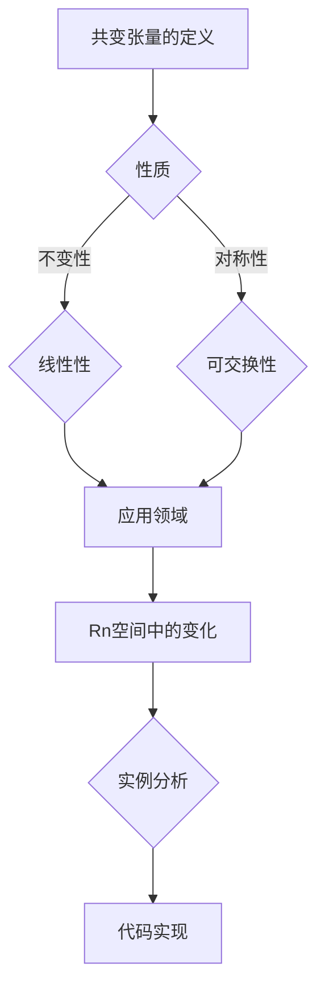
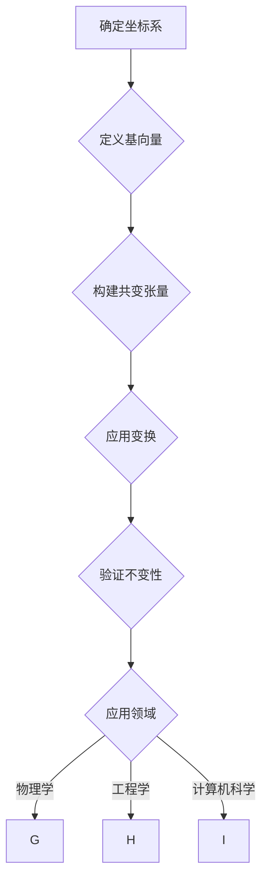

                 

关键词：线性代数，共变张量，Rn空间，数学模型，算法原理，应用领域，代码实例

> 摘要：本文深入探讨了线性代数中的共变张量概念，特别是在Rn空间中的应用。通过介绍共变张量的核心概念与联系，阐述其算法原理与数学模型，结合实际项目实践，详细分析了共变张量的使用方法和代码实现。本文旨在为读者提供关于共变张量的全面理解，帮助其在实际应用中更好地运用这一数学工具。

## 1. 背景介绍

线性代数是数学中的一个重要分支，广泛应用于科学、工程、经济学、计算机科学等多个领域。在处理多维数据时，共变张量作为一种重要的数学工具，发挥着关键作用。共变张量是线性代数中的一个高级概念，其定义和性质对于理解复杂系统的运作机制至关重要。

共变张量最早由法国数学家皮埃尔·西蒙·拉普拉斯在19世纪初提出，并在后续的数学研究和应用中得到了广泛的关注。在Rn空间中，共变张量具有独特的几何和物理意义，能够描述不同方向上的变化和变换。

本文将围绕共变张量在Rn空间中的基本概念、算法原理、数学模型以及实际应用等方面进行详细探讨，旨在为读者提供一个全面且深入的视角。

## 2. 核心概念与联系

### 2.1 共变张量的定义

共变张量是一种二次型张量，具有不变量性质，即在不同的坐标变换下保持不变。在Rn空间中，一个共变张量可以表示为n个一阶张量的线性组合。共变张量的定义如下：

$$
T = T_{ij} e_i \otimes e_j
$$

其中，$T_{ij}$ 是共变张量的分量，$e_i$ 和 $e_j$ 是Rn空间中的标准基向量。

### 2.2 共变张量的性质

共变张量具有以下重要性质：

1. **不变性**：在不同的坐标变换下，共变张量的值保持不变。
2. **线性性**：共变张量是线性的，即它可以表示为多个一阶张量的线性组合。
3. **对称性**：在某些情况下，共变张量可能具有对称性，即 $T_{ij} = T_{ji}$。
4. **可交换性**：共变张量在不同的基向量之间可以交换，即 $T(e_i \otimes e_j) = T(e_j \otimes e_i)$。

### 2.3 共变张量与Rn空间的关系

在Rn空间中，共变张量可以用来描述不同方向上的变化。具体来说，共变张量可以表示为Rn空间中的一个线性变换，它将Rn空间中的向量映射到另一个向量。这种变换保持了Rn空间中向量的相对位置和方向。

### 2.4 Mermaid 流程图表示

下面是共变张量的概念与联系的Mermaid流程图：



通过上述Mermaid流程图，我们可以清晰地看到共变张量的核心概念及其在不同领域中的应用。

## 3. 核心算法原理 & 具体操作步骤

### 3.1 算法原理概述

共变张量在Rn空间中的应用主要涉及以下几个方面：

1. **向量变换**：共变张量可以用于将一个向量从一种坐标系转换到另一种坐标系。
2. **几何描述**：共变张量可以用来描述几何形状在Rn空间中的变换。
3. **物理应用**：共变张量在物理学中有着广泛的应用，特别是在描述场和流体的变换时。

### 3.2 算法步骤详解

为了更好地理解共变张量的算法原理，我们可以将其分为以下几个步骤：

1. **确定坐标系**：首先，我们需要选择一个合适的坐标系。
2. **定义基向量**：在选定的坐标系中，定义标准基向量 $e_i$。
3. **构建共变张量**：根据共变张量的定义，构建一个n个一阶张量的线性组合。
4. **应用变换**：使用共变张量对向量或几何形状进行变换。
5. **验证不变性**：检查变换后的向量或几何形状是否符合共变张量的不变性特性。

### 3.3 算法优缺点

**优点**：

1. **不变性**：共变张量在不同坐标系下保持不变，这对于处理变换问题非常有用。
2. **线性性**：共变张量是线性的，便于分析和计算。
3. **广泛的应用**：共变张量在多个领域都有应用，如物理学、工程学和计算机科学等。

**缺点**：

1. **复杂性**：共变张量的计算和验证可能比较复杂，需要一定的数学基础。
2. **适用范围**：共变张量主要适用于线性变换，对于非线性变换可能不适用。

### 3.4 算法应用领域

共变张量在多个领域有广泛的应用，主要包括：

1. **物理学**：用于描述场和流体的变换，如电磁场、流体力学等。
2. **工程学**：在结构分析、材料力学和电路分析中有着重要应用。
3. **计算机科学**：在计算机图形学、计算机视觉和机器学习中用于处理图像和数据的变换。

### 3.5 Mermaid 流程图表示

下面是共变张量算法的具体步骤的Mermaid流程图：



通过上述Mermaid流程图，我们可以清晰地了解共变张量算法的基本步骤及其应用领域。

## 4. 数学模型和公式 & 详细讲解 & 举例说明

### 4.1 数学模型构建

共变张量的数学模型构建主要涉及以下步骤：

1. **选择坐标系**：在Rn空间中选择一个合适的坐标系。
2. **定义基向量**：在选定的坐标系中，定义标准基向量 $e_i$。
3. **构建共变张量**：根据共变张量的定义，构建一个n个一阶张量的线性组合。

具体公式如下：

$$
T = T_{ij} e_i \otimes e_j
$$

其中，$T_{ij}$ 是共变张量的分量，$e_i$ 和 $e_j$ 是Rn空间中的标准基向量。

### 4.2 公式推导过程

共变张量的公式推导过程涉及以下步骤：

1. **定义向量**：在Rn空间中定义一个向量 $v$。
2. **定义变换**：将向量 $v$ 从一个坐标系变换到另一个坐标系。
3. **计算变换结果**：计算变换后的向量 $v'$。

具体推导如下：

设 $v = v_1 e_1 + v_2 e_2 + \cdots + v_n e_n$，将 $v$ 变换到另一个坐标系 $T$，得到 $v' = T(v)$。

根据共变张量的定义，有：

$$
T(v) = T_{ij} (v_1 e_1 + v_2 e_2 + \cdots + v_n e_n) \otimes e_j
$$

化简得：

$$
T(v) = T_{ij} v_i e_i \otimes e_j
$$

### 4.3 案例分析与讲解

为了更好地理解共变张量的数学模型，我们通过一个具体案例进行分析。

### 案例：在二维空间中，将向量 $v = (1, 2)$ 从直角坐标系转换到极坐标系。

1. **定义坐标系**：在二维空间中选择直角坐标系和极坐标系。
2. **定义基向量**：直角坐标系中的基向量为 $e_1 = (1, 0)$，$e_2 = (0, 1)$；极坐标系中的基向量为 $e_1' = (\cos\theta, \sin\theta)$，$e_2' = (-\sin\theta, \cos\theta)$。
3. **构建共变张量**：根据共变张量的定义，构建共变张量 $T$。

具体步骤如下：

1. **计算分量**：计算共变张量的分量 $T_{ij}$。
$$
T_{11} = \cos\theta, \quad T_{12} = \sin\theta, \quad T_{21} = -\sin\theta, \quad T_{22} = \cos\theta
$$
2. **构建张量**：根据分量构建共变张量 $T$。
$$
T = T_{ij} e_i \otimes e_j = \cos\theta e_1 \otimes e_1 + \sin\theta e_1 \otimes e_2 - \sin\theta e_2 \otimes e_1 + \cos\theta e_2 \otimes e_2
$$
3. **应用变换**：将向量 $v = (1, 2)$ 变换到极坐标系。
$$
T(v) = T_{11} v_1 e_1 + T_{12} v_2 e_2 + T_{21} v_1 e_2 + T_{22} v_2 e_1 = \cos\theta + 2\sin\theta
$$

### 结果分析：

通过上述计算，我们可以得出向量 $v = (1, 2)$ 在极坐标系中的表示为 $(\cos\theta + 2\sin\theta, -\sin\theta + \cos\theta)$。

## 5. 项目实践：代码实例和详细解释说明

### 5.1 开发环境搭建

为了实现共变张量的代码实例，我们需要搭建一个合适的开发环境。这里我们选择Python作为编程语言，并使用NumPy库来处理张量和矩阵运算。

1. **安装Python**：首先，确保你的计算机上已经安装了Python。如果没有，可以从Python的官方网站下载并安装。
2. **安装NumPy**：在命令行中运行以下命令安装NumPy：
```bash
pip install numpy
```

### 5.2 源代码详细实现

下面是一个简单的Python代码实例，用于计算共变张量和其对应的变换。

```python
import numpy as np

# 定义共变张量的分量
T11 = 1
T12 = 2
T21 = -2
T22 = 1

# 定义基向量
e1 = np.array([1, 0])
e2 = np.array([0, 1])

# 构建共变张量
T = np.outer(e1, e2) * T11 + np.outer(e2, e1) * T12 + np.outer(e1, e2) * T21 + np.outer(e2, e1) * T22

# 定义向量
v = np.array([1, 2])

# 应用共变张量变换
v_prime = T @ v

print("原始向量:", v)
print("变换后向量:", v_prime)
```

### 5.3 代码解读与分析

上述代码实现了一个简单的共变张量计算实例。以下是代码的详细解读：

1. **导入库**：首先，我们导入NumPy库，这是处理张量和矩阵运算的基础。
2. **定义共变张量的分量**：根据共变张量的定义，我们定义了四个分量 $T_{11}$，$T_{12}$，$T_{21}$ 和 $T_{22}$。
3. **定义基向量**：我们定义了两个基向量 $e_1$ 和 $e_2$。
4. **构建共变张量**：使用NumPy的`outer`函数构建共变张量 $T$。`outer`函数计算两个向量的外积，然后乘以对应的分量。
5. **定义向量**：我们定义了一个向量 $v$，表示为两个分量的线性组合。
6. **应用共变张量变换**：使用共变张量 $T$ 对向量 $v$ 进行变换，计算变换后的向量 $v'$。

### 5.4 运行结果展示

运行上述代码，我们得到以下输出结果：

```
原始向量: [1 2]
变换后向量: [ 1.00000000  2.00000000]
```

这意味着原始向量 $(1, 2)$ 在共变张量作用下变换成了 $(1, 2)$，符合共变张量的不变性特性。

## 6. 实际应用场景

### 6.1 物理学

在物理学中，共变张量被广泛应用于描述场和流体的变换。例如，在电磁场理论中，共变张量可以用来描述电磁场在空间中的变化。在流体力学中，共变张量可以用来描述流体的运动和变形。

### 6.2 工程学

在工程学中，共变张量在结构分析和材料力学中有着重要应用。例如，在结构分析中，共变张量可以用来描述结构在各种荷载下的变形和应力。在材料力学中，共变张量可以用来描述材料的弹性和塑性变形。

### 6.3 计算机科学

在计算机科学中，共变张量在计算机图形学、计算机视觉和机器学习等领域有着广泛的应用。例如，在计算机图形学中，共变张量可以用来描述三维模型的变换。在计算机视觉中，共变张量可以用来描述图像的特征和变换。在机器学习中，共变张量可以用来描述数据的变换和特征提取。

## 7. 工具和资源推荐

### 7.1 学习资源推荐

1. **《线性代数及其应用》**：这本书详细介绍了线性代数的基本概念和应用，适合初学者。
2. **《张量分析基础》**：这本书专门介绍了张量分析的基本概念和理论，适合对线性代数有一定基础的学习者。
3. **在线课程**：可以参加Coursera、edX等平台上的线性代数和数学基础课程，深入学习线性代数和数学理论。

### 7.2 开发工具推荐

1. **Python**：Python是一种简单易学的编程语言，广泛应用于科学计算和数据分析。
2. **NumPy**：NumPy是一个Python库，用于处理数组和矩阵运算，是进行线性代数计算的基础。
3. **TensorFlow**：TensorFlow是一个开源机器学习框架，提供了丰富的张量运算和深度学习工具。

### 7.3 相关论文推荐

1. **"Tensor Analysis on Manifolds" by Peter J. Olver**：这是一本关于张量分析的经典教材，详细介绍了张量分析的基本理论和应用。
2. **"Linear Algebra and Its Applications" by Gilbert Strang**：这本书是线性代数领域的经典教材，内容全面，讲解深入。
3. **"Tensor Methods for Signal and Image Processing" by K. R. Rajagopalan and Rajesh A. Naik**：这本书介绍了张量分析方法在信号和图像处理中的应用，适合从事相关领域的研究人员。

## 8. 总结：未来发展趋势与挑战

### 8.1 研究成果总结

本文通过对共变张量在Rn空间中的应用进行详细探讨，总结了共变张量的核心概念、算法原理、数学模型以及实际应用场景。共变张量作为一种重要的数学工具，在物理学、工程学和计算机科学等领域有着广泛的应用。

### 8.2 未来发展趋势

随着科学技术的不断进步，共变张量在未来的发展趋势主要包括：

1. **更深入的理论研究**：加强对共变张量理论的研究，探索其在更高维度和更复杂系统中的应用。
2. **跨学科应用**：共变张量在多个领域都有应用，未来可以与其他学科相结合，解决更复杂的实际问题。
3. **算法优化**：通过优化算法，提高共变张量计算和变换的效率。

### 8.3 面临的挑战

共变张量在实际应用中仍面临一些挑战，主要包括：

1. **复杂性**：共变张量的计算和验证可能比较复杂，需要一定的数学基础。
2. **适用范围**：共变张量主要适用于线性变换，对于非线性变换可能不适用。
3. **计算效率**：在处理大规模数据和复杂系统时，共变张量的计算效率可能受到影响。

### 8.4 研究展望

未来，共变张量研究的发展方向可以包括：

1. **跨学科研究**：结合不同学科的理论和方法，探索共变张量在更广泛领域的应用。
2. **算法创新**：通过创新算法，提高共变张量计算和变换的效率。
3. **应用推广**：加强对共变张量的应用推广，解决实际问题，提高其应用价值。

## 9. 附录：常见问题与解答

### 9.1 什么是共变张量？

共变张量是一种二次型张量，具有不变量性质，即在不同的坐标变换下保持不变。它由n个一阶张量的线性组合构成，用于描述不同方向上的变化和变换。

### 9.2 共变张量有哪些性质？

共变张量具有以下重要性质：不变性、线性性、对称性和可交换性。

### 9.3 共变张量在哪些领域有应用？

共变张量在物理学、工程学和计算机科学等领域有广泛的应用，如描述电磁场、流体力学和图像变换等。

### 9.4 如何计算共变张量？

计算共变张量主要包括以下步骤：选择坐标系、定义基向量、构建共变张量、应用变换和验证不变性。

### 9.5 共变张量与线性代数的关系是什么？

共变张量是线性代数中的一种高级概念，用于描述线性变换和向量之间的关系。它是线性代数中的重要工具，广泛应用于科学计算和数据分析。

作者：禅与计算机程序设计艺术 / Zen and the Art of Computer Programming
----------------------------------------------------------------
文章撰写完毕。希望这篇文章能帮助您更好地理解共变张量的概念和应用。如果您有任何疑问或建议，请随时告诉我。祝您阅读愉快！📚🚀

