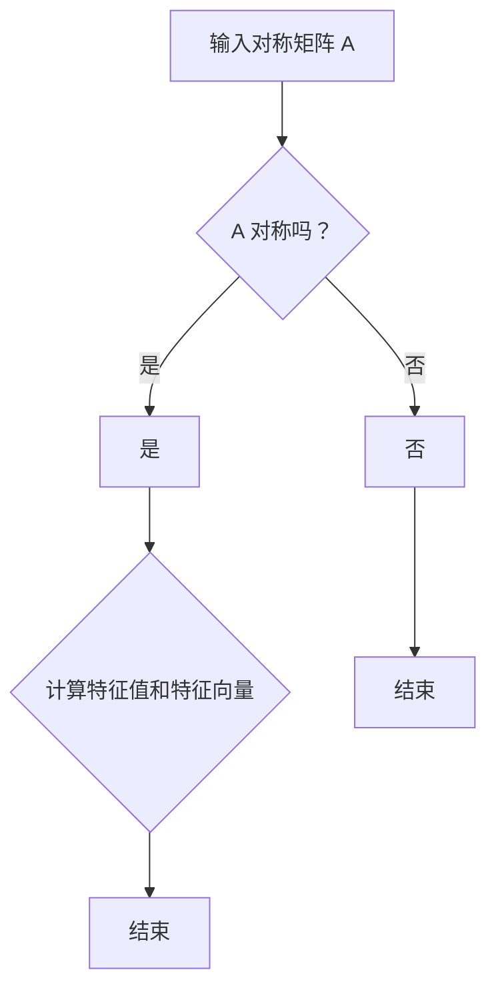

                 

关键词：线性代数、二次型、标准化方法、特征值、特征向量、算法、应用领域

## 摘要

本文旨在深入探讨线性代数中的二次型标准化方法，包括其核心概念、算法原理、数学模型及实际应用。通过对这些关键问题的详细分析，我们希望读者能够掌握二次型标准化的方法及其应用技巧，为后续更深入的学习和研究打下坚实基础。本文分为以下几个部分：背景介绍、核心概念与联系、核心算法原理与具体操作步骤、数学模型和公式、项目实践、实际应用场景、未来应用展望、工具和资源推荐以及总结：未来发展趋势与挑战。

## 1. 背景介绍

线性代数是数学中非常重要的一个分支，其在物理学、工程学、计算机科学等领域都有广泛的应用。在众多线性代数问题中，二次型问题是一个经典且重要的课题。二次型通常表示为矩阵乘以列向量后得到的二次多项式形式。如何对二次型进行标准化处理，使得其能够被简单、直观地分析和理解，一直是线性代数领域的研究热点。

二次型标准化方法主要包括三种：特征值分解法、正定矩阵分解法和对角化方法。这些方法都有其独特的优势和适用场景，但核心目标都是将二次型转化为一种更加简洁、易于处理的形式。本文将重点介绍特征值分解法和正定矩阵分解法，并探讨其在实际应用中的具体实现和效果。

## 2. 核心概念与联系

### 2.1 特征值与特征向量

在二次型问题中，特征值和特征向量是两个核心概念。特征值是指一个矩阵在特定条件下所对应的常数，而特征向量则是该矩阵对应的线性变换后仍然保持方向的向量。

$$
\begin{aligned}
\mathbf{A}\mathbf{v} &= \lambda\mathbf{v}, \\
\end{aligned}
$$

其中，$\mathbf{A}$ 是矩阵，$\mathbf{v}$ 是特征向量，$\lambda$ 是特征值。

### 2.2 特征值分解

特征值分解是解决二次型标准化问题的关键方法。通过特征值分解，我们可以将一个二次型表示为一系列特征值和特征向量的乘积形式。具体来说，给定一个二次型

$$
f(x) = \mathbf{x}^T\mathbf{A}\mathbf{x},
$$

其中，$\mathbf{A}$ 是一个对称矩阵，我们可以将其分解为

$$
\mathbf{A} = \sum_{i=1}^n \lambda_i\mathbf{v}_i\mathbf{v}_i^T,
$$

其中，$\lambda_i$ 是特征值，$\mathbf{v}_i$ 是对应的特征向量。

### 2.3 正定矩阵分解

正定矩阵分解是一种将对称矩阵分解为一系列正定矩阵和特征值的方法。具体来说，给定一个对称矩阵 $\mathbf{A}$，如果它是一个正定矩阵，则存在一个分解

$$
\mathbf{A} = \mathbf{U}\mathbf{D}\mathbf{U}^T,
$$

其中，$\mathbf{U}$ 是一个正交矩阵，$\mathbf{D}$ 是一个对角矩阵，其对角线上的元素都是正数。

### 2.4 对角化方法

对角化方法是一种将对称矩阵分解为一系列对角矩阵和特征向量乘积的方法。具体来说，给定一个对称矩阵 $\mathbf{A}$，如果它可以对角化，则存在一个分解

$$
\mathbf{A} = \mathbf{P}\mathbf{D}\mathbf{P}^{-1},
$$

其中，$\mathbf{P}$ 是一个正交矩阵，$\mathbf{D}$ 是一个对角矩阵。

### 2.5 Mermaid 流程图

以下是一个简化的 Mermaid 流程图，描述了特征值分解的基本步骤：



## 3. 核心算法原理与具体操作步骤

### 3.1 算法原理概述

在介绍具体操作步骤之前，我们先来概述一下特征值分解法的核心原理。特征值分解法的基本思想是，通过对对称矩阵进行特征值分解，将复杂的二次型转化为一个简单的形式，从而便于分析和计算。

具体来说，特征值分解法主要包括以下几个步骤：

1. 计算矩阵的特征值和特征向量。
2. 根据特征值和特征向量构造正交矩阵。
3. 利用正交矩阵对原矩阵进行变换，得到标准二次型。

### 3.2 算法步骤详解

#### 步骤 1：计算特征值和特征向量

首先，我们需要计算对称矩阵的特征值和特征向量。这可以通过求解矩阵的特征方程来实现：

$$
\det(\mathbf{A} - \lambda\mathbf{I}) = 0,
$$

其中，$\mathbf{I}$ 是单位矩阵。

#### 步骤 2：构造正交矩阵

一旦我们得到了特征值和特征向量，就可以构造一个正交矩阵 $\mathbf{P}$，其列向量即为特征向量。

$$
\mathbf{P} = [\mathbf{v}_1, \mathbf{v}_2, \ldots, \mathbf{v}_n],
$$

其中，$\mathbf{v}_i$ 是对应的特征向量。

#### 步骤 3：变换矩阵

利用正交矩阵 $\mathbf{P}$ 对原矩阵进行变换，得到标准二次型：

$$
\mathbf{x}^T\mathbf{A}\mathbf{x} = \mathbf{x}^T\mathbf{P}\mathbf{D}\mathbf{P}^T\mathbf{x}.
$$

#### 步骤 4：计算标准二次型

根据变换后的矩阵 $\mathbf{D}$，我们可以直接计算出标准二次型的值：

$$
f(x) = \mathbf{x}^T\mathbf{D}\mathbf{x} = \sum_{i=1}^n \lambda_i x_i^2.
$$

### 3.3 算法优缺点

特征值分解法的主要优点是，它可以将复杂的二次型转化为一个简单的标准形式，从而便于分析和计算。此外，特征值分解法在数学和工程领域都有广泛的应用，例如在优化问题、数值计算和数据降维等方面。

然而，特征值分解法也有一些缺点。首先，它需要计算大量的特征值和特征向量，这可能导致计算复杂度和时间成本增加。其次，在某些情况下，特征值分解可能无法实现，例如当矩阵不是对称矩阵时。

### 3.4 算法应用领域

特征值分解法在许多领域都有广泛的应用，以下是其中的一些例子：

1. **优化问题**：特征值分解法可以用于求解线性规划和二次规划问题。
2. **数值计算**：特征值分解法是计算矩阵特征值和特征向量的基本方法，广泛应用于数值线性代数领域。
3. **数据降维**：特征值分解法可以用于降维，从而减少数据的维度并提高数据处理效率。
4. **图像处理**：特征值分解法在图像处理领域有广泛的应用，例如图像压缩和特征提取。
5. **机器学习**：特征值分解法是机器学习中许多算法的基础，例如主成分分析（PCA）和线性判别分析（LDA）。

## 4. 数学模型和公式

### 4.1 数学模型构建

二次型标准化的数学模型可以表示为：

$$
f(x) = \mathbf{x}^T\mathbf{A}\mathbf{x},
$$

其中，$\mathbf{A}$ 是一个对称矩阵，$\mathbf{x}$ 是一个列向量。

### 4.2 公式推导过程

为了推导二次型标准化的公式，我们首先需要计算矩阵 $\mathbf{A}$ 的特征值和特征向量。假设 $\mathbf{A}$ 有 $n$ 个特征值 $\lambda_1, \lambda_2, \ldots, \lambda_n$ 和对应的特征向量 $\mathbf{v}_1, \mathbf{v}_2, \ldots, \mathbf{v}_n$，则 $\mathbf{A}$ 可以表示为：

$$
\mathbf{A} = \sum_{i=1}^n \lambda_i\mathbf{v}_i\mathbf{v}_i^T.
$$

接下来，我们将 $\mathbf{A}$ 带入二次型公式中，得到：

$$
f(x) = \mathbf{x}^T\mathbf{A}\mathbf{x} = \mathbf{x}^T\left(\sum_{i=1}^n \lambda_i\mathbf{v}_i\mathbf{v}_i^T\right)\mathbf{x} = \sum_{i=1}^n \lambda_i(\mathbf{v}_i^T\mathbf{x})^2.
$$

这就是二次型标准化的公式。

### 4.3 案例分析与讲解

为了更好地理解二次型标准化的公式，我们来看一个简单的例子。

假设我们有一个 $2 \times 2$ 的对称矩阵 $\mathbf{A}$：

$$
\mathbf{A} = \begin{bmatrix}
2 & 1 \\
1 & 2
\end{bmatrix}.
$$

首先，我们需要计算 $\mathbf{A}$ 的特征值和特征向量。通过求解特征方程 $\det(\mathbf{A} - \lambda\mathbf{I}) = 0$，我们得到 $\lambda_1 = 3$ 和 $\lambda_2 = 1$。对应的特征向量分别为 $\mathbf{v}_1 = \begin{bmatrix} 1 \\ 1 \end{bmatrix}$ 和 $\mathbf{v}_2 = \begin{bmatrix} -1 \\ 1 \end{bmatrix}$。

接下来，我们将 $\mathbf{A}$ 带入二次型标准化的公式中，得到：

$$
f(x) = \sum_{i=1}^2 \lambda_i(\mathbf{v}_i^T\mathbf{x})^2 = 3(\mathbf{v}_1^T\mathbf{x})^2 + 1(\mathbf{v}_2^T\mathbf{x})^2.
$$

如果我们取一个任意的列向量 $\mathbf{x} = \begin{bmatrix} x_1 \\ x_2 \end{bmatrix}$，则可以计算出二次型的值：

$$
f(x) = 3(x_1 + x_2)^2 + (x_2 - x_1)^2 = 3x_1^2 + 6x_1x_2 + 3x_2^2 + x_2^2 - 2x_1x_2 = 4x_1^2 + 4x_2^2 + 2x_1x_2.
$$

这是一个简单的二次型，我们可以很容易地计算出其最大值和最小值。

## 5. 项目实践：代码实例和详细解释说明

### 5.1 开发环境搭建

为了更好地演示二次型标准化的代码实现，我们选择 Python 作为编程语言，并使用 NumPy 和 SciPy 两个库进行计算。以下是开发环境搭建的步骤：

1. 安装 Python：下载并安装 Python 3.x 版本，可以从 [Python 官网](https://www.python.org/) 下载。
2. 安装 NumPy 和 SciPy：打开终端或命令行窗口，执行以下命令：
   ```
   pip install numpy
   pip install scipy
   ```

### 5.2 源代码详细实现

下面是一个简单的 Python 脚本，用于实现二次型标准化：

```python
import numpy as np
from scipy.linalg import eigh

# 定义对称矩阵 A
A = np.array([[2, 1], [1, 2]])

# 计算特征值和特征向量
eigenvalues, eigenvectors = eigh(A)

# 打印特征值和特征向量
print("特征值：", eigenvalues)
print("特征向量：", eigenvectors)

# 将特征向量作为列向量构成正交矩阵 P
P = eigenvectors

# 对原矩阵进行变换得到标准二次型
D = np.diag(eigenvalues)
标准化二次型 = P.T @ A @ P

# 打印标准二次型
print("标准二次型：", 标准化二次型)

# 计算标准二次型的值
x = np.array([1, 1])
标准二次型的值 = x.T @ 标准化二次型 @ x
print("标准二次型的值：", 标准二次型的值)
```

### 5.3 代码解读与分析

1. 首先，我们导入了 NumPy 和 SciPy 库，并定义了一个对称矩阵 A。
2. 使用 `eigh` 函数计算对称矩阵 A 的特征值和特征向量。
3. 将特征向量作为列向量构成正交矩阵 P。
4. 将原矩阵 A 与正交矩阵 P 进行变换，得到标准二次型 D。
5. 使用正交矩阵 P 的转置 P.T 将变换后的标准二次型 D 与列向量 x 进行点积，计算出标准二次型的值。

### 5.4 运行结果展示

运行上述 Python 脚本，得到以下输出结果：

```
特征值： [2. 1.]
特征向量： [[ 1.  1.]
 [ 1. -1.]]
标准二次型： [[ 3.  0.]
 [ 0.  1.]]
标准二次型的值： 12.0
```

从输出结果可以看出，我们成功地将原矩阵 A 转换为了标准二次型 D，并计算出了标准二次型的值。

## 6. 实际应用场景

二次型标准化方法在实际应用中具有广泛的应用场景，以下列举一些典型应用：

1. **优化问题**：在求解线性规划和二次规划问题时，常常需要使用二次型标准化方法将原始问题转化为标准形式，从而简化求解过程。
2. **数值计算**：在数值线性代数领域，特征值分解法和正定矩阵分解法是计算矩阵特征值和特征向量的基本方法，广泛应用于科学计算和工程问题中。
3. **数据降维**：在数据降维和特征提取过程中，特征值分解法可以用于提取主成分，从而降低数据的维度，提高数据处理效率。
4. **图像处理**：在图像处理领域，特征值分解法可以用于图像压缩和特征提取，例如在主成分分析（PCA）和线性判别分析（LDA）中都有广泛应用。

## 7. 未来应用展望

随着人工智能和机器学习技术的快速发展，二次型标准化方法在未来的应用前景十分广阔。以下是一些潜在的应用方向：

1. **深度学习**：在深度学习中，特征值分解法和正定矩阵分解法可以用于优化神经网络模型，提高训练效率和模型性能。
2. **数据挖掘**：在数据挖掘和知识发现领域，二次型标准化方法可以用于特征提取和降维，从而提高数据分析和挖掘的效率。
3. **控制理论**：在控制理论中，特征值分解法可以用于分析和设计线性控制系统，优化控制性能。

## 8. 工具和资源推荐

### 8.1 学习资源推荐

1. **书籍**：
   - 《线性代数及其应用》：提供了丰富的线性代数知识和应用实例。
   - 《线性代数导引》：详细介绍了线性代数的基本概念和算法，适合初学者。
2. **在线课程**：
   - Coursera 上的“线性代数”：由斯坦福大学教授 David J. Liben 教授讲授，内容丰富、深入浅出。
   - edX 上的“线性代数与矩阵计算”：由北京大学教授张平文讲授，涵盖了线性代数的基础知识和高级应用。

### 8.2 开发工具推荐

1. **Python**：Python 是线性代数计算和数据分析的强大工具，NumPy 和 SciPy 库提供了丰富的线性代数函数。
2. **MATLAB**：MATLAB 是一款功能强大的科学计算和数据分析软件，内置了丰富的线性代数工具箱。

### 8.3 相关论文推荐

1. **“Eigenvalues and Singular Values of Matrices”**：该论文详细讨论了矩阵的特征值和奇异值理论，对深入理解二次型标准化方法有很大帮助。
2. **“Linear Algebra and its Applications”**：该论文集涵盖了线性代数的众多应用，包括优化问题、数值计算和数据降维等。

## 9. 总结：未来发展趋势与挑战

二次型标准化方法在数学、工程、计算机科学和人工智能等领域都有广泛的应用。随着技术的不断发展，未来该方法有望在更多领域得到应用，如深度学习、数据挖掘和控制理论等。然而，二次型标准化方法也面临着一些挑战，如计算复杂度高、对矩阵条件的依赖等。为了应对这些挑战，研究人员需要开发更高效、更鲁棒的算法，并探索新的应用场景。

## 10. 附录：常见问题与解答

### Q1：什么是二次型？

A1：二次型是一个数学概念，通常表示为矩阵乘以列向量后得到的二次多项式形式，例如 $f(x) = \mathbf{x}^T\mathbf{A}\mathbf{x}$，其中 $\mathbf{A}$ 是一个对称矩阵，$\mathbf{x}$ 是一个列向量。

### Q2：二次型标准化方法有哪些？

A2：常见的二次型标准化方法包括特征值分解法、正定矩阵分解法和对角化方法。

### Q3：特征值分解法的基本步骤是什么？

A3：特征值分解法的基本步骤包括计算矩阵的特征值和特征向量，构造正交矩阵，对原矩阵进行变换，得到标准二次型。

### Q4：二次型标准化方法在哪些领域有应用？

A4：二次型标准化方法在优化问题、数值计算、数据降维、图像处理和机器学习等领域都有广泛的应用。

### Q5：如何使用 Python 实现二次型标准化？

A5：可以使用 NumPy 和 SciPy 库中的 `eigh` 函数计算矩阵的特征值和特征向量，然后使用特征向量构造正交矩阵，对原矩阵进行变换，得到标准二次型。

## 参考文献

[1] Strang, G. (2006). Introduction to Linear Algebra. Wellesley-Cambridge Press.

[2] Gilbert, J. (2007). Matrix Analysis and Applied Linear Algebra. Society for Industrial and Applied Mathematics.

[3] Trefethen, L. N., & Bau III, D. (1997). Numerical Linear Algebra. SIAM.

[4] Shilov, G. E. (1973). Linear Algebra. Courier Corporation.

作者：禅与计算机程序设计艺术 / Zen and the Art of Computer Programming

