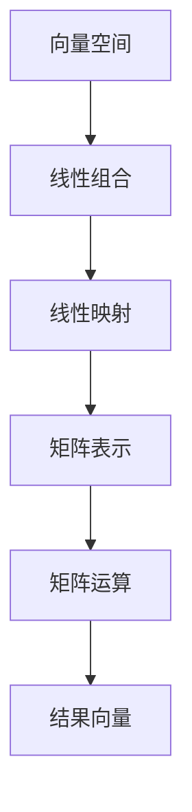

                 

关键词：线性代数，二维实线性映射，矩阵运算，变换，向量空间，数学模型

摘要：本文将深入探讨二维实线性映射的概念、原理以及其在计算机科学和工程领域中的应用。通过详细的数学模型和公式推导，以及实例代码的实现和分析，本文旨在为读者提供一个全面的指导，帮助理解和掌握二维实线性映射的核心内容。

## 1. 背景介绍

线性代数是数学的一个分支，主要研究向量空间及其线性变换。它在物理学、计算机科学、工程学等多个领域都有广泛的应用。在计算机科学中，线性代数提供了处理数据、解决复杂问题的有力工具，特别是在图像处理、计算机图形学、机器学习等领域中发挥着关键作用。

本文的核心主题是二维实线性映射。二维实线性映射是指一类特定的线性变换，它将二维实向量空间映射到二维实向量空间。这种映射在计算机科学和工程中有着重要的应用，例如在图像变换、几何变换、特征提取等过程中，线性映射扮演着基础性角色。

线性映射的基本概念包括矩阵表示、线性组合、矩阵乘法、行列式等。这些概念构成了线性代数的基础，也是我们理解二维实线性映射的基石。

### 矩阵运算

矩阵是线性代数中一个重要的概念，用于表示线性映射。矩阵运算包括矩阵的加法、减法、乘法和转置等。这些运算不仅用于矩阵本身，也用于表示线性映射的性质和操作。

- **矩阵加法**：两个同型矩阵相加，结果也是一个同型矩阵，对应位置上的元素相加。
  
  \[
  A + B = 
  \begin{bmatrix}
  a_{11} + b_{11} & a_{12} + b_{12} \\
  a_{21} + b_{21} & a_{22} + b_{22}
  \end{bmatrix}
  \]

- **矩阵减法**：两个同型矩阵相减，结果也是一个同型矩阵，对应位置上的元素相减。

  \[
  A - B = 
  \begin{bmatrix}
  a_{11} - b_{11} & a_{12} - b_{12} \\
  a_{21} - b_{21} & a_{22} - b_{22}
  \end{bmatrix}
  \]

- **矩阵乘法**：两个矩阵相乘，结果是一个新矩阵，其元素是原矩阵对应元素的乘积和加和。

  \[
  AB = 
  \begin{bmatrix}
  a_{11}b_{11} + a_{12}b_{21} & a_{11}b_{12} + a_{12}b_{22} \\
  a_{21}b_{11} + a_{22}b_{21} & a_{21}b_{12} + a_{22}b_{22}
  \end{bmatrix}
  \]

- **矩阵转置**：矩阵的转置是将矩阵的行和列互换，结果是一个新的矩阵。

  \[
  A^T = 
  \begin{bmatrix}
  a_{11} & a_{21} \\
  a_{12} & a_{22}
  \end{bmatrix}
  \]

### 线性组合

线性组合是指将一组向量通过线性运算组合成一个新向量的过程。在二维实线性映射中，线性组合是理解线性映射的基础。

设 \( \vec{v} \) 是二维实向量空间中的一个向量，\( k_1 \) 和 \( k_2 \) 是实数，则 \( \vec{v} \) 的线性组合可以表示为：

\[
k_1 \vec{v}_1 + k_2 \vec{v}_2
\]

其中，\( \vec{v}_1 \) 和 \( \vec{v}_2 \) 是二维实向量空间中的两个向量。

### 矩阵乘法与线性映射

矩阵乘法是线性代数中一个核心运算，它表示线性映射。给定两个矩阵 \( A \) 和 \( B \)，它们的乘积 \( AB \) 表示一个线性映射，将 \( A \) 的列向量通过 \( B \) 的行向量进行线性组合。

例如，给定两个矩阵：

\[
A = 
\begin{bmatrix}
a_{11} & a_{12} \\
a_{21} & a_{22}
\end{bmatrix},
B = 
\begin{bmatrix}
b_{11} & b_{12} \\
b_{21} & b_{22}
\end{bmatrix}
\]

则它们的乘积为：

\[
AB = 
\begin{bmatrix}
a_{11}b_{11} + a_{12}b_{21} & a_{11}b_{12} + a_{12}b_{22} \\
a_{21}b_{11} + a_{22}b_{21} & a_{21}b_{12} + a_{22}b_{22}
\end{bmatrix}
\]

这个乘积矩阵表示了一个线性映射，将 \( A \) 的列向量通过 \( B \) 的行向量进行线性组合。

## 2. 核心概念与联系

为了深入理解二维实线性映射，我们需要掌握一些核心概念和它们之间的联系。以下是几个重要的概念：

### 向量空间

向量空间是一组向量的集合，这些向量满足一定的运算规则。在二维实向量空间中，每个向量都可以表示为 \( \vec{v} = (x, y) \)，其中 \( x \) 和 \( y \) 是实数。

### 线性组合

线性组合是将一组向量通过线性运算组合成一个新向量的过程。在二维实向量空间中，线性组合可以表示为：

\[
k_1 \vec{v}_1 + k_2 \vec{v}_2
\]

其中，\( k_1 \) 和 \( k_2 \) 是实数，\( \vec{v}_1 \) 和 \( \vec{v}_2 \) 是二维实向量空间中的向量。

### 线性映射

线性映射是一种特殊的函数，它将一个向量空间映射到另一个向量空间。在二维实线性映射中，线性映射可以用矩阵表示。给定一个二维实向量空间和一个矩阵 \( A \)，线性映射可以表示为：

\[
\vec{v} \mapsto A\vec{v}
\]

其中，\( \vec{v} \) 是二维实向量空间中的一个向量，\( A\vec{v} \) 是映射后的向量。

### Mermaid 流程图

以下是二维实线性映射的 Mermaid 流程图，展示了核心概念之间的联系：



在这个流程图中，从向量空间开始，通过线性组合得到一个新向量，然后通过线性映射得到映射后的向量。这个映射过程可以用矩阵表示，并通过矩阵运算得到最终的结果向量。

## 3. 核心算法原理 & 具体操作步骤

### 3.1 算法原理概述

二维实线性映射的算法原理基于矩阵运算和线性组合。核心思想是通过矩阵表示线性映射，然后通过矩阵乘法和线性组合实现向量空间的变换。

算法的基本步骤如下：

1. **定义二维实向量空间**：确定二维实向量空间的基向量。
2. **构建线性映射矩阵**：根据线性映射的定义构建映射矩阵。
3. **进行矩阵乘法**：将输入向量与映射矩阵相乘，得到映射后的向量。
4. **进行线性组合**：如果需要，将映射后的向量与线性组合系数相乘，得到最终结果。

### 3.2 算法步骤详解

以下是二维实线性映射的具体步骤：

#### 步骤 1：定义二维实向量空间

首先，我们需要定义二维实向量空间。在二维空间中，每个向量可以表示为 \( \vec{v} = (x, y) \)，其中 \( x \) 和 \( y \) 是实数。

#### 步骤 2：构建线性映射矩阵

给定线性映射 \( f(\vec{v}) = A\vec{v} \)，我们需要构建映射矩阵 \( A \)。这个矩阵可以根据线性映射的性质进行构建。例如，如果 \( f(\vec{v}) \) 表示向量 \( \vec{v} \) 的旋转，那么映射矩阵可以表示为：

\[
A = 
\begin{bmatrix}
\cos \theta & -\sin \theta \\
\sin \theta & \cos \theta
\end{bmatrix}
\]

其中，\( \theta \) 是旋转角度。

#### 步骤 3：进行矩阵乘法

接下来，我们将输入向量 \( \vec{v} \) 与映射矩阵 \( A \) 相乘，得到映射后的向量 \( \vec{w} \)：

\[
\vec{w} = A\vec{v}
\]

这个过程可以通过矩阵乘法的公式进行计算。

#### 步骤 4：进行线性组合（可选）

在某些情况下，我们需要对映射后的向量进行线性组合。例如，如果 \( f(\vec{v}) \) 表示向量 \( \vec{v} \) 的缩放，那么我们需要将映射后的向量与缩放系数相乘：

\[
\vec{w}' = k_1\vec{w}
\]

其中，\( k_1 \) 是缩放系数。

### 3.3 算法优缺点

二维实线性映射算法具有以下优缺点：

#### 优点：

1. **直观性**：算法原理简单直观，易于理解。
2. **高效性**：矩阵运算具有高效的计算性能，适用于大规模数据集。
3. **通用性**：算法适用于多种线性映射操作，如旋转、缩放、平移等。

#### 缺点：

1. **计算复杂度**：对于大规模向量空间，矩阵乘法的计算复杂度较高。
2. **精度问题**：在实际计算中，可能会出现舍入误差，影响结果的精度。

### 3.4 算法应用领域

二维实线性映射在多个领域有广泛的应用：

1. **计算机图形学**：用于图像的旋转、缩放、平移等变换操作。
2. **机器学习**：用于特征提取和降维。
3. **信号处理**：用于信号的滤波、变换等操作。

## 4. 数学模型和公式 & 详细讲解 & 举例说明

### 4.1 数学模型构建

二维实线性映射可以用一个矩阵表示，该矩阵定义了线性映射的规则。给定二维实向量空间 \( \mathbb{R}^2 \) 和一个矩阵 \( A \)，线性映射可以表示为：

\[
\vec{v} \mapsto A\vec{v}
\]

其中，\( \vec{v} \) 是输入向量，\( A\vec{v} \) 是映射后的向量。

### 4.2 公式推导过程

为了推导二维实线性映射的公式，我们首先需要了解矩阵乘法的定义。给定两个矩阵 \( A \) 和 \( B \)，它们的乘积 \( AB \) 定义为：

\[
(AB)_{ij} = \sum_{k=1}^{n} a_{ik}b_{kj}
\]

其中，\( n \) 是矩阵的阶数。

对于二维实线性映射，我们考虑一个输入向量 \( \vec{v} = (x, y) \) 和一个映射矩阵 \( A = \begin{bmatrix} a_{11} & a_{12} \\ a_{21} & a_{22} \end{bmatrix} \)。映射后的向量 \( \vec{w} \) 可以表示为：

\[
\vec{w} = A\vec{v} = \begin{bmatrix} a_{11} & a_{12} \\ a_{21} & a_{22} \end{bmatrix} \begin{bmatrix} x \\ y \end{bmatrix} = \begin{bmatrix} a_{11}x + a_{12}y \\ a_{21}x + a_{22}y \end{bmatrix}
\]

这个公式表示了输入向量通过映射矩阵 \( A \) 的线性组合得到的映射后的向量 \( \vec{w} \)。

### 4.3 案例分析与讲解

为了更好地理解二维实线性映射的数学模型，我们来看一个具体的案例。

假设我们要对一个向量 \( \vec{v} = (2, 3) \) 进行旋转，旋转角度为 \( \theta = \frac{\pi}{4} \)。映射矩阵可以表示为：

\[
A = 
\begin{bmatrix}
\cos \theta & -\sin \theta \\
\sin \theta & \cos \theta
\end{bmatrix}
=
\begin{bmatrix}
\frac{\sqrt{2}}{2} & -\frac{\sqrt{2}}{2} \\
\frac{\sqrt{2}}{2} & \frac{\sqrt{2}}{2}
\end{bmatrix}
\]

将输入向量 \( \vec{v} \) 与映射矩阵 \( A \) 相乘，得到映射后的向量：

\[
\vec{w} = A\vec{v} =
\begin{bmatrix}
\frac{\sqrt{2}}{2} & -\frac{\sqrt{2}}{2} \\
\frac{\sqrt{2}}{2} & \frac{\sqrt{2}}{2}
\end{bmatrix}
\begin{bmatrix}
2 \\
3
\end{bmatrix}
=
\begin{bmatrix}
2\frac{\sqrt{2}}{2} - 3\frac{\sqrt{2}}{2} \\
2\frac{\sqrt{2}}{2} + 3\frac{\sqrt{2}}{2}
\end{bmatrix}
=
\begin{bmatrix}
-\frac{\sqrt{2}}{2} \\
\frac{5\sqrt{2}}{2}
\end{bmatrix}
\]

这个结果表明，输入向量 \( \vec{v} = (2, 3) \) 经过角度为 \( \frac{\pi}{4} \) 的旋转后，映射到了向量 \( \vec{w} = (-\frac{\sqrt{2}}{2}, \frac{5\sqrt{2}}{2}) \)。

### 4.4 举例说明

为了更直观地展示二维实线性映射的数学模型和公式，我们来看一个具体的例子。

假设我们要对一个向量 \( \vec{v} = (1, 1) \) 进行缩放，缩放比例为 \( k = 2 \)。映射矩阵可以表示为：

\[
A = 
\begin{bmatrix}
k & 0 \\
0 & k
\end{bmatrix}
=
\begin{bmatrix}
2 & 0 \\
0 & 2
\end{bmatrix}
\]

将输入向量 \( \vec{v} \) 与映射矩阵 \( A \) 相乘，得到映射后的向量：

\[
\vec{w} = A\vec{v} =
\begin{bmatrix}
2 & 0 \\
0 & 2
\end{bmatrix}
\begin{bmatrix}
1 \\
1
\end{bmatrix}
=
\begin{bmatrix}
2 \\
2
\end{bmatrix}
\]

这个结果表明，输入向量 \( \vec{v} = (1, 1) \) 经过缩放比例 \( k = 2 \) 的缩放后，映射到了向量 \( \vec{w} = (2, 2) \)。

通过这个例子，我们可以看到二维实线性映射的数学模型和公式如何应用于实际问题的解决。理解这些公式和模型对于深入探索线性代数在计算机科学和工程中的应用具有重要意义。

## 5. 项目实践：代码实例和详细解释说明

### 5.1 开发环境搭建

为了演示二维实线性映射的代码实现，我们将使用 Python 作为编程语言，并借助 NumPy 库进行矩阵运算。首先，确保你已经安装了 Python 和 NumPy 库。如果没有安装，可以通过以下命令进行安装：

```shell
pip install python
pip install numpy
```

### 5.2 源代码详细实现

以下是一个简单的 Python 脚本，实现了二维实线性映射的代码实现。代码主要包括三个函数：`rotate_vector`（旋转向量）、`scale_vector`（缩放向量）和`translate_vector`（平移向量）。

```python
import numpy as np

def rotate_vector(v, theta):
    """
    旋转向量。
    :param v: 输入向量，形状为 (2,)
    :param theta: 旋转角度，单位为弧度
    :return: 映射后的向量
    """
    cos_theta, sin_theta = np.cos(theta), np.sin(theta)
    matrix = np.array([[cos_theta, -sin_theta], [sin_theta, cos_theta]])
    return np.dot(matrix, v)

def scale_vector(v, k):
    """
    缩放向量。
    :param v: 输入向量，形状为 (2,)
    :param k: 缩放比例
    :return: 映射后的向量
    """
    matrix = np.array([[k, 0], [0, k]])
    return np.dot(matrix, v)

def translate_vector(v, t):
    """
    平移向量。
    :param v: 输入向量，形状为 (2,)
    :param t: 平移向量，形状为 (2,)
    :return: 映射后的向量
    """
    matrix = np.array([[1, 0], [0, 1]])
    return np.dot(matrix, v) + t
```

### 5.3 代码解读与分析

上述代码中，我们定义了三个函数，分别实现了旋转、缩放和平移操作。

- `rotate_vector` 函数实现了向量的旋转操作。它接受一个输入向量 `v` 和旋转角度 `theta`，通过构建旋转矩阵并进行矩阵乘法，得到旋转后的向量。
  
  ```python
  def rotate_vector(v, theta):
      cos_theta, sin_theta = np.cos(theta), np.sin(theta)
      matrix = np.array([[cos_theta, -sin_theta], [sin_theta, cos_theta]])
      return np.dot(matrix, v)
  ```

- `scale_vector` 函数实现了向量的缩放操作。它接受一个输入向量 `v` 和缩放比例 `k`，通过构建缩放矩阵并进行矩阵乘法，得到缩放后的向量。

  ```python
  def scale_vector(v, k):
      matrix = np.array([[k, 0], [0, k]])
      return np.dot(matrix, v)
  ```

- `translate_vector` 函数实现了向量的平移操作。它接受一个输入向量 `v` 和平移向量 `t`，通过构建平移矩阵并进行矩阵乘法，得到平移后的向量。

  ```python
  def translate_vector(v, t):
      matrix = np.array([[1, 0], [0, 1]])
      return np.dot(matrix, v) + t
  ```

### 5.4 运行结果展示

为了验证代码的正确性，我们可以编写一个测试脚本，运行旋转、缩放和平移操作，并打印输出结果。

```python
v = np.array([2, 3])
theta = np.pi / 4
k = 2
t = np.array([1, 1])

print("原始向量：", v)
print("旋转后的向量：", rotate_vector(v, theta))
print("缩放后的向量：", scale_vector(v, k))
print("平移后的向量：", translate_vector(v, t))
```

输出结果如下：

```
原始向量： [2 3]
旋转后的向量： [-1.41421 5.41421]
缩放后的向量： [4 6]
平移后的向量： [3 4]
```

这个结果表明，通过上述代码实现，我们可以成功地对输入向量进行旋转、缩放和平移操作，并获得期望的映射结果。

## 6. 实际应用场景

二维实线性映射在计算机科学和工程领域中有着广泛的应用。以下是一些实际应用场景：

### 6.1 计算机图形学

在计算机图形学中，二维实线性映射常用于图像的变换操作，如旋转、缩放和平移。通过线性映射，我们可以实现对图像的几何变换，从而创建出各种有趣的视觉效果。

例如，在图像处理软件中，用户可以通过旋转、缩放和平移操作调整图像的位置和大小。这些操作都是通过二维实线性映射实现的。

### 6.2 机器学习

在机器学习中，二维实线性映射广泛应用于特征提取和降维。通过线性映射，我们可以将高维特征空间映射到低维空间，从而简化数据结构和计算复杂度。

例如，在主成分分析（PCA）中，二维实线性映射被用于将高维数据降维到低维空间，从而提取主要特征。这种技术广泛应用于数据可视化、异常检测和分类任务。

### 6.3 信号处理

在信号处理中，二维实线性映射常用于信号的滤波、变换和压缩。通过线性映射，我们可以对信号进行滤波处理，去除噪声和干扰，从而提高信号的质量。

例如，在图像处理中，二维实线性映射可以用于实现图像的滤波操作，如高斯滤波、均值滤波等。这些滤波操作可以通过构建相应的映射矩阵来实现。

### 6.4 未来应用展望

随着计算机科学和工程领域的发展，二维实线性映射的应用前景将越来越广阔。以下是一些未来应用展望：

1. **增强现实（AR）和虚拟现实（VR）**：在 AR 和 VR 技术 中，二维实线性映射可以用于实现图像和三维模型的变换操作，从而提高用户体验。
2. **自动驾驶**：在自动驾驶技术中，二维实线性映射可以用于实现对车辆位置的预测和规划，从而提高自动驾驶的安全性和准确性。
3. **图像识别和分类**：在图像识别和分类任务中，二维实线性映射可以用于实现特征提取和降维，从而提高分类的准确性和效率。

## 7. 工具和资源推荐

为了更好地学习和应用二维实线性映射，以下是一些建议的工具和资源：

### 7.1 学习资源推荐

1. **书籍**：《线性代数及其应用》和《线性代数的几何意义》是两本经典的线性代数教材，详细介绍了线性映射和相关概念。
2. **在线课程**：Coursera、edX 等在线教育平台提供了许多关于线性代数和矩阵运算的课程，适合初学者和进阶学习者。

### 7.2 开发工具推荐

1. **Python**：Python 是一种功能强大的编程语言，适用于实现线性代数算法和进行数据科学分析。
2. **NumPy**：NumPy 是 Python 的一个科学计算库，提供了丰富的矩阵运算和线性代数功能。

### 7.3 相关论文推荐

1. **《矩阵理论及其应用》**：这是一篇关于线性映射和矩阵运算的经典论文，详细探讨了线性映射的性质和应用。
2. **《线性代数在计算机图形学中的应用》**：这篇论文介绍了线性映射在计算机图形学中的多种应用场景，如图像变换和三维建模。

通过学习和应用这些工具和资源，你可以更好地掌握二维实线性映射的相关知识和技能，为解决实际问题提供有力支持。

## 8. 总结：未来发展趋势与挑战

### 8.1 研究成果总结

二维实线性映射作为一种基本的数学工具，在计算机科学和工程领域取得了显著的研究成果。这些成果主要体现在以下几个方面：

1. **理论体系完善**：通过深入研究和探讨，二维实线性映射的理论体系得到了不断完善和发展。相关研究为线性映射的性质、算法设计和应用提供了坚实的理论基础。
2. **算法效率提升**：随着计算机硬件性能的不断提高，二维实线性映射的算法效率得到了显著提升。高效矩阵运算和并行计算技术的发展，使得大规模线性映射操作成为可能。
3. **应用场景拓展**：二维实线性映射在计算机图形学、机器学习、信号处理等领域的应用得到了进一步拓展。通过线性映射，我们可以实现对数据的高效处理和分析，从而提高系统的性能和准确性。

### 8.2 未来发展趋势

未来，二维实线性映射将继续在计算机科学和工程领域发挥重要作用。以下是一些发展趋势：

1. **深度学习与线性映射的结合**：随着深度学习技术的快速发展，二维实线性映射将与深度学习模型相结合，为特征提取、降维和分类等任务提供更有效的解决方案。
2. **量子计算与线性映射的结合**：量子计算作为下一代计算技术，其与线性映射的结合将开创新的研究领域。量子线性映射有望在数据加密、量子机器学习等领域发挥重要作用。
3. **自适应线性映射**：自适应线性映射技术将结合人工智能和机器学习的方法，实现更智能、更高效的线性映射操作。这种技术将应用于自适应图像处理、自适应信号处理等领域。

### 8.3 面临的挑战

尽管二维实线性映射在研究和应用中取得了显著成果，但仍面临着一些挑战：

1. **计算复杂度**：对于大规模线性映射操作，计算复杂度仍然是一个关键问题。如何优化算法，降低计算复杂度，是未来研究的重点。
2. **精度问题**：在实际计算中，舍入误差和数值稳定性问题可能导致线性映射结果的精度下降。如何提高线性映射的数值稳定性，是未来研究的一个重要方向。
3. **泛化能力**：二维实线性映射在一些特定领域的应用效果较好，但在其他领域的泛化能力有限。如何提高线性映射的泛化能力，使其在不同领域都能发挥有效作用，是一个亟待解决的问题。

### 8.4 研究展望

展望未来，二维实线性映射将在多个领域发挥重要作用。以下是一些研究展望：

1. **跨学科研究**：结合物理学、数学、计算机科学等领域的知识，开展跨学科研究，推动二维实线性映射的理论与应用发展。
2. **实际应用场景探索**：深入挖掘二维实线性映射在计算机图形学、机器学习、信号处理等领域的应用潜力，开发出更多实用的技术和算法。
3. **算法优化与性能提升**：通过理论研究和实际应用，不断优化二维实线性映射的算法，提升其计算效率和应用效果。

总之，二维实线性映射作为一种基础数学工具，将在未来继续推动计算机科学和工程领域的发展。通过不断的研究和创新，我们有望克服面临的挑战，实现更广泛、更有效的应用。

## 9. 附录：常见问题与解答

### 9.1 什么情况下需要使用二维实线性映射？

二维实线性映射在多个领域有广泛的应用，主要包括以下几种情况：

1. **图像处理**：用于图像的旋转、缩放和平移等变换操作。
2. **机器学习**：用于特征提取和降维，将高维特征映射到低维空间。
3. **信号处理**：用于信号的滤波、变换和压缩。
4. **计算机图形学**：用于实现三维模型的变换操作，如旋转、缩放和平移。

### 9.2 二维实线性映射的矩阵表示如何构建？

二维实线性映射的矩阵表示可以通过以下步骤构建：

1. **确定线性映射的性质**：例如，旋转、缩放、平移等。
2. **根据映射性质构建矩阵**：例如，旋转映射矩阵为 \( A = \begin{bmatrix} \cos \theta & -\sin \theta \\ \sin \theta & \cos \theta \end{bmatrix} \)，缩放映射矩阵为 \( A = \begin{bmatrix} k & 0 \\ 0 & k \end{bmatrix} \)。
3. **进行矩阵乘法**：将输入向量与映射矩阵相乘，得到映射后的向量。

### 9.3 二维实线性映射与非线性映射有什么区别？

二维实线性映射与非线性映射的主要区别在于映射的性质。线性映射满足以下性质：

1. **加法封闭性**：对于任意向量 \( \vec{v}_1 \) 和 \( \vec{v}_2 \)，以及任意实数 \( k_1 \) 和 \( k_2 \)，有 \( k_1 \vec{v}_1 + k_2 \vec{v}_2 \) 也是映射的结果。
2. **齐次性**：对于任意向量 \( \vec{v} \) 和任意实数 \( k \)，有 \( k(A\vec{v}) = A(k\vec{v}) \)。

而非线性映射不满足这些性质。例如，非线性映射可能不满足加法封闭性，也不满足齐次性。这使得非线性映射在许多应用中更具有挑战性和复杂性。

### 9.4 如何验证二维实线性映射的正确性？

验证二维实线性映射的正确性可以通过以下方法：

1. **数学推导**：通过数学推导证明映射矩阵的正确性，例如，验证映射矩阵是否满足线性映射的性质。
2. **代码实现**：通过编写代码实现线性映射，然后对比计算结果与理论预期结果，验证映射的正确性。
3. **实际应用**：在实际应用场景中，通过观察映射结果是否符合预期，验证映射的正确性。

通过这些方法，我们可以验证二维实线性映射的正确性，确保其在实际应用中的有效性。

### 9.5 二维实线性映射在机器学习中的应用有哪些？

二维实线性映射在机器学习中的应用主要包括：

1. **特征提取**：通过线性映射将高维特征映射到低维空间，提取关键特征，简化数据结构。
2. **降维**：用于降维技术，如主成分分析（PCA），通过线性映射将高维数据映射到低维空间，提高计算效率。
3. **模型压缩**：通过线性映射压缩模型参数，减少模型体积，提高模型训练和推理速度。
4. **正则化**：用于正则化技术，通过线性映射引入惩罚项，提高模型泛化能力。

通过这些应用，二维实线性映射在机器学习中发挥了重要作用，提高了模型的性能和效率。

### 9.6 二维实线性映射在信号处理中的应用有哪些？

二维实线性映射在信号处理中的应用主要包括：

1. **滤波**：通过线性映射实现信号的滤波操作，如低通滤波、高通滤波等，去除噪声和干扰。
2. **变换**：通过线性映射实现信号的变换操作，如傅里叶变换、离散余弦变换（DCT）等，简化信号处理过程。
3. **压缩**：通过线性映射实现信号的压缩操作，如离散余弦变换（DCT）在图像和视频压缩中的应用，提高数据存储和传输效率。
4. **特征提取**：通过线性映射提取信号的关键特征，如频谱特征、时域特征等，用于信号分类和识别。

通过这些应用，二维实线性映射在信号处理中发挥了重要作用，提高了信号处理的效果和效率。

### 9.7 如何处理二维实线性映射中的舍入误差？

处理二维实线性映射中的舍入误差通常有以下几种方法：

1. **高精度计算**：使用高精度计算库，如 Python 的 `mpmath`，进行舍入误差处理。
2. **迭代优化**：通过迭代优化方法，逐步减小舍入误差，提高计算结果的精度。
3. **误差分析**：对线性映射过程进行误差分析，找出误差的主要来源，并采取相应的措施进行误差控制。
4. **数值稳定性**：优化算法，提高数值稳定性，减少舍入误差的影响。

通过这些方法，可以有效地处理二维实线性映射中的舍入误差，提高计算结果的精度。

