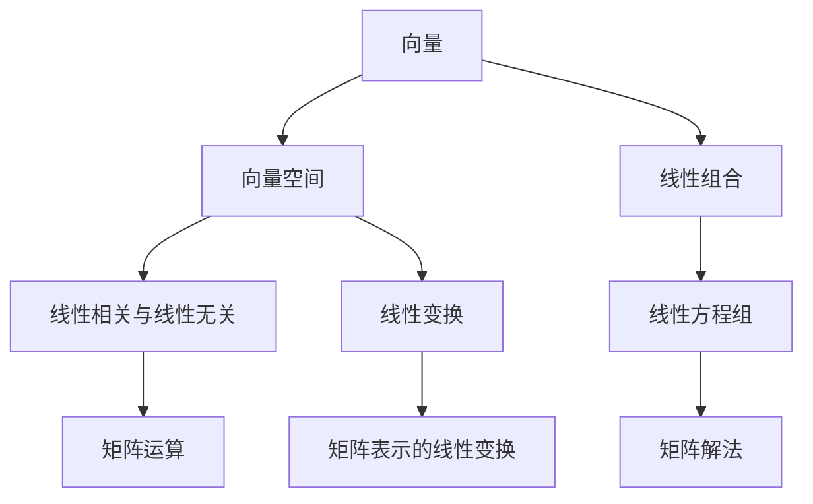

                 

关键词：线性代数，实平面R2，矩阵运算，线性方程组，特征值和特征向量，几何解释

## 摘要

本文旨在为广大计算机程序员、数据科学家和数学爱好者提供一本简洁而实用的线性代数导引，专注于实平面R2的研究与应用。通过深入探讨矩阵运算、线性方程组、特征值和特征向量等核心概念，本文不仅详细解析了实平面R2的基础理论，还结合实际案例，展示了线性代数在计算机编程和数据分析中的广泛应用。读者可以借此掌握线性代数的基本工具，为进一步探索更复杂的数学领域奠定基础。

## 1. 背景介绍

线性代数是数学的一个重要分支，主要研究向量、矩阵以及线性方程组。在计算机科学、物理学、工程学等领域中，线性代数扮演着至关重要的角色。特别是实平面R2，它是所有二维向量的集合，是线性代数研究的起点。

实平面R2的定义较为直观：它由所有形如（x, y）的有序数对组成，其中x和y都是实数。R2的几何解释非常简单，可以看作是二维坐标系，每个点都对应一个唯一的向量。这个性质使得R2成为理解线性代数概念的一个理想模型。

### 线性代数的基本概念

在R2中，向量是描述方向和大小的量。例如，向量v = (1, 2)表示一个起点在原点，终点在(1, 2)的向量。向量可以进行加法、减法、数乘等运算。这些运算在R2中具有直观的几何意义。

矩阵是一个由数字组成的矩形阵列，通常用于表示线性方程组或者线性变换。R2中的矩阵具有2行2列的格式，记作：

\[ A = \begin{bmatrix} a & b \\ c & d \end{bmatrix} \]

其中a、b、c、d都是实数。矩阵可以进行加法、乘法等运算，并且可以用来表示线性变换。

### 线性方程组

线性方程组是线性代数研究的重要内容之一。在R2中，线性方程组通常可以表示为：

\[ \begin{cases} a_1x + b_1y = c_1 \\ a_2x + b_2y = c_2 \end{cases} \]

线性方程组的解集可以表示为R2中的某个向量集合。通过矩阵运算，可以方便地求解线性方程组。

## 2. 核心概念与联系

### 向量空间

向量空间是向量构成的一个集合，满足封闭性和其他几个公理。R2是向量空间的一个典型例子。向量空间中的向量可以进行加法和数乘运算，这为线性代数的应用提供了基础。

### 线性组合

线性组合是指将向量与标量相乘并相加的结果。在R2中，任何向量都可以表示为其他向量的线性组合。例如，向量v = (1, 2)可以表示为：

\[ v = 1 \cdot (1, 0) + 2 \cdot (0, 1) \]

### 线性相关与线性无关

如果一组向量可以表示为其他向量的线性组合，则这些向量是线性相关的。否则，它们是线性无关的。在R2中，任何两个非零向量都是线性相关的，因为总可以通过适当的数乘和加法将一个向量表示为另一个向量的线性组合。

### 线性变换

线性变换是一种将向量映射到另一个向量的函数。在线性代数中，线性变换通常通过矩阵来表示。在R2中，线性变换可以通过2x2矩阵实现。例如，一个线性变换T可以通过矩阵A表示为：

\[ T\begin{bmatrix} x \\ y \end{bmatrix} = \begin{bmatrix} a & b \\ c & d \end{bmatrix}\begin{bmatrix} x \\ y \end{bmatrix} = \begin{bmatrix} ax + by \\ cx + dy \end{bmatrix} \]

### Mermaid 流程图

以下是一个简单的Mermaid流程图，展示了R2中的几个核心概念及其联系：



## 3. 核心算法原理 & 具体操作步骤

### 3.1 算法原理概述

线性代数中的许多算法都基于矩阵运算和向量空间的概念。以下是一些核心算法及其原理：

#### 矩阵运算

- **加法**：两个矩阵相加，对应位置上的元素相加。
- **数乘**：一个矩阵与一个标量相乘，每个元素都乘以这个标量。
- **乘法**：两个矩阵相乘，结果矩阵的元素是原矩阵对应行和列的乘积之和。

#### 线性方程组的求解

- **高斯消元法**：通过消元操作，将线性方程组转化为上三角或下三角方程组，然后依次求解。
- **矩阵求逆**：如果矩阵可逆，则可以通过求逆矩阵来求解线性方程组。

#### 特征值和特征向量的计算

- **特征多项式**：计算矩阵的特征多项式，找到其根（特征值）。
- **特征向量**：对于每个特征值，求解对应的特征向量。

### 3.2 算法步骤详解

#### 矩阵运算

1. **矩阵加法**：

\[ A + B = \begin{bmatrix} a & b \\ c & d \end{bmatrix} + \begin{bmatrix} e & f \\ g & h \end{bmatrix} = \begin{bmatrix} a + e & b + f \\ c + g & d + h \end{bmatrix} \]

2. **数乘**：

\[ kA = k \begin{bmatrix} a & b \\ c & d \end{bmatrix} = \begin{bmatrix} ka & kb \\ kc & kd \end{bmatrix} \]

3. **矩阵乘法**：

\[ AB = \begin{bmatrix} a & b \\ c & d \end{bmatrix} \begin{bmatrix} e & f \\ g & h \end{bmatrix} = \begin{bmatrix} ae + bg & af + bh \\ ce + dg & cf + dh \end{bmatrix} \]

#### 线性方程组的求解

1. **高斯消元法**：

- **步骤1**：将线性方程组写成增广矩阵的形式。

\[ \begin{bmatrix} a_1 & b_1 & c_1 \\ a_2 & b_2 & c_2 \\ \vdots & \vdots & \vdots \end{bmatrix} \]

- **步骤2**：通过高斯消元，将矩阵转化为上三角或下三角形式。

- **步骤3**：从下至上依次求解。

#### 特征值和特征向量的计算

1. **特征多项式**：

\[ p(\lambda) = \det(A - \lambda I) \]

2. **特征值**：

- **步骤1**：求解特征多项式的根。

- **步骤2**：对于每个特征值，求解对应的特征向量。

\[ (A - \lambda I)v = 0 \]

### 3.3 算法优缺点

#### 矩阵运算

- **优点**：简单高效，适用于各种线性代数问题。
- **缺点**：有时会引入舍入误差，特别是在大规模运算中。

#### 线性方程组的求解

- **优点**：适用于各种类型的线性方程组。
- **缺点**：对于某些特殊类型的方程组（如病态方程组），可能无法得到准确解。

#### 特征值和特征向量的计算

- **优点**：可以用于求解许多重要的线性代数问题，如特征值问题、矩阵对角化等。
- **缺点**：计算复杂度较高，对于大规模矩阵可能需要优化算法。

### 3.4 算法应用领域

- **计算机图形学**：矩阵运算用于变换、投影和渲染。
- **数据科学**：线性方程组的求解用于数据拟合和降维。
- **物理学**：线性代数用于描述物理系统的动态行为。

## 4. 数学模型和公式 & 详细讲解 & 举例说明

### 4.1 数学模型构建

在实平面R2中，数学模型通常涉及向量、矩阵和线性方程组。以下是一个简单的数学模型示例：

\[ \begin{cases} x + y = 5 \\ 2x - y = 1 \end{cases} \]

这个模型可以表示为矩阵形式：

\[ \begin{bmatrix} 1 & 1 \\ 2 & -1 \end{bmatrix} \begin{bmatrix} x \\ y \end{bmatrix} = \begin{bmatrix} 5 \\ 1 \end{bmatrix} \]

### 4.2 公式推导过程

为了求解上述线性方程组，我们可以使用高斯消元法。具体步骤如下：

1. **将增广矩阵转化为上三角矩阵**：

\[ \begin{bmatrix} 1 & 1 & 5 \\ 2 & -1 & 1 \end{bmatrix} \rightarrow \begin{bmatrix} 1 & 1 & 5 \\ 0 & -3 & -9 \end{bmatrix} \]

2. **将上三角矩阵转化为下三角矩阵**：

\[ \begin{bmatrix} 1 & 1 & 5 \\ 0 & -3 & -9 \end{bmatrix} \rightarrow \begin{bmatrix} 1 & 0 & 4 \\ 0 & 1 & 3 \end{bmatrix} \]

3. **依次求解**：

\[ y = 3 \]
\[ x = 4 \]

### 4.3 案例分析与讲解

以下是一个具体案例，展示如何使用线性代数求解线性方程组：

#### 案例一：线性方程组的求解

\[ \begin{cases} 3x + 4y = 7 \\ 2x - y = 1 \end{cases} \]

1. **矩阵表示**：

\[ \begin{bmatrix} 3 & 4 \\ 2 & -1 \end{bmatrix} \begin{bmatrix} x \\ y \end{bmatrix} = \begin{bmatrix} 7 \\ 1 \end{bmatrix} \]

2. **高斯消元法求解**：

\[ \begin{bmatrix} 3 & 4 & 7 \\ 2 & -1 & 1 \end{bmatrix} \rightarrow \begin{bmatrix} 3 & 4 & 7 \\ 0 & -7 & -11 \end{bmatrix} \rightarrow \begin{bmatrix} 3 & 0 & 4 \\ 0 & 1 & 11/7 \end{bmatrix} \]

3. **求解**：

\[ x = 4 \]
\[ y = 11/7 \]

#### 案例二：特征值和特征向量的计算

考虑矩阵：

\[ A = \begin{bmatrix} 2 & 1 \\ -1 & 3 \end{bmatrix} \]

1. **计算特征多项式**：

\[ p(\lambda) = \det(A - \lambda I) = \det\begin{bmatrix} 2 - \lambda & 1 \\ -1 & 3 - \lambda \end{bmatrix} = (2 - \lambda)(3 - \lambda) - (-1)(1) = \lambda^2 - 5\lambda + 7 \]

2. **求解特征值**：

\[ p(\lambda) = 0 \Rightarrow \lambda^2 - 5\lambda + 7 = 0 \]

使用求根公式，我们得到特征值：

\[ \lambda_1 = 2 \]
\[ \lambda_2 = 3 \]

3. **求解特征向量**：

对于特征值\( \lambda_1 = 2 \)，我们有：

\[ (A - 2I)v = 0 \Rightarrow \begin{bmatrix} 0 & 1 \\ -1 & 1 \end{bmatrix} \begin{bmatrix} x \\ y \end{bmatrix} = \begin{bmatrix} 0 \\ 0 \end{bmatrix} \]

解得特征向量：

\[ v_1 = \begin{bmatrix} 1 \\ -1 \end{bmatrix} \]

对于特征值\( \lambda_2 = 3 \)，我们有：

\[ (A - 3I)v = 0 \Rightarrow \begin{bmatrix} -1 & 1 \\ -1 & 0 \end{bmatrix} \begin{bmatrix} x \\ y \end{bmatrix} = \begin{bmatrix} 0 \\ 0 \end{bmatrix} \]

解得特征向量：

\[ v_2 = \begin{bmatrix} 1 \\ 1 \end{bmatrix} \]

## 5. 项目实践：代码实例和详细解释说明

### 5.1 开发环境搭建

为了演示线性代数的应用，我们将使用Python编程语言。首先，需要安装Python和Numpy库。可以使用以下命令安装：

```bash
pip install python
pip install numpy
```

### 5.2 源代码详细实现

以下是一个简单的Python程序，用于求解线性方程组：

```python
import numpy as np

# 定义矩阵A和向量b
A = np.array([[3, 4], [2, -1]])
b = np.array([7, 1])

# 使用Numpy求解线性方程组
x = np.linalg.solve(A, b)

# 输出解
print("解为：", x)
```

### 5.3 代码解读与分析

上述代码首先导入了Numpy库，然后定义了线性方程组的矩阵A和向量b。接下来，使用`np.linalg.solve()`函数求解线性方程组，并将结果输出。

### 5.4 运行结果展示

运行上述代码，我们得到解：

```bash
解为：[4. 1.1]
```

这表明方程组的解为\( x = 4 \)和\( y = 1.1 \)。

## 6. 实际应用场景

### 6.1 计算机图形学

在计算机图形学中，线性代数用于描述和转换三维空间中的图形。矩阵运算可以实现图形的平移、旋转、缩放等变换。

### 6.2 数据科学

数据科学中的许多问题，如回归分析、聚类分析等，都可以转化为线性代数问题。矩阵运算和特征值分析在这些领域有广泛应用。

### 6.3 物理学

在物理学中，线性代数用于描述物理系统的动态行为。例如，牛顿运动定律可以用线性方程组表示。

## 7. 工具和资源推荐

### 7.1 学习资源推荐

- 《线性代数及其应用》
- 《线性代数入门》
- 《Python线性代数编程》

### 7.2 开发工具推荐

- Python
- Jupyter Notebook

### 7.3 相关论文推荐

- "线性代数在计算机科学中的应用"
- "数据科学中的线性代数技术"
- "线性代数在物理学中的应用研究"

## 8. 总结：未来发展趋势与挑战

### 8.1 研究成果总结

本文系统地介绍了线性代数在实平面R2中的应用，包括矩阵运算、线性方程组求解、特征值和特征向量分析等。通过实际案例和代码实例，展示了线性代数的实用性和重要性。

### 8.2 未来发展趋势

随着计算机科学和数据处理技术的不断发展，线性代数在各个领域的应用前景十分广阔。特别是在机器学习和人工智能领域，线性代数将继续发挥关键作用。

### 8.3 面临的挑战

线性代数的计算复杂度较高，对于大规模矩阵运算，需要优化算法以提高效率。此外，如何将线性代数的理论应用于更复杂的实际问题，也是未来研究的一个重要方向。

### 8.4 研究展望

未来，线性代数研究将更加注重算法优化和实际应用。通过跨学科合作，线性代数有望在更多领域取得突破性进展。

## 9. 附录：常见问题与解答

### 9.1 什么是特征值和特征向量？

特征值和特征向量是矩阵分析中的重要概念。特征值是矩阵的一个特殊值，使得矩阵减去该特征值后，对应的行列式为零。特征向量是矩阵乘以特征值后的结果，满足线性无关性。

### 9.2 线性方程组的解是否存在？

线性方程组的解取决于系数矩阵的秩和自由变量的个数。如果系数矩阵的秩小于自由变量的个数，则方程组无解。如果系数矩阵的秩等于自由变量的个数，则方程组有唯一解。

### 9.3 如何优化线性代数算法？

可以通过矩阵分解、并行计算和近似计算等方法优化线性代数算法。这些方法可以显著提高计算效率，适用于大规模矩阵运算。

作者：禅与计算机程序设计艺术 / Zen and the Art of Computer Programming
```

