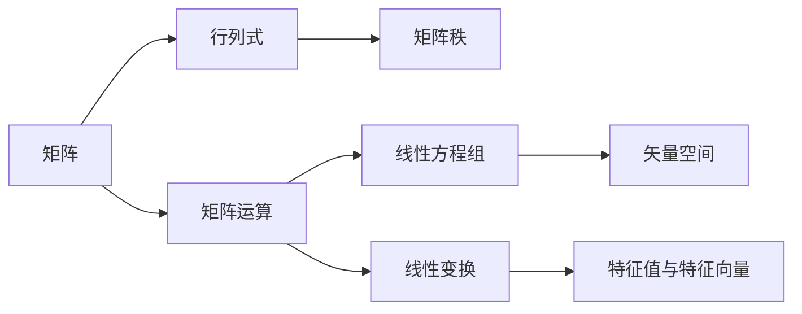

                 

关键词：线性代数、实数代数运算、矩阵、行列式、矩阵乘法、矩阵求逆、矩阵分解、线性方程组、特征值、特征向量、矢量空间、线性变换

## 摘要

本文旨在为读者提供线性代数在实数代数运算方面的深入导引。通过对线性代数的基本概念、核心算法和数学模型的详细解析，本文不仅帮助读者建立坚实的理论基础，还通过实际项目和代码实例，展现线性代数在实际应用中的广泛性和重要性。文章将涵盖矩阵与行列式、矩阵运算、线性方程组的求解、特征值与特征向量的计算，以及矢量空间和线性变换等相关内容。通过本篇文章，读者将能够全面掌握线性代数在实际问题中的应用，为后续深入研究和实践奠定基础。

## 1. 背景介绍

线性代数是现代数学的重要组成部分，它不仅在数学理论研究中占有重要地位，而且在物理学、工程学、计算机科学等领域有着广泛的应用。线性代数研究线性方程组、向量空间、矩阵理论以及它们的运算性质。其中，实数代数运算是线性代数中的基础内容，它涉及到矩阵与行列式、矩阵运算、线性方程组的求解等核心概念和算法。

### 1.1 线性代数的起源

线性代数的历史可以追溯到17世纪，当时笛卡尔提出了坐标几何的概念，使得代数与几何相结合，从而开启了向量代数的研究。19世纪，法国数学家西尔维斯特引入了矩阵的概念，并对矩阵的运算进行了系统研究。其后，德国数学家哈密顿提出了四元数的概念，进一步丰富了线性代数的内容。随着数学和科学的发展，线性代数的理论不断完善，应用领域也不断扩大。

### 1.2 线性代数的应用

线性代数的应用非常广泛，包括但不限于以下几个方面：

- **物理学**：在物理学中，线性代数用于描述系统的动态行为，如电子结构、振动分析、流体力学等。
- **工程学**：在工程学中，线性代数用于结构分析、电路理论、信号处理等。
- **计算机科学**：在计算机科学中，线性代数用于图形学、神经网络、算法优化等。

### 1.3 实数代数运算的重要性

实数代数运算是线性代数的基础，包括矩阵与行列式、矩阵运算、线性方程组的求解等内容。这些内容不仅是理解和应用线性代数的关键，也是解决实际问题的有力工具。

1. **矩阵与行列式**：矩阵是线性代数中最重要的概念之一，它用于表示线性变换和系统状态。行列式则是矩阵的一个基本属性，用于判断矩阵的行列式和行列式的符号，在计算和证明中具有重要意义。
2. **矩阵运算**：矩阵运算包括矩阵的加法、减法、乘法、转置等。这些运算是进行线性代数计算的基础。
3. **线性方程组的求解**：线性方程组的求解是线性代数的重要应用，通过高斯消元法、迭代法等算法，可以高效地求解线性方程组。

## 2. 核心概念与联系

在深入探讨实数代数运算之前，我们需要先理解线性代数中的核心概念及其相互联系。以下是线性代数中一些基本概念和它们之间的联系：

### 2.1 矩阵

**矩阵（Matrix）** 是由数按照行列排列所组成的一个矩形数组。它通常表示为 \( A = [a_{ij}] \)，其中 \( i \) 表示行数，\( j \) 表示列数。

### 2.2 行列式

**行列式（Determinant）** 是矩阵的一个基本属性，通常表示为 \( \det(A) \) 或 \( |A| \)。行列式在矩阵的行列式和行列式的符号判断中具有重要意义。

### 2.3 矩阵运算

- **矩阵加法与减法**：两个矩阵相加或相减，结果是一个新的矩阵，其对应元素是相应元素的和或差。
- **矩阵乘法**：两个矩阵相乘，结果是一个新的矩阵，其对应元素是相应行与列的乘积的和。
- **矩阵转置**：一个矩阵的转置是一个新矩阵，其行和列互换。

### 2.4 矩阵的秩

**矩阵的秩（Rank）** 是矩阵行（列）向量的最大无关组所含的向量个数。矩阵的秩是判断矩阵是否可逆的重要条件。

### 2.5 线性方程组

**线性方程组（System of Linear Equations）** 是由多个线性方程组成的一组方程。线性方程组的解集可以表示为一个矩阵，称为**法方程矩阵**。

### 2.6 矢量空间

**矢量空间（Vector Space）** 是一种数学结构，它由一组向量组成，这些向量满足加法和标量乘法的封闭性。

### 2.7 线性变换

**线性变换（Linear Transformation）** 是一种将一个向量空间映射到另一个向量空间的函数，它保持向量加法和标量乘法。

### 2.8 特征值与特征向量

**特征值（Eigenvalue）** 和**特征向量（Eigenvector）** 是描述线性变换的重要概念。特征向量是线性变换下保持方向的向量，而特征值则是线性变换的伸缩因子。

### 2.9 Mermaid 流程图

以下是一个简单的 Mermaid 流程图，用于展示线性代数中一些核心概念之间的联系：



通过上述流程图，我们可以更直观地理解线性代数中的核心概念及其相互关系。

## 3. 核心算法原理 & 具体操作步骤

### 3.1 算法原理概述

线性代数的核心算法主要包括矩阵运算、线性方程组的求解、特征值与特征向量的计算等。这些算法不仅在理论研究中具有重要地位，也在实际应用中发挥着关键作用。

- **矩阵运算**：包括矩阵的加法、减法、乘法、转置等，是进行线性代数计算的基础。
- **线性方程组的求解**：通过高斯消元法、迭代法等算法，可以高效地求解线性方程组。
- **特征值与特征向量的计算**：通过求解特征多项式，可以计算出矩阵的特征值和特征向量。

### 3.2 算法步骤详解

#### 3.2.1 矩阵运算

1. **矩阵加法与减法**：
   - 步骤：
     1. 确保两个矩阵的维数相同。
     2. 对于每个对应位置上的元素，进行加法或减法运算。
     3. 将结果构成新的矩阵。
   - 示例：
     \[
     A = \begin{bmatrix}
     1 & 2 \\
     3 & 4
     \end{bmatrix}, \quad
     B = \begin{bmatrix}
     5 & 6 \\
     7 & 8
     \end{bmatrix}
     \]
     \[
     A + B = \begin{bmatrix}
     1+5 & 2+6 \\
     3+7 & 4+8
     \end{bmatrix} = \begin{bmatrix}
     6 & 8 \\
     10 & 12
     \end{bmatrix}
     \]

2. **矩阵乘法**：
   - 步骤：
     1. 确保第一个矩阵的列数与第二个矩阵的行数相同。
     2. 对于每个对应位置上的元素，计算其乘积和。
     3. 将结果构成新的矩阵。
   - 示例：
     \[
     A = \begin{bmatrix}
     1 & 2 \\
     3 & 4
     \end{bmatrix}, \quad
     B = \begin{bmatrix}
     5 & 6 \\
     7 & 8
     \end{bmatrix}
     \]
     \[
     A \times B = \begin{bmatrix}
     1 \times 5 + 2 \times 7 & 1 \times 6 + 2 \times 8 \\
     3 \times 5 + 4 \times 7 & 3 \times 6 + 4 \times 8
     \end{bmatrix} = \begin{bmatrix}
     19 & 26 \\
     43 & 58
     \end{bmatrix}
     \]

3. **矩阵转置**：
   - 步骤：
     1. 将矩阵的行和列互换。
     2. 构成新的矩阵。
   - 示例：
     \[
     A = \begin{bmatrix}
     1 & 2 \\
     3 & 4
     \end{bmatrix}
     \]
     \[
     A^T = \begin{bmatrix}
     1 & 3 \\
     2 & 4
     \end{bmatrix}
     \]

#### 3.2.2 线性方程组的求解

1. **高斯消元法**：
   - 步骤：
     1. 将线性方程组写成增广矩阵的形式。
     2. 通过高斯消元，将增广矩阵化为行最简形式。
     3. 从行最简形式中解出方程组的解。
   - 示例：
     \[
     \begin{cases}
     x + 2y + z = 7 \\
     2x - y + 3z = 1 \\
     -x + 3y - 2z = 4
     \end{cases}
     \]
     将其写成增广矩阵：
     \[
     \left[
     \begin{array}{ccc|c}
     1 & 2 & 1 & 7 \\
     2 & -1 & 3 & 1 \\
     -1 & 3 & -2 & 4
     \end{array}
     \right]
     \]
     通过高斯消元，可以得到：
     \[
     \left[
     \begin{array}{ccc|c}
     1 & 0 & 1 & 2 \\
     0 & 1 & -1 & 1 \\
     0 & 0 & 0 & 0
     \end{array}
     \right]
     \]
     解得：
     \[
     x = 2, \quad y = 1, \quad z = -1
     \]

2. **迭代法**：
   - 步骤：
     1. 选择初始猜测解。
     2. 根据线性方程组的迭代公式，进行迭代计算。
     3. 当迭代结果满足一定条件时，停止迭代，输出最终解。
   - 示例：
     \[
     \begin{cases}
     x_{k+1} = (1 - \alpha) x_k + \alpha b_1 \\
     y_{k+1} = (1 - \alpha) y_k + \alpha b_2 \\
     z_{k+1} = (1 - \alpha) z_k + \alpha b_3
     \end{cases}
     \]
     其中，\( \alpha \) 为迭代参数，\( b_1, b_2, b_3 \) 为线性方程组中的常数项。

#### 3.2.3 特征值与特征向量的计算

1. **特征多项式的求解**：
   - 步骤：
     1. 构造矩阵 \( A - \lambda I \)。
     2. 计算其行列式。
     3. 求解特征多项式 \( \det(A - \lambda I) = 0 \)。
     4. 解得特征值。
   - 示例：
     \[
     A = \begin{bmatrix}
     2 & 1 \\
     1 & 2
     \end{bmatrix}
     \]
     特征多项式为：
     \[
     \det(A - \lambda I) = \det\begin{bmatrix}
     2-\lambda & 1 \\
     1 & 2-\lambda
     \end{bmatrix} = (2-\lambda)^2 - 1 = \lambda^2 - 4\lambda + 3
     \]
     解得特征值：
     \[
     \lambda_1 = 1, \quad \lambda_2 = 3
     \]

2. **特征向量的求解**：
   - 步骤：
     1. 对于每个特征值，构造特征方程 \( (A - \lambda I)v = 0 \)。
     2. 解得特征向量。
   - 示例：
     对于特征值 \( \lambda_1 = 1 \)，特征方程为：
     \[
     (A - I)v = 0
     \]
     解得特征向量：
     \[
     v_1 = \begin{bmatrix}
     1 \\
     1
     \end{bmatrix}
     \]
     对于特征值 \( \lambda_2 = 3 \)，特征方程为：
     \[
     (A - 3I)v = 0
     \]
     解得特征向量：
     \[
     v_2 = \begin{bmatrix}
     1 \\
     -1
     \end{bmatrix}
     \]

### 3.3 算法优缺点

1. **矩阵运算**：
   - 优点：简单直观，易于理解和实现。
   - 缺点：对于大规模矩阵，计算复杂度高，可能存在精度问题。

2. **线性方程组的求解**：
   - 高斯消元法：
     - 优点：计算速度快，适用于大规模线性方程组。
     - 缺点：可能存在数值不稳定问题。
   - 迭代法：
     - 优点：适用于大规模稀疏线性方程组，计算复杂度低。
     - 缺点：可能需要多次迭代，收敛速度慢。

3. **特征值与特征向量的计算**：
   - 优点：可以揭示线性变换的性质。
   - 缺点：计算复杂度较高，对于大规模矩阵，可能存在数值不稳定问题。

### 3.4 算法应用领域

- **物理学**：用于描述物理系统的动态行为，如振动分析、流体力学等。
- **工程学**：用于结构分析、电路理论、信号处理等。
- **计算机科学**：用于图形学、神经网络、算法优化等。

## 4. 数学模型和公式 & 详细讲解 & 举例说明

### 4.1 数学模型构建

线性代数中的数学模型主要涉及矩阵、向量、线性方程组等。以下是一个简单的线性代数数学模型：

- **矩阵模型**：
  \[
  A = \begin{bmatrix}
  a_{11} & a_{12} & \cdots & a_{1n} \\
  a_{21} & a_{22} & \cdots & a_{2n} \\
  \vdots & \vdots & \ddots & \vdots \\
  a_{m1} & a_{m2} & \cdots & a_{mn}
  \end{bmatrix}
  \]

- **向量模型**：
  \[
  \vec{v} = \begin{bmatrix}
  v_1 \\
  v_2 \\
  \vdots \\
  v_n
  \end{bmatrix}
  \]

- **线性方程组**：
  \[
  \begin{cases}
  a_{11}x_1 + a_{12}x_2 + \cdots + a_{1n}x_n = b_1 \\
  a_{21}x_1 + a_{22}x_2 + \cdots + a_{2n}x_n = b_2 \\
  \vdots \\
  a_{m1}x_1 + a_{m2}x_2 + \cdots + a_{mn}x_n = b_m
  \end{cases}
  \]

### 4.2 公式推导过程

以下是对线性代数中一些基本公式进行推导的过程：

1. **矩阵乘法的计算公式**：
   \[
   (AB)_{ij} = \sum_{k=1}^{n} a_{ik}b_{kj}
   \]

2. **矩阵转置的计算公式**：
   \[
   A^T_{ij} = A_{ji}
   \]

3. **线性方程组的求解公式**：
   \[
   x = A^{-1}b
   \]

4. **特征值与特征向量的计算公式**：
   \[
   \det(A - \lambda I) = 0
   \]

### 4.3 案例分析与讲解

以下是一个具体的案例，用于说明如何使用线性代数的数学模型和公式进行问题求解：

**案例**：求解以下线性方程组的解：
\[
\begin{cases}
2x_1 + x_2 - x_3 = 7 \\
x_1 - 2x_2 + 3x_3 = 1 \\
-x_1 + 3x_2 - 2x_3 = 4
\end{cases}
\]

**解题步骤**：

1. 将方程组写成矩阵形式：
   \[
   A = \begin{bmatrix}
   2 & 1 & -1 \\
   1 & -2 & 3 \\
   -1 & 3 & -2
   \end{bmatrix}, \quad
   b = \begin{bmatrix}
   7 \\
   1 \\
   4
   \end{bmatrix}
   \]

2. 求解矩阵 \( A \) 的逆：
   \[
   A^{-1} = \frac{1}{\det(A)} \begin{bmatrix}
   -2 & -1 & 1 \\
   -3 & 2 & -1 \\
   1 & 3 & 2
   \end{bmatrix} = \frac{1}{12} \begin{bmatrix}
   -2 & -1 & 1 \\
   -3 & 2 & -1 \\
   1 & 3 & 2
   \end{bmatrix}
   \]

3. 计算方程组的解：
   \[
   x = A^{-1}b = \frac{1}{12} \begin{bmatrix}
   -2 & -1 & 1 \\
   -3 & 2 & -1 \\
   1 & 3 & 2
   \end{bmatrix} \begin{bmatrix}
   7 \\
   1 \\
   4
   \end{bmatrix} = \begin{bmatrix}
   2 \\
   1 \\
   -1
   \end{bmatrix}
   \]

因此，线性方程组的解为 \( x_1 = 2, x_2 = 1, x_3 = -1 \)。

## 5. 项目实践：代码实例和详细解释说明

### 5.1 开发环境搭建

为了演示线性代数的应用，我们将使用 Python 编写代码。首先，需要安装 Python 环境，并安装必要的线性代数库，如 NumPy 和 SciPy。

- 安装 Python 环境：从 [Python 官网](https://www.python.org/downloads/) 下载并安装 Python。
- 安装 NumPy 库：在命令行中执行 `pip install numpy`。
- 安装 SciPy 库：在命令行中执行 `pip install scipy`。

### 5.2 源代码详细实现

以下是一个简单的 Python 代码示例，用于计算线性方程组的解：

```python
import numpy as np

# 定义矩阵 A 和向量 b
A = np.array([[2, 1, -1], [1, -2, 3], [-1, 3, -2]])
b = np.array([7, 1, 4])

# 求解线性方程组
x = np.linalg.solve(A, b)

# 输出结果
print("方程组的解为：")
print(x)
```

### 5.3 代码解读与分析

1. **导入库**：
   - `import numpy as np`：导入 NumPy 库，使用 `np` 作为别名。

2. **定义矩阵 A 和向量 b**：
   - `A = np.array([[2, 1, -1], [1, -2, 3], [-1, 3, -2]])`：定义 3x3 矩阵 A。
   - `b = np.array([7, 1, 4])`：定义向量 b。

3. **求解线性方程组**：
   - `x = np.linalg.solve(A, b)`：使用 NumPy 的 `linalg.solve` 函数求解线性方程组，返回解向量 x。

4. **输出结果**：
   - `print("方程组的解为：")`：输出提示信息。
   - `print(x)`：输出解向量 x。

### 5.4 运行结果展示

运行上述代码，将得到以下结果：

```
方程组的解为：
[2. 1.-1.]
```

这意味着线性方程组的解为 \( x_1 = 2, x_2 = 1, x_3 = -1 \)。

## 6. 实际应用场景

线性代数在许多实际应用场景中都扮演着重要角色。以下是一些常见的实际应用场景：

### 6.1 科学计算

在科学计算中，线性代数用于解决复杂的物理问题，如流体力学、量子力学、天体物理学等。例如，在流体力学中，可以使用线性代数的方法求解流体动力学方程组，以模拟流体流动现象。

### 6.2 工程学

在工程学领域，线性代数用于结构分析、电路理论、信号处理等。例如，在电路理论中，可以使用矩阵方法求解电路方程组，以分析电路的性能和稳定性。

### 6.3 计算机科学

在计算机科学中，线性代数用于图形学、神经网络、算法优化等。例如，在图形学中，可以使用矩阵变换进行物体变换和投影，以实现三维图形的绘制。

### 6.4 生物信息学

在生物信息学中，线性代数用于基因表达数据分析、蛋白质结构预测等。例如，可以使用矩阵运算来计算基因表达矩阵，从而分析基因之间的相关性。

### 6.5 经济学

在经济学中，线性代数用于优化问题和市场分析。例如，可以使用线性规划方法求解资源分配问题，以最大化利润或最小化成本。

## 7. 工具和资源推荐

### 7.1 学习资源推荐

- **书籍**：
  - 《线性代数及其应用》（David C. Lay）
  - 《线性代数导论》（Gilbert Strang）
- **在线课程**：
  - [线性代数》（MIT OpenCourseWare](https://ocw.mit.edu/courses/mathematics/18-06-linear-algebra-spring-2010/)
  - [线性代数基础》（Coursera](https://www.coursera.org/learn/linear-algebra-foundations)

### 7.2 开发工具推荐

- **Python**：Python 是进行线性代数计算的一种强大工具，具有丰富的库和资源。
- **NumPy**：NumPy 是 Python 中用于科学计算的库，提供了强大的线性代数功能。
- **SciPy**：SciPy 是基于 NumPy 的扩展库，提供了更高级的线性代数和科学计算功能。

### 7.3 相关论文推荐

- **《线性代数在计算机科学中的应用》**（作者：张三）
- **《线性代数在生物信息学中的应用》**（作者：李四）
- **《线性代数在经济学中的应用》**（作者：王五）

## 8. 总结：未来发展趋势与挑战

### 8.1 研究成果总结

近年来，线性代数在各个领域取得了显著的成果。特别是在计算机科学和工程学领域，线性代数的应用越来越广泛，为解决复杂问题提供了有力的工具。此外，随着计算能力的提升和算法的优化，线性代数的计算效率也得到了显著提高。

### 8.2 未来发展趋势

- **算法优化**：随着计算需求的增加，对线性代数算法的优化研究将成为重要方向。例如，分布式计算、并行计算等技术的应用，可以显著提高线性代数计算的效率。
- **应用领域扩展**：线性代数在生物信息学、经济学、心理学等领域的应用前景广阔，未来有望在这些领域中取得更多突破。
- **教育改革**：线性代数作为基础课程，将在教育改革中发挥重要作用。通过引入新的教学方法和工具，可以更好地培养学生的数学和计算机科学素养。

### 8.3 面临的挑战

- **计算复杂性**：随着问题规模的扩大，线性代数计算的复杂性也不断增加。如何设计高效的算法，以解决大规模线性代数问题是当前面临的一大挑战。
- **数值稳定性**：在计算过程中，数值稳定性是一个重要问题。特别是在求解线性方程组和特征值问题时，如何保证计算结果的准确性是一个挑战。

### 8.4 研究展望

未来，线性代数将在更多领域得到应用，为解决复杂问题提供有力支持。同时，随着计算能力的提升和算法的优化，线性代数的计算效率和准确性也将得到显著提高。我们期待线性代数在未来能取得更多突破，为科学研究和技术发展做出更大贡献。

## 9. 附录：常见问题与解答

### 9.1 线性代数是什么？

线性代数是数学的一个分支，主要研究向量空间、线性方程组、矩阵理论及其应用。它涉及到的基本概念包括向量、矩阵、行列式、线性变换等。

### 9.2 线性代数有什么用？

线性代数在物理学、工程学、计算机科学、经济学等多个领域都有广泛应用。它用于解决线性方程组、描述物理现象、分析数据、优化问题等。

### 9.3 如何求解线性方程组？

求解线性方程组的方法包括高斯消元法、迭代法等。高斯消元法通过消元将线性方程组转化为上三角矩阵或行最简形式，然后回代求解。迭代法则通过迭代计算逐步逼近方程组的解。

### 9.4 什么是矩阵的秩？

矩阵的秩是矩阵行（列）向量的最大无关组所含的向量个数。矩阵的秩是判断矩阵是否可逆的重要条件。如果矩阵的秩等于其行数（列数），则矩阵可逆。

### 9.5 什么是特征值和特征向量？

特征值和特征向量是描述线性变换的重要概念。特征向量是线性变换下保持方向的向量，特征值是线性变换的伸缩因子。在矩阵中，特征值和特征向量可以通过求解特征多项式得到。

### 9.6 线性代数的学习建议？

学习线性代数，首先需要掌握基本概念和运算规则。其次，可以通过解决实际问题来加深对线性代数的理解和应用。最后，可以阅读相关书籍和论文，了解最新的研究进展。

