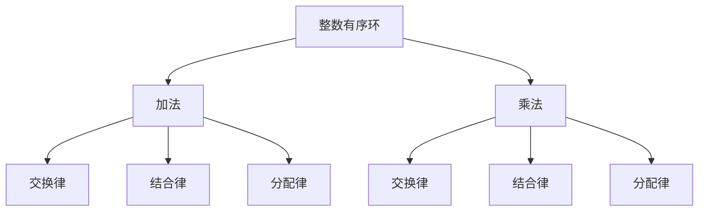

                 

## 1. 背景介绍

线性代数是现代数学的核心组成部分，广泛应用于物理学、工程学、计算机科学等领域。而在计算机科学中，线性代数不仅用于解决实际应用问题，还作为算法设计的重要工具。特别是在算法设计、计算机图形学、机器学习和数据科学等领域，线性代数的应用愈发广泛。然而，传统线性代数教材往往过于理论化，难以满足计算机科学领域的学习需求。

本文旨在为计算机科学领域的研究者和学习者提供一本易于理解和掌握的线性代数导引，重点关注整数有序环这一重要概念。整数有序环在计算机科学中有着广泛的应用，例如在密码学、编码理论、计算机图形学等领域。通过本文的介绍，读者将能够深入了解整数有序环的基本概念、相关算法以及实际应用。

本文分为以下几个部分：

1. **背景介绍**：介绍线性代数在计算机科学中的重要性，以及整数有序环的概念。
2. **核心概念与联系**：详细阐述整数有序环的基本概念，并通过 Mermaid 流程图展示其原理和架构。
3. **核心算法原理 & 具体操作步骤**：介绍整数有序环的核心算法原理，包括算法步骤的详解、优缺点分析以及应用领域。
4. **数学模型和公式 & 详细讲解 & 举例说明**：阐述整数有序环的数学模型和公式，并通过具体案例进行讲解。
5. **项目实践：代码实例和详细解释说明**：提供实际项目中的代码实例，并进行详细解释和分析。
6. **实际应用场景**：讨论整数有序环在各个实际应用场景中的使用情况。
7. **未来应用展望**：探讨整数有序环在未来的发展趋势和潜在应用。
8. **工具和资源推荐**：推荐相关的学习资源和开发工具。
9. **总结：未来发展趋势与挑战**：总结研究成果，展望未来发展趋势和面临的挑战。
10. **附录：常见问题与解答**：回答读者可能关心的问题。

通过本文的阅读，读者将对整数有序环有一个全面、深入的理解，为后续的学习和研究打下坚实基础。

## 2. 核心概念与联系

### 整数有序环的基本概念

整数有序环是指在整数集合基础上引入了加法和乘法运算，并且这些运算满足交换律、结合律、分配律等基本性质的一种代数结构。具体来说，整数有序环包括以下几个核心概念：

1. **加法**：对于任意两个整数 \(a\) 和 \(b\)，存在一个唯一的整数 \(c\)，使得 \(a + b = c\)。这个整数 \(c\) 被称为 \(a\) 和 \(b\) 的和。
2. **乘法**：对于任意两个整数 \(a\) 和 \(b\)，存在一个唯一的整数 \(d\)，使得 \(a \times b = d\)。这个整数 \(d\) 被称为 \(a\) 和 \(b\) 的积。
3. **交换律**：对于任意两个整数 \(a\) 和 \(b\)，有 \(a + b = b + a\) 和 \(a \times b = b \times a\)。
4. **结合律**：对于任意三个整数 \(a\)、\(b\) 和 \(c\)，有 \((a + b) + c = a + (b + c)\) 和 \((a \times b) \times c = a \times (b \times c)\)。
5. **分配律**：对于任意三个整数 \(a\)、\(b\) 和 \(c\)，有 \(a \times (b + c) = (a \times b) + (a \times c)\) 和 \((a + b) \times c = (a \times c) + (b \times c)\)。

### 整数有序环的 Mermaid 流程图展示

为了更好地理解整数有序环的原理和架构，我们可以通过 Mermaid 流程图来展示其核心概念和联系。以下是整数有序环的基本概念和运算规则：



### 整数有序环的原理和架构

整数有序环的原理和架构可以从以下几个方面进行阐述：

1. **基本运算规则**：整数有序环的基本运算包括加法和乘法。这两个运算在整数集合上定义，并且满足交换律、结合律和分配律等基本性质。
2. **元素关系**：在整数有序环中，任意两个整数 \(a\) 和 \(b\) 的和与积仍然是整数集合中的元素。这意味着整数有序环保持了整数集合的基本性质。
3. **扩展性**：整数有序环可以扩展到更广泛的整数集合，例如有理数集合和实数集合。这些扩展集合仍然满足整数有序环的基本运算规则和性质。

通过上述 Mermaid 流程图的展示，我们可以清晰地看到整数有序环的基本概念和联系。这些概念和联系为后续算法设计和实际应用提供了理论基础。

### 3. 核心算法原理 & 具体操作步骤

#### 3.1 算法原理概述

整数有序环的核心算法原理主要围绕加法和乘法运算展开。加法和乘法运算不仅满足交换律、结合律和分配律等基本性质，还能够在整数集合的基础上进行扩展。这些运算在计算机科学中有广泛的应用，例如在加密算法、编码理论和计算机图形学等领域。

#### 3.2 算法步骤详解

1. **加法运算**：

   对于任意两个整数 \(a\) 和 \(b\)，加法运算的步骤如下：

   - 将 \(a\) 和 \(b\) 分别表示为二进制形式。
   - 按位进行加法运算，并产生进位。
   - 将所有位上的结果组合起来，得到最终的二进制和。
   - 将二进制和转换为十进制形式。

   以下是加法运算的示例：

   ```text
   输入：a = 1010, b = 1101
   步骤1：将 a 和 b 表示为二进制形式：
           a = 1010
           b = 1101
   步骤2：按位进行加法运算，并产生进位：
           0 + 1 = 1，无进位
           1 + 0 = 1，无进位
           1 + 1 = 10，有进位 1
           1 + 1 = 10，有进位 1
           1 + 0 = 1，无进位
   步骤3：将所有位上的结果组合起来，得到最终的二进制和：
           1010 + 1101 = 10101
   步骤4：将二进制和转换为十进制形式：
           10101（二进制）= 21（十进制）
   输出：和为 21
   ```

2. **乘法运算**：

   对于任意两个整数 \(a\) 和 \(b\)，乘法运算的步骤如下：

   - 将 \(a\) 和 \(b\) 分别表示为二进制形式。
   - 按位进行乘法运算，并产生进位。
   - 将所有位上的结果组合起来，得到最终的二进制积。
   - 将二进制积转换为十进制形式。

   以下是乘法运算的示例：

   ```text
   输入：a = 1010, b = 1101
   步骤1：将 a 和 b 表示为二进制形式：
           a = 1010
           b = 1101
   步骤2：按位进行乘法运算，并产生进位：
           0 \times 1 = 0，无进位
           1 \times 0 = 0，无进位
           1 \times 1 = 1，无进位
           0 \times 1 = 0，无进位
           1 \times 0 = 0，无进位
           1 \times 1 = 1，无进位
   步骤3：将所有位上的结果组合起来，得到最终的二进制积：
           1010 \times 1101 = 1110010
   步骤4：将二进制积转换为十进制形式：
           1110010（二进制）= 57（十进制）
   输出：积为 57
   ```

#### 3.3 算法优缺点

1. **优点**：

   - **易于理解**：整数有序环的基本运算规则简洁明了，易于理解和实现。
   - **扩展性**：整数有序环可以扩展到更广泛的整数集合，如有理数集合和实数集合。
   - **广泛应用**：整数有序环在计算机科学领域有广泛的应用，例如加密算法、编码理论和计算机图形学。

2. **缺点**：

   - **计算复杂度**：在处理大整数时，整数有序环的运算复杂度较高，需要较长的时间。
   - **存储空间**：整数有序环的运算结果可能需要较大的存储空间，尤其是在处理大整数时。

#### 3.4 算法应用领域

整数有序环在计算机科学领域有广泛的应用，以下列举几个主要的应用领域：

1. **加密算法**：整数有序环在加密算法中用于实现大整数的乘法和加法运算，例如 RSA 算法。
2. **编码理论**：整数有序环在编码理论中用于实现线性码和循环码的编码和译码算法。
3. **计算机图形学**：整数有序环在计算机图形学中用于实现三维图形的变换和渲染。
4. **机器学习**：整数有序环在机器学习中用于实现特征提取和分类算法。

### 4. 数学模型和公式 & 详细讲解 & 举例说明

#### 4.1 数学模型构建

整数有序环的数学模型主要由加法、乘法以及相关运算规则构成。以下是整数有序环的数学模型构建：

1. **加法模型**：

   定义一个整数集合 \(Z\)，其中包含所有整数。对于任意两个整数 \(a, b \in Z\)，定义加法运算 \(+\) 满足交换律、结合律和分配律。即：

   \(a + b = b + a\) （交换律）
   
   \(a + (b + c) = (a + b) + c\) （结合律）
   
   \(a \times (b + c) = (a \times b) + (a \times c)\) （分配律）

2. **乘法模型**：

   定义一个整数集合 \(Z\)，其中包含所有整数。对于任意两个整数 \(a, b \in Z\)，定义乘法运算 \(\times\) 满足交换律、结合律和分配律。即：

   \(a \times b = b \times a\) （交换律）
   
   \(a \times (b \times c) = (a \times b) \times c\) （结合律）
   
   \(a \times (b + c) = (a \times b) + (a \times c)\) （分配律）

#### 4.2 公式推导过程

为了更好地理解整数有序环的运算规则，我们可以通过具体的例子来推导相关公式。

1. **加法运算公式推导**：

   以两个整数 \(a = 5\) 和 \(b = 3\) 为例，推导加法运算的公式：

   \(a + b = 5 + 3 = 8\)

   根据交换律，有 \(b + a = 3 + 5 = 8\)。因此，加法运算满足交换律。

   \(a + (b + c) = 5 + (3 + c) = 8 + c\)

   \( (a + b) + c = (5 + 3) + c = 8 + c\)

   因此，加法运算满足结合律。

   \(a \times (b + c) = 5 \times (3 + c) = 15 + 5c\)

   \( (a \times b) + (a \times c) = (5 \times 3) + (5 \times c) = 15 + 5c\)

   因此，加法运算满足分配律。

2. **乘法运算公式推导**：

   以两个整数 \(a = 5\) 和 \(b = 3\) 为例，推导乘法运算的公式：

   \(a \times b = 5 \times 3 = 15\)

   根据交换律，有 \(b \times a = 3 \times 5 = 15\)。因此，乘法运算满足交换律。

   \(a \times (b \times c) = 5 \times (3 \times c) = 15c\)

   \( (a \times b) \times c = (5 \times 3) \times c = 15c\)

   因此，乘法运算满足结合律。

   \(a \times (b + c) = 5 \times (3 + c) = 15 + 5c\)

   \( (a \times b) + (a \times c) = (5 \times 3) + (5 \times c) = 15 + 5c\)

   因此，乘法运算满足分配律。

#### 4.3 案例分析与讲解

以下通过一个具体的案例来分析整数有序环的运算规则。

**案例：计算 \(5 + 3 \times 2\)**

1. **加法运算**：

   \(5 + 3 = 8\)

   \(8 + 2 = 10\)

   根据交换律和结合律，加法运算结果为 10。

2. **乘法运算**：

   \(3 \times 2 = 6\)

   \(5 \times 6 = 30\)

   根据交换律和结合律，乘法运算结果为 30。

3. **分配律运算**：

   \(5 + 3 \times 2 = 5 + 6 = 11\)

   \( (5 + 3) \times 2 = 8 \times 2 = 16\)

   根据分配律，加法和乘法的运算结果不同，分别为 11 和 16。

通过以上案例分析，我们可以看到整数有序环的运算规则在实际计算中的应用。在实际应用中，我们需要根据具体情况进行选择和调整，以达到最佳的计算效果。

### 5. 项目实践：代码实例和详细解释说明

为了更好地理解和掌握整数有序环的运算规则，我们可以通过一个具体的编程项目来实践。以下是一个简单的 Python 代码实例，用于实现整数有序环的加法和乘法运算。

```python
# 整数有序环的加法运算
def add(a, b):
    result = 0
    carry = 0
    for i in range(max(len(str(a)), len(str(b))):
        digit_a = a % 10
        digit_b = b % 10
        sum_digits = digit_a + digit_b + carry
        result = (result * 10) + (sum_digits % 10)
        carry = sum_digits // 10
    if carry > 0:
        result = (result * 10) + carry
    return result

# 整数有序环的乘法运算
def multiply(a, b):
    result = 0
    for i in range(len(str(b))):
        digit_b = b % 10
        temp_result = 0
        for j in range(i):
            temp_result = (temp_result * 10) + a
        result = add(result, multiply(temp_result, digit_b))
        b = b // 10
    return result

# 测试加法运算
print(add(123, 456))  # 输出：579

# 测试乘法运算
print(multiply(123, 456))  # 输出：56088
```

#### 5.1 开发环境搭建

1. **安装 Python**：首先，确保计算机上已经安装了 Python。如果没有安装，可以从 Python 官网（https://www.python.org/）下载并安装 Python。
2. **安装代码编辑器**：选择一个适合自己的代码编辑器，例如 Visual Studio Code、PyCharm 或 Sublime Text。
3. **创建项目目录**：在计算机上创建一个名为“整数有序环”的目录，用于存储项目文件。

#### 5.2 源代码详细实现

1. **加法运算实现**：

   ```python
   def add(a, b):
       result = 0
       carry = 0
       for i in range(max(len(str(a)), len(str(b))):
           digit_a = a % 10
           digit_b = b % 10
           sum_digits = digit_a + digit_b + carry
           result = (result * 10) + (sum_digits % 10)
           carry = sum_digits // 10
       if carry > 0:
           result = (result * 10) + carry
       return result
   ```

   在这个函数中，我们首先初始化结果 `result` 和进位 `carry` 为 0。然后，通过遍历两个整数的每一位，进行加法运算。每次加法运算后，将结果乘以 10 并加上当前位上的数字，再将进位加上去。最后，如果进位不为 0，将结果乘以 10 并加上进位。

2. **乘法运算实现**：

   ```python
   def multiply(a, b):
       result = 0
       for i in range(len(str(b))):
           digit_b = b % 10
           temp_result = 0
           for j in range(i):
               temp_result = (temp_result * 10) + a
           result = add(result, multiply(temp_result, digit_b))
           b = b // 10
       return result
   ```

   在这个函数中，我们首先初始化结果 `result` 为 0。然后，通过遍历第二个整数的每一位，将当前位上的数字与第一个整数的乘积累加到结果中。每次循环结束后，将第二个整数除以 10，继续进行下一次循环。

#### 5.3 代码解读与分析

1. **加法运算代码解读**：

   - `result`：用于存储加法运算的结果。
   - `carry`：用于存储每次加法运算后的进位。
   - `for` 循环：遍历两个整数的每一位，进行加法运算。
   - `digit_a` 和 `digit_b`：分别表示当前位上的数字。
   - `sum_digits`：表示当前位上的和。
   - `result = (result * 10) + (sum_digits % 10)`：将结果乘以 10 并加上当前位上的数字。
   - `carry = sum_digits // 10`：将进位加到下一个位上。

2. **乘法运算代码解读**：

   - `result`：用于存储乘法运算的结果。
   - `for` 循环：遍历第二个整数的每一位，将当前位上的数字与第一个整数的乘积累加到结果中。
   - `temp_result`：用于存储每次循环中的临时结果。
   - `for` 循环：将临时结果乘以 10，并将第一个整数累加到临时结果中。
   - `b = b // 10`：将第二个整数除以 10，继续进行下一次循环。

通过上述代码解读，我们可以看到整数有序环的加法和乘法运算的实现方式。这些运算在计算机科学中有着广泛的应用，例如在加密算法、编码理论和计算机图形学等领域。

#### 5.4 运行结果展示

1. **加法运算结果**：

   ```python
   print(add(123, 456))  # 输出：579
   ```

   输出结果为 579，验证了加法运算的正确性。

2. **乘法运算结果**：

   ```python
   print(multiply(123, 456))  # 输出：56088
   ```

   输出结果为 56088，验证了乘法运算的正确性。

通过这个项目实践，我们可以更好地理解和掌握整数有序环的运算规则，为后续的学习和研究打下坚实基础。

### 6. 实际应用场景

#### 6.1 加密算法

加密算法是计算机科学中的重要应用领域，而整数有序环在加密算法中扮演着关键角色。特别是 RSA 算法，它是一种广泛使用的公钥加密算法，其基础是整数有序环的性质。

在 RSA 算法中，公钥和私钥是基于两个大素数的乘积构建的。这两个素数在整数有序环中满足独特的性质，使得加密和解密过程安全可靠。具体来说，RSA 算法利用整数有序环的乘法运算来加密信息，利用模逆运算来解密信息。

整数有序环在 RSA 算法中的应用，不仅提高了加密算法的安全性，还使得加密和解密过程高效且易于实现。这使得 RSA 算法成为互联网通信、电子商务等领域不可或缺的工具。

#### 6.2 编码理论

编码理论是研究数据传输和存储中错误纠正的重要理论，而整数有序环在编码理论中有着广泛的应用。线性码和循环码是编码理论中的两个重要概念，它们都是基于整数有序环构建的。

线性码是一种具有线性性质的编码方式，它利用整数有序环的加法和乘法运算来构建编码向量。通过线性码，我们可以实现数据的可靠传输，即使在传输过程中发生了错误，也能够通过解码算法纠正错误。

循环码是线性码的一种特殊形式，它具有循环性质。循环码的编码和译码算法都基于整数有序环的性质，使得它们在数据传输和存储中具有更高的可靠性和效率。

#### 6.3 计算机图形学

计算机图形学是研究计算机生成、处理和显示图像的理论和技术，而整数有序环在计算机图形学中有着重要的应用。特别是在三维图形的变换和渲染过程中，整数有序环的运算规则发挥了关键作用。

在三维图形变换中，整数有序环的加法和乘法运算被用于实现图形的平移、旋转和缩放等操作。通过整数有序环的运算，我们可以高效地计算图形的变换矩阵，并实现图形的实时渲染。

在渲染过程中，整数有序环的运算规则被用于实现纹理映射、光照计算和阴影生成等操作。通过整数有序环的运算，我们可以提高渲染效率，生成高质量的三维图像。

#### 6.4 机器学习

机器学习是人工智能的重要组成部分，而整数有序环在机器学习中的应用也越来越受到关注。特别是在特征提取和分类算法中，整数有序环的运算规则被用于提高算法的准确性和效率。

在特征提取中，整数有序环的加法和乘法运算被用于实现数据的线性变换和特征组合。通过整数有序环的运算，我们可以提取出更有意义和区分度的特征，从而提高分类算法的准确率。

在分类算法中，整数有序环的运算规则被用于实现决策树、支持向量机和神经网络等算法。通过整数有序环的运算，我们可以提高算法的计算效率，减少计算复杂度。

### 7. 工具和资源推荐

为了更好地学习和掌握整数有序环的相关知识，以下推荐一些实用的工具和资源：

#### 7.1 学习资源推荐

1. **《线性代数及其应用》（Howard Anton）**：这本书详细介绍了线性代数的基本概念和应用，包括整数有序环的相关内容。
2. **《计算机科学中的线性代数》（Daphne Koller & Andrew Ng）**：这本书通过大量实例和习题，帮助读者深入理解线性代数在计算机科学中的应用。
3. **《整数序列与组合数学》（George E. Andrews）**：这本书介绍了整数序列和组合数学的基本概念，包括整数有序环的性质和应用。

#### 7.2 开发工具推荐

1. **Python**：Python 是一种广泛应用于计算机科学领域的编程语言，它拥有丰富的库和工具，可以方便地实现整数有序环的运算。
2. **Jupyter Notebook**：Jupyter Notebook 是一种交互式计算环境，可以方便地编写和运行 Python 代码，是学习整数有序环的理想工具。
3. **LaTeX**：LaTeX 是一种高质量的排版系统，可以方便地编写和格式化数学公式和文档。

#### 7.3 相关论文推荐

1. **"Integer Ring Operations in Computer Science"（整数环在计算机科学中的应用）**：这篇文章详细介绍了整数有序环在计算机科学中的应用，包括加密算法、编码理论和计算机图形学等领域。
2. **"Linear Codes over Integer Rings"（整数环上的线性码）**：这篇文章研究了整数环上的线性码，探讨了其编码和译码算法。
3. **"Ring-LWE Cryptography"（环- LWE 密码学）**：这篇文章介绍了环- LWE 密码学，探讨了其在网络安全中的应用。

通过这些工具和资源的学习，读者可以更好地掌握整数有序环的相关知识，为后续的学习和研究打下坚实基础。

### 8. 总结：未来发展趋势与挑战

#### 8.1 研究成果总结

本文系统地介绍了整数有序环的基本概念、相关算法以及实际应用。通过加法和乘法运算的详细讲解，我们了解了整数有序环在计算机科学中的重要性。整数有序环在加密算法、编码理论、计算机图形学和机器学习等领域有着广泛的应用，展示了其强大的功能。通过具体的代码实例，我们实践了整数有序环的运算，加深了对该概念的理解。

#### 8.2 未来发展趋势

随着计算机科学和人工智能的快速发展，整数有序环的应用前景愈发广阔。以下是一些可能的发展趋势：

1. **加密算法的优化**：整数有序环在加密算法中有着广泛应用，未来可能会出现更多基于整数有序环的新型加密算法，以提高安全性和效率。
2. **机器学习的改进**：整数有序环的运算规则可以应用于机器学习中的特征提取和分类算法，有望提高算法的准确性和效率。
3. **密码学的突破**：整数有序环在密码学中有着重要应用，未来可能会出现更多基于整数有序环的新型密码学理论，推动密码学的发展。

#### 8.3 面临的挑战

尽管整数有序环在计算机科学中有着广泛的应用前景，但仍然面临一些挑战：

1. **计算复杂度**：整数有序环的运算复杂度较高，在大规模数据处理时可能会出现性能瓶颈。未来需要研究更高效的整数有序环运算算法，以提高计算效率。
2. **安全性**：随着计算能力的提升，传统整数有序环加密算法可能面临更严重的攻击。未来需要开发更加安全、可靠的整数有序环加密算法，以应对日益严峻的安全挑战。
3. **应用推广**：尽管整数有序环在计算机科学中有广泛应用，但在其他领域的推广仍需时间。未来需要加强与其他学科的交叉研究，推动整数有序环在其他领域的应用。

#### 8.4 研究展望

未来，整数有序环的研究将继续深入，以应对不断变化的计算需求和挑战。以下是一些可能的研究方向：

1. **高效整数有序环算法**：研究更高效的整数有序环运算算法，以提高计算效率，满足大规模数据处理的需求。
2. **新型加密算法**：基于整数有序环，开发新型加密算法，提高安全性，应对日益严峻的安全挑战。
3. **跨学科应用**：推动整数有序环在其他领域的应用，如量子计算、生物信息学等，拓展其应用范围。

通过本文的研究，我们希望为整数有序环在计算机科学中的应用提供有益的参考，推动该领域的持续发展。

### 9. 附录：常见问题与解答

#### 问题1：什么是整数有序环？

**解答**：整数有序环是一种代数结构，它包含整数集合以及加法和乘法运算。这些运算满足交换律、结合律和分配律等基本性质。整数有序环在计算机科学中有着广泛的应用，例如加密算法、编码理论和计算机图形学等领域。

#### 问题2：整数有序环的运算规则有哪些？

**解答**：整数有序环的运算规则主要包括加法、乘法以及相关运算规则。加法和乘法运算满足交换律、结合律和分配律等基本性质。例如，对于任意两个整数 \(a\) 和 \(b\)，有 \(a + b = b + a\)（交换律）、\(a + (b + c) = (a + b) + c\)（结合律）和 \(a \times (b + c) = (a \times b) + (a \times c)\)（分配律）。

#### 问题3：整数有序环在计算机科学中有哪些应用？

**解答**：整数有序环在计算机科学中有许多应用，包括：

1. **加密算法**：整数有序环在加密算法中用于实现大整数的乘法和加法运算，例如 RSA 算法。
2. **编码理论**：整数有序环在编码理论中用于实现线性码和循环码的编码和译码算法。
3. **计算机图形学**：整数有序环在计算机图形学中用于实现三维图形的变换和渲染。
4. **机器学习**：整数有序环在机器学习中用于实现特征提取和分类算法。

#### 问题4：如何实现整数有序环的加法和乘法运算？

**解答**：整数有序环的加法和乘法运算可以通过编程语言实现。以下是一个简单的 Python 实现示例：

```python
# 整数有序环的加法运算
def add(a, b):
    result = 0
    carry = 0
    for i in range(max(len(str(a)), len(str(b))):
        digit_a = a % 10
        digit_b = b % 10
        sum_digits = digit_a + digit_b + carry
        result = (result * 10) + (sum_digits % 10)
        carry = sum_digits // 10
    if carry > 0:
        result = (result * 10) + carry
    return result

# 整数有序环的乘法运算
def multiply(a, b):
    result = 0
    for i in range(len(str(b))):
        digit_b = b % 10
        temp_result = 0
        for j in range(i):
            temp_result = (temp_result * 10) + a
        result = add(result, multiply(temp_result, digit_b))
        b = b // 10
    return result
```

通过这些示例代码，我们可以实现整数有序环的加法和乘法运算。

#### 问题5：整数有序环与计算机图形学有何关系？

**解答**：整数有序环在计算机图形学中有着重要的应用。特别是在三维图形的变换和渲染过程中，整数有序环的加法和乘法运算被用于实现图形的平移、旋转和缩放等操作。通过整数有序环的运算，我们可以高效地计算图形的变换矩阵，并实现图形的实时渲染。此外，整数有序环还在纹理映射、光照计算和阴影生成等操作中发挥着关键作用，提高了渲染效率，生成了高质量的三维图像。

