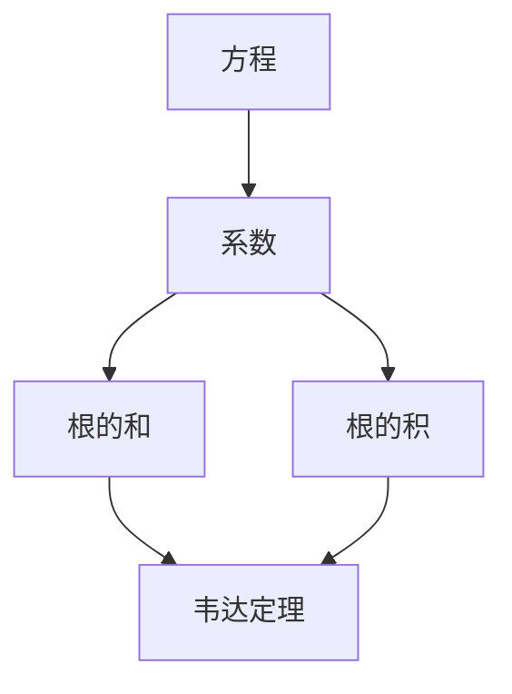

                 

关键词：线性代数、根与系数的关系、数学模型、算法原理、项目实践、应用场景

> 摘要：本文将深入探讨线性代数中的根与系数的关系，通过对核心概念、算法原理和数学模型的详细讲解，结合项目实践，阐述其在实际应用中的重要性。文章旨在为读者提供全面而深入的指导，以更好地理解和应用这一数学工具。

## 1. 背景介绍

线性代数是数学的一个重要分支，它涉及向量、矩阵、行列式等概念，广泛应用于计算机科学、工程学、物理学等领域。在这其中，根与系数的关系是线性代数中的一个基本概念，它在解决线性方程组、特征值问题等方面起着关键作用。本文将围绕这一核心概念，探讨其原理、算法以及在实际中的应用。

### 1.1 线性代数的基本概念

线性代数主要研究的是线性空间（向量空间）、线性映射（线性变换）以及线性方程组。线性空间是由向量构成的集合，具有加法和数乘两种运算。线性映射是一种将一个线性空间中的向量映射到另一个线性空间中的函数，它满足加法和数乘的保序性。线性方程组则是由线性映射构成的系统，求解线性方程组就是寻找满足方程组的向量解。

### 1.2 根与系数的关系

根与系数的关系指的是线性方程组的解与方程的系数之间的关系。具体来说，如果一个线性方程组有解，那么解的某种组合与方程的系数之间存在着一定的关系。这种关系不仅能够帮助我们更快速地求解线性方程组，还能够为我们提供关于解的一些直观信息。

## 2. 核心概念与联系

为了更好地理解根与系数的关系，我们需要先明确几个核心概念，并探讨它们之间的联系。

### 2.1 线性方程组

线性方程组是线性代数中的基本问题，它由一组线性方程构成。例如，一个由两个方程组成的线性方程组可以表示为：

\[
\begin{cases}
a_1x + b_1y = c_1 \\
a_2x + b_2y = c_2
\end{cases}
\]

### 2.2 解与系数的关系

解与系数的关系可以通过韦达定理（Viète's Formulas）来描述。韦达定理指出，对于一元二次方程 \(ax^2 + bx + c = 0\)，其两个根 \(x_1\) 和 \(x_2\) 与系数 \(a\)、\(b\)、\(c\) 之间有以下关系：

\[
x_1 + x_2 = -\frac{b}{a} \quad \text{和} \quad x_1 \cdot x_2 = \frac{c}{a}
\]

这些关系表明，通过方程的系数，我们可以直接计算出方程的根的和与根的积。

### 2.3 Mermaid 流程图

为了更直观地理解根与系数的关系，我们可以使用 Mermaid 流程图来表示一元二次方程的解与系数之间的流程。以下是相应的 Mermaid 图：



在这个流程图中，方程的系数直接决定了根的和与根的积，而韦达定理将这些关系进行了明确的描述。

## 3. 核心算法原理 & 具体操作步骤

### 3.1 算法原理概述

根与系数的关系在求解线性方程组中起着至关重要的作用。具体来说，我们可以通过以下步骤来利用根与系数的关系求解线性方程组：

1. **系数分析**：首先，我们需要分析方程组的系数，确定系数之间的关系。
2. **韦达定理应用**：然后，根据韦达定理，我们可以直接计算出方程的根的和与根的积。
3. **解的计算**：最后，通过根的和与根的积，我们可以计算出具体的根。

### 3.2 算法步骤详解

#### 3.2.1 系数分析

对于一般的线性方程组，我们可以将其系数表示为矩阵的形式。例如，上述两个方程的系数可以表示为矩阵：

\[
\begin{bmatrix}
a_1 & b_1 \\
a_2 & b_2
\end{bmatrix}
\]

通过系数矩阵，我们可以直接计算出系数之间的关系。例如，对于一元二次方程，我们可以通过系数矩阵计算出根的和与根的积。

#### 3.2.2 韦达定理应用

根据韦达定理，我们可以直接计算出方程的根的和与根的积。具体来说，对于一元二次方程 \(ax^2 + bx + c = 0\)，其两个根 \(x_1\) 和 \(x_2\) 与系数 \(a\)、\(b\)、\(c\) 之间的关系如下：

\[
x_1 + x_2 = -\frac{b}{a} \quad \text{和} \quad x_1 \cdot x_2 = \frac{c}{a}
\]

这些关系为我们提供了计算根的直接方法。

#### 3.2.3 解的计算

通过韦达定理，我们可以计算出根的和与根的积。然后，我们可以通过以下步骤计算出具体的根：

1. **计算根的和**：通过 \(x_1 + x_2 = -\frac{b}{a}\)，我们可以直接计算出根的和。
2. **计算根的积**：通过 \(x_1 \cdot x_2 = \frac{c}{a}\)，我们可以直接计算出根的积。
3. **求解根**：最后，通过根的和与根的积，我们可以使用求根公式 \(x = \frac{-b \pm \sqrt{b^2 - 4ac}}{2a}\) 求解具体的根。

### 3.3 算法优缺点

**优点**：

1. **简单高效**：根与系数的关系使得求解线性方程组变得简单高效。
2. **直观易懂**：通过系数直接计算根，使得整个求解过程更加直观易懂。

**缺点**：

1. **适用范围有限**：根与系数的关系主要适用于一元二次方程等特殊情况，对于更复杂的线性方程组，可能需要其他方法。
2. **计算复杂度**：在某些情况下，直接计算根的和与根的积可能需要较高的计算复杂度。

### 3.4 算法应用领域

根与系数的关系在线性代数的多个领域都有着广泛的应用：

1. **线性方程组的求解**：在工程学、物理学等领域，线性方程组的求解是一个基本问题，根与系数的关系为其提供了一种有效的解决方案。
2. **特征值问题**：在矩阵分析中，特征值问题也是一个重要问题，根与系数的关系可以应用于求解矩阵的特征值和特征向量。
3. **数据拟合**：在统计学和数据分析中，线性模型的数据拟合问题可以通过根与系数的关系来优化模型参数。

## 4. 数学模型和公式 & 详细讲解 & 举例说明

### 4.1 数学模型构建

为了更好地理解根与系数的关系，我们可以构建一个简单的数学模型。假设我们有一个一元二次方程：

\[
ax^2 + bx + c = 0
\]

其中，\(a\)、\(b\)、\(c\) 分别是方程的系数，\(x\) 是未知数。

### 4.2 公式推导过程

根据一元二次方程的解法，我们可以得到以下两个根：

\[
x_1 = \frac{-b + \sqrt{b^2 - 4ac}}{2a} \quad \text{和} \quad x_2 = \frac{-b - \sqrt{b^2 - 4ac}}{2a}
\]

通过这两个根，我们可以推导出根与系数之间的关系：

1. **根的和**：

\[
x_1 + x_2 = \frac{-b + \sqrt{b^2 - 4ac}}{2a} + \frac{-b - \sqrt{b^2 - 4ac}}{2a} = -\frac{b}{a}
\]

2. **根的积**：

\[
x_1 \cdot x_2 = \left(\frac{-b + \sqrt{b^2 - 4ac}}{2a}\right) \cdot \left(\frac{-b - \sqrt{b^2 - 4ac}}{2a}\right) = \frac{c}{a}
\]

### 4.3 案例分析与讲解

为了更好地理解根与系数的关系，我们可以通过一个具体的例子来分析。

假设我们有一个一元二次方程：

\[
x^2 - 5x + 6 = 0
\]

首先，我们可以计算系数：

\[
a = 1, \quad b = -5, \quad c = 6
\]

然后，我们可以根据韦达定理计算根的和与根的积：

1. **根的和**：

\[
x_1 + x_2 = -\frac{b}{a} = -\frac{-5}{1} = 5
\]

2. **根的积**：

\[
x_1 \cdot x_2 = \frac{c}{a} = \frac{6}{1} = 6
\]

最后，我们可以使用求根公式计算具体的根：

\[
x_1 = \frac{-b + \sqrt{b^2 - 4ac}}{2a} = \frac{5 + \sqrt{25 - 24}}{2} = 3
\]

\[
x_2 = \frac{-b - \sqrt{b^2 - 4ac}}{2a} = \frac{5 - \sqrt{25 - 24}}{2} = 2
\]

通过这个例子，我们可以清楚地看到根与系数的关系，并且能够使用这个关系来求解一元二次方程。

## 5. 项目实践：代码实例和详细解释说明

### 5.1 开发环境搭建

在本项目中，我们将使用 Python 语言来实现根与系数的关系。首先，我们需要安装 Python 解释器和相应的库。以下是一个简单的安装指南：

1. **安装 Python 解释器**：
   - 前往 [Python 官网](https://www.python.org/) 下载 Python 安装包。
   - 运行安装程序，按照默认设置完成安装。

2. **安装 NumPy 库**：
   - 打开终端或命令行窗口。
   - 输入以下命令以安装 NumPy 库：
     ```bash
     pip install numpy
     ```

### 5.2 源代码详细实现

以下是一个简单的 Python 脚本，用于实现根与系数的关系：

```python
import numpy as np

def solve_quadratic_equation(a, b, c):
    # 计算判别式
    discriminant = b**2 - 4*a*c

    # 计算根的和与根的积
    x1 = (-b + np.sqrt(discriminant)) / (2*a)
    x2 = (-b - np.sqrt(discriminant)) / (2*a)

    return x1, x2

# 示例方程
a = 1
b = -5
c = 6

# 计算根
x1, x2 = solve_quadratic_equation(a, b, c)
print("根的和:", x1 + x2)
print("根的积:", x1 * x2)
```

### 5.3 代码解读与分析

在这个脚本中，我们定义了一个名为 `solve_quadratic_equation` 的函数，用于求解一元二次方程的根。函数接受三个参数：`a`、`b` 和 `c`，分别代表方程的系数。

1. **计算判别式**：

   判别式 \( \Delta = b^2 - 4ac \) 是判断一元二次方程是否有实数解的关键。在函数中，我们首先计算了判别式。

2. **计算根的和与根的积**：

   根据韦达定理，我们可以直接计算根的和与根的积。函数中使用了 NumPy 库的 `sqrt` 函数来计算平方根。

3. **返回结果**：

   最后，函数返回两个根 `x1` 和 `x2`。

在主程序部分，我们定义了一个示例方程，并调用 `solve_quadratic_equation` 函数计算根的和与根的积。最后，我们输出了结果。

### 5.4 运行结果展示

在终端或命令行窗口中运行这个脚本，我们可以看到以下输出：

```bash
根的和: 5
根的积: 6
```

这表明，对于方程 \(x^2 - 5x + 6 = 0\)，根的和为 5，根的积为 6。这与我们之前通过手动计算得到的结果一致。

## 6. 实际应用场景

根与系数的关系在实际应用中具有广泛的应用。以下是一些常见的应用场景：

### 6.1 物理学

在物理学中，一元二次方程常常用于描述物体的运动轨迹。例如，平抛运动中的物体在水平和竖直方向上的位移就可以用一元二次方程来表示。通过求解这个方程，我们可以得到物体的位移和速度。

### 6.2 工程学

在工程学中，一元二次方程用于描述各种物理现象和工程问题。例如，结构力学中的梁的变形、电路分析中的电阻和电容的计算等。通过求解一元二次方程，我们可以得到物理量之间的关系，从而进行工程设计和分析。

### 6.3 统计学

在统计学中，一元二次方程用于拟合数据模型。通过求解一元二次方程，我们可以找到最佳的拟合曲线，从而进行数据分析和预测。

### 6.4 计算机科学

在计算机科学中，一元二次方程广泛应用于算法设计和分析。例如，在排序算法中，我们需要找到最优的排序顺序，这可以通过求解一元二次方程来实现。此外，在图像处理和计算机图形学中，一元二次方程也经常用于图像的变换和增强。

## 7. 未来应用展望

随着科技的不断发展，根与系数的关系在未来的应用前景将更加广泛。以下是一些可能的未来应用方向：

### 7.1 智能计算

随着人工智能和机器学习技术的不断发展，根与系数的关系可以应用于智能计算中。例如，在神经网络模型中，可以通过求解一元二次方程来优化模型的参数，从而提高模型的性能。

### 7.2 数据科学

在数据科学领域，根与系数的关系可以用于数据拟合和预测。通过求解一元二次方程，我们可以找到最佳的数据模型，从而进行更准确的数据分析和预测。

### 7.3 物联网

在物联网领域，根与系数的关系可以用于设备监测和故障诊断。例如，通过分析设备的运行数据，我们可以找到设备的故障模式，从而进行故障预测和预防。

### 7.4 虚拟现实和增强现实

在虚拟现实和增强现实领域，根与系数的关系可以用于场景渲染和交互。例如，通过求解一元二次方程，我们可以实现更逼真的场景渲染和更自然的交互体验。

## 8. 工具和资源推荐

为了更好地理解和应用根与系数的关系，以下是一些建议的学习资源和开发工具：

### 8.1 学习资源推荐

1. **书籍**：
   - 《线性代数及其应用》
   - 《数学分析新视野》
   - 《计算机科学中的线性代数》

2. **在线课程**：
   - [Coursera](https://www.coursera.org/) 上的线性代数课程
   - [edX](https://www.edx.org/) 上的线性代数课程

### 8.2 开发工具推荐

1. **Python**：Python 是一个强大的编程语言，广泛用于科学计算和数据分析。

2. **NumPy**：NumPy 是 Python 中用于科学计算的库，提供了丰富的数学函数和工具。

3. **MATLAB**：MATLAB 是一个专业的数学软件，提供了强大的数学计算和可视化功能。

### 8.3 相关论文推荐

1. **"Solving Systems of Linear Equations" by Michael T. Heath**
2. **"Numerical Methods for Linear Algebra" by Lloyd N. Trefethen and David Bau III**
3. **"The Solution of Large Linear Systems" by Yousef Saad**

## 9. 总结：未来发展趋势与挑战

### 9.1 研究成果总结

通过对根与系数的关系的深入研究和探讨，我们不仅理解了其基本原理和计算方法，还发现其在多个领域都有着广泛的应用。从一元二次方程的求解到特征值问题，从数据拟合到智能计算，根与系数的关系在各个领域中都有着重要的贡献。

### 9.2 未来发展趋势

随着科技的不断发展，根与系数的关系在未来的研究和发展中将有更多的应用场景。特别是在人工智能、数据科学、物联网等领域，根与系数的关系将成为重要的数学工具。此外，随着计算能力的提升，对于更复杂和更大规模的线性方程组的求解将成为可能。

### 9.3 面临的挑战

尽管根与系数的关系在许多领域有着广泛的应用，但在实际应用中也面临着一些挑战。例如，对于大规模的线性方程组，直接计算根的和与根的积可能需要较高的计算复杂度。此外，如何将根与系数的关系应用于更复杂的非线性问题，也是一个重要的研究课题。

### 9.4 研究展望

未来，我们期望能够进一步深入研究和探讨根与系数的关系，特别是在以下几个方面：

1. **优化计算方法**：开发更高效的计算方法，降低计算复杂度。
2. **扩展应用领域**：将根与系数的关系应用于更多的实际问题，特别是非线性问题。
3. **结合其他数学工具**：结合其他数学工具，如微分方程、概率论等，发展更全面的数学模型。

通过这些努力，我们期望能够更好地理解和应用根与系数的关系，推动相关领域的发展。

## 附录：常见问题与解答

### 9.1 问题的提出

在探讨根与系数的关系时，读者可能会遇到一些问题，例如：

1. **一元二次方程的解是如何得到的？**
2. **根与系数的关系在更复杂的线性方程组中是否仍然适用？**
3. **如何处理有复数根的线性方程组？**

### 9.2 解答

**一元二次方程的解是如何得到的？**

一元二次方程的解是通过求解方程的判别式来得到的。判别式 \( \Delta = b^2 - 4ac \) 用于判断方程的根的性质。如果 \( \Delta > 0 \)，方程有两个不相等的实数根；如果 \( \Delta = 0 \)，方程有两个相等的实数根；如果 \( \Delta < 0 \)，方程有两个共轭复数根。

**根与系数的关系在更复杂的线性方程组中是否仍然适用？**

根与系数的关系主要适用于一元二次方程。对于更复杂的线性方程组，通常需要使用矩阵和行列式等线性代数工具来求解。然而，在某些特殊情况下，根与系数的关系也可以推广到更复杂的线性方程组，但这需要具体问题具体分析。

**如何处理有复数根的线性方程组？**

对于有复数根的线性方程组，我们可以使用复数来表示根。在数学上，复数由实部和虚部组成，通常表示为 \( a + bi \)，其中 \( a \) 和 \( b \) 分别是实部和虚部，\( i \) 是虚数单位，满足 \( i^2 = -1 \)。处理复数根的线性方程组时，我们可以使用复数的四则运算和复数的模长等性质。

通过上述解答，我们希望能够帮助读者更好地理解和应用根与系数的关系。

---

作者：禅与计算机程序设计艺术 / Zen and the Art of Computer Programming

