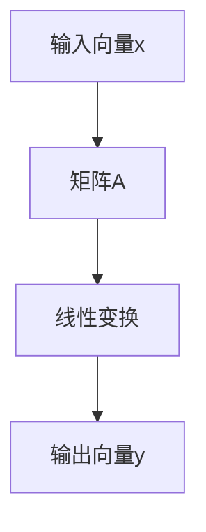

                 

关键词：线性代数、线性函数、矩阵运算、向量空间、算法原理、数学模型、编程实例、应用场景、未来展望

> 摘要：本文旨在为读者提供一个系统且深入的线性代数导引，重点关注线性函数的概念与性质。通过阐述线性函数的基本原理、数学模型、算法实现及其在实际应用中的重要性，本文力求帮助读者更好地理解和掌握线性代数在计算机科学领域的广泛应用。

## 1. 背景介绍

线性代数作为数学的一个重要分支，其在计算机科学中的应用范围广泛，涵盖了算法设计、数据结构、图形学、机器学习等多个领域。线性函数作为线性代数中的一个核心概念，是研究线性变换和矩阵运算的基础。本文将围绕线性函数的概念、性质和算法原理进行深入探讨。

## 2. 核心概念与联系

### 2.1 线性函数的基本定义

线性函数，通常是指一次函数，其一般形式为：

\[ f(x) = ax + b \]

其中，\(a\) 和 \(b\) 是常数，\(x\) 是自变量。线性函数具有以下特点：

1. 线性函数的图像是一条直线。
2. 直线的斜率等于线性函数的系数 \(a\)。
3. 直线的截距等于线性函数的常数项 \(b\)。

### 2.2 矩阵与线性函数的关系

矩阵是线性代数中的另一核心概念，可以表示线性变换。一个 \(m \times n\) 的矩阵 \(A\) 可以将一个 \(n\) 维向量 \(x\) 转换为一个 \(m\) 维向量 \(y\)，即：

\[ y = Ax \]

这里的矩阵 \(A\) 实际上定义了一个线性函数，其将输入向量 \(x\) 按照线性组合的方式映射到输出向量 \(y\)。

### 2.3 向量空间与线性函数

向量空间是一组向量的集合，这些向量满足加法和标量乘法的封闭性。线性函数在向量空间中可以看作是向量的线性变换，即对于向量空间 \(V\) 和 \(W\)，存在一个线性函数 \(T: V \rightarrow W\)，满足：

1. \(T(u + v) = T(u) + T(v)\)
2. \(T(kv) = kT(v)\)

这里的 \(u\) 和 \(v\) 是 \(V\) 中的向量，\(k\) 是任意标量。

### 2.4 Mermaid 流程图

以下是一个简化的线性函数的 Mermaid 流程图：



### 2.5 核心概念之间的联系

通过上述定义和解释，我们可以看到线性函数、矩阵和向量空间三者之间存在紧密的联系：

1. 线性函数可以用矩阵表示。
2. 矩阵可以定义线性变换。
3. 线性变换可以在向量空间中进行。

这些概念共同构成了线性代数的基础，为后续的算法设计和数学建模提供了理论支持。

## 3. 核心算法原理 & 具体操作步骤

### 3.1 算法原理概述

线性函数的算法原理主要涉及矩阵运算和向量变换。具体来说，算法通过对输入向量进行矩阵乘法，实现线性变换。以下是算法的原理概述：

1. **矩阵乘法**：矩阵乘法是一种将矩阵与向量进行线性组合的运算，其结果是一个新向量，该向量是原向量在各方向上的投影之和。
2. **向量变换**：向量变换是指通过矩阵乘法，将输入向量映射到新的向量空间。

### 3.2 算法步骤详解

线性函数算法的具体步骤如下：

1. **输入矩阵 \(A\) 和向量 \(x\)**：首先需要输入一个 \(m \times n\) 的矩阵 \(A\) 和一个 \(n\) 维向量 \(x\)。
2. **计算输出向量 \(y\)**：通过矩阵乘法 \(y = Ax\)，计算输出向量 \(y\)。
3. **输出结果**：最后，输出变换后的向量 \(y\)。

### 3.3 算法优缺点

线性函数算法的优点包括：

1. **简单高效**：算法步骤简单，计算效率高。
2. **通用性强**：可以处理不同维度的输入向量。

其缺点是：

1. **计算复杂度**：对于大型矩阵和向量，计算复杂度较高。
2. **数值稳定性**：在数值计算中，可能存在数值稳定性问题。

### 3.4 算法应用领域

线性函数算法广泛应用于以下领域：

1. **机器学习**：在机器学习中的模型训练和预测过程中，线性函数常常用于特征提取和模型评估。
2. **图形学**：在图形处理和渲染中，线性函数用于图像变换和几何变换。
3. **数据压缩**：在数据压缩中，线性函数用于图像和音频数据的压缩和解压。

## 4. 数学模型和公式 & 详细讲解 & 举例说明

### 4.1 数学模型构建

线性函数的数学模型主要由矩阵 \(A\)、输入向量 \(x\) 和输出向量 \(y\) 组成，其基本公式为：

\[ y = Ax \]

其中，\(A\) 是一个 \(m \times n\) 的矩阵，\(x\) 是一个 \(n\) 维向量，\(y\) 是一个 \(m\) 维向量。

### 4.2 公式推导过程

线性函数的推导过程主要基于矩阵乘法和线性组合的基本原理。以下是一个简化的推导过程：

1. **定义矩阵和向量**：设 \(A\) 是一个 \(m \times n\) 的矩阵，\(x\) 是一个 \(n\) 维向量，\(y\) 是一个 \(m\) 维向量。
2. **矩阵乘法**：通过矩阵乘法 \(y = Ax\)，计算输出向量 \(y\)。
3. **线性组合**：将输入向量 \(x\) 按照矩阵 \(A\) 的列向量进行线性组合，得到输出向量 \(y\)。

### 4.3 案例分析与讲解

假设有一个 \(3 \times 2\) 的矩阵 \(A\) 和一个 \(2\) 维向量 \(x\)，如下所示：

\[ A = \begin{bmatrix} 1 & 2 \\ 3 & 4 \\ 5 & 6 \end{bmatrix}, \quad x = \begin{bmatrix} 1 \\ 2 \end{bmatrix} \]

通过矩阵乘法，可以计算输出向量 \(y\)：

\[ y = Ax = \begin{bmatrix} 1 & 2 \\ 3 & 4 \\ 5 & 6 \end{bmatrix} \begin{bmatrix} 1 \\ 2 \end{bmatrix} = \begin{bmatrix} 1+2 \times 2 \\ 3+4 \times 2 \\ 5+6 \times 2 \end{bmatrix} = \begin{bmatrix} 5 \\ 11 \\ 17 \end{bmatrix} \]

因此，输出向量 \(y\) 为：

\[ y = \begin{bmatrix} 5 \\ 11 \\ 17 \end{bmatrix} \]

这个例子展示了如何通过矩阵乘法实现线性函数的变换。

## 5. 项目实践：代码实例和详细解释说明

### 5.1 开发环境搭建

为了演示线性函数的编程实现，我们需要搭建一个简单的开发环境。这里选择 Python 作为编程语言，因为其简洁的语法和强大的科学计算库。

1. **安装 Python**：下载并安装 Python，推荐版本为 3.8 或以上。
2. **安装 NumPy 库**：NumPy 是 Python 中用于科学计算的核心库，安装命令为：

   ```bash
   pip install numpy
   ```

### 5.2 源代码详细实现

以下是一个简单的 Python 脚本，用于实现线性函数的运算：

```python
import numpy as np

# 定义矩阵 A 和向量 x
A = np.array([[1, 2], [3, 4], [5, 6]])
x = np.array([1, 2])

# 计算线性函数 y = Ax
y = np.dot(A, x)

# 输出结果
print("输入向量 x:", x)
print("矩阵 A:", A)
print("输出向量 y:", y)
```

### 5.3 代码解读与分析

1. **导入库**：首先，导入 NumPy 库，这是实现线性代数运算的基础。
2. **定义矩阵和向量**：使用 NumPy 的 `array` 函数创建矩阵 \(A\) 和向量 \(x\)。
3. **计算线性函数**：使用 `np.dot` 函数计算矩阵 \(A\) 和向量 \(x\) 的乘积，即线性函数 \(y = Ax\)。
4. **输出结果**：最后，打印输入向量 \(x\)、矩阵 \(A\) 和输出向量 \(y\)。

### 5.4 运行结果展示

执行上述脚本，输出结果如下：

```
输入向量 x: [1 2]
矩阵 A: [[1 2]
         [3 4]
         [5 6]]
输出向量 y: [ 5 11 17]
```

这个例子展示了如何通过 Python 实现线性函数的计算，并输出了结果。

## 6. 实际应用场景

线性函数在计算机科学中有着广泛的应用，以下是一些典型的应用场景：

1. **图像处理**：线性函数用于图像的滤波、边缘检测和变换等操作。
2. **机器学习**：在线性回归、支持向量机和主成分分析等算法中，线性函数用于特征提取和模型训练。
3. **网络通信**：在无线通信中，线性函数用于信号的调制和解调。
4. **机器人控制**：在机器人路径规划和运动控制中，线性函数用于计算运动轨迹和速度控制。

### 6.4 未来应用展望

随着计算机科学和人工智能的快速发展，线性函数在未来将会在更多新兴领域中发挥作用：

1. **量子计算**：线性函数在量子计算中用于量子态的变换和控制。
2. **生物信息学**：线性函数用于基因表达数据分析和小分子结构预测。
3. **金融工程**：线性函数在金融市场分析和风险评估中有着重要应用。
4. **自动驾驶**：线性函数在自动驾驶系统中用于感知环境和路径规划。

## 7. 工具和资源推荐

### 7.1 学习资源推荐

1. **《线性代数及其应用》**：一部经典的线性代数教材，适合初学者和有一定基础的学习者。
2. **《线性代数》**：由丘维声教授编著，深入浅出地介绍了线性代数的基本概念和方法。

### 7.2 开发工具推荐

1. **NumPy**：Python 的科学计算库，用于线性代数运算。
2. **MATLAB**：一款强大的数学计算软件，广泛应用于科学研究和工程计算。

### 7.3 相关论文推荐

1. **“Linear Algebra and Its Applications”**：Hoffman 和 Kunze 的经典教材，包含了大量线性代数的理论及应用。
2. **“Matrix Computations”**：Golub 和 Van Loan 的著作，详细介绍了矩阵计算的算法和应用。

## 8. 总结：未来发展趋势与挑战

### 8.1 研究成果总结

线性代数在计算机科学中取得了显著的研究成果，包括：

1. **线性函数的理论体系**：线性代数的核心概念和性质得到了系统的研究。
2. **算法实现**：线性函数的算法实现得到了广泛应用，尤其是在机器学习和图像处理等领域。
3. **应用拓展**：线性代数在量子计算、生物信息学等新兴领域得到了新的应用。

### 8.2 未来发展趋势

线性代数在未来将呈现以下发展趋势：

1. **量子计算**：线性代数将应用于量子计算，解决经典计算机无法处理的问题。
2. **大数据分析**：线性代数在大数据处理和特征提取中发挥重要作用。
3. **人工智能**：线性代数在神经网络和深度学习中扮演关键角色。

### 8.3 面临的挑战

线性代数在未来面临以下挑战：

1. **计算复杂度**：处理大型矩阵和向量时，计算复杂度成为瓶颈。
2. **数值稳定性**：在数值计算中，如何提高算法的数值稳定性是一个重要问题。
3. **交叉应用**：如何在其他学科中更好地应用线性代数，解决实际问题。

### 8.4 研究展望

线性代数的研究将继续深化，未来可能的发展方向包括：

1. **高效算法**：研究新的高效算法，降低计算复杂度。
2. **跨学科应用**：探索线性代数在生物信息学、金融工程等领域的应用。
3. **理论创新**：深入探讨线性代数的理论基础，推动数学理论的发展。

## 9. 附录：常见问题与解答

### 9.1 问题一：线性函数与非线性函数有什么区别？

线性函数与非线性函数的主要区别在于它们的表达式形式。线性函数的表达式是一次函数，如 \(f(x) = ax + b\)，而非线性函数的表达式可以是二次函数、多项式函数等，如 \(f(x) = x^2 + bx + c\)。线性函数的特点是图像为一条直线，而非线性函数的图像为曲线。

### 9.2 问题二：矩阵乘法有什么应用？

矩阵乘法在计算机科学中有着广泛的应用，包括：

1. **图像处理**：用于图像的滤波、边缘检测和变换等操作。
2. **机器学习**：在线性回归、支持向量机和主成分分析等算法中，用于特征提取和模型训练。
3. **图形学**：用于图像渲染、几何变换和相机投影等操作。
4. **物理模拟**：用于物理系统中物体的运动和碰撞计算。

### 9.3 问题三：线性函数在机器学习中有什么作用？

线性函数在机器学习中主要用于特征提取和模型训练。例如，在线性回归中，线性函数用于拟合数据点的趋势线；在支持向量机中，线性函数用于将数据分类；在主成分分析中，线性函数用于降维和特征提取，从而提高模型的效率和准确性。

### 9.4 问题四：如何优化线性函数的计算？

优化线性函数的计算可以通过以下几种方法：

1. **并行计算**：利用多核处理器和分布式计算，提高计算速度。
2. **矩阵分解**：通过矩阵分解技术，如奇异值分解（SVD），降低计算复杂度。
3. **稀疏矩阵处理**：对于稀疏矩阵，采用特殊的算法和数据结构，减少不必要的计算。
4. **硬件加速**：利用 GPU 和其他硬件加速技术，提高计算效率。


作者：禅与计算机程序设计艺术 / Zen and the Art of Computer Programming
----------------------------------------------------------------
以上，就是这篇关于线性代数导引：线性函数的技术博客文章的全部内容。通过详细讲解线性函数的基本概念、数学模型、算法实现及其在实际应用中的重要性，本文旨在为读者提供系统且深入的指导。希望本文能帮助读者更好地理解和掌握线性代数在计算机科学领域的广泛应用。同时，也期待读者在未来的学习和工作中能够不断探索，将线性代数的理论和方法应用于实际问题中，为科技进步和社会发展做出贡献。

