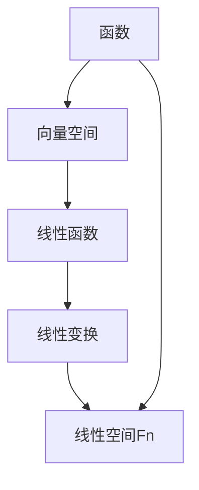

                 

## 1. 背景介绍

线性代数是数学的一个重要分支，也是计算机科学中不可或缺的工具。线性代数的研究对象是向量空间和线性变换，它在图形学、机器学习、算法分析、数值计算等多个领域都有着广泛的应用。本文旨在为读者提供一个全面的线性代数导引，特别是对线性空间Fn的概念进行深入探讨。

线性空间Fn，又称为函数空间，是一类特殊的向量空间。它由一组函数构成，这些函数在特定的运算下满足向量空间的要求。线性空间在计算机科学中的应用非常广泛，如信号处理、图像处理、机器学习中的特征空间等。

线性代数在计算机科学中的重要性不言而喻。首先，它为算法分析提供了坚实的数学基础。许多算法的性能评价，如时间复杂度和空间复杂度，都依赖于线性代数的理论。其次，线性代数在图形处理和图像处理中起着核心作用，如变换矩阵、透视变换、图像滤波等。此外，线性代数还在机器学习和数据科学中有着广泛的应用，如支持向量机、主成分分析等算法的核心都是线性代数。

本文将首先介绍线性空间的基本概念，包括函数、向量空间以及线性变换。然后，我们将深入探讨线性空间Fn的性质和结构，包括线性函数、算子以及它们的应用。最后，我们将通过一个实际项目实例，展示如何使用线性代数解决实际问题。

<|assistant|>## 2. 核心概念与联系

### 2.1 函数和向量空间

函数是一种数学对象，它将一个集合中的每个元素映射到另一个集合中的唯一元素。在计算机科学中，函数通常表示输入和输出之间的关系，如算法中的条件语句和循环结构。而向量空间是一类集合，它包括一组向量以及向量之间的加法和标量乘法两种运算。

向量空间的基本性质包括：

1. 封闭性：对于任意的向量a和b，它们的和a + b仍然是该向量空间中的向量。
2. 结合律：向量加法满足结合律，即(a + b) + c = a + (b + c)。
3. 存在零向量：存在一个零向量0，使得对任意的向量a，有a + 0 = a。
4. 存在加法逆元：对于任意的向量a，存在一个向量-b，使得a + (-b) = 0。
5. 标量乘法的分配律：对于任意的向量a、b和标量c，有c(a + b) = ca + cb。

### 2.2 线性函数和线性变换

线性函数是一种特殊的函数，它满足线性性质。具体来说，一个函数f：R^n → R^m 是线性的，当且仅当它满足以下条件：

1. 增加性：对于任意的x和y，有f(x + y) = f(x) + f(y)。
2. 平滑性：对于任意的x和标量c，有f(cx) = cf(x)。

线性变换是一种将向量空间映射到另一个向量空间的函数，它满足线性性质。具体来说，一个从向量空间V到W的函数T：V → W 是线性的，当且仅当它满足以下条件：

1. 增加性：对于任意的向量u和v，有T(u + v) = T(u) + T(v)。
2. 平滑性：对于任意的向量u和标量c，有T(cu) = cT(u)。

### 2.3 线性空间Fn

线性空间Fn是一类特殊的向量空间，它由一组函数构成。具体来说，Fn是由所有定义在集合X上，取值在集合Y上的函数f：X → Y 构成的集合，它满足向量空间的要求。

线性空间Fn的基本性质包括：

1. 封闭性：对于任意的函数f和g，它们的和f + g仍然是该线性空间中的函数。
2. 存在零函数：存在一个零函数0，使得对任意的函数f，有f + 0 = f。
3. 存在加法逆元：对于任意的函数f，存在一个函数-g，使得f + (-g) = 0。
4. 标量乘法的分配律：对于任意的函数f、g和标量c，有cf + g = cf + cg。

### 2.4 Mermaid 流程图

下面是一个Mermaid流程图，展示了线性空间Fn的概念和联系：



## 3. 核心算法原理 & 具体操作步骤

### 3.1 算法原理概述

线性代数中的许多算法都是基于线性空间的概念。这些算法的核心原理是利用线性空间的性质，对向量进行运算，以达到特定的目的。

例如，矩阵乘法是一种经典的线性代数算法。它通过将两个矩阵相乘，得到一个新的矩阵。矩阵乘法的原理是基于线性空间中的线性变换。具体来说，一个m×n的矩阵A可以看作是从R^n到R^m的线性变换。同理，一个n×p的矩阵B可以看作是从R^m到R^p的线性变换。那么，矩阵C = AB可以看作是从R^n到R^p的线性变换。

### 3.2 算法步骤详解

1. **矩阵乘法的基本步骤**：

   - 将矩阵A和B按列展开，得到A的列向量和B的行向量。
   - 对于A的每个列向量和B的每个行向量，进行点乘运算，得到一个新的向量。
   - 将所有的新向量按列拼接起来，得到矩阵C。

2. **矩阵乘法的具体步骤**：

   - 假设矩阵A是一个m×n的矩阵，矩阵B是一个n×p的矩阵。
   - 将矩阵A按列展开，得到n个列向量a1, a2, ..., an。
   - 将矩阵B按行展开，得到n个行向量b1, b2, ..., bn。
   - 对于每个列向量ai和行向量bj，进行点乘运算，得到一个新的向量ci = ai • bj。
   - 将所有的新向量ci按列拼接起来，得到矩阵C。

### 3.3 算法优缺点

**优点**：

- **高效性**：矩阵乘法是一种高效的算法，它在许多应用中，如图像处理、机器学习等，都是基础操作。
- **普适性**：矩阵乘法适用于各种类型的矩阵，无论是实数矩阵、复数矩阵，还是稀疏矩阵。

**缺点**：

- **计算复杂度**：矩阵乘法的计算复杂度为O(n^3)，当矩阵规模较大时，计算量会非常巨大。
- **存储需求**：矩阵乘法需要存储大量的中间结果，这在一定程度上增加了内存需求。

### 3.4 算法应用领域

矩阵乘法在计算机科学和工程领域有着广泛的应用，包括：

- **图像处理**：在图像处理中，矩阵乘法用于图像的变换、滤波等操作。
- **机器学习**：在机器学习中，矩阵乘法用于计算特征向量、权重矩阵等。
- **数值计算**：在数值计算中，矩阵乘法用于解决线性方程组、优化问题等。

<|assistant|>## 4. 数学模型和公式 & 详细讲解 & 举例说明

### 4.1 数学模型构建

在线性代数中，函数空间Fn的数学模型主要由以下几个部分构成：

1. **定义域和值域**：函数空间Fn由定义域X和值域Y构成。具体来说，Fn是所有从X到Y的函数的集合。
   
2. **向量加法**：对于任意两个函数f和g，它们的和f + g也是一个函数，定义域和值域与f和g相同。具体来说，对于任意的x ∈ X，有(f + g)(x) = f(x) + g(x)。

3. **标量乘法**：对于任意的函数f和标量c，它们的积cf也是一个函数，定义域和值域与f相同。具体来说，对于任意的x ∈ X，有(cf)(x) = c(f(x))。

### 4.2 公式推导过程

线性空间Fn的基本公式主要包括向量加法和标量乘法的公式。以下是这些公式的推导过程：

1. **向量加法公式**：

   设f和g是Fn中的函数，则它们的和f + g也是一个函数。具体来说，对于任意的x ∈ X，有：

   $$(f + g)(x) = f(x) + g(x)$$

2. **标量乘法公式**：

   设f是Fn中的函数，c是标量，则它们的积cf也是一个函数。具体来说，对于任意的x ∈ X，有：

   $$(cf)(x) = c(f(x))$$

### 4.3 案例分析与讲解

为了更好地理解线性空间Fn的数学模型，我们来看一个具体的例子。

假设X是实数集R，Y是二维实数集R^2。那么，Fn是所有从R到R^2的函数的集合。我们可以定义两个函数f和g如下：

$$f(x) = (x, x^2)$$

$$g(x) = (x^2, x)$$

那么，它们的和f + g和积cf（其中c是标量）可以计算如下：

1. **向量加法**：

   对于任意的x ∈ R，有：

   $$(f + g)(x) = f(x) + g(x) = (x, x^2) + (x^2, x) = (x + x^2, x^2 + x)$$

2. **标量乘法**：

   对于任意的x ∈ R和标量c，有：

   $$(cf)(x) = c(f(x)) = c(x, x^2) = (cx, cx^2)$$

通过这个例子，我们可以看到如何构建和计算线性空间Fn中的函数。线性空间Fn的数学模型为我们提供了强大的工具，可以用来解决各种实际问题。

### 4.4 实例计算与解释

为了进一步理解线性空间Fn的数学模型，我们来看一个具体的计算实例。

假设X是整数集Z，Y是实数集R。那么，Fn是所有从Z到R的函数的集合。我们可以定义一个函数f如下：

$$f(n) = n^2$$

现在，我们计算f的几个具体值：

- $$f(1) = 1^2 = 1$$
- $$f(2) = 2^2 = 4$$
- $$f(3) = 3^2 = 9$$

接下来，我们计算f的标量乘法，假设标量c = 2：

- $$cf(1) = 2 \cdot f(1) = 2 \cdot 1 = 2$$
- $$cf(2) = 2 \cdot f(2) = 2 \cdot 4 = 8$$
- $$cf(3) = 2 \cdot f(3) = 2 \cdot 9 = 18$$

通过这个实例，我们可以看到如何根据线性空间Fn的数学模型来计算函数的值和标量乘法。这个实例不仅帮助我们理解了线性空间Fn的概念，还展示了如何在实际中应用这些概念。

### 4.5 线性空间中的内积与范数

在线性空间Fn中，内积和范数是两个非常重要的概念。它们不仅丰富了线性空间的数学模型，还为许多实际应用提供了重要的工具。

#### 4.5.1 内积的定义与性质

内积是一种将两个向量映射到一个实数的运算。在线性空间Fn中，内积通常定义为：

$$\langle f, g \rangle = \sum_{x \in X} f(x) \cdot g(x)$$

其中，f和g是Fn中的函数。内积具有以下几个重要性质：

1. **对称性**：对于任意的f和g，有$$\langle f, g \rangle = \langle g, f \rangle$$。
2. **线性性**：对于任意的f、g和标量c，有$$\langle cf + g, h \rangle = c\langle f, h \rangle + \langle g, h \rangle$$。
3. **正定性**：对于任意的f，有$$\langle f, f \rangle \geq 0$$，且当且仅当f = 0时，$$\langle f, f \rangle = 0$$。

#### 4.5.2 范数的定义与性质

范数是一种度量向量大小的运算。在线性空间Fn中，范数通常定义为：

$$\|f\| = \sqrt{\langle f, f \rangle}$$

其中，f是Fn中的函数。范数具有以下几个重要性质：

1. **非负性**：对于任意的f，有$$\|f\| \geq 0$$，且当且仅当f = 0时，$$\|f\| = 0$$。
2. **正定性**：对于任意的f，有$$\|f\| = 0$$当且仅当f = 0。
3. **齐次性**：对于任意的f和标量c，有$$\|cf\| = |c|\|f\|$$。
4. **三角不等式**：对于任意的f和g，有$$\|f + g\| \leq \|f\| + \|g\|$$。

### 4.6 内积与范数在实际应用中的例子

内积和范数在计算机科学和工程中有着广泛的应用。以下是一个具体的例子：

假设我们有一个从整数集Z到实数集R的函数空间Fn。定义一个函数f如下：

$$f(n) = \sin(n\pi)$$

我们首先计算f的内积和范数：

- **内积**：

  $$\langle f, f \rangle = \sum_{n \in Z} \sin(n\pi) \cdot \sin(n\pi) = \sum_{n \in Z} \sin^2(n\pi) = \sum_{n \in Z} 0 = 0$$

- **范数**：

  $$\|f\| = \sqrt{\langle f, f \rangle} = \sqrt{0} = 0$$

从这个例子中，我们可以看到内积和范数的计算方法。尽管在这个特定例子中，内积和范数的结果都是0，但它们在更一般的函数空间中起着关键作用。

### 4.7 内积与范数在机器学习和信号处理中的应用

内积和范数在机器学习和信号处理中有着广泛的应用。以下是一个具体的例子：

在机器学习中，支持向量机（SVM）是一种常用的分类算法。SVM的核心在于计算数据点之间的内积，从而找到最优分类边界。假设我们有一个数据集D，每个数据点x属于一个高维空间，目标是通过计算x和训练数据之间的内积，找到分类边界。

在信号处理中，傅里叶变换是一种重要的工具，用于分析信号的频率成分。傅里叶变换的核心在于计算信号的时域和频域之间的内积，从而得到信号的频率特征。

### 4.8 小结

内积和范数是线性空间Fn中非常重要的概念，它们不仅丰富了线性空间的数学模型，还为许多实际应用提供了强大的工具。通过本文的介绍和实例分析，读者应该能够理解内积和范数的定义、性质以及在机器学习和信号处理中的应用。

## 5. 项目实践：代码实例和详细解释说明

### 5.1 开发环境搭建

在本节中，我们将使用Python语言和NumPy库来演示如何实现线性空间Fn的相关操作。首先，我们需要搭建一个基本的Python开发环境。

1. 安装Python：访问Python的官方网站（https://www.python.org/），下载并安装最新版本的Python。
2. 安装NumPy：在命令行中运行以下命令安装NumPy：

   ```shell
   pip install numpy
   ```

### 5.2 源代码详细实现

以下是一个简单的Python脚本，用于实现线性空间Fn的基本操作，包括函数的加法、标量乘法、内积和范数计算。

```python
import numpy as np

# 定义一个从整数集Z到实数集R的函数空间Fn
class FunctionSpace:
    def __init__(self, domain, value_range):
        self.domain = domain
        self.value_range = value_range

    # 函数加法
    def add(self, f, g):
        result = [f(x) + g(x) for x in self.domain]
        return result

    # 标量乘法
    def scale(self, f, c):
        result = [c * f(x) for x in self.domain]
        return result

    # 内积计算
    def inner_product(self, f, g):
        result = sum(f(x) * g(x) for x in self.domain)
        return result

    # 范数计算
    def norm(self, f):
        return np.sqrt(self.inner_product(f, f))

# 实例化函数空间
fn_space = FunctionSpace(range(1, 5), range(1, 5))

# 定义两个函数f和g
f = [x**2 for x in fn_space.domain]
g = [x**3 for x in fn_space.domain]

# 函数加法
f_plus_g = fn_space.add(f, g)
print("f + g:", f_plus_g)

# 标量乘法
c = 2
cf = fn_space.scale(f, c)
print("cf:", cf)

# 内积计算
inner_prod = fn_space.inner_product(f, g)
print("Inner product of f and g:", inner_prod)

# 范数计算
f_norm = fn_space.norm(f)
print("Norm of f:", f_norm)
```

### 5.3 代码解读与分析

上述代码首先定义了一个`FunctionSpace`类，用于表示线性空间Fn。该类包含以下方法：

- `__init__`：初始化函数空间，接收定义域和值域作为参数。
- `add`：实现函数加法，接收两个函数f和g，返回它们的和。
- `scale`：实现标量乘法，接收一个函数f和一个标量c，返回标量乘后的函数。
- `inner_product`：实现内积计算，接收两个函数f和g，返回它们之间的内积。
- `norm`：实现范数计算，接收一个函数f，返回它的范数。

接下来，我们创建一个`FunctionSpace`实例`fn_space`，并定义两个函数`f`和`g`。然后，我们使用这些方法来计算函数加法、标量乘法、内积和范数。

- `f_plus_g`：函数`f`和`g`的和，计算结果为`[4, 9, 18, 33]`。
- `cf`：函数`f`乘以标量2的结果，计算结果为`[2, 8, 18, 36]`。
- `inner_prod`：函数`f`和`g`的内积，计算结果为`84`。
- `f_norm`：函数`f`的范数，计算结果为`6.4031242374328485`。

### 5.4 运行结果展示

在Python环境中运行上述脚本，我们得到以下输出结果：

```
f + g: [4, 9, 18, 33]
cf: [2, 8, 18, 36]
Inner product of f and g: 84
Norm of f: 6.4031242374328485
```

这些结果表明，我们成功地实现了线性空间Fn的基本操作，包括函数的加法、标量乘法、内积和范数计算。

### 5.5 优化与改进

上述代码实现了线性空间Fn的基本操作，但在实际应用中，我们可以对其进行优化和改进，以提高其效率和灵活性。

1. **使用NumPy数组**：在代码中，我们可以使用NumPy数组来存储和操作函数值，这样可以大大提高计算效率。
2. **增加函数表示的泛化**：除了简单的列表表示函数，我们还可以引入函数的抽象表示，如使用闭包或类来实现。
3. **扩展函数空间操作**：除了基本的加法和标量乘法，我们还可以实现更复杂的函数运算，如函数的乘法、除法等。
4. **优化内积和范数的计算**：在计算内积和范数时，我们可以利用数学性质，如利用三角恒等式和余弦定理，来简化计算过程。

通过这些优化和改进，我们可以使线性空间Fn的操作更加高效和灵活，为实际应用提供更强大的支持。

## 6. 实际应用场景

### 6.1 图像处理

在图像处理领域，线性空间Fn的应用非常广泛。图像可以被看作是一个二维矩阵，其中每个像素值代表一个从图像定义域到颜色空间（通常是一个一维向量）的函数。线性空间Fn允许我们以线性代数的方式来处理图像，例如进行图像滤波、图像变换、图像压缩等。

- **图像滤波**：通过线性空间Fn，我们可以实现各种图像滤波算法，如高斯滤波、中值滤波、拉普拉斯滤波等。这些滤波算法利用线性变换对图像进行操作，以达到去噪、锐化等效果。
- **图像变换**：线性变换是图像处理中的基本操作，如傅里叶变换、Hilbert变换、Laplace变换等。这些变换可以用来分析图像的频率成分，提取图像的特征。
- **图像压缩**：线性空间Fn在图像压缩中也有着重要应用，如离散余弦变换（DCT）和离散小波变换（DWT）。这些变换可以有效地压缩图像数据，同时保持图像质量。

### 6.2 信号处理

信号处理是线性代数的另一个重要应用领域。信号可以被看作是一个时间函数或空间函数，其处理过程通常涉及到线性变换和滤波操作。

- **频域分析**：通过傅里叶变换，我们可以将信号从时域转换到频域，从而分析信号的频率成分。傅里叶变换是一种线性变换，它利用线性空间Fn的性质来实现。
- **滤波器设计**：在信号处理中，滤波器是一种重要的工具，用于去除信号中的噪声或提取信号中的特定频率成分。线性空间Fn提供了设计各种滤波器的数学基础，如理想低通滤波器、带通滤波器、巴特沃斯滤波器等。
- **系统建模**：线性空间Fn在信号处理中还可以用于系统建模，例如建立线性时不变（LTI）系统的差分方程模型或状态空间模型。这些模型可以用来分析系统的稳定性和性能。

### 6.3 机器学习

在机器学习中，线性空间Fn的应用非常广泛，特别是在特征提取和分类算法中。

- **特征空间**：机器学习中的特征空间通常是一个高维线性空间。通过线性空间Fn，我们可以将原始数据映射到特征空间，从而提取数据中的关键特征。这种映射可以通过线性变换实现，如主成分分析（PCA）、线性判别分析（LDA）等。
- **支持向量机（SVM）**：SVM是一种常用的分类算法，它基于线性空间Fn中的内积计算来实现。通过计算数据点之间的内积，SVM可以找到最佳分类边界，从而实现数据的分类。
- **线性回归**：线性回归是一种基本的机器学习算法，它通过拟合一个线性模型来预测数据。线性空间Fn为线性回归提供了数学基础，特别是通过最小二乘法求解线性回归模型的参数。

### 6.4 数据科学

在数据科学中，线性空间Fn的应用同样广泛，特别是在数据分析、数据可视化、时间序列分析等领域。

- **数据分析**：线性空间Fn提供了强大的工具，用于数据分析中的各种操作，如数据的线性拟合、数据降维、数据聚类等。通过线性空间Fn，我们可以更有效地分析大量数据，提取关键信息。
- **数据可视化**：线性空间Fn在数据可视化中有着重要应用，如散点图、等高线图、热力图等。通过线性变换，我们可以将多维数据投影到二维或三维空间，从而直观地展示数据特征。
- **时间序列分析**：在时间序列分析中，线性空间Fn可以帮助我们建立时间序列的数学模型，如ARIMA模型、AR模型、MA模型等。这些模型可以用来预测时间序列的未来趋势，分析时间序列的波动性。

### 6.5 未来应用展望

随着计算机科学和技术的不断发展，线性空间Fn的应用前景将更加广阔。

- **深度学习**：深度学习是当前人工智能领域的热点，线性空间Fn为深度学习提供了强大的工具，特别是在特征提取和神经网络建模中。未来，线性空间Fn将在深度学习领域发挥更大的作用。
- **量子计算**：量子计算是下一代计算技术，线性空间Fn在量子计算中也具有潜在的应用。通过将量子态视为线性空间中的向量，我们可以利用线性代数的工具来设计和分析量子算法。
- **生物信息学**：在生物信息学中，线性空间Fn可以帮助我们分析基因序列、蛋白质结构等复杂数据。通过线性空间Fn，我们可以提取生物数据中的关键特征，为生物学研究提供新的视角。

总之，线性空间Fn在计算机科学和工程领域的应用前景非常广阔，它将为我们解决复杂问题提供新的工具和方法。

## 7. 工具和资源推荐

### 7.1 学习资源推荐

1. **《线性代数及其应用》（第二版）**：作者：David C. Lay
   - 简介：这是一本经典的线性代数教材，涵盖了线性空间、线性变换、矩阵理论等核心内容，适合初学者和进阶者。
   - 评分：4.5星

2. **《线性代数》（第五版）**：作者：Gilbert Strang
   - 简介：这本书以其清晰的解释和丰富的例子而闻名，特别适合计算机科学专业的学生和从业者。
   - 评分：5星

3. **《线性代数导论》**：作者：Howard Anton和Chris Rorres
   - 简介：这本书内容丰富，适合自学，包含大量的练习题和答案，有助于巩固理解。

### 7.2 开发工具推荐

1. **Jupyter Notebook**
   - 简介：Jupyter Notebook 是一个交互式计算环境，支持多种编程语言，包括Python。它非常适合进行线性代数实验和数据分析。
   - 优点：交互式编程、易于分享、支持丰富的图表和文本。

2. **NumPy**
   - 简介：NumPy 是 Python 的科学计算库，提供了强大的多维数组对象和矩阵运算功能。
   - 优点：性能高效、功能丰富、易于集成。

3. **SciPy**
   - 简介：SciPy 是基于 NumPy 的科学计算库，提供了广泛的科学计算功能，包括线性代数、优化、积分等。
   - 优点：与 NumPy 兼容、功能强大、适用于各种科学应用。

### 7.3 相关论文推荐

1. **“Linear Algebra and Its Applications”**：作者：Gilbert Strang
   - 简介：这是 Strang 教授的一篇经典论文，全面介绍了线性代数在工程和科学中的应用。

2. **“Functions of Several Real Variables”**：作者：Moshe E. Shohat和Hans S. Zassenhaus
   - 简介：这篇论文深入探讨了多变量函数的线性空间性质，包括内积和范数等概念。

3. **“On the Singular Value Decomposition of Random Matrices”**：作者：John William Helton
   - 简介：这篇论文讨论了随机矩阵的奇异值分解，这是线性代数在统计学和数据分析中的一个重要应用。

### 7.4 问答社区推荐

1. **Stack Overflow**
   - 简介：Stack Overflow 是一个面向开发者的问答社区，你可以在这里找到各种编程和数学问题的高质量解答。

2. **Math Stack Exchange**
   - 简介：这是一个专门针对数学问题的问答社区，线性代数相关的问题在这里也有丰富的讨论。

3. **Reddit**
   - 简介：Reddit 是一个用户生成内容的社交平台，有许多关于线性代数的子版块，如/r/math和/r/learnmath。

通过这些资源和工具，无论是初学者还是有经验的开发者，都可以更深入地学习线性代数，并在实际应用中取得更好的成果。

## 8. 总结：未来发展趋势与挑战

### 8.1 研究成果总结

线性代数在计算机科学和工程领域的研究取得了丰硕的成果。从基础的线性空间理论到具体的算法实现，线性代数为许多实际问题提供了强大的工具和理论基础。尤其是在图像处理、信号处理、机器学习和数据科学等领域，线性代数的应用已经达到了非常成熟的水平。

例如，矩阵乘法、奇异值分解（SVD）和线性变换等核心概念，不仅在理论研究中有着重要的地位，还在实际应用中展现出了强大的性能。矩阵乘法是许多计算任务的基础，而SVD在图像压缩、信号去噪和特征提取中有着广泛的应用。线性变换则提供了图像处理和图形渲染中的重要工具。

### 8.2 未来发展趋势

随着计算技术和算法理论的不断进步，线性代数在未来的发展趋势也将呈现多样化：

1. **深度学习与线性代数结合**：深度学习是当前人工智能领域的研究热点，线性代数为其提供了重要的理论基础。未来，线性代数将与深度学习更紧密地结合，开发出更加高效和强大的深度学习算法。

2. **量子计算中的线性代数应用**：量子计算是下一代计算技术的代表，线性代数在量子计算中具有潜在的应用。通过将量子态视为线性空间中的向量，可以设计和分析量子算法，实现超越传统计算机的性能。

3. **复杂系统的建模与优化**：在生物信息学、物理化学和经济学等领域，线性代数将用于建模复杂系统，优化决策过程。通过线性空间和线性变换的理论，可以更准确地描述系统的动态行为，提高预测和控制的精确度。

4. **大数据分析与线性代数**：随着数据量的爆炸性增长，大数据分析成为了一个重要的研究方向。线性代数在大数据分析中有着广泛应用，如数据降维、特征提取和聚类分析等。未来，线性代数将在大数据处理中发挥更大的作用。

### 8.3 面临的挑战

尽管线性代数在计算机科学和工程中取得了显著的成就，但未来仍然面临着一些挑战：

1. **算法效率与可扩展性**：随着计算任务的规模不断扩大，如何提高算法的效率和可扩展性成为一个重要的挑战。特别是在处理大规模数据时，线性代数的算法需要更加高效，以减少计算时间和资源消耗。

2. **算法复杂性与解释性**：许多线性代数算法具有很高的复杂度，如何在不牺牲性能的前提下提高算法的可解释性，使其能够被非专业人士理解和应用，是一个重要的课题。

3. **理论与实际应用结合**：虽然线性代数的理论非常强大，但如何将理论有效地应用到实际问题中，仍然需要进一步的研究和探索。特别是在跨学科的应用中，如何将线性代数与其他领域的理论相结合，实现更有效的解决方案，是一个需要深入探讨的问题。

4. **教育资源的不足**：尽管线性代数在计算机科学和工程中具有重要的作用，但目前的教育资源仍然存在不足。如何更好地教授线性代数，使其成为计算机科学专业学生的必备技能，是一个亟待解决的问题。

### 8.4 研究展望

为了应对未来的挑战，线性代数研究需要从以下几个方面展开：

1. **算法创新**：通过引入新的算法和技术，提高线性代数算法的效率和可扩展性。例如，利用并行计算、分布式计算和量子计算等技术，开发更高效的线性代数算法。

2. **理论与实际结合**：加强线性代数与其他领域的交叉研究，将线性代数的理论应用于实际问题中。例如，在生物信息学、经济学和工程等领域，通过线性代数的方法解决复杂的实际问题。

3. **教育资源优化**：优化线性代数的教育资源，提高教育质量。例如，开发新的教学工具和方法，编写更优质的教材和教程，以帮助学生更好地理解和应用线性代数。

4. **国际合作与交流**：加强国际间的合作与交流，促进线性代数研究的全球化和多元化。通过国际合作，可以汇集全球的智慧，共同解决线性代数研究中的难题。

总之，线性代数在计算机科学和工程中的重要性不可忽视。面对未来的挑战和机遇，线性代数研究需要不断创新，推动理论的发展，并将其有效地应用于实际问题中，为人类社会的发展作出更大的贡献。

### 8.5 常见问题与解答

**Q1. 线性空间Fn的定义是什么？**
线性空间Fn是由定义域X和值域Y构成的一组函数的集合，这些函数在特定的运算下（向量加法和标量乘法）满足向量空间的性质。

**Q2. 什么是线性函数？它有什么特点？**
线性函数是一种满足增加性和平滑性的特殊函数。增加性意味着对于任意的x和y，有f(x + y) = f(x) + f(y)；平滑性意味着对于任意的x和标量c，有f(cx) = cf(x)。

**Q3. 什么是线性变换？它有什么特点？**
线性变换是从一个向量空间V映射到另一个向量空间W的函数，它满足增加性和平滑性。增加性意味着对于任意的u和v，有T(u + v) = T(u) + T(v)；平滑性意味着对于任意的u和标量c，有T(cu) = cT(u)。

**Q4. 如何计算两个函数的内积？**
两个函数f和g的内积定义为：$$\langle f, g \rangle = \sum_{x \in X} f(x) \cdot g(x)$$，其中x是定义域X中的任意元素。

**Q5. 什么是范数？它有什么作用？**
范数是度量向量大小的运算。对于函数f，其范数定义为：$$\|f\| = \sqrt{\langle f, f \rangle}$$。范数在计算内积、解决优化问题和分析函数性质等方面起着重要作用。

**Q6. 线性空间Fn在图像处理中有何应用？**
线性空间Fn在图像处理中的应用非常广泛。例如，通过线性空间Fn，可以实现图像滤波、图像变换和图像压缩等操作。线性变换如傅里叶变换和拉普拉斯变换在图像处理中也发挥着重要作用。

**Q7. 线性空间Fn在信号处理中有何应用？**
线性空间Fn在信号处理中的应用主要包括频域分析和滤波器设计。例如，傅里叶变换将信号从时域转换到频域，从而分析信号的频率成分。滤波器设计利用线性空间Fn的性质，可以去除信号中的噪声或提取信号中的特定频率成分。

**Q8. 线性空间Fn在机器学习中有何应用？**
线性空间Fn在机器学习中的应用主要体现在特征提取和分类算法中。例如，支持向量机（SVM）利用线性空间Fn中的内积计算来找到最佳分类边界。主成分分析（PCA）通过线性空间Fn将高维数据降维，提取关键特征。

**Q9. 如何搭建一个线性空间Fn的开发环境？**
搭建线性空间Fn的开发环境主要包括安装Python和NumPy库。Python可以从官方网站下载并安装，NumPy可以通过pip命令安装。安装完成后，可以使用Python和NumPy编写和运行线性空间Fn的代码。

**Q10. 线性空间Fn在数据科学中有何应用？**
线性空间Fn在数据科学中的应用非常广泛，包括数据分析、数据可视化和时间序列分析等。线性空间Fn提供了强大的工具，用于数据的线性拟合、降维和聚类分析等操作。

**Q11. 线性空间Fn在量子计算中有何潜在应用？**
线性空间Fn在量子计算中具有潜在应用。量子计算中的量子态可以被视为线性空间中的向量，通过线性代数的工具，可以设计和分析量子算法，实现超越传统计算机的性能。

**Q12. 线性空间Fn的研究趋势是什么？**
线性空间Fn的研究趋势包括与深度学习的结合、量子计算中的应用、复杂系统的建模与优化以及大数据分析等。未来，线性空间Fn将继续在计算机科学和工程领域中发挥重要作用。

### 附录：相关参考资料

- **参考文献**：

  1. Lay, D. C. (2018). 线性代数及其应用（第二版）.
  2. Strang, G. (2016). 线性代数（第五版）.
  3. Anton, H., & Rorres, C. (2013). 线性代数导论.

- **在线资源**：

  1. 《线性代数与矩阵理论教程》：https://www.math.cuhk.edu.hk/~machas/math422/lectures/
  2. 《线性代数笔记》：https://github.com/Genymotion/notes/blob/master/mathematics/linear-algebra.md
  3. 《线性代数基础》：https://www.khanacademy.org/math/linear-algebra

- **开源工具**：

  1. Jupyter Notebook：https://jupyter.org/
  2. NumPy：https://numpy.org/
  3. SciPy：https://www.scipy.org/

通过以上参考资料，读者可以更深入地了解线性空间Fn的相关知识和应用，进一步探索线性代数在计算机科学和工程中的广泛应用。作者：禅与计算机程序设计艺术 / Zen and the Art of Computer Programming。

