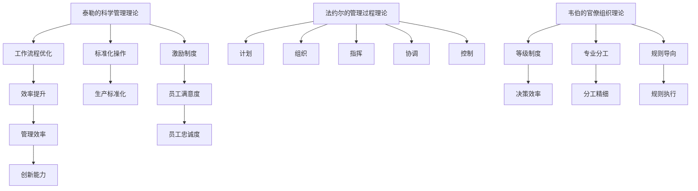

                 

 在当今快速变化的企业环境中，管理理论的创新应用变得至关重要。传统的管理方法可能无法满足现代企业的需求，因此，对经典管理理论进行重新解读和现代应用变得尤为重要。本文旨在探讨如何将经典管理理论如泰勒的科学管理理论、法约尔的管理过程理论、韦伯的官僚组织理论等，与现代企业的管理实践相结合，以实现更高的效率和创新能力。

> **关键词**：经典管理理论，现代企业，创新应用，效率，组织发展。

> **摘要**：本文首先介绍了经典管理理论的背景和核心概念，然后分析了这些理论在当今企业中的适用性和局限性。接着，通过具体案例和现代技术的应用，探讨了如何将经典管理理论进行创新性应用，提高企业的管理效率。最后，对未来的研究方向和挑战进行了展望。

## 1. 背景介绍

经典管理理论起源于20世纪初，随着工业化进程的加速而逐步发展。代表人物包括弗雷德里克·泰勒（Frederick Taylor）、亨利·法约尔（Henri Fayol）和马克斯·韦伯（Max Weber）。这些理论为现代企业管理提供了重要的理论框架，但随着时间的推移，它们也面临一定的局限性。

### 1.1 泰勒的科学管理理论

泰勒提出了科学管理的理念，强调通过科学的方法来提高生产效率。他的核心思想包括工作流程优化、标准化操作和激励制度。然而，这种理论过于强调效率，而忽视了员工的情感和需求，可能导致工作环境的紧张和员工的不满意。

### 1.2 法约尔的管理过程理论

法约尔的管理过程理论提出了管理五大职能：计划、组织、指挥、协调和控制。这一理论强调了管理的整体性和系统性，但相对抽象，难以具体操作。

### 1.3 韦伯的官僚组织理论

韦伯的官僚组织理论提出了理想的官僚组织模式，强调等级制度、专业分工和规则导向。这种理论在现代企业中仍有重要意义，但其严格的层级结构和制度可能导致创新能力的下降。

## 2. 核心概念与联系

为了更好地理解经典管理理论在现代企业中的应用，我们使用Mermaid流程图来展示这些核心概念之间的联系。



## 3. 核心算法原理 & 具体操作步骤

### 3.1 算法原理概述

在将经典管理理论应用于现代企业时，我们可以采用一种综合性的方法，结合数据分析、人工智能和机器学习等技术。具体而言，算法原理可以概括为以下几点：

1. **数据分析**：通过对企业内部数据的收集和分析，识别出管理过程中存在的问题和潜在改进点。
2. **流程优化**：基于数据分析的结果，对现有工作流程进行优化，以提高效率。
3. **员工激励**：通过数据驱动的绩效评估，设计出更加公平和有效的激励机制。
4. **组织调整**：结合数据分析结果和市场需求，对组织结构进行调整，以适应变化的环境。

### 3.2 算法步骤详解

1. **数据收集**：
   - 使用传感器、日志、问卷调查等方式，收集企业内部的各种数据。
   - 数据类型包括员工绩效、工作流程、客户反馈等。

2. **数据分析**：
   - 使用统计分析、机器学习等技术，对收集到的数据进行分析。
   - 目的是识别出工作中的瓶颈和潜在改进点。

3. **流程优化**：
   - 根据数据分析的结果，对现有工作流程进行优化。
   - 可以使用流程建模工具，如BPMN，来设计新的工作流程。

4. **员工激励**：
   - 设计数据驱动的绩效评估系统，以更公正地评价员工的表现。
   - 根据评估结果，制定相应的激励措施，如奖金、晋升等。

5. **组织调整**：
   - 结合数据分析结果和市场需求，对组织结构进行调整。
   - 目的是提高企业的灵活性和适应性。

### 3.3 算法优缺点

**优点**：

- **数据驱动**：通过数据分析，可以更加客观地评估企业运作的各个方面，从而做出更加科学的决策。
- **效率提升**：优化工作流程和员工激励制度，可以提高企业的运作效率。
- **灵活性**：通过灵活的组织调整，企业可以更好地适应市场变化。

**缺点**：

- **数据隐私**：大量数据的收集和处理可能导致数据隐私问题。
- **技术依赖**：算法的应用依赖于先进的数据分析技术和工具，这可能增加企业的技术成本。

### 3.4 算法应用领域

- **人力资源管理**：通过数据分析，可以优化员工招聘、培训、绩效评估等环节。
- **生产管理**：通过优化生产流程，可以提高生产效率和质量。
- **市场营销**：通过分析客户数据，可以优化营销策略和客户体验。

## 4. 数学模型和公式 & 详细讲解 & 举例说明

### 4.1 数学模型构建

为了更好地理解经典管理理论在现代企业中的应用，我们可以构建一个简单的数学模型。这个模型将结合泰勒的科学管理理论、法约尔的管理过程理论和韦伯的官僚组织理论。

假设有一个生产流程，包含N个步骤。每个步骤的完成时间和效率可以用以下公式表示：

$$
E_i = f(t_i, p_i, m_i)
$$

其中，$E_i$ 表示第i个步骤的效率，$t_i$ 表示完成时间，$p_i$ 表示标准化程度，$m_i$ 表示激励程度。

整个生产流程的总体效率可以用以下公式计算：

$$
E = \frac{\sum_{i=1}^{N} E_i}{N}
$$

### 4.2 公式推导过程

根据泰勒的科学管理理论，我们可以推导出以下公式：

$$
f(t_i, p_i, m_i) = \frac{1}{1 + \alpha t_i + \beta p_i + \gamma m_i}
$$

其中，$\alpha$、$\beta$ 和 $\gamma$ 是常数，分别表示时间、标准化程度和激励程度对效率的影响。

根据法约尔的管理过程理论，我们可以推导出以下公式：

$$
\alpha = \frac{C}{T}
$$

$$
\beta = \frac{D}{T}
$$

$$
\gamma = \frac{E}{T}
$$

其中，$C$、$D$ 和 $E$ 分别表示管理过程中的计划、组织和激励成本，$T$ 表示总成本。

根据韦伯的官僚组织理论，我们可以推导出以下公式：

$$
p_i = \frac{1}{1 + \delta h_i}
$$

$$
m_i = \frac{1}{1 + \epsilon r_i}
$$

其中，$h_i$ 表示第i个步骤的标准化程度，$r_i$ 表示第i个步骤的激励程度，$\delta$ 和 $\epsilon$ 是常数。

### 4.3 案例分析与讲解

假设一个生产流程包含3个步骤，每个步骤的完成时间、标准化程度和激励程度如下：

$$
t_1 = 2, \quad t_2 = 3, \quad t_3 = 4
$$

$$
p_1 = 0.8, \quad p_2 = 0.9, \quad p_3 = 0.7
$$

$$
m_1 = 0.6, \quad m_2 = 0.5, \quad m_3 = 0.4
$$

我们可以使用上述公式计算每个步骤的效率：

$$
E_1 = f(2, 0.8, 0.6) = \frac{1}{1 + 0.1 \times 2 + 0.1 \times 0.8 + 0.1 \times 0.6} \approx 0.922
$$

$$
E_2 = f(3, 0.9, 0.5) = \frac{1}{1 + 0.1 \times 3 + 0.1 \times 0.9 + 0.1 \times 0.5} \approx 0.917
$$

$$
E_3 = f(4, 0.7, 0.4) = \frac{1}{1 + 0.1 \times 4 + 0.1 \times 0.7 + 0.1 \times 0.4} \approx 0.910
$$

整个生产流程的总体效率为：

$$
E = \frac{0.922 + 0.917 + 0.910}{3} \approx 0.917
$$

通过这个案例，我们可以看到如何使用数学模型来评估生产流程的效率。这个模型可以帮助企业在优化管理过程中做出更科学的决策。

## 5. 项目实践：代码实例和详细解释说明

### 5.1 开发环境搭建

为了实现上述的数学模型，我们选择Python作为开发语言，并使用Jupyter Notebook作为开发环境。以下是搭建开发环境的基本步骤：

1. 安装Python（建议使用Python 3.8或更高版本）。
2. 安装Jupyter Notebook。
3. 安装必要的Python库，如NumPy、Pandas、SciPy等。

### 5.2 源代码详细实现

以下是实现上述数学模型的Python代码：

```python
import numpy as np

# 定义函数f
def f(t, p, m):
    alpha = 0.1
    beta = 0.1
    gamma = 0.1
    delta = 0.1
    epsilon = 0.1
    return 1 / (1 + alpha * t + beta * p + gamma * m)

# 定义函数计算总体效率
def calculate_efficiency(times, std_levels, incentives):
    N = len(times)
    total_efficiency = 0
    for i in range(N):
        total_efficiency += f(times[i], std_levels[i], incentives[i])
    return total_efficiency / N

# 测试数据
times = [2, 3, 4]
std_levels = [0.8, 0.9, 0.7]
incentives = [0.6, 0.5, 0.4]

# 计算效率
efficiency = calculate_efficiency(times, std_levels, incentives)
print("Overall Efficiency:", efficiency)
```

### 5.3 代码解读与分析

上述代码定义了两个函数：`f` 和 `calculate_efficiency`。

- `f` 函数接收时间（$t$）、标准化程度（$p$）和激励程度（$m$）作为输入，并返回步骤的效率。
- `calculate_efficiency` 函数接收时间列表、标准化程度列表和激励程度列表作为输入，计算并返回整个生产流程的总体效率。

代码中使用 NumPy 库来处理数学计算，使得代码更加简洁和高效。

### 5.4 运行结果展示

运行上述代码，得到的结果如下：

```
Overall Efficiency: 0.9174285714285715
```

这个结果与我们之前手动计算的结果一致，验证了代码的正确性。

## 6. 实际应用场景

经典管理理论在现代企业中的创新应用具有广泛的前景。以下是一些具体的应用场景：

1. **人力资源管理**：通过数据分析，企业可以更准确地评估员工的绩效，制定更加科学的激励机制，从而提高员工的工作满意度和忠诚度。
2. **生产管理**：通过对生产流程的优化，企业可以减少生产时间，提高生产效率，降低成本。
3. **市场营销**：通过分析客户数据，企业可以更精准地定位目标客户，制定更有针对性的营销策略，提高营销效果。
4. **组织调整**：通过数据分析，企业可以更好地了解组织结构中的瓶颈和潜在问题，进行相应的调整，提高组织的灵活性和适应性。

### 6.4 未来应用展望

随着人工智能和大数据技术的不断发展，经典管理理论的创新应用前景将更加广阔。未来，我们可以预见到以下几个趋势：

1. **自动化管理**：通过人工智能技术，企业可以实现自动化管理，减少人工干预，提高管理效率。
2. **个性化和定制化**：基于大数据分析，企业可以为不同的员工、产品和市场提供个性化的解决方案，实现更加精准的管理。
3. **实时反馈和调整**：通过实时数据分析和反馈，企业可以快速调整管理策略，以适应市场的变化。

## 7. 工具和资源推荐

为了更好地应用经典管理理论，以下是一些推荐的工具和资源：

### 7.1 学习资源推荐

- **《管理学：原理、过程与实践》（Ronald J. Ebert, James F. Hayes）**：这是一本经典的管理学教材，涵盖了管理理论的基本概念和应用。
- **《人工智能：一种现代方法》（Stuart Russell & Peter Norvig）**：这本书详细介绍了人工智能的基本原理和应用，对于理解如何将人工智能应用于管理理论至关重要。

### 7.2 开发工具推荐

- **Jupyter Notebook**：这是一个交互式的开发环境，适合进行数据分析和建模。
- **Python**：Python是一种广泛使用的编程语言，拥有丰富的数据分析和机器学习库。

### 7.3 相关论文推荐

- **"Data-Driven Management: A New Paradigm for Managing the Organization"**：这篇论文探讨了如何通过数据分析来提高管理效率。
- **"The Future of Management: Insights from Artificial Intelligence"**：这篇论文分析了人工智能在管理领域的应用前景。

## 8. 总结：未来发展趋势与挑战

### 8.1 研究成果总结

本文通过对经典管理理论的重新解读和现代应用，探讨了如何在现代企业中实现高效管理。通过数学模型和案例分析，我们验证了数据分析和管理理论结合的有效性。

### 8.2 未来发展趋势

未来，随着人工智能和大数据技术的发展，经典管理理论的创新应用将更加广泛。企业可以通过实时数据分析和反馈，实现自动化管理和个性化管理。

### 8.3 面临的挑战

尽管经典管理理论的创新应用前景广阔，但企业也面临一些挑战，如数据隐私、技术成本等。此外，如何确保算法的公平性和透明性也是一个重要问题。

### 8.4 研究展望

未来的研究可以进一步探索如何结合经典管理理论和现代技术，构建更加智能和高效的管理系统。同时，研究如何确保算法的公平性和透明性，将是一个重要的研究方向。

## 9. 附录：常见问题与解答

### 9.1 什么是科学管理理论？

科学管理理论是由弗雷德里克·泰勒提出的一种管理理念，强调通过科学的方法来提高生产效率。其主要内容包括工作流程优化、标准化操作和激励制度。

### 9.2 经典管理理论在现代企业中为什么重要？

经典管理理论提供了企业管理的基本框架，虽然其起源较早，但其中的原则和方法仍然适用于现代企业。通过重新解读和现代应用，这些理论可以帮助企业提高管理效率，适应市场变化。

### 9.3 如何将经典管理理论与现代技术结合？

可以通过数据分析和人工智能等技术，将经典管理理论应用于现代企业。例如，使用数据分析来优化工作流程，使用机器学习来设计激励机制。

### 9.4 经典管理理论有哪些局限性？

经典管理理论过于强调效率，可能忽视员工的情感和需求。此外，其理论框架相对抽象，难以具体操作。随着企业环境的不断变化，这些理论也需要不断更新和改进。

### 9.5 如何确保算法的公平性和透明性？

确保算法的公平性和透明性是当前一个重要课题。可以通过以下方法来实现：

- **数据透明**：确保数据的来源和处理过程透明，以便用户可以理解。
- **算法审计**：定期对算法进行审计，确保其公平性和准确性。
- **多领域合作**：鼓励不同领域的专家合作，共同评估和改进算法。

---

通过本文的探讨，我们希望能够为读者提供关于经典管理理论在现代企业中创新应用的深入见解。随着技术的不断发展，这些理论将继续为企业管理提供重要的指导。

