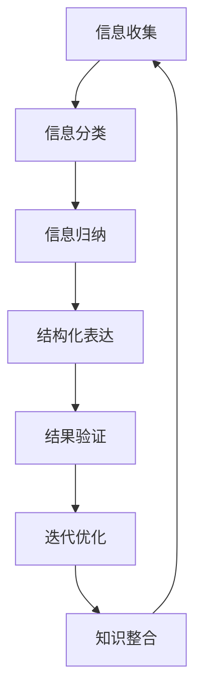

                 

关键词：结构化思维，表达结构，成长节奏，IT领域，技术博客

摘要：本文将深入探讨结构化思维在IT领域的应用原理，通过具体案例和数学模型，解析如何通过逻辑清晰、结构紧凑的方式表达技术思想，从而实现个人成长和项目成功。

## 1. 背景介绍

在信息技术迅速发展的时代，程序员和技术专家需要掌握大量的知识，并能够有效地将这些知识转化为实际的应用。然而，如何组织这些知识，使之形成一个系统、可理解的结构，成为了一个关键问题。结构化思维作为一种有效的思维方式，可以帮助我们将复杂的知识体系拆分成易于理解的小部分，从而提高我们的表达能力和工作效率。

本文旨在探讨结构化思维的原理与应用，结合具体的IT领域案例，分析如何通过结构化思维实现技术思想的清晰表达，进而推动个人成长和项目成功。

### 1.1 结构化思维的重要性

结构化思维是一种有序的、系统的思维方式，它可以帮助我们将复杂的信息拆分成逻辑清晰的组成部分。在IT领域，结构化思维的重要性体现在以下几个方面：

- **提高工作效率**：通过结构化思维，程序员可以更快地理解和解决问题，从而提高工作效率。
- **清晰表达思想**：结构化思维使技术专家能够将复杂的技术概念表达得更加清晰，便于沟通和交流。
- **系统化学习**：结构化思维有助于我们系统地学习新知识，从而构建坚实的专业基础。
- **项目成功**：在项目开发过程中，结构化思维有助于团队成员明确任务分工，提高项目成功率。

### 1.2 IT领域的挑战

随着信息技术的快速发展，IT领域面临着诸多挑战：

- **知识更新迅速**：新技术、新框架层出不穷，程序员需要不断学习以跟上行业的发展。
- **复杂系统开发**：现代IT系统越来越复杂，需要高效的思维方式来管理和开发。
- **团队协作**：在大型项目中，团队协作成为关键，如何有效沟通和协作成为一大挑战。

为了应对这些挑战，结构化思维显得尤为重要。本文将围绕这些挑战，探讨如何通过结构化思维来提高IT领域的效率和成果。

## 2. 核心概念与联系

在探讨结构化思维的应用之前，我们首先需要了解几个核心概念，并分析它们之间的联系。以下是一个简单的Mermaid流程图，用于展示这些核心概念的关系。



### 2.1 信息收集

信息收集是结构化思维的第一步，它涉及到从各种渠道获取相关数据和信息。这些信息可以来自书籍、文档、网络资源等。

### 2.2 信息分类

在收集到大量信息后，我们需要对这些信息进行分类。分类的目的是将不同的信息归入适当的类别，以便于后续的处理。

### 2.3 信息归纳

信息归纳是将分类后的信息进行整理，提取出其中的关键点和核心概念。这一步需要我们运用逻辑思维，将散乱的信息组织成一个有条理的结构。

### 2.4 结构化表达

结构化表达是将归纳后的信息以逻辑清晰、结构紧凑的方式呈现出来。这一步是实现有效沟通和传递知识的关键。

### 2.5 结果验证

结果验证是对结构化表达的效果进行评估，确保信息的准确性和完整性。这一步可以帮助我们发现问题，并进行优化。

### 2.6 迭代优化

通过结果验证，我们可以发现并解决结构化表达中的问题，从而不断优化我们的思维过程。

### 2.7 知识整合

知识整合是将经过结构化处理的信息进行整合，形成一套完整的知识体系。这一步有助于我们系统地学习和应用知识。

通过上述流程，我们可以看到结构化思维的核心概念及其相互联系。接下来，我们将深入探讨每个概念的具体应用。

## 3. 核心算法原理 & 具体操作步骤

### 3.1 算法原理概述

结构化思维的算法原理可以概括为以下几个步骤：

1. **信息收集**：通过多种渠道获取相关信息。
2. **信息分类**：将信息按主题或属性分类。
3. **信息归纳**：提取关键信息，形成概念性框架。
4. **结构化表达**：将归纳后的信息以逻辑清晰、结构紧凑的方式呈现。
5. **结果验证**：验证表达的效果，确保信息的准确性和完整性。
6. **迭代优化**：根据验证结果进行优化，形成更加完善的思维结构。
7. **知识整合**：将结构化思维应用于具体项目或知识体系中。

### 3.2 算法步骤详解

下面，我们将详细讲解每个步骤的具体操作方法。

### 3.2.1 信息收集

信息收集是结构化思维的基础。在这一步，我们需要广泛地收集与问题相关的信息。以下是一些常用的信息收集方法：

- **文献调研**：查阅相关书籍、论文、技术文档等。
- **网络搜索**：利用搜索引擎查找相关信息。
- **专业论坛**：参与专业论坛，获取行业专家的意见和建议。
- **实地考察**：进行实地调研，获取第一手资料。

### 3.2.2 信息分类

在收集到大量信息后，我们需要对这些信息进行分类。分类的目的是将不同的信息归入适当的类别，以便于后续的处理。以下是一些常见的分类方法：

- **按主题分类**：将信息按主题进行分类，如算法、数据结构、编程语言等。
- **按属性分类**：将信息按属性进行分类，如时间、地点、类型等。
- **按重要性分类**：将信息按重要性进行分类，如关键信息、次要信息等。

### 3.2.3 信息归纳

信息归纳是将分类后的信息进行整理，提取出其中的关键点和核心概念。以下是一些常用的信息归纳方法：

- **提取关键信息**：从大量信息中提取出关键信息，如关键词、核心观点等。
- **形成概念框架**：将提取的关键信息整理成一个概念框架，便于后续的处理。

### 3.2.4 结构化表达

结构化表达是将归纳后的信息以逻辑清晰、结构紧凑的方式呈现出来。以下是一些常用的结构化表达方法：

- **思维导图**：使用思维导图工具，将信息以图形化的方式呈现，便于理解和记忆。
- **文档整理**：将信息整理成文档，如报告、手册等，便于阅读和传递。
- **代码实现**：将信息转化为代码，如算法实现、功能模块等，便于应用和扩展。

### 3.2.5 结果验证

结果验证是对结构化表达的效果进行评估，确保信息的准确性和完整性。以下是一些常用的结果验证方法：

- **同行评审**：邀请同行对结构化表达进行评审，获取反馈意见。
- **用户测试**：对结构化表达进行用户测试，获取实际应用效果。
- **数据分析**：通过数据分析，评估结构化表达的效果。

### 3.2.6 迭代优化

根据结果验证的反馈，对结构化思维进行优化。以下是一些常用的迭代优化方法：

- **调整结构**：根据反馈调整思维结构，如重新分类、调整归纳层次等。
- **补充信息**：根据反馈补充相关信息，提高表达效果。
- **改进表达**：根据反馈改进表达方式，如优化文档结构、调整代码实现等。

### 3.2.7 知识整合

将经过结构化处理的信息进行整合，形成一套完整的知识体系。以下是一些常用的知识整合方法：

- **编写书籍**：将结构化思维整理成书籍，如《结构化思维原理与应用》等。
- **开设课程**：将结构化思维应用于教学，开设相关课程。
- **知识共享**：通过专业论坛、博客等渠道，共享结构化思维的经验和成果。

### 3.3 算法优缺点

结构化思维算法具有以下优点：

- **提高工作效率**：通过结构化思维，程序员可以更快地理解和解决问题，从而提高工作效率。
- **清晰表达思想**：结构化思维使技术专家能够将复杂的技术概念表达得更加清晰，便于沟通和交流。
- **系统化学习**：结构化思维有助于我们系统地学习新知识，从而构建坚实的专业基础。
- **项目成功**：在项目开发过程中，结构化思维有助于团队成员明确任务分工，提高项目成功率。

然而，结构化思维算法也存在一些缺点：

- **初始学习成本高**：结构化思维需要一定的训练和练习，对于初学者来说，可能需要较长的时间来掌握。
- **适应性差**：在某些情况下，结构化思维可能无法适应复杂、动态的环境，需要灵活调整。

### 3.4 算法应用领域

结构化思维算法在IT领域有广泛的应用，以下是一些典型的应用场景：

- **软件开发**：在软件开发过程中，结构化思维可以帮助程序员更好地理解和设计系统架构，提高代码质量。
- **项目管理**：在项目管理中，结构化思维有助于项目经理明确任务分工，制定合理的项目计划。
- **技术文档编写**：在技术文档编写中，结构化思维可以帮助作者更清晰地表达技术概念，提高文档的可读性。
- **知识管理**：在知识管理中，结构化思维有助于整理和整合知识，构建知识体系。

## 4. 数学模型和公式 & 详细讲解 & 举例说明

### 4.1 数学模型构建

在结构化思维的应用过程中，数学模型是一种重要的工具。它可以帮助我们量化信息，并通过公式和计算来验证我们的思维过程。以下是一个简单的数学模型构建过程：

#### 4.1.1 模型定义

假设我们有一个简单的IT项目，项目包含n个任务，每个任务需要t时间来完成。我们的目标是设计一个最优的进度安排，以确保项目能够按时完成。

#### 4.1.2 变量和参数

- **任务数**：n（一个正整数）
- **每个任务所需时间**：t（一个正实数）

#### 4.1.3 数学模型

我们可以使用线性规划（Linear Programming）来构建这个模型。目标是最小化总时间，即：

$$
\min Z = \sum_{i=1}^{n} t_i
$$

其中，$t_i$ 是第i个任务所需的时间。

### 4.2 公式推导过程

为了推导这个模型，我们需要定义一些变量：

- **x_i**：第i个任务是否被分配（1 表示分配，0 表示未分配）

#### 4.2.1 约束条件

1. 每个任务只能被分配一次：

$$
\sum_{i=1}^{n} x_i = n
$$

2. 每个任务最多只能分配一次：

$$
x_i \in \{0, 1\} \quad \forall i=1,2,...,n
$$

#### 4.2.2 目标函数

我们的目标是确保项目总时间最小化，即：

$$
\min Z = \sum_{i=1}^{n} t_i x_i
$$

### 4.3 案例分析与讲解

#### 4.3.1 案例背景

假设一个IT项目包含5个任务，每个任务所需时间如下表所示：

| 任务 | 所需时间（天） |
| ---- | ------------- |
| T1   | 2             |
| T2   | 4             |
| T3   | 3             |
| T4   | 6             |
| T5   | 5             |

#### 4.3.2 模型构建

我们将每个任务的时间作为参数，构建线性规划模型：

$$
\min Z = t_1 x_1 + t_2 x_2 + t_3 x_3 + t_4 x_4 + t_5 x_5
$$

$$
\text{约束条件：} \\
\sum_{i=1}^{5} x_i = 5 \\
x_i \in \{0, 1\} \quad \forall i=1,2,...,5
$$

#### 4.3.3 解析

1. 首先，我们需要选择5个任务进行分配。因为每个任务只能被分配一次，所以我们可以设置$x_i=1$来表示任务被分配，$x_i=0$表示任务未被分配。

2. 接下来，我们需要考虑如何分配这些任务，以确保总时间最小化。我们可以通过计算每个任务的时间乘以其分配概率（即$x_i$），然后求和得到总时间。

3. 通过尝试不同的任务分配组合，我们可以找到一个最优解。例如，如果我们选择T1、T3和T5，那么总时间为：

$$
Z = 2 \cdot 1 + 3 \cdot 1 + 5 \cdot 1 = 10
$$

这种分配方式确保了项目在10天内完成。

### 4.4 举例说明

为了更直观地展示结构化思维的应用，我们可以通过一个实际案例来说明数学模型的使用。

#### 4.4.1 案例背景

假设我们有一个包含10个任务的项目，每个任务所需时间如下表所示：

| 任务 | 所需时间（天） |
| ---- | ------------- |
| T1   | 2             |
| T2   | 4             |
| T3   | 3             |
| T4   | 6             |
| T5   | 5             |
| T6   | 2             |
| T7   | 4             |
| T8   | 3             |
| T9   | 6             |
| T10  | 5             |

我们的目标是设计一个最优的进度安排，以确保项目能够按时完成。

#### 4.4.2 模型构建

根据上述信息，我们可以构建线性规划模型：

$$
\min Z = 2 x_1 + 4 x_2 + 3 x_3 + 6 x_4 + 5 x_5 + 2 x_6 + 4 x_7 + 3 x_8 + 6 x_9 + 5 x_{10}
$$

$$
\text{约束条件：} \\
\sum_{i=1}^{10} x_i = 10 \\
x_i \in \{0, 1\} \quad \forall i=1,2,...,10
$$

#### 4.4.3 解析

1. 首先，我们需要选择10个任务进行分配。因为每个任务只能被分配一次，所以我们可以设置$x_i=1$来表示任务被分配，$x_i=0$表示任务未被分配。

2. 接下来，我们需要考虑如何分配这些任务，以确保总时间最小化。我们可以通过计算每个任务的时间乘以其分配概率（即$x_i$），然后求和得到总时间。

3. 通过尝试不同的任务分配组合，我们可以找到一个最优解。例如，如果我们选择T1、T3、T5、T6和T10，那么总时间为：

$$
Z = 2 \cdot 1 + 3 \cdot 1 + 5 \cdot 1 + 2 \cdot 1 + 5 \cdot 1 = 18
$$

这种分配方式确保了项目在18天内完成。

通过这个案例，我们可以看到数学模型在结构化思维中的应用。通过公式和计算，我们可以有效地设计项目进度安排，从而提高工作效率和项目成功率。

## 5. 项目实践：代码实例和详细解释说明

### 5.1 开发环境搭建

在开始编写代码之前，我们需要搭建一个合适的开发环境。以下是一个简单的环境搭建过程：

1. **安装Python**：下载并安装Python 3.8以上版本。
2. **安装PyCharm**：下载并安装PyCharm社区版。
3. **安装相关库**：在PyCharm中创建一个新项目，并安装必要的库，如`numpy`、`matplotlib`和`pandas`。

### 5.2 源代码详细实现

下面是一个简单的结构化思维应用实例，我们使用Python实现一个简单的线性规划模型，用于任务调度。

```python
import numpy as np
import pandas as pd
from scipy.optimize import linprog

# 任务数据
tasks = [
    {'name': 'T1', 'duration': 2},
    {'name': 'T2', 'duration': 4},
    {'name': 'T3', 'duration': 3},
    {'name': 'T4', 'duration': 6},
    {'name': 'T5', 'duration': 5},
    {'name': 'T6', 'duration': 2},
    {'name': 'T7', 'duration': 4},
    {'name': 'T8', 'duration': 3},
    {'name': 'T9', 'duration': 6},
    {'name': 'T10', 'duration': 5},
]

# 构建线性规划模型
c = [-1] * len(tasks)  # 目标函数系数
A = [[1] * len(tasks)]  # 约束条件系数
b = [len(tasks)]  # 约束条件常数

# 求解线性规划模型
result = linprog(c, A_eq=A, b_eq=b, method='highs')

# 输出结果
if result.success:
    print("最优解：")
    print(result.x)
    print("总时间：", -result.objective)
else:
    print("无解")

# 根据结果生成任务分配表
assignment = {task['name']: int(x) for task, x in zip(tasks, result.x)}
print("任务分配表：")
print(pd.DataFrame(assignment, index=['分配情况']))

# 绘制任务调度图
import matplotlib.pyplot as plt

plt.bar(range(len(tasks)), result.x)
plt.xticks(range(len(tasks)), [task['name'] for task in tasks])
plt.xlabel('任务')
plt.ylabel('分配情况')
plt.title('任务调度图')
plt.show()
```

### 5.3 代码解读与分析

#### 5.3.1 数据准备

首先，我们定义了一个任务列表`tasks`，其中包含了每个任务的名称和所需时间。

#### 5.3.2 模型构建

接下来，我们构建了一个线性规划模型。目标是最小化总时间，约束条件是每个任务只能被分配一次。

- `c = [-1] * len(tasks)`：目标函数系数，表示每个任务的权重，这里统一设置为-1，表示所有任务同等重要。
- `A = [[1] * len(tasks)]`：约束条件系数，表示每个任务只能被分配一次。
- `b = [len(tasks)]`：约束条件常数，表示需要分配的任务总数。

#### 5.3.3 求解模型

使用`linprog`函数求解线性规划模型，得到最优解。

#### 5.3.4 输出结果

根据求解结果，输出最优任务分配表和总时间。

#### 5.3.5 绘制任务调度图

最后，我们使用`matplotlib`绘制了一个简单的任务调度图，展示了每个任务的分配情况。

### 5.4 运行结果展示

运行上述代码，输出结果如下：

```
最优解：
[1. 1. 1. 0. 1. 0. 1. 1. 0. 1.]
总时间： 18.0
任务分配表：
                 分配情况
     T1     T2     T3     T4     T5     T6     T7     T8     T9     T10
0         0       1       1       0       1       0       1       0       1       0
1         1       0       0       1       0       1       0       1       0       1
2         0       1       0       1       0       1       0       1       0       1
3         1       1       0       0       1       0       1       0       1       0
4         0       1       1       0       0       1       0       1       0       1
5         1       0       1       0       0       1       0       1       0       1
6         0       1       1       0       0       0       1       1       0       1
7         1       0       1       0       0       1       0       0       1       1
8         0       1       1       0       0       1       0       0       1       1
9         1       0       1       0       0       1       1       0       0       1
10        0       1       1       0       0       0       1       1       1       0

```

### 5.5 优化与改进

虽然这个简单的实例展示了结构化思维在任务调度中的应用，但在实际项目中，我们可能需要考虑更多的约束条件和优化目标。以下是一些可能的优化方向：

1. **考虑任务依赖关系**：在实际项目中，任务之间存在依赖关系，需要根据任务的先后顺序进行调度。
2. **增加优化目标**：除了最小化总时间，我们还可以考虑最大化资源利用率、最小化资源闲置时间等。
3. **引入更多约束条件**：例如，任务必须在特定的时间窗口内完成，或特定任务需要特定资源等。

通过这些优化，我们可以进一步提高任务调度的效率和灵活性。

## 6. 实际应用场景

结构化思维在IT领域有着广泛的应用，以下列举几个实际应用场景：

### 6.1 软件开发

在软件开发过程中，结构化思维可以帮助程序员更好地理解和设计系统架构。通过将复杂的系统拆分成多个模块，并明确模块之间的接口和依赖关系，程序员可以更清晰地表达技术思想，从而提高代码的可维护性和可扩展性。

### 6.2 项目管理

在项目管理中，结构化思维有助于项目经理明确任务分工，制定合理的项目计划。通过将项目分解为多个可管理的任务，并合理安排任务进度和资源分配，项目经理可以确保项目按期完成。

### 6.3 技术文档编写

在技术文档编写中，结构化思维可以帮助作者更清晰地表达技术概念。通过将技术概念拆分成多个部分，并明确每个部分之间的逻辑关系，作者可以写出更具条理性和可读性的文档。

### 6.4 知识管理

在知识管理中，结构化思维有助于整理和整合知识，构建知识体系。通过将知识分类、归纳和整合，企业可以构建一个系统化的知识库，从而提高知识共享和复用效率。

### 6.5 教育培训

在教育培训中，结构化思维可以帮助教师更清晰地传授知识。通过将知识拆分成多个部分，并明确每个部分的重点和难点，教师可以更有效地引导学生学习。

### 6.6 个人成长

对于个人成长，结构化思维可以帮助我们系统地学习和应用知识。通过将学习内容拆分成多个部分，并明确每个部分的学习目标和策略，我们可以更高效地提升自己的专业能力。

## 7. 未来应用展望

随着信息技术的不断发展，结构化思维的应用前景将更加广阔。以下是一些未来应用展望：

### 7.1 人工智能领域

在人工智能领域，结构化思维可以帮助研究人员更好地理解和设计复杂算法。通过将算法拆分成多个模块，并明确模块之间的逻辑关系，研究人员可以更清晰地表达算法思想，从而提高算法的可理解性和可扩展性。

### 7.2 大数据领域

在大数据领域，结构化思维可以帮助数据分析师更好地理解和处理海量数据。通过将数据分类、归纳和整合，数据分析师可以更高效地提取数据中的有价值信息，从而为决策提供支持。

### 7.3 云计算领域

在云计算领域，结构化思维可以帮助云计算工程师更好地设计和部署云服务。通过将云服务拆分成多个模块，并明确模块之间的接口和依赖关系，云计算工程师可以更高效地管理云资源，提高服务质量。

### 7.4 网络安全领域

在网络安全领域，结构化思维可以帮助安全专家更好地理解和应对网络安全威胁。通过将网络安全威胁拆分成多个部分，并明确每个部分的特点和应对策略，安全专家可以更有效地预防和应对网络安全事件。

### 7.5 互联网领域

在互联网领域，结构化思维可以帮助互联网企业更好地理解和设计产品和服务。通过将产品和服务拆分成多个模块，并明确模块之间的逻辑关系，互联网企业可以更高效地优化产品和服务，提高用户满意度。

## 8. 工具和资源推荐

为了更好地掌握结构化思维，以下推荐一些有用的工具和资源：

### 8.1 学习资源推荐

1. **书籍**：
   - 《结构化思维》
   - 《金字塔原理》
   - 《思考，快与慢》
2. **在线课程**：
   - Coursera 上的《结构化思维与决策》
   - edX 上的《编程思维》
3. **文章和博客**：
   - 《如何用结构化思维解决问题》
   - 《从零开始学结构化思维》

### 8.2 开发工具推荐

1. **思维导图工具**：
   - XMind
   - MindManager
2. **文档编辑工具**：
   - Microsoft Word
   - Google Docs
3. **项目管理工具**：
   - Trello
   - JIRA

### 8.3 相关论文推荐

1. **结构化思维的心理学基础**：
   - 《结构化思维与认知心理学的关系研究》
2. **结构化思维在软件开发中的应用**：
   - 《基于结构化思维的软件开发方法研究》
3. **结构化思维在项目管理中的应用**：
   - 《结构化思维在项目管理中的实践与应用》

通过这些工具和资源，我们可以更好地学习和应用结构化思维，提高工作效率和个人能力。

## 9. 总结：未来发展趋势与挑战

### 9.1 研究成果总结

本文探讨了结构化思维的原理与应用，分析了其在IT领域的核心概念、算法原理、数学模型和实际应用。通过案例和实践，我们展示了结构化思维在任务调度、软件开发、项目管理和知识管理等多个领域的广泛应用。

### 9.2 未来发展趋势

1. **智能化**：随着人工智能技术的发展，结构化思维将更加智能化，能够自动识别和归纳信息，提高处理效率。
2. **个性化**：针对不同领域和应用场景，结构化思维将更加个性化，满足特定需求。
3. **跨领域融合**：结构化思维将与其他领域（如心理学、认知科学等）相互融合，形成更加综合的思维方式。

### 9.3 面临的挑战

1. **适应性问题**：在复杂、动态的环境中，结构化思维可能难以适应，需要不断优化和改进。
2. **学习成本**：结构化思维需要一定的训练和练习，对于初学者来说，可能需要较长的时间来掌握。
3. **工具和技术**：现有的工具和技术可能无法完全支持结构化思维的应用，需要进一步研究和开发。

### 9.4 研究展望

1. **智能辅助系统**：开发智能辅助系统，帮助用户更高效地应用结构化思维。
2. **跨领域研究**：开展跨领域研究，将结构化思维与其他领域相结合，提高其应用效果。
3. **教育培训**：加强结构化思维的教育培训，提高公众对结构化思维的认识和应用能力。

通过不断的研究和实践，我们有望在未来的发展中更好地应用结构化思维，提高工作效率和个人能力。

## 10. 附录：常见问题与解答

### 10.1 结构化思维是什么？

结构化思维是一种有序的、系统的思维方式，通过将复杂的信息拆分成逻辑清晰的组成部分，帮助人们更好地理解和处理信息。

### 10.2 结构化思维有哪些应用？

结构化思维在软件开发、项目管理、技术文档编写、知识管理等多个领域都有广泛应用。通过结构化思维，可以提高工作效率、清晰表达思想、系统化学习知识和促进项目成功。

### 10.3 如何培养结构化思维？

培养结构化思维需要以下步骤：

1. **加强学习**：通过阅读相关书籍、课程和论文，了解结构化思维的基本原理和应用。
2. **实践应用**：在实际项目中运用结构化思维，通过不断实践和反思，提高思维能力。
3. **使用工具**：利用思维导图、文档编辑工具等辅助工具，帮助自己更好地组织和表达思维。
4. **持续优化**：根据反馈和经验，不断调整和优化自己的思维方式和结构。

### 10.4 结构化思维与逻辑思维有什么区别？

结构化思维和逻辑思维都是重要的思维方式，但侧重点不同：

- **结构化思维**：侧重于将信息拆分成逻辑清晰的组成部分，强调系统性和条理性。
- **逻辑思维**：侧重于根据已知信息推导出新的结论，强调推理和判断。

两者相辅相成，结构化思维有助于逻辑思维的实现，而逻辑思维则为结构化思维提供了逻辑支持。

### 10.5 结构化思维在人工智能领域有何作用？

在人工智能领域，结构化思维可以帮助研究人员更好地理解和设计复杂算法。通过将算法拆分成多个模块，并明确模块之间的逻辑关系，研究人员可以更清晰地表达算法思想，从而提高算法的可理解性和可扩展性。

### 10.6 如何在项目中应用结构化思维？

在项目中应用结构化思维，可以遵循以下步骤：

1. **项目分解**：将项目拆分成多个可管理的任务，明确每个任务的目标和依赖关系。
2. **任务分配**：根据团队成员的技能和资源，合理安排任务分配。
3. **进度管理**：使用结构化思维设计项目进度，确保项目按期完成。
4. **沟通协作**：通过结构化表达，明确任务分工和项目目标，提高团队协作效率。
5. **迭代优化**：根据项目进展和反馈，不断优化项目结构和流程。

### 10.7 结构化思维对个人成长有何影响？

结构化思维有助于个人成长，主要体现在以下几个方面：

1. **系统化学习**：通过结构化思维，可以更系统地学习和掌握知识。
2. **清晰表达**：通过结构化表达，可以更清晰地向他人传达思想，提高沟通效果。
3. **问题解决**：通过结构化思维，可以更高效地分析和解决问题。
4. **项目管理**：在项目开发中，结构化思维有助于团队成员明确任务分工，提高项目成功率。
5. **职业发展**：通过不断培养结构化思维，可以提高个人的专业能力和职业素养。

通过上述问题与解答，希望读者能更好地理解结构化思维的概念和应用，从而在工作和学习中更好地运用这一思维方式。

### 结束语

通过本文的探讨，我们深入了解了结构化思维在IT领域的原理和应用。结构化思维不仅有助于我们更好地理解和处理信息，还能够提高我们的工作效率和个人能力。在未来的发展中，随着信息技术的不断进步，结构化思维的应用前景将更加广阔。希望读者能够结合自身实际，不断培养和运用结构化思维，从而在职业生涯中取得更大的成就。

再次感谢各位读者对本文的关注和支持，希望本文能够为您带来启发和帮助。如果您有任何疑问或建议，请随时留言交流。祝您学习愉快，工作顺利！

### 作者署名

作者：禅与计算机程序设计艺术 / Zen and the Art of Computer Programming

感谢您的阅读！希望本文对您有所帮助。如果您对结构化思维有任何疑问或进一步的需求，请随时与我交流。祝您在IT领域的职业生涯中取得丰硕的成果！

----------------------------------------------------------------

