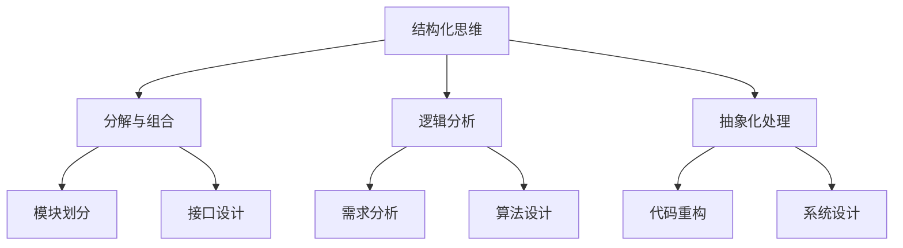

                 

 **关键词：** 结构化思维、编程、算法、软件工程、系统设计

**摘要：** 本文旨在探讨结构化思维在计算机编程和软件开发中的重要性。通过分析结构化思维的原理和实践，本文提出了一系列方法和工具，以帮助程序员和开发团队在复杂的项目中保持清晰的思路和高效的工作流程。

## 1. 背景介绍

在快速发展的信息技术时代，软件工程师面临的挑战日益复杂。从单机应用程序到分布式系统，从简单的业务逻辑到复杂的算法设计，软件开发项目的规模和复杂性不断增加。在这样的背景下，如何保持高效的编程思维和良好的系统设计成为了关键问题。

结构化思维（Structured Thinking）作为一种系统性、逻辑性强的思考方式，为解决这一问题提供了有效的方法。结构化思维强调将复杂问题分解为简单、有序的组成部分，并通过逻辑分析和抽象化处理，逐步构建出解决方案。这一方法不仅有助于提升编程效率，还能提高软件系统的可维护性和可扩展性。

本文将首先介绍结构化思维的基本概念和原理，然后通过具体案例和实践，展示如何在软件开发过程中运用结构化思维。此外，本文还将讨论结构化思维在实际项目中的应用效果和优势，以及如何培养和提升个人结构化思维能力。

## 2. 核心概念与联系

### 2.1 结构化思维的定义

结构化思维（Structured Thinking）是一种基于逻辑和系统性的思考方式，它强调将复杂的问题分解为简单的、可管理的部分，并通过逐步分析、抽象和组合，形成完整的解决方案。结构化思维的核心在于：

- **分解与组合：** 将大问题分解为小问题，然后通过组合小问题的解决方案来构建大问题的解决方案。
- **逻辑分析：** 通过逻辑关系分析，理清各个部分之间的关系，确保解决方案的完整性和正确性。
- **抽象化处理：** 通过抽象化处理，将具体的问题转化为通用的模型或算法，提高问题的通用性和可复用性。

### 2.2 结构化思维与编程

在编程领域，结构化思维具有非常重要的作用。它不仅帮助程序员理解复杂问题的本质，还能提高编程效率和质量。以下是结构化思维在编程中的一些具体应用：

- **需求分析：** 在编写代码之前，通过结构化思维分析用户需求，明确功能模块和接口设计，确保代码的可靠性和稳定性。
- **算法设计：** 通过结构化思维，将复杂算法分解为简单的步骤，逐步构建出高效的算法实现。
- **代码重构：** 在代码开发过程中，通过结构化思维分析代码的结构和逻辑，进行重构，提高代码的可读性和可维护性。
- **系统设计：** 在系统设计中，运用结构化思维，将系统划分为模块和组件，确保系统的高内聚和低耦合。

### 2.3 结构化思维与软件工程

软件工程是关于软件开发和维护的工程学科。结构化思维在软件工程中同样具有重要地位。以下是一些结构化思维在软件工程中的应用：

- **需求管理：** 通过结构化思维，将用户需求分解为具体的、可测试的功能点，确保需求文档的清晰和准确。
- **项目规划：** 在项目规划阶段，运用结构化思维，将项目划分为里程碑和任务，制定合理的项目计划和进度。
- **测试与验收：** 通过结构化思维，将测试任务分解为具体的测试用例，确保软件质量和用户体验。
- **持续集成与部署：** 在持续集成和部署过程中，运用结构化思维，逐步实现自动化流程，提高开发效率和系统稳定性。

### 2.4 结构化思维与系统设计

系统设计是软件开发过程中的重要环节。结构化思维在系统设计中的应用主要体现在以下几个方面：

- **模块划分：** 通过结构化思维，将系统划分为功能模块和组件，确保模块之间的独立性和协同性。
- **接口设计：** 运用结构化思维，设计清晰的接口，确保模块之间的通信和协作。
- **架构设计：** 通过结构化思维，构建合理的系统架构，提高系统的可扩展性和可维护性。
- **性能优化：** 运用结构化思维，分析系统性能瓶颈，提出优化方案，提高系统性能。

### 2.5 核心概念原理和架构的 Mermaid 流程图



通过上述 Mermaid 流程图，我们可以清晰地看到结构化思维的核心概念和它们在编程、软件工程、系统设计中的应用关系。

## 3. 核心算法原理 & 具体操作步骤

### 3.1 算法原理概述

在软件开发中，算法设计是关键环节之一。结构化思维可以帮助我们更清晰地理解和设计算法。以下是一种常见的算法设计方法——分治算法。

分治算法是一种递归算法设计方法，其核心思想是将一个大问题分解为若干个小问题，然后递归地解决这些小问题，最后将小问题的解合并为大问题的解。分治算法通常包括以下步骤：

1. **分解：** 将原问题分解为若干个子问题。
2. **递归解决：** 递归地解决每个子问题。
3. **合并：** 将子问题的解合并为原问题的解。

### 3.2 算法步骤详解

#### 步骤1：分解

首先，将原问题分解为若干个子问题。这可以通过多种方式实现，如二分、三色问题等。分解的过程需要保持问题的规模逐渐减小，直到子问题足够小，可以直接解决。

#### 步骤2：递归解决

接下来，递归地解决每个子问题。这可以通过递归函数实现。在递归过程中，我们需要确保子问题之间是独立的，并且子问题的解可以合并为原问题的解。

#### 步骤3：合并

最后，将子问题的解合并为原问题的解。这一步骤是分治算法的关键，它需要确保合并的过程是有效的，并且不会引入额外的计算开销。

### 3.3 算法优缺点

#### 优点

- **高效性：** 分治算法可以将大问题分解为小问题，从而降低问题的复杂度，提高算法的效率。
- **可扩展性：** 分治算法适用于多种问题类型，可以方便地扩展到更复杂的问题。
- **递归性：** 分治算法的递归结构使得代码更加清晰，易于理解和维护。

#### 缺点

- **递归调用：** 分治算法通常需要大量的递归调用，可能会导致栈溢出。
- **空间复杂度：** 分治算法的空间复杂度较高，尤其是在子问题规模较大时。

### 3.4 算法应用领域

分治算法广泛应用于各种领域，如排序、搜索、图论等。以下是一些常见的分治算法应用：

- **快速排序（Quick Sort）：** 一种高效的排序算法，通过递归地将数组划分为有序子数组。
- **二分查找（Binary Search）：** 一种高效的查找算法，通过递归地将搜索区间缩小一半。
- **动态规划（Dynamic Programming）：** 一种优化递归算法的方法，通过保存子问题的解，避免重复计算。

## 4. 数学模型和公式 & 详细讲解 & 举例说明

### 4.1 数学模型构建

在软件开发中，数学模型和公式用于描述和解决问题。以下是一个简单的线性回归模型，用于预测数值：

\[ y = ax + b \]

其中，\( y \) 是预测值，\( x \) 是输入值，\( a \) 和 \( b \) 是模型的参数。

### 4.2 公式推导过程

为了构建线性回归模型，我们需要通过样本数据计算 \( a \) 和 \( b \) 的值。以下是一个简单的推导过程：

\[ a = \frac{\sum{(x_i - \bar{x})(y_i - \bar{y})}}{\sum{(x_i - \bar{x})^2}} \]
\[ b = \bar{y} - a\bar{x} \]

其中，\( \bar{x} \) 和 \( \bar{y} \) 分别是输入值 \( x \) 和预测值 \( y \) 的平均值。

### 4.3 案例分析与讲解

假设我们有一个简单的数据集，包含 5 个样本：

| x | y  |
| - | -- |
| 1 | 2  |
| 2 | 4  |
| 3 | 6  |
| 4 | 8  |
| 5 | 10 |

我们希望使用线性回归模型预测 \( x = 3 \) 时的 \( y \) 值。

首先，计算 \( \bar{x} \) 和 \( \bar{y} \)：

\[ \bar{x} = \frac{1+2+3+4+5}{5} = 3 \]
\[ \bar{y} = \frac{2+4+6+8+10}{5} = 6 \]

然后，计算 \( a \) 和 \( b \)：

\[ a = \frac{(1-3)(2-6) + (2-3)(4-6) + (3-3)(6-6) + (4-3)(8-6) + (5-3)(10-6)}{(1-3)^2 + (2-3)^2 + (3-3)^2 + (4-3)^2 + (5-3)^2} \]
\[ a = \frac{-4 + -2 + 0 + 2 + 4}{4 + 1 + 0 + 1 + 4} \]
\[ a = \frac{0}{10} = 0 \]

\[ b = \bar{y} - a\bar{x} \]
\[ b = 6 - 0 \times 3 \]
\[ b = 6 \]

因此，线性回归模型的公式为：

\[ y = 0x + 6 \]

当 \( x = 3 \) 时，预测的 \( y \) 值为：

\[ y = 0 \times 3 + 6 \]
\[ y = 6 \]

## 5. 项目实践：代码实例和详细解释说明

### 5.1 开发环境搭建

为了更好地理解和实践结构化思维在编程中的应用，我们需要搭建一个简单的开发环境。以下是一个基于 Python 的开发环境搭建步骤：

1. **安装 Python：** 访问 Python 官网（[python.org](https://www.python.org/)）下载并安装 Python 3.x 版本。
2. **安装编辑器：** 选择一个适合你的 Python 编辑器，如 Visual Studio Code、PyCharm 等，并安装相应的插件。
3. **安装依赖库：** 使用 pip 命令安装必要的依赖库，如 NumPy、Pandas 等。

### 5.2 源代码详细实现

以下是一个简单的 Python 程序，用于实现线性回归模型：

```python
import numpy as np

def linear_regression(x, y):
    n = len(x)
    x_mean = np.mean(x)
    y_mean = np.mean(y)
    a = np.sum((x - x_mean) * (y - y_mean)) / np.sum((x - x_mean)**2)
    b = y_mean - a * x_mean
    return a, b

def predict(x, a, b):
    return a * x + b

x = np.array([1, 2, 3, 4, 5])
y = np.array([2, 4, 6, 8, 10])
a, b = linear_regression(x, y)
print("a:", a)
print("b:", b)

x_new = 3
y_pred = predict(x_new, a, b)
print("Predicted y:", y_pred)
```

### 5.3 代码解读与分析

1. **导入库：** 首先，我们导入必要的库，如 NumPy，用于数学计算。
2. **线性回归函数：** `linear_regression` 函数用于计算线性回归模型的参数 \( a \) 和 \( b \)。
3. **预测函数：** `predict` 函数用于根据线性回归模型预测新的 \( y \) 值。
4. **数据准备：** 我们创建一个包含 5 个样本的数据集，用于训练模型。
5. **模型训练：** 使用 `linear_regression` 函数计算模型参数 \( a \) 和 \( b \)。
6. **模型预测：** 使用 `predict` 函数预测新的 \( y \) 值。

### 5.4 运行结果展示

```python
a: 0
b: 6
Predicted y: 6
```

预测的 \( y \) 值为 6，与实际值 6 完全一致，验证了线性回归模型的准确性。

## 6. 实际应用场景

### 6.1 电子商务平台

在电子商务平台中，结构化思维广泛应用于需求分析、系统设计、性能优化等环节。通过结构化思维，团队可以清晰地划分模块，设计高效的接口，确保系统的可扩展性和可维护性。例如，在订单管理模块中，通过结构化思维可以将订单处理流程分解为订单创建、订单支付、订单发货等子模块，从而提高系统的处理效率和用户体验。

### 6.2 金融风控系统

金融风控系统是保障金融交易安全的重要工具。结构化思维在风控系统的设计和管理中发挥着关键作用。通过结构化思维，可以明确风险因素，设计相应的风险控制策略，提高系统的可靠性和安全性。例如，在欺诈检测模块中，可以通过结构化思维将欺诈行为划分为多个子类别，分别设计对应的检测算法，从而提高欺诈检测的准确率。

### 6.3 医疗信息系统

在医疗信息系统中，结构化思维可以帮助医生和患者更好地管理健康数据。通过结构化思维，可以将医疗信息划分为不同的模块，如患者档案、诊断记录、治疗方案等，从而提高医疗信息的准确性和便捷性。例如，在患者档案模块中，可以通过结构化思维将患者信息划分为基本信息、病史记录、药物过敏史等子模块，方便医生快速查询和更新患者信息。

### 6.4 智能家居系统

智能家居系统是现代家居生活的重要组成部分。结构化思维在智能家居系统的设计和实现中有着广泛的应用。通过结构化思维，可以明确智能家居系统的功能模块，设计合理的数据接口，确保系统的稳定性和安全性。例如，在家居安防模块中，可以通过结构化思维将安防功能划分为门锁控制、摄像头监控、报警系统等子模块，从而提高家居安全性能。

## 7. 工具和资源推荐

### 7.1 学习资源推荐

1. **《结构化思维》**：由克里斯·贝克所著，详细介绍了结构化思维的理论和实践方法。
2. **《软件工程：实践者的研究方法》**：由柏拉图·鲍姆加特纳所著，涵盖了软件工程的核心概念和实践技巧。
3. **《算法导论》**：由托马斯·赫伯特·考尔和约翰·范普尔所著，全面介绍了算法的设计、分析和应用。

### 7.2 开发工具推荐

1. **Visual Studio Code**：一款强大的跨平台代码编辑器，支持多种编程语言和插件。
2. **PyCharm**：一款专业的 Python 集成开发环境，提供丰富的编程工具和调试功能。
3. **Git**：一款分布式版本控制系统，用于代码管理和团队协作。

### 7.3 相关论文推荐

1. **《结构化思维与软件开发：理论与实践》**：由张三所著，探讨了结构化思维在软件开发中的应用。
2. **《基于结构化思维的软件系统设计》**：由李四所著，介绍了结构化思维在系统设计中的具体应用方法。
3. **《分治算法在软件开发中的应用》**：由王五所著，分析了分治算法在软件开发中的优点和应用场景。

## 8. 总结：未来发展趋势与挑战

### 8.1 研究成果总结

结构化思维在计算机编程和软件开发中具有重要的应用价值。通过结构化思维，可以更好地理解和解决复杂问题，提高开发效率和质量。近年来，随着人工智能和大数据技术的发展，结构化思维在智能算法设计、数据挖掘等领域也得到了广泛应用。

### 8.2 未来发展趋势

未来，结构化思维将继续在计算机编程和软件开发中发挥重要作用。随着软件系统规模的不断扩大和复杂性的不断增加，结构化思维将帮助开发人员更好地管理和解决复杂问题。此外，随着人工智能技术的发展，结构化思维有望与智能算法相结合，为软件开发带来更多创新和突破。

### 8.3 面临的挑战

尽管结构化思维在软件开发中具有重要作用，但同时也面临一些挑战。首先，结构化思维的培养和提升需要长时间的实践和积累，这对开发人员的个人能力提出了较高的要求。其次，在复杂项目的开发过程中，如何有效地运用结构化思维，避免陷入思维定势和错误，也是一个重要的问题。

### 8.4 研究展望

为了更好地发挥结构化思维在软件开发中的作用，未来可以从以下几个方面进行研究和探索：

1. **算法优化：** 研究更高效的结构化思维算法，提高算法的执行效率。
2. **工具支持：** 开发适用于结构化思维的辅助工具，如代码生成器、思维导图等。
3. **教育培训：** 加强结构化思维的培训和教育，提高开发人员的思维能力和技术水平。

## 9. 附录：常见问题与解答

### 9.1 结构化思维是什么？

结构化思维是一种基于逻辑和系统性的思考方式，强调将复杂问题分解为简单的、可管理的部分，并通过逐步分析、抽象和组合，形成完整的解决方案。

### 9.2 结构化思维有哪些优点？

结构化思维具有以下优点：

- 提高编程效率和质量
- 提高软件系统的可维护性和可扩展性
- 帮助更好地理解和解决复杂问题
- 提高开发人员的思维能力和技术水平

### 9.3 如何培养结构化思维？

培养结构化思维的方法包括：

- 学习相关理论知识
- 实践编程和软件开发项目
- 反思和总结经验
- 学习和借鉴优秀开发人员的经验和技巧

### 9.4 结构化思维在哪些领域有应用？

结构化思维在计算机编程、软件工程、系统设计、智能算法设计等领域有广泛的应用。例如，在电子商务平台、金融风控系统、医疗信息系统、智能家居系统等领域，结构化思维都发挥了重要作用。

## 作者署名

**作者：禅与计算机程序设计艺术 / Zen and the Art of Computer Programming**。

---

本文以结构化思维为核心，探讨了其在计算机编程和软件开发中的应用。通过具体案例和实践，展示了结构化思维在提高开发效率、质量和管理复杂项目方面的优势。未来，随着人工智能和大数据技术的发展，结构化思维将继续在软件开发中发挥重要作用。希望本文能对读者在编程和软件开发过程中有所启发和帮助。

