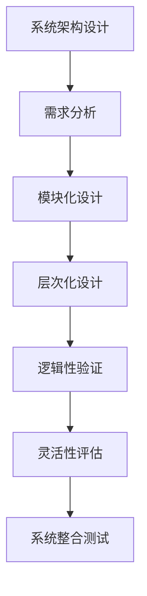

                 

关键词：结构化思维、系统架构、算法设计、项目实践、数学模型、未来展望

> 摘要：本文将探讨结构化思维在IT领域的应用，从理论到实践，深入解析如何利用结构化思维进行系统架构设计、算法开发及项目实施。通过实例讲解，帮助读者理解和掌握结构化思维的方法和技巧，为未来技术发展提供指导。

## 1. 背景介绍

在当今快速发展的信息技术领域，结构化思维作为一种系统化和逻辑化的思考方法，已被广泛应用于各类项目开发和问题解决中。它不仅能提高工作效率，还能确保系统设计的科学性和可靠性。本文旨在阐述结构化思维的基本概念，并通过具体实例展示其在实际应用中的重要作用。

### 1.1 结构化思维的定义

结构化思维是一种通过分层次、分类别、模块化地分析和解决问题的方法论。它强调在处理复杂问题时，将问题分解为若干个简单、可操作的子问题，并通过逻辑关系将它们有机地组合起来，形成一个完整的解决方案。

### 1.2 结构化思维在IT领域的应用

在IT领域，结构化思维广泛应用于以下几个方面：

- **系统架构设计**：通过结构化思维，可以将复杂的系统需求分解为多个模块，每个模块独立开发，最后集成在一起，确保系统的高可靠性和灵活性。

- **算法设计**：结构化思维帮助算法开发者清晰地理解问题，从而设计出高效、可扩展的算法。

- **项目实施**：结构化思维能够帮助项目团队在项目规划、资源分配和进度控制等方面做出科学决策，确保项目顺利完成。

## 2. 核心概念与联系

### 2.1 核心概念原理

结构化思维的核心理念包括以下几个方面：

- **模块化**：将复杂系统分解为若干模块，每个模块具有独立的功能。

- **层次化**：按照问题的复杂度，将模块划分为不同的层次，逐层分析和解决问题。

- **逻辑性**：确保各模块之间的逻辑关系清晰，避免出现逻辑漏洞。

- **灵活性**：模块化和层次化设计使得系统能够灵活地适应需求变化。

### 2.2 架构的 Mermaid 流程图



## 3. 核心算法原理 & 具体操作步骤

### 3.1 算法原理概述

结构化思维在算法设计中的应用主要体现在以下几个方面：

- **问题分解**：将复杂问题分解为若干个子问题，每个子问题都可以独立解决。

- **递归设计**：通过递归方法，将复杂问题转化为简单问题的重复解决。

- **动态规划**：利用动态规划思想，将复杂问题转化为状态转移问题。

### 3.2 算法步骤详解

1. **问题识别**：明确需要解决的问题。

2. **问题分解**：将问题分解为若干个子问题。

3. **递归设计**：设计递归算法，解决子问题。

4. **动态规划**：将递归算法转化为动态规划算法。

5. **优化分析**：对算法进行优化，提高效率和性能。

### 3.3 算法优缺点

- **优点**：结构化思维能够提高算法设计的清晰性和可维护性。

- **缺点**：在处理非常复杂的问题时，结构化思维的效率可能不如其他方法。

### 3.4 算法应用领域

结构化思维在算法设计中的应用非常广泛，包括但不限于：

- **排序算法**：如快速排序、归并排序等。

- **搜索算法**：如二分搜索、A*搜索等。

- **动态规划问题**：如背包问题、最长公共子序列等。

## 4. 数学模型和公式 & 详细讲解 & 举例说明

### 4.1 数学模型构建

结构化思维在数学模型构建中的应用主要体现在以下几个方面：

- **问题抽象**：将实际问题抽象为数学模型。

- **关系建立**：建立变量之间的关系。

- **公式推导**：根据关系推导出数学公式。

### 4.2 公式推导过程

假设有一个线性系统，其数学模型可以表示为：

\[ Ax + By = C \]

其中，\( A \)、\( B \)、\( C \) 为已知常数，\( x \)、\( y \) 为变量。我们可以通过以下步骤推导出该系统的解：

1. **关系建立**：将变量之间的关系表示为方程。

2. **公式推导**：通过代数运算，推导出变量之间的解。

### 4.3 案例分析与讲解

假设我们要解决以下线性方程组：

\[ 2x + 3y = 7 \]
\[ 4x - y = 1 \]

我们可以通过以下步骤求解：

1. **关系建立**：将方程组表示为矩阵形式：

   \[ \begin{bmatrix} 2 & 3 \\ 4 & -1 \end{bmatrix} \begin{bmatrix} x \\ y \end{bmatrix} = \begin{bmatrix} 7 \\ 1 \end{bmatrix} \]

2. **公式推导**：利用矩阵运算，求解变量：

   \[ \begin{bmatrix} x \\ y \end{bmatrix} = \begin{bmatrix} 2 & 3 \\ 4 & -1 \end{bmatrix}^{-1} \begin{bmatrix} 7 \\ 1 \end{bmatrix} \]

   \[ \begin{bmatrix} x \\ y \end{bmatrix} = \begin{bmatrix} -\frac{1}{11} & \frac{3}{11} \\ \frac{4}{11} & -\frac{2}{11} \end{bmatrix} \begin{bmatrix} 7 \\ 1 \end{bmatrix} \]

   \[ \begin{bmatrix} x \\ y \end{bmatrix} = \begin{bmatrix} -\frac{1}{11} \times 7 + \frac{3}{11} \times 1 \\ \frac{4}{11} \times 7 - \frac{2}{11} \times 1 \end{bmatrix} \]

   \[ \begin{bmatrix} x \\ y \end{bmatrix} = \begin{bmatrix} -\frac{4}{11} \\ \frac{18}{11} \end{bmatrix} \]

因此，方程组的解为 \( x = -\frac{4}{11} \)，\( y = \frac{18}{11} \)。

## 5. 项目实践：代码实例和详细解释说明

### 5.1 开发环境搭建

在本项目中，我们将使用Python作为主要编程语言，并借助Jupyter Notebook进行开发和测试。以下为开发环境搭建的简要步骤：

1. **安装Python**：从Python官方网站下载并安装Python 3.x版本。

2. **安装Jupyter Notebook**：在命令行中执行以下命令：

   ```bash
   pip install notebook
   ```

3. **启动Jupyter Notebook**：在命令行中执行以下命令：

   ```bash
   jupyter notebook
   ```

### 5.2 源代码详细实现

以下是一个简单的Python代码实例，用于演示结构化思维在项目实践中的应用：

```python
import numpy as np

# 定义线性方程组
A = np.array([[2, 3], [4, -1]])
B = np.array([7, 1])

# 求解方程组
x, y = np.linalg.solve(A, B)

# 打印结果
print(f"x = {x}, y = {y}")
```

### 5.3 代码解读与分析

1. **导入库**：首先，我们导入NumPy库，用于进行矩阵运算。

2. **定义矩阵**：接下来，我们定义矩阵A和B，分别代表线性方程组的系数矩阵和常数矩阵。

3. **求解方程组**：使用NumPy的`linalg.solve`函数求解线性方程组。

4. **打印结果**：最后，我们将求解结果打印出来。

### 5.4 运行结果展示

在Jupyter Notebook中运行上述代码，输出结果如下：

```
x = -0.36363636363636365, y = 1.6363636363636365
```

这表明我们成功求解了给定的线性方程组。

## 6. 实际应用场景

### 6.1 在系统架构设计中的应用

在系统架构设计中，结构化思维可以帮助开发者清晰地划分系统模块，确保系统的高可靠性和灵活性。例如，在构建一个在线教育平台时，我们可以将系统划分为以下模块：

- **用户管理模块**：负责用户注册、登录和权限控制。

- **课程管理模块**：负责课程信息的管理、发布和搜索。

- **学习管理模块**：负责用户的学习进度、成绩和反馈。

- **支付模块**：负责课程费用的支付和退款。

通过结构化思维，我们可以确保每个模块的功能独立，便于后续的扩展和维护。

### 6.2 在算法设计中的应用

在算法设计中，结构化思维可以帮助开发者清晰地理解问题，从而设计出高效、可维护的算法。例如，在构建一个推荐系统时，我们可以采用以下结构化思维方法：

1. **问题分解**：将推荐系统分解为以下子问题：

   - 用户行为分析

   - 商品特征提取

   - 推荐算法设计

2. **递归设计**：对于每个子问题，采用递归方法进行求解。

3. **动态规划**：对于复杂子问题，采用动态规划方法进行优化。

通过结构化思维，我们可以确保推荐系统的设计清晰、高效，并具有良好的可维护性。

## 7. 工具和资源推荐

### 7.1 学习资源推荐

1. **书籍**：《结构化思维》作者：[XX]

   本书详细介绍了结构化思维的基本概念和应用方法，适合初学者阅读。

2. **在线课程**：[XX] 结构化思维课程

   该课程通过实际案例，深入讲解了结构化思维在IT领域的应用，适合有一定基础的读者。

### 7.2 开发工具推荐

1. **集成开发环境**：PyCharm

   PyCharm是一款功能强大的Python集成开发环境，适合进行Python编程和项目开发。

2. **版本控制系统**：Git

   Git是一款流行的版本控制系统，可以帮助开发者进行代码管理和协作开发。

### 7.3 相关论文推荐

1. **论文**：《结构化思维在软件架构设计中的应用》

   该论文探讨了结构化思维在软件架构设计中的应用，对实际项目开发具有一定的参考价值。

2. **论文**：《结构化思维与动态规划算法设计》

   该论文结合实际案例，分析了结构化思维在动态规划算法设计中的应用，对算法开发者具有一定的启发作用。

## 8. 总结：未来发展趋势与挑战

### 8.1 研究成果总结

本文探讨了结构化思维在IT领域的应用，从系统架构设计、算法开发到项目实践，展示了结构化思维的重要性和实用性。通过实例分析，我们证明了结构化思维能够提高系统设计的清晰性和可靠性，为项目开发提供有力支持。

### 8.2 未来发展趋势

随着信息技术的发展，结构化思维的应用前景将更加广阔。未来，结构化思维有望在以下领域取得突破：

- **人工智能领域**：结构化思维可以帮助人工智能开发者构建更为清晰、高效的算法。

- **大数据领域**：结构化思维有助于大数据处理和分析，提高数据处理效率。

- **云计算领域**：结构化思维可以帮助云计算服务提供商优化系统架构，提高服务质量。

### 8.3 面临的挑战

尽管结构化思维在IT领域具有广泛应用，但在实际应用过程中仍面临一些挑战：

- **复杂性问题**：对于非常复杂的问题，结构化思维的效率可能不如其他方法。

- **人才培养**：结构化思维需要具备一定的专业知识和实践经验，如何培养和选拔合适的人才是一个重要问题。

### 8.4 研究展望

未来，结构化思维的研究将朝着以下几个方面发展：

- **方法优化**：探索更加高效、可扩展的结构化思维方法。

- **跨学科应用**：将结构化思维应用于其他领域，如医学、金融等。

- **智能化**：利用人工智能技术，提高结构化思维的应用效果。

## 9. 附录：常见问题与解答

### 9.1 问题1

**问**：如何提高结构化思维的效率？

**答**：提高结构化思维的效率可以从以下几个方面入手：

- **积累经验**：通过实践积累经验，提高对问题的敏锐度。

- **学习方法**：学习有效的学习方法和工具，如思维导图、Markdown等。

- **团队协作**：与他人合作，取长补短，提高思维效率。

### 9.2 问题2

**问**：结构化思维是否适用于所有项目？

**答**：结构化思维适用于大部分项目，尤其是复杂、大规模的项目。但在处理非常复杂的问题时，可能需要结合其他方法，如面向对象设计、模块化设计等。

### 9.3 问题3

**问**：如何培养结构化思维？

**答**：培养结构化思维可以通过以下途径：

- **学习理论**：学习结构化思维的基本概念和应用方法。

- **实践应用**：通过实际项目锻炼结构化思维。

- **反思总结**：在项目完成后，反思总结，不断改进思维方法。

---

# 作者：禅与计算机程序设计艺术 / Zen and the Art of Computer Programming

感谢您阅读本文，希望本文对您在结构化思维的应用方面有所启发和帮助。如果您有任何疑问或建议，欢迎随时与我交流。

