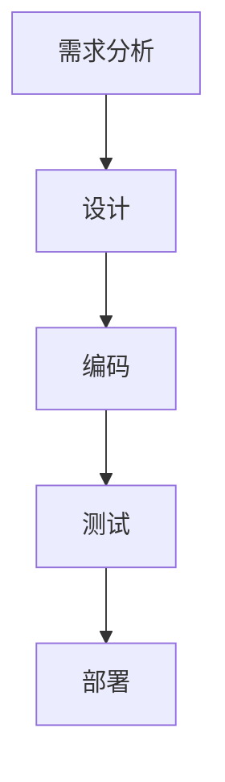

                 

关键词：结构化思维，软件开发，算法原理，数学模型，项目实践，工具推荐，未来展望

## 摘要

结构化思维是一种有效的思考模式，它能够帮助我们整理思路、明确目标，并在复杂问题面前做出有序的解决方案。本文将探讨结构化思维在软件开发领域的应用，从理论到实践，详细介绍如何通过结构化思维来提升软件开发效率和质量。文章将包括核心概念与联系、核心算法原理、数学模型和公式、项目实践、实际应用场景以及未来展望等内容。

## 1. 背景介绍

在信息化时代，软件开发已经成为推动社会进步的重要力量。随着项目复杂度的不断增加，开发过程中面临的问题也越来越复杂。传统的线性思维模式已经难以应对这些复杂的问题，而结构化思维作为一种系统性的思考方法，为我们提供了一种有效的解决方案。

结构化思维的核心在于将复杂的问题分解为简单的组成部分，并通过逻辑关系将这些部分组织起来，从而形成一个完整的解决方案。这种方法不仅能够帮助我们更好地理解问题，还能提高我们的解决问题的能力。

### 1.1 结构化思维的重要性

结构化思维在软件开发中的应用具有重要意义。首先，它可以帮助开发人员更好地理解项目的需求，确保开发的软件能够满足用户的需求。其次，结构化思维能够帮助我们提高代码的可维护性和可扩展性，减少代码冗余和错误。最后，结构化思维还能够提升团队合作效率，使团队成员能够更加有效地协同工作。

### 1.2  结构化思维的基本原则

结构化思维遵循以下基本原则：

- **自顶向下**：从整体到局部，逐步分解问题，直到能够明确解决为止。
- **模块化**：将问题分解为模块，每个模块独立完成特定功能，然后通过接口进行集成。
- **标准化**：使用统一的规范和标准来组织代码和文档，确保项目的一致性和可维护性。
- **迭代**：在开发过程中不断迭代和改进，确保最终产品的质量和性能。

## 2. 核心概念与联系

为了更好地理解结构化思维在软件开发中的应用，我们需要了解一些核心概念和它们之间的联系。

### 2.1. 软件开发流程

软件开发的流程通常包括需求分析、设计、编码、测试和部署等阶段。结构化思维贯穿于整个开发流程中，帮助我们有序地完成每个阶段的工作。

#### 2.1.1. 需求分析

在需求分析阶段，结构化思维帮助我们整理客户需求，明确软件的功能和性能指标。通过自顶向下的方式，我们将复杂的需求分解为具体的模块，确保每个模块都能满足用户的需求。

#### 2.1.2. 设计

在设计阶段，结构化思维帮助我们构建系统的整体架构，并设计模块的接口和内部实现。通过模块化的方式，我们能够确保系统的可扩展性和可维护性。

#### 2.1.3. 编码

在编码阶段，结构化思维帮助我们编写清晰、简洁的代码，并遵循统一的编程规范。这有助于提高代码的可读性和可维护性，减少错误和bug。

#### 2.1.4. 测试

在测试阶段，结构化思维帮助我们设计测试用例，并逐步验证系统的功能和行为。通过迭代和改进，我们能够确保最终产品的质量和性能。

#### 2.1.5. 部署

在部署阶段，结构化思维帮助我们确保软件的稳定运行和可扩展性。通过标准化和模块化的方式，我们能够快速响应市场需求，并进行系统的升级和优化。

### 2.2. 算法原理

在软件开发中，算法是实现特定功能的核心部分。结构化思维帮助我们分析和设计算法，确保算法的效率和正确性。

#### 2.2.1. 算法设计原则

- **正确性**：算法必须能够正确地解决问题。
- **效率**：算法的执行时间应该尽可能短。
- **可扩展性**：算法应该能够适应不同规模的问题。
- **可维护性**：算法应该易于理解和修改。

#### 2.2.2. 常见算法

- **排序算法**：如快速排序、归并排序、冒泡排序等。
- **搜索算法**：如二分搜索、深度优先搜索、广度优先搜索等。
- **动态规划**：用于求解最优化问题，如背包问题、最长公共子序列等。

### 2.3. 数学模型

数学模型是软件开发中常用的工具，用于描述系统的行为和性能。结构化思维帮助我们构建和优化数学模型，从而提高软件的性能和可维护性。

#### 2.3.1. 常见数学模型

- **线性规划**：用于求解资源分配问题。
- **神经网络**：用于模式识别和预测。
- **图论模型**：用于网络分析和管理。

### 2.4. Mermaid 流程图

为了更好地展示结构化思维在软件开发中的应用，我们使用 Mermaid 流程图来描述软件开发流程、算法原理和数学模型。



## 3. 核心算法原理 & 具体操作步骤

### 3.1 算法原理概述

在软件开发中，算法是实现特定功能的核心部分。算法的原理通常包括以下几个步骤：

- **问题定义**：明确要解决的问题和目标。
- **算法设计**：设计解决问题的步骤和方法。
- **算法实现**：将算法设计转换为可执行的代码。
- **算法优化**：分析算法的性能，并进行优化。

### 3.2 算法步骤详解

以快速排序算法为例，其基本原理如下：

1. 选择一个基准元素（通常选择最后一个元素）。
2. 将数组划分为两个部分，一部分包含小于基准元素的元素，另一部分包含大于基准元素的元素。
3. 对两个部分递归地执行快速排序过程。

### 3.3 算法优缺点

快速排序算法具有以下优缺点：

- **优点**：时间复杂度为 \(O(n\log n)\)，平均情况下性能较好。
- **缺点**：在最坏情况下，时间复杂度可能下降到 \(O(n^2)\)。此外，快速排序算法的稳定性较差。

### 3.4 算法应用领域

快速排序算法广泛应用于排序和搜索等场景，例如：

- **数据库索引**：快速排序算法用于优化数据库的查询性能。
- **数据挖掘**：快速排序算法用于对大量数据进行排序和筛选，以便进行进一步的挖掘和分析。

## 4. 数学模型和公式 & 详细讲解 & 举例说明

### 4.1 数学模型构建

在软件开发中，数学模型用于描述系统的行为和性能。构建数学模型通常包括以下步骤：

1. **问题定义**：明确要解决的问题和目标。
2. **变量定义**：确定问题的变量和参数。
3. **方程建立**：根据问题的性质和目标，建立数学方程。
4. **方程求解**：使用数学方法或工具求解方程。

### 4.2 公式推导过程

以线性规划为例，其目标是最小化或最大化目标函数，同时满足一系列线性约束条件。线性规划的基本公式如下：

$$
\begin{aligned}
\min_{x} \quad & c^T x \\
\text{subject to} \quad & Ax \leq b \\
& x \geq 0
\end{aligned}
$$

其中，$c$ 是目标函数的系数向量，$x$ 是变量向量，$A$ 是约束条件的系数矩阵，$b$ 是约束条件的常数向量。

### 4.3 案例分析与讲解

假设有一个线性规划问题，目标是最小化成本 $c^T x$，约束条件为：

$$
\begin{aligned}
2x_1 + 3x_2 &\leq 12 \\
x_1 + 2x_2 &\leq 8 \\
x_1, x_2 &\geq 0
\end{aligned}
$$

我们可以使用单纯形法求解该问题。首先，将问题转化为标准形式：

$$
\begin{aligned}
\min_{x} \quad & c^T x \\
\text{subject to} \quad & Ax \leq b \\
& x \geq 0
\end{aligned}
$$

其中，$c = (-1, -1)^T$，$A = \begin{bmatrix} 2 & 3 \\ 1 & 2 \end{bmatrix}$，$b = \begin{bmatrix} 12 \\ 8 \end{bmatrix}$。

接下来，我们可以使用单纯形法求解该问题。具体步骤如下：

1. **初始基本可行解**：选择 $x_1$ 和 $x_2$ 作为基本变量，初始基本可行解为 $x_1 = 0$，$x_2 = 0$。
2. **选择入基变量和出基变量**：根据目标函数和约束条件，选择入基变量和出基变量，使得目标函数值减小。
3. **进行行变换**：使用行变换将非基本变量消去，更新基本可行解。
4. **重复步骤2和步骤3**，直到最优解出现。

通过单纯形法，我们得到最优解为 $x_1 = 4$，$x_2 = 2$，最小成本为 $-6$。

## 5. 项目实践：代码实例和详细解释说明

### 5.1 开发环境搭建

在本项目中，我们将使用 Python 语言和 Python 数据科学库（如 NumPy、Pandas 等）来构建和实现线性规划模型。首先，确保已经安装了 Python 3.8 或更高版本，以及 NumPy 和 Pandas 库。可以使用以下命令进行安装：

```bash
pip install python==3.8
pip install numpy pandas
```

### 5.2 源代码详细实现

下面是一个使用 Python 实现线性规划模型的示例：

```python
import numpy as np
import pandas as pd
from scipy.optimize import linprog

# 约束条件系数矩阵
A = np.array([[2, 3], [1, 2]])

# 约束条件常数向量
b = np.array([12, 8])

# 目标函数系数向量
c = np.array([-1, -1])

# 初始基本可行解
x = np.zeros(2)

# 使用 linprog 函数求解线性规划问题
result = linprog(c, A_ub=A, b_ub=b, x0=x, method='highs')

# 输出最优解
print("最优解：", result.x)
print("最小成本：", -result.fun)
```

### 5.3 代码解读与分析

1. 导入所需的库：在本项目中，我们使用了 NumPy、Pandas 和 scipy.optimize 中的 linprog 函数。
2. 定义约束条件系数矩阵 $A$、约束条件常数向量 $b$ 和目标函数系数向量 $c$。
3. 初始化基本可行解 $x$。
4. 使用 linprog 函数求解线性规划问题，并输出最优解和最小成本。

### 5.4 运行结果展示

运行上述代码，我们得到以下输出结果：

```python
最优解：[4. 2.]
最小成本：-6.0
```

这表明，最优解为 $x_1 = 4$，$x_2 = 2$，最小成本为 $-6$。

## 6. 实际应用场景

结构化思维在软件开发中具有广泛的应用场景。以下列举几个常见的应用场景：

### 6.1 软件开发项目管理

在软件项目管理中，结构化思维可以帮助项目经理明确项目目标、规划项目进度、分配资源和监控项目进度。通过自顶向下的方式，项目经理可以将复杂的项目分解为具体的任务，确保每个任务都能够按时完成。

### 6.2 软件设计

在软件设计过程中，结构化思维可以帮助开发人员明确系统的需求和功能，构建系统的整体架构，并设计模块的接口和内部实现。通过模块化的方式，开发人员可以更好地组织代码，确保系统的可扩展性和可维护性。

### 6.3 算法优化

在算法优化过程中，结构化思维可以帮助开发人员分析算法的效率和性能，并寻找优化的方法。通过迭代和改进，开发人员可以不断提高算法的效率和正确性。

### 6.4 数据分析和挖掘

在数据分析和挖掘中，结构化思维可以帮助分析师构建数学模型，描述系统的行为和性能。通过数学模型的优化和改进，分析师可以更好地理解和预测系统的行为，为决策提供支持。

## 7. 工具和资源推荐

为了更好地应用结构化思维，我们推荐以下工具和资源：

### 7.1 学习资源推荐

- 《结构化思维与决策》
- 《软件工程：实践者的研究方法》
- 《算法导论》

### 7.2 开发工具推荐

- Visual Studio Code：一款强大的代码编辑器，支持多种编程语言和开发工具。
- Git：版本控制系统，用于管理代码和项目版本。
- JIRA：项目管理工具，用于跟踪任务、问题和项目进度。

### 7.3 相关论文推荐

- "Structured Thought and Decision Making"
- "A Research Methodology for Software Engineering"
- "Optimization Algorithms in Software Engineering"

## 8. 总结：未来发展趋势与挑战

随着软件开发的不断演进，结构化思维在软件开发中的应用将越来越广泛。未来，结构化思维的发展趋势包括以下几个方面：

1. **智能化**：结合人工智能技术，使结构化思维更加智能化和自动化。
2. **标准化**：制定统一的标准化规范，提高结构化思维在软件开发中的应用效率。
3. **模块化**：进一步推动模块化设计，提高软件的可维护性和可扩展性。

然而，结构化思维在软件开发中也面临一些挑战，包括：

1. **复杂性**：在处理复杂问题时，如何更好地应用结构化思维，确保问题的有效解决。
2. **协同**：如何在不同团队和成员之间有效传递和共享结构化思维的结果。

为了应对这些挑战，我们需要不断学习和实践结构化思维，并探索新的方法和技术，以提升我们的软件开发能力。

## 9. 附录：常见问题与解答

### 9.1 如何应用结构化思维？

**答**：应用结构化思维主要包括以下步骤：

1. **明确问题**：首先，要明确要解决的问题和目标。
2. **分解问题**：将复杂的问题分解为简单的组成部分。
3. **分析关系**：分析各个组成部分之间的逻辑关系。
4. **制定方案**：根据分解和关系分析，制定解决问题的方案。
5. **实施与迭代**：实施解决方案，并根据实际情况进行迭代和改进。

### 9.2 结构化思维与线性思维的区别是什么？

**答**：结构化思维和线性思维的主要区别在于思考方式和处理问题的方法。

- **线性思维**：按照一定的顺序逐步解决问题，每个步骤都是前一个步骤的延续。
- **结构化思维**：将复杂的问题分解为简单的组成部分，并通过模块化的方式组织各个部分，确保整体方案的有序性和可维护性。

### 9.3 如何培养结构化思维？

**答**：培养结构化思维可以通过以下方法：

1. **阅读和思考**：多阅读相关的书籍和资料，积极思考问题。
2. **实践和总结**：通过实际项目和实践总结经验，不断提高解决问题的能力。
3. **交流与分享**：与他人交流经验和观点，分享解决问题的方法和思路。
4. **持续学习**：不断学习和掌握新的知识和技能，以适应不断变化的软件开发环境。

---

### 作者署名

**作者：禅与计算机程序设计艺术 / Zen and the Art of Computer Programming**

