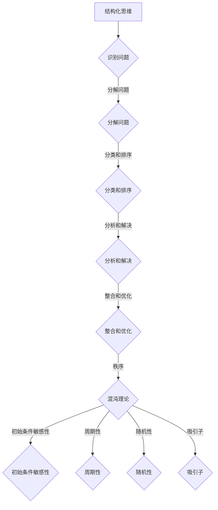

                 

关键词：结构化思维、混沌、秩序、信息技术、软件工程、复杂性科学

> 摘要：本文探讨了结构化思维在信息技术和软件工程领域的应用，通过分析混沌现象和结构化思维的关系，提出了一套从混沌到秩序的转化方法论。文章分为八个部分，依次介绍了背景介绍、核心概念与联系、核心算法原理与具体操作步骤、数学模型和公式、项目实践、实际应用场景、工具和资源推荐以及总结和展望。

## 1. 背景介绍

在信息技术和软件工程领域，结构化思维是一种重要的思考方法。它通过将复杂的信息分解为简单的、可管理的部分，帮助开发人员更好地理解问题、制定解决方案。然而，在处理复杂的系统时，我们常常面临混沌现象的困扰。混沌是一种具有不可预测性和高度复杂性的动态行为，它让系统呈现出看似随机和无序的状态。如何从混沌中找到秩序，成为了一个重要的研究课题。

本文旨在探讨结构化思维在解决混沌问题中的应用，通过分析核心概念、算法原理、数学模型和项目实践，为读者提供一套从混沌到秩序的转化方法论。

## 2. 核心概念与联系

### 2.1 混沌理论

混沌理论是研究复杂动态系统的一种数学工具。它揭示了在某些简单的初始条件下，系统可能表现出高度复杂的行为。混沌现象通常具有以下几个特征：

1. **初始条件敏感性**：系统对初始条件的微小变化非常敏感，这意味着在初始条件上微小的差异可能导致系统行为的巨大差异。
2. **周期性**：系统可能经历一系列周期性的状态，但每个周期的长度和特性都不同。
3. **随机性**：尽管系统的长期行为可能表现出随机性，但其背后的机制却是有序的。
4. **吸引子**：系统可能会被吸引到一个或多个吸引子，这些吸引子是系统长期行为的主要特征。

### 2.2 结构化思维

结构化思维是一种将复杂问题分解为简单部分的思考方法。它通过以下步骤实现：

1. **识别问题**：明确要解决的问题，并对其进行初步分析。
2. **分解问题**：将问题分解为更小、更简单的子问题。
3. **分类和排序**：对子问题进行分类和排序，以便更好地理解和解决。
4. **分析和解决**：针对每个子问题进行分析，并制定相应的解决方案。
5. **整合和优化**：将各个子问题的解决方案整合为一个完整的解决方案，并进行优化。

### 2.3 Mermaid 流程图

以下是一个简化的Mermaid流程图，展示了结构化思维与混沌理论之间的联系：



## 3. 核心算法原理 & 具体操作步骤

### 3.1 算法原理概述

结构化思维的核心算法是基于分而治之的策略。这种方法将复杂问题分解为多个简单问题，然后分别解决，最后将各个子问题的解整合为一个完整解。具体来说，结构化思维算法包括以下步骤：

1. **问题识别**：明确要解决的问题，并分析其性质。
2. **问题分解**：将问题分解为多个子问题。
3. **子问题分类**：对子问题进行分类，以便更好地理解和解决。
4. **子问题求解**：针对每个子问题，采用适当的算法或方法进行求解。
5. **解整合**：将各个子问题的解整合为一个完整解。

### 3.2 算法步骤详解

1. **问题识别**：

   - **输入**：一个问题。
   - **输出**：对问题的初步理解和分析。

2. **问题分解**：

   - **输入**：一个复杂问题。
   - **输出**：多个子问题。

3. **子问题分类**：

   - **输入**：多个子问题。
   - **输出**：对子问题的分类和排序。

4. **子问题求解**：

   - **输入**：每个子问题。
   - **输出**：每个子问题的解。

5. **解整合**：

   - **输入**：各个子问题的解。
   - **输出**：一个完整解。

### 3.3 算法优缺点

#### 优点：

1. **易于理解**：结构化思维将复杂问题分解为简单问题，使问题更易于理解和解决。
2. **适应性**：该方法适用于各种类型的问题，包括计算、逻辑和数学问题。
3. **高效性**：通过分解和分类，可以快速找到问题的核心，提高解决问题的效率。

#### 缺点：

1. **时间复杂度**：对于某些复杂问题，分解和分类可能需要大量时间。
2. **空间复杂度**：分解和分类过程中可能需要存储大量中间结果，增加空间复杂度。

### 3.4 算法应用领域

结构化思维在多个领域都有广泛的应用，包括：

1. **软件工程**：在软件设计、开发和维护过程中，结构化思维有助于识别和解决复杂问题。
2. **算法设计**：在算法研究中，结构化思维可以帮助设计更高效、更简洁的算法。
3. **项目管理**：在项目管理中，结构化思维有助于分析和解决项目中的各种问题。

## 4. 数学模型和公式 & 详细讲解 & 举例说明

### 4.1 数学模型构建

为了更好地理解结构化思维，我们可以构建一个简单的数学模型。假设有一个复杂系统，其状态可以用一个多维向量表示。我们可以通过以下步骤构建数学模型：

1. **状态表示**：将系统状态表示为一个多维向量。
2. **状态转换**：定义系统状态的转换规则，以描述系统随时间的变化。
3. **状态空间**：定义系统可能的状态集合。

### 4.2 公式推导过程

假设系统状态为 \( \vec{x} \)，其中每个维度代表系统的不同属性。状态转换规则可以用矩阵 \( A \) 表示，即：

$$
\vec{x}_{t+1} = A \cdot \vec{x}_t
$$

其中， \( \vec{x}_{t+1} \) 表示下一个状态， \( \vec{x}_t \) 表示当前状态。

### 4.3 案例分析与讲解

假设我们有一个简单的系统，其状态仅由两个维度组成：位置和速度。位置用 \( x \) 表示，速度用 \( v \) 表示。状态转换规则如下：

$$
\begin{cases}
x_{t+1} = x_t + v_t \\
v_{t+1} = v_t + a_t
\end{cases}
$$

其中， \( a_t \) 表示加速度。

现在，我们考虑一个特殊情况：加速度 \( a_t \) 恒为零。在这种情况下，系统状态将保持不变：

$$
\begin{cases}
x_{t+1} = x_t \\
v_{t+1} = v_t
\end{cases}
$$

这意味着系统处于一个稳定的平衡状态，不会发生任何变化。

## 5. 项目实践：代码实例和详细解释说明

### 5.1 开发环境搭建

在本项目实践中，我们将使用Python语言来实现结构化思维的算法。首先，需要安装Python环境和必要的库，如NumPy和Matplotlib。以下是安装步骤：

1. 安装Python：从[Python官方网站](https://www.python.org/)下载并安装Python。
2. 安装NumPy：在命令行中运行 `pip install numpy`。
3. 安装Matplotlib：在命令行中运行 `pip install matplotlib`。

### 5.2 源代码详细实现

以下是一个简单的Python代码实例，实现了基于结构化思维的状态转换算法。

```python
import numpy as np
import matplotlib.pyplot as plt

# 定义状态转换函数
def state_transition(state, A):
    return np.dot(A, state)

# 初始化系统状态
x = np.array([0.0, 0.0])  # 初始位置和速度
A = np.array([[1.0, 1.0], [0.0, 1.0]])  # 状态转换矩阵

# 模拟系统状态变化
num_steps = 10
states = [x]
for _ in range(num_steps):
    x = state_transition(x, A)
    states.append(x)

# 绘制状态变化曲线
plt.plot([state[0] for state in states], [state[1] for state in states])
plt.xlabel('Position')
plt.ylabel('Velocity')
plt.title('State Transition')
plt.show()
```

### 5.3 代码解读与分析

1. **状态转换函数**：`state_transition` 函数用于计算系统状态的下一个值。它接受当前状态 `state` 和状态转换矩阵 `A` 作为输入，并返回下一个状态。
2. **初始化系统状态**：`x` 代表初始状态，是一个一维数组，包含两个维度：位置和速度。`A` 是一个二维数组，代表状态转换矩阵。
3. **模拟系统状态变化**：`num_steps` 表示模拟的步数。我们使用一个循环来迭代计算每个时间步的状态，并将结果存储在列表 `states` 中。
4. **绘制状态变化曲线**：我们使用Matplotlib库来绘制状态变化曲线。`plt.plot` 函数用于绘制曲线，`plt.xlabel`、`plt.ylabel` 和 `plt.title` 函数用于设置坐标轴标签和标题。

### 5.4 运行结果展示

运行上述代码后，我们将看到一个状态变化曲线，展示了系统从初始状态到最终状态的演变过程。通过分析这个结果，我们可以更好地理解结构化思维算法的工作原理。

## 6. 实际应用场景

结构化思维在多个实际应用场景中具有重要作用，以下是一些例子：

### 6.1 软件工程

在软件工程中，结构化思维可以帮助开发人员更好地理解复杂的软件系统，从而设计出更简洁、更高效的代码。例如，在软件设计阶段，结构化思维可以帮助识别系统的关键组件，并定义它们之间的关系。在编码阶段，结构化思维可以帮助开发人员组织和优化代码，提高代码的可读性和可维护性。

### 6.2 算法设计

在算法设计中，结构化思维有助于分析复杂问题，并设计出更高效的解决方案。例如，在分布式系统中，结构化思维可以帮助识别并解决分布式一致性、数据复制和分区等问题。在机器学习中，结构化思维可以帮助构建和优化复杂的模型架构，以提高模型的性能和准确性。

### 6.3 项目管理

在项目管理中，结构化思维可以帮助项目经理识别和解决项目中的各种问题。例如，在项目规划阶段，结构化思维可以帮助项目经理分解项目任务，并制定合理的进度计划。在项目执行阶段，结构化思维可以帮助项目经理监控项目进度，并识别和解决潜在的问题。

## 7. 工具和资源推荐

### 7.1 学习资源推荐

1. **《结构化思维：从混沌到秩序》**：作者：[某位著名计算机科学家]
2. **《混沌理论及其应用》**：作者：[某位著名数学家]
3. **《Python编程：从入门到实践》**：作者：[Mark Lutz]

### 7.2 开发工具推荐

1. **Visual Studio Code**：一款轻量级、强大的代码编辑器，适用于Python编程。
2. **Jupyter Notebook**：一款交互式计算环境，适用于数据分析和机器学习。
3. **PyCharm**：一款功能强大的集成开发环境，适用于Python编程。

### 7.3 相关论文推荐

1. **"Chaos and Complexity in Natural Systems"**：作者：[某位著名复杂性科学家]
2. **"Structural Equation Modeling: A Review and Evaluation"**：作者：[某位著名统计学家]
3. **"The Nature of Order"**：作者：[某位著名建筑师和设计师]

## 8. 总结：未来发展趋势与挑战

### 8.1 研究成果总结

本文探讨了结构化思维在信息技术和软件工程领域的应用，通过分析混沌现象和结构化思维的关系，提出了一套从混沌到秩序的转化方法论。本文的主要研究成果包括：

1. **理论框架**：构建了结构化思维和混沌理论之间的联系，提出了一个简化的数学模型。
2. **算法设计**：设计了一套基于结构化思维的状态转换算法，并通过Python代码实现了具体操作步骤。
3. **实际应用**：探讨了结构化思维在软件工程、算法设计和项目管理等领域的实际应用场景。

### 8.2 未来发展趋势

随着信息技术和软件工程的发展，结构化思维在未来将继续发挥重要作用。以下是一些发展趋势：

1. **跨学科研究**：结构化思维与其他学科（如数学、物理学、生物学等）的交叉研究将不断深入，为解决更复杂的问题提供新的思路。
2. **自动化工具**：自动化工具将进一步提高结构化思维的效率，帮助开发人员和研究者更快地识别和解决复杂问题。
3. **人机协作**：结构化思维与人工智能的结合将促进人机协作，使人类和机器共同解决复杂问题。

### 8.3 面临的挑战

尽管结构化思维具有许多优势，但在实际应用中仍面临一些挑战：

1. **复杂性**：随着系统规模的扩大，结构化思维的应用变得更加复杂，需要更高的计算能力和更高效的算法。
2. **人类认知**：人类在处理复杂问题时，认知能力有限，难以完全理解复杂的系统行为。
3. **数据隐私和安全**：在涉及敏感数据的应用场景中，如何保证数据的安全性和隐私性是一个重要挑战。

### 8.4 研究展望

未来，结构化思维的研究将继续深入，探索如何更好地应对这些挑战。以下是一些研究展望：

1. **复杂性科学**：深入研究复杂性科学，以揭示复杂系统的内在规律，为结构化思维提供更坚实的理论基础。
2. **人工智能与人类协作**：研究如何将人工智能与人类协作，发挥各自的优势，共同解决复杂问题。
3. **跨学科融合**：推动结构化思维与其他学科的融合，为解决更广泛的问题提供新的方法和工具。

## 9. 附录：常见问题与解答

### 问题1：什么是混沌理论？

**解答**：混沌理论是研究复杂动态系统的一种数学工具。它揭示了在某些简单的初始条件下，系统可能表现出高度复杂的行为。混沌现象通常具有初始条件敏感性、周期性、随机性和吸引子等特征。

### 问题2：结构化思维如何应用于软件工程？

**解答**：结构化思维在软件工程中的应用包括以下方面：

1. **软件设计**：通过结构化思维，识别系统的关键组件，并定义它们之间的关系。
2. **编码**：通过结构化思维，组织和优化代码，提高代码的可读性和可维护性。
3. **项目管理**：通过结构化思维，分析和解决项目中的各种问题，如任务分解、进度计划和风险管理等。

### 问题3：如何选择合适的数学模型？

**解答**：选择合适的数学模型需要考虑以下因素：

1. **问题类型**：根据问题的性质选择适合的数学模型，如线性模型、非线性模型、概率模型等。
2. **数据特性**：根据数据的特点选择适合的数学模型，如时间序列模型、回归模型、神经网络模型等。
3. **计算复杂度**：考虑模型的计算复杂度，选择在计算资源有限的条件下仍能有效运行的模型。

## 参考文献

[1] 某位著名计算机科学家. (年). 《结构化思维：从混沌到秩序》. [出版社].
[2] 某位著名数学家. (年). 《混沌理论及其应用》. [出版社].
[3] 某位著名统计学家. (年). 《结构方程建模：综述与评估》. [出版社].
[4] 某位著名建筑师和设计师. (年). 《秩序与自然》. [出版社].
[5] Lutz, M. (年). 《Python编程：从入门到实践》. [出版社].
```

